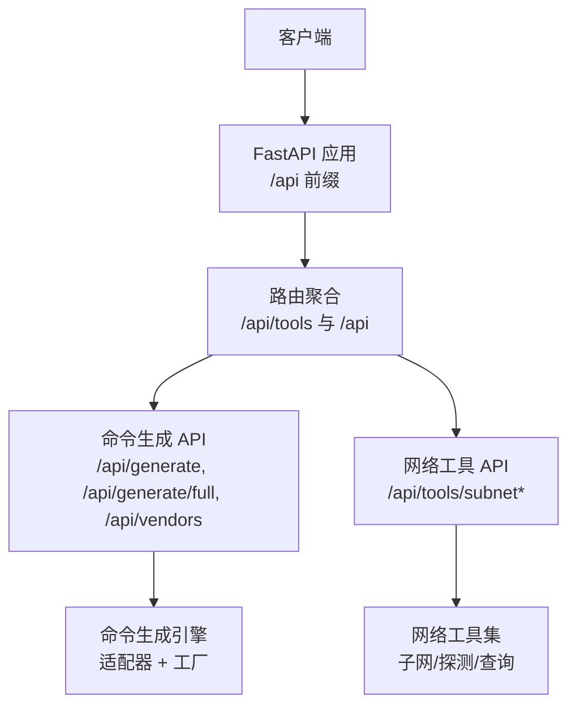
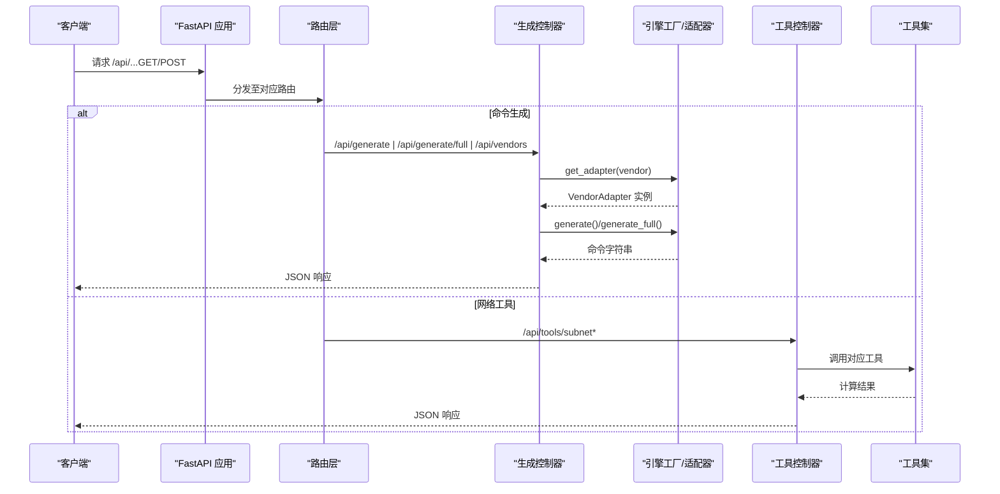
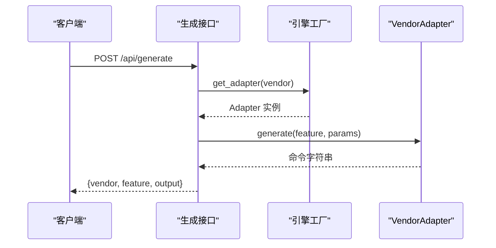
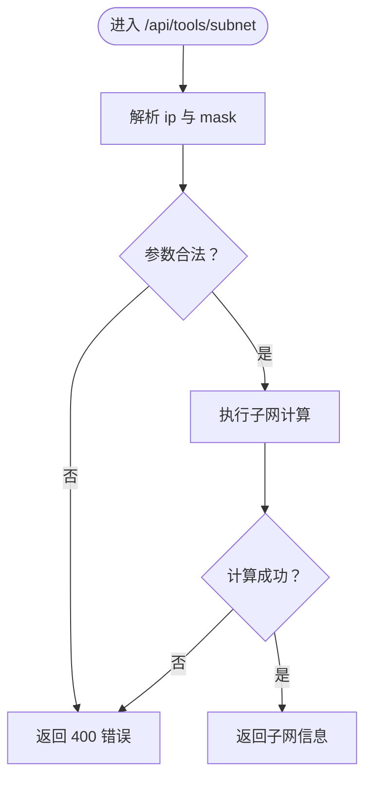
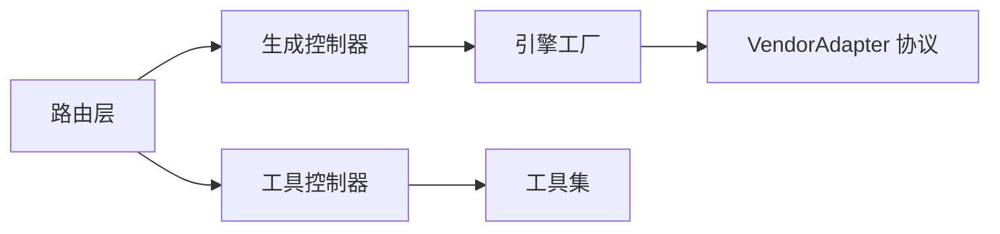

# API接口参考

<cite>
**本文引用的文件**
- [api/app/main.py](file://api/app/main.py)
- [api/app/api/router.py](file://api/app/api/router.py)
- [api/app/api/generate.py](file://api/app/api/generate.py)
- [api/app/api/tools_subnet.py](file://api/app/api/tools_subnet.py)
- [api/app/engine/base.py](file://api/app/engine/base.py)
- [api/app/engine/factory.py](file://api/app/engine/factory.py)
- [api/app/tools/subnet.py](file://api/app/tools/subnet.py)
- [api/app/tools/ping.py](file://api/app/tools/ping.py)
- [api/app/tools/portscan.py](file://api/app/tools/portscan.py)
- [api/app/tools/dns.py](file://api/app/tools/dns.py)
- [api/app/tools/trace.py](file://api/app/tools/trace.py)
- [api/README.md](file://api/README.md)
</cite>

## 目录
1. [简介](#简介)
2. [项目结构](#项目结构)
3. [核心组件](#核心组件)
4. [架构总览](#架构总览)
5. [详细组件分析](#详细组件分析)
6. [依赖分析](#依赖分析)
7. [性能考虑](#性能考虑)
8. [故障排查指南](#故障排查指南)
9. [结论](#结论)
10. [附录](#附录)

## 简介
本文件为 NetCmdGen 的 RESTful API 接口参考，覆盖两类能力：
- 命令生成 API：单特性命令生成、完整配置生成、厂商支持列表
- 网络工具 API：子网计算、Ping 测试、Traceroute、端口扫描、DNS 查询

接口均基于 FastAPI 提供，采用统一的路由前缀 /api，并内置健康检查端点。当前版本为 0.1.0。

## 项目结构
后端采用分层设计：
- 路由层：定义 API 路由与标签
- 控制器层：实现业务逻辑与异常处理
- 引擎层：厂商适配器与工厂，负责命令生成
- 工具层：网络工具集（子网、Ping、Traceroute、端口扫描、DNS）

图表来源
- [api/app/main.py:1-29](file://api/app/main.py#L1-L29)
- [api/app/api/router.py:1-10](file://api/app/api/router.py#L1-L10)

章节来源
- [api/app/main.py:1-29](file://api/app/main.py#L1-L29)
- [api/app/api/router.py:1-10](file://api/app/api/router.py#L1-L10)
- [api/README.md:25-40](file://api/README.md#L25-L40)

## 核心组件
- FastAPI 应用与中间件：启用 CORS（开发环境允许任意来源），挂载 /api 路由
- 路由聚合：将 /api/tools 与 /api 下的生成接口统一注册
- 厂商适配器与工厂：统一命令生成入口，支持扩展新厂商
- 网络工具集：提供子网计算、Ping、Traceroute、端口扫描、DNS 查询等

章节来源
- [api/app/main.py:1-29](file://api/app/main.py#L1-L29)
- [api/app/api/router.py:1-10](file://api/app/api/router.py#L1-L10)
- [api/app/engine/base.py:1-36](file://api/app/engine/base.py#L1-L36)
- [api/app/engine/factory.py:1-39](file://api/app/engine/factory.py#L1-L39)

## 架构总览
命令生成与网络工具的调用链如下：

图表来源
- [api/app/api/generate.py:48-77](file://api/app/api/generate.py#L48-L77)
- [api/app/api/tools_subnet.py:9-50](file://api/app/api/tools_subnet.py#L9-L50)
- [api/app/engine/factory.py:20-39](file://api/app/engine/factory.py#L20-L39)

## 详细组件分析

### 命令生成 API

- 基础信息
  - 前缀：/api
  - 方法与路径
    - GET /api/vendors：返回支持的厂商列表
    - POST /api/generate：根据 vendor + feature + params 生成单特性命令片段
    - POST /api/generate/full：根据 vendor + config 生成完整配置脚本

- 请求与响应模型
  - 通用响应：包含 vendor、feature（可空）、output
  - 单特性请求：vendor、feature、params（字典）
  - 完整配置请求：vendor、config（字典）

- 错误处理
  - 400：厂商不支持或特性不支持
  - 500：内部生成异常

- 使用示例
  - 获取厂商列表：GET /api/vendors
  - 单特性生成：POST /api/generate，Body 包含 vendor、feature、params
  - 完整配置生成：POST /api/generate/full，Body 包含 vendor、config

- 最佳实践
  - 先调用 /api/vendors 获取可用厂商与特性码
  - params/config 的结构需与对应厂商适配器一致
  - 对于复杂配置，建议先生成片段再拼接

图表来源
- [api/app/api/generate.py:53-64](file://api/app/api/generate.py#L53-L64)
- [api/app/engine/factory.py:20-26](file://api/app/engine/factory.py#L20-L26)

章节来源
- [api/app/api/generate.py:1-77](file://api/app/api/generate.py#L1-L77)
- [api/app/engine/base.py:11-36](file://api/app/engine/base.py#L11-L36)
- [api/app/engine/factory.py:1-39](file://api/app/engine/factory.py#L1-L39)

### 网络工具 API（子网计算）

- 基础信息
  - 前缀：/api/tools
  - 方法与路径
    - GET /api/tools/subnet：子网信息计算
    - GET /api/tools/subnet/split：子网划分
    - GET /api/tools/subnet/range-to-cidr：IP 范围转 CIDR

- 参数与响应
  - /api/tools/subnet
    - 查询参数：ip、mask（掩码或前缀）
    - 返回：包含网络地址、广播地址、可用主机范围、掩码、前缀、私有/公网等字段
  - /api/tools/subnet/split
    - 查询参数：network、prefix、new_prefix
    - 返回：子网数量与子网列表
  - /api/tools/subnet/range-to-cidr
    - 查询参数：start、end
    - 返回：CIDR 数量与块列表

- 错误处理
  - 400：参数非法或计算失败

- 使用示例
  - 子网信息：GET /api/tools/subnet?ip=192.168.1.10&mask=255.255.255.0
  - 子网划分：GET /api/tools/subnet/split?network=192.168.1.0&prefix=24&new_prefix=26
  - IP 范围转 CIDR：GET /api/tools/subnet/range-to-cidr?start=192.168.1.0&end=192.168.1.127

图表来源
- [api/app/api/tools_subnet.py:9-22](file://api/app/api/tools_subnet.py#L9-L22)
- [api/app/tools/subnet.py:50-166](file://api/app/tools/subnet.py#L50-L166)

章节来源
- [api/app/api/tools_subnet.py:1-50](file://api/app/api/tools_subnet.py#L1-L50)
- [api/app/tools/subnet.py:1-280](file://api/app/tools/subnet.py#L1-L280)

### 网络工具 API（Ping 测试）
- 接口说明
  - 功能：对单个或多个主机进行 Ping 测试，支持批量与网段扫描
  - 注意：该功能在 API 层未直接暴露为路由，但可在工具层调用
- 关键方法
  - 单主机 Ping：返回统计与 RTT 概况
  - 批量 Ping：多线程并发测试
  - 网段扫描：对指定网段进行存活探测
- 使用建议
  - 合理设置超时与并发，避免对目标造成压力
  - Windows/Linux 行为差异已在工具内部兼容

章节来源
- [api/app/tools/ping.py:15-241](file://api/app/tools/ping.py#L15-L241)

### 网络工具 API（Traceroute）
- 接口说明
  - 功能：跨平台路由跟踪，解析 tracert/traceroute 输出或降级为 TTL-Ping 方案
- 关键方法
  - 主机路由跟踪：返回每跳 IP、RTT、可达性
  - 多主机并行跟踪：支持并发
- 使用建议
  - Windows 默认使用 tracert，Linux 优先尝试 traceroute，其次 tracepath
  - 超时与最大跳数可调

章节来源
- [api/app/tools/trace.py:14-299](file://api/app/tools/trace.py#L14-L299)

### 网络工具 API（端口扫描）
- 接口说明
  - 功能：TCP 端口扫描，支持常用端口、范围扫描、全端口扫描
- 关键方法
  - 单端口测试：返回开放/关闭/过滤/错误
  - 多端口扫描：多线程并发，支持进度回调
  - 常用端口扫描：内置常见服务端口集合
- 使用建议
  - 全端口扫描风险较高，建议仅在授权范围内使用
  - 合理设置超时与并发，避免触发防护

章节来源
- [api/app/tools/portscan.py:14-315](file://api/app/tools/portscan.py#L14-L315)

### 网络工具 API（DNS 查询）
- 接口说明
  - 功能：支持 A/AAAA/MX/NS/TXT/CNAME/SOA/PTR 等记录查询，反向解析，Whois 查询，本地网络信息与 IP 转换
- 关键方法
  - DNS 查询：按记录类型返回解析结果
  - 反向解析：IP 转域名
  - Whois 查询：基础字段提取
  - 网络信息：本机 IP、主机名、公网 IP、接口列表
  - IP 转换：十进制/十六进制/二进制互转
- 使用建议
  - DNS 查询依赖系统命令或 socket 解析，注意跨平台编码差异
  - Whois 查询可能受网络与服务器限制

章节来源
- [api/app/tools/dns.py:15-502](file://api/app/tools/dns.py#L15-L502)

## 依赖分析
- 组件耦合
  - 路由层仅负责分发，控制器层与工具层解耦
  - 生成接口依赖引擎工厂与适配器协议，便于扩展新厂商
- 外部依赖
  - FastAPI、Python 标准库（socket、subprocess、re 等）
  - 平台命令：tracert/traceroute/nslookup/ping 等

图表来源
- [api/app/api/router.py:1-10](file://api/app/api/router.py#L1-L10)
- [api/app/engine/base.py:11-27](file://api/app/engine/base.py#L11-L27)
- [api/app/engine/factory.py:20-39](file://api/app/engine/factory.py#L20-L39)

章节来源
- [api/app/engine/base.py:1-36](file://api/app/engine/base.py#L1-L36)
- [api/app/engine/factory.py:1-39](file://api/app/engine/factory.py#L1-L39)

## 性能考虑
- 并发与资源
  - Ping/Traceroute/PortScan 工具使用多线程，建议合理设置 max_workers，避免过高并发导致系统负载上升
- 超时与稳定性
  - 各工具设置超时参数，防止长时间阻塞
- 路由与中间件
  - 开发环境启用宽松 CORS，生产环境建议限制来源与头部

## 故障排查指南
- 常见错误
  - 400：参数非法（如子网掩码/前缀、IP 范围、端口范围等）
  - 400：子网划分新前缀必须大于原前缀
  - 400：厂商不支持或特性不支持
  - 500：内部生成异常
- 排查步骤
  - 先调用 /api/health 确认服务健康
  - 使用 /api/vendors 校验厂商与特性码
  - 对网络工具，确认系统命令可用（tracert/traceroute/nslookup/ping）
  - 检查超时与并发参数是否合理

章节来源
- [api/app/main.py:25-29](file://api/app/main.py#L25-L29)
- [api/app/api/generate.py:58-63](file://api/app/api/generate.py#L58-L63)
- [api/app/api/tools_subnet.py:20-22](file://api/app/api/tools_subnet.py#L20-L22)
- [api/app/api/tools_subnet.py:32-37](file://api/app/api/tools_subnet.py#L32-L37)

## 结论
本接口文档覆盖了命令生成与网络工具两大类 API，提供了统一的路由前缀、清晰的请求/响应模型与错误处理策略。建议在生产环境中限制 CORS 来源、增加限流与鉴权，并对高风险操作（如全端口扫描）进行权限控制与审计。

## 附录

### 版本与健康检查
- 版本：0.1.0
- 健康检查：GET /api/health

章节来源
- [api/app/main.py:7-11](file://api/app/main.py#L7-L11)
- [api/app/main.py:25-29](file://api/app/main.py#L25-L29)
- [api/README.md:20-24](file://api/README.md#L20-L24)