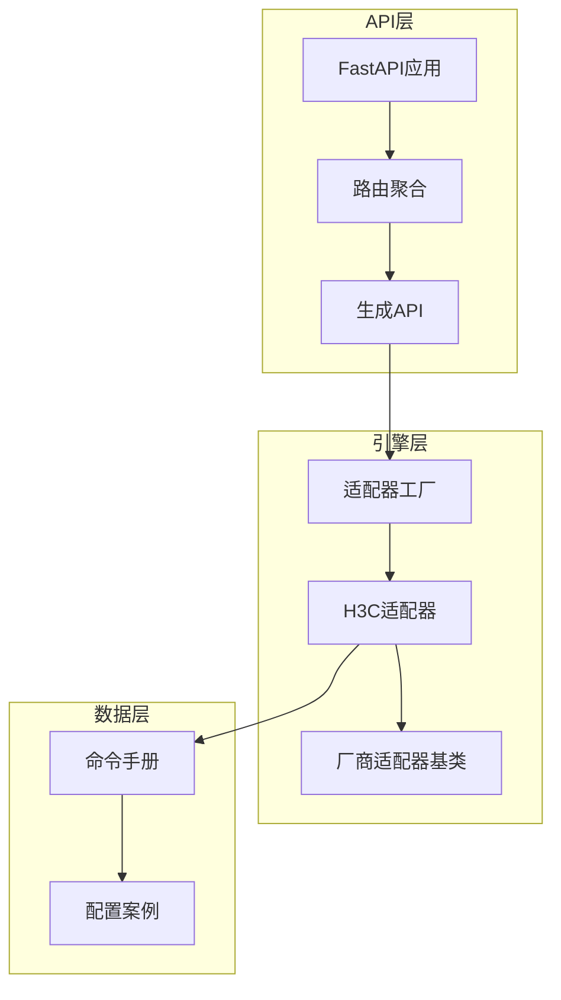
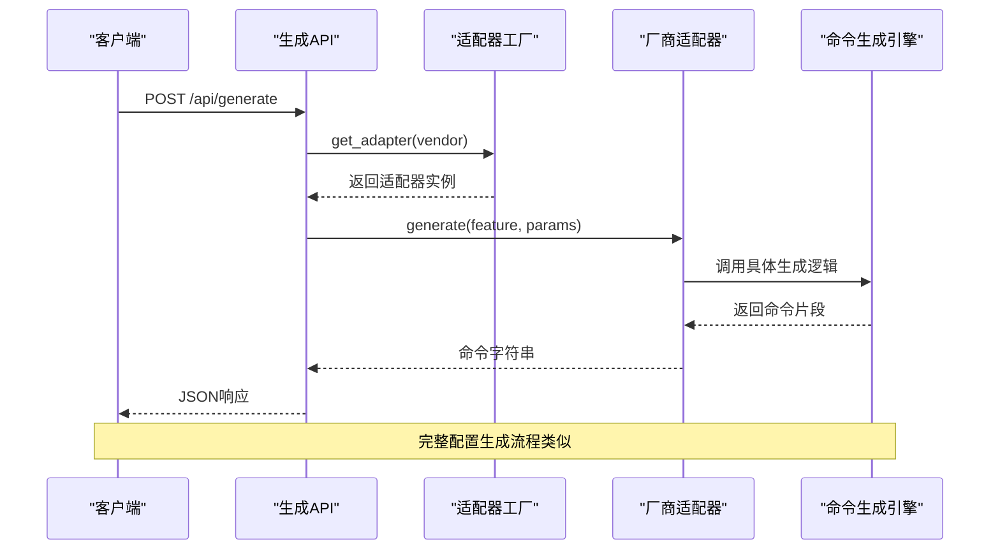
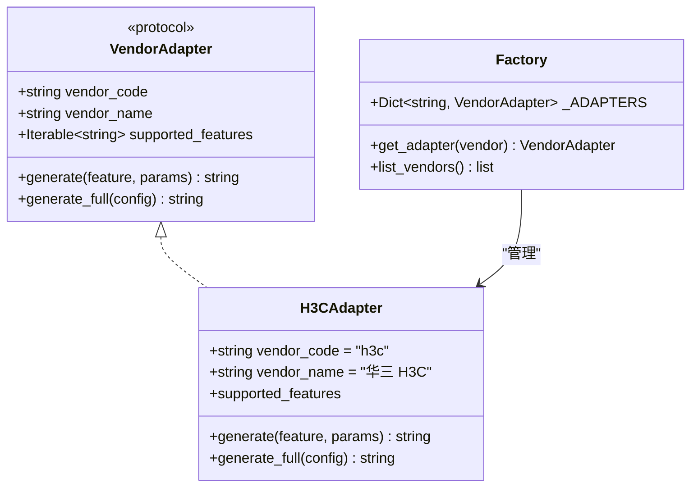
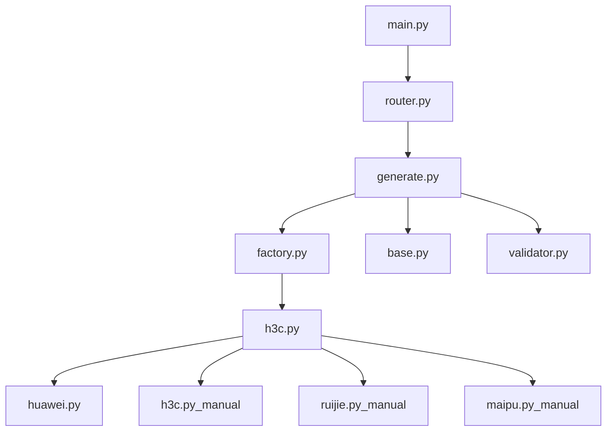
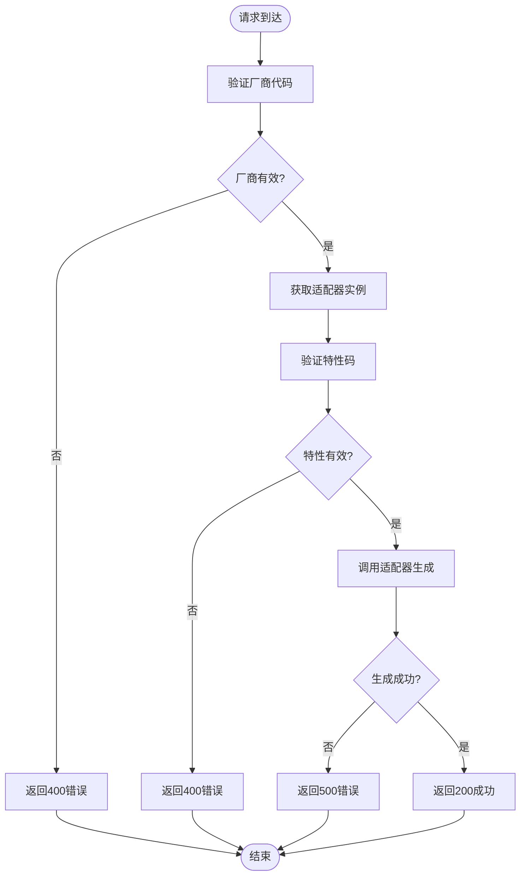

# 命令生成API

<cite>
**本文档引用的文件**
- [generate.py](file://api/app/api/generate.py)
- [router.py](file://api/app/api/router.py)
- [factory.py](file://api/app/engine/factory.py)
- [base.py](file://api/app/engine/base.py)
- [h3c.py](file://api/app/engine/adapters/h3c.py)
- [validator.py](file://api/app/core/validator.py)
- [huawei.py](file://api/app/data/manual/huawei.py)
- [h3c.py](file://api/app/data/manual/h3c.py)
- [ruijie.py](file://api/app/data/manual/ruijie.py)
- [maipu.py](file://api/app/data/manual/maipu.py)
- [sample-h3c-vlan.json](file://api/tests/sample-h3c-vlan.json)
- [sample-h3c-full.json](file://api/tests/sample-h3c-full.json)
- [main.py](file://api/app/main.py)
- [requirements.txt](file://api/requirements.txt)
</cite>

## 目录
1. [简介](#简介)
2. [项目结构](#项目结构)
3. [核心组件](#核心组件)
4. [架构总览](#架构总览)
5. [详细组件分析](#详细组件分析)
6. [依赖关系分析](#依赖关系分析)
7. [性能考虑](#性能考虑)
8. [故障排除指南](#故障排除指南)
9. [结论](#结论)
10. [附录](#附录)

## 简介
本项目提供多厂商网络设备配置命令的自动化生成能力，通过统一的REST API接口，支持按特性生成命令片段以及根据完整配置生成完整脚本。系统采用适配器模式，支持厂商扩展，当前已内置H3C适配器，并预留华为、锐捷、迈普等厂商的扩展空间。

## 项目结构
项目采用FastAPI框架构建，主要目录结构如下：
- api/app/api：API路由与控制器
- api/app/engine：命令生成引擎与适配器
- api/app/data/manual：各厂商命令手册与配置案例
- api/app/core：通用验证器
- api/tests：测试样例与配置示例
- api/requirements.txt：Python依赖包



**图表来源**
- [main.py:1-29](file://api/app/main.py#L1-L29)
- [router.py:1-10](file://api/app/api/router.py#L1-L10)
- [generate.py:1-77](file://api/app/api/generate.py#L1-L77)
- [factory.py:1-39](file://api/app/engine/factory.py#L1-L39)
- [h3c.py:1-42](file://api/app/engine/adapters/h3c.py#L1-L42)

**章节来源**
- [main.py:1-29](file://api/app/main.py#L1-L29)
- [router.py:1-10](file://api/app/api/router.py#L1-L10)

## 核心组件
系统的核心组件包括：

### API控制器
- 提供两个主要接口：单特性命令生成和完整配置生成
- 使用Pydantic模型进行请求参数验证
- 统一的响应格式和错误处理机制

### 适配器工厂
- 采用单例模式管理厂商适配器实例
- 支持动态注册新的厂商适配器
- 提供厂商列表查询功能

### 厂商适配器
- H3C适配器已实现完整的特性映射
- 适配器遵循统一的VendorAdapter协议
- 支持单特性生成和完整配置生成两种模式

**章节来源**
- [generate.py:21-77](file://api/app/api/generate.py#L21-L77)
- [factory.py:14-39](file://api/app/engine/factory.py#L14-L39)
- [base.py:11-36](file://api/app/engine/base.py#L11-L36)
- [h3c.py:14-42](file://api/app/engine/adapters/h3c.py#L14-L42)

## 架构总览
系统采用分层架构设计，通过适配器模式实现多厂商支持：



**图表来源**
- [generate.py:53-77](file://api/app/api/generate.py#L53-L77)
- [factory.py:20-26](file://api/app/engine/factory.py#L20-L26)
- [h3c.py:32-42](file://api/app/engine/adapters/h3c.py#L32-L42)

## 详细组件分析

### API接口规范

#### 单特性命令生成接口
- **URL**: `POST /api/generate`
- **功能**: 根据厂商代码、特性码和参数生成单个特性的命令片段
- **请求参数**:
  - `vendor`: 厂商代码，支持"h3c"
  - `feature`: 特性码，支持"basic"、"vlan"、"routing"、"security"、"interface"、"service"
  - `params`: 特性参数字典，结构与对应厂商生成器一致

- **响应数据**:
  - `vendor`: 厂商代码
  - `feature`: 特性码
  - `output`: 生成的命令字符串

#### 完整配置生成接口
- **URL**: `POST /api/generate/full`
- **功能**: 根据完整配置字典生成完整的配置脚本
- **请求参数**:
  - `vendor`: 厂商代码，支持"h3c"
  - `config`: 完整配置字典，顶层键通常包含description/basic/vlan/routing/security/interface/service

- **响应数据**:
  - `vendor`: 厂商代码
  - `output`: 生成的完整配置脚本

#### 厂商列表查询接口
- **URL**: `GET /api/vendors`
- **功能**: 查询所有已支持的厂商及其特性码
- **响应数据**: 包含厂商代码、名称和特性码列表

**章节来源**
- [generate.py:21-77](file://api/app/api/generate.py#L21-L77)

### 参数验证规则

#### 请求参数验证
系统使用Pydantic模型进行参数验证：
- 必填字段验证
- 数据类型验证
- 枚举值验证（厂商代码、特性码）
- 字典结构验证

#### 错误处理机制
- **400错误**: 厂商不支持或特性不支持
- **500错误**: 生成过程中的内部异常
- **HTTPException**: 统一的异常处理返回格式

**章节来源**
- [generate.py:53-77](file://api/app/api/generate.py#L53-L77)

### 适配器工厂工作原理

#### 工厂设计模式
适配器工厂采用单例模式，确保适配器实例的复用和线程安全：
- `_ADAPTERS`字典存储已注册的适配器实例
- `get_adapter()`方法根据厂商代码获取对应的适配器
- `list_vendors()`方法返回所有已注册厂商的信息

#### 扩展机制
新增厂商适配器的步骤：
1. 在`app/engine/adapters/`目录下创建新的适配器文件
2. 实现`VendorAdapter`协议
3. 在工厂文件中注册适配器



**图表来源**
- [base.py:11-36](file://api/app/engine/base.py#L11-L36)
- [h3c.py:14-42](file://api/app/engine/adapters/h3c.py#L14-L42)
- [factory.py:14-39](file://api/app/engine/factory.py#L14-L39)

**章节来源**
- [factory.py:1-39](file://api/app/engine/factory.py#L1-L39)
- [base.py:1-36](file://api/app/engine/base.py#L1-L36)

### 厂商适配器实现

#### H3C适配器
H3C适配器实现了完整的特性映射：
- `basic`: 基础配置生成
- `vlan`: VLAN配置生成  
- `routing`: 路由配置生成
- `security`: 安全配置生成
- `interface`: 接口配置生成
- `service`: 服务配置生成

每个特性码映射到对应的H3CConfigGenerator静态方法。

**章节来源**
- [h3c.py:14-42](file://api/app/engine/adapters/h3c.py#L14-L42)

### 命令手册与配置案例

#### 命令手册结构
各厂商命令手册采用层次化的字典结构：
- 顶级键表示配置类别（如"基础配置"、"接口配置"）
- 二级键表示具体配置模块（如"系统管理"、"VLAN接口"）
- 三级键包含命令详情：command、description、example

#### 配置案例
每个厂商提供多个典型配置案例，包含完整的命令序列和说明。

**章节来源**
- [huawei.py:7-342](file://api/app/data/manual/huawei.py#L7-L342)
- [h3c.py:7-333](file://api/app/data/manual/h3c.py#L7-L333)
- [ruijie.py:16-800](file://api/app/data/manual/ruijie.py#L16-L800)
- [maipu.py:16-328](file://api/app/data/manual/maipu.py#L16-L328)

## 依赖关系分析

### 外部依赖
项目的主要外部依赖包括：
- **FastAPI**: Web框架，提供异步API服务
- **Pydantic**: 数据验证和序列化
- **Uvicorn**: ASGI服务器

### 内部模块依赖



**图表来源**
- [main.py:1-29](file://api/app/main.py#L1-L29)
- [router.py:1-10](file://api/app/api/router.py#L1-L10)
- [generate.py:1-77](file://api/app/api/generate.py#L1-L77)
- [factory.py:1-39](file://api/app/engine/factory.py#L1-L39)
- [h3c.py:1-42](file://api/app/engine/adapters/h3c.py#L1-L42)

**章节来源**
- [requirements.txt:1-5](file://api/requirements.txt#L1-L5)

## 性能考虑
- **适配器复用**: 适配器采用单例模式，避免重复创建实例
- **异步处理**: 基于FastAPI的异步架构，支持高并发请求
- **内存优化**: 命令手册采用静态数据结构，减少内存占用
- **响应缓存**: 可根据需要实现响应缓存机制

## 故障排除指南

### 常见错误及解决方案

#### 厂商不支持错误
- **错误码**: 400 Bad Request
- **原因**: 请求的厂商代码不在支持列表中
- **解决**: 检查厂商代码是否正确，或等待新厂商适配器支持

#### 特性不支持错误  
- **错误码**: 400 Bad Request
- **原因**: 请求的特性码不在该厂商的支持范围内
- **解决**: 检查特性码是否正确，或查看厂商支持的特性列表

#### 生成失败错误
- **错误码**: 500 Internal Server Error
- **原因**: 命令生成过程中的未知异常
- **解决**: 检查输入参数格式，查看服务器日志获取详细信息

### 参数验证流程



**图表来源**
- [generate.py:53-77](file://api/app/api/generate.py#L53-L77)

**章节来源**
- [generate.py:53-77](file://api/app/api/generate.py#L53-L77)

## 结论
本命令生成API提供了标准化的多厂商网络配置命令生成功能，具有以下特点：
- 统一的API接口设计，支持单特性生成和完整配置生成
- 基于适配器模式的可扩展架构，易于新增厂商支持
- 完善的参数验证和错误处理机制
- 丰富的厂商命令手册和配置案例

系统适用于网络自动化、配置管理、运维工具集成等多种应用场景。

## 附录

### API使用示例

#### 单特性生成示例
```json
{
  "vendor": "h3c",
  "feature": "vlan",
  "params": {
    "vlans": [
      {"id": 10, "name": "Office"}
    ],
    "interfaces": [
      {"interface": "GigabitEthernet1/0/1", "link_type": "access", "vlan_id": 10}
    ]
  }
}
```

#### 完整配置生成示例
```json
{
  "vendor": "h3c", 
  "config": {
    "description": "Demo H3C Switch",
    "basic": {
      "hostname": "SW-CORE-01",
      "enable_ssh": true,
      "ssh_user": {"username": "admin", "password": "Admin@123"}
    },
    "vlan": {
      "vlans": [{"id": 10, "name": "Office"}],
      "interfaces": [
        {"interface": "GigabitEthernet1/0/1", "link_type": "access", "vlan_id": 10}
      ]
    }
  }
}
```

### 厂商支持矩阵
- **H3C**: 完整支持（基础配置、VLAN、路由、安全、接口、服务）
- **华为**: 命令手册完备，适配器待实现
- **锐捷**: 命令手册完备，适配器待实现  
- **迈普**: 命令手册完备，适配器待实现

**章节来源**
- [sample-h3c-vlan.json:1-19](file://api/tests/sample-h3c-vlan.json#L1-L19)
- [sample-h3c-full.json:1-26](file://api/tests/sample-h3c-full.json#L1-L26)