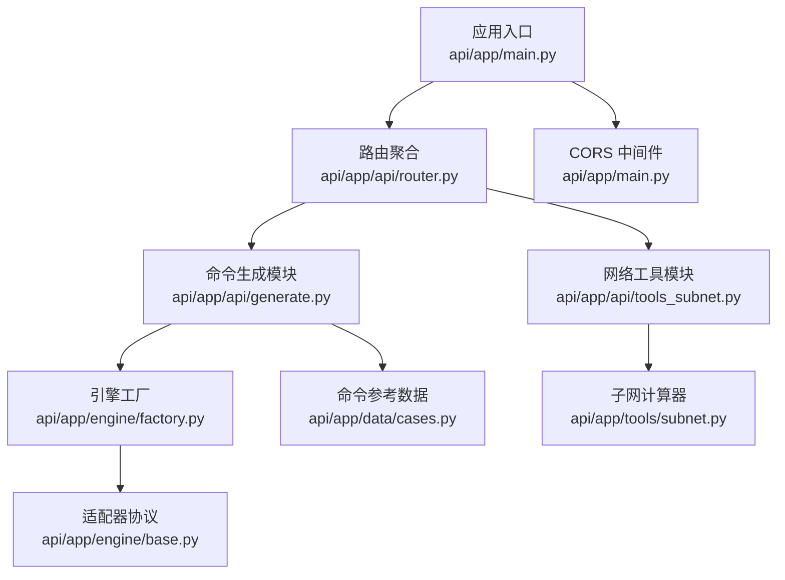
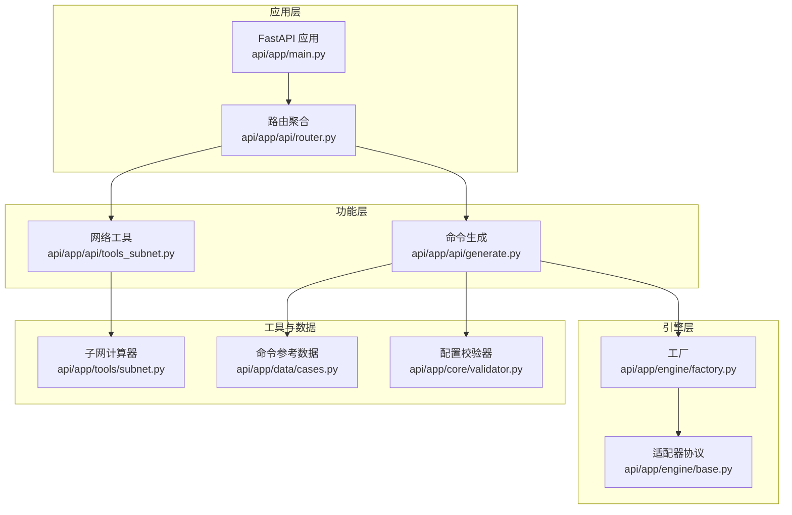
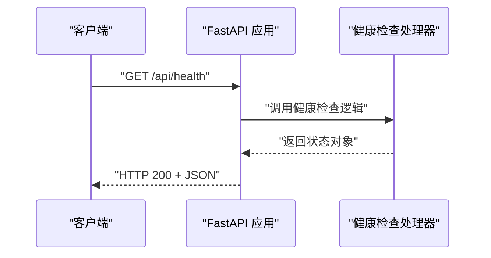
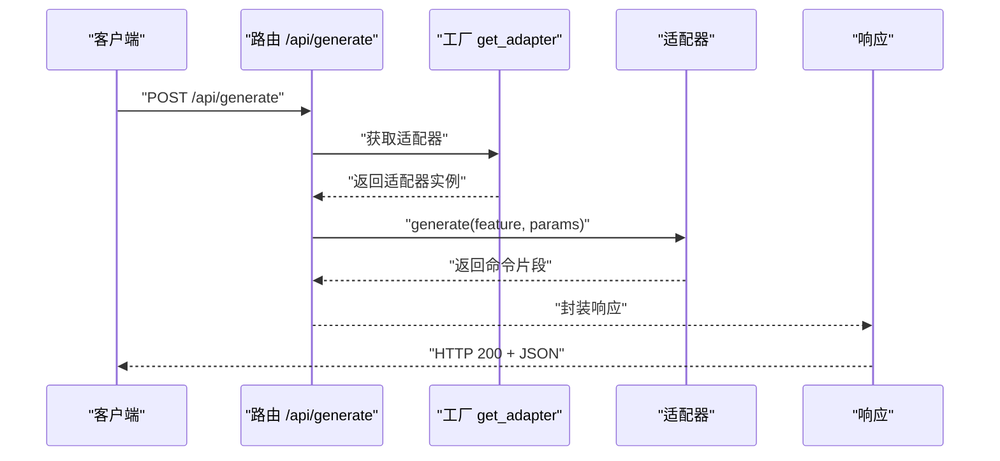
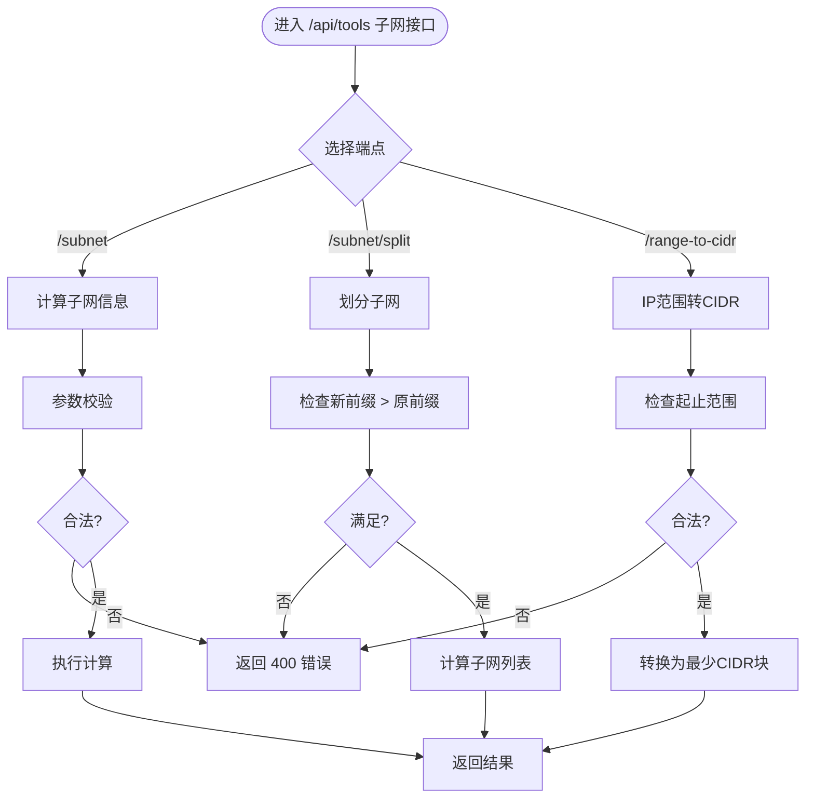
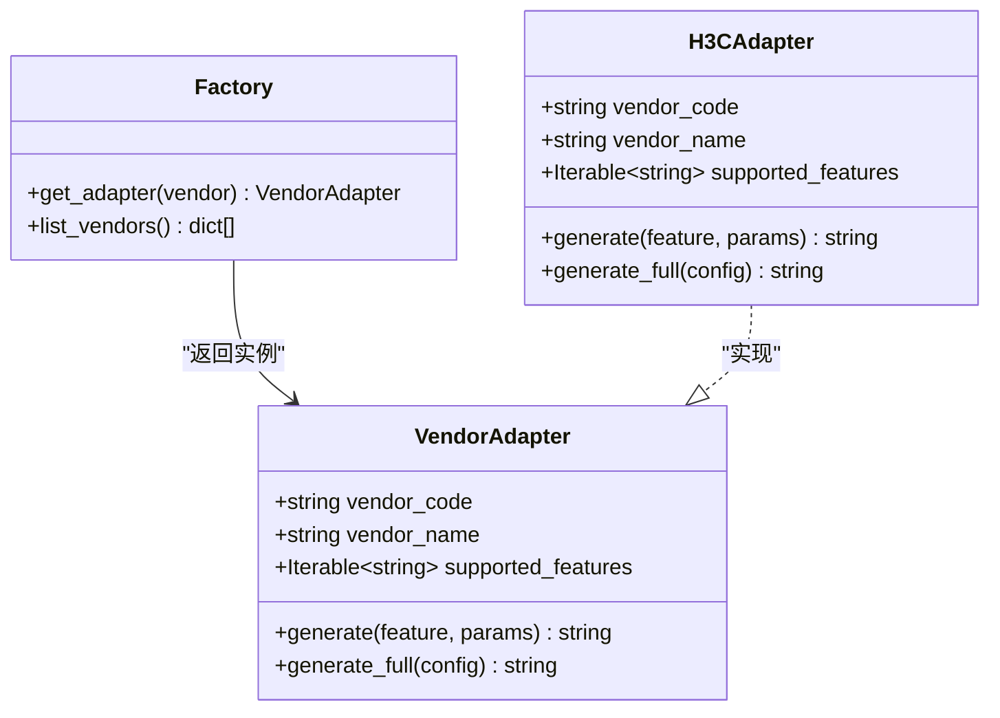
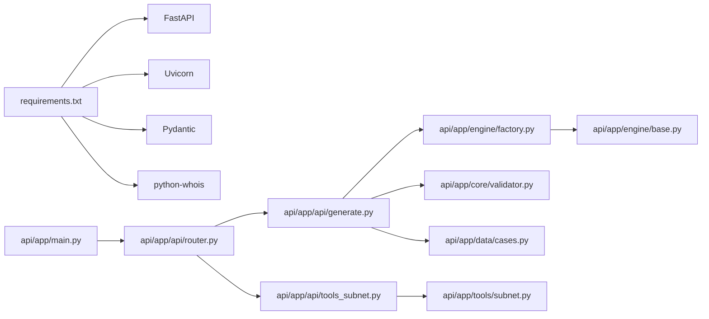

# 系统管理API

<cite>
**本文档引用的文件**
- [api/app/main.py](file://api/app/main.py)
- [api/app/api/router.py](file://api/app/api/router.py)
- [api/app/api/generate.py](file://api/app/api/generate.py)
- [api/app/api/tools_subnet.py](file://api/app/api/tools_subnet.py)
- [api/app/engine/base.py](file://api/app/engine/base.py)
- [api/app/engine/factory.py](file://api/app/engine/factory.py)
- [api/app/tools/subnet.py](file://api/app/tools/subnet.py)
- [api/app/core/validator.py](file://api/app/core/validator.py)
- [api/app/data/cases.py](file://api/app/data/cases.py)
- [api/README.md](file://api/README.md)
- [api/requirements.txt](file://api/requirements.txt)
</cite>

## 目录
1. [简介](#简介)
2. [项目结构](#项目结构)
3. [核心组件](#核心组件)
4. [架构总览](#架构总览)
5. [详细组件分析](#详细组件分析)
6. [依赖关系分析](#依赖关系分析)
7. [性能考量](#性能考量)
8. [故障排除指南](#故障排除指南)
9. [结论](#结论)
10. [附录](#附录)

## 简介
本文件面向系统管理员与开发者，提供 NetCmdGen 后端服务的系统管理相关 API 文档。内容涵盖：
- 系统状态查询与健康检查
- 版本信息与元数据
- 命令生成与网络工具的管理接口
- 访问权限、认证方式与安全建议
- 运行状态监控、资源使用与性能指标的查询接口
- 使用示例与集成指南
- 配置选项与环境变量设置
- 故障排除与调试技巧

该服务基于 FastAPI 构建，提供简洁的 REST API，并通过统一的适配器工厂管理多厂商命令生成能力。

## 项目结构
后端服务采用分层组织：
- 应用入口与中间件：FastAPI 应用实例、CORS 中间件、根路径健康检查
- 路由聚合：将不同功能模块的路由整合到统一前缀下
- 功能模块：
  - 命令生成：支持按特性生成命令片段与按完整配置生成脚本
  - 网络工具：子网计算、子网划分、IP 范围转 CIDR
- 引擎层：统一适配器协议与工厂，负责厂商适配器的注册与调度
- 工具与校验：子网计算器、配置校验器
- 数据与手册：厂商命令参考、最佳实践、快捷键

图表来源
- [api/app/main.py:1-29](file://api/app/main.py#L1-L29)
- [api/app/api/router.py:1-10](file://api/app/api/router.py#L1-L10)
- [api/app/api/generate.py:1-77](file://api/app/api/generate.py#L1-L77)
- [api/app/api/tools_subnet.py:1-50](file://api/app/api/tools_subnet.py#L1-L50)
- [api/app/engine/factory.py:1-39](file://api/app/engine/factory.py#L1-L39)
- [api/app/engine/base.py:1-36](file://api/app/engine/base.py#L1-L36)
- [api/app/tools/subnet.py:1-280](file://api/app/tools/subnet.py#L1-L280)
- [api/app/data/cases.py:1-377](file://api/app/data/cases.py#L1-L377)

章节来源
- [api/app/main.py:1-29](file://api/app/main.py#L1-L29)
- [api/app/api/router.py:1-10](file://api/app/api/router.py#L1-L10)
- [api/README.md:1-47](file://api/README.md#L1-L47)

## 核心组件
- 应用入口与健康检查
  - 提供根级健康检查端点，用于服务存活探测
  - 配置开发期 CORS，允许任意来源访问
- 路由聚合
  - 将工具类与生成类路由统一挂载至 /api 前缀
- 命令生成 API
  - 支持按厂商与特性生成命令片段
  - 支持按完整配置生成脚本
  - 支持查询已支持厂商列表
- 网络工具 API
  - 子网信息计算
  - 子网划分
  - IP 范围转 CIDR
- 引擎与适配器
  - 统一适配器协议定义
  - 工厂注册与调度，支持扩展新厂商
- 工具与校验
  - 子网计算器：IP/掩码互转、网络计算、CIDR 转换
  - 配置校验器：IP、掩码、VLAN、接口、MAC、主机名、密码、端口、AS 号、通配掩码等

章节来源
- [api/app/main.py:25-29](file://api/app/main.py#L25-L29)
- [api/app/api/router.py:8-9](file://api/app/api/router.py#L8-L9)
- [api/app/api/generate.py:48-77](file://api/app/api/generate.py#L48-L77)
- [api/app/api/tools_subnet.py:9-50](file://api/app/api/tools_subnet.py#L9-L50)
- [api/app/engine/base.py:11-36](file://api/app/engine/base.py#L11-L36)
- [api/app/engine/factory.py:20-39](file://api/app/engine/factory.py#L20-L39)
- [api/app/tools/subnet.py:51-280](file://api/app/tools/subnet.py#L51-L280)
- [api/app/core/validator.py:11-208](file://api/app/core/validator.py#L11-L208)

## 架构总览
系统采用“应用入口 → 路由聚合 → 功能模块 → 引擎/工具”的分层架构。命令生成通过工厂模式选择对应厂商适配器，网络工具通过独立计算器模块提供计算能力。

图表来源
- [api/app/main.py:1-29](file://api/app/main.py#L1-L29)
- [api/app/api/router.py:1-10](file://api/app/api/router.py#L1-L10)
- [api/app/api/generate.py:1-77](file://api/app/api/generate.py#L1-L77)
- [api/app/api/tools_subnet.py:1-50](file://api/app/api/tools_subnet.py#L1-L50)
- [api/app/engine/factory.py:1-39](file://api/app/engine/factory.py#L1-L39)
- [api/app/engine/base.py:1-36](file://api/app/engine/base.py#L1-L36)
- [api/app/tools/subnet.py:1-280](file://api/app/tools/subnet.py#L1-L280)
- [api/app/data/cases.py:1-377](file://api/app/data/cases.py#L1-L377)
- [api/app/core/validator.py:1-208](file://api/app/core/validator.py#L1-L208)

## 详细组件分析

### 健康检查与系统状态
- 端点：GET /api/health
- 功能：返回服务存活状态与服务标识
- 返回：包含状态与服务名的对象
- 用途：容器编排、负载均衡探活、CI/CD 健康检查

图表来源
- [api/app/main.py:25-29](file://api/app/main.py#L25-L29)

章节来源
- [api/app/main.py:25-29](file://api/app/main.py#L25-L29)
- [api/README.md:20-24](file://api/README.md#L20-L24)

### 命令生成 API
- 路由前缀：/api/generate
- 端点：
  - GET /vendors：列出已支持厂商及其特性码
  - POST /generate：按厂商与特性生成命令片段
  - POST /generate/full：按完整配置生成脚本
- 请求模型：
  - GenerateRequest：vendor、feature、params
  - GenerateFullRequest：vendor、config
- 响应模型：
  - GenerateResponse：vendor、feature（可选）、output
- 错误处理：
  - 厂商不支持：400
  - 特性不支持：400
  - 其他异常：500

图表来源
- [api/app/api/generate.py:53-77](file://api/app/api/generate.py#L53-L77)
- [api/app/engine/factory.py:20-26](file://api/app/engine/factory.py#L20-L26)
- [api/app/engine/base.py:19-27](file://api/app/engine/base.py#L19-L27)

章节来源
- [api/app/api/generate.py:1-77](file://api/app/api/generate.py#L1-L77)
- [api/app/engine/base.py:11-36](file://api/app/engine/base.py#L11-L36)
- [api/app/engine/factory.py:20-39](file://api/app/engine/factory.py#L20-L39)

### 网络工具 API（子网）
- 路由前缀：/api/tools
- 端点：
  - GET /subnet：计算子网信息（IP + 掩码或前缀）
  - GET /subnet/split：按新前缀长度划分子网
  - GET /subnet/range-to-cidr：IP 范围转最少 CIDR 块
- 输入参数：
  - /subnet：ip、mask
  - /subnet/split：network、prefix、new_prefix
  - /subnet/range-to-cidr：start、end
- 错误处理：参数非法或计算失败时返回 400

图表来源
- [api/app/api/tools_subnet.py:9-50](file://api/app/api/tools_subnet.py#L9-L50)
- [api/app/tools/subnet.py:51-280](file://api/app/tools/subnet.py#L51-L280)

章节来源
- [api/app/api/tools_subnet.py:1-50](file://api/app/api/tools_subnet.py#L1-L50)
- [api/app/tools/subnet.py:11-280](file://api/app/tools/subnet.py#L11-L280)

### 引擎与适配器
- 适配器协议：定义厂商代码、名称、支持特性集合，以及生成命令片段与完整配置脚本的方法
- 工厂：集中注册与获取适配器，支持扩展新厂商
- 当前注册：H3C 适配器（无状态对象，可复用）

图表来源
- [api/app/engine/base.py:11-36](file://api/app/engine/base.py#L11-L36)
- [api/app/engine/factory.py:15-26](file://api/app/engine/factory.py#L15-L26)

章节来源
- [api/app/engine/base.py:1-36](file://api/app/engine/base.py#L1-L36)
- [api/app/engine/factory.py:1-39](file://api/app/engine/factory.py#L1-L39)

### 配置校验与数据参考
- 配置校验器：提供 IP、掩码、VLAN、接口、MAC、主机名、密码、端口、AS 号、通配掩码等校验方法
- 命令参考数据：包含华为、H3C、锐捷、迈普等厂商的基础、VLAN、路由、安全、接口、管理等配置命令模板与示例

章节来源
- [api/app/core/validator.py:11-208](file://api/app/core/validator.py#L11-L208)
- [api/app/data/cases.py:7-324](file://api/app/data/cases.py#L7-L324)

## 依赖关系分析
- 外部依赖：FastAPI、Uvicorn、Pydantic、python-whois
- 内部依赖：
  - 应用入口依赖路由聚合
  - 路由聚合依赖命令生成与网络工具模块
  - 命令生成依赖引擎工厂与适配器协议
  - 网络工具依赖子网计算器
  - 命令生成可结合配置校验器与命令参考数据

图表来源
- [api/requirements.txt:1-5](file://api/requirements.txt#L1-L5)
- [api/app/main.py:1-29](file://api/app/main.py#L1-L29)
- [api/app/api/router.py:1-10](file://api/app/api/router.py#L1-L10)
- [api/app/api/generate.py:1-77](file://api/app/api/generate.py#L1-L77)
- [api/app/api/tools_subnet.py:1-50](file://api/app/api/tools_subnet.py#L1-L50)
- [api/app/engine/factory.py:1-39](file://api/app/engine/factory.py#L1-L39)
- [api/app/engine/base.py:1-36](file://api/app/engine/base.py#L1-L36)
- [api/app/tools/subnet.py:1-280](file://api/app/tools/subnet.py#L1-L280)
- [api/app/core/validator.py:1-208](file://api/app/core/validator.py#L1-L208)
- [api/app/data/cases.py:1-377](file://api/app/data/cases.py#L1-L377)

章节来源
- [api/requirements.txt:1-5](file://api/requirements.txt#L1-L5)
- [api/app/main.py:1-29](file://api/app/main.py#L1-L29)

## 性能考量
- 适配器为无状态对象，工厂以单例字典缓存，避免重复初始化，降低内存占用与提升响应速度
- 子网计算采用位运算与预构建掩码映射，时间复杂度低，适合高频调用
- 建议：
  - 对外暴露的端点尽量无状态、纯计算，减少外部依赖
  - 在生产环境启用更严格的 CORS 策略与限流
  - 对大体量配置生成任务进行异步化与队列化

## 故障排除指南
- 健康检查失败
  - 检查服务是否正常启动与端口占用
  - 确认 CORS 设置是否允许目标来源
- 命令生成失败
  - 确认厂商代码拼写与大小写
  - 检查特性码是否在厂商支持列表中
  - 核对参数结构与类型
- 子网计算错误
  - 检查 IP 与掩码格式，确认掩码为有效连续位
  - 检查前缀长度范围（0-32）
  - IP 范围转 CIDR 时确保起止顺序正确
- 配置校验失败
  - 使用内置校验器逐项检查字段格式与取值范围
- 日志与调试
  - 生产环境建议开启日志记录与错误追踪
  - 使用 OpenAPI 文档页面进行接口自测

章节来源
- [api/app/main.py:14-20](file://api/app/main.py#L14-L20)
- [api/app/api/generate.py:58-64](file://api/app/api/generate.py#L58-L64)
- [api/app/api/tools_subnet.py:20-22](file://api/app/api/tools_subnet.py#L20-L22)
- [api/app/tools/subnet.py:82-103](file://api/app/tools/subnet.py#L82-L103)
- [api/app/core/validator.py:14-31](file://api/app/core/validator.py#L14-L31)

## 结论
本系统管理 API 以清晰的分层架构与统一的适配器模式，提供了命令生成与网络工具两大核心能力。通过健康检查、厂商列表查询与子网工具，满足日常运维与自动化集成需求。建议在生产环境中强化安全策略与监控告警，持续扩展厂商适配器以覆盖更多设备形态。

## 附录

### API 列表与说明
- 健康检查
  - 方法：GET
  - 路径：/api/health
  - 说明：服务存活检测
- 命令生成
  - 方法：GET
  - 路径：/api/generate/vendors
  - 说明：列出已支持厂商及特性码
  - 方法：POST
  - 路径：/api/generate
  - 说明：按厂商与特性生成命令片段
  - 方法：POST
  - 路径：/api/generate/full
  - 说明：按完整配置生成脚本
- 网络工具（子网）
  - 方法：GET
  - 路径：/api/tools/subnet
  - 说明：计算子网信息（IP + 掩码或前缀）
  - 方法：GET
  - 路径：/api/tools/subnet/split
  - 说明：按新前缀划分子网
  - 方法：GET
  - 路径：/api/tools/subnet/range-to-cidr
  - 说明：IP 范围转最少 CIDR 块

章节来源
- [api/app/main.py:25-29](file://api/app/main.py#L25-L29)
- [api/app/api/generate.py:48-77](file://api/app/api/generate.py#L48-L77)
- [api/app/api/tools_subnet.py:9-50](file://api/app/api/tools_subnet.py#L9-L50)

### 访问权限、认证与安全
- 权限与认证
  - 默认未内置鉴权机制，建议在网关或反向代理层启用认证与授权
  - 生产环境建议启用 HTTPS、严格 CORS 策略与速率限制
- 安全建议
  - 限制可访问来源与方法
  - 对敏感参数进行最小化暴露
  - 记录操作日志并设置审计策略

章节来源
- [api/app/main.py:14-20](file://api/app/main.py#L14-L20)
- [api/README.md:20-24](file://api/README.md#L20-L24)

### 运行状态监控、资源使用与性能指标
- 健康检查端点可用于存活探针
- 建议结合外部监控系统（如 Prometheus/Grafana）采集请求量、延迟与错误率
- 对命令生成与子网计算接口进行采样统计，识别热点与瓶颈

章节来源
- [api/app/main.py:25-29](file://api/app/main.py#L25-L29)

### 使用示例与集成指南
- 启动与访问
  - 同步 NetOps-toolkit 可复用代码
  - 安装依赖
  - 启动开发服务器
  - 访问健康检查与接口文档
- 示例请求
  - 获取厂商列表
  - 生成命令片段
  - 子网信息计算
  - 子网划分
  - IP 范围转 CIDR

章节来源
- [api/README.md:7-24](file://api/README.md#L7-L24)

### 配置选项与环境变量
- 依赖安装：requirements.txt
- 运行时可通过环境变量调整端口与服务器参数（Uvicorn 支持的标准环境变量）
- 建议在容器化部署时通过环境变量注入配置

章节来源
- [api/requirements.txt:1-5](file://api/requirements.txt#L1-L5)
- [api/README.md:16-18](file://api/README.md#L16-L18)