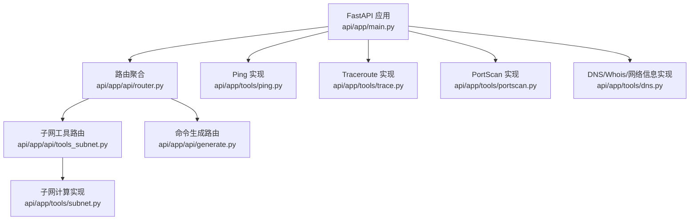
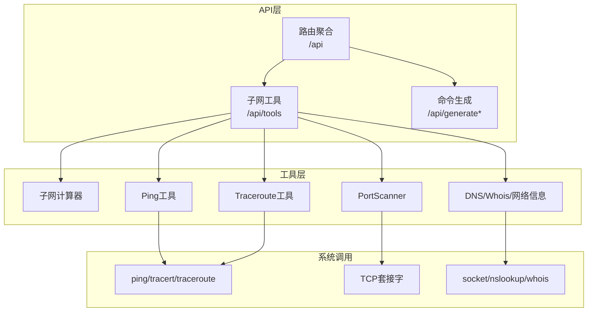
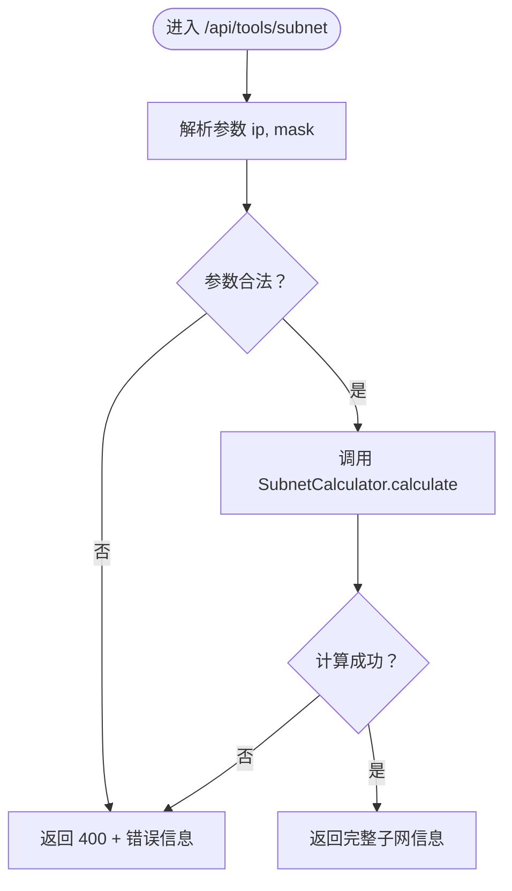
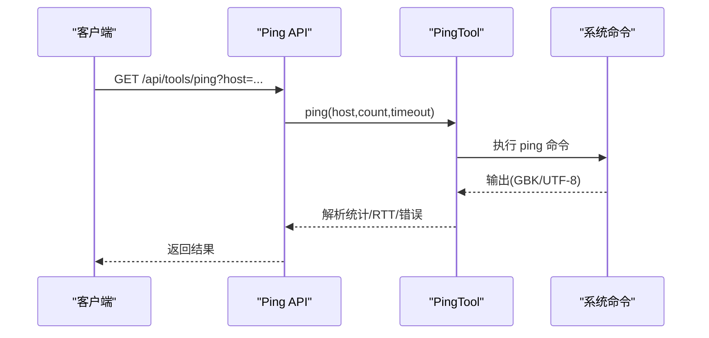
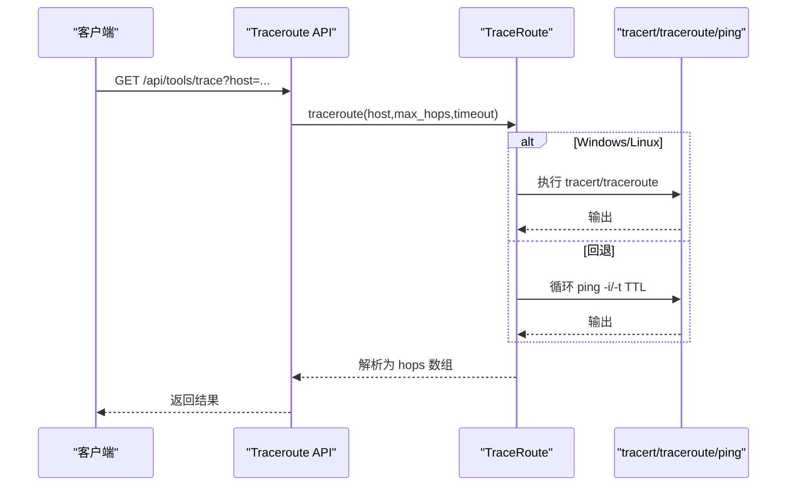
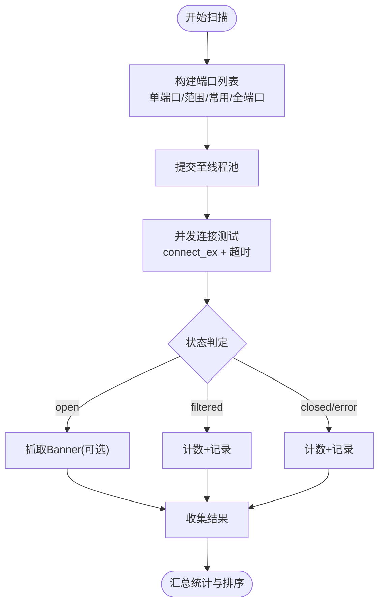
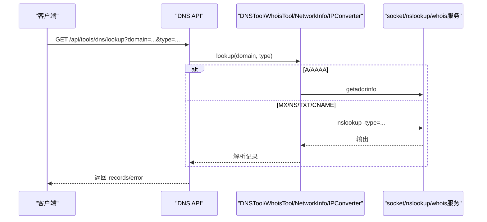
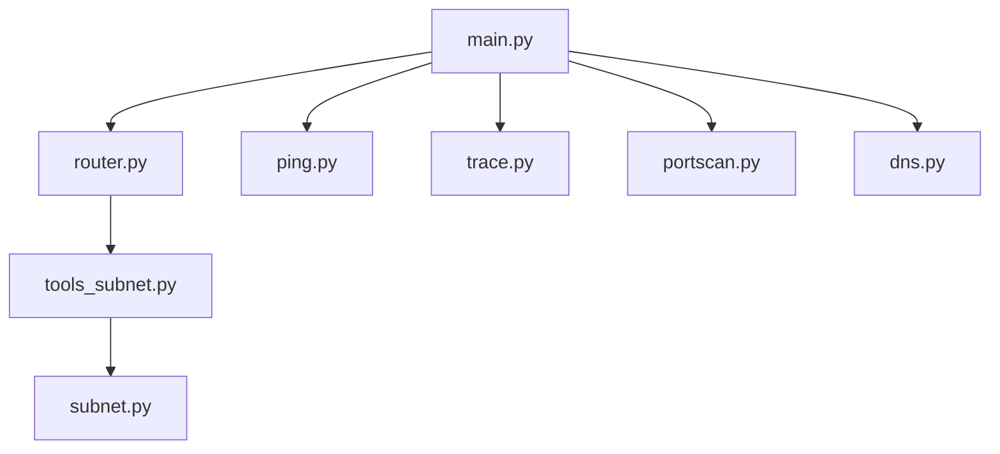

# 网络工具API

<cite>
**本文引用的文件**
- [api/app/main.py](file://api/app/main.py)
- [api/app/api/router.py](file://api/app/api/router.py)
- [api/app/api/tools_subnet.py](file://api/app/api/tools_subnet.py)
- [api/app/tools/subnet.py](file://api/app/tools/subnet.py)
- [api/app/tools/ping.py](file://api/app/tools/ping.py)
- [api/app/tools/trace.py](file://api/app/tools/trace.py)
- [api/app/tools/portscan.py](file://api/app/tools/portscan.py)
- [api/app/tools/dns.py](file://api/app/tools/dns.py)
- [api/README.md](file://api/README.md)
- [api/requirements.txt](file://api/requirements.txt)
- [api/app/core/validator.py](file://api/app/core/validator.py)
</cite>

## 目录
1. [简介](#简介)
2. [项目结构](#项目结构)
3. [核心组件](#核心组件)
4. [架构总览](#架构总览)
5. [详细组件分析](#详细组件分析)
6. [依赖分析](#依赖分析)
7. [性能考量](#性能考量)
8. [故障排查指南](#故障排查指南)
9. [结论](#结论)
10. [附录](#附录)

## 简介
本文件为网络工具相关API的全面接口文档，覆盖以下工具：
- 子网计算工具：GET /api/tools/subnet、GET /api/tools/subnet/split、GET /api/tools/subnet/range-to-cidr
- Ping测试工具：通过内部实现提供单主机、批量、网段扫描能力
- Traceroute工具：路由跟踪，支持Windows与Linux命令解析
- 端口扫描工具：TCP端口扫描、Banner抓取、全端口扫描
- DNS查询工具：A/AAAA/MX/NS/TXT/CNAME/SOA等记录查询、反向DNS、Whois查询、网络信息采集

文档详细说明每个工具的输入参数、输出格式、使用场景、错误处理与超时机制，并给出实际使用示例与最佳实践。

## 项目结构
后端基于FastAPI，采用“路由层-工具层”分层设计：
- 路由层负责HTTP接口定义与参数校验
- 工具层封装各类网络工具的算法与系统调用
- 主程序注册路由并启用CORS中间件

图表来源
- [api/app/main.py:1-29](file://api/app/main.py#L1-L29)
- [api/app/api/router.py:1-10](file://api/app/api/router.py#L1-L10)
- [api/app/api/tools_subnet.py:1-50](file://api/app/api/tools_subnet.py#L1-L50)
- [api/app/tools/subnet.py:1-280](file://api/app/tools/subnet.py#L1-L280)
- [api/app/tools/ping.py:1-241](file://api/app/tools/ping.py#L1-L241)
- [api/app/tools/trace.py:1-299](file://api/app/tools/trace.py#L1-L299)
- [api/app/tools/portscan.py:1-315](file://api/app/tools/portscan.py#L1-L315)
- [api/app/tools/dns.py:1-502](file://api/app/tools/dns.py#L1-L502)

章节来源
- [api/app/main.py:1-29](file://api/app/main.py#L1-L29)
- [api/app/api/router.py:1-10](file://api/app/api/router.py#L1-L10)
- [api/README.md:1-47](file://api/README.md#L1-L47)

## 核心组件
- FastAPI应用与CORS中间件：统一入口、跨域支持
- 路由聚合：将子网工具路由挂载到 /api/tools 前缀
- 子网计算工具：IP/掩码/CIDR互转、子网划分、IP范围转CIDR
- Ping工具：跨平台ping、批量ping、网段存活扫描
- Traceroute工具：跨平台路由跟踪、输出解析、降级策略
- 端口扫描：并发扫描、Banner抓取、状态分类
- DNS/Whois/网络信息：正向/反向DNS、多记录类型查询、Whois、公网IP探测、本地网络信息

章节来源
- [api/app/main.py:1-29](file://api/app/main.py#L1-L29)
- [api/app/api/router.py:1-10](file://api/app/api/router.py#L1-L10)
- [api/app/api/tools_subnet.py:1-50](file://api/app/api/tools_subnet.py#L1-L50)
- [api/app/tools/subnet.py:1-280](file://api/app/tools/subnet.py#L1-L280)
- [api/app/tools/ping.py:1-241](file://api/app/tools/ping.py#L1-L241)
- [api/app/tools/trace.py:1-299](file://api/app/tools/trace.py#L1-L299)
- [api/app/tools/portscan.py:1-315](file://api/app/tools/portscan.py#L1-L315)
- [api/app/tools/dns.py:1-502](file://api/app/tools/dns.py#L1-L502)

## 架构总览
系统采用“API路由 + 工具实现”的清晰分层，工具实现独立于FastAPI，便于单元测试与复用。

图表来源
- [api/app/api/router.py:1-10](file://api/app/api/router.py#L1-L10)
- [api/app/api/tools_subnet.py:1-50](file://api/app/api/tools_subnet.py#L1-L50)
- [api/app/tools/ping.py:1-241](file://api/app/tools/ping.py#L1-L241)
- [api/app/tools/trace.py:1-299](file://api/app/tools/trace.py#L1-L299)
- [api/app/tools/portscan.py:1-315](file://api/app/tools/portscan.py#L1-L315)
- [api/app/tools/dns.py:1-502](file://api/app/tools/dns.py#L1-L502)

## 详细组件分析

### 子网计算工具
- 接口1：GET /api/tools/subnet
  - 功能：根据IP地址与子网掩码（或前缀长度）计算网络地址、广播地址、可用主机范围、掩码前缀、通配反掩码、IP类别与类型、二进制表示等
  - 输入参数
    - ip: IP地址，如 192.168.1.10
    - mask: 子网掩码或前缀长度，如 255.255.255.0 或 24
  - 输出字段
    - success: 是否成功
    - error: 错误信息（失败时）
    - ip_address、subnet_mask、prefix_length、network_address、broadcast_address、first_usable、last_usable、total_hosts、usable_hosts、wildcard_mask、ip_class、ip_type、is_private、binary_ip、binary_mask
  - 使用场景：网络规划、地址分配、ACL规则编写
  - 示例请求
    - GET /api/tools/subnet?ip=192.168.1.10&mask=255.255.255.0
    - GET /api/tools/subnet?ip=10.0.0.5&mask=24
  - 错误处理：非法IP、掩码越界、无效掩码时返回400

- 接口2：GET /api/tools/subnet/split
  - 功能：将原网段按新前缀长度切分为若干等长子网
  - 输入参数
    - network: 原网络地址，如 192.168.1.0
    - prefix: 原前缀长度，如 24
    - new_prefix: 新前缀长度，必须大于原前缀
  - 输出字段
    - count: 子网数量
    - subnets: 子网数组，每项包含 subnet、prefix、mask、first_host、last_host、broadcast、hosts
  - 使用场景：VLAN规划、子网划分
  - 示例请求
    - GET /api/tools/subnet/split?network=192.168.1.0&prefix=24&new_prefix=26
  - 错误处理：new_prefix 不大于 prefix 或划分失败返回400

- 接口3：GET /api/tools/subnet/range-to-cidr
  - 功能：将IP范围转换为最少的CIDR块集合
  - 输入参数
    - start: 起始IP，如 192.168.1.0
    - end: 结束IP，如 192.168.1.127
  - 输出字段
    - count: CIDR块数量
    - cidrs: CIDR块数组，每项包含 network、prefix、cidr、mask、broadcast
  - 使用场景：批量ACL、防火墙策略
  - 示例请求
    - GET /api/tools/subnet/range-to-cidr?start=192.168.1.0&end=192.168.1.127
  - 错误处理：起始IP大于结束IP或转换失败返回400

图表来源
- [api/app/api/tools_subnet.py:9-22](file://api/app/api/tools_subnet.py#L9-L22)
- [api/app/tools/subnet.py:50-166](file://api/app/tools/subnet.py#L50-L166)

章节来源
- [api/app/api/tools_subnet.py:1-50](file://api/app/api/tools_subnet.py#L1-L50)
- [api/app/tools/subnet.py:1-280](file://api/app/tools/subnet.py#L1-L280)

### Ping测试工具
- 功能概述
  - 单主机Ping：统计收发包、丢包率、RTT（最小/最大/平均）
  - 批量Ping：多主机并发，汇总结果
  - 网段扫描：对 /24 或 /16 网段进行快速存活检测
- 关键参数
  - host/count/timeout：主机、次数、超时（秒）
  - max_workers：并发线程数
- 输出字段（单主机）
  - success、host、packets_sent、packets_received、packets_lost、loss_rate、min_time、max_time、avg_time、ip_address、error、raw_output
- 输出字段（批量/扫描）
  - 成功主机列表，每项包含上述字段
- 使用场景
  - 连通性诊断、设备发现、SLA监控
- 示例请求
  - GET /api/tools/ping?host=example.com&count=4&timeout=2
  - GET /api/tools/ping/batch?hosts=host1,host2,host3&count=2&timeout=2
  - GET /api/tools/ping/sweep?network=192.168.1.0&prefix=24&timeout=1

图表来源
- [api/app/tools/ping.py:18-171](file://api/app/tools/ping.py#L18-L171)

章节来源
- [api/app/tools/ping.py:1-241](file://api/app/tools/ping.py#L1-L241)

### Traceroute工具
- 功能概述
  - 跨平台路由跟踪：Windows使用 tracert，Linux优先 traceroute，否则回退到基于 ping TTL 的简单跟踪
  - 输出解析：提取每跳IP、RTT、超时标记、到达目的地标记
- 关键参数
  - host/max_hops/timeout：目标、最大跳数、超时（秒）
  - 并发：支持多主机并行跟踪
- 输出字段
  - success、host、ip_address、hops（数组，每项含 hop_number、ip、hostname、rtt_times、avg_rtt、timeout、reached）、total_hops、reached_destination、error、raw_output
- 使用场景：路径分析、网络排障、跨境链路质量评估
- 示例请求
  - GET /api/tools/trace?host=example.com&max_hops=30&timeout=2
  - GET /api/tools/trace/parallel?hosts=host1,host2&max_hops=30&timeout=2

图表来源
- [api/app/tools/trace.py:17-77](file://api/app/tools/trace.py#L17-L77)
- [api/app/tools/trace.py:79-123](file://api/app/tools/trace.py#L79-L123)
- [api/app/tools/trace.py:147-187](file://api/app/tools/trace.py#L147-L187)
- [api/app/tools/trace.py:190-269](file://api/app/tools/trace.py#L190-L269)

章节来源
- [api/app/tools/trace.py:1-299](file://api/app/tools/trace.py#L1-L299)

### 端口扫描工具
- 功能概述
  - 单端口测试、常用端口扫描、端口范围扫描、全端口扫描（1-65535）
  - Banner抓取：对HTTP/常见协议尝试获取服务标识
  - 并发控制：ThreadPoolExecutor，可配置最大并发
- 关键参数
  - host、ports/端口范围/常用端口、timeout、max_workers、progress_callback
- 输出字段（扫描结果）
  - success、host、start_time、end_time、total_ports、open_ports、closed_ports、filtered_ports、ports（仅开放端口，含status、service、banner、error）
- 使用场景：安全基线检查、服务发现、合规审计
- 示例请求
  - GET /api/tools/portscan/test?host=192.168.1.1&port=80&timeout=2
  - GET /api/tools/portscan/common?host=192.168.1.1&timeout=1
  - GET /api/tools/portscan/range?host=192.168.1.1&start=1&end=1000&timeout=0.5
  - GET /api/tools/portscan/full?host=192.168.1.1&timeout=0.3

图表来源
- [api/app/tools/portscan.py:43-196](file://api/app/tools/portscan.py#L43-L196)
- [api/app/tools/portscan.py:91-118](file://api/app/tools/portscan.py#L91-L118)

章节来源
- [api/app/tools/portscan.py:1-315](file://api/app/tools/portscan.py#L1-L315)

### DNS查询工具
- 功能概述
  - 正向DNS：A/AAAA/MX/NS/TXT/CNAME/SOA等记录查询
  - 反向DNS：IP转域名
  - Whois：域名注册商、创建/过期时间、NS、状态等
  - 网络信息：本机IP/主机名、公网IP探测、网络接口列表
  - IP转换：十进制/二进制/十六进制互转
- 关键参数
  - lookup(domain, record_type)
  - reverse_lookup(ip)
  - whois.query(domain)
  - network info: get_local_ip/get_hostname/get_public_ip(timeout)/get_network_interfaces()
  - converter: ip_to_decimal/decimal_to_ip/ip_to_binary/hex_to_ip
- 输出字段（示例）
  - lookup: success、domain、record_type、records、error、query_time
  - reverse_lookup: success、ip、hostname、aliases、error
  - whois.query: success、domain、registrar、creation_date、expiration_date、name_servers、status、raw_output、error
  - network info: get_public_ip 返回 success、ip、country、city、isp、error
  - converter: 各种转换返回 success、输入值、目标值及辅助表示
- 使用场景：域名解析、服务定位、资产发现、合规与风控
- 示例请求
  - GET /api/tools/dns/lookup?domain=example.com&type=A
  - GET /api/tools/dns/reverse?ip=8.8.8.8
  - GET /api/tools/dns/whois?domain=example.com
  - GET /api/tools/dns/local-ip
  - GET /api/tools/dns/public-ip?timeout=5
  - GET /api/tools/dns/convert/ip2dec?ip=192.168.1.1

图表来源
- [api/app/tools/dns.py:18-113](file://api/app/tools/dns.py#L18-L113)
- [api/app/tools/dns.py:115-135](file://api/app/tools/dns.py#L115-L135)
- [api/app/tools/dns.py:137-169](file://api/app/tools/dns.py#L137-L169)
- [api/app/tools/dns.py:207-312](file://api/app/tools/dns.py#L207-L312)
- [api/app/tools/dns.py:314-414](file://api/app/tools/dns.py#L314-L414)
- [api/app/tools/dns.py:416-502](file://api/app/tools/dns.py#L416-L502)

章节来源
- [api/app/tools/dns.py:1-502](file://api/app/tools/dns.py#L1-L502)

## 依赖分析
- 外部依赖
  - fastapi、uvicorn、pydantic：Web框架与ASGI服务器
  - python-whois：Whois查询
- 内部依赖
  - 路由层依赖工具层；工具层独立，减少耦合
  - 子网工具路由挂载于 /api/tools 前缀

图表来源
- [api/app/main.py:1-29](file://api/app/main.py#L1-L29)
- [api/app/api/router.py:1-10](file://api/app/api/router.py#L1-L10)
- [api/app/api/tools_subnet.py:1-50](file://api/app/api/tools_subnet.py#L1-L50)
- [api/app/tools/subnet.py:1-280](file://api/app/tools/subnet.py#L1-L280)
- [api/app/tools/ping.py:1-241](file://api/app/tools/ping.py#L1-L241)
- [api/app/tools/trace.py:1-299](file://api/app/tools/trace.py#L1-L299)
- [api/app/tools/portscan.py:1-315](file://api/app/tools/portscan.py#L1-L315)
- [api/app/tools/dns.py:1-502](file://api/app/tools/dns.py#L1-L502)

章节来源
- [api/requirements.txt:1-5](file://api/requirements.txt#L1-L5)

## 性能考量
- 并发与超时
  - Ping/Traceroute/PortScan广泛使用ThreadPoolExecutor，合理设置max_workers避免资源耗尽
  - 各工具内置进程/套接字超时，防止长时间阻塞
- I/O与系统调用
  - 子网计算纯CPU运算，复杂度低；DNS/Whois依赖外部服务，注意超时与重试策略
  - Traceroute在Linux优先使用traceroute或tracepath，失败再回退到ping TTL方式
- 资源限制
  - 全端口扫描建议谨慎使用，必要时限制并发与超时
  - 批量Ping/Traceroute建议分批执行，避免触发目标系统限流

[本节为通用性能指导，无需特定文件引用]

## 故障排查指南
- 常见错误与处理
  - 参数校验失败：IP格式、掩码、端口范围等不符合规范
  - 子网计算失败：掩码无效、前缀越界、IP范围错误
  - Ping失败：主机名不可解析、Ping命令不可用、超时
  - Traceroute失败：系统缺少 tracert/traceroute、超时、解析失败
  - 端口扫描失败：目标主机拒绝、超时、并发过高
  - DNS/Whois失败：上游服务不可达、超时、格式异常
- 建议
  - 先用 /api/health 检查服务状态
  - 对高风险操作（全端口扫描、批量Traceroute）先小规模验证
  - 设置合理的timeout与max_workers，避免影响系统稳定性

章节来源
- [api/app/api/tools_subnet.py:19-22](file://api/app/api/tools_subnet.py#L19-L22)
- [api/app/tools/ping.py:164-170](file://api/app/tools/ping.py#L164-L170)
- [api/app/tools/trace.py:74-76](file://api/app/tools/trace.py#L74-L76)
- [api/app/tools/portscan.py:75-87](file://api/app/tools/portscan.py#L75-L87)
- [api/app/tools/dns.py:55-57](file://api/app/tools/dns.py#L55-L57)

## 结论
本API提供了完整的网络工具集，涵盖子网计算、连通性测试、路径追踪、端口扫描与DNS/Whois查询。通过清晰的分层设计与完善的错误处理，既满足日常运维需求，也便于扩展与集成。建议在生产环境中结合超时与并发策略，确保稳定与安全。

[本节为总结性内容，无需特定文件引用]

## 附录
- 实际使用示例与最佳实践
  - 子网规划：先用 /api/tools/subnet 计算基础信息，再用 /api/tools/subnet/split 划分子网，最后用 /api/tools/subnet/range-to-cidr 生成最小CIDR集合
  - 连通性诊断：先 /api/tools/trace 分析路径，再 /api/tools/ping 验证丢包与RTT，必要时 /api/tools/portscan 检查端口可达性
  - 域名与资产：使用 /api/tools/dns/lookup 识别服务类型，/api/tools/dns/reverse 进行反向解析，/api/tools/dns/whois 获取注册信息
  - 安全扫描：从常用端口开始，逐步扩大到范围或全端口，注意设置较小的并发与较长的超时
- 参数校验参考
  - IP/掩码/端口/VLAN等参数可参考通用校验工具，确保输入合法性

章节来源
- [api/app/core/validator.py:14-200](file://api/app/core/validator.py#L14-L200)
- [api/README.md:20-24](file://api/README.md#L20-L24)