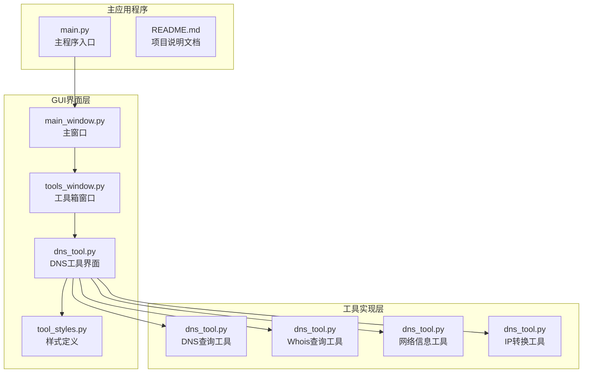
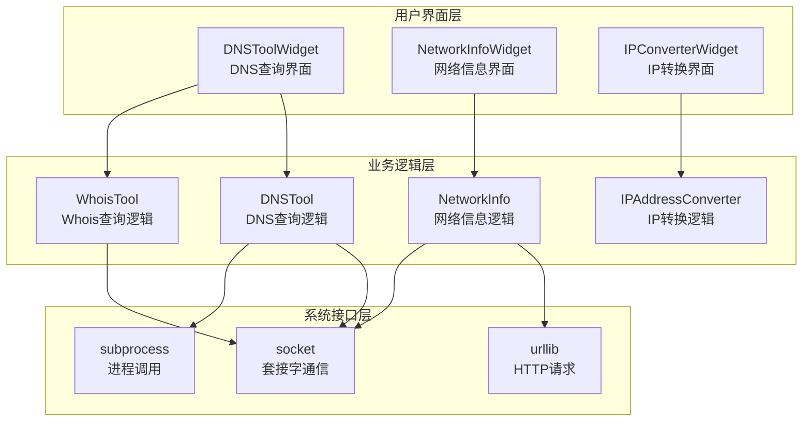
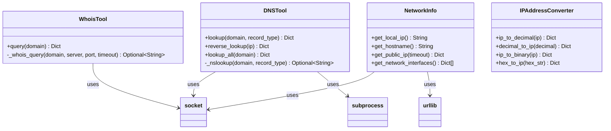
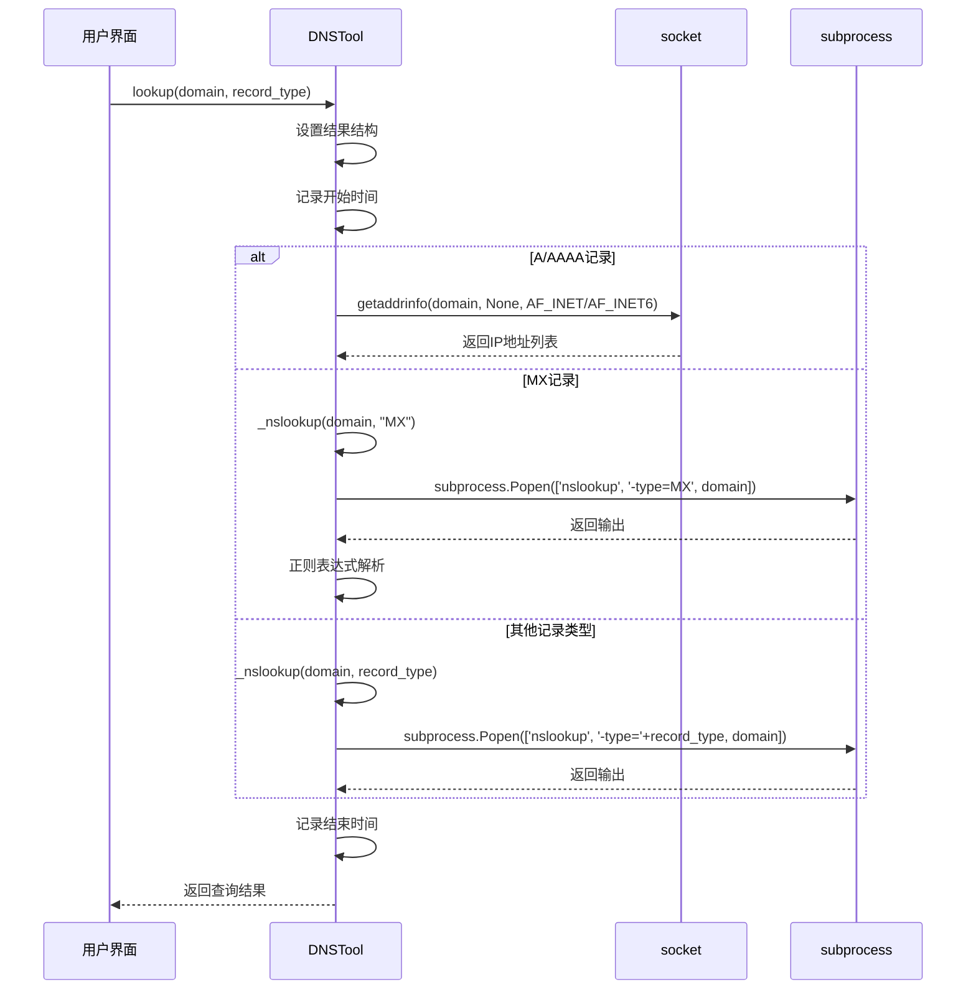
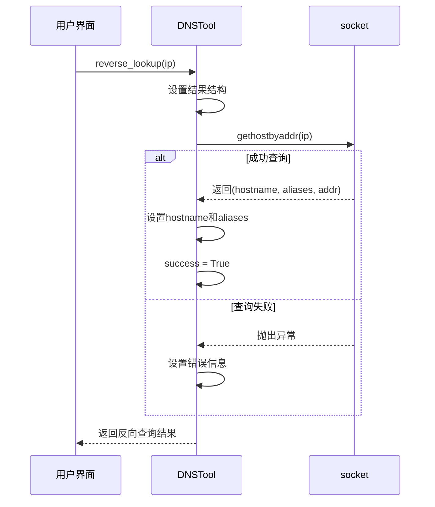
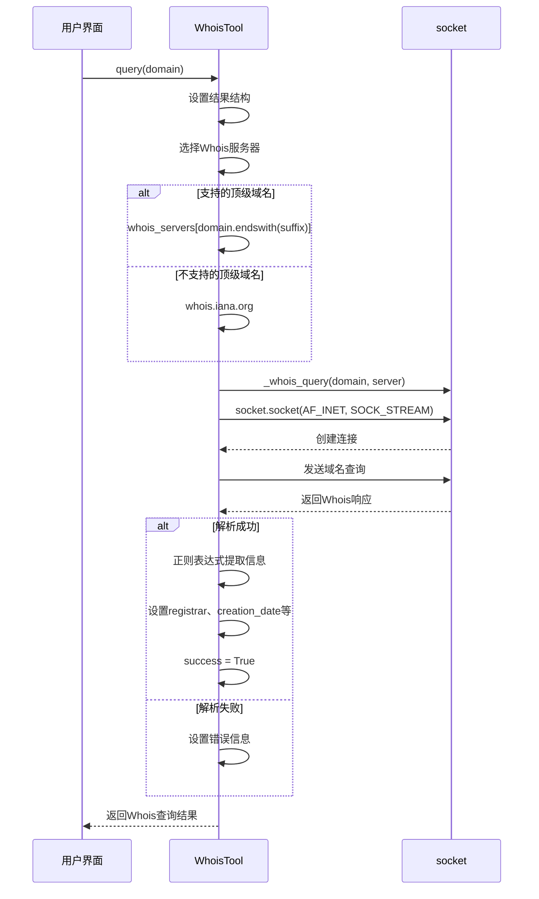
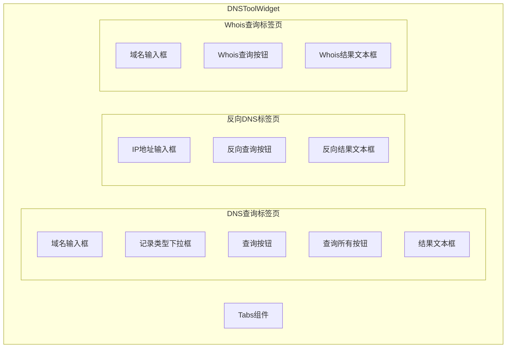
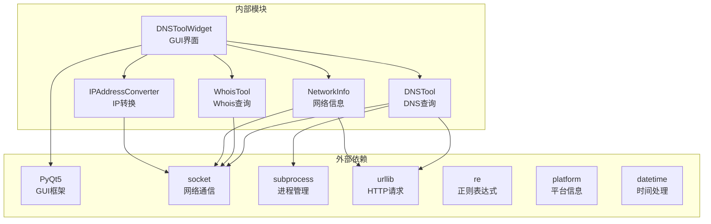

# DNS/Whois查询工具

<cite>
**本文档引用的文件**
- [main.py](file://opensource/NetOps-toolkit/main.py)
- [README.md](file://opensource/NetOps-toolkit/README.md)
- [dns_tool.py](file://opensource/NetOps-toolkit/gui/tools/dns_tool.py)
- [dns_tool.py](file://opensource/NetOps-toolkit/utils/network_tools/dns_tool.py)
- [tools_window.py](file://opensource/NetOps-toolkit/gui/tools_window.py)
- [main_window.py](file://opensource/NetOps-toolkit/gui/main_window.py)
- [tool_styles.py](file://opensource/NetOps-toolkit/gui/tool_styles.py)
</cite>

## 目录
1. [简介](#简介)
2. [项目结构](#项目结构)
3. [核心组件](#核心组件)
4. [架构概览](#架构概览)
5. [详细组件分析](#详细组件分析)
6. [依赖关系分析](#依赖关系分析)
7. [性能考虑](#性能考虑)
8. [故障排除指南](#故障排除指南)
9. [结论](#结论)
10. [附录](#附录)

## 简介

DNS/Whois查询工具是NetOps Toolkit v4.0中的重要网络工具组件，提供了完整的域名解析和Whois信息查询功能。该工具集成了多种查询类型，包括正向DNS解析、反向DNS查询、Whois信息获取、IP地理位置查询和域名注册信息分析。

该工具采用现代化的GUI界面设计，基于PyQt5框架构建，支持Windows、Linux和macOS操作系统。工具提供了直观的用户界面，让用户能够轻松地进行各种网络查询操作。

## 项目结构

NetOps Toolkit是一个功能丰富的网络运维工具集，包含多个网络工具模块。DNS/Whois查询工具作为其中的核心组件之一，与其他网络工具共同构成了完整的工具箱。

**图表来源**
- [main.py:1-69](file://opensource/NetOps-toolkit/main.py#L1-L69)
- [tools_window.py:28-77](file://opensource/NetOps-toolkit/gui/tools_window.py#L28-L77)
- [dns_tool.py:27-540](file://opensource/NetOps-toolkit/gui/tools/dns_tool.py#L27-L540)

**章节来源**
- [README.md:107-153](file://opensource/NetOps-toolkit/README.md#L107-L153)
- [main.py:1-69](file://opensource/NetOps-toolkit/main.py#L1-L69)

## 核心组件

DNS/Whois查询工具主要由以下核心组件构成：

### DNS查询工具类
- **DNSTool**: 提供DNS记录查询功能，支持A、AAAA、MX、NS、TXT、CNAME、SOA等记录类型的查询
- **反向DNS查询**: 支持IP地址到域名的反向解析
- **批量查询**: 可一次性查询域名的所有常见记录类型

### Whois查询工具类
- **WhoisTool**: 提供域名注册信息查询功能
- **Whois服务器支持**: 支持多种顶级域名的Whois服务器
- **信息提取**: 自动解析Whois响应中的关键信息字段

### 网络信息工具类
- **NetworkInfo**: 提供网络环境信息查询
- **公网IP查询**: 通过多个服务获取公网IP地址
- **本地网络接口**: 获取本机网络接口信息

### IP地址转换工具类
- **IPAddressConverter**: 提供IP地址格式转换功能
- **十进制转换**: IP地址与十进制数之间的转换
- **十六进制转换**: IP地址与十六进制数之间的转换
- **二进制转换**: IP地址与二进制数之间的转换

**章节来源**
- [dns_tool.py:15-502](file://opensource/NetOps-toolkit/utils/network_tools/dns_tool.py#L15-L502)

## 架构概览

DNS/Whois查询工具采用分层架构设计，实现了清晰的职责分离和模块化组织。

**图表来源**
- [dns_tool.py:27-540](file://opensource/NetOps-toolkit/gui/tools/dns_tool.py#L27-L540)
- [dns_tool.py:15-502](file://opensource/NetOps-toolkit/utils/network_tools/dns_tool.py#L15-L502)

## 详细组件分析

### DNS查询工具组件

DNSTool类是DNS查询功能的核心实现，提供了多种DNS记录类型的查询能力。

#### 类结构分析

**图表来源**
- [dns_tool.py:15-502](file://opensource/NetOps-toolkit/utils/network_tools/dns_tool.py#L15-L502)

#### DNS查询流程

**图表来源**
- [dns_tool.py:18-113](file://opensource/NetOps-toolkit/utils/network_tools/dns_tool.py#L18-L113)

#### 反向DNS查询流程

**图表来源**
- [dns_tool.py:138-169](file://opensource/NetOps-toolkit/utils/network_tools/dns_tool.py#L138-L169)

#### Whois查询流程

**图表来源**
- [dns_tool.py:207-312](file://opensource/NetOps-toolkit/utils/network_tools/dns_tool.py#L207-L312)

### GUI界面组件

DNSToolWidget类提供了用户友好的图形界面，支持多种查询操作。

#### 界面布局结构

**图表来源**
- [dns_tool.py:27-160](file://opensource/NetOps-toolkit/gui/tools/dns_tool.py#L27-L160)

#### 查询类型支持

工具支持以下DNS记录类型的查询：
- **A记录**: IPv4地址解析
- **AAAA记录**: IPv6地址解析  
- **MX记录**: 邮件服务器记录
- **NS记录**: 域名服务器记录
- **TXT记录**: 文本记录
- **CNAME记录**: 规范名称记录
- **SOA记录**: 权威开始记录

**章节来源**
- [dns_tool.py:27-540](file://opensource/NetOps-toolkit/gui/tools/dns_tool.py#L27-L540)
- [dns_tool.py:18-113](file://opensource/NetOps-toolkit/utils/network_tools/dns_tool.py#L18-L113)

## 依赖关系分析

DNS/Whois查询工具的依赖关系相对简单，主要依赖于Python标准库和第三方库。

**图表来源**
- [dns_tool.py:7-12](file://opensource/NetOps-toolkit/utils/network_tools/dns_tool.py#L7-L12)
- [dns_tool.py:18-113](file://opensource/NetOps-toolkit/utils/network_tools/dns_tool.py#L18-L113)

**章节来源**
- [main.py:8-19](file://opensource/NetOps-toolkit/main.py#L8-L19)
- [dns_tool.py:18-113](file://opensource/NetOps-toolkit/utils/network_tools/dns_tool.py#L18-L113)

## 性能考虑

DNS/Whois查询工具在设计时充分考虑了性能和用户体验：

### 查询超时机制
- DNS查询设置了10秒超时限制
- Whois查询设置了10秒超时限制
- 反向DNS查询使用socket默认超时

### 结果缓存策略
- 当前实现未包含缓存机制
- 建议在实际部署中考虑添加查询结果缓存

### 并发处理
- GUI界面使用异步线程处理网络查询
- 避免阻塞用户界面响应

### 错误处理
- 所有网络操作都包含异常处理
- 提供详细的错误信息反馈

## 故障排除指南

### 常见问题及解决方案

#### DNS查询失败
**问题**: DNS查询返回失败
**可能原因**:
- 网络连接问题
- DNS服务器不可达
- 域名格式不正确

**解决方法**:
1. 检查网络连接状态
2. 尝试使用不同的DNS服务器
3. 验证域名格式是否正确

#### Whois查询超时
**问题**: Whois查询长时间无响应
**可能原因**:
- Whois服务器响应慢
- 网络延迟过高
- 域名不存在

**解决方法**:
1. 检查网络连接质量
2. 尝试稍后重试
3. 验证域名的有效性

#### 反向DNS查询失败
**问题**: 反向DNS查询返回错误
**可能原因**:
- IP地址不是有效的PTR记录
- DNS服务器不支持反向查询
- IP地址格式不正确

**解决方法**:
1. 验证IP地址格式
2. 检查DNS服务器配置
3. 确认IP地址确实有PTR记录

### 调试技巧

1. **启用详细日志**: 在开发环境中可以添加更详细的日志输出
2. **网络诊断**: 使用ping和traceroute工具诊断网络问题
3. **DNS测试**: 使用nslookup或dig工具验证DNS配置

**章节来源**
- [dns_tool.py:55-112](file://opensource/NetOps-toolkit/utils/network_tools/dns_tool.py#L55-L112)
- [dns_tool.py:162-167](file://opensource/NetOps-toolkit/utils/network_tools/dns_tool.py#L162-L167)

## 结论

DNS/Whois查询工具是NetOps Toolkit中的重要组成部分，提供了完整的域名解析和Whois信息查询功能。该工具具有以下特点：

### 优势
- **功能完整**: 支持多种DNS记录类型和Whois查询
- **界面友好**: 基于PyQt5的现代化GUI设计
- **跨平台支持**: 支持Windows、Linux和macOS操作系统
- **易于使用**: 直观的用户界面和清晰的操作流程

### 应用场景
- **网站域名解析**: 快速获取网站的IP地址和DNS记录
- **恶意域名检测**: 分析可疑域名的DNS记录和Whois信息
- **网络取证分析**: 收集域名相关的网络证据
- **域名安全管理**: 监控域名注册信息变化

### 改进建议
1. **添加缓存机制**: 提升重复查询的性能
2. **增加查询历史**: 方便用户查看历史查询记录
3. **扩展查询类型**: 支持更多DNS记录类型
4. **改进错误处理**: 提供更详细的错误诊断信息

该工具为网络管理员、安全分析师和开发者提供了强大的域名查询能力，是网络运维工作中的重要辅助工具。

## 附录

### 使用示例

#### 基本DNS查询
1. 打开DNS/Whois工具
2. 输入目标域名
3. 选择记录类型（A、AAAA、MX等）
4. 点击"查询"按钮
5. 查看查询结果

#### 反向DNS查询
1. 在反向DNS标签页输入IP地址
2. 点击"反向查询"按钮
3. 查看返回的域名信息

#### Whois查询
1. 在Whois标签页输入域名
2. 点击"Whois查询"按钮
3. 查看域名注册信息

### 最佳实践

#### 网站域名解析策略
- 使用A记录获取IPv4地址
- 使用AAAA记录获取IPv6地址
- 检查MX记录确认邮件服务器
- 验证TXT记录用于SPF和DKIM

#### 恶意域名检测
- 检查域名注册时间
- 分析域名服务器配置
- 验证IP地址地理位置
- 关注域名状态变化

#### 网络取证分析
- 记录查询时间和结果
- 保存原始Whois数据
- 跟踪域名变更历史
- 分析DNS记录变化趋势