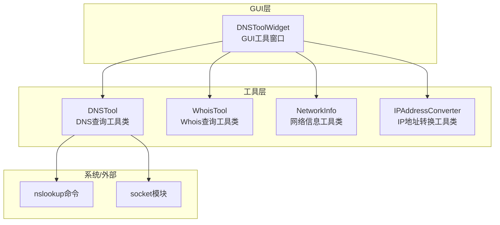
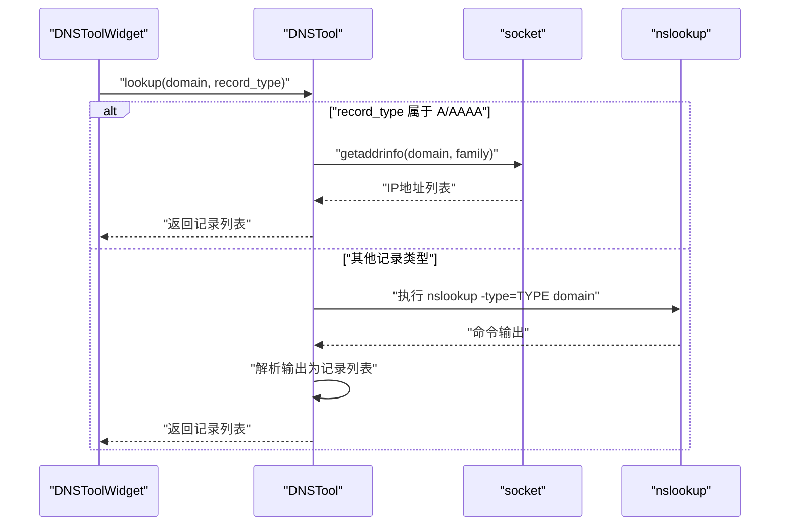
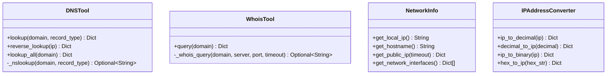
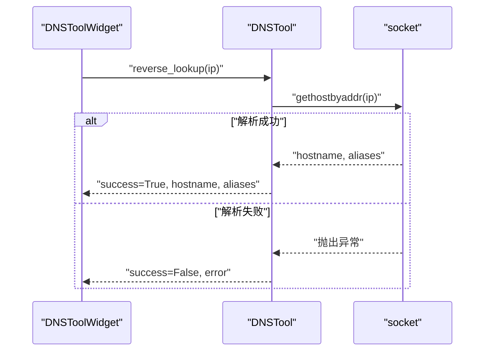
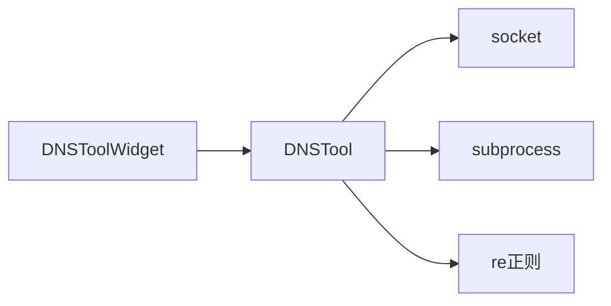

# DNS工具API

<cite>
**本文引用的文件**
- [dns_tool.py](file://opensource/NetOps-toolkit/utils/network_tools/dns_tool.py)
- [dns_tool.py](file://opensource/NetOps-toolkit/gui/tools/dns_tool.py)
- [README.md](file://opensource/NetOps-toolkit/README.md)
</cite>

## 目录
1. [简介](#简介)
2. [项目结构](#项目结构)
3. [核心组件](#核心组件)
4. [架构总览](#架构总览)
5. [详细组件分析](#详细组件分析)
6. [依赖分析](#依赖分析)
7. [性能考量](#性能考量)
8. [故障排查指南](#故障排查指南)
9. [结论](#结论)
10. [附录](#附录)

## 简介
本文件为DNSTool类的详细API参考文档，覆盖以下能力与行为：
- 域名解析方法 resolve_hostname()（对应实现为 lookup()），支持记录类型：A、AAAA、MX、NS、TXT、CNAME、SOA、PTR 等
- 反向DNS查询 reverse_dns()（对应实现为 reverse_lookup()），将IP地址解析为主机名与别名
- DNS查询结果数据结构，包含记录类型、查询耗时、记录列表、错误信息等
- DNS查询超时处理与底层调用机制
- DNS服务器配置与递归查询支持现状
- 故障排查与解析失败处理方法
- DNS安全考虑与DNS劫持防护建议

## 项目结构
DNSTool位于网络工具模块中，GUI层通过工具窗口调用该工具类进行DNS查询与反向查询。

图表来源
- [dns_tool.py:18-30](file://opensource/NetOps-toolkit/gui/tools/dns_tool.py#L18-L30)
- [dns_tool.py:15-205](file://opensource/NetOps-toolkit/utils/network_tools/dns_tool.py#L15-L205)

章节来源
- [README.md:107-153](file://opensource/NetOps-toolkit/README.md#L107-L153)

## 核心组件
- DNSTool：提供正向DNS查询、反向DNS查询、批量查询等功能
- WhoisTool：提供Whois查询辅助（与DNS查询互补）
- NetworkInfo：提供网络环境信息（如本机IP、公网IP）
- IPAddressConverter：提供IP地址格式转换

章节来源
- [dns_tool.py:15-205](file://opensource/NetOps-toolkit/utils/network_tools/dns_tool.py#L15-L205)
- [dns_tool.py:207-312](file://opensource/NetOps-toolkit/utils/network_tools/dns_tool.py#L207-L312)
- [dns_tool.py:314-414](file://opensource/NetOps-toolkit/utils/network_tools/dns_tool.py#L314-L414)
- [dns_tool.py:416-502](file://opensource/NetOps-toolkit/utils/network_tools/dns_tool.py#L416-L502)

## 架构总览
DNSTool在内部通过两种方式实现DNS查询：
- 对于A/AAAA记录，使用socket.getaddrinfo进行系统解析
- 对于其他记录类型（MX、NS、TXT、CNAME、SOA、PTR等），通过调用系统nslookup命令并解析输出

反向DNS查询通过socket.gethostbyaddr实现。

图表来源
- [dns_tool.py:19-113](file://opensource/NetOps-toolkit/utils/network_tools/dns_tool.py#L19-L113)
- [dns_tool.py:116-136](file://opensource/NetOps-toolkit/utils/network_tools/dns_tool.py#L116-L136)

## 详细组件分析

### DNSTool 类
DNSTool是一个静态方法集合类，提供以下核心方法：

- lookup(domain, record_type="A")
  - 功能：按指定记录类型查询域名
  - 参数：
    - domain: 域名字符串
    - record_type: 记录类型，默认"A"；支持"A"、"AAAA"、"MX"、"NS"、"TXT"、"CNAME"、"SOA"、"PTR"
  - 返回：字典，包含字段 success、domain、record_type、records、error、query_time
  - 实现要点：
    - A/AAAA：使用socket.getaddrinfo解析，去重后返回IP列表
    - MX/NS/TXT/CNAME：通过nslookup命令解析，并使用正则提取记录
    - 其他类型：通用nslookup解析，按行拆分返回
    - 超时：nslookup命令调用设置了超时（约10秒）

- reverse_lookup(ip)
  - 功能：IP地址反向解析为主机名与别名
  - 参数：ip: IP地址字符串
  - 返回：字典，包含字段 success、ip、hostname、aliases、error
  - 实现要点：
    - 使用socket.gethostbyaddr解析
    - 捕获socket.herror（未找到）与socket.gaierror（无效IP）等异常

- lookup_all(domain)
  - 功能：一次性查询常见记录类型（A、AAAA、MX、NS、TXT、CNAME）
  - 返回：字典，包含各记录类型的查询结果与错误汇总

图表来源
- [dns_tool.py:15-205](file://opensource/NetOps-toolkit/utils/network_tools/dns_tool.py#L15-L205)
- [dns_tool.py:207-312](file://opensource/NetOps-toolkit/utils/network_tools/dns_tool.py#L207-L312)
- [dns_tool.py:314-414](file://opensource/NetOps-toolkit/utils/network_tools/dns_tool.py#L314-L414)
- [dns_tool.py:416-502](file://opensource/NetOps-toolkit/utils/network_tools/dns_tool.py#L416-L502)

章节来源
- [dns_tool.py:15-205](file://opensource/NetOps-toolkit/utils/network_tools/dns_tool.py#L15-L205)

### DNS查询结果数据结构
- 成功响应
  - success: 布尔值，表示查询是否成功
  - domain: 查询的域名
  - record_type: 查询的记录类型（大写）
  - records: 记录列表
    - A/AAAA：字符串列表（IP地址）
    - MX：字典列表（包含priority、server键）
    - NS/TXT/CNAME/SOA/PTR：字符串列表或单一字符串
  - query_time: 查询耗时（字符串形式）
  - error: 空字符串
- 失败响应
  - success: False
  - error: 错误描述（如“DNS查询失败”、“未找到MX记录”等）

章节来源
- [dns_tool.py:19-113](file://opensource/NetOps-toolkit/utils/network_tools/dns_tool.py#L19-L113)

### 反向DNS查询流程

图表来源
- [dns_tool.py:138-169](file://opensource/NetOps-toolkit/utils/network_tools/dns_tool.py#L138-L169)

章节来源
- [dns_tool.py:138-169](file://opensource/NetOps-toolkit/utils/network_tools/dns_tool.py#L138-L169)

### DNS查询超时与错误处理
- nslookup命令调用设置了超时（约10秒），避免长时间阻塞
- socket.getaddrinfo与socket.gethostbyaddr在系统层面受操作系统默认超时影响
- 异常处理：
  - socket.gaierror：DNS查询失败或名称不可解析
  - socket.herror：反向DNS未找到
  - socket.gaierror：无效IP地址
  - 其他异常：捕获并记录为错误信息

章节来源
- [dns_tool.py:116-136](file://opensource/NetOps-toolkit/utils/network_tools/dns_tool.py#L116-L136)
- [dns_tool.py:138-169](file://opensource/NetOps-toolkit/utils/network_tools/dns_tool.py#L138-L169)

### DNS服务器配置与递归查询支持
- DNSTool通过系统调用完成DNS解析，不直接暴露DNS服务器配置参数
- A/AAAA记录使用socket.getaddrinfo，依赖系统解析器（hosts文件、resolv.conf、系统缓存等）
- 其他记录类型通过nslookup命令实现，具体DNS服务器取决于系统默认配置
- 递归查询由系统解析器决定，工具层不做显式控制

章节来源
- [dns_tool.py:42-106](file://opensource/NetOps-toolkit/utils/network_tools/dns_tool.py#L42-L106)
- [dns_tool.py:116-136](file://opensource/NetOps-toolkit/utils/network_tools/dns_tool.py#L116-L136)

### GUI集成与使用示例
- GUI层提供DNS查询与反向DNS查询界面，支持：
  - 单记录类型查询（A/AAAA/MX/NS/TXT/CNAME/SOA/PTR）
  - 查询所有常见记录类型
  - 输入校验与错误提示
- 结果展示：
  - 文本区域显示格式化后的查询结果
  - 状态栏显示成功/失败状态

章节来源
- [dns_tool.py:161-283](file://opensource/NetOps-toolkit/gui/tools/dns_tool.py#L161-L283)

## 依赖分析
- DNSTool依赖socket模块进行系统解析
- DNSTool依赖subprocess调用nslookup命令
- GUI层通过导入utils.network_tools.DNSTool使用工具类
- 平台编码处理：在Windows上以GBK解码nslookup输出，在其他平台以UTF-8解码

图表来源
- [dns_tool.py:7-12](file://opensource/NetOps-toolkit/utils/network_tools/dns_tool.py#L7-L12)
- [dns_tool.py:116-136](file://opensource/NetOps-toolkit/utils/network_tools/dns_tool.py#L116-L136)

章节来源
- [dns_tool.py:7-12](file://opensource/NetOps-toolkit/utils/network_tools/dns_tool.py#L7-L12)

## 性能考量
- A/AAAA记录使用socket.getaddrinfo，通常较快且利用系统缓存
- 其他记录类型依赖nslookup命令，存在进程启动开销与输出解析成本
- 建议：
  - 批量查询时优先使用lookup_all一次性获取常用记录
  - 避免频繁重复查询相同域名，可结合应用层缓存策略
  - 注意超时设置，避免阻塞UI线程

## 故障排查指南
- 常见错误与处理
  - “DNS查询失败”：检查网络连通性、DNS服务器可达性
  - “未找到MX/NS/TXT/CNAME记录”：确认域名与记录类型正确
  - “反向DNS查询失败”：确认IP地址有效且存在PTR记录
  - “无效的IP地址”：检查输入格式
- 排查步骤
  - 使用系统nslookup命令验证DNS服务器与记录
  - 检查防火墙与代理对DNS端口的影响
  - 在不同网络环境下重复测试
- 错误信息来源
  - socket.gaierror、socket.herror、通用异常捕获

章节来源
- [dns_tool.py:55-112](file://opensource/NetOps-toolkit/utils/network_tools/dns_tool.py#L55-L112)
- [dns_tool.py:162-167](file://opensource/NetOps-toolkit/utils/network_tools/dns_tool.py#L162-L167)

## 结论
DNSTool提供了简洁易用的DNS查询与反向查询能力，覆盖主流记录类型，并通过系统解析器与nslookup命令实现广泛兼容。其API返回标准化的数据结构，便于上层GUI与业务逻辑消费。建议在生产环境中结合超时控制与缓存策略，提升稳定性与性能。

## 附录

### API参考摘要
- DNSTool.lookup(domain, record_type="A")
  - 支持记录类型：A、AAAA、MX、NS、TXT、CNAME、SOA、PTR
  - 返回：包含success、domain、record_type、records、error、query_time的字典
- DNSTool.reverse_lookup(ip)
  - 返回：包含success、ip、hostname、aliases、error的字典
- DNSTool.lookup_all(domain)
  - 返回：包含各记录类型结果与错误列表的字典

章节来源
- [dns_tool.py:19-113](file://opensource/NetOps-toolkit/utils/network_tools/dns_tool.py#L19-L113)
- [dns_tool.py:138-169](file://opensource/NetOps-toolkit/utils/network_tools/dns_tool.py#L138-L169)
- [dns_tool.py:172-204](file://opensource/NetOps-toolkit/utils/network_tools/dns_tool.py#L172-L204)