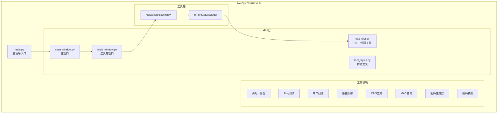
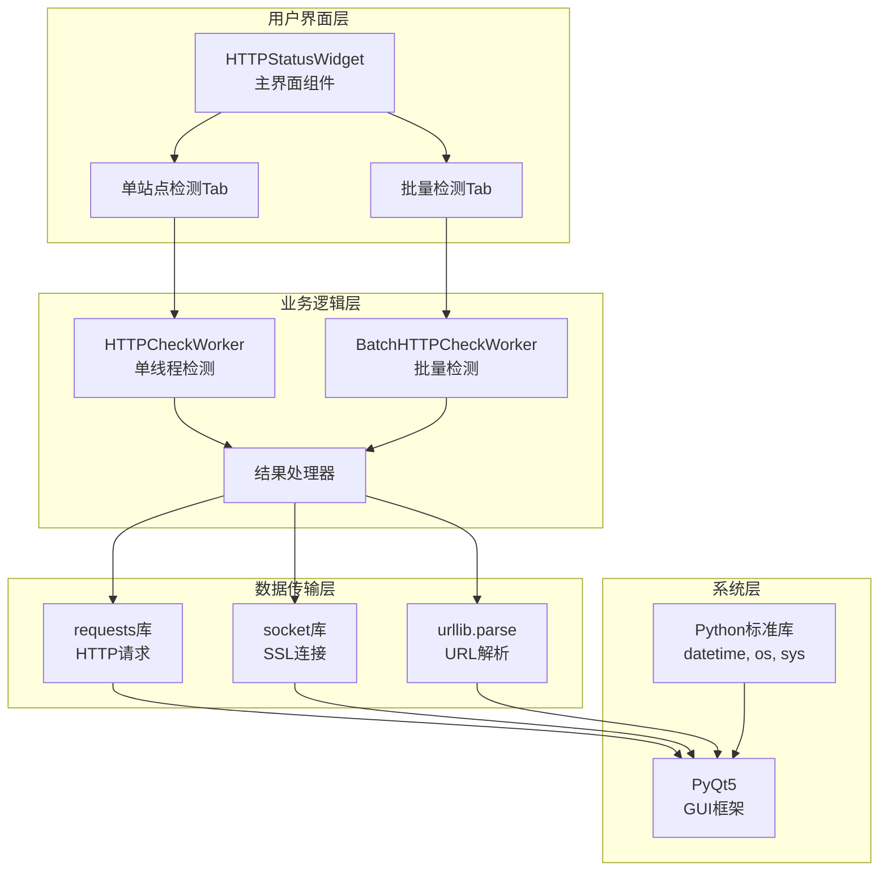
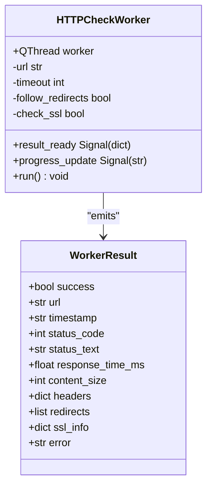
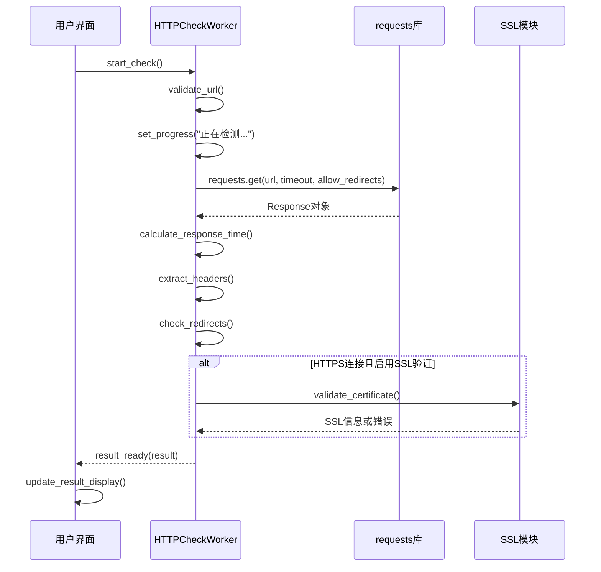
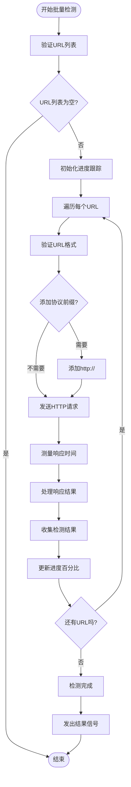
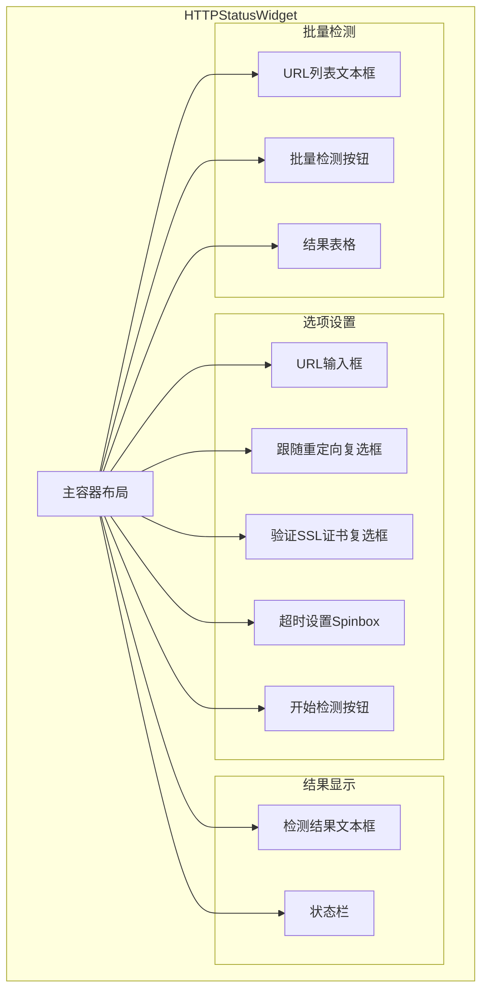
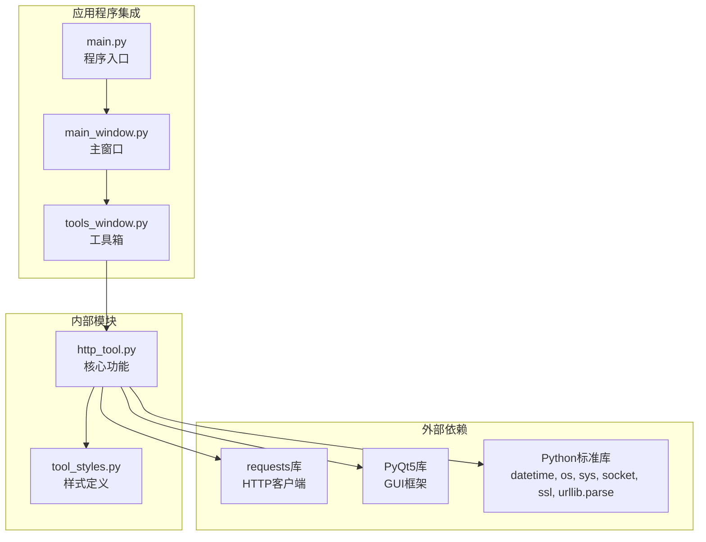

# HTTP状态检测工具

<cite>
**本文档引用的文件**
- [http_tool.py](file://opensource/NetOps-toolkit/gui/tools/http_tool.py)
- [main.py](file://opensource/NetOps-toolkit/main.py)
- [main_window.py](file://opensource/NetOps-toolkit/gui/main_window.py)
- [tools_window.py](file://opensource/NetOps-toolkit/gui/tools_window.py)
- [tool_styles.py](file://opensource/NetOps-toolkit/gui/tool_styles.py)
- [settings_dialog.py](file://opensource/NetOps-toolkit/gui/dialogs/settings_dialog.py)
- [README.md](file://opensource/NetOps-toolkit/README.md)
</cite>

## 目录
1. [简介](#简介)
2. [项目结构](#项目结构)
3. [核心组件](#核心组件)
4. [架构概览](#架构概览)
5. [详细组件分析](#详细组件分析)
6. [依赖关系分析](#依赖关系分析)
7. [性能考虑](#性能考虑)
8. [故障排除指南](#故障排除指南)
9. [结论](#结论)

## 简介

HTTP状态检测工具是NetOps Toolkit v4.0中的一个重要网络工具，专门用于Web服务状态检测和监控。该工具提供了直观的图形用户界面，能够执行HTTP/HTTPS请求、分析响应状态码、检查页面内容、跟踪重定向过程，并验证SSL证书的有效性。

该工具集成了多种检测策略，包括单站点检测和批量检测功能，支持超时配置、SSL证书验证等高级特性，适用于网站可用性监控、API接口测试和Web应用安全扫描等多种应用场景。

## 项目结构

NetOps Toolkit是一个基于PyQt5开发的现代化网络运维工具集，包含多个网络工具模块。HTTP状态检测工具作为其中一个独立的工具模块，位于GUI工具目录下。

**图表来源**
- [main.py:1-69](file://opensource/NetOps-toolkit/main.py#L1-L69)
- [main_window.py:144-475](file://opensource/NetOps-toolkit/gui/main_window.py#L144-L475)
- [tools_window.py:28-77](file://opensource/NetOps-toolkit/gui/tools_window.py#L28-L77)

**章节来源**
- [main.py:1-69](file://opensource/NetOps-toolkit/main.py#L1-L69)
- [README.md:107-153](file://opensource/NetOps-toolkit/README.md#L107-L153)

## 核心组件

HTTP状态检测工具的核心组件包括以下主要部分：

### HTTPCheckWorker类
负责执行单个URL的HTTP检测任务，使用多线程避免界面阻塞。

### BatchHTTPCheckWorker类  
负责批量处理多个URL的检测任务，支持进度跟踪和结果汇总。

### HTTPStatusWidget类
提供完整的用户界面，包括输入控件、检测选项和结果显示区域。

### 关键功能特性
- **单站点检测**：针对单一URL进行完整的HTTP状态分析
- **批量检测**：同时检测多个URL，提供表格化结果展示
- **重定向跟踪**：自动跟随HTTP重定向并记录重定向路径
- **SSL证书验证**：检查HTTPS连接的SSL证书有效性
- **响应头分析**：显示HTTP响应头信息
- **超时配置**：灵活的超时设置选项

**章节来源**
- [http_tool.py:29-166](file://opensource/NetOps-toolkit/gui/tools/http_tool.py#L29-L166)
- [http_tool.py:168-436](file://opensource/NetOps-toolkit/gui/tools/http_tool.py#L168-L436)

## 架构概览

HTTP状态检测工具采用分层架构设计，确保了良好的可维护性和扩展性。

**图表来源**
- [http_tool.py:7-26](file://opensource/NetOps-toolkit/gui/tools/http_tool.py#L7-L26)
- [http_tool.py:29-166](file://opensource/NetOps-toolkit/gui/tools/http_tool.py#L29-L166)

### 数据流分析

HTTP检测工具的数据流遵循清晰的处理流程：

1. **用户输入**：从界面获取URL、超时设置和检测选项
2. **参数验证**：检查URL格式和配置参数的有效性
3. **HTTP请求**：使用requests库发送HTTP/HTTPS请求
4. **响应处理**：解析响应状态码、头部信息和内容
5. **SSL验证**：对HTTPS连接进行证书验证
6. **结果输出**：格式化结果显示给用户

**章节来源**
- [http_tool.py:41-116](file://opensource/NetOps-toolkit/gui/tools/http_tool.py#L41-L116)
- [http_tool.py:128-166](file://opensource/NetOps-toolkit/gui/tools/http_tool.py#L128-L166)

## 详细组件分析

### HTTPCheckWorker组件分析

HTTPCheckWorker是单站点HTTP检测的核心实现，采用了多线程设计以避免界面冻结。

**图表来源**
- [http_tool.py:29-54](file://opensource/NetOps-toolkit/gui/tools/http_tool.py#L29-L54)

#### 核心检测流程

**图表来源**
- [http_tool.py:41-116](file://opensource/NetOps-toolkit/gui/tools/http_tool.py#L41-L116)

**章节来源**
- [http_tool.py:29-116](file://opensource/NetOps-toolkit/gui/tools/http_tool.py#L29-L116)

### BatchHTTPCheckWorker组件分析

批量检测功能允许同时检测多个URL，提供了进度跟踪和结果汇总功能。

**图表来源**
- [http_tool.py:118-166](file://opensource/NetOps-toolkit/gui/tools/http_tool.py#L118-L166)

**章节来源**
- [http_tool.py:118-166](file://opensource/NetOps-toolkit/gui/tools/http_tool.py#L118-L166)

### HTTPStatusWidget界面组件分析

HTTPStatusWidget提供了完整的用户界面，包括单站点检测和批量检测两个主要功能区域。

**图表来源**
- [http_tool.py:168-295](file://opensource/NetOps-toolkit/gui/tools/http_tool.py#L168-L295)

**章节来源**
- [http_tool.py:168-295](file://opensource/NetOps-toolkit/gui/tools/http_tool.py#L168-L295)

## 依赖关系分析

HTTP状态检测工具的依赖关系相对简单，主要依赖于标准库和第三方库。

**图表来源**
- [http_tool.py:7-26](file://opensource/NetOps-toolkit/gui/tools/http_tool.py#L7-L26)
- [main_window.py:498-548](file://opensource/NetOps-toolkit/gui/main_window.py#L498-L548)
- [tools_window.py:21](file://opensource/NetOps-toolkit/gui/tools_window.py#L21)

### 关键依赖说明

| 依赖库 | 版本要求 | 用途 |
|--------|----------|------|
| requests | 最新版 | HTTP/HTTPS请求发送 |
| PyQt5 | 最新版 | 图形用户界面构建 |
| Python | 3.8+ | 核心编程语言 |

**章节来源**
- [README.md:193-197](file://opensource/NetOps-toolkit/README.md#L193-L197)

## 性能考虑

HTTP状态检测工具在设计时充分考虑了性能优化和用户体验：

### 多线程设计
- 使用QThread避免界面冻结
- 异步处理HTTP请求
- 实时进度更新

### 超时配置
- 支持1-60秒的超时设置
- 防止长时间阻塞
- 提供合理的默认值

### 内存管理
- 及时释放HTTP响应资源
- 控制结果数据大小
- 优化字符串处理

### 网络优化
- 合理的连接池使用
- 避免重复的SSL握手
- 批量检测时的并发控制

## 故障排除指南

### 常见问题及解决方案

#### 连接超时问题
**症状**：检测过程中出现超时错误
**原因**：
- 网络连接不稳定
- 目标服务器响应缓慢
- 防火墙阻断请求

**解决方案**：
1. 增加超时时间设置
2. 检查网络连接状态
3. 验证目标服务器可达性

#### SSL证书验证失败
**症状**：HTTPS连接时出现SSL错误
**原因**：
- 证书过期或无效
- 自签名证书
- 网络中间人攻击

**解决方案**：
1. 禁用SSL验证（仅测试环境）
2. 更新系统证书
3. 检查代理设置

#### URL格式错误
**症状**：输入URL后无法检测
**原因**：
- 缺少协议前缀
- 包含特殊字符
- 格式不正确

**解决方案**：
1. 确保URL包含http://或https://
2. 移除多余的空格
3. 使用有效的URL格式

### 调试技巧

#### 启用详细日志
- 查看状态栏的详细信息
- 检查错误消息
- 分析响应头信息

#### 性能监控
- 监控响应时间
- 观察内存使用情况
- 检查CPU占用率

**章节来源**
- [http_tool.py:106-115](file://opensource/NetOps-toolkit/gui/tools/http_tool.py#L106-L115)

## 结论

HTTP状态检测工具是NetOps Toolkit v4.0中的重要组成部分，提供了完整的Web服务监控解决方案。该工具具有以下优势：

### 技术优势
- **用户友好**：直观的图形界面设计
- **功能全面**：支持单站点和批量检测
- **实时反馈**：多线程设计确保界面响应
- **灵活配置**：可定制的超时和验证选项

### 应用价值
- **网站监控**：持续监控网站可用性
- **API测试**：验证API接口状态
- **安全审计**：检查SSL证书有效性
- **性能分析**：分析响应时间和性能指标

### 发展前景
随着网络安全威胁的增加和Web应用复杂性的提高，HTTP状态检测工具将继续演进，可能增加更多高级功能，如：
- 更精细的SSL证书分析
- 自定义请求头支持
- 响应内容深度分析
- 集成到更大的监控系统

该工具为网络运维人员和开发者提供了强大的Web服务监控能力，是现代网络管理不可或缺的工具之一。