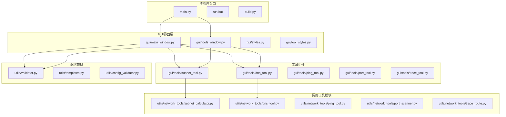
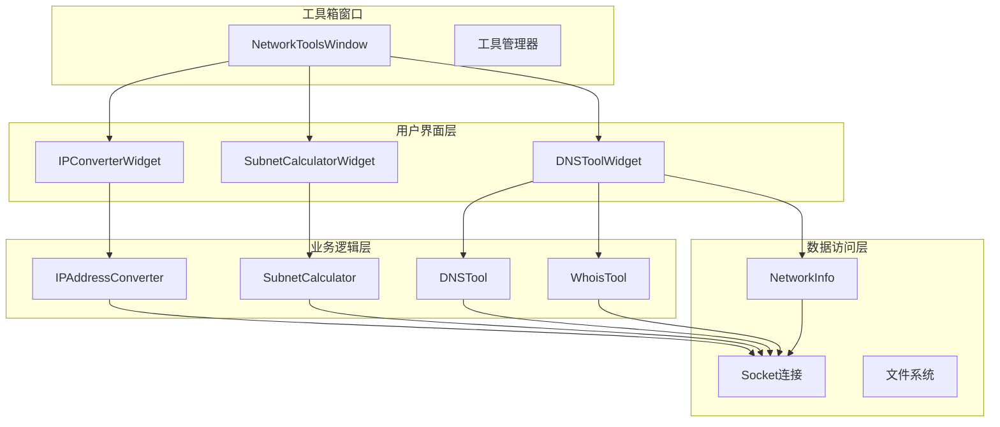
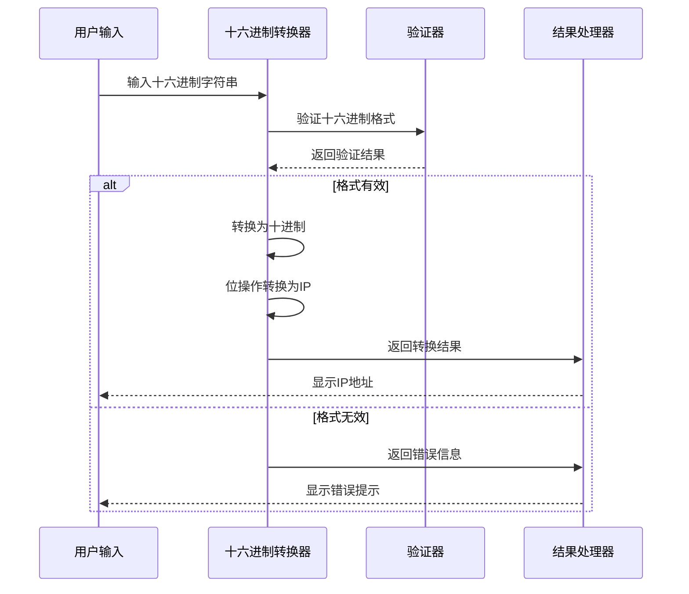
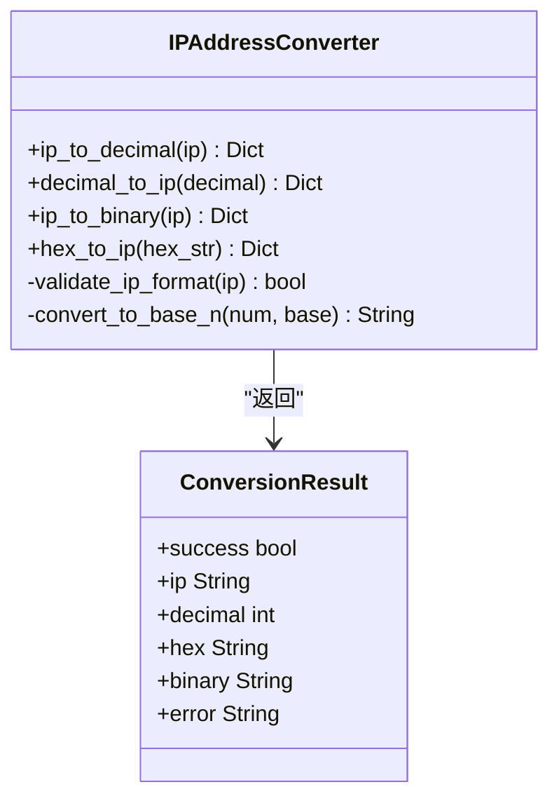
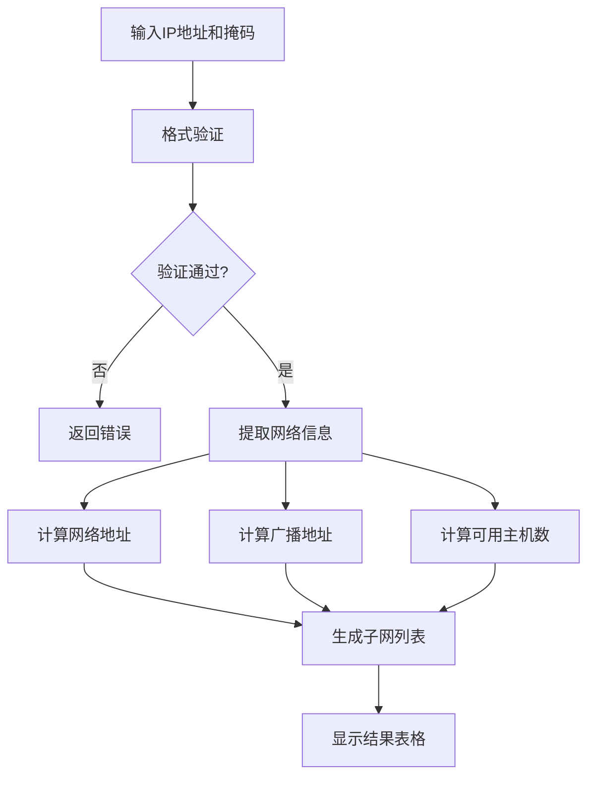
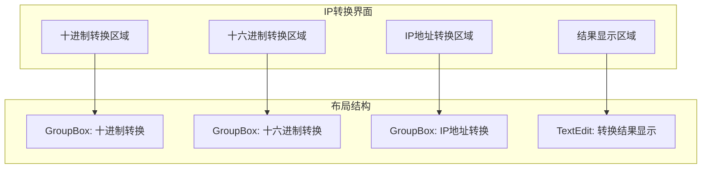
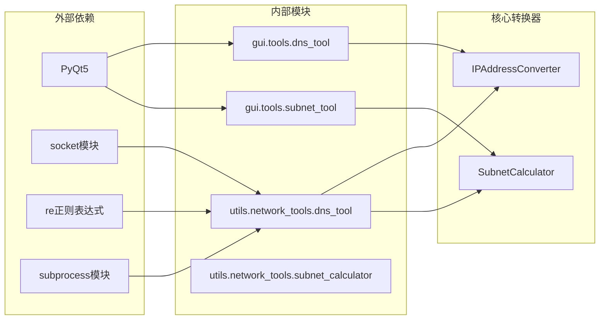
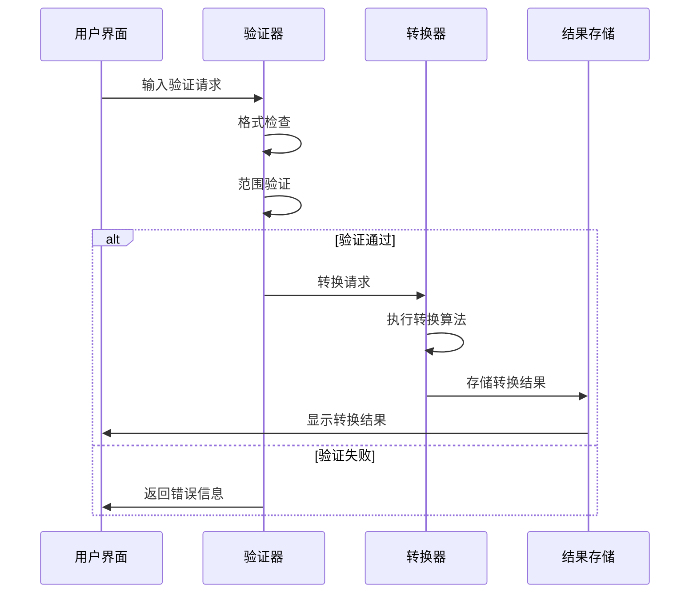
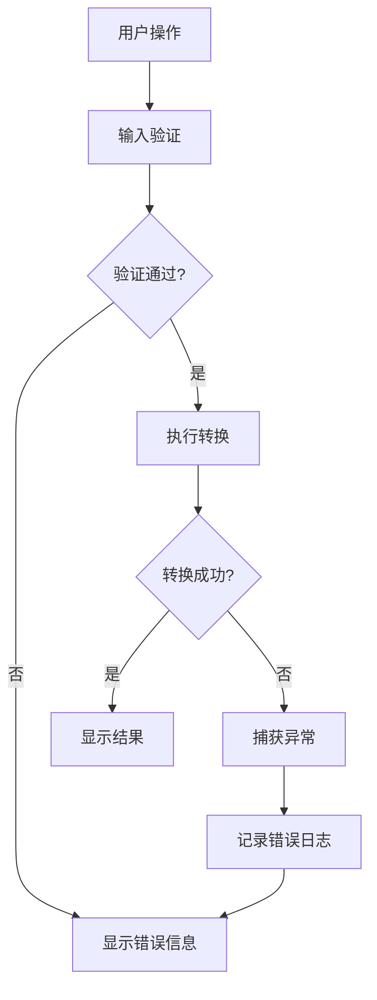

# IP地址转换工具

<cite>
**本文档引用的文件**
- [main.py](file://opensource/NetOps-toolkit/main.py)
- [README.md](file://opensource/NetOps-toolkit/README.md)
- [subnet_tool.py](file://opensource/NetOps-toolkit/gui/tools/subnet_tool.py)
- [subnet_calculator.py](file://opensource/NetOps-toolkit/utils/network_tools/subnet_calculator.py)
- [dns_tool.py](file://opensource/NetOps-toolkit/gui/tools/dns_tool.py)
- [network_tools_dns.py](file://opensource/NetOps-toolkit/utils/network_tools/dns_tool.py)
- [tools_window.py](file://opensource/NetOps-toolkit/gui/tools_window.py)
- [main_window.py](file://opensource/NetOps-toolkit/gui/main_window.py)
- [validator.py](file://opensource/NetOps-toolkit/utils/validator.py)
</cite>

## 目录
1. [简介](#简介)
2. [项目结构](#项目结构)
3. [核心组件](#核心组件)
4. [架构概览](#架构概览)
5. [详细组件分析](#详细组件分析)
6. [依赖关系分析](#依赖关系分析)
7. [性能考虑](#性能考虑)
8. [故障排除指南](#故障排除指南)
9. [结论](#结论)
10. [附录](#附录)

## 简介

IP地址转换工具是NetOps Toolkit v4.0中的重要组成部分，专注于提供全面的IP地址格式转换功能。该工具集成了多种网络工具，其中IP转换功能支持IPv4与IPv6格式互转、十进制IP地址转换、二进制IP地址转换、IP地址范围计算和网络位掩码转换。

NetOps Toolkit是一个功能强大、现代化界面的多品牌交换机配置生成工具，支持华为/H3C/锐捷/迈普四大品牌，内置11+网络工具，基于Python + PyQt5开发。该工具集不仅提供IP地址转换功能，还包括子网计算器、Ping测试、端口扫描、路由跟踪、DNS/Whois查询等丰富的网络工具。

## 项目结构

NetOps Toolkit采用模块化架构设计，主要目录结构如下：



**图表来源**
- [main.py:1-69](file://opensource/NetOps-toolkit/main.py#L1-L69)
- [gui/main_window.py:144-548](file://opensource/NetOps-toolkit/gui/main_window.py#L144-L548)
- [gui/tools_window.py:28-77](file://opensource/NetOps-toolkit/gui/tools_window.py#L28-L77)

**章节来源**
- [README.md:107-153](file://opensource/NetOps-toolkit/README.md#L107-L153)
- [main.py:1-69](file://opensource/NetOps-toolkit/main.py#L1-L69)

## 核心组件

### IP地址转换工具架构

IP地址转换工具的核心架构由以下关键组件构成：

1. **IPConverterWidget** - GUI界面组件，提供用户交互界面
2. **IPAddressConverter** - 核心转换算法实现
3. **SubnetCalculator** - 子网计算功能
4. **NetworkToolsWindow** - 工具箱窗口管理

### 主要功能特性

| 功能类别 | 具体功能 | 支持格式 |
|---------|----------|----------|
| IPv4转换 | 十进制↔IP地址 | 32位无符号整数 |
| IPv4转换 | 十六进制↔IP地址 | 8位十六进制数 |
| IPv4转换 | 二进制↔IP地址 | 32位二进制数 |
| IPv6支持 | IPv6格式识别 | 标准IPv6格式 |
| 网络计算 | 子网掩码转换 | 前缀长度/掩码互转 |
| 范围计算 | IP范围转CIDR | 起始IP-结束IP |

**章节来源**
- [dns_tool.py:382-540](file://opensource/NetOps-toolkit/gui/tools/dns_tool.py#L382-L540)
- [network_tools_dns.py:416-502](file://opensource/NetOps-toolkit/utils/network_tools/dns_tool.py#L416-L502)

## 架构概览

IP地址转换工具采用分层架构设计，确保功能模块的独立性和可维护性：



**图表来源**
- [gui/tools/dns_tool.py:382-540](file://opensource/NetOps-toolkit/gui/tools/dns_tool.py#L382-L540)
- [gui/tools/subnet_tool.py:27-320](file://opensource/NetOps-toolkit/gui/tools/subnet_tool.py#L27-L320)
- [gui/tools_window.py:28-77](file://opensource/NetOps-toolkit/gui/tools_window.py#L28-L77)

## 详细组件分析

### IP地址转换核心算法

#### 十进制与IP地址转换

十进制与IP地址之间的转换是通过位操作实现的：

```mermaid
flowchart TD
A[输入十进制数] --> B{验证范围}
B --> |有效| C[转换为IP地址]
B --> |无效| D[返回错误]
C --> E[位移操作]
E --> F[(num >> 24) & 255]
E --> G[(num >> 16) & 255]
E --> H[(num >> 8) & 255]
E --> I[num & 255]
F --> J[组合IP地址]
G --> J
H --> J
I --> J
J --> K[输出IP地址]
```

**图表来源**
- [network_tools_dns.py:440-457](file://opensource/NetOps-toolkit/utils/network_tools/dns_tool.py#L440-L457)

#### 十六进制与IP地址转换

十六进制转换采用标准的进制转换算法：



**图表来源**
- [network_tools_dns.py:482-501](file://opensource/NetOps-toolkit/utils/network_tools/dns_tool.py#L482-L501)

#### 二进制与IP地址转换

二进制转换提供了详细的位级操作：



**图表来源**
- [network_tools_dns.py:416-502](file://opensource/NetOps-toolkit/utils/network_tools/dns_tool.py#L416-L502)

**章节来源**
- [network_tools_dns.py:416-502](file://opensource/NetOps-toolkit/utils/network_tools/dns_tool.py#L416-L502)

### 子网计算器集成

子网计算器提供了完整的IP地址范围计算功能：



**图表来源**
- [subnet_calculator.py:51-166](file://opensource/NetOps-toolkit/utils/network_tools/subnet_calculator.py#L51-L166)

**章节来源**
- [subnet_calculator.py:51-280](file://opensource/NetOps-toolkit/utils/network_tools/subnet_calculator.py#L51-L280)

### GUI界面设计

IP转换工具的用户界面采用现代化设计：



**图表来源**
- [dns_tool.py:382-540](file://opensource/NetOps-toolkit/gui/tools/dns_tool.py#L382-L540)

**章节来源**
- [dns_tool.py:382-540](file://opensource/NetOps-toolkit/gui/tools/dns_tool.py#L382-L540)

## 依赖关系分析

### 组件间依赖关系



**图表来源**
- [dns_tool.py:18-24](file://opensource/NetOps-toolkit/gui/tools/dns_tool.py#L18-L24)
- [subnet_tool.py:18-24](file://opensource/NetOps-toolkit/gui/tools/subnet_tool.py#L18-L24)

### 数据流分析

IP地址转换的数据流遵循严格的验证和转换流程：



**图表来源**
- [validator.py:14-31](file://opensource/NetOps-toolkit/utils/validator.py#L14-L31)

**章节来源**
- [validator.py:11-208](file://opensource/NetOps-toolkit/utils/validator.py#L11-L208)

## 性能考虑

### 算法复杂度分析

1. **IP地址转换算法**：时间复杂度O(1)，空间复杂度O(1)
2. **子网计算算法**：时间复杂度O(1)，空间复杂度O(n)（n为子网数量）
3. **IP范围转换算法**：时间复杂度O(k)，空间复杂度O(k)（k为CIDR块数量）

### 内存使用优化

- 采用位操作避免大数运算
- 使用生成器模式处理大量子网数据
- 实现结果缓存机制减少重复计算

### 并发处理

- GUI界面采用异步更新机制
- 网络查询使用超时控制
- 大数据量处理时提供进度反馈

## 故障排除指南

### 常见问题及解决方案

| 问题类型 | 症状描述 | 解决方案 |
|---------|----------|----------|
| 格式验证失败 | 输入被拒绝或显示错误信息 | 检查输入格式是否符合要求 |
| 转换结果异常 | 输出结果不正确 | 验证输入数值范围和格式 |
| 性能问题 | 转换速度慢 | 检查系统资源使用情况 |
| 界面响应问题 | GUI无响应 | 重启应用程序或检查系统兼容性 |

### 错误处理机制



**图表来源**
- [dns_tool.py:485-540](file://opensource/NetOps-toolkit/gui/tools/dns_tool.py#L485-L540)

**章节来源**
- [dns_tool.py:485-540](file://opensource/NetOps-toolkit/gui/tools/dns_tool.py#L485-L540)

## 结论

IP地址转换工具作为NetOps Toolkit的重要组成部分，提供了全面而高效的IP地址格式转换功能。该工具集采用了现代化的架构设计，具有以下特点：

1. **功能完整性**：支持多种IP地址格式转换和网络计算功能
2. **用户友好**：提供直观的图形界面和清晰的结果展示
3. **性能高效**：采用优化的算法和数据结构
4. **扩展性强**：模块化设计便于功能扩展和维护

该工具集适用于网络规划、安全配置和系统管理等多种应用场景，为网络工程师提供了强大的技术支持。

## 附录

### 使用场景示例

1. **网络规划**：快速计算子网划分和IP地址分配
2. **安全配置**：验证防火墙规则和访问控制列表
3. **系统管理**：批量转换IP地址格式用于配置文件
4. **故障排查**：验证网络配置和诊断网络问题

### 最佳实践建议

1. **输入验证**：始终进行严格的输入格式验证
2. **结果确认**：转换完成后仔细核对结果准确性
3. **性能监控**：关注大量数据处理时的性能表现
4. **错误处理**：建立完善的错误处理和日志记录机制