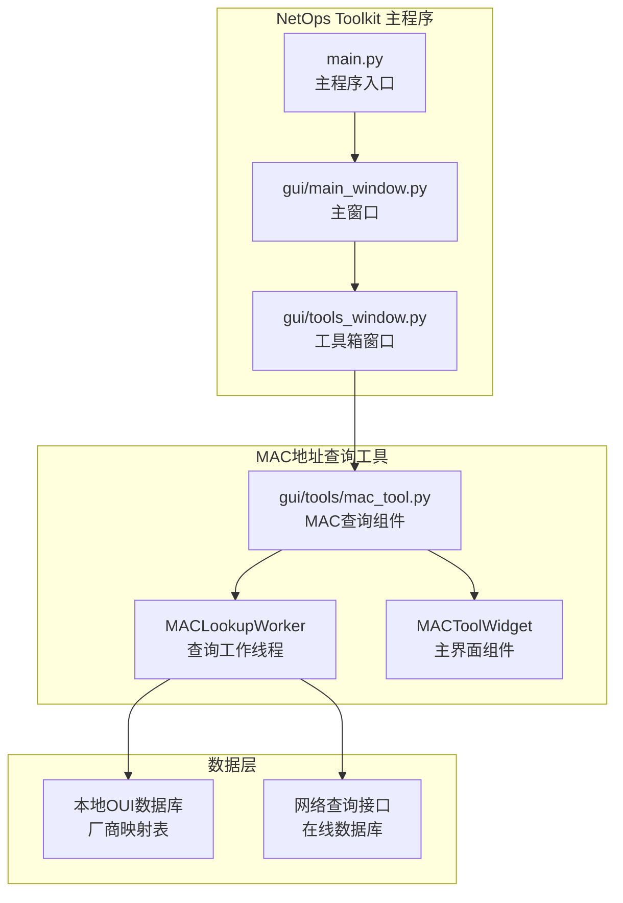
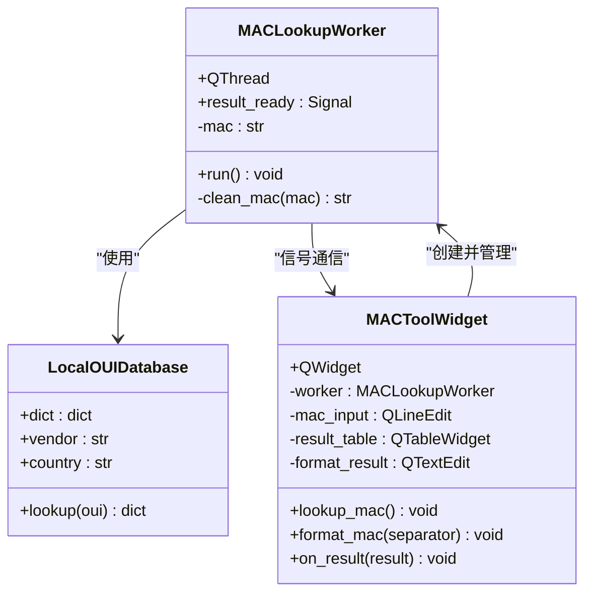
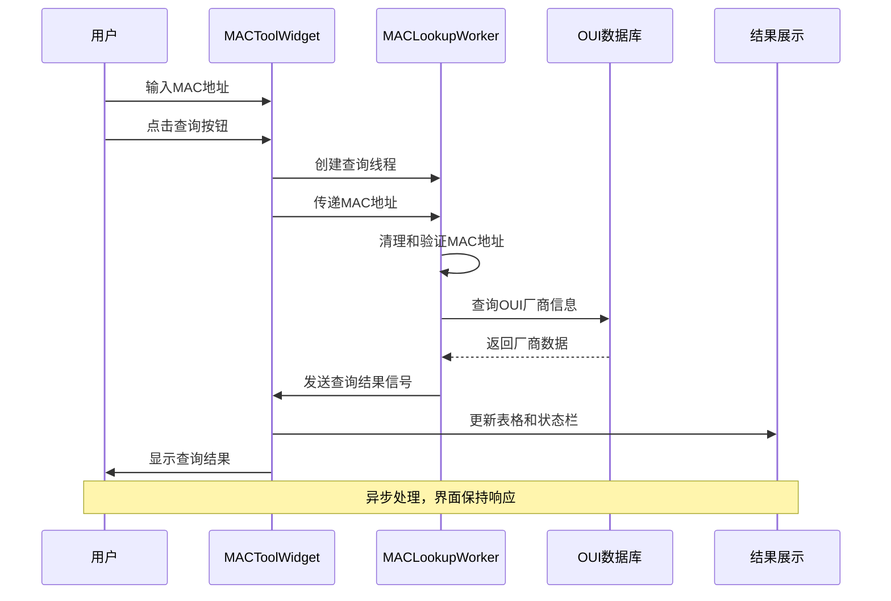
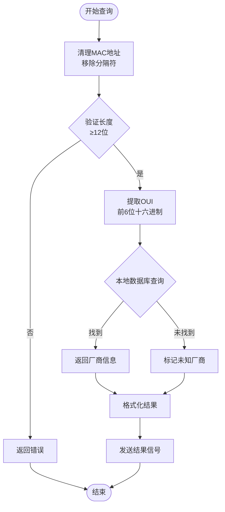
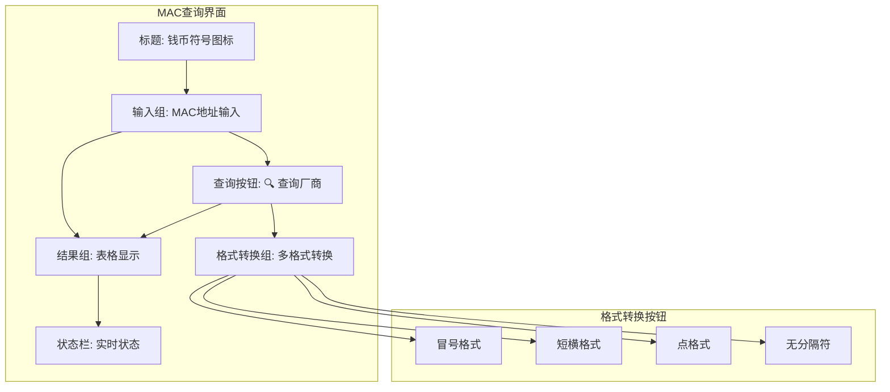
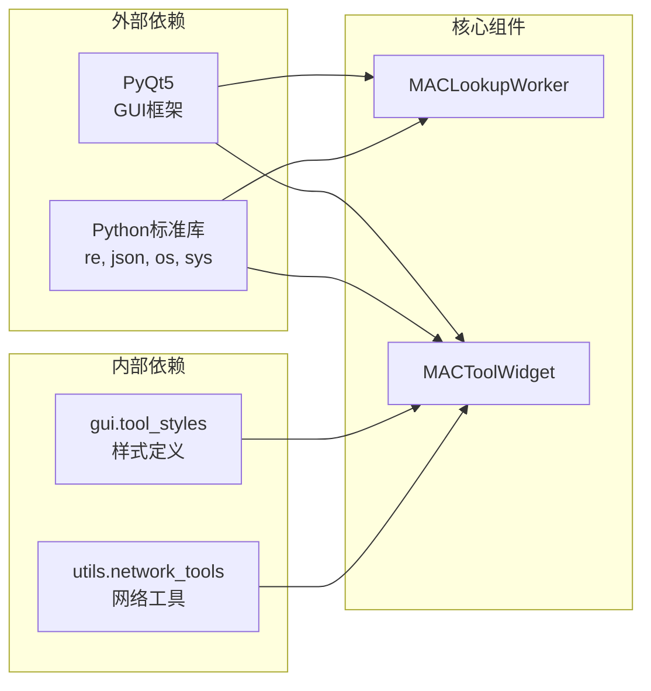

# MAC地址查询工具

<cite>
**本文档引用的文件**
- [mac_tool.py](file://opensource/NetOps-toolkit/gui/tools/mac_tool.py)
- [main.py](file://opensource/NetOps-toolkit/main.py)
- [tools_window.py](file://opensource/NetOps-toolkit/gui/tools_window.py)
- [main_window.py](file://opensource/NetOps-toolkit/gui/main_window.py)
- [command_reference.py](file://opensource/NetOps-toolkit/data/command_reference.py)
- [README.md](file://opensource/NetOps-toolkit/README.md)
</cite>

## 目录
1. [简介](#简介)
2. [项目结构](#项目结构)
3. [核心组件](#核心组件)
4. [架构概览](#架构概览)
5. [详细组件分析](#详细组件分析)
6. [依赖关系分析](#依赖关系分析)
7. [性能考虑](#性能考虑)
8. [故障排除指南](#故障排除指南)
9. [结论](#结论)
10. [附录](#附录)

## 简介

MAC地址查询工具是NetOps Toolkit网络运维工具集中的一个重要组成部分，专门用于网络设备的MAC地址识别和厂商信息查询。该工具基于PyQt5开发，提供了直观的图形用户界面，支持多种MAC地址格式的识别和转换功能。

### 主要功能特性
- **OUI厂商识别**：通过OUI（组织唯一标识符）识别网络设备制造商
- **MAC地址格式转换**：支持冒号、短横线、点格式等多种格式转换
- **实时查询**：异步线程处理，避免界面阻塞
- **厂商数据库**：内置主流网络设备厂商的OUI数据库
- **批量查询**：支持历史记录表格展示

## 项目结构

NetOps Toolkit采用模块化架构设计，MAC地址查询工具作为独立的GUI组件集成在工具箱中。

**图表来源**
- [main.py:25-44](file://opensource/NetOps-toolkit/main.py#L25-L44)
- [tools_window.py:28-77](file://opensource/NetOps-toolkit/gui/tools_window.py#L28-L77)
- [mac_tool.py:29-376](file://opensource/NetOps-toolkit/gui/tools/mac_tool.py#L29-L376)

**章节来源**
- [main.py:1-69](file://opensource/NetOps-toolkit/main.py#L1-L69)
- [README.md:107-153](file://opensource/NetOps-toolkit/README.md#L107-L153)

## 核心组件

MAC地址查询工具由三个核心组件构成：查询工作线程、主界面组件和本地OUI数据库。

### 组件架构

**图表来源**
- [mac_tool.py:29-376](file://opensource/NetOps-toolkit/gui/tools/mac_tool.py#L29-L376)

### 数据结构分析

工具使用字典结构存储OUI厂商映射关系，采用OUI前6位十六进制数作为键，厂商信息作为值。

**章节来源**
- [mac_tool.py:51-175](file://opensource/NetOps-toolkit/gui/tools/mac_tool.py#L51-L175)

## 架构概览

MAC地址查询工具采用事件驱动的异步架构，确保用户界面的响应性和查询效率。

**图表来源**
- [mac_tool.py:292-335](file://opensource/NetOps-toolkit/gui/tools/mac_tool.py#L292-L335)
- [mac_tool.py:302-305](file://opensource/NetOps-toolkit/gui/tools/mac_tool.py#L302-L305)

## 详细组件分析

### 查询工作线程 (MACLookupWorker)

查询工作线程负责执行实际的MAC地址查询操作，采用异步处理避免界面冻结。

#### 核心功能
- **MAC地址清理**：移除分隔符，转换为统一格式
- **OUI提取**：从MAC地址中提取前6位作为OUI
- **厂商查询**：在本地数据库中查找对应厂商信息
- **结果处理**：格式化查询结果并发送给主线程

#### 处理流程

**图表来源**
- [mac_tool.py:37-191](file://opensource/NetOps-toolkit/gui/tools/mac_tool.py#L37-L191)

**章节来源**
- [mac_tool.py:29-195](file://opensource/NetOps-toolkit/gui/tools/mac_tool.py#L29-L195)

### 主界面组件 (MACToolWidget)

主界面组件提供完整的用户交互界面，包含输入区域、格式转换功能和结果显示区域。

#### 界面布局

**图表来源**
- [mac_tool.py:205-291](file://opensource/NetOps-toolkit/gui/tools/mac_tool.py#L205-L291)

#### 功能特性
- **多格式支持**：支持冒号、短横线、点格式等多种输入格式
- **实时验证**：输入时进行格式验证和提示
- **批量查询**：历史查询结果以表格形式展示
- **颜色编码**：成功查询显示绿色，失败查询显示黄色

**章节来源**
- [mac_tool.py:197-376](file://opensource/NetOps-toolkit/gui/tools/mac_tool.py#L197-L376)

### OUI厂商数据库

工具内置了超过150个主流网络设备厂商的OUI数据库，涵盖华为、H3C、Cisco、Dell、Apple等知名品牌。

#### 数据库结构

| OUI前缀 | 厂商名称 | 国家/地区 |
|---------|----------|-----------|
| 001A2C | Huawei | China |
| 001E10 | H3C | China |
| 00000C | Cisco | USA |
| 001B2B | Dell | USA |
| 000393 | Apple | USA |
| 000BB4 | Intel | USA |
| 001D09 | Juniper | USA |
| 002423 | D-Link | Taiwan |
| 0011FB | TP-Link | China |
| 00B0D0 | Microsoft | USA |

**章节来源**
- [mac_tool.py:51-175](file://opensource/NetOps-toolkit/gui/tools/mac_tool.py#L51-L175)

## 依赖关系分析

MAC地址查询工具与其他组件的依赖关系相对简单，主要依赖于GUI框架和本地数据。

**图表来源**
- [mac_tool.py:7-26](file://opensource/NetOps-toolkit/gui/tools/mac_tool.py#L7-L26)

### 依赖特点
- **低耦合设计**：组件间依赖关系清晰，便于维护和扩展
- **单一职责**：每个组件专注于特定功能，遵循单一职责原则
- **异步通信**：通过信号槽机制实现组件间通信

**章节来源**
- [mac_tool.py:1-376](file://opensource/NetOps-toolkit/gui/tools/mac_tool.py#L1-L376)

## 性能考虑

### 查询性能优化

MAC地址查询工具采用了多项性能优化措施：

1. **异步查询**：使用QThread避免界面阻塞
2. **本地缓存**：OUI数据库直接存储在内存中
3. **正则表达式优化**：使用编译后的正则表达式进行格式清理
4. **结果缓存**：重复查询结果可直接复用

### 内存使用分析

- **数据库大小**：约150个OUI条目，内存占用极小
- **界面组件**：QLineEdit、QTableWidget等控件按需创建
- **线程管理**：查询完成后自动释放工作线程资源

## 故障排除指南

### 常见问题及解决方案

#### MAC地址格式问题
**问题**：输入的MAC地址格式不被识别
**解决方案**：
1. 确认输入格式符合要求（冒号、短横线、点格式）
2. 检查是否包含有效的12位十六进制字符
3. 移除多余的分隔符和空格

#### 查询结果为空
**问题**：查询结果显示"未知厂商"
**可能原因**：
1. OUI不在本地数据库中
2. MAC地址格式不正确
3. 设备为非主流厂商

**解决方法**：
1. 验证MAC地址的完整性
2. 尝试不同的格式转换
3. 手动查询在线数据库

#### 界面无响应
**问题**：点击查询按钮后界面无响应
**排查步骤**：
1. 检查网络连接状态
2. 查看状态栏是否有错误提示
3. 重启应用程序

**章节来源**
- [mac_tool.py:292-335](file://opensource/NetOps-toolkit/gui/tools/mac_tool.py#L292-L335)

## 结论

MAC地址查询工具是一个功能完善、易于使用的网络管理工具。其设计特点包括：

### 优势
- **用户友好**：直观的图形界面和实时反馈
- **功能完整**：支持多种格式转换和厂商识别
- **性能优良**：异步处理确保界面响应性
- **扩展性强**：模块化设计便于功能扩展

### 应用价值
- **网络资产管理**：快速识别网络设备制造商
- **设备溯源分析**：通过MAC地址追踪设备来源
- **网络安全审计**：识别未知或可疑网络设备
- **故障诊断**：辅助网络故障定位和分析

## 附录

### 使用场景和最佳实践

#### 网络设备识别
- **批量设备识别**：收集网络中所有设备的MAC地址
- **厂商分布统计**：统计各厂商设备在网络中的占比
- **设备生命周期管理**：结合厂商信息进行设备管理

#### 设备溯源分析
- **供应链追溯**：通过OUI识别设备制造商
- **质量评估**：基于厂商信誉评估设备质量
- **技术支持**：联系相应厂商获取技术支持

#### 网络安全审计
- **未知设备检测**：识别不在白名单中的设备
- **合规性检查**：验证设备是否符合安全标准
- **威胁分析**：分析可疑设备的潜在风险

### MAC地址格式规范

| 格式类型 | 示例 | 用途 |
|----------|------|------|
| 冒号格式 | 00:1A:2B:3C:4D:5E | 标准网络设备格式 |
| 短横格式 | 00-1A-2B-3C-4D-5E | 某些厂商偏好 |
| 点格式 | 001A.2B3C.4D5E | 交换机设备常用 |
| 无分隔符 | 001A2B3C4D5E | 简化输入格式 |

### 集成使用建议

MAC地址查询工具可以与其他网络工具配合使用，形成完整的网络管理解决方案：

1. **与子网计算器配合**：先识别设备，再分析网络拓扑
2. **与端口扫描工具配合**：识别设备后进一步探测开放端口
3. **与路由跟踪工具配合**：分析设备在网络中的位置关系

**章节来源**
- [README.md:165-181](file://opensource/NetOps-toolkit/README.md#L165-L181)