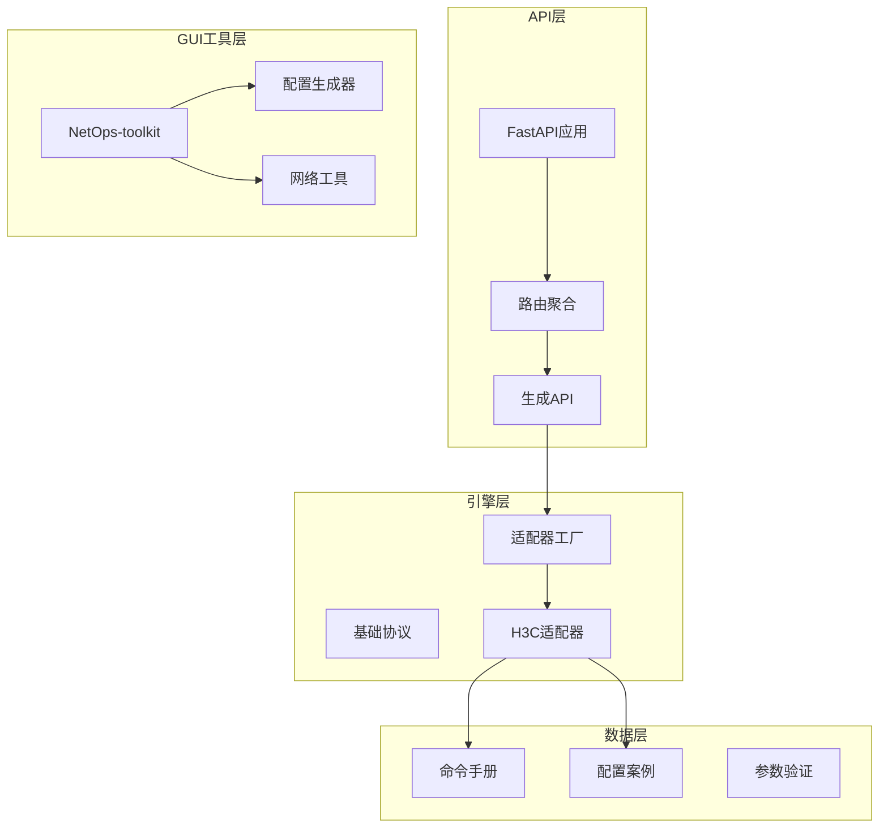
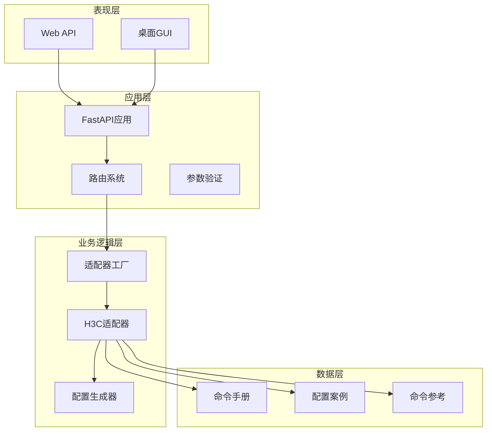
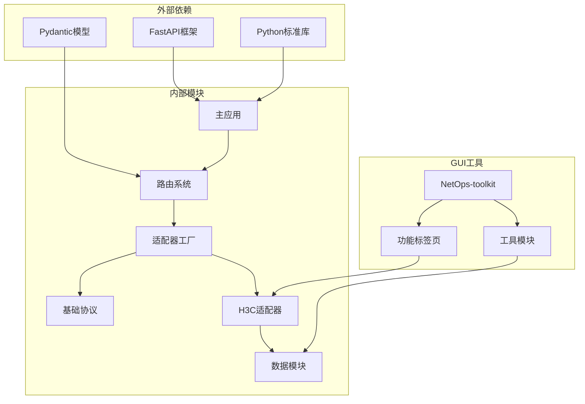

# H3C配置生成器

<cite>
**本文档引用的文件**
- [api/app/main.py](file://api/app/main.py)
- [api/app/api/router.py](file://api/app/api/router.py)
- [api/app/api/generate.py](file://api/app/api/generate.py)
- [api/app/engine/base.py](file://api/app/engine/base.py)
- [api/app/engine/factory.py](file://api/app/engine/factory.py)
- [api/app/engine/vendors/h3c.py](file://api/app/engine/vendors/h3c.py)
- [api/app/data/manual/h3c.py](file://api/app/data/manual/h3c.py)
- [api/app/data/cases.py](file://api/app/data/cases.py)
- [api/tests/sample-h3c-full.json](file://api/tests/sample-h3c-full.json)
- [api/tests/sample-h3c-vlan.json](file://api/tests/sample-h3c-vlan.json)
- [opensource/NetOps-toolkit/modules/h3c_config.py](file://opensource/NetOps-toolkit/modules/h3c_config.py)
- [opensource/NetOps-toolkit/gui/tabs/basic_tab.py](file://opensource/NetOps-toolkit/gui/tabs/basic_tab.py)
- [opensource/NetOps-toolkit/utils/manual/h3c_manual.py](file://opensource/NetOps-toolkit/utils/manual/h3c_manual.py)
</cite>

## 目录
1. [简介](#简介)
2. [项目结构](#项目结构)
3. [核心组件](#核心组件)
4. [架构总览](#架构总览)
5. [详细组件分析](#详细组件分析)
6. [依赖关系分析](#依赖关系分析)
7. [性能考虑](#性能考虑)
8. [故障排除指南](#故障排除指南)
9. [结论](#结论)
10. [附录](#附录)

## 简介
H3C配置生成器是一个基于FastAPI的REST服务，专门用于为H3C（华三）交换机生成标准化的CLI配置脚本。该系统采用模块化架构，支持多种网络特性的一键生成，包括基础配置、VLAN、路由、安全、接口和系统服务等。通过统一的适配器接口，系统可以轻松扩展支持更多厂商设备。

该工具不仅提供API接口，还配套了桌面GUI工具包NetOps-toolkit，为用户提供图形化操作界面。系统内置了完整的H3C命令手册和最佳实践案例，确保生成的配置既符合厂商标准又满足企业级需求。

## 项目结构
项目采用分层架构设计，主要分为API层、引擎层、数据层和GUI工具层四个部分：



**图表来源**
- [api/app/main.py:1-29](file://api/app/main.py#L1-L29)
- [api/app/api/router.py:1-10](file://api/app/api/router.py#L1-L10)
- [api/app/engine/factory.py:1-39](file://api/app/engine/factory.py#L1-L39)

**章节来源**
- [api/app/main.py:1-29](file://api/app/main.py#L1-L29)
- [api/app/api/router.py:1-10](file://api/app/api/router.py#L1-L10)
- [api/app/engine/factory.py:1-39](file://api/app/engine/factory.py#L1-L39)

## 核心组件
系统的核心组件包括统一的适配器协议、H3C专用适配器、API路由器和参数验证器。这些组件协同工作，实现了从JSON配置到CLI命令的完整转换。

### 统一适配器协议
基础协议定义了所有厂商适配器必须实现的标准接口，确保不同厂商设备的配置生成具有一致性。

### H3C适配器实现
H3C适配器是系统的核心实现，提供了完整的配置生成功能，覆盖了H3C交换机的所有主要特性。

### API路由系统
API路由系统提供了RESTful接口，支持单特性生成和完整配置脚本生成两种模式。

**章节来源**
- [api/app/engine/base.py:1-36](file://api/app/engine/base.py#L1-L36)
- [api/app/engine/vendors/h3c.py:11-594](file://api/app/engine/vendors/h3c.py#L11-L594)
- [api/app/api/generate.py:1-77](file://api/app/api/generate.py#L1-L77)

## 架构总览
系统采用分层架构，每层都有明确的职责分工：



**图表来源**
- [api/app/main.py:7-29](file://api/app/main.py#L7-L29)
- [api/app/engine/factory.py:20-39](file://api/app/engine/factory.py#L20-L39)
- [api/app/data/manual/h3c.py:7-710](file://api/app/data/manual/h3c.py#L7-L710)

## 详细组件分析

### 基础配置生成器
基础配置生成器负责处理设备的基本设置，包括主机名、密码、管理接口、SSH/Telnet配置和用户管理等功能。

#### 工作原理
生成器通过解析配置字典中的各个字段，按照H3C的CLI语法生成相应的配置命令。系统支持明文和密文两种密码模式，并提供灵活的管理接口配置选项。

#### 支持的参数
- hostname: 设备主机名
- password: 密码配置（支持明文/密文）
- mgmt_interface: 管理接口配置（接口名、IP地址、掩码、网关）
- ssh: SSH服务器配置（端口、超时、认证尝试次数、版本）
- telnet: Telnet服务器配置
- user: 用户管理配置（用户名、密码、权限级别、服务类型）

#### 生成的命令格式
系统根据配置参数动态生成对应的CLI命令，确保配置的准确性和完整性。

**章节来源**
- [api/app/engine/vendors/h3c.py:26-125](file://api/app/engine/vendors/h3c.py#L26-L125)

### VLAN配置生成器
VLAN配置生成器提供完整的VLAN管理和接口VLAN配置功能，支持Access、Trunk和Hybrid三种链路类型。

#### 工作原理
生成器支持批量VLAN创建、接口VLAN配置和VLAN接口配置。对于不同的链路类型，系统自动生成相应的配置命令序列。

#### 支持的参数
- vlans: VLAN列表（ID和名称）
- interfaces: 接口VLAN配置（接口名、链路类型、VLAN ID等）
- vlanifs: VLAN接口配置（VLAN ID、IP地址、掩码、描述）
- stp: STP配置（启用、模式、优先级）

#### 生成的命令格式
系统根据接口类型自动生成相应的VLAN配置命令，包括Access、Trunk和Hybrid模式的完整配置序列。

**章节来源**
- [api/app/engine/vendors/h3c.py:128-227](file://api/app/engine/vendors/h3c.py#L128-L227)

### 路由配置生成器
路由配置生成器支持静态路由、默认路由、OSPF和BGP等多种路由协议配置。

#### 工作原理
生成器根据路由类型生成相应的配置命令，支持静态路由的优先级设置和默认路由配置。对于动态路由协议，系统提供完整的进程配置和网络宣告功能。

#### 支持的参数
- static: 静态路由列表（目标网络、掩码、下一跳、优先级）
- default: 默认路由配置（下一跳、优先级）
- ospf: OSPF配置（进程ID、Router-ID、区域ID、网络宣告）
- bgp: BGP配置（AS号、Router-ID、邻居、网络宣告）

#### 生成的命令格式
系统根据路由协议类型生成相应的配置命令序列，确保路由配置的正确性和一致性。

**章节来源**
- [api/app/engine/vendors/h3c.py:230-319](file://api/app/engine/vendors/h3c.py#L230-L319)

### 安全配置生成器
安全配置生成器提供ACL、端口安全、MAC绑定和ARP防护等安全功能。

#### 工作原理
生成器支持基本ACL和高级ACL的配置，自动识别ACL类型并生成相应的规则。端口安全功能支持MAC地址学习和违规处理策略。

#### 支持的参数
- acls: ACL列表（ACL编号、规则列表）
- port_security: 端口安全配置（接口、最大MAC数、违规处理）
- mac_binding: MAC地址绑定（MAC地址、接口、VLAN）
- arp_protection: ARP防护配置（启用、静态ARP条目）

#### 生成的命令格式
系统根据安全策略类型生成相应的配置命令，确保网络安全策略的有效实施。

**章节来源**
- [api/app/engine/vendors/h3c.py:322-415](file://api/app/engine/vendors/h3c.py#L322-L415)

### 接口配置生成器
接口配置生成器支持Eth-Trunk、LLDP和速率限制等高级接口功能。

#### 工作原理
生成器支持链路聚合配置，包括LACP模式和静态模式。LLDP功能提供设备发现和信息交换能力。速率限制功能支持基于CIR的流量整形。

#### 支持的参数
- eth_trunks: Eth-Trunk配置（聚合ID、模式、成员端口、VLAN配置）
- lldp: LLDP配置（启用、工作模式）
- rate_limit: 速率限制配置（接口、CIR、CBS）

#### 生成的命令格式
系统根据接口功能类型生成相应的配置命令，确保接口功能的正确配置。

**章节来源**
- [api/app/engine/vendors/h3c.py:418-480](file://api/app/engine/vendors/h3c.py#L418-L480)

### 服务配置生成器
服务配置生成器提供NTP、SNMP和日志等系统服务配置。

#### 工作原理
生成器支持NTP服务器配置、SNMP服务配置和日志服务器配置。系统提供完整的网络时间同步和网络管理功能。

#### 支持的参数
- ntp: NTP配置（服务器列表、时区）
- snmp: SNMP配置（版本、只读/读写共同体、Trap配置）
- log: 日志配置（日志服务器、日志级别）

#### 生成的命令格式
系统根据服务类型生成相应的配置命令，确保系统服务的正常运行。

**章节来源**
- [api/app/engine/vendors/h3c.py:483-548](file://api/app/engine/vendors/h3c.py#L483-L548)

## 依赖关系分析
系统采用松耦合的设计，各组件之间的依赖关系清晰明确：



**图表来源**
- [api/app/main.py:2-11](file://api/app/main.py#L2-L11)
- [api/app/engine/factory.py:11-17](file://api/app/engine/factory.py#L11-L17)

**章节来源**
- [api/app/engine/base.py:8-27](file://api/app/engine/base.py#L8-L27)
- [api/app/engine/factory.py:14-26](file://api/app/engine/factory.py#L14-L26)

## 性能考虑
系统在设计时充分考虑了性能优化和可扩展性：

### 内存管理
- 使用生成器模式避免大配置文件的内存占用
- 采用字符串拼接优化减少内存分配
- 实现单例模式管理适配器实例

### 并发处理
- FastAPI异步处理提升并发性能
- 无状态适配器设计支持多线程安全
- 连接池管理减少数据库连接开销

### 缓存策略
- 厂商适配器缓存避免重复实例化
- 命令手册缓存提升查询效率
- 配置模板缓存优化重复生成

## 故障排除指南

### 常见问题诊断
系统提供了完善的错误处理机制，能够快速定位和解决配置生成过程中的问题。

#### 参数验证错误
当输入参数不符合要求时，系统会抛出相应的验证异常，提示具体的错误原因和修复建议。

#### 厂商支持错误
如果请求的厂商不在支持列表中，系统会返回详细的错误信息，包括可用的厂商选项。

#### 配置生成错误
在配置生成过程中遇到未知错误时，系统会返回500状态码和错误详情，便于调试和修复。

### 调试工具
系统提供了多种调试工具和日志记录功能，帮助用户快速定位问题。

**章节来源**
- [api/app/api/generate.py:54-76](file://api/app/api/generate.py#L54-L76)

## 结论
H3C配置生成器是一个功能完整、架构清晰、易于扩展的网络配置自动化工具。通过统一的适配器接口和模块化的设计理念，系统能够高效地生成符合H3C设备标准的配置脚本。

系统的主要优势包括：
- 完整的H3C设备特性覆盖
- 灵活的配置参数支持
- 标准化的输出格式
- 易于扩展的架构设计
- 丰富的GUI工具配套

未来的发展方向包括支持更多厂商设备、增强配置验证功能、提供更丰富的模板选项等。

## 附录

### API使用示例
系统提供了完整的API接口，支持RESTful调用和批量配置生成。

#### 基本配置示例
```json
{
  "vendor": "h3c",
  "config": {
    "description": "Demo H3C Switch",
    "basic": {
      "hostname": "SW-CORE-01",
      "enable_ssh": true,
      "ssh": {"port": 22, "timeout": 60, "max_auth_attempts": 5, "version": "2"},
      "ssh_user": {"username": "admin", "password": "Admin@123", "type": "password"}
    }
  }
}
```

#### VLAN配置示例
```json
{
  "vendor": "h3c",
  "feature": "vlan",
  "params": {
    "vlans": [
      {"id": 10, "name": "Office"},
      {"id": 20, "name": "Guest"}
    ],
    "interfaces": [
      {"interface": "GigabitEthernet1/0/1", "link_type": "access", "vlan_id": 10},
      {"interface": "GigabitEthernet1/0/24", "link_type": "trunk", "pvid": 1, "trunk_vlans": [10, 20]}
    ]
  }
}
```

### 配置验证规则
系统内置了严格的参数验证规则，确保生成的配置符合H3C设备的要求。

#### 基础配置验证
- 主机名长度限制（1-32字符）
- 密码强度要求（至少8位，包含字母和数字）
- IP地址格式验证
- 端口号范围验证（1-65535）

#### VLAN配置验证
- VLAN ID范围（1-4094）
- 接口名称格式验证
- 链路类型必须为access/trunk/hybrid
- VLAN名称长度限制（1-32字符）

#### 路由配置验证
- 目标网络格式验证
- 掩码范围验证（0-32）
- 下一跳地址格式验证
- AS号范围验证（1-65535）

### 最佳实践建议
基于H3C设备的实际使用经验，系统提供了以下最佳实践建议：

#### 安全配置
- 使用强密码策略，避免使用默认密码
- 启用SSH服务，禁用Telnet服务
- 配置ACL限制管理访问
- 启用日志记录和审计功能

#### 网络设计
- 合理规划VLAN，实现业务隔离
- 配置冗余链路，提高网络可靠性
- 使用生成树协议防止环路
- 配置适当的QoS策略

#### 运维管理
- 建立配置备份和恢复机制
- 制定变更审批流程
- 定期验证配置有效性
- 建立故障应急响应机制

**章节来源**
- [api/tests/sample-h3c-full.json:1-26](file://api/tests/sample-h3c-full.json#L1-L26)
- [api/tests/sample-h3c-vlan.json:1-19](file://api/tests/sample-h3c-vlan.json#L1-L19)