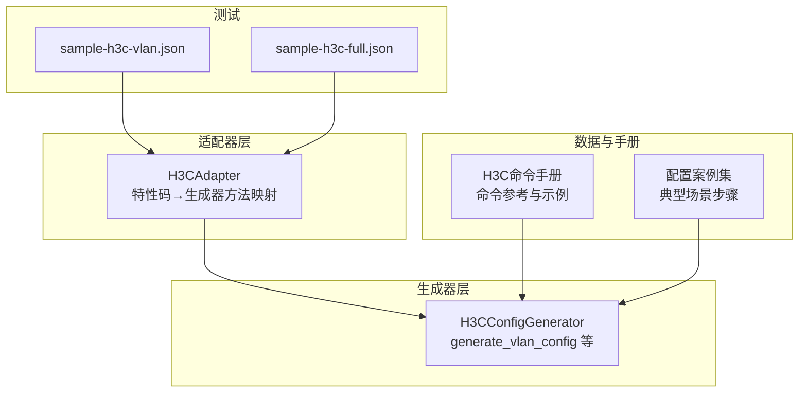
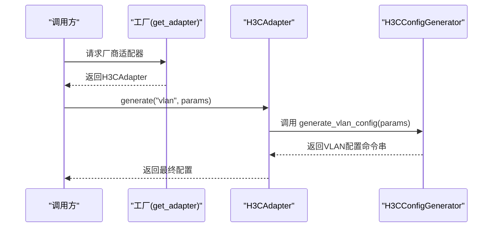
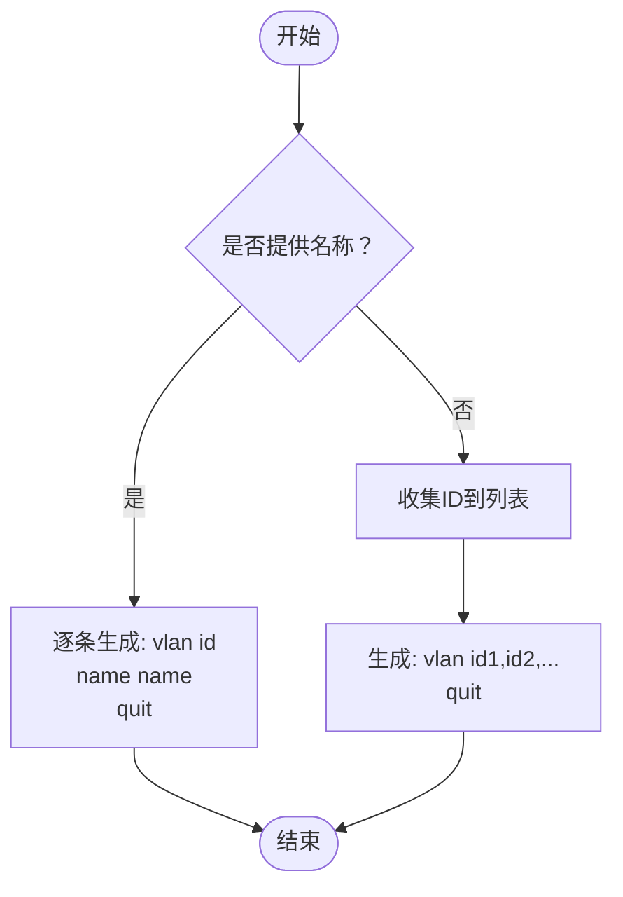
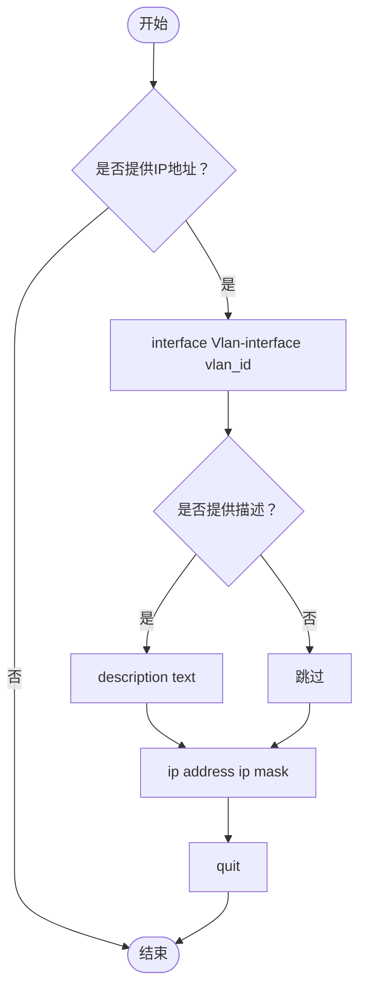
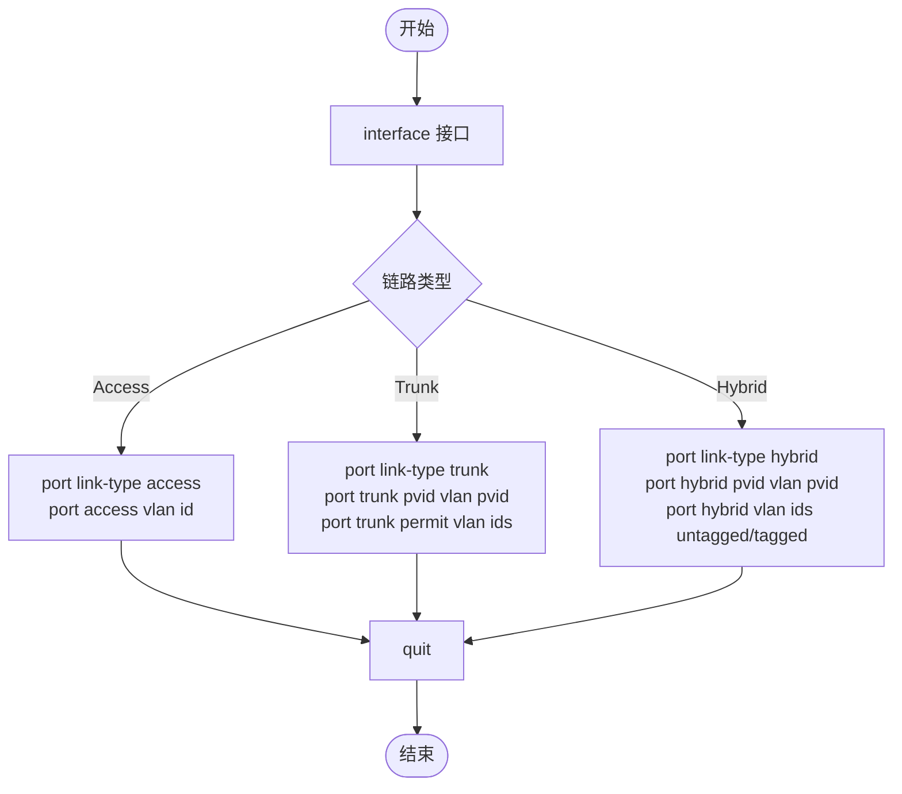
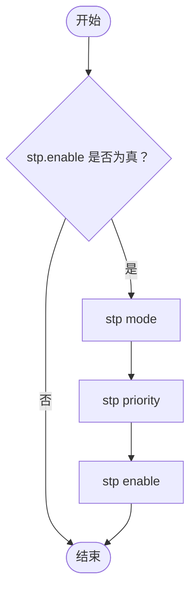
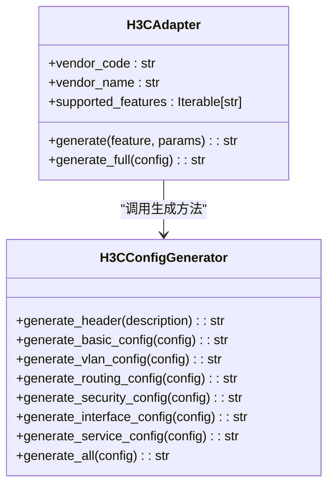
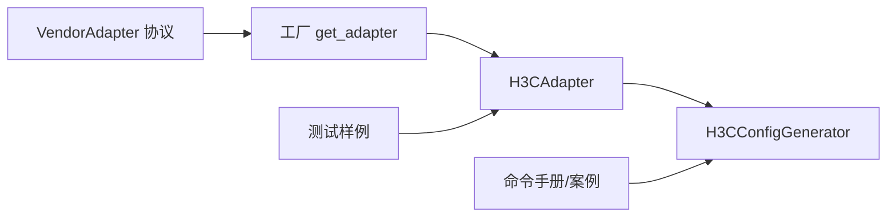

# VLAN配置

<cite>
**本文引用的文件**
- [api/app/engine/vendors/h3c.py](file://api/app/engine/vendors/h3c.py)
- [api/app/engine/adapters/h3c.py](file://api/app/engine/adapters/h3c.py)
- [api/app/engine/base.py](file://api/app/engine/base.py)
- [api/app/engine/factory.py](file://api/app/engine/factory.py)
- [api/app/data/manual/h3c.py](file://api/app/data/manual/h3c.py)
- [api/app/data/cases.py](file://api/app/data/cases.py)
- [api/tests/sample-h3c-vlan.json](file://api/tests/sample-h3c-vlan.json)
- [api/tests/sample-h3c-full.json](file://api/tests/sample-h3c-full.json)
</cite>

## 目录
1. [简介](#简介)
2. [项目结构](#项目结构)
3. [核心组件](#核心组件)
4. [架构总览](#架构总览)
5. [详细组件分析](#详细组件分析)
6. [依赖分析](#依赖分析)
7. [性能考虑](#性能考虑)
8. [故障排查指南](#故障排查指南)
9. [结论](#结论)
10. [附录](#附录)

## 简介
本文件面向H3C VLAN配置生成器，系统化阐述VLAN相关功能的设计与实现，覆盖以下能力：
- VLAN创建与批量创建
- VLAN接口（三层接口）配置
- 接口VLAN配置（Access/Trunk/Hybrid）
- STP配置（含模式选择与优先级）
- 典型使用场景与最佳实践
- 参数校验与生成规则说明
- 性能优化与排障建议

该生成器采用“适配器 + 生成器”的分层架构，通过统一的适配器接口对接不同厂商，并由生成器负责具体命令序列的拼装。

## 项目结构
围绕H3C VLAN配置生成器的关键模块如下：
- 适配器层：将特性码映射到生成器方法
- 生成器层：按特性生成命令序列
- 数据与手册：提供命令参考与案例
- 测试样例：验证输入参数与输出格式

**图表来源**
- [api/app/engine/adapters/h3c.py:14-42](file://api/app/engine/adapters/h3c.py#L14-L42)
- [api/app/engine/vendors/h3c.py:127-227](file://api/app/engine/vendors/h3c.py#L127-L227)
- [api/app/data/manual/h3c.py:7-333](file://api/app/data/manual/h3c.py#L7-L333)
- [api/app/data/cases.py:184-225](file://api/app/data/cases.py#L184-L225)
- [api/tests/sample-h3c-vlan.json:1-19](file://api/tests/sample-h3c-vlan.json#L1-L19)
- [api/tests/sample-h3c-full.json:1-26](file://api/tests/sample-h3c-full.json#L1-L26)

**章节来源**
- [api/app/engine/adapters/h3c.py:14-42](file://api/app/engine/adapters/h3c.py#L14-L42)
- [api/app/engine/vendors/h3c.py:127-227](file://api/app/engine/vendors/h3c.py#L127-L227)
- [api/app/data/manual/h3c.py:7-333](file://api/app/data/manual/h3c.py#L7-L333)
- [api/app/data/cases.py:184-225](file://api/app/data/cases.py#L184-L225)
- [api/tests/sample-h3c-vlan.json:1-19](file://api/tests/sample-h3c-vlan.json#L1-L19)
- [api/tests/sample-h3c-full.json:1-26](file://api/tests/sample-h3c-full.json#L1-L26)

## 核心组件
- H3CAdapter：将特性码（如vlan）映射到H3CConfigGenerator对应生成方法，提供统一的generate/generate_full接口。
- H3CConfigGenerator：实现VLAN配置生成逻辑，包括：
  - VLAN创建与批量创建
  - 接口VLAN配置（Access/Trunk/Hybrid）
  - VLAN接口（三层接口）配置
  - STP配置（模式、优先级、启用）

上述组件均位于适配器与生成器层，配合数据手册与测试样例完成端到端功能验证。

**章节来源**
- [api/app/engine/adapters/h3c.py:14-42](file://api/app/engine/adapters/h3c.py#L14-L42)
- [api/app/engine/vendors/h3c.py:127-227](file://api/app/engine/vendors/h3c.py#L127-L227)

## 架构总览
H3C VLAN配置生成器遵循“适配器 + 生成器”分层设计：
- 适配器负责特性码到生成器方法的映射
- 生成器负责根据输入配置生成命令序列
- 数据手册与案例提供命令参考与场景模板
- 测试样例验证输入参数与输出格式

**图表来源**
- [api/app/engine/factory.py:20-26](file://api/app/engine/factory.py#L20-L26)
- [api/app/engine/adapters/h3c.py:32-38](file://api/app/engine/adapters/h3c.py#L32-L38)
- [api/app/engine/vendors/h3c.py:127-227](file://api/app/engine/vendors/h3c.py#L127-L227)

## 详细组件分析

### VLAN创建与批量创建
- 支持逐个创建VLAN并命名，或批量创建多个VLAN。
- 命令生成逻辑：
  - 若提供名称则逐条生成“vlan id”和“name name”
  - 若未提供名称，则收集所有ID组成一次“vlan id1,id2,...”命令
- 输入参数要点：
  - vlans: 列表，元素包含id与可选name
- 输出命令格式：
  - 单VLAN：进入vlan视图后执行“name”，最后“quit”
  - 多VLAN：一次性生成“vlan id1,id2,...”并“quit”

**图表来源**
- [api/app/engine/vendors/h3c.py:145-161](file://api/app/engine/vendors/h3c.py#L145-L161)

**章节来源**
- [api/app/engine/vendors/h3c.py:145-161](file://api/app/engine/vendors/h3c.py#L145-L161)
- [api/app/data/manual/h3c.py:86-95](file://api/app/data/manual/h3c.py#L86-L95)

### VLAN接口（三层接口）配置
- 功能：为指定VLAN创建三层接口（Vlan-interface），并配置IP地址与可选描述。
- 输入参数要点：
  - vlanifs: 列表，元素包含vlan_id、ip_address、mask（默认255.255.255.0）、description
- 输出命令格式：
  - 进入“interface Vlan-interface vlan_id”
  - 可选“description text”
  - “ip address ip mask”
  - “quit”

**图表来源**
- [api/app/engine/vendors/h3c.py:201-214](file://api/app/engine/vendors/h3c.py#L201-L214)

**章节来源**
- [api/app/engine/vendors/h3c.py:201-214](file://api/app/engine/vendors/h3c.py#L201-L214)
- [api/app/data/manual/h3c.py:93-95](file://api/app/data/manual/h3c.py#L93-L95)

### 接口VLAN配置（Access/Trunk/Hybrid）
- 支持三种链路类型：
  - Access：绑定单一VLAN
  - Trunk：可透传多个VLAN，支持PVID与允许列表
  - Hybrid：可同时配置untagged/tagged VLAN，支持PVID
- 输入参数要点：
  - interfaces: 列表，元素包含interface、link_type、vlan_id（Access）、pvid（Trunk/Hybrid）、trunk_vlans（Trunk）、untagged_vlans/tagged_vlans（Hybrid）
- 输出命令格式：
  - 进入接口视图
  - 根据link_type生成相应命令
  - 最后“quit”

**图表来源**
- [api/app/engine/vendors/h3c.py:163-199](file://api/app/engine/vendors/h3c.py#L163-L199)

**章节来源**
- [api/app/engine/vendors/h3c.py:163-199](file://api/app/engine/vendors/h3c.py#L163-L199)
- [api/app/data/manual/h3c.py:97-106](file://api/app/data/manual/h3c.py#L97-L106)

### STP配置
- 功能：启用并配置生成树协议，支持模式选择（stp/rstp/mstp）与优先级设置。
- 输入参数要点：
  - stp: 字典，包含enable（布尔）、mode（字符串）、priority（数值）
- 输出命令格式：
  - stp mode <mode>
  - stp priority <priority>
  - stp enable

**图表来源**
- [api/app/engine/vendors/h3c.py:216-226](file://api/app/engine/vendors/h3c.py#L216-L226)

**章节来源**
- [api/app/engine/vendors/h3c.py:216-226](file://api/app/engine/vendors/h3c.py#L216-L226)
- [api/app/data/manual/h3c.py:211-226](file://api/app/data/manual/h3c.py#L211-L226)

### 统一生成接口与完整配置
- H3CAdapter提供generate与generate_full两个入口：
  - generate(feature, params)：按特性码生成对应配置片段
  - generate_full(config)：整合basic/vlan/routing/security/interface/service等完整配置
- H3CConfigGenerator.generate_all负责组织各段配置并追加“return”结尾。

**图表来源**
- [api/app/engine/adapters/h3c.py:14-42](file://api/app/engine/adapters/h3c.py#L14-L42)
- [api/app/engine/vendors/h3c.py:11-594](file://api/app/engine/vendors/h3c.py#L11-L594)

**章节来源**
- [api/app/engine/adapters/h3c.py:14-42](file://api/app/engine/adapters/h3c.py#L14-L42)
- [api/app/engine/vendors/h3c.py:550-594](file://api/app/engine/vendors/h3c.py#L550-L594)

## 依赖分析
- 适配器依赖生成器：H3CAdapter将特性码映射到H3CConfigGenerator的静态方法
- 生成器依赖输入参数：根据vlans/interfaces/vlanifs/stp等字段生成命令
- 工厂与协议：通过VendorAdapter协议约束适配器接口，工厂按厂商代码返回适配器实例

**图表来源**
- [api/app/engine/base.py:11-36](file://api/app/engine/base.py#L11-L36)
- [api/app/engine/factory.py:20-26](file://api/app/engine/factory.py#L20-L26)
- [api/app/engine/adapters/h3c.py:14-42](file://api/app/engine/adapters/h3c.py#L14-L42)
- [api/app/engine/vendors/h3c.py:127-227](file://api/app/engine/vendors/h3c.py#L127-L227)

**章节来源**
- [api/app/engine/base.py:11-36](file://api/app/engine/base.py#L11-L36)
- [api/app/engine/factory.py:20-26](file://api/app/engine/factory.py#L20-L26)
- [api/app/engine/adapters/h3c.py:14-42](file://api/app/engine/adapters/h3c.py#L14-L42)
- [api/app/engine/vendors/h3c.py:127-227](file://api/app/engine/vendors/h3c.py#L127-L227)

## 性能考虑
- VLAN批量创建：优先使用一次“vlan id1,id2,...”减少命令数量，提升生成效率
- 接口配置：Access/Trunk/Hybrid分别生成，避免重复进入接口视图
- STP配置：仅在enable为真时生成，避免冗余命令
- 建议：
  - 尽量合并连续的VLAN创建
  - 对Trunk接口，优先明确允许列表，避免使用“all”
  - 合理设置STP优先级，避免频繁收敛

[本节为通用指导，无需特定文件引用]

## 故障排查指南
- VLAN创建失败
  - 检查VLAN ID范围与命名合法性
  - 确认是否已提供名称或ID列表
- 接口VLAN配置异常
  - 确认接口存在且处于正确链路类型
  - Trunk需设置PVID与允许列表；Hybrid需区分untagged/tagged
- VLAN接口无法三层互通
  - 检查Vlan-interface是否存在IP与掩码
  - 确认路由可达与默认路由配置
- STP不生效
  - 确认已启用stp enable
  - 检查模式与优先级设置是否合理

**章节来源**
- [api/app/data/manual/h3c.py:86-106](file://api/app/data/manual/h3c.py#L86-L106)
- [api/app/data/manual/h3c.py:211-226](file://api/app/data/manual/h3c.py#L211-L226)

## 结论
H3C VLAN配置生成器通过清晰的分层设计与严谨的参数映射，实现了从VLAN创建、接口绑定到三层路由与生成树的完整自动化配置生成。结合命令手册与测试样例，可快速落地各类典型场景，并具备良好的可扩展性与可维护性。

[本节为总结，无需特定文件引用]

## 附录

### 使用示例与场景
- Access端口绑定VLAN
  - 输入：interfaces中包含interface、link_type=access、vlan_id
  - 输出：生成“port link-type access”与“port access vlan id”
- Trunk端口透传多个VLAN
  - 输入：interfaces中包含pvid与trunk_vlans
  - 输出：生成“port trunk pvid vlan ...”与“port trunk permit vlan ...”
- Hybrid端口混合模式
  - 输入：interfaces中包含pvid、untagged_vlans、tagged_vlans
  - 输出：生成“port hybrid pvid vlan ...”与“port hybrid vlan ... untagged/tagged”
- VLAN间路由
  - 输入：vlanifs中包含vlan_id与ip_address
  - 输出：生成“interface Vlan-interface ...”与“ip address ...”
- STP配置
  - 输入：stp中包含enable、mode、priority
  - 输出：生成“stp mode ...”、“stp priority ...”、“stp enable”

**章节来源**
- [api/tests/sample-h3c-vlan.json:4-16](file://api/tests/sample-h3c-vlan.json#L4-L16)
- [api/tests/sample-h3c-full.json:11-16](file://api/tests/sample-h3c-full.json#L11-L16)
- [api/app/data/manual/h3c.py:86-106](file://api/app/data/manual/h3c.py#L86-L106)
- [api/app/data/manual/h3c.py:211-226](file://api/app/data/manual/h3c.py#L211-L226)

### 参数与命令对照
- VLAN创建
  - 输入：vlans[id, name?]
  - 命令：vlan id；若提供name则“name name”
- VLAN接口
  - 输入：vlanifs[vlan_id, ip_address, mask?, description?]
  - 命令：interface Vlan-interface vlan_id；ip address ip mask；可选description
- 接口VLAN
  - Access：port link-type access；port access vlan id
  - Trunk：port link-type trunk；port trunk pvid vlan pvid；port trunk permit vlan ids
  - Hybrid：port link-type hybrid；port hybrid pvid vlan pvid；port hybrid vlan ids untagged/tagged
- STP
  - 命令：stp mode <mode>；stp priority <priority>；stp enable

**章节来源**
- [api/app/engine/vendors/h3c.py:145-226](file://api/app/engine/vendors/h3c.py#L145-L226)
- [api/app/data/manual/h3c.py:86-106](file://api/app/data/manual/h3c.py#L86-L106)
- [api/app/data/manual/h3c.py:211-226](file://api/app/data/manual/h3c.py#L211-L226)