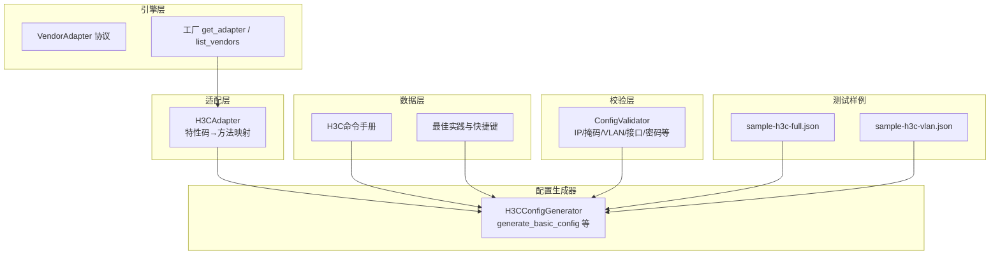
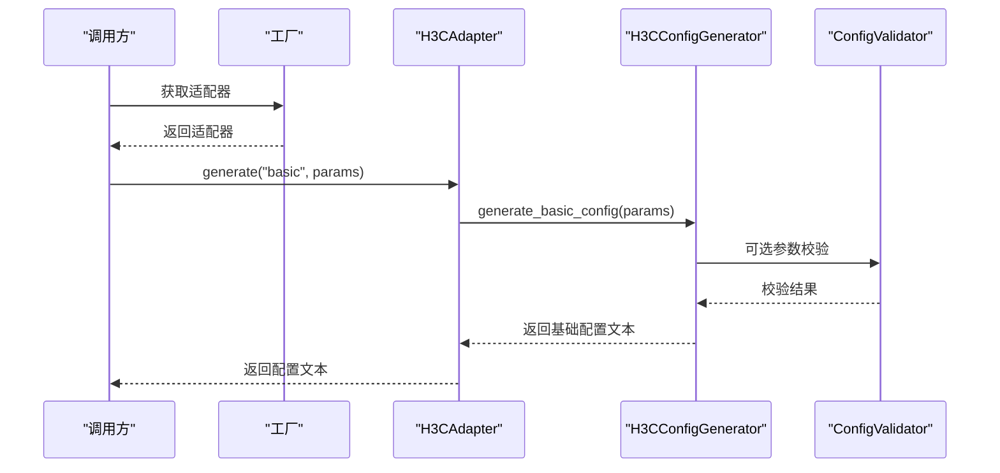
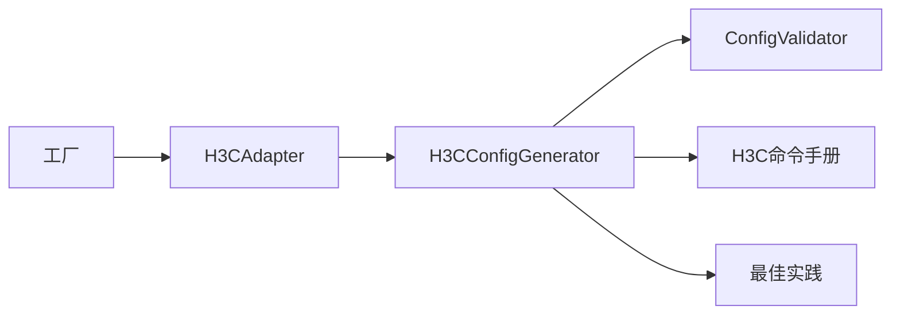

# 基础配置

<cite>
**本文引用的文件**
- [h3c.py](file://api/app/data/manual/h3c.py)
- [h3c.py](file://opensource/NetOps-toolkit/modules/h3c_config.py)
- [h3c.py](file://api/app/engine/adapters/h3c.py)
- [base.py](file://api/app/engine/base.py)
- [factory.py](file://api/app/engine/factory.py)
- [validator.py](file://api/app/core/validator.py)
- [cases.py](file://api/app/data/cases.py)
- [sample-h3c-full.json](file://api/tests/sample-h3c-full.json)
- [sample-h3c-vlan.json](file://api/tests/sample-h3c-vlan.json)
</cite>

## 目录
1. [简介](#简介)
2. [项目结构](#项目结构)
3. [核心组件](#核心组件)
4. [架构总览](#架构总览)
5. [详细组件分析](#详细组件分析)
6. [依赖分析](#依赖分析)
7. [性能考虑](#性能考虑)
8. [故障排查指南](#故障排查指南)
9. [结论](#结论)
10. [附录](#附录)

## 简介
本文件面向“H3C基础配置生成器”，系统化阐述其功能与实现，重点覆盖以下核心配置项：
- 主机名配置（sysname）
- 密码管理（super password）
- 管理接口配置（interface Vlan-interface）
- SSH服务器配置（ssh server）
- Telnet服务器配置（telnet server）
- 用户管理（local-user）

文档同时解释各生成方法的工作原理、支持的参数、生成的命令格式、参数校验规则、安全最佳实践以及常见问题与解决方案，辅以真实配置示例与使用场景说明。

## 项目结构
该工程采用分层与按厂商划分的组织方式：
- 适配层：统一厂商适配器接口，负责特性码到具体生成方法的映射
- 引擎层：提供基础抽象与工厂注册机制
- 数据层：提供厂商命令手册与最佳实践
- 配置生成器：针对不同厂商（含H3C）的具体实现
- 校验层：提供输入参数的格式与强度校验
- 测试样例：提供H3C配置的JSON样例

图表来源
- [h3c.py:14-42](file://api/app/engine/adapters/h3c.py#L14-L42)
- [base.py:11-36](file://api/app/engine/base.py#L11-L36)
- [factory.py:20-39](file://api/app/engine/factory.py#L20-L39)
- [h3c.py:11-126](file://opensource/NetOps-toolkit/modules/h3c_config.py#L11-L126)
- [validator.py:11-208](file://api/app/core/validator.py#L11-L208)
- [cases.py:184-225](file://api/app/data/cases.py#L184-L225)
- [sample-h3c-full.json:1-26](file://api/tests/sample-h3c-full.json#L1-L26)
- [sample-h3c-vlan.json:1-19](file://api/tests/sample-h3c-vlan.json#L1-L19)

章节来源
- [h3c.py:14-42](file://api/app/engine/adapters/h3c.py#L14-L42)
- [base.py:11-36](file://api/app/engine/base.py#L11-L36)
- [factory.py:20-39](file://api/app/engine/factory.py#L20-L39)

## 核心组件
- H3CConfigGenerator：H3C配置生成器，提供基础配置、VLAN配置、路由、安全、接口、服务等生成方法。其中基础配置相关方法包括：
  - generate_basic_config：生成主机名、密码、管理接口、SSH/Telnet、用户等基础配置
  - generate_all：生成完整配置（含头部、各模块）
- H3CAdapter：厂商适配器，将特性码映射到对应生成方法
- VendorAdapter协议与工厂：统一适配器接口与注册机制
- ConfigValidator：参数校验工具，涵盖IP、掩码、VLAN、接口、MAC、主机名、密码、端口、AS号、通配掩码等
- H3C命令手册与最佳实践：提供命令参考、快捷键与安全基线建议

章节来源
- [h3c.py:25-126](file://opensource/NetOps-toolkit/modules/h3c_config.py#L25-L126)
- [h3c.py:550-594](file://opensource/NetOps-toolkit/modules/h3c_config.py#L550-L594)
- [h3c.py:14-42](file://api/app/engine/adapters/h3c.py#L14-L42)
- [base.py:11-36](file://api/app/engine/base.py#L11-L36)
- [factory.py:20-39](file://api/app/engine/factory.py#L20-L39)
- [validator.py:11-208](file://api/app/core/validator.py#L11-L208)
- [h3c.py:7-333](file://api/app/data/manual/h3c.py#L7-L333)
- [cases.py:327-377](file://api/app/data/cases.py#L327-L377)

## 架构总览
H3C基础配置生成器的调用链如下：
- 外部请求通过工厂获取适配器
- 适配器根据特性码调用对应生成方法（如 generate_basic_config）
- 生成器内部按配置字典组装命令序列
- 可选地结合校验器进行参数合法性检查
- 输出最终配置文本

图表来源
- [factory.py:20-39](file://api/app/engine/factory.py#L20-L39)
- [h3c.py:32-42](file://api/app/engine/adapters/h3c.py#L32-L42)
- [h3c.py:25-126](file://opensource/NetOps-toolkit/modules/h3c_config.py#L25-L126)
- [validator.py:11-208](file://api/app/core/validator.py#L11-L208)

## 详细组件分析

### 组件一：主机名配置（sysname）
- 功能说明：设置设备主机名，影响提示符与日志标识
- 参数
  - hostname：字符串，必填
- 生成逻辑
  - 直接拼接 sysname <hostname> 命令
- 参数校验
  - 使用主机名校验规则（长度、字符集）
- 命令参考
  - H3C命令手册中“修改设备名称”条目
- 示例场景
  - 新建设备时统一命名规范
  - 与管理接口、日志、SNMP等联动
- 注意事项
  - 建议使用字母开头，仅含字母、数字、连字符，长度不超过64

章节来源
- [h3c.py:46-47](file://opensource/NetOps-toolkit/modules/h3c_config.py#L46-L47)
- [validator.py:125-137](file://api/app/core/validator.py#L125-L137)
- [h3c.py:10-11](file://api/app/data/manual/h3c.py#L10-L11)

### 组件二：密码管理（super password）
- 功能说明：设置超级密码（用于提升到特权级别的密码），支持明文与密文两种形式
- 参数
  - value：密码值
  - encrypted：布尔，是否密文
- 生成逻辑
  - encrypted=True：生成密文命令
  - encrypted=False：生成明文命令
- 参数校验
  - 使用密码强度校验（长度、字符种类）
- 命令参考
  - H3C命令手册“设置Super密码”
- 示例场景
  - 初始安装后修改默认超级密码
  - 与AAA用户配合，确保最小权限原则
- 最佳实践
  - 优先使用密文
  - 密码强度满足校验规则

章节来源
- [h3c.py:49-57](file://opensource/NetOps-toolkit/modules/h3c_config.py#L49-L57)
- [validator.py:139-161](file://api/app/core/validator.py#L139-L161)
- [h3c.py](file://api/app/data/manual/h3c.py#L29)

### 组件三：管理接口配置（interface Vlan-interface）
- 功能说明：为设备提供管理平面IP，常用于Web、SNMP、SSH/Telnet等管理通道
- 参数
  - interface：接口名，默认 Vlan-interface1
  - ip_address：管理IP
  - mask：子网掩码，默认 255.255.255.0
  - gateway：默认路由网关
- 生成逻辑
  - 若提供IP：进入接口，配置IP与掩码
  - 若提供网关：生成默认路由
- 参数校验
  - IP地址与掩码格式校验
- 命令参考
  - H3C命令手册“VLAN接口”、“配置接口IP”等
- 示例场景
  - 核心/汇聚/接入交换机均应配置管理接口
  - 与静态路由、NTP、SNMP、日志联动
- 注意事项
  - 掩码需为连续1的合法掩码
  - 管理接口应与业务VLAN隔离

章节来源
- [h3c.py:59-72](file://opensource/NetOps-toolkit/modules/h3c_config.py#L59-L72)
- [validator.py:15-57](file://api/app/core/validator.py#L15-L57)
- [h3c.py:93-95](file://api/app/data/manual/h3c.py#L93-L95)

### 组件四：SSH服务器配置（ssh server）
- 功能说明：启用SSH服务，配置端口、超时、认证重试、版本兼容等，并创建SSH用户
- 参数
  - enable_ssh：布尔，是否启用
  - ssh.port：端口，默认22
  - ssh.timeout：超时秒数，默认60
  - ssh.max_auth_attempts：最大认证尝试次数，默认5
  - ssh.version：兼容SSH版本（H3C手册中为“compatible-ssh1x”相关），默认2
  - ssh_user.username：用户名
  - ssh_user.password：密码
  - ssh_user.type：认证类型（如 password）
- 生成逻辑
  - 启用SSH服务
  - 配置端口、超时、认证重试、版本兼容
  - 创建SSH用户，设置服务类型与权限级别
  - 配置VTY允许SSH
- 参数校验
  - 端口范围校验
- 命令参考
  - H3C命令手册“SSH配置”相关条目
- 示例场景
  - 生产环境仅启用SSH，禁用Telnet
  - 为管理员创建专用SSH用户
- 最佳实践
  - 使用强密码
  - 限制最大认证尝试次数
  - 仅允许SSH协议入站

章节来源
- [h3c.py:74-100](file://opensource/NetOps-toolkit/modules/h3c_config.py#L74-L100)
- [validator.py:163-172](file://api/app/core/validator.py#L163-L172)
- [h3c.py:40-49](file://api/app/data/manual/h3c.py#L40-L49)

### 组件五：Telnet服务器配置（telnet server）
- 功能说明：启用Telnet服务，配置VTY允许Telnet
- 参数
  - enable_telnet：布尔，是否启用
- 生成逻辑
  - 启用Telnet服务
  - 配置VTY允许Telnet
- 参数校验
  - 一般无需额外校验，但Telnet不安全，建议禁用
- 命令参考
  - H3C命令手册“Telnet配置”相关条目
- 示例场景
  - 仅在调试或临时维护时启用
- 最佳实践
  - 生产环境关闭Telnet，改用SSH
  - 如需启用，限制访问源或配合ACL

章节来源
- [h3c.py:101-109](file://opensource/NetOps-toolkit/modules/h3c_config.py#L101-L109)
- [h3c.py:51-55](file://api/app/data/manual/h3c.py#L51-L55)

### 组件六：用户管理（local-user）
- 功能说明：创建本地用户，设置密码、权限级别、允许的服务类型
- 参数
  - username：用户名
  - password：密码
  - level：权限级别（0-15）
  - service：服务类型列表（如 ssh、telnet、terminal）
- 生成逻辑
  - 创建local-user
  - 设置密码（明文/密文）
  - 设置权限级别
  - 设置服务类型
- 参数校验
  - 密码强度校验
  - 权限级别范围校验（0-15）
- 命令参考
  - H3C命令手册“用户与权限管理”相关条目
- 示例场景
  - 为不同角色创建用户（运维、审计、访客）
  - 限制用户仅能通过SSH访问
- 最佳实践
  - 不同用户分配最小必要权限
  - 为管理员用户设置强密码

章节来源
- [h3c.py:110-124](file://opensource/NetOps-toolkit/modules/h3c_config.py#L110-L124)
- [validator.py:139-161](file://api/app/core/validator.py#L139-L161)
- [h3c.py:24-34](file://api/app/data/manual/h3c.py#L24-L34)

### 组件七：完整基础配置（generate_all）
- 功能说明：整合基础配置各模块，生成完整配置脚本
- 参数
  - config：顶层字典，包含 description、basic、vlan、routing、security、interface、service 等
- 生成逻辑
  - 生成头部注释
  - 按顺序生成各模块配置
  - 追加结束标记
- 示例场景
  - 一键生成设备初始化配置
  - 与测试样例配合验证生成结果

章节来源
- [h3c.py:550-594](file://opensource/NetOps-toolkit/modules/h3c_config.py#L550-L594)
- [sample-h3c-full.json:1-26](file://api/tests/sample-h3c-full.json#L1-L26)
- [sample-h3c-vlan.json:1-19](file://api/tests/sample-h3c-vlan.json#L1-L19)

## 依赖分析
- 适配器与生成器解耦：H3CAdapter仅做特性码到方法的映射，具体生成逻辑在H3CConfigGenerator中实现
- 工厂注册：通过工厂集中管理适配器，支持后续新增厂商
- 参数校验：生成器可选调用校验器，保证输入质量
- 命令手册与最佳实践：为生成器提供权威命令参考与安全建议

图表来源
- [factory.py:14-39](file://api/app/engine/factory.py#L14-L39)
- [h3c.py:14-42](file://api/app/engine/adapters/h3c.py#L14-L42)
- [h3c.py:11-126](file://opensource/NetOps-toolkit/modules/h3c_config.py#L11-L126)
- [validator.py:11-208](file://api/app/core/validator.py#L11-L208)
- [h3c.py:7-333](file://api/app/data/manual/h3c.py#L7-L333)
- [cases.py:327-377](file://api/app/data/cases.py#L327-L377)

章节来源
- [factory.py:14-39](file://api/app/engine/factory.py#L14-L39)
- [h3c.py:14-42](file://api/app/engine/adapters/h3c.py#L14-L42)
- [h3c.py:11-126](file://opensource/NetOps-toolkit/modules/h3c_config.py#L11-L126)

## 性能考虑
- 生成器为纯字符串拼接，时间复杂度近似 O(N)，N为生成命令行数
- 参数校验为正则与数值范围检查，开销极低
- 建议在批量生成时避免重复校验，可在上层统一校验后再调用生成器

## 故障排查指南
- 常见错误与定位
  - IP/掩码格式错误：使用校验器返回的错误信息定位字段
  - VLAN ID越界：确保在1-4094范围内
  - 接口名称不匹配：参考接口名称正则
  - 密码强度不足：满足长度与字符种类要求
  - 端口范围非法：确保在1-65535之间
- 建议流程
  - 先用校验器验证输入
  - 再调用生成器生成配置
  - 对比命令手册确认命令正确性
  - 通过测试样例验证生成结果一致性

章节来源
- [validator.py:15-208](file://api/app/core/validator.py#L15-L208)
- [h3c.py:7-333](file://api/app/data/manual/h3c.py#L7-L333)
- [sample-h3c-full.json:1-26](file://api/tests/sample-h3c-full.json#L1-L26)
- [sample-h3c-vlan.json:1-19](file://api/tests/sample-h3c-vlan.json#L1-L19)

## 结论
H3C基础配置生成器通过清晰的模块化设计与严格的参数校验，实现了对主机名、密码、管理接口、SSH/Telnet、用户等关键配置的自动化生成。结合命令手册与最佳实践，可显著提升配置效率与一致性，并降低人为错误风险。建议在生产环境中优先使用SSH、强密码与最小权限原则，并通过测试样例持续验证生成结果。

## 附录

### 实际配置示例与使用场景
- 示例一：完整H3C基础配置（来自测试样例）
  - 包含主机名、启用SSH、SSH用户、VLAN、静态路由等
  - 适合新设备初始化与标准化部署
- 示例二：VLAN基础配置（来自测试样例）
  - 包含VLAN、接口VLAN、STP等
  - 适合接入层交换机的快速配置

章节来源
- [sample-h3c-full.json:1-26](file://api/tests/sample-h3c-full.json#L1-L26)
- [sample-h3c-vlan.json:1-19](file://api/tests/sample-h3c-vlan.json#L1-L19)

### 参数验证规则摘要
- IP地址：非空、四段数字、每段0-255
- 子网掩码：合法连续掩码
- VLAN ID：1-4094
- 接口名称：符合H3C接口命名规范
- MAC地址：支持多种格式
- 主机名：字母开头，仅含字母、数字、连字符，长度≤64
- 密码：长度8-128，至少包含大小写字母、数字、特殊字符中的3种
- 端口号：1-65535
- AS号：1-4294967295
- 通配掩码：IP格式且为连续0/1

章节来源
- [validator.py:15-208](file://api/app/core/validator.py#L15-L208)

### 安全配置最佳实践
- 修改默认密码，使用强密码策略
- 关闭Telnet，仅使用SSHv2
- 关闭不必要的服务和端口
- 配置ACL限制管理访问
- 启用日志记录和审计
- 定期备份配置文件

章节来源
- [cases.py:327-377](file://api/app/data/cases.py#L327-L377)