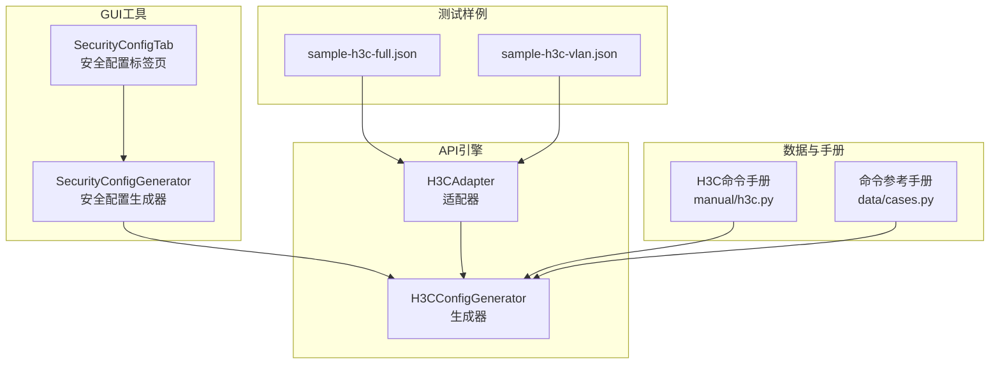
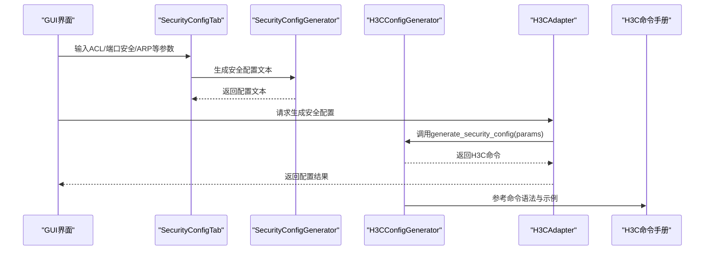
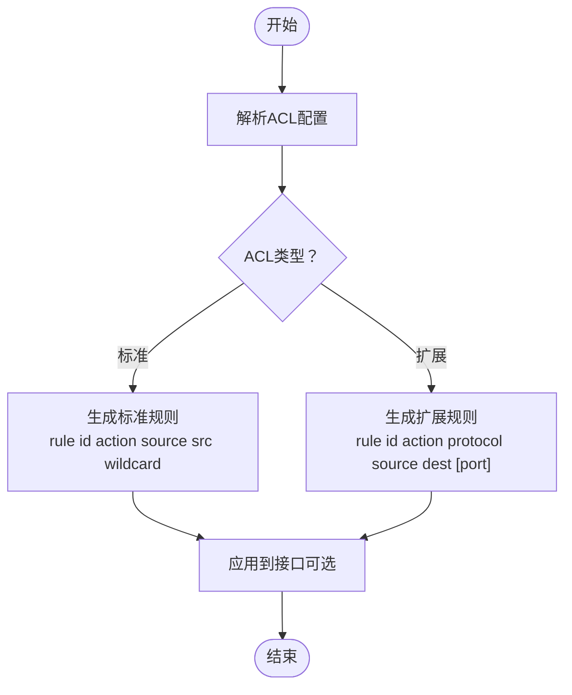
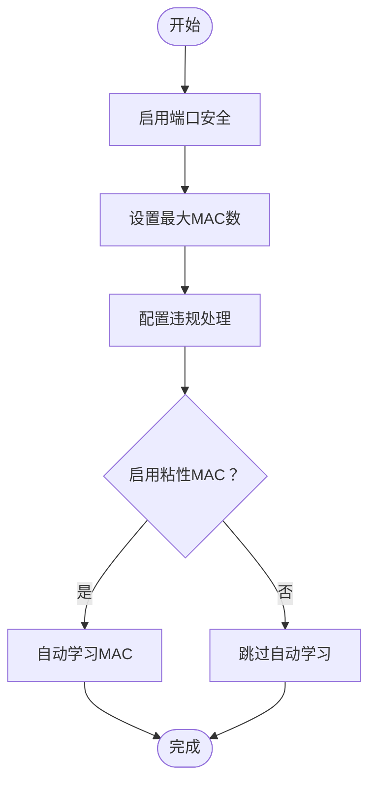
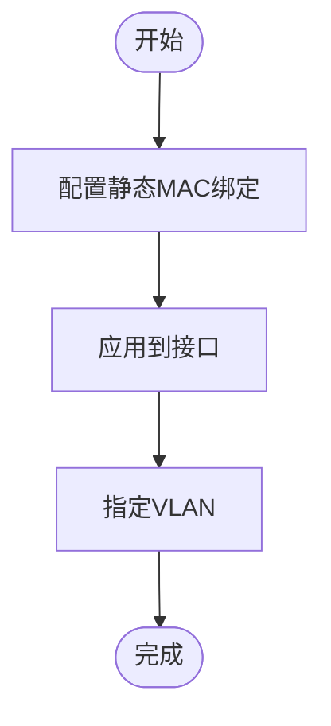
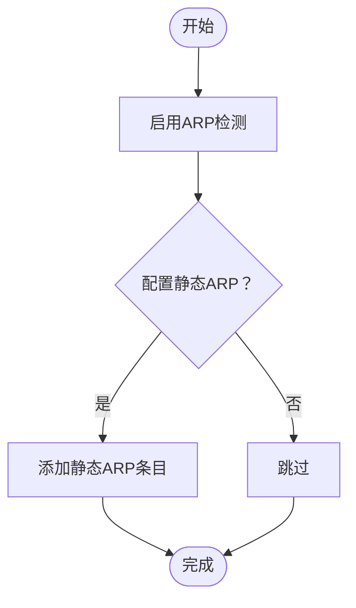
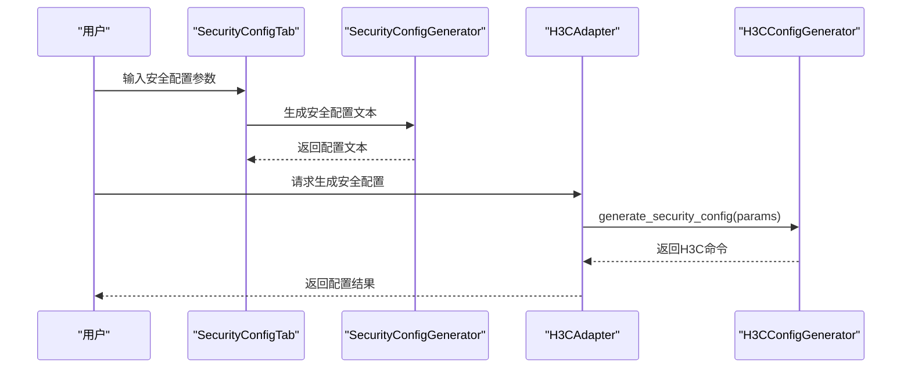
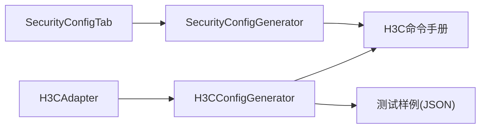

# 安全配置

<cite>
**本文引用的文件**
- [h3c.py](file://api/app/data/manual/h3c.py)
- [h3c.py](file://api/app/engine/vendors/h3c.py)
- [h3c.py](file://api/app/engine/adapters/h3c.py)
- [security_tab.py](file://opensource/NetOps-toolkit/gui/tabs/security_tab.py)
- [security_config.py](file://opensource/NetOps-toolkit/modules/security_config.py)
- [cases.py](file://api/app/data/cases.py)
- [sample-h3c-full.json](file://api/tests/sample-h3c-full.json)
- [sample-h3c-vlan.json](file://api/tests/sample-h3c-vlan.json)
</cite>

## 目录
1. [简介](#简介)
2. [项目结构](#项目结构)
3. [核心组件](#核心组件)
4. [架构总览](#架构总览)
5. [详细组件分析](#详细组件分析)
6. [依赖关系分析](#依赖关系分析)
7. [性能考量](#性能考量)
8. [故障排查指南](#故障排查指南)
9. [结论](#结论)
10. [附录](#附录)

## 简介
本文件面向H3C安全配置生成器，系统化阐述其在ACL配置、端口安全、MAC地址绑定、ARP防护等核心安全功能上的实现机制与使用方法。文档覆盖：
- ACL（标准/扩展）的生成逻辑、参数与命令格式
- 端口安全的最大MAC数量、违规处理策略、粘性MAC学习
- 静态MAC绑定与ARP静态条目的生成
- 安全配置的典型使用场景与最佳实践
- GUI与API两种入口的调用流程与数据模型

## 项目结构
该工程采用“API引擎 + 多厂商适配 + GUI工具”的分层架构：
- API引擎：统一的配置生成器与适配器，负责接收配置参数并输出H3C命令
- 数据手册：提供H3C命令参考与案例
- GUI工具：提供可视化界面，便于交互式生成安全配置
- 测试样例：提供JSON输入样例，便于集成测试与演示

图表来源
- [h3c.py:11-594](file://api/app/engine/vendors/h3c.py#L11-L594)
- [h3c.py:14-42](file://api/app/engine/adapters/h3c.py#L14-L42)
- [h3c.py:171-210](file://api/app/data/manual/h3c.py#L171-L210)
- [cases.py:184-224](file://api/app/data/cases.py#L184-L224)
- [security_tab.py:15-454](file://opensource/NetOps-toolkit/gui/tabs/security_tab.py#L15-L454)
- [security_config.py:8-578](file://opensource/NetOps-toolkit/modules/security_config.py#L8-L578)
- [sample-h3c-full.json:1-26](file://api/tests/sample-h3c-full.json#L1-L26)
- [sample-h3c-vlan.json:1-19](file://api/tests/sample-h3c-vlan.json#L1-L19)

章节来源
- [h3c.py:11-594](file://api/app/engine/vendors/h3c.py#L11-L594)
- [h3c.py:14-42](file://api/app/engine/adapters/h3c.py#L14-L42)
- [h3c.py:171-210](file://api/app/data/manual/h3c.py#L171-L210)
- [cases.py:184-224](file://api/app/data/cases.py#L184-L224)
- [security_tab.py:15-454](file://opensource/NetOps-toolkit/gui/tabs/security_tab.py#L15-L454)
- [security_config.py:8-578](file://opensource/NetOps-toolkit/modules/security_config.py#L8-L578)
- [sample-h3c-full.json:1-26](file://api/tests/sample-h3c-full.json#L1-L26)
- [sample-h3c-vlan.json:1-19](file://api/tests/sample-h3c-vlan.json#L1-L19)

## 核心组件
- H3CConfigGenerator：统一的H3C配置生成器，提供generate_security_config等方法，按字段生成ACL、端口安全、MAC绑定、ARP防护等命令
- H3CAdapter：将特性码映射到具体生成方法，支持security特性
- SecurityConfigGenerator（GUI侧）：提供ACL、端口安全、MAC绑定、ARP静态、风暴抑制、防攻击等生成方法
- H3C命令手册与命令参考：提供ACL、端口安全、ARP防护等命令的语法与示例
- 测试样例：展示如何通过JSON输入驱动生成器

章节来源
- [h3c.py:321-416](file://api/app/engine/vendors/h3c.py#L321-L416)
- [h3c.py:18-38](file://api/app/engine/adapters/h3c.py#L18-L38)
- [security_config.py:8-578](file://opensource/NetOps-toolkit/modules/security_config.py#L8-L578)
- [h3c.py:171-210](file://api/app/data/manual/h3c.py#L171-L210)
- [cases.py:184-224](file://api/app/data/cases.py#L184-L224)

## 架构总览
H3C安全配置生成器的调用链路如下：
- GUI入口：SecurityConfigTab收集用户输入，调用SecurityConfigGenerator生成安全配置文本
- API入口：H3CAdapter根据特性码调用H3CConfigGenerator的对应方法，生成H3C命令
- 数据来源：H3C命令手册与命令参考提供语法与示例，测试样例提供输入结构

图表来源
- [security_tab.py:307-383](file://opensource/NetOps-toolkit/gui/tabs/security_tab.py#L307-L383)
- [security_config.py:389-578](file://opensource/NetOps-toolkit/modules/security_config.py#L389-L578)
- [h3c.py:32-38](file://api/app/engine/adapters/h3c.py#L32-L38)
- [h3c.py:321-416](file://api/app/engine/vendors/h3c.py#L321-L416)
- [h3c.py:171-210](file://api/app/data/manual/h3c.py#L171-L210)

## 详细组件分析

### ACL配置（标准/扩展）
- 支持范围与类型
  - 标准ACL：2000-2999，仅匹配源地址
  - 扩展ACL：3000-3999，支持协议、源/目的地址、目的端口等
- 生成逻辑
  - 根据ACL编号判断类型，逐条生成规则
  - 标准ACL仅包含permit/deny与source；扩展ACL包含协议、源/目的、端口匹配
- 关键参数
  - 编号、规则动作、协议、源/目的地址、反掩码、目的端口、描述
- 命令格式要点
  - acl number <num>
  - rule <id> <action> [protocol] source <src> [wildcard] destination <dst> [wildcard] [destination-port ...]
- 使用场景
  - 基本ACL用于简单网段控制
  - 高级ACL用于精细化流量过滤与端口匹配

图表来源
- [h3c.py:340-375](file://api/app/engine/vendors/h3c.py#L340-L375)
- [h3c.py:172-183](file://api/app/data/manual/h3c.py#L172-L183)

章节来源
- [h3c.py:340-375](file://api/app/engine/vendors/h3c.py#L340-L375)
- [h3c.py:172-183](file://api/app/data/manual/h3c.py#L172-L183)
- [cases.py:94-111](file://api/app/data/cases.py#L94-L111)

### 端口安全配置（port-security）
- 功能要点
  - 启用端口安全、设置最大MAC数量、违规处理（阻断/限制/关闭端口）
  - 可选粘性MAC自动学习
- 关键参数
  - 接口、最大MAC数、违规动作、是否启用粘性MAC
- 命令格式要点
  - interface <if>
  - port-security enable
  - port-security max-mac-count <n>
  - port-security intrusion-mode <blockmac|disableport>
  - port-security port-mode sticky（可选）

图表来源
- [h3c.py:376-389](file://api/app/engine/vendors/h3c.py#L376-L389)
- [h3c.py:185-192](file://api/app/data/manual/h3c.py#L185-L192)

章节来源
- [h3c.py:376-389](file://api/app/engine/vendors/h3c.py#L376-L389)
- [h3c.py:185-192](file://api/app/data/manual/h3c.py#L185-L192)

### MAC地址绑定（mac-address static）
- 功能要点
  - 将特定MAC绑定到接口与VLAN，防止漂移
- 关键参数
  - MAC地址、接口、VLAN
- 命令格式要点
  - mac-address static <mac> interface <if> vlan <vlan>

图表来源
- [h3c.py:390-399](file://api/app/engine/vendors/h3c.py#L390-L399)
- [h3c.py:200-201](file://api/app/data/manual/h3c.py#L200-L201)

章节来源
- [h3c.py:390-399](file://api/app/engine/vendors/h3c.py#L390-L399)
- [h3c.py:200-201](file://api/app/data/manual/h3c.py#L200-L201)

### ARP防护配置（arp-check）
- 功能要点
  - 启用ARP检测，可配置静态ARP条目
- 关键参数
  - 是否启用、静态ARP条目（IP、MAC、接口、VLAN）
- 命令格式要点
  - arp-check enable
  - arp static <ip> <mac> [interface <if>] [vlan <vlan>]

图表来源
- [h3c.py:400-414](file://api/app/engine/vendors/h3c.py#L400-L414)
- [h3c.py:200-204](file://api/app/data/manual/h3c.py#L200-L204)

章节来源
- [h3c.py:400-414](file://api/app/engine/vendors/h3c.py#L400-L414)
- [h3c.py:200-204](file://api/app/data/manual/h3c.py#L200-L204)

### GUI与API调用流程
- GUI侧
  - SecurityConfigTab收集ACL、端口安全、DHCP Snooping、ARP防护、风暴抑制、防攻击等配置
  - 调用SecurityConfigGenerator生成完整安全配置文本
- API侧
  - H3CAdapter根据特性码映射到H3CConfigGenerator的生成方法
  - H3CConfigGenerator按字段生成ACL、端口安全、MAC绑定、ARP防护等命令

图表来源
- [security_tab.py:307-383](file://opensource/NetOps-toolkit/gui/tabs/security_tab.py#L307-L383)
- [security_config.py:389-578](file://opensource/NetOps-toolkit/modules/security_config.py#L389-L578)
- [h3c.py:32-38](file://api/app/engine/adapters/h3c.py#L32-L38)
- [h3c.py:321-416](file://api/app/engine/vendors/h3c.py#L321-L416)

章节来源
- [security_tab.py:307-383](file://opensource/NetOps-toolkit/gui/tabs/security_tab.py#L307-L383)
- [security_config.py:389-578](file://opensource/NetOps-toolkit/modules/security_config.py#L389-L578)
- [h3c.py:32-38](file://api/app/engine/adapters/h3c.py#L32-L38)
- [h3c.py:321-416](file://api/app/engine/vendors/h3c.py#L321-L416)

## 依赖关系分析
- 组件耦合
  - H3CAdapter依赖H3CConfigGenerator的静态方法
  - GUI侧SecurityConfigTab依赖SecurityConfigGenerator
  - 两者均依赖H3C命令手册与命令参考进行语法校验
- 外部依赖
  - JSON输入样例用于驱动API生成器
  - 命令手册提供ACL、端口安全、ARP防护等命令的语法与示例

图表来源
- [h3c.py:18-38](file://api/app/engine/adapters/h3c.py#L18-L38)
- [h3c.py:11-594](file://api/app/engine/vendors/h3c.py#L11-L594)
- [security_tab.py:12-12](file://opensource/NetOps-toolkit/gui/tabs/security_tab.py#L12-L12)
- [security_config.py:8-9](file://opensource/NetOps-toolkit/modules/security_config.py#L8-L9)
- [h3c.py:171-210](file://api/app/data/manual/h3c.py#L171-L210)
- [sample-h3c-full.json:1-26](file://api/tests/sample-h3c-full.json#L1-L26)

章节来源
- [h3c.py:18-38](file://api/app/engine/adapters/h3c.py#L18-L38)
- [h3c.py:11-594](file://api/app/engine/vendors/h3c.py#L11-L594)
- [security_tab.py:12-12](file://opensource/NetOps-toolkit/gui/tabs/security_tab.py#L12-L12)
- [security_config.py:8-9](file://opensource/NetOps-toolkit/modules/security_config.py#L8-L9)
- [h3c.py:171-210](file://api/app/data/manual/h3c.py#L171-L210)
- [sample-h3c-full.json:1-26](file://api/tests/sample-h3c-full.json#L1-L26)

## 性能考量
- 生成器采用线性遍历与拼接，时间复杂度与规则数量成正比
- GUI侧在规则较多时建议分批生成，避免界面卡顿
- 建议在大规模配置场景下使用API批量生成并分段下发

## 故障排查指南
- ACL规则未生效
  - 检查ACL编号范围与类型匹配
  - 确认规则顺序与匹配条件
  - 确认已将ACL应用到正确接口与方向
- 端口安全违规频繁
  - 检查最大MAC数量设置是否合理
  - 确认违规处理策略是否符合预期
  - 如需临时放行，可考虑启用粘性MAC学习
- ARP表异常
  - 启用ARP检测并配置静态ARP条目
  - 清除动态ARP表后重新学习
- 命令语法错误
  - 对照命令手册核对语法
  - 使用测试样例验证输入结构

章节来源
- [h3c.py:171-210](file://api/app/data/manual/h3c.py#L171-L210)
- [cases.py:184-224](file://api/app/data/cases.py#L184-L224)

## 结论
H3C安全配置生成器通过统一的生成器与适配器，结合命令手册与GUI工具，实现了ACL、端口安全、MAC绑定、ARP防护等核心安全功能的自动化生成。其清晰的参数模型与灵活的调用方式，既满足了API集成需求，也提供了友好的图形化体验。建议在生产环境中配合测试样例与最佳实践，确保配置的准确性与可维护性。

## 附录
- 实际使用示例
  - ACL示例：参考命令手册中的ACL配置与应用示例
  - 端口安全示例：参考命令手册中的端口安全配置示例
  - MAC绑定示例：参考命令手册中的静态MAC绑定示例
  - ARP防护示例：参考命令手册中的ARP检测与静态ARP条目示例
- 最佳实践
  - ACL规则应遵循“最小授权”原则，先deny后permit
  - 端口安全最大MAC数应结合业务场景合理设置
  - 静态MAC与ARP条目应与实际网络拓扑保持一致
  - 定期审查与审计安全配置，确保合规与有效性

章节来源
- [h3c.py:171-210](file://api/app/data/manual/h3c.py#L171-L210)
- [cases.py:327-359](file://api/app/data/cases.py#L327-L359)
- [sample-h3c-full.json:1-26](file://api/tests/sample-h3c-full.json#L1-L26)
- [sample-h3c-vlan.json:1-19](file://api/tests/sample-h3c-vlan.json#L1-L19)