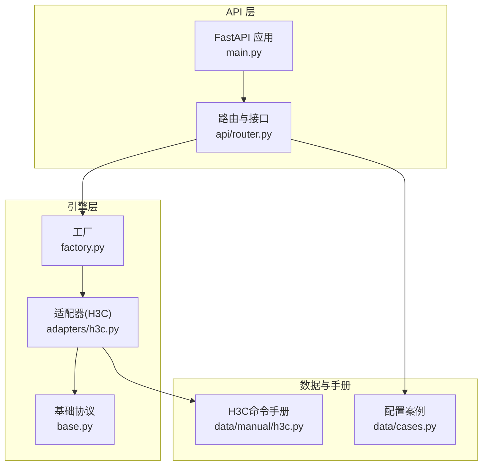
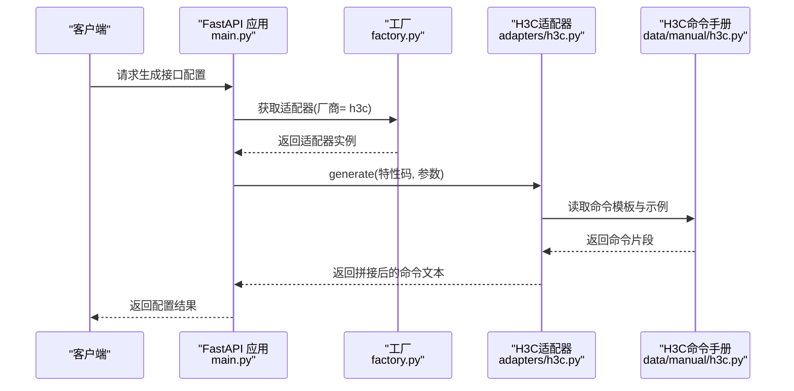
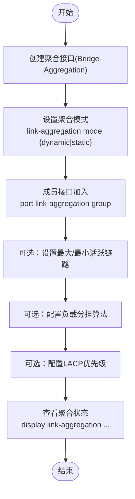
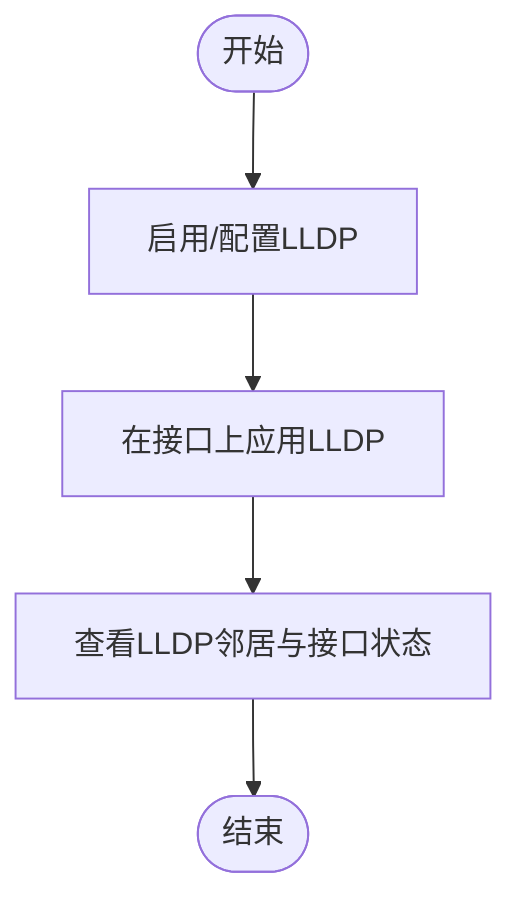
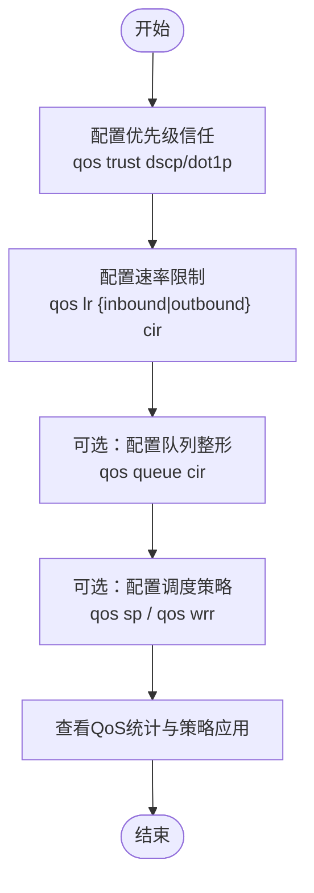
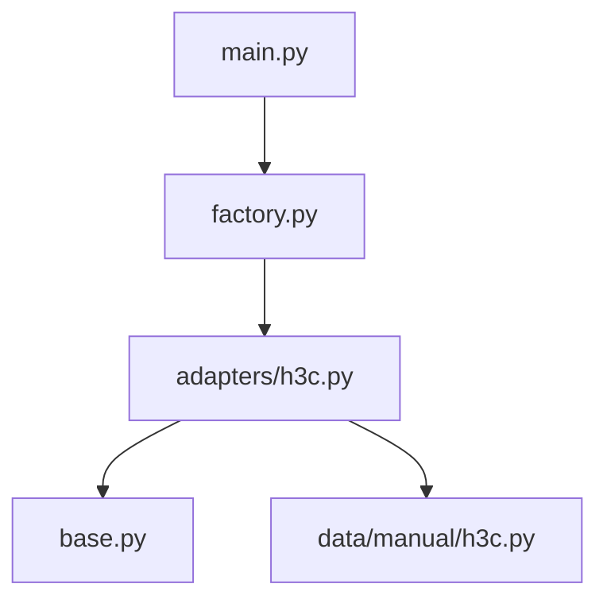

# 接口配置

<cite>
**本文引用的文件**
- [h3c.py](file://api/app/data/manual/h3c.py)
- [h3c.py](file://api/app/engine/adapters/h3c.py)
- [base.py](file://api/app/engine/base.py)
- [factory.py](file://api/app/engine/factory.py)
- [main.py](file://api/app/main.py)
- [cases.py](file://api/app/data/cases.py)
</cite>

## 目录
1. [简介](#简介)
2. [项目结构](#项目结构)
3. [核心组件](#核心组件)
4. [架构总览](#架构总览)
5. [详细组件分析](#详细组件分析)
6. [依赖分析](#依赖分析)
7. [性能考虑](#性能考虑)
8. [故障排查指南](#故障排查指南)
9. [结论](#结论)
10. [附录](#附录)

## 简介
本文件面向“H3C接口配置生成器”的功能说明与使用指导，聚焦于以下高级接口能力：
- Eth-Trunk端口聚合配置（link-aggregation）
- LLDP配置（lldp）
- 接口速率限制（qos lr）

文档将解释各配置生成方法的工作原理、支持的参数与生成的命令格式，提供典型使用场景与最佳实践，包括LACP与静态聚合模式选择、聚合成员配置、LLDP收发模式设置、出站流量整形等。

## 项目结构
该模块位于“api/app”目录下，采用“适配器 + 厂商生成器 + 基础协议 + 工厂”的分层设计：
- 适配器层：负责特性码到具体生成方法的映射
- 厂商生成器层：封装H3C命令手册与生成逻辑
- 基础协议层：定义统一的适配器接口与错误类型
- 工厂层：集中注册与获取适配器实例
- 数据层：提供命令手册与案例样例

图表来源
- [main.py:1-29](file://api/app/main.py#L1-L29)
- [factory.py:1-45](file://api/app/engine/factory.py#L1-L45)
- [h3c.py:1-42](file://api/app/engine/adapters/h3c.py#L1-L42)
- [base.py:1-36](file://api/app/engine/base.py#L1-L36)
- [h3c.py:7-333](file://api/app/data/manual/h3c.py#L7-L333)
- [cases.py:1-377](file://api/app/data/cases.py#L1-L377)

章节来源
- [main.py:1-29](file://api/app/main.py#L1-L29)
- [factory.py:1-45](file://api/app/engine/factory.py#L1-L45)
- [h3c.py:1-42](file://api/app/engine/adapters/h3c.py#L1-L42)
- [base.py:1-36](file://api/app/engine/base.py#L1-L36)
- [h3c.py:7-333](file://api/app/data/manual/h3c.py#L7-L333)
- [cases.py:1-377](file://api/app/data/cases.py#L1-L377)

## 核心组件
- H3C适配器（H3CAdapter）
  - 职责：将特性码映射到H3CConfigGenerator的静态生成方法
  - 支持特性：basic、vlan、routing、security、interface、service
  - 统一接口：generate(feature, params)、generate_full(config)
- H3C命令手册（H3C_COMMANDS）
  - 提供Eth-Trunk、LLDP、QoS等命令模板与示例
  - 包含接口视图、聚合视图、负载分担、LACP优先级等配置项
- 厂商适配器协议（VendorAdapter）
  - 规范统一的接口：vendor_code、vendor_name、supported_features、generate、generate_full
- 工厂（get_adapter）
  - 注册并按厂商代码获取适配器实例
  - 返回可用厂商清单（含特性列表）

章节来源
- [h3c.py:14-42](file://api/app/engine/adapters/h3c.py#L14-L42)
- [h3c.py:7-333](file://api/app/data/manual/h3c.py#L7-L333)
- [base.py:11-36](file://api/app/engine/base.py#L11-L36)
- [factory.py:17-32](file://api/app/engine/factory.py#L17-L32)

## 架构总览
H3C接口配置生成的调用链如下：
- 外部请求通过FastAPI路由进入
- 工厂根据厂商代码获取适配器
- 适配器将特性码映射到H3CConfigGenerator的生成方法
- 生成器基于H3C命令手册与输入参数拼接命令序列

图表来源
- [main.py:22-28](file://api/app/main.py#L22-L28)
- [factory.py:26-32](file://api/app/engine/factory.py#L26-L32)
- [h3c.py:32-42](file://api/app/engine/adapters/h3c.py#L32-L42)
- [h3c.py:7-333](file://api/app/data/manual/h3c.py#L7-L333)

## 详细组件分析

### Eth-Trunk 端口聚合配置（link-aggregation）
- 功能概述
  - 支持创建聚合接口、设置聚合模式（dynamic/static）、配置成员接口、设置最大/最小活跃链路、配置负载分担算法、设置LACP系统/接口优先级
  - 提供聚合状态查询命令，便于验证配置
- 关键命令与参数
  - 创建聚合接口：Bridge-Aggregation 接口号
  - 设置聚合模式：link-aggregation mode {dynamic|static}
  - 成员接口加入：port link-aggregation group {trunk-id}
  - 最大/最小活跃链路：link-aggregation selected-port maximum|minimun
  - 负载分担：link-aggregation load-sharing mode {source-mac|destination-mac|source-ip|destination-ip}
  - LACP优先级：lacp system-priority、lacp port-priority
  - 查询状态：display link-aggregation summary、display link-aggregation verbose
- 使用场景
  - LACP动态聚合：适合两端设备均支持LACP的场景，自动协商链路与负载分担
  - 静态聚合：适合一端为固定模式或不支持LACP的场景，需手工配置一致的聚合组
  - 成员数量控制：通过最大/最小活跃链路保障链路冗余与带宽
- 生成逻辑要点
  - 适配器将特性码映射到H3CConfigGenerator对应生成方法
  - 生成器依据输入参数（聚合组号、模式、成员接口列表、负载分担字段、LACP优先级等）拼接命令序列
  - 输出包含聚合接口创建、模式设置、成员加入、可选的负载分担与优先级配置，以及状态查询命令
- 实际示例与案例
  - 参考“链路聚合配置”案例，展示聚合接口创建、Trunk模式、成员加入、LACP优先级与状态验证

图表来源
- [h3c.py:108-119](file://api/app/data/manual/h3c.py#L108-L119)
- [h3c.py:490-518](file://api/app/data/manual/h3c.py#L490-L518)

章节来源
- [h3c.py:108-119](file://api/app/data/manual/h3c.py#L108-L119)
- [h3c.py:490-518](file://api/app/data/manual/h3c.py#L490-L518)

### LLDP 配置（lldp）
- 功能概述
  - H3C命令手册中提供LLDP相关命令条目，可用于启用/配置LLDP收发模式与邻居发现
  - 生成器通过适配器将特性映射到LLDP相关命令模板
- 关键命令与参数
  - LLDP启用/配置：参考命令手册中的LLDP条目
  - 邻居查看：display lldp neighbors
  - 接口LLDP状态：display lldp interface
- 使用场景
  - 网络发现：通过LLDP获取对端设备/接口信息，辅助拓扑识别
  - 故障定位：结合邻居表判断链路与设备状态
- 生成逻辑要点
  - 输入参数应包含是否启用、收发模式、接口范围等
  - 生成器按参数拼接LLDP命令序列，并提供状态查询命令
- 实际示例与案例
  - 可结合“链路聚合配置”案例中的接口视图进行LLDP启用与验证

图表来源
- [h3c.py:7-333](file://api/app/data/manual/h3c.py#L7-L333)

章节来源
- [h3c.py:7-333](file://api/app/data/manual/h3c.py#L7-L333)

### 接口速率限制（qos lr）
- 功能概述
  - 支持对接口进行入/出方向的速率限制（CIR），实现出站流量整形
  - 可同时配置队列级整形（qos queue），实现更细粒度的带宽控制
- 关键命令与参数
  - 出站整形：qos lr outbound cir <kbps>
  - 入站整形：qos lr inbound cir <kbps>
  - 队列整形：qos queue <queue-id> cir <kbps>
  - 优先级映射：qos trust dscp/dot1p、qos priority
  - 拥塞管理：qos sp、qos wrr queue <id> weight <weight>
- 使用场景
  - 上行出口带宽限制：防止上行拥塞影响其他业务
  - 重要业务优先：通过优先级映射与队列调度保障关键流量
- 生成逻辑要点
  - 输入参数包含方向（inbound/outbound）、CIR值、队列ID与权重等
  - 生成器按参数拼接QoS命令序列，并提供优先级映射与队列调度配置
- 实际示例与案例
  - 参考“QoS流量限速配置”案例，展示ACL匹配、CAR与策略应用

图表来源
- [h3c.py:304-318](file://api/app/data/manual/h3c.py#L304-L318)
- [h3c.py:632-659](file://api/app/data/manual/h3c.py#L632-L659)

章节来源
- [h3c.py:304-318](file://api/app/data/manual/h3c.py#L304-L318)
- [h3c.py:632-659](file://api/app/data/manual/h3c.py#L632-L659)

## 依赖分析
- 组件耦合
  - 适配器依赖工厂注册的实例，且遵循统一协议
  - 适配器通过特性码映射到H3CConfigGenerator的静态方法
  - 生成器依赖H3C命令手册提供命令模板与示例
- 外部依赖
  - FastAPI提供HTTP接口与CORS中间件
  - 无循环依赖，模块职责清晰

图表来源
- [main.py:22-28](file://api/app/main.py#L22-L28)
- [factory.py:17-32](file://api/app/engine/factory.py#L17-L32)
- [h3c.py:14-42](file://api/app/engine/adapters/h3c.py#L14-L42)
- [base.py:11-36](file://api/app/engine/base.py#L11-L36)
- [h3c.py:7-333](file://api/app/data/manual/h3c.py#L7-L333)

章节来源
- [main.py:1-29](file://api/app/main.py#L1-L29)
- [factory.py:1-45](file://api/app/engine/factory.py#L1-L45)
- [h3c.py:1-42](file://api/app/engine/adapters/h3c.py#L1-L42)
- [base.py:1-36](file://api/app/engine/base.py#L1-L36)
- [h3c.py:7-333](file://api/app/data/manual/h3c.py#L7-L333)

## 性能考虑
- 聚合链路配置最佳实践
  - 成员数量与带宽规划：合理设置最大活跃链路，避免过载
  - 负载分担算法：根据业务流量特征选择源/目的MAC/IP，提升负载均衡效果
  - LACP优先级：确保主备链路优先级差异明显，利于收敛与故障切换
- QoS策略配置指南
  - 优先级信任：根据网络策略选择DSCP或802.1p，保持端到端一致
  - 速率限制：出站CIR应留有余量，避免突发流量导致丢包
  - 队列调度：关键业务使用SP，普通业务使用WRR并设置权重
- LLDP网络发现
  - 在接入层启用LLDP，便于自动化发现与资产管理
  - 结合状态查询命令定期校验邻居关系

## 故障排查指南
- 常见问题与定位
  - 聚合不生效：检查聚合模式一致性、成员接口是否加入同一组、活跃链路数量是否满足最小值
  - LLDP邻居缺失：确认接口上已启用LLDP、对端设备是否支持并启用
  - QoS限速异常：核对方向与CIR值、优先级映射是否正确、是否存在更高优先级策略覆盖
- 建议操作
  - 使用命令手册中的状态查询命令进行验证
  - 对照案例样例逐步比对配置差异

章节来源
- [h3c.py:108-119](file://api/app/data/manual/h3c.py#L108-L119)
- [h3c.py:304-318](file://api/app/data/manual/h3c.py#L304-L318)
- [h3c.py:7-333](file://api/app/data/manual/h3c.py#L7-L333)

## 结论
本接口配置生成器通过适配器与工厂模式实现了对H3C命令手册的统一调用，能够高效生成Eth-Trunk聚合、LLDP与QoS速率限制等高级接口配置。结合案例样例与最佳实践，可在不同网络场景中快速落地标准化配置，并通过状态查询命令进行验证与排障。

## 附录
- 使用示例与案例
  - 链路聚合配置：[h3c.py:490-518](file://api/app/data/manual/h3c.py#L490-L518)
  - QoS流量限速配置：[h3c.py:632-659](file://api/app/data/manual/h3c.py#L632-L659)
- 命令手册索引
  - Eth-Trunk与聚合相关命令：[h3c.py:108-119](file://api/app/data/manual/h3c.py#L108-L119)
  - QoS相关命令：[h3c.py:304-318](file://api/app/data/manual/h3c.py#L304-L318)
  - LLDP相关命令：[h3c.py:7-333](file://api/app/data/manual/h3c.py#L7-L333)