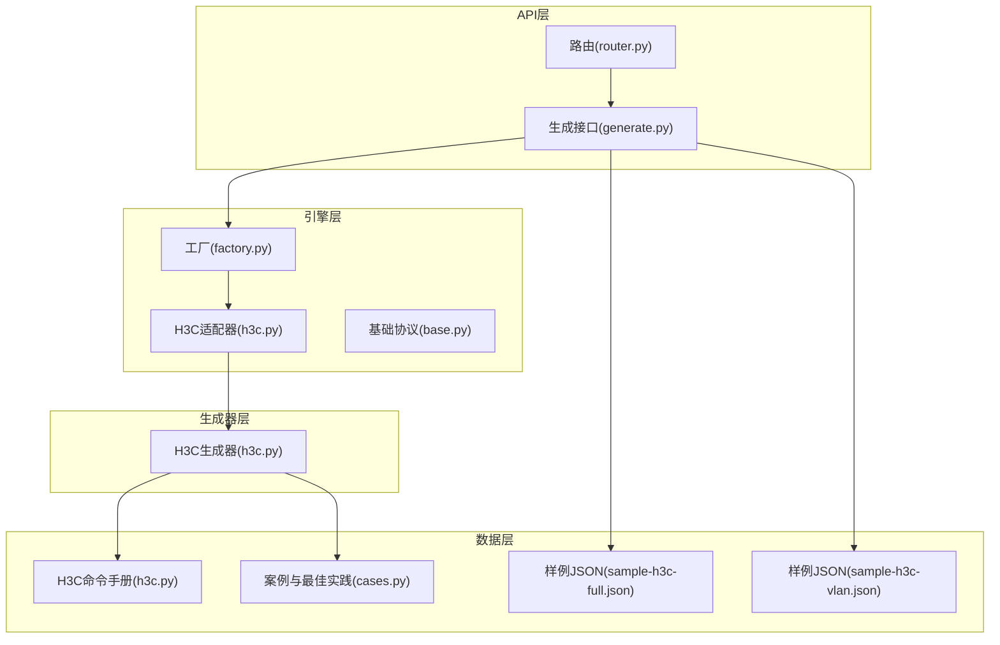
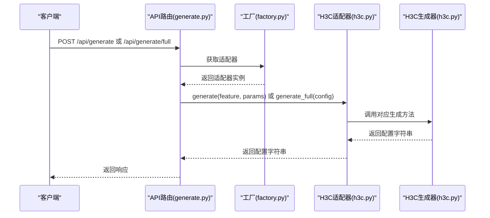
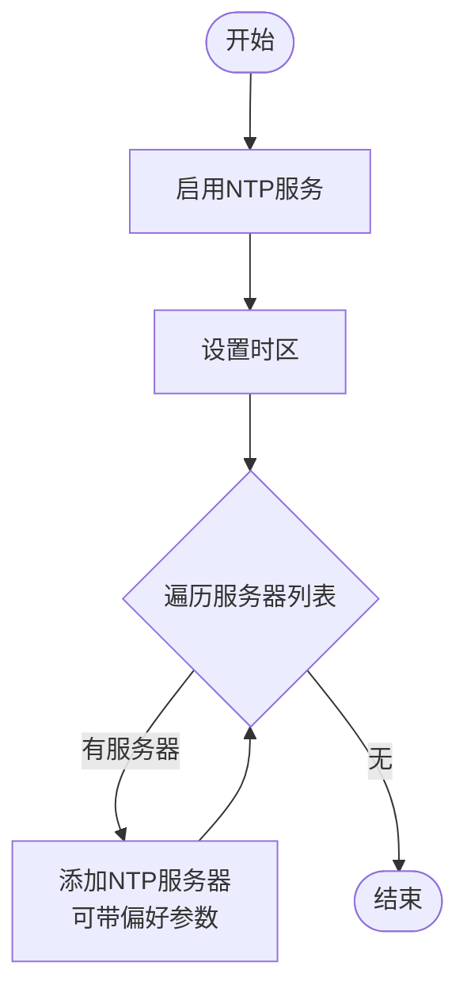
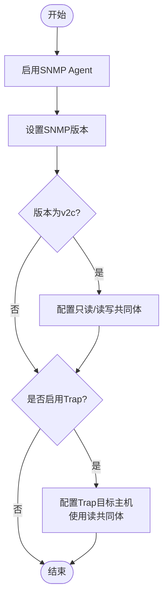
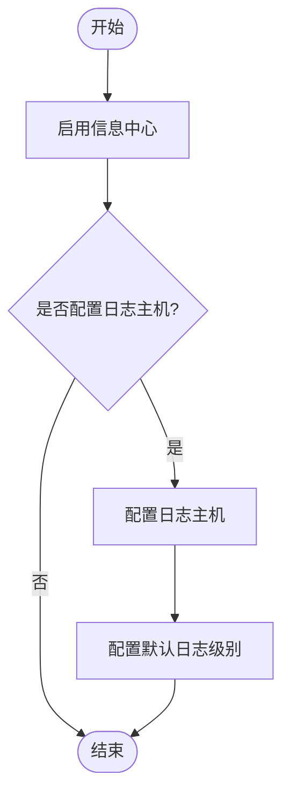
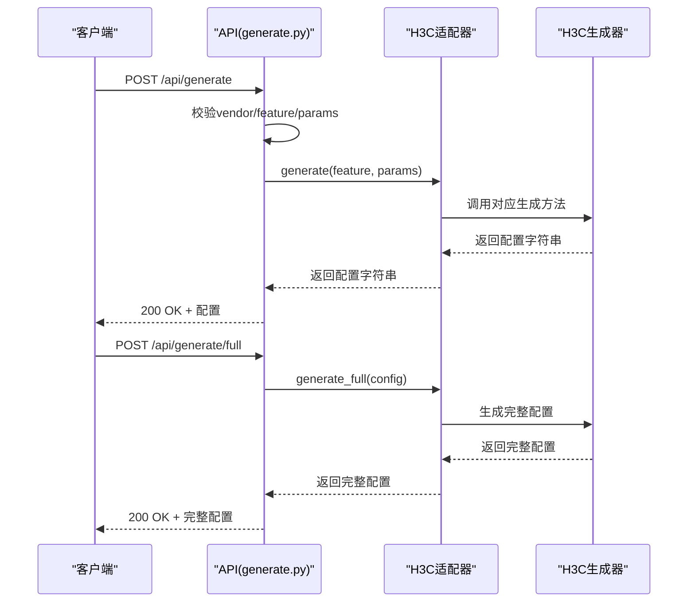
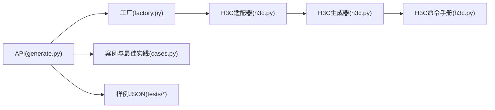

# 服务配置

<cite>
**本文引用的文件**
- [h3c.py](file://api/app/engine/vendors/h3c.py)
- [h3c.py](file://api/app/data/manual/h3c.py)
- [h3c.py](file://api/app/engine/adapters/h3c.py)
- [generate.py](file://api/app/api/generate.py)
- [router.py](file://api/app/api/router.py)
- [base.py](file://api/app/engine/base.py)
- [factory.py](file://api/app/engine/factory.py)
- [cases.py](file://api/app/data/cases.py)
- [sample-h3c-full.json](file://api/tests/sample-h3c-full.json)
- [sample-h3c-vlan.json](file://api/tests/sample-h3c-vlan.json)
</cite>

## 目录
1. [简介](#简介)
2. [项目结构](#项目结构)
3. [核心组件](#核心组件)
4. [架构总览](#架构总览)
5. [详细组件分析](#详细组件分析)
6. [依赖分析](#依赖分析)
7. [性能考虑](#性能考虑)
8. [故障排查指南](#故障排查指南)
9. [结论](#结论)
10. [附录](#附录)

## 简介
本文件面向“H3C服务配置生成器”，系统化阐述其在NTP时间同步、SNMP网络管理、日志管理（info-center）等系统服务方面的功能实现与使用方法。文档覆盖：
- 服务配置生成方法的工作原理与参数支持
- 生成的命令格式与典型应用场景
- 最佳实践与安全建议（时间同步准确性、SNMP安全、日志策略）

## 项目结构
该模块位于API子系统中，采用“适配器 + 生成器”的分层设计：
- 适配器负责特性码到生成器方法的映射
- 生成器集中实现各特性的命令拼装逻辑
- API层提供HTTP接口，接收厂商、特性码与参数，返回配置文本
- 数据层提供命令手册与案例，辅助理解与校验

图表来源
- [router.py:1-11](file://api/app/api/router.py#L1-L11)
- [generate.py:1-77](file://api/app/api/generate.py#L1-L77)
- [factory.py:1-45](file://api/app/engine/factory.py#L1-L45)
- [h3c.py:1-42](file://api/app/engine/adapters/h3c.py#L1-L42)
- [h3c.py:1-594](file://api/app/engine/vendors/h3c.py#L1-L594)
- [h3c.py:1-710](file://api/app/data/manual/h3c.py#L1-L710)
- [cases.py:1-377](file://api/app/data/cases.py#L1-L377)
- [sample-h3c-full.json:1-26](file://api/tests/sample-h3c-full.json#L1-L26)
- [sample-h3c-vlan.json:1-19](file://api/tests/sample-h3c-vlan.json#L1-L19)

章节来源
- [router.py:1-11](file://api/app/api/router.py#L1-L11)
- [generate.py:1-77](file://api/app/api/generate.py#L1-L77)
- [factory.py:1-45](file://api/app/engine/factory.py#L1-L45)
- [h3c.py:1-42](file://api/app/engine/adapters/h3c.py#L1-L42)
- [h3c.py:1-594](file://api/app/engine/vendors/h3c.py#L1-L594)
- [h3c.py:1-710](file://api/app/data/manual/h3c.py#L1-L710)
- [cases.py:1-377](file://api/app/data/cases.py#L1-L377)
- [sample-h3c-full.json:1-26](file://api/tests/sample-h3c-full.json#L1-L26)
- [sample-h3c-vlan.json:1-19](file://api/tests/sample-h3c-vlan.json#L1-L19)

## 核心组件
- H3CConfigGenerator：统一的H3C配置生成器，提供基础、VLAN、路由、安全、接口、服务等配置生成方法
- H3CAdapter：将特性码映射到对应生成器方法，暴露统一的generate/generate_full接口
- API层：FastAPI路由，提供/生成单特性命令片段与完整配置脚本
- 数据与手册：命令手册与案例，用于对照与最佳实践

章节来源
- [h3c.py:11-594](file://api/app/engine/vendors/h3c.py#L11-L594)
- [h3c.py:14-42](file://api/app/engine/adapters/h3c.py#L14-L42)
- [generate.py:21-77](file://api/app/api/generate.py#L21-L77)
- [h3c.py:1-710](file://api/app/data/manual/h3c.py#L1-L710)
- [cases.py:327-377](file://api/app/data/cases.py#L327-L377)

## 架构总览
H3C服务配置生成的调用链如下：
- 客户端通过POST /api/generate或POST /api/generate/full发起请求
- API层解析请求，调用工厂获取H3C适配器
- 适配器根据特性码调用H3CConfigGenerator对应方法
- 生成器按参数组装命令，返回字符串

图表来源
- [generate.py:53-77](file://api/app/api/generate.py#L53-L77)
- [factory.py:26-32](file://api/app/engine/factory.py#L26-L32)
- [h3c.py:32-42](file://api/app/engine/adapters/h3c.py#L32-L42)
- [h3c.py:483-548](file://api/app/engine/vendors/h3c.py#L483-L548)

## 详细组件分析

### NTP时间同步配置（ntp-service）
- 功能概述
  - 启用NTP服务、配置时区、添加NTP服务器（支持主从优先级标记）
- 关键参数
  - ntp.servers：服务器列表，每项含IP与可选prefer标志
  - ntp.timezone：时区字符串，默认UTC+8
- 生成逻辑要点
  - 先启用NTP服务，再设置时区，最后逐台添加服务器
  - prefer为真时追加偏好参数
- 典型场景
  - 内网NTP服务器作为主时钟，外网NTP作为备用
  - 多服务器配置以提升可靠性
- 命令格式参考（来自手册）
  - 启用NTP服务、配置NTP服务器、配置时区

图表来源
- [h3c.py:500-515](file://api/app/engine/vendors/h3c.py#L500-L515)
- [h3c.py:290-296](file://api/app/data/manual/h3c.py#L290-L296)

章节来源
- [h3c.py:500-515](file://api/app/engine/vendors/h3c.py#L500-L515)
- [h3c.py:290-296](file://api/app/data/manual/h3c.py#L290-L296)

### SNMP网络管理配置（snmp-agent）
- 功能概述
  - 启用SNMP Agent，设置版本，配置只读/读写共同体，可选启用Trap并配置Trap目标
- 关键参数
  - snmp.version：v1/v2c/v3/all
  - snmp.community_read：只读共同体
  - snmp.community_write：可选读写共同体
  - snmp.trap_enable：是否启用Trap
  - snmp.trap_host：Trap目标主机IP
- 生成逻辑要点
  - 版本设置后，按版本输出相应共同体配置
  - 启用Trap时，按目标主机与读共同体生成目标主机配置
- 典型场景
  - 使用v2c进行简单监控，配置只读共同体
  - 启用Trap并将告警发往NMS服务器
- 命令格式参考（来自手册）
  - 启用SNMP、设置版本、配置只读/读写共同体、启用Trap、配置Trap目标

图表来源
- [h3c.py:516-536](file://api/app/engine/vendors/h3c.py#L516-L536)
- [h3c.py:280-289](file://api/app/data/manual/h3c.py#L280-L289)

章节来源
- [h3c.py:516-536](file://api/app/engine/vendors/h3c.py#L516-L536)
- [h3c.py:280-289](file://api/app/data/manual/h3c.py#L280-L289)

### 日志配置（info-center）
- 功能概述
  - 启用信息中心，配置日志主机与默认日志级别
- 关键参数
  - log.host：日志服务器IP
  - log.log_level：日志级别（如informational）
- 生成逻辑要点
  - 启用信息中心后，配置日志主机与默认级别
- 典型场景
  - 将设备日志集中到Syslog服务器
  - 按模块/级别精细化控制日志输出
- 命令格式参考（来自手册）
  - 启用信息中心、配置日志主机、配置日志级别

图表来源
- [h3c.py:537-547](file://api/app/engine/vendors/h3c.py#L537-L547)
- [h3c.py:271-279](file://api/app/data/manual/h3c.py#L271-L279)

章节来源
- [h3c.py:537-547](file://api/app/engine/vendors/h3c.py#L537-L547)
- [h3c.py:271-279](file://api/app/data/manual/h3c.py#L271-L279)

### API工作流与错误处理
- 请求模型
  - 单特性生成：vendor、feature、params
  - 完整配置：vendor、config（顶层包含description/basic/vlan/routing/security/interface/service等）
- 错误处理
  - 厂商不支持：抛出VendorNotSupported
  - 特性不支持：抛出FeatureNotSupported
  - 其他异常：返回500与错误详情
- 响应模型
  - vendor、feature（可空）、output

图表来源
- [generate.py:21-77](file://api/app/api/generate.py#L21-L77)
- [h3c.py:32-42](file://api/app/engine/adapters/h3c.py#L32-L42)
- [h3c.py:551-594](file://api/app/engine/vendors/h3c.py#L551-L594)

章节来源
- [generate.py:21-77](file://api/app/api/generate.py#L21-L77)
- [h3c.py:32-42](file://api/app/engine/adapters/h3c.py#L32-L42)
- [h3c.py:551-594](file://api/app/engine/vendors/h3c.py#L551-L594)

## 依赖分析
- 组件耦合
  - API层仅依赖工厂接口，通过适配器解耦具体厂商实现
  - 适配器仅依赖生成器的静态方法签名，保持低耦合
  - 生成器内部不依赖外部框架，便于单元测试与复用
- 外部依赖
  - FastAPI用于API定义与路由
  - Pydantic用于请求/响应模型校验
- 循环依赖
  - 无循环依赖，模块职责清晰

图表来源
- [generate.py:1-77](file://api/app/api/generate.py#L1-L77)
- [factory.py:1-45](file://api/app/engine/factory.py#L1-L45)
- [h3c.py:1-42](file://api/app/engine/adapters/h3c.py#L1-L42)
- [h3c.py:1-594](file://api/app/engine/vendors/h3c.py#L1-L594)
- [h3c.py:1-710](file://api/app/data/manual/h3c.py#L1-L710)
- [cases.py:1-377](file://api/app/data/cases.py#L1-L377)
- [sample-h3c-full.json:1-26](file://api/tests/sample-h3c-full.json#L1-L26)
- [sample-h3c-vlan.json:1-19](file://api/tests/sample-h3c-vlan.json#L1-L19)

章节来源
- [generate.py:1-77](file://api/app/api/generate.py#L1-L77)
- [factory.py:1-45](file://api/app/engine/factory.py#L1-L45)
- [h3c.py:1-42](file://api/app/engine/adapters/h3c.py#L1-L42)
- [h3c.py:1-594](file://api/app/engine/vendors/h3c.py#L1-L594)
- [h3c.py:1-710](file://api/app/data/manual/h3c.py#L1-L710)
- [cases.py:1-377](file://api/app/data/cases.py#L1-L377)
- [sample-h3c-full.json:1-26](file://api/tests/sample-h3c-full.json#L1-L26)
- [sample-h3c-vlan.json:1-19](file://api/tests/sample-h3c-vlan.json#L1-L19)

## 性能考虑
- 生成器为纯函数式拼接，时间复杂度与输入参数规模线性相关
- 建议在批量生成时复用适配器实例，避免重复初始化
- 对于大规模配置，建议分批生成并异步下发，减少单次下发压力

## 故障排查指南
- 常见问题
  - 厂商或特性不支持：检查vendor与feature是否在支持列表中
  - 参数缺失：确保ntp/snmp/log等section存在必要字段
  - 命令冲突：确认生成顺序与手册一致（如先启用服务再配置参数）
- 建议步骤
  - 使用/生成完整配置接口生成完整脚本，核对服务段落
  - 对照命令手册逐条验证关键命令
  - 在测试环境先行下发，观察设备状态与日志

章节来源
- [generate.py:53-77](file://api/app/api/generate.py#L53-L77)
- [h3c.py:32-38](file://api/app/engine/adapters/h3c.py#L32-L38)
- [h3c.py:1-710](file://api/app/data/manual/h3c.py#L1-L710)

## 结论
H3C服务配置生成器通过清晰的适配器与生成器分层，提供了NTP、SNMP、日志等系统服务的自动化配置能力。结合命令手册与案例，可快速生成符合规范的配置脚本，并在实践中持续优化参数与流程。

## 附录

### 使用示例与场景
- 完整配置示例
  - 参考样例JSON：[sample-h3c-full.json:1-26](file://api/tests/sample-h3c-full.json#L1-L26)
  - 包含基础、VLAN、路由等多段配置
- VLAN配置示例
  - 参考样例JSON：[sample-h3c-vlan.json:1-19](file://api/tests/sample-h3c-vlan.json#L1-L19)
  - 展示VLAN、接口、STP等组合

章节来源
- [sample-h3c-full.json:1-26](file://api/tests/sample-h3c-full.json#L1-L26)
- [sample-h3c-vlan.json:1-19](file://api/tests/sample-h3c-vlan.json#L1-L19)

### 最佳实践与建议
- 时间同步
  - 优先使用内网NTP服务器，外网作为备用
  - 启用多服务器并合理设置偏好
- SNMP安全
  - 使用只读共同体进行监控，避免使用默认公共读
  - 启用Trap并配置可信目标
- 日志管理
  - 将日志集中到专用Syslog服务器
  - 合理设置日志级别，避免噪声干扰

章节来源
- [cases.py:327-377](file://api/app/data/cases.py#L327-L377)
- [h3c.py:271-296](file://api/app/data/manual/h3c.py#L271-L296)