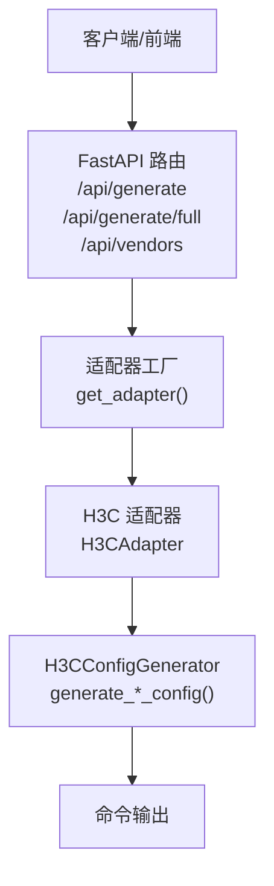
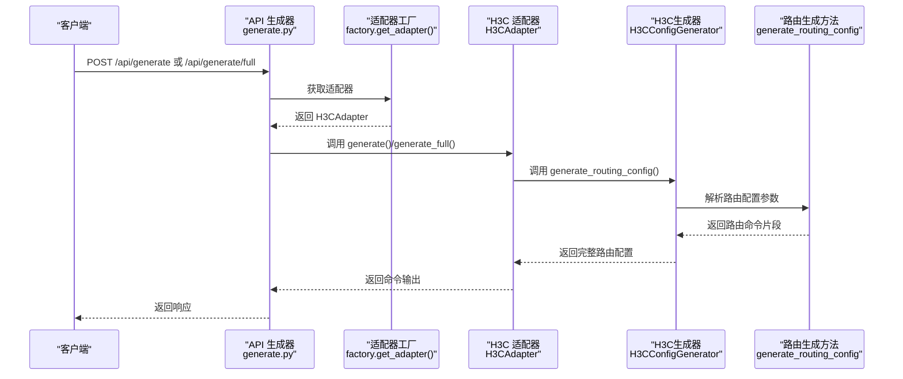
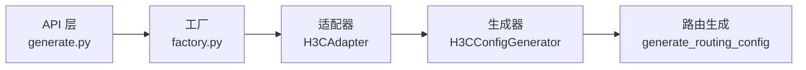

# 路由配置

<cite>
**本文引用的文件**   
- [h3c.py](file://api/app/data/manual/h3c.py)
- [h3c.py](file://api/app/engine/vendors/h3c.py)
- [h3c.py](file://api/app/engine/adapters/h3c.py)
- [generate.py](file://api/app/api/generate.py)
- [router.py](file://api/app/api/router.py)
- [main.py](file://api/app/main.py)
- [cases.py](file://api/app/data/cases.py)
- [sample-h3c-full.json](file://api/tests/sample-h3c-full.json)
- [sample-h3c-vlan.json](file://api/tests/sample-h3c-vlan.json)
</cite>

## 目录
1. [简介](#简介)
2. [项目结构](#项目结构)
3. [核心组件](#核心组件)
4. [架构总览](#架构总览)
5. [详细组件分析](#详细组件分析)
6. [依赖分析](#依赖分析)
7. [性能考虑](#性能考虑)
8. [故障排除指南](#故障排除指南)
9. [结论](#结论)
10. [附录](#附录)

## 简介
本文件面向“H3C路由配置生成器”的使用者与维护者，系统化阐述如何基于该代码库生成与管理H3C设备的路由相关配置，包括但不限于：
- 静态路由配置（含默认路由、优先级、黑洞路由）
- OSPF配置（进程、路由器ID、区域、网络宣告、认证、被动接口、DR优先级、接口开销）
- BGP配置（进程、Router-ID、邻居、更新源、网络宣告、下一跳本地、引入直连/静态）
- 实际配置示例与使用场景
- 路由协议选择建议、优先级配置、网络拓扑优化与故障排除

本说明既覆盖代码实现细节，也提供面向非技术读者的可操作指导。

## 项目结构
该路由配置生成器采用“适配器 + 生成器 + API”分层架构：
- 适配器层：负责厂商代码到具体生成器方法的映射
- 生成器层：按特性（如基础、VLAN、路由、安全、接口、服务）生成命令
- API层：提供REST接口，接收厂商与特性参数，返回命令片段或完整脚本
- 数据与样例：内置命令手册、最佳实践案例与测试样例

图表来源
- [main.py:1-29](file://api/app/main.py#L1-L29)
- [router.py:1-10](file://api/app/api/router.py#L1-L10)
- [generate.py:1-77](file://api/app/api/generate.py#L1-L77)
- [h3c.py:1-42](file://api/app/engine/adapters/h3c.py#L1-L42)
- [h3c.py:1-594](file://api/app/engine/vendors/h3c.py#L1-L594)

章节来源
- [main.py:1-29](file://api/app/main.py#L1-L29)
- [router.py:1-10](file://api/app/api/router.py#L1-L10)
- [generate.py:1-77](file://api/app/api/generate.py#L1-L77)
- [h3c.py:1-42](file://api/app/engine/adapters/h3c.py#L1-L42)
- [h3c.py:1-594](file://api/app/engine/vendors/h3c.py#L1-L594)

## 核心组件
- H3CConfigGenerator：统一的H3C配置生成器，提供各特性的静态生成方法，其中路由相关集中在 generate_routing_config
- H3CAdapter：将特性码映射到对应生成方法，支持 basic、vlan、routing、security、interface、service
- API层：提供 /api/generate 与 /api/generate/full 两个端点，以及 /api/vendors 列表厂商与特性
- 命令手册与样例：内置H3C命令手册与最佳实践案例，便于对照与复用

章节来源
- [h3c.py:229-319](file://api/app/engine/vendors/h3c.py#L229-L319)
- [h3c.py:14-42](file://api/app/engine/adapters/h3c.py#L14-L42)
- [generate.py:53-76](file://api/app/api/generate.py#L53-L76)
- [h3c.py:121-170](file://api/app/data/manual/h3c.py#L121-L170)

## 架构总览
路由配置生成的端到端流程如下：

图表来源
- [generate.py:53-76](file://api/app/api/generate.py#L53-L76)
- [h3c.py:32-42](file://api/app/engine/adapters/h3c.py#L32-L42)
- [h3c.py:229-319](file://api/app/engine/vendors/h3c.py#L229-L319)

## 详细组件分析

### 静态路由配置（ip route-static）
- 支持能力
  - 基本静态路由：目的网络、掩码、下一跳
  - 默认路由：0.0.0.0/0 指向网关
  - 优先级设置：通过 preference 参数控制
  - 黑洞路由：下一跳为 NULL0
  - 删除静态路由：undo 命令
  - 查看路由表与静态路由
- 关键实现
  - 生成逻辑位于 H3CConfigGenerator.generate_routing_config
  - 对 static 与 default 字段进行遍历与拼接
- 参数与命令格式
  - 基本：ip route-static <dest> <mask> <next-hop> preference <preference>
  - 默认：ip route-static 0.0.0.0 0.0.0.0 <gateway> preference <preference>
  - 黑洞：ip route-static <dest> <mask> NULL0
  - 删除：undo ip route-static <dest> <mask> <next-hop>
- 使用场景
  - 出口缺省路由下发
  - 区域间静态引流
  - 故障隔离与策略路由
- 示例参考
  - 测试样例中包含静态路由与默认路由字段
  - 命令手册中提供示例与查看命令

章节来源
- [h3c.py:249-268](file://api/app/engine/vendors/h3c.py#L249-L268)
- [h3c.py:122-132](file://api/app/data/manual/h3c.py#L122-L132)
- [sample-h3c-full.json:18-23](file://api/tests/sample-h3c-full.json#L18-L23)

### OSPF配置（ospf）
- 支持能力
  - 启动进程并设置路由器ID
  - 进入区域配置，宣告网络
  - 区域类型：NSSA、Stub（可选 no-summary）
  - 设置OSPF路由优先级
  - 被动接口（禁止发送OSPF报文）
  - 区域认证与接口认证
  - DR优先级与接口开销
  - 查看邻居、路由、接口与重置进程
- 关键实现
  - 生成逻辑位于 H3CConfigGenerator.generate_routing_config
  - 读取 ospf.process_id、router_id、area_id、networks 等字段
- 参数与命令格式
  - 启动与ID：ospf <process-id> router-id <router-id>
  - 区域：area <area-id>
  - 宣告：network <address> <wildcard>
  - 区域类型：nssa/no-summary 或 stub/no-summary
  - 优先级：preference <preference>
  - 被动接口：silent-interface <interface>
  - 认证：area <area-id> authentication-mode <simple|md5> <password>
  - 接口认证：interface <if> ospf authentication-mode <md5|simple> <password>
  - DR优先级：interface <if> ospf dr-priority <priority>
  - 接口开销：interface <if> ospf cost <cost>
- 使用场景
  - 内部网关协议，支持大规模分层网络
  - 区域划分与路由聚合
  - 多区域NSSA引入外部路由
- 示例参考
  - 命令手册提供区域、认证、优先级、接口参数等示例
  - 测试样例中包含静态路由与默认路由字段（可与OSPF配合）

章节来源
- [h3c.py:269-287](file://api/app/engine/vendors/h3c.py#L269-L287)
- [h3c.py:133-148](file://api/app/data/manual/h3c.py#L133-L148)
- [sample-h3c-full.json:18-23](file://api/tests/sample-h3c-full.json#L18-L23)

### BGP配置（bgp）
- 支持能力
  - 启动进程并设置Router-ID
  - 配置EBGP/IBGP邻居（含同AS）
  - 指定更新源接口（connect-interface）
  - 宣告网络（network mask）
  - 向IBGP发布时下一跳本地（next-hop-local）
  - 引入直连/静态路由
  - 查看邻居与BGP路由表
- 关键实现
  - 生成逻辑位于 H3CConfigGenerator.generate_routing_config
  - 读取 bgp.as_number、router_id、neighbors、networks 等字段
- 参数与命令格式
  - 启动与ID：bgp <as-number>；router-id <router-id>
  - 邻居：peer <ip> as-number <remote-as>
  - 更新源：peer <ip> connect-interface <interface>
  - 宣告：address-family ipv4；network <address> mask <mask>
  - 下一跳本地：peer <ip> next-hop-local
  - 引入：import-route direct；import-route static
- 使用场景
  - 跨自治域互联
  - 与上游/下游设备建立EBGP/IBGP会话
  - 控制路由发布范围与下一跳策略
- 示例参考
  - 命令手册提供BGP邻居、宣告、引入等示例
  - 测试样例中包含静态路由与默认路由字段（可与BGP配合）

章节来源
- [h3c.py:289-318](file://api/app/engine/vendors/h3c.py#L289-L318)
- [h3c.py:149-160](file://api/app/data/manual/h3c.py#L149-L160)

### RIP配置（rip）
- 支持能力
  - 启动RIP进程
  - 宣告直连网络
  - 设置RIP版本
  - 关闭自动汇总
  - 配置被动接口
  - 查看RIP路由与数据库
- 关键实现
  - 生成逻辑位于 H3CConfigGenerator.generate_routing_config
  - 读取 rip.version、networks、summary 等字段
- 参数与命令格式
  - 启动：rip <process-id>
  - 宣告：network <address>
  - 版本：version <1|2>
  - 关闭汇总：undo summary
  - 被动接口：silent-interface <interface>
- 使用场景
  - 小型网络或边缘设备
  - 与旧设备互通
- 示例参考
  - 命令手册提供RIP配置示例

章节来源
- [h3c.py:319-319](file://api/app/engine/vendors/h3c.py#L319-L319)
- [h3c.py:161-169](file://api/app/data/manual/h3c.py#L161-L169)

### 路由优先级与协议选择建议
- 优先级设置
  - 静态路由：通过 preference 指定，数值越小优先级越高
  - OSPF：可通过 preference 调整协议优先级
- 协议选择建议
  - 小型局域网：RIP（简单易用）
  - 中大型企业/数据中心：OSPF（收敛快、支持分层）
  - 跨域互联：BGP（灵活、可扩展）
- 最佳实践
  - 明确默认路由来源，避免黑洞
  - 合理划分OSPF区域，减少LSDB规模
  - 在BGP中结合next-hop-local与import-route策略

章节来源
- [h3c.py:125-127](file://api/app/data/manual/h3c.py#L125-L127)
- [h3c.py:138-138](file://api/app/data/manual/h3c.py#L138-L138)
- [cases.py:327-359](file://api/app/data/cases.py#L327-L359)

## 依赖分析
- 组件耦合
  - API层仅依赖适配器工厂与适配器协议，解耦具体厂商实现
  - 适配器将特性码映射到生成器静态方法，职责单一
  - 生成器内部按特性拆分，路由配置集中于 generate_routing_config
- 外部依赖
  - FastAPI 提供REST接口
  - 无第三方网络库依赖，纯字符串拼接生成命令

图表来源
- [generate.py:53-76](file://api/app/api/generate.py#L53-L76)
- [h3c.py:32-42](file://api/app/engine/adapters/h3c.py#L32-L42)
- [h3c.py:229-319](file://api/app/engine/vendors/h3c.py#L229-L319)

章节来源
- [generate.py:1-77](file://api/app/api/generate.py#L1-L77)
- [h3c.py:1-42](file://api/app/engine/adapters/h3c.py#L1-L42)
- [h3c.py:1-594](file://api/app/engine/vendors/h3c.py#L1-L594)

## 性能考虑
- 命令生成为纯内存操作，复杂度主要取决于配置项数量（线性）
- 大规模OSPF网络建议合理划分区域，减少LSA泛洪
- BGP网络中谨慎使用import-route，避免路由表膨胀
- 合理设置静态路由优先级，避免频繁切换

## 故障排除指南
- 常见问题与定位
  - 静态路由不生效：检查下一跳可达性与优先级
  - OSPF邻居不建立：核对区域ID、认证、被动接口设置
  - BGP会话失败：检查AS号、Router-ID唯一性、更新源接口
- 建议排查步骤
  - 使用查看命令核对路由表与协议状态
  - 逐步缩小配置范围，定位冲突项
  - 结合日志与SNMP进行辅助诊断

章节来源
- [h3c.py:129-131](file://api/app/data/manual/h3c.py#L129-L131)
- [h3c.py:144-147](file://api/app/data/manual/h3c.py#L144-L147)
- [h3c.py:158-159](file://api/app/data/manual/h3c.py#L158-L159)

## 结论
本路由配置生成器以清晰的分层架构与模块化设计，提供了H3C设备路由相关配置的自动化生成能力。通过统一的API与特性映射，用户可以便捷地生成静态路由、OSPF、BGP与RIP等配置，并结合命令手册与最佳实践案例完成生产环境部署。建议在实际网络中结合拓扑与需求选择合适协议，并通过优先级与策略优化网络稳定性与可维护性。

## 附录

### API定义与使用
- 获取厂商与特性列表
  - GET /api/vendors
- 生成单特性命令片段
  - POST /api/generate
  - 请求体字段：vendor、feature、params
- 生成完整配置脚本
  - POST /api/generate/full
  - 请求体字段：vendor、config

章节来源
- [generate.py:48-76](file://api/app/api/generate.py#L48-L76)

### 配置参数要点（路由）
- 静态路由
  - static：数组，每项含 destination、mask、next_hop、preference
  - default：对象，含 next_hop、preference
- OSPF
  - ospf：对象，含 process_id、router_id、area_id、networks（数组）
- BGP
  - bgp：对象，含 as_number、router_id、neighbors（数组）、networks（数组）
- RIP
  - rip：对象，含 version、networks、summary

章节来源
- [h3c.py:229-319](file://api/app/engine/vendors/h3c.py#L229-L319)
- [sample-h3c-full.json:18-23](file://api/tests/sample-h3c-full.json#L18-L23)

### 实际配置示例与场景
- 静态路由优先级设置
  - 通过 preference 控制静态路由优先级
- OSPF进程配置、路由器ID、区域与网络宣告
  - 在路由配置中分别设置进程、ID、区域与network
- BGP邻居与网络宣告
  - 配置peer与network，必要时设置connect-interface与next-hop-local
- 示例参考
  - 命令手册中的“静态路由”“OSPF配置”“BGP配置”“RIP配置”章节
  - 测试样例文件 sample-h3c-full.json 与 sample-h3c-vlan.json

章节来源
- [h3c.py:122-169](file://api/app/data/manual/h3c.py#L122-L169)
- [sample-h3c-full.json:1-26](file://api/tests/sample-h3c-full.json#L1-L26)
- [sample-h3c-vlan.json:1-19](file://api/tests/sample-h3c-vlan.json#L1-L19)