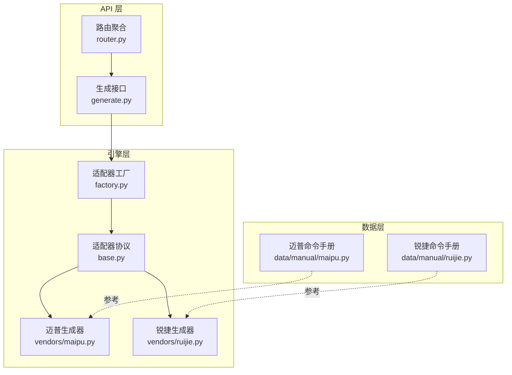
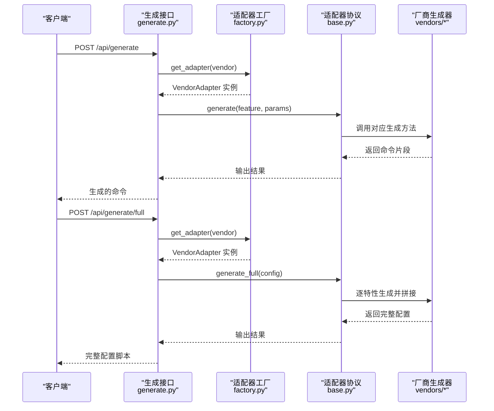
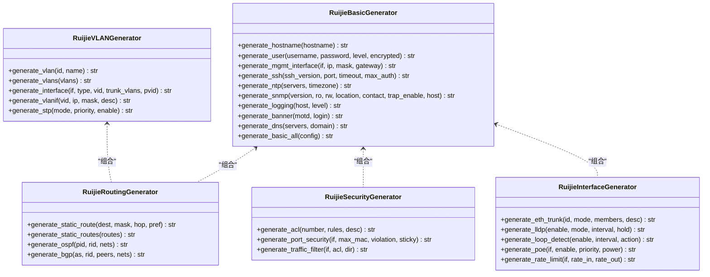
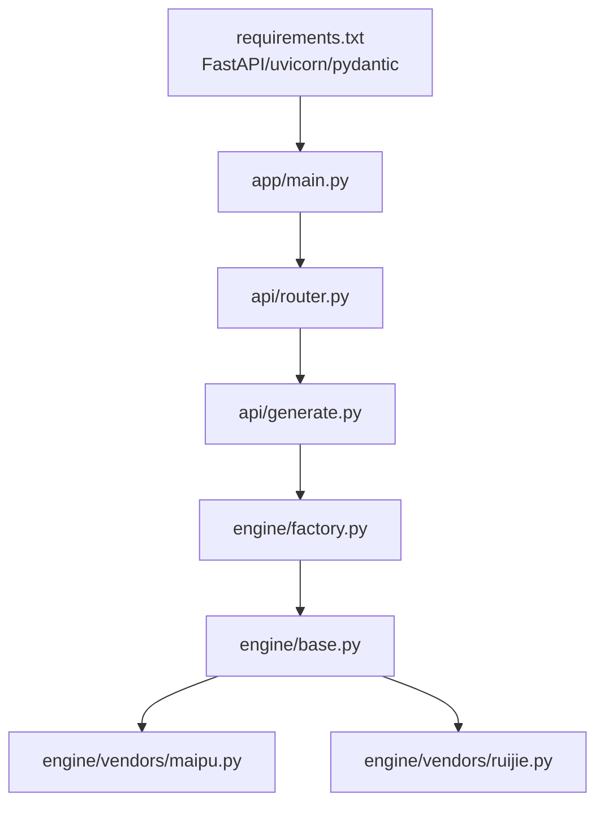

# 其他厂商配置生成器

<cite>
**本文档引用的文件**
- [maipu.py](file://api/app/data/manual/maipu.py)
- [ruijie.py](file://api/app/data/manual/ruijie.py)
- [maipu.py](file://api/app/engine/vendors/maipu.py)
- [ruijie.py](file://api/app/engine/vendors/ruijie.py)
- [base.py](file://api/app/engine/base.py)
- [factory.py](file://api/app/engine/factory.py)
- [generate.py](file://api/app/api/generate.py)
- [router.py](file://api/app/api/router.py)
- [validator.py](file://api/app/core/validator.py)
- [README.md](file://api/README.md)
- [requirements.txt](file://api/requirements.txt)
</cite>

## 目录
1. [简介](#简介)
2. [项目结构](#项目结构)
3. [核心组件](#核心组件)
4. [架构总览](#架构总览)
5. [详细组件分析](#详细组件分析)
6. [依赖分析](#依赖分析)
7. [性能考虑](#性能考虑)
8. [故障排除指南](#故障排除指南)
9. [结论](#结论)
10. [附录](#附录)

## 简介
本文件面向网络工程师，系统化介绍“其他厂商配置生成器”的功能与实现，重点覆盖迈普（Maipu）与锐捷（Ruijie）两大厂商的配置生成能力。内容包括：
- 工作原理与架构
- 支持的参数与生成命令格式
- 参数校验规则与错误处理
- 实际使用场景与最佳实践
- 优化建议与常见问题排查

## 项目结构
该模块位于后端 API 服务中，采用“适配器 + 生成器”的分层设计：
- 数据层：厂商命令手册与配置案例（manual 与 cases）
- 引擎层：各厂商的配置生成器（vendors），提供细粒度的命令生成方法
- 适配器层：统一 VendorAdapter 协议，屏蔽厂商差异
- API 层：FastAPI 提供对外接口，支持按特性或完整配置生成命令

**图表来源**
- [router.py:1-10](file://api/app/api/router.py#L1-L10)
- [generate.py:1-77](file://api/app/api/generate.py#L1-L77)
- [base.py:1-36](file://api/app/engine/base.py#L1-L36)
- [factory.py:1-39](file://api/app/engine/factory.py#L1-L39)
- [maipu.py:1-454](file://api/app/engine/vendors/maipu.py#L1-L454)
- [ruijie.py:1-452](file://api/app/engine/vendors/ruijie.py#L1-L452)
- [maipu.py:1-634](file://api/app/data/manual/maipu.py#L1-L634)
- [ruijie.py:1-800](file://api/app/data/manual/ruijie.py#L1-L800)

**章节来源**
- [README.md:1-47](file://api/README.md#L1-L47)
- [router.py:1-10](file://api/app/api/router.py#L1-L10)
- [generate.py:1-77](file://api/app/api/generate.py#L1-L77)
- [factory.py:1-39](file://api/app/engine/factory.py#L1-L39)

## 核心组件
- 适配器协议（VendorAdapter）：定义厂商代码、名称、支持特性集合以及 generate/generate_full 两个统一接口，确保不同厂商可被统一调用。
- 适配器工厂（get_adapter）：根据厂商代码返回对应适配器实例，当前已注册 H3C，其他厂商（含迈普、锐捷）尚未在此注册。
- 生成器（vendors）：为每个厂商提供基础、VLAN、路由、安全、接口等模块的命令生成方法，支持单特性生成与完整配置生成。

**章节来源**
- [base.py:11-36](file://api/app/engine/base.py#L11-L36)
- [factory.py:15-26](file://api/app/engine/factory.py#L15-L26)
- [maipu.py:8-454](file://api/app/engine/vendors/maipu.py#L8-L454)
- [ruijie.py:8-452](file://api/app/engine/vendors/ruijie.py#L8-L452)

## 架构总览
生成流程分为“单特性生成”和“完整配置生成”两种模式，均由 API 层发起，经适配器工厂获取适配器，再调用对应生成器完成命令拼接。

**图表来源**
- [generate.py:53-76](file://api/app/api/generate.py#L53-L76)
- [factory.py:20-26](file://api/app/engine/factory.py#L20-L26)
- [base.py:19-27](file://api/app/engine/base.py#L19-L27)
- [maipu.py:119-203](file://api/app/engine/vendors/maipu.py#L119-L203)
- [ruijie.py:119-202](file://api/app/engine/vendors/ruijie.py#L119-L202)

## 详细组件分析

### 迈普（Maipu）配置生成器
- 模块划分
  - 基础配置：主机名、用户、管理接口、SSH/Telnet/NTP/SNMP/日志/DNS/横幅等
  - VLAN：创建VLAN、接口VLAN模式（Access/Trunk/Hybrid）、VLAN接口（SVI）
  - 路由：静态路由、OSPF、BGP
  - 安全：ACL、端口安全、DHCP Snooping、ARP安全、IPSG
  - 接口：Eth-Trunk、LLDP、环路检测、PoE、速率限制
- 关键生成方法
  - 基础：generate_hostname、generate_user、generate_mgmt_interface、generate_ssh、generate_ntp、generate_snmp、generate_logging、generate_banner、generate_dns
  - VLAN：generate_vlan/generate_vlans、generate_interface、generate_vlanif、generate_stp
  - 路由：generate_static_route/generate_static_routes、generate_ospf、generate_bgp
  - 安全：generate_acl、generate_port_security、generate_traffic_filter
  - 接口：generate_eth_trunk、generate_lldp、generate_loop_detect、generate_poe、generate_rate_limit
- 完整配置入口：generate_basic_all，按配置字典顺序生成完整脚本

**图表来源**
- [maipu.py:8-454](file://api/app/engine/vendors/maipu.py#L8-L454)

**章节来源**
- [maipu.py:8-454](file://api/app/engine/vendors/maipu.py#L8-L454)
- [maipu.py:16-328](file://api/app/data/manual/maipu.py#L16-L328)

### 锐捷（Ruijie）配置生成器
- 模块划分
  - 基础配置：主机名、用户、管理接口、SSH/Telnet/NTP/SNMP/日志/DNS/横幅等
  - VLAN：创建VLAN、接口VLAN模式（Access/Trunk/Hybrid）、VLAN接口（SVI）、STP
  - 路由：静态路由、OSPF、BGP
  - 安全：ACL、端口安全、流量过滤
  - 接口：AggregatePort（链路聚合）、LLDP、环路检测、PoE、速率限制
- 关键生成方法
  - 基础：generate_hostname、generate_user、generate_mgmt_interface、generate_ssh、generate_ntp、generate_snmp、generate_logging、generate_banner、generate_dns
  - VLAN：generate_vlan/generate_vlans、generate_interface、generate_vlanif、generate_stp
  - 路由：generate_static_route/generate_static_routes、generate_ospf、generate_bgp
  - 安全：generate_acl、generate_port_security、generate_traffic_filter
  - 接口：generate_eth_trunk、generate_lldp、generate_loop_detect、generate_poe、generate_rate_limit
- 完整配置入口：generate_basic_all，按配置字典顺序生成完整脚本

**图表来源**
- [ruijie.py:8-452](file://api/app/engine/vendors/ruijie.py#L8-L452)

**章节来源**
- [ruijie.py:8-452](file://api/app/engine/vendors/ruijie.py#L8-L452)
- [ruijie.py:16-800](file://api/app/data/manual/ruijie.py#L16-L800)

### 命令手册与最佳实践
- 命令手册：提供各厂商命令参考、示例与分类，便于生成器映射与校验
- 最佳实践：涵盖安全基线、网络设计与运维管理建议，指导生成器参数选择与配置优化

**章节来源**
- [maipu.py:1-634](file://api/app/data/manual/maipu.py#L1-L634)
- [ruijie.py:1-800](file://api/app/data/manual/ruijie.py#L1-L800)
- [cases.py:327-377](file://api/app/data/cases.py#L327-L377)

## 依赖分析
- 外部依赖：FastAPI、Pydantic、uvicorn
- 内部依赖：API 路由 → 生成接口 → 适配器工厂 → 适配器协议 → 厂商生成器
- 当前注册厂商：H3C（已注册），其他厂商（含迈普、锐捷）尚未在此注册

**图表来源**
- [requirements.txt:1-5](file://api/requirements.txt#L1-L5)
- [main.py:1-29](file://api/app/main.py#L1-L29)
- [router.py:1-10](file://api/app/api/router.py#L1-L10)
- [generate.py:1-77](file://api/app/api/generate.py#L1-L77)
- [factory.py:1-39](file://api/app/engine/factory.py#L1-L39)
- [base.py:1-36](file://api/app/engine/base.py#L1-L36)
- [maipu.py:1-454](file://api/app/engine/vendors/maipu.py#L1-L454)
- [ruijie.py:1-452](file://api/app/engine/vendors/ruijie.py#L1-L452)

**章节来源**
- [requirements.txt:1-5](file://api/requirements.txt#L1-L5)
- [factory.py:15-17](file://api/app/engine/factory.py#L15-L17)

## 性能考虑
- 生成器均为无状态纯函数式方法，适合并发调用
- 完整配置生成采用字符串拼接，建议在大配置量场景下避免重复拼接，必要时可引入缓冲区或流式输出
- 参数校验在生成前进行，减少无效生成与设备端解析失败

[本节为通用建议，无需特定文件引用]

## 故障排除指南
- 厂商不支持
  - 现象：请求厂商未注册导致异常
  - 处理：确认厂商代码是否在工厂注册，或扩展工厂注册表
- 特性不支持
  - 现象：请求特性码不在适配器支持集合
  - 处理：检查特性码是否正确，或扩展适配器支持特性
- 参数校验失败
  - 建议：使用内置校验器（IP、掩码、VLAN、接口、MAC、主机名、密码、端口、AS号、通配掩码）逐项验证
- 生成异常
  - 建议：捕获异常并返回友好提示，定位到具体生成方法与参数

**章节来源**
- [generate.py:58-63](file://api/app/api/generate.py#L58-L63)
- [validator.py:14-208](file://api/app/core/validator.py#L14-L208)

## 结论
- 本项目提供了清晰的适配器与生成器分层架构，便于扩展新厂商
- 迈普与锐捷的生成器已具备完善的模块化能力，可覆盖基础、VLAN、路由、安全、接口等典型场景
- 建议尽快在工厂中注册迈普与锐捷适配器，并配套完善参数校验与错误处理，以提升工程可用性

[本节为总结性内容，无需特定文件引用]

## 附录

### 使用场景与参数要点
- 基础配置
  - 主机名、用户、管理接口、SSH/Telnet、NTP、SNMP、日志、DNS、横幅
  - 参数要点：主机名长度与字符约束、密码强度、接口名称格式、DNS服务器列表
- VLAN
  - VLAN 创建、接口模式（Access/Trunk/Hybrid）、VLANIF（SVI）、STP
  - 参数要点：VLAN ID 范围、接口名称合法性、Trunk允许VLAN列表
- 路由
  - 静态路由、OSPF、BGP
  - 参数要点：IP/掩码合法性、通配掩码格式、Router ID/AS号范围
- 安全
  - ACL、端口安全、流量过滤
  - 参数要点：ACL 规则语法、端口安全最大MAC数、违规动作
- 接口
  - Eth-Trunk/AggregatePort、LLDP、环回检测、PoE、速率限制
  - 参数要点：聚合模式、负载均衡、PoE优先级与功率、风暴控制阈值

**章节来源**
- [maipu.py:119-203](file://api/app/engine/vendors/maipu.py#L119-L203)
- [ruijie.py:119-202](file://api/app/engine/vendors/ruijie.py#L119-L202)
- [validator.py:14-208](file://api/app/core/validator.py#L14-L208)

### 参数校验规则（节选）
- IP 地址：非空、四段十进制、每段 0-255
- 子网掩码：合法连续掩码
- VLAN ID：1-4094
- 接口名称：符合厂商接口命名规范
- MAC 地址：支持多种格式
- 主机名：长度≤64、首字母、仅字母数字与连字符
- 密码：长度 8-128、至少3类字符
- 端口：1-65535
- AS 号：1-4294967295
- 通配掩码：IP 格式且为连续 0/1

**章节来源**
- [validator.py:14-208](file://api/app/core/validator.py#L14-L208)