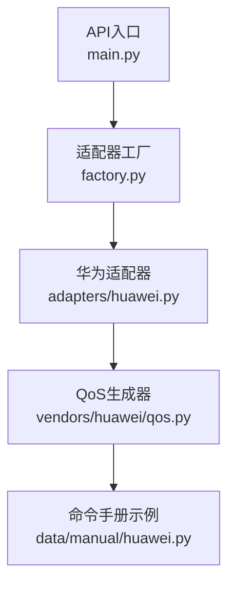
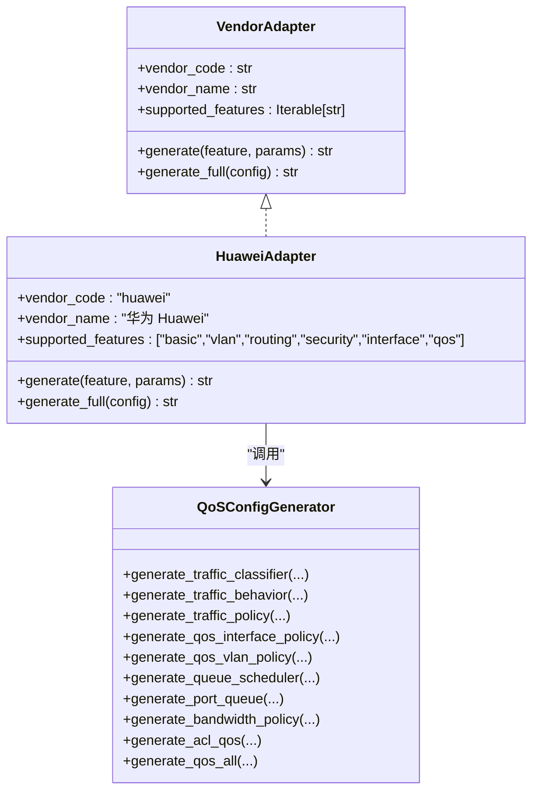
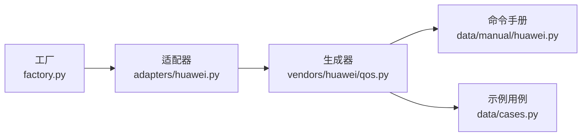

# QoS配置

<cite>
**本文引用的文件**
- [qos.py](file://api/app/engine/vendors/huawei/qos.py)
- [huawei.py](file://api/app/data/manual/huawei.py)
- [huawei.py](file://api/app/engine/adapters/huawei.py)
- [base.py](file://api/app/engine/base.py)
- [factory.py](file://api/app/engine/factory.py)
- [main.py](file://api/app/main.py)
- [cases.py](file://api/app/data/cases.py)
</cite>

## 目录
1. [简介](#简介)
2. [项目结构](#项目结构)
3. [核心组件](#核心组件)
4. [架构总览](#架构总览)
5. [详细组件分析](#详细组件分析)
6. [依赖分析](#依赖分析)
7. [性能考虑](#性能考虑)
8. [故障排查指南](#故障排查指南)
9. [结论](#结论)
10. [附录](#附录)

## 简介
本文件面向网络工程师，系统化说明华为设备QoS配置生成器的功能与实现，覆盖以下能力：
- 流量分类（ACL、协议、DSCP、VLAN、MAC/IP/端口/TCP标志等）
- 流量行为（放行/禁止、优先级重标记、CAR速率限制、重定向、镜像、统计）
- 流策略（分类器-行为绑定、共享模式）
- 接口/VLAN级QoS策略应用
- 队列调度（WFQ/WRR/PQ等）、队列权重、WRED
- 端口队列配置（调度器、权重、整形）
- 带宽策略（百分比/绝对值）
- ACL用于QoS（扩展ACL规则）
- 完整QoS配置一键生成

同时提供参数说明、典型场景与最佳实践，帮助快速落地语音/视频优先保障、带宽保证、流量统计等高级QoS功能。

## 项目结构
该QoS能力位于“华为适配器”下的独立生成器模块，配合通用适配器协议与工厂模式对外提供统一入口。

图表来源
- [main.py:1-29](file://api/app/main.py#L1-L29)
- [factory.py:1-45](file://api/app/engine/factory.py#L1-L45)
- [huawei.py:1-129](file://api/app/engine/adapters/huawei.py#L1-L129)
- [qos.py:1-290](file://api/app/engine/vendors/huawei/qos.py#L1-L290)
- [huawei.py:311-322](file://api/app/data/manual/huawei.py#L311-L322)

章节来源
- [main.py:1-29](file://api/app/main.py#L1-L29)
- [factory.py:1-45](file://api/app/engine/factory.py#L1-L45)
- [huawei.py:1-129](file://api/app/engine/adapters/huawei.py#L1-L129)
- [qos.py:1-290](file://api/app/engine/vendors/huawei/qos.py#L1-L290)
- [huawei.py:311-322](file://api/app/data/manual/huawei.py#L311-L322)

## 核心组件
- QoSConfigGenerator：提供完整的QoS配置生成能力，包括流分类、流行为、流策略、接口/VLAN应用、队列调度、端口队列、带宽策略、ACL用于QoS以及全量配置生成。
- 华为适配器：将API侧的“特性+参数”映射到具体生成器方法，组装多段输出。
- 适配器协议与工厂：统一厂商适配器接口，按厂商代码获取适配器实例。

章节来源
- [qos.py:8-290](file://api/app/engine/vendors/huawei/qos.py#L8-L290)
- [huawei.py:20-129](file://api/app/engine/adapters/huawei.py#L20-L129)
- [base.py:11-36](file://api/app/engine/base.py#L11-L36)
- [factory.py:17-32](file://api/app/engine/factory.py#L17-L32)

## 架构总览
QoS配置生成采用“适配器+生成器”的分层设计：
- 适配器负责特性到方法的映射与组装；
- 生成器聚焦于具体命令序列的构建；
- 工厂与协议保证可扩展性与统一调用。

图表来源
- [base.py:11-36](file://api/app/engine/base.py#L11-L36)
- [huawei.py:20-129](file://api/app/engine/adapters/huawei.py#L20-L129)
- [qos.py:8-290](file://api/app/engine/vendors/huawei/qos.py#L8-L290)

## 详细组件分析

### 流量分类（Traffic Classifier）
- 支持规则类型：ACL编号、协议、DSCP、VLAN ID、源/目的MAC、源/目的IP、TCP标志、目的端口等。
- 支持逻辑运算符：OR（默认）/ AND（通过参数传入）。
- 输出格式：以“traffic classifier 名称”开头，逐条追加“if-match”规则，最后以注释分隔符结束。

章节来源
- [qos.py:12-48](file://api/app/engine/vendors/huawei/qos.py#L12-L48)

### 流量行为（Traffic Behavior）
- 动作类型：
  - 放行/禁止
  - 优先级重标记：DSCP、802.1p、VLAN ID、本地优先级、IP优先级
  - CAR速率限制：CIR/PIR/CBS/PBS，以及绿/黄/红动作
  - 重定向：重定向到接口或下一跳
  - 流镜像：镜像到观察端口
  - 统计：启用统计
- 输出格式：以“traffic behavior 名称”开头，逐条追加动作，最后以注释分隔符结束。

章节来源
- [qos.py:51-98](file://api/app/engine/vendors/huawei/qos.py#L51-L98)

### 流策略（Traffic Policy）
- 将若干“分类器-行为”对绑定到策略中，支持共享模式（share-mode）。
- 输出格式：以“traffic policy 名称”开头，逐条追加“classifier ... behavior ...”，最后以注释分隔符结束。

章节来源
- [qos.py:101-117](file://api/app/engine/vendors/huawei/qos.py#L101-L117)

### 接口与VLAN级QoS策略应用
- 接口应用：在指定接口的入/出方向应用策略。
- VLAN应用：在指定VLAN的入/出方向应用策略。

章节来源
- [qos.py:120-139](file://api/app/engine/vendors/huawei/qos.py#L120-L139)

### 队列调度与端口队列
- 队列调度：支持模式选择（如WFQ），可配置各队列权重；可启用WRED。
- 端口队列：为指定接口的队列配置调度器、权重、整形速率等。

章节来源
- [qos.py:142-174](file://api/app/engine/vendors/huawei/qos.py#L142-L174)

### 带宽策略
- 支持两种形式：百分比带宽或绝对Kbps带宽。
- 输出格式：以“qos bandwidth 策略名”开头，随后根据参数追加百分比或Kbps配置，最后以注释分隔符结束。

章节来源
- [qos.py:177-190](file://api/app/engine/vendors/huawei/qos.py#L177-L190)

### ACL用于QoS
- 生成扩展ACL，支持协议、源/目的地址、目的端口、DSCP等字段。
- 用于在流分类中通过“if-match acl 编号”进行匹配。

章节来源
- [qos.py:193-223](file://api/app/engine/vendors/huawei/qos.py#L193-L223)

### 完整QoS配置生成
- 自动识别并生成以下部分（按需）：流分类、流行为、流策略、接口策略应用、队列调度、端口队列。
- 生成顺序遵循“先分类/行为/策略，再应用，最后队列配置”的工程化顺序。

章节来源
- [qos.py:226-290](file://api/app/engine/vendors/huawei/qos.py#L226-L290)

### 华为适配器与统一入口
- 华为适配器声明支持“qos”特性，并预留生成入口。
- 适配器协议定义统一接口，工厂按厂商代码返回对应适配器实例。

章节来源
- [huawei.py:20-129](file://api/app/engine/adapters/huawei.py#L20-L129)
- [base.py:11-36](file://api/app/engine/base.py#L11-L36)
- [factory.py:17-32](file://api/app/engine/factory.py#L17-L32)

## 依赖分析
- 适配器协议与工厂：保证不同厂商适配器的统一调用与扩展。
- 生成器内部无外部依赖，纯函数式拼接，便于单元测试与复用。
- 命令手册与示例：提供真实命令参考与最佳实践案例，便于对照与验证。

图表来源
- [factory.py:17-32](file://api/app/engine/factory.py#L17-L32)
- [huawei.py:20-129](file://api/app/engine/adapters/huawei.py#L20-L129)
- [qos.py:1-290](file://api/app/engine/vendors/huawei/qos.py#L1-L290)
- [huawei.py:311-322](file://api/app/data/manual/huawei.py#L311-L322)
- [cases.py:609-636](file://api/app/data/cases.py#L609-L636)

章节来源
- [factory.py:17-32](file://api/app/engine/factory.py#L17-L32)
- [huawei.py:20-129](file://api/app/engine/adapters/huawei.py#L20-L129)
- [qos.py:1-290](file://api/app/engine/vendors/huawei/qos.py#L1-L290)
- [huawei.py:311-322](file://api/app/data/manual/huawei.py#L311-L322)
- [cases.py:609-636](file://api/app/data/cases.py#L609-L636)

## 性能考虑
- 生成器为纯字符串拼接，时间复杂度与规则/动作数量线性相关，适合大规模批量生成。
- 队列权重与整形参数应结合端口速率与业务模型合理配置，避免过度整形导致排队延迟。
- CAR参数（CIR/PIR/CBS/PBS）建议按峰值带宽与突发特性设定，绿色/黄色/红色动作按SLA要求选择。
- WRED启用需谨慎，建议在具备明确拥塞阈值与颜色映射策略的场景使用。

## 故障排查指南
- 生成结果为空：确认传入参数是否包含有效配置段（如分类器/行为/策略等）。
- 规则不生效：检查流分类的“if-match”条件与ACL编号是否一致；确认流策略已正确应用到接口/VLAN。
- 队列调度异常：核对调度模式与队列权重配置；若启用WRED，确认颜色阈值与映射策略。
- CAR限速不生效：核对CIR/PIR/CBS/PBS单位与动作配置；检查入/出方向与接口方向一致性。
- 统计未更新：确认行为中启用了统计功能；检查接口统计是否启用。

章节来源
- [qos.py:12-48](file://api/app/engine/vendors/huawei/qos.py#L12-L48)
- [qos.py:51-98](file://api/app/engine/vendors/huawei/qos.py#L51-L98)
- [qos.py:142-174](file://api/app/engine/vendors/huawei/qos.py#L142-L174)
- [qos.py:177-190](file://api/app/engine/vendors/huawei/qos.py#L177-L190)

## 结论
该QoS配置生成器以模块化设计实现了华为设备的关键QoS能力，覆盖从流量分类、行为、策略到队列调度与带宽策略的完整闭环。通过统一适配器协议与工厂模式，具备良好的扩展性与可维护性。结合命令手册与示例用例，网络工程师可快速生成并验证符合生产环境需求的QoS配置。

## 附录

### 参数与配置要点速查
- 流量分类
  - 规则类型：acl、protocol、dscp、vlan-id、source-mac、destination-mac、source-ip、destination-ip、tcp-flag、destination-port
  - 运算符：or（默认）、and
- 流量行为
  - 动作：permit/deny、remark（dscp/8021p/vlan-id/local-precedence/ip-precedence）、car（CIR/PIR/CBS/PBS及绿/黄/红动作）、redirect（interface/ip-nexthop）、mirroring（observe-port）、statistic enable
- 流策略
  - 分类器-行为对、share-mode
- 应用范围
  - 接口：traffic-policy 名称 direction
  - VLAN：traffic-policy 名称 direction
- 队列调度
  - 模式：wfq/wrr/pq等；可配置权重；可启用wred
- 端口队列
  - 调度器、权重、整形速率
- 带宽策略
  - bandwidth percent 百分比 或 bandwidth kbps 绝对值
- ACL用于QoS
  - 扩展ACL规则：协议、源/目的、目的端口、DSCP

章节来源
- [qos.py:12-48](file://api/app/engine/vendors/huawei/qos.py#L12-L48)
- [qos.py:51-98](file://api/app/engine/vendors/huawei/qos.py#L51-L98)
- [qos.py:101-117](file://api/app/engine/vendors/huawei/qos.py#L101-L117)
- [qos.py:120-139](file://api/app/engine/vendors/huawei/qos.py#L120-L139)
- [qos.py:142-174](file://api/app/engine/vendors/huawei/qos.py#L142-L174)
- [qos.py:177-190](file://api/app/engine/vendors/huawei/qos.py#L177-L190)
- [qos.py:193-223](file://api/app/engine/vendors/huawei/qos.py#L193-L223)

### 实际场景与示例路径
- 基于ACL的流量限速（QoS限速示例）
  - 示例步骤路径：[cases.py:609-636](file://api/app/data/cases.py#L609-L636)
  - 对应命令参考：[huawei.py:215-222](file://api/app/data/manual/huawei.py#L215-L222)
- 优先级映射与队列调度
  - 命令参考：[huawei.py:311-322](file://api/app/data/manual/huawei.py#L311-L322)
- 端口镜像（用于流量监控）
  - 示例步骤路径：[cases.py:637-672](file://api/app/data/cases.py#L637-L672)

章节来源
- [cases.py:609-636](file://api/app/data/cases.py#L609-L636)
- [huawei.py:215-222](file://api/app/data/manual/huawei.py#L215-L222)
- [huawei.py:311-322](file://api/app/data/manual/huawei.py#L311-L322)
- [cases.py:637-672](file://api/app/data/cases.py#L637-L672)