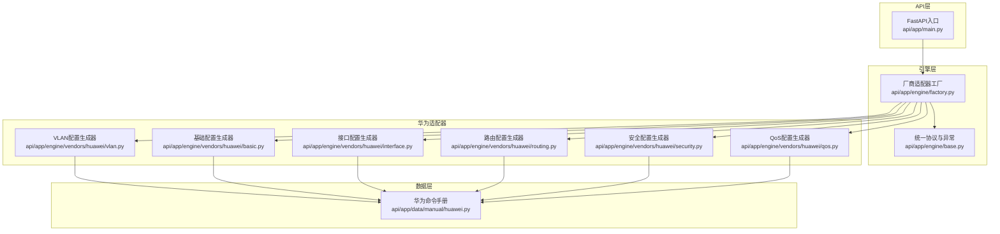
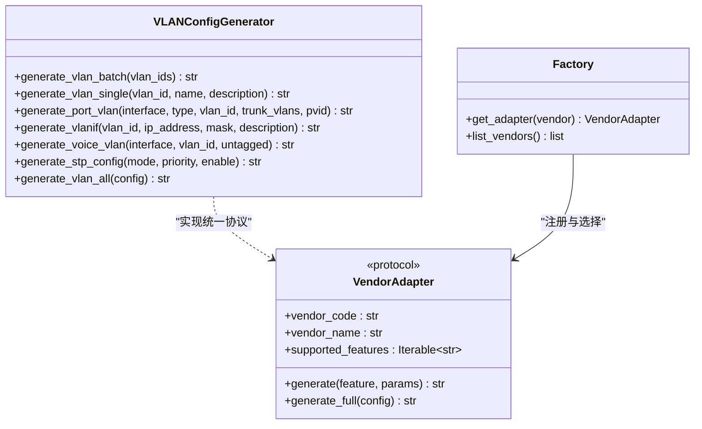
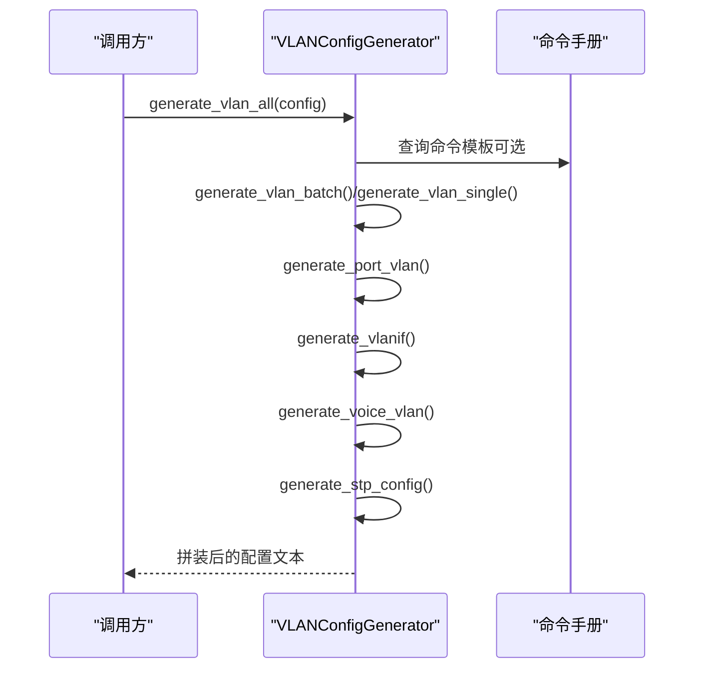
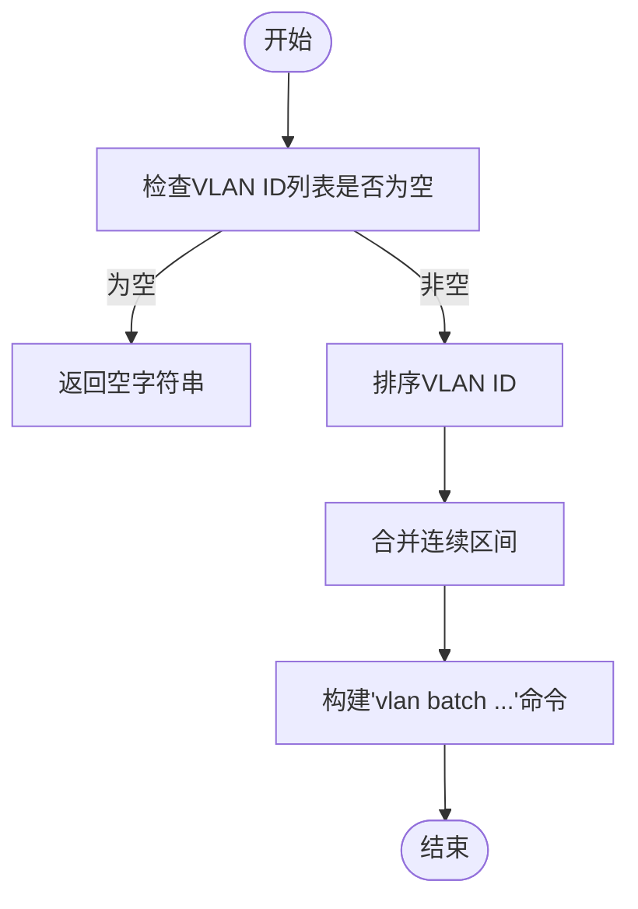
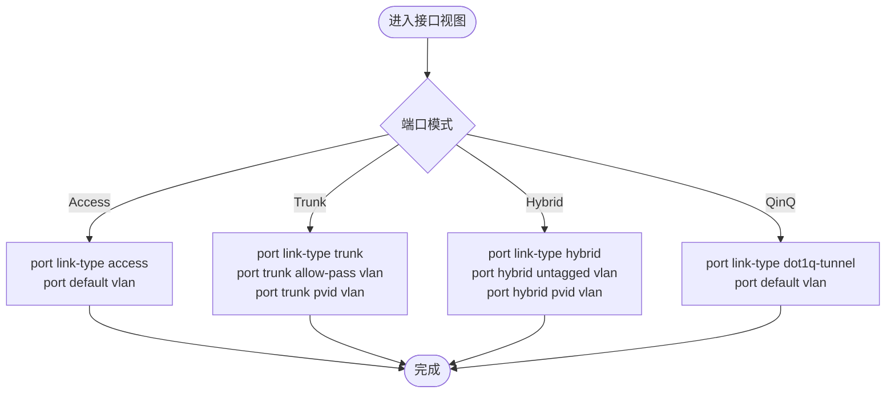
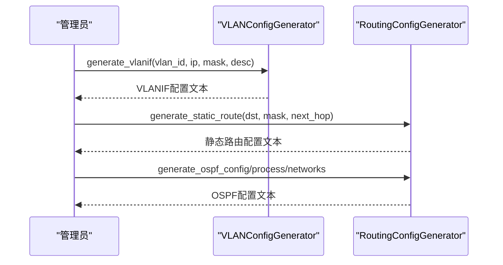
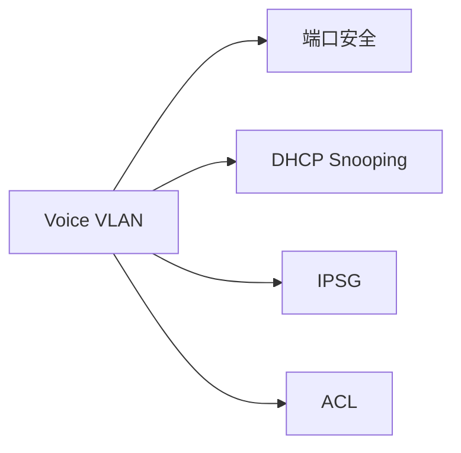
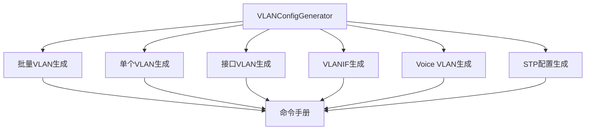

# VLAN配置

<cite>
**本文引用的文件**
- [api/app/engine/vendors/huawei/vlan.py](file://api/app/engine/vendors/huawei/vlan.py)
- [api/app/data/manual/huawei.py](file://api/app/data/manual/huawei.py)
- [api/app/engine/base.py](file://api/app/engine/base.py)
- [api/app/engine/factory.py](file://api/app/engine/factory.py)
- [api/app/engine/vendors/huawei/basic.py](file://api/app/engine/vendors/huawei/basic.py)
- [api/app/engine/vendors/huawei/interface.py](file://api/app/engine/vendors/huawei/interface.py)
- [api/app/engine/vendors/huawei/routing.py](file://api/app/engine/vendors/huawei/routing.py)
- [api/app/engine/vendors/huawei/security.py](file://api/app/engine/vendors/huawei/security.py)
- [api/app/engine/vendors/huawei/qos.py](file://api/app/engine/vendors/huawei/qos.py)
- [api/app/main.py](file://api/app/main.py)
- [api/tests/sample-h3c-vlan.json](file://api/tests/sample-h3c-vlan.json)
- [api/tests/sample-h3c-full.json](file://api/tests/sample-h3c-full.json)
</cite>

## 目录
1. [简介](#简介)
2. [项目结构](#项目结构)
3. [核心组件](#核心组件)
4. [架构总览](#架构总览)
5. [详细组件分析](#详细组件分析)
6. [依赖分析](#依赖分析)
7. [性能考虑](#性能考虑)
8. [故障排查指南](#故障排查指南)
9. [结论](#结论)
10. [附录](#附录)

## 简介
本文件面向网络工程师，系统化说明华为设备VLAN配置生成功能的设计与实现，覆盖VLAN创建、删除、修改、VLAN间路由、VLAN接口（SVI）、VLAN Trunk配置、Voice VLAN、STP等能力。文档同时给出参数约束、典型使用场景与最佳实践，帮助快速落地生产环境。

## 项目结构
该工程采用“多厂商适配器 + 统一抽象 + 工厂注册”的分层架构：
- 引擎层提供统一协议与工厂，负责根据厂商代码选择对应适配器
- 适配器层按厂商拆分，每个厂商一个目录，包含基础、接口、路由、安全、QoS、VLAN等子模块
- 数据层提供厂商命令手册与示例配置
- API层提供HTTP接口，便于前端或外部系统集成

**图表来源**
- [api/app/main.py:1-29](file://api/app/main.py#L1-L29)
- [api/app/engine/factory.py:1-39](file://api/app/engine/factory.py#L1-L39)
- [api/app/engine/base.py:1-36](file://api/app/engine/base.py#L1-L36)
- [api/app/engine/vendors/huawei/vlan.py:1-175](file://api/app/engine/vendors/huawei/vlan.py#L1-L175)
- [api/app/data/manual/huawei.py:1-703](file://api/app/data/manual/huawei.py#L1-L703)

**章节来源**
- [api/app/main.py:1-29](file://api/app/main.py#L1-L29)
- [api/app/engine/factory.py:1-39](file://api/app/engine/factory.py#L1-L39)
- [api/app/engine/base.py:1-36](file://api/app/engine/base.py#L1-L36)

## 核心组件
- VLAN配置生成器：提供批量VLAN、单个VLAN、接口VLAN（Access/Trunk/Hybrid/QinQ）、VLANIF、Voice VLAN、STP等生成方法
- 命令手册：提供华为设备VLAN相关命令、示例与最佳实践
- 统一协议与工厂：定义VendorAdapter协议，集中注册厂商适配器，屏蔽厂商差异

关键能力概览
- VLAN创建与命名：支持批量创建与单个创建，支持name与description
- 接口VLAN模式：Access/Trunk/Hybrid/QinQ，支持PVID与允许VLAN列表
- VLANIF（SVI）：为VLAN配置三层IP，支持掩码与描述
- Voice VLAN：为语音设备配置独立VLAN
- STP：支持模式、优先级、启停控制
- 完整配置拼装：按模块组织生成结果，便于直接下发

**章节来源**
- [api/app/engine/vendors/huawei/vlan.py:8-175](file://api/app/engine/vendors/huawei/vlan.py#L8-L175)
- [api/app/data/manual/huawei.py:82-115](file://api/app/data/manual/huawei.py#L82-L115)

## 架构总览
VLAN配置生成器位于“华为适配器”层，通过统一协议与工厂对外暴露。其内部方法分别对应不同配置维度，最终由generate_vlan_all统一拼装。

**图表来源**
- [api/app/engine/vendors/huawei/vlan.py:8-175](file://api/app/engine/vendors/huawei/vlan.py#L8-L175)
- [api/app/engine/base.py:11-27](file://api/app/engine/base.py#L11-L27)
- [api/app/engine/factory.py:20-39](file://api/app/engine/factory.py#L20-L39)

## 详细组件分析

### VLAN配置生成器（VLANConfigGenerator）
- 批量VLAN生成：将连续VLAN区间压缩为“to”表达式，减少命令长度
- 单个VLAN生成：支持name与description
- 接口VLAN：支持Access/Trunk/Hybrid/QinQ，Trunk支持allow-pass与PVID，Hybrid支持untagged
- VLANIF：为VLAN创建三层接口并配置IP与掩码
- Voice VLAN：为语音端口配置独立VLAN
- STP：支持模式、优先级、启停
- 完整VLAN配置：按顺序拼装VLAN、接口VLAN、VLANIF、Voice VLAN、STP

**图表来源**
- [api/app/engine/vendors/huawei/vlan.py:117-175](file://api/app/engine/vendors/huawei/vlan.py#L117-L175)
- [api/app/data/manual/huawei.py:82-115](file://api/app/data/manual/huawei.py#L82-L115)

**章节来源**
- [api/app/engine/vendors/huawei/vlan.py:8-175](file://api/app/engine/vendors/huawei/vlan.py#L8-L175)

### VLAN创建与命名（批量/单个）
- 批量创建：输入VLAN ID列表，自动归并连续区间
- 单个创建：支持name与description字段
- 删除/修改：命令手册提供“undo vlan”“name”等命令，生成器可按需扩展

**图表来源**
- [api/app/engine/vendors/huawei/vlan.py:12-38](file://api/app/engine/vendors/huawei/vlan.py#L12-L38)

**章节来源**
- [api/app/engine/vendors/huawei/vlan.py:12-50](file://api/app/engine/vendors/huawei/vlan.py#L12-L50)
- [api/app/data/manual/huawei.py:83-88](file://api/app/data/manual/huawei.py#L83-L88)

### 接口VLAN配置（Access/Trunk/Hybrid/QinQ）
- Access：设置默认VLAN
- Trunk：设置允许通过的VLAN列表与Native VLAN（PVID）
- Hybrid：设置Untagged/Tagged VLAN与PVID
- QinQ：Dot1q-tunnel模式配合默认VLAN

**图表来源**
- [api/app/engine/vendors/huawei/vlan.py:53-77](file://api/app/engine/vendors/huawei/vlan.py#L53-L77)
- [api/app/data/manual/huawei.py:94-102](file://api/app/data/manual/huawei.py#L94-L102)

**章节来源**
- [api/app/engine/vendors/huawei/vlan.py:53-77](file://api/app/engine/vendors/huawei/vlan.py#L53-L77)
- [api/app/data/manual/huawei.py:94-102](file://api/app/data/manual/huawei.py#L94-L102)

### VLANIF（三层接口）与VLAN间路由
- VLANIF：为VLAN创建三层接口并配置IP与掩码
- VLAN间路由：通过静态路由或动态路由（OSPF/BGP/RIP）实现跨VLAN通信

**图表来源**
- [api/app/engine/vendors/huawei/vlan.py:80-91](file://api/app/engine/vendors/huawei/vlan.py#L80-L91)
- [api/app/engine/vendors/huawei/routing.py:12-68](file://api/app/engine/vendors/huawei/routing.py#L12-L68)

**章节来源**
- [api/app/engine/vendors/huawei/vlan.py:80-91](file://api/app/engine/vendors/huawei/vlan.py#L80-L91)
- [api/app/engine/vendors/huawei/routing.py:12-68](file://api/app/engine/vendors/huawei/routing.py#L12-L68)

### Voice VLAN与安全策略
- Voice VLAN：为语音端口配置独立VLAN，支持Tag/Untag
- 端口安全：限制MAC数量、违规动作、粘性学习
- DHCP Snooping、ARP防护、IPSG、ACL等安全能力可与VLAN协同

**图表来源**
- [api/app/engine/vendors/huawei/vlan.py:94-102](file://api/app/engine/vendors/huawei/vlan.py#L94-L102)
- [api/app/engine/vendors/huawei/security.py:81-98](file://api/app/engine/vendors/huawei/security.py#L81-L98)
- [api/app/data/manual/huawei.py:195-214](file://api/app/data/manual/huawei.py#L195-L214)

**章节来源**
- [api/app/engine/vendors/huawei/vlan.py:94-102](file://api/app/engine/vendors/huawei/vlan.py#L94-L102)
- [api/app/engine/vendors/huawei/security.py:81-98](file://api/app/engine/vendors/huawei/security.py#L81-L98)
- [api/app/data/manual/huawei.py:195-214](file://api/app/data/manual/huawei.py#L195-L214)

### 参数与约束说明
- VLAN ID范围：命令手册中“创建VLAN”“批量创建VLAN”等命令存在，具体取值范围以设备型号为准
- VLAN名称限制：命令手册提供“VLAN命名”，实际长度与字符集以设备支持为准
- 端口模式配置：Access/Trunk/Hybrid/QinQ模式与对应参数（如PVID、允许VLAN列表）
- VLAN优先级设置：可通过STP优先级实现跨设备的根桥选举与路径选择

**章节来源**
- [api/app/data/manual/huawei.py:83-91](file://api/app/data/manual/huawei.py#L83-L91)
- [api/app/data/manual/huawei.py:94-102](file://api/app/data/manual/huawei.py#L94-L102)
- [api/app/data/manual/huawei.py:225-239](file://api/app/data/manual/huawei.py#L225-L239)

### 实际配置示例与使用场景
- 接入交换机基础配置：包含VLAN批量创建、VLANIF网关、Access/Trunk端口、SSH、端口安全、STP边缘端口等
- 核心交换机配置：包含VLANIF网关、DHCP、静态路由、OSPF、ACL、VRRP、NTP、日志、SNMP等
- 链路聚合配置：Eth-Trunk LACP模式、成员接口、负载均衡、LACP优先级
- MSTP多生成树：MST域配置、实例映射、根桥设置、BPDU保护、边缘端口
- DHCP服务器配置：地址池、网关、DNS、排除地址、在VLANIF启用DHCP
- QoS流量限速：基于ACL的CAR限速、流分类/行为/策略、接口应用

以上示例可在命令手册与测试样例中找到对应步骤与命令。

**章节来源**
- [api/app/data/manual/huawei.py:344-501](file://api/app/data/manual/huawei.py#L344-L501)
- [api/tests/sample-h3c-vlan.json:1-19](file://api/tests/sample-h3c-vlan.json#L1-L19)
- [api/tests/sample-h3c-full.json:1-26](file://api/tests/sample-h3c-full.json#L1-L26)

## 依赖分析
- 组件耦合：VLANConfigGenerator内部方法低耦合，通过generate_vlan_all统一拼装，便于扩展新功能
- 外部依赖：命令手册提供命令模板与示例，作为生成器的参考依据
- 厂商适配：通过VendorAdapter协议与工厂注册，未来可扩展其他厂商

**图表来源**
- [api/app/engine/vendors/huawei/vlan.py:117-175](file://api/app/engine/vendors/huawei/vlan.py#L117-L175)
- [api/app/data/manual/huawei.py:82-115](file://api/app/data/manual/huawei.py#L82-L115)

**章节来源**
- [api/app/engine/vendors/huawei/vlan.py:117-175](file://api/app/engine/vendors/huawei/vlan.py#L117-L175)

## 性能考虑
- 批量VLAN生成：优先使用“vlan batch”并合并连续区间，减少命令长度与下发时间
- 接口配置：Trunk模式下尽量使用allow-pass列表与PVID，避免使用“all”
- VLANIF：三层接口仅在需要跨VLAN路由时启用，避免不必要的三层处理开销
- STP：合理设置优先级与根桥，减少拓扑震荡与收敛时间

## 故障排查指南
- VLAN无法互通：检查VLANIF是否存在、路由是否正确、Trunk允许列表是否包含目标VLAN
- 端口安全触发：检查MAC数量限制、违规动作（protect/ restrict/ shutdown），必要时启用粘性学习
- DHCP/DNS问题：确认DHCP全局开关、地址池配置、DNS服务器与域名解析
- 日志与审计：启用信息中心、设置日志级别与主机，便于定位问题

**章节来源**
- [api/app/engine/vendors/huawei/security.py:81-98](file://api/app/engine/vendors/huawei/security.py#L81-L98)
- [api/app/engine/vendors/huawei/basic.py:157-176](file://api/app/engine/vendors/huawei/basic.py#L157-L176)
- [api/app/data/manual/huawei.py:195-214](file://api/app/data/manual/huawei.py#L195-L214)

## 结论
本VLAN配置生成器以模块化设计实现华为设备的VLAN创建、接口VLAN、VLANIF、Voice VLAN与STP等核心能力，并通过统一协议与工厂机制为多厂商扩展预留空间。结合命令手册与示例配置，可高效生成生产可用的VLAN配置脚本，满足接入与核心场景需求。

## 附录
- 命令手册与示例：详见“华为命令手册”与“测试样例”
- API入口：FastAPI提供健康检查与路由挂载

**章节来源**
- [api/app/data/manual/huawei.py:1-703](file://api/app/data/manual/huawei.py#L1-L703)
- [api/tests/sample-h3c-vlan.json:1-19](file://api/tests/sample-h3c-vlan.json#L1-L19)
- [api/tests/sample-h3c-full.json:1-26](file://api/tests/sample-h3c-full.json#L1-L26)
- [api/app/main.py:25-28](file://api/app/main.py#L25-L28)