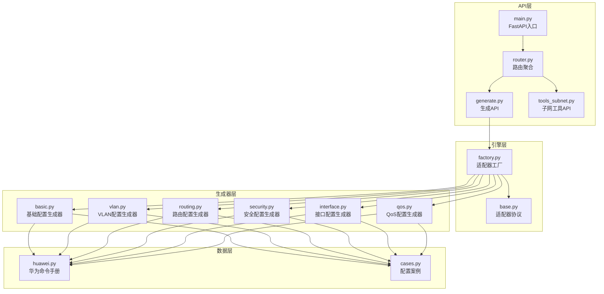
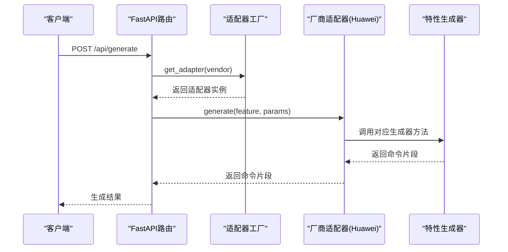
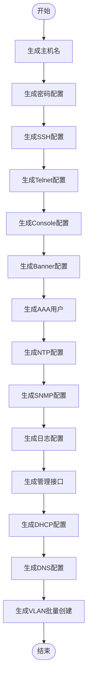
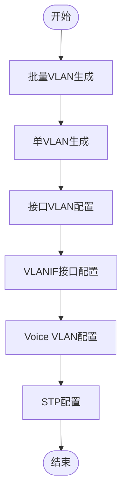
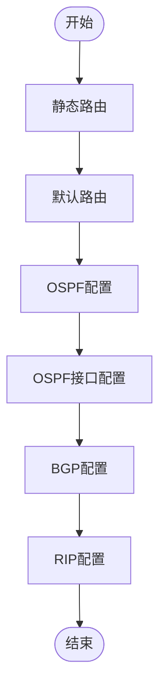
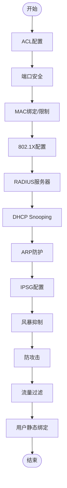
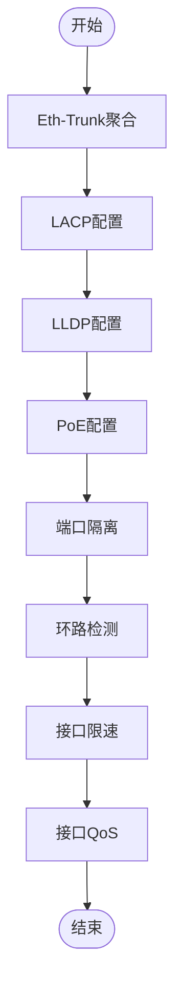
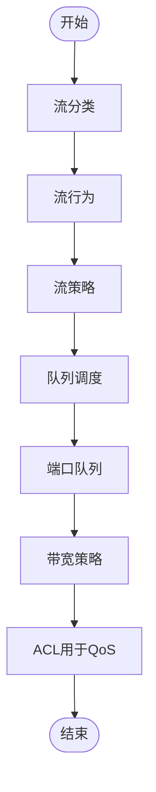
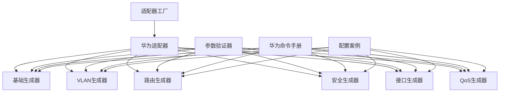

# 华为配置生成器

<cite>
**本文档引用的文件**
- [main.py](file://api/app/main.py)
- [router.py](file://api/app/api/router.py)
- [generate.py](file://api/app/api/generate.py)
- [tools_subnet.py](file://api/app/api/tools_subnet.py)
- [factory.py](file://api/app/engine/factory.py)
- [base.py](file://api/app/engine/base.py)
- [validator.py](file://api/app/core/validator.py)
- [huawei.py](file://api/app/data/manual/huawei.py)
- [basic.py](file://api/app/engine/vendors/huawei/basic.py)
- [vlan.py](file://api/app/engine/vendors/huawei/vlan.py)
- [routing.py](file://api/app/engine/vendors/huawei/routing.py)
- [security.py](file://api/app/engine/vendors/huawei/security.py)
- [interface.py](file://api/app/engine/vendors/huawei/interface.py)
- [qos.py](file://api/app/engine/vendors/huawei/qos.py)
- [cases.py](file://api/app/data/cases.py)
</cite>

## 目录
1. [简介](#简介)
2. [项目结构](#项目结构)
3. [核心组件](#核心组件)
4. [架构总览](#架构总览)
5. [详细组件分析](#详细组件分析)
6. [依赖关系分析](#依赖关系分析)
7. [性能考虑](#性能考虑)
8. [故障排除指南](#故障排除指南)
9. [结论](#结论)
10. [附录](#附录)

## 简介
本项目为华为网络设备配置生成器，提供基于API的命令生成能力，覆盖基础配置、VLAN配置、路由配置、安全配置、接口配置、QoS配置等特性。系统采用FastAPI提供REST接口，通过适配器工厂模式支持多厂商扩展，内置参数验证器保障输入合法性，并提供完整的配置示例与最佳实践。

## 项目结构
整体采用分层架构：
- API层：FastAPI路由与请求响应模型
- 引擎层：适配器工厂与厂商适配器协议
- 生成器层：各特性的配置生成器（基础/VLAN/路由/安全/接口/QoS）
- 数据层：厂商命令手册与配置案例
- 工具层：参数验证器与网络工具

**图表来源**
- [main.py:1-29](file://api/app/main.py#L1-L29)
- [router.py:1-10](file://api/app/api/router.py#L1-L10)
- [generate.py:1-77](file://api/app/api/generate.py#L1-L77)
- [tools_subnet.py:1-50](file://api/app/api/tools_subnet.py#L1-L50)
- [factory.py:1-39](file://api/app/engine/factory.py#L1-L39)
- [base.py:1-36](file://api/app/engine/base.py#L1-L36)
- [huawei.py:1-703](file://api/app/data/manual/huawei.py#L1-L703)
- [cases.py:1-377](file://api/app/data/cases.py#L1-L377)

**章节来源**
- [main.py:1-29](file://api/app/main.py#L1-L29)
- [router.py:1-10](file://api/app/api/router.py#L1-L10)

## 核心组件
- FastAPI应用与CORS中间件配置，提供健康检查端点
- 适配器工厂：集中管理厂商适配器，支持扩展新厂商
- 适配器协议：定义统一的generate与generate_full接口
- 参数验证器：提供IP、子网掩码、VLAN、接口、MAC、主机名、密码、端口、AS号、通配掩码等校验
- 华为命令手册：提供完整命令参考与示例
- 配置案例：涵盖接入/核心交换机、链路聚合、MSTP、DHCP、QoS、端口镜像、堆叠等场景

**章节来源**
- [base.py:1-36](file://api/app/engine/base.py#L1-L36)
- [factory.py:1-39](file://api/app/engine/factory.py#L1-L39)
- [validator.py:1-208](file://api/app/core/validator.py#L1-L208)
- [huawei.py:1-703](file://api/app/data/manual/huawei.py#L1-L703)
- [cases.py:1-377](file://api/app/data/cases.py#L1-L377)

## 架构总览
系统通过API接收请求，路由到生成器，生成器调用对应特性生成器，最终输出命令片段或完整配置脚本。参数验证贯穿请求处理流程，确保输入合法。

**图表来源**
- [generate.py:53-64](file://api/app/api/generate.py#L53-L64)
- [factory.py:20-26](file://api/app/engine/factory.py#L20-L26)
- [base.py:19-27](file://api/app/engine/base.py#L19-L27)

## 详细组件分析

### 基础配置生成器（BasicConfigGenerator）
- 功能：主机名、密码、SSH/Telnet、Console、Banner、AAA用户、NTP、SNMP、日志、管理接口、DHCP、DNS、VLAN批量创建
- 参数验证：主机名、密码强度、端口范围、AS号、通配掩码等
- 输出格式：标准命令序列，带注释分段
- 使用场景：设备初始化、远程管理、安全加固、网络管理

**图表来源**
- [basic.py:12-359](file://api/app/engine/vendors/huawei/basic.py#L12-L359)

**章节来源**
- [basic.py:1-359](file://api/app/engine/vendors/huawei/basic.py#L1-L359)
- [validator.py:125-161](file://api/app/core/validator.py#L125-L161)

### VLAN配置生成器（VLANConfigGenerator）
- 功能：批量VLAN、单VLAN、接口VLAN（Access/Trunk/Hybrid）、VLANIF、Voice VLAN、STP
- 批量VLAN算法：对VLAN ID排序并合并为连续范围
- 输出格式：标准命令序列，含接口视图切换与注释分隔

**图表来源**
- [vlan.py:12-175](file://api/app/engine/vendors/huawei/vlan.py#L12-L175)

**章节来源**
- [vlan.py:1-175](file://api/app/engine/vendors/huawei/vlan.py#L1-L175)

### 路由配置生成器（RoutingConfigGenerator）
- 功能：静态路由、默认路由、OSPF、OSPF接口、BGP、RIP
- 支持参数：进程号、Router-ID、区域、网络、接口、成本、优先级、Hello/Dead时间、邻居、导入路由等
- 输出格式：标准命令序列，含注释分隔

**图表来源**
- [routing.py:12-213](file://api/app/engine/vendors/huawei/routing.py#L12-L213)

**章节来源**
- [routing.py:1-213](file://api/app/engine/vendors/huawei/routing.py#L1-L213)

### 安全配置生成器（SecurityConfigGenerator）
- 功能：标准/扩展ACL、端口安全、MAC绑定/限制、802.1X、RADIUS、DHCP Snooping、ARP防护、IPSG、风暴抑制、防攻击、流量过滤、用户静态绑定
- 输出格式：标准命令序列，含注释分隔

**图表来源**
- [security.py:12-578](file://api/app/engine/vendors/huawei/security.py#L12-L578)

**章节来源**
- [security.py:1-578](file://api/app/engine/vendors/huawei/security.py#L1-L578)

### 接口配置生成器（InterfaceConfigGenerator）
- 功能：Eth-Trunk、LACP、LLDP、PoE、端口隔离、环路检测、接口限速、QoS
- 输出格式：标准命令序列，含注释分隔

**图表来源**
- [interface.py:12-308](file://api/app/engine/vendors/huawei/interface.py#L12-L308)

**章节来源**
- [interface.py:1-308](file://api/app/engine/vendors/huawei/interface.py#L1-L308)

### QoS配置生成器（QoSConfigGenerator）
- 功能：流分类、流行为、流策略、队列调度、端口队列、带宽策略、ACL用于QoS
- 输出格式：标准命令序列，含注释分隔

**图表来源**
- [qos.py:12-290](file://api/app/engine/vendors/huawei/qos.py#L12-L290)

**章节来源**
- [qos.py:1-290](file://api/app/engine/vendors/huawei/qos.py#L1-L290)

## 依赖关系分析
- 适配器工厂集中管理厂商适配器，避免重复实例化
- 生成器依赖厂商命令手册与配置案例，保证生成命令的准确性与可操作性
- 参数验证器独立于生成器，提供统一的输入校验

**图表来源**
- [factory.py:15-17](file://api/app/engine/factory.py#L15-L17)
- [validator.py:1-208](file://api/app/core/validator.py#L1-L208)
- [huawei.py:1-703](file://api/app/data/manual/huawei.py#L1-L703)
- [cases.py:1-377](file://api/app/data/cases.py#L1-L377)

**章节来源**
- [factory.py:1-39](file://api/app/engine/factory.py#L1-L39)
- [validator.py:1-208](file://api/app/core/validator.py#L1-L208)

## 性能考虑
- 生成器均为无状态纯函数式实现，适合并发调用
- 批量VLAN生成采用排序与区间合并，减少命令行长度
- 适配器工厂使用单例字典，避免重复创建适配器实例
- API层启用CORS，便于前后端联调与部署

## 故障排除指南
- 厂商不支持：检查vendor参数是否在支持列表中
- 特性不支持：检查feature参数是否在厂商支持特性集合中
- 参数错误：利用参数验证器提供的错误信息定位问题
- 生成失败：检查请求JSON结构与参数类型

常见错误与处理：
- 厂商参数错误：返回400，提示可选厂商列表
- 特性参数错误：返回400，提示特性不支持
- 服务器内部错误：返回500，提示生成失败

**章节来源**
- [generate.py:58-63](file://api/app/api/generate.py#L58-L63)
- [validator.py:1-208](file://api/app/core/validator.py#L1-L208)

## 结论
本项目提供了完整的华为设备配置生成能力，具备良好的扩展性与可维护性。通过统一的适配器协议与参数验证器，确保生成命令的准确性与安全性。建议在网络变更前进行充分测试与验证，遵循最佳实践，确保配置的稳定性与可恢复性。

## 附录

### API定义
- GET /api/health：健康检查
- GET /api/vendors：列出已支持厂商
- POST /api/generate：生成单个特性的命令片段
- POST /api/generate/full：生成完整配置脚本
- GET /api/tools/subnet：子网信息计算
- GET /api/tools/subnet/split：子网划分
- GET /api/tools/subnet/range-to-cidr：IP范围转CIDR

**章节来源**
- [main.py:25-29](file://api/app/main.py#L25-L29)
- [generate.py:48-77](file://api/app/api/generate.py#L48-L77)
- [tools_subnet.py:9-50](file://api/app/api/tools_subnet.py#L9-L50)

### 支持的厂商与特性
- 厂商：华为（huawei）
- 特性：basic、vlan、routing、security、interface、service

**章节来源**
- [factory.py:29-39](file://api/app/engine/factory.py#L29-L39)
- [generate.py:21-40](file://api/app/api/generate.py#L21-L40)

### 参数验证规则摘要
- IP地址：非空，四段0-255
- 子网掩码：有效连续掩码
- VLAN ID：1-4094
- 接口名称：符合华为接口命名规范
- MAC地址：支持多种格式
- 主机名：1-64字符，字母开头
- 密码：8-128字符，至少3种字符类型
- 端口号：1-65535
- AS号：1-4294967295
- 通配掩码：IP格式且为连续0/1

**章节来源**
- [validator.py:15-200](file://api/app/core/validator.py#L15-L200)