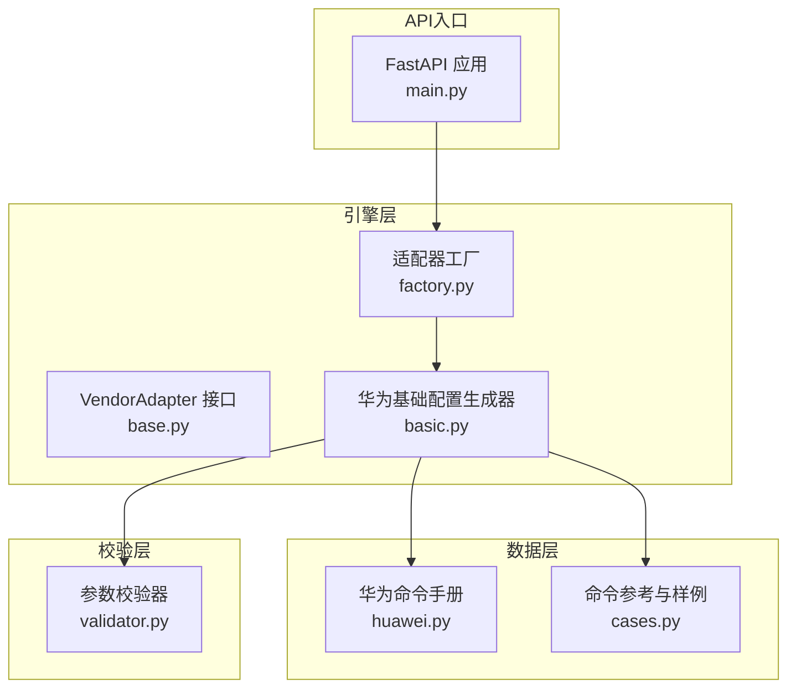
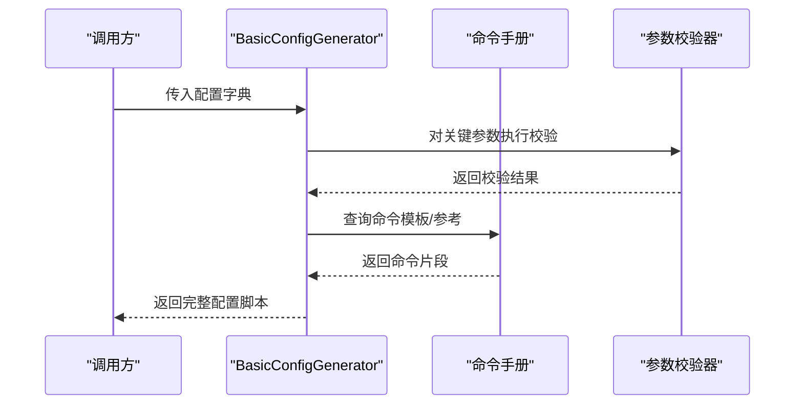
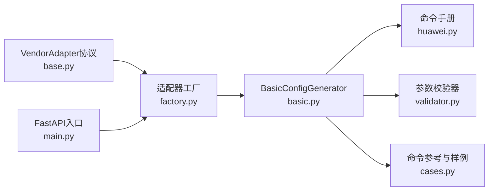

# 基础配置

<cite>
**本文引用的文件**
- [basic.py](file://api/app/engine/vendors/huawei/basic.py)
- [huawei.py](file://api/app/data/manual/huawei.py)
- [validator.py](file://api/app/core/validator.py)
- [base.py](file://api/app/engine/base.py)
- [factory.py](file://api/app/engine/factory.py)
- [cases.py](file://api/app/data/cases.py)
- [main.py](file://api/app/main.py)
- [sample-h3c-full.json](file://api/tests/sample-h3c-full.json)
- [sample-h3c-vlan.json](file://api/tests/sample-h3c-vlan.json)
</cite>

## 目录
1. [简介](#简介)
2. [项目结构](#项目结构)
3. [核心组件](#核心组件)
4. [架构总览](#架构总览)
5. [详细组件分析](#详细组件分析)
6. [依赖分析](#依赖分析)
7. [性能考虑](#性能考虑)
8. [故障排查指南](#故障排查指南)
9. [结论](#结论)
10. [附录](#附录)

## 简介
本文件面向网络工程师，系统化说明华为设备基础配置生成功能的实现与使用方法。内容覆盖主机名设置、密码配置、SSH/Telnet配置、Console口配置、Banner配置、AAA用户管理、NTP配置、SNMP配置、日志配置、管理接口配置、DHCP配置、DNS配置等基础能力。文档提供：
- 每项配置的作用与支持参数
- 生成的命令格式与典型场景
- 参数校验规则与错误处理机制
- 配置优化建议与最佳实践

## 项目结构
该模块位于“api/app/engine/vendors/huawei/basic.py”，采用“按功能分层”的组织方式：
- 引擎层：统一抽象与适配器工厂（base.py、factory.py）
- 数据层：厂商命令手册与配置样例（data/manual/huawei.py、data/cases.py）
- 校验层：参数合法性校验（core/validator.py）
- API入口：FastAPI服务入口（main.py）

图表来源
- [base.py:11-36](file://api/app/engine/base.py#L11-L36)
- [factory.py:15-39](file://api/app/engine/factory.py#L15-L39)
- [basic.py:8-359](file://api/app/engine/vendors/huawei/basic.py#L8-L359)
- [huawei.py:7-342](file://api/app/data/manual/huawei.py#L7-L342)
- [cases.py:7-324](file://api/app/data/cases.py#L7-L324)
- [validator.py:11-208](file://api/app/core/validator.py#L11-L208)
- [main.py:1-29](file://api/app/main.py#L1-L29)

章节来源
- [basic.py:8-359](file://api/app/engine/vendors/huawei/basic.py#L8-L359)
- [huawei.py:7-342](file://api/app/data/manual/huawei.py#L7-L342)
- [validator.py:11-208](file://api/app/core/validator.py#L11-L208)
- [base.py:11-36](file://api/app/engine/base.py#L11-L36)
- [factory.py:15-39](file://api/app/engine/factory.py#L15-L39)
- [cases.py:7-324](file://api/app/data/cases.py#L7-L324)
- [main.py:1-29](file://api/app/main.py#L1-L29)

## 核心组件
- 基础配置生成器（BasicConfigGenerator）
  - 提供主机名、密码、SSH/Telnet、Console、Banner、AAA用户、NTP、SNMP、日志、管理接口、DHCP、DNS等配置的命令生成方法
  - 支持“生成单项配置”和“生成完整基础配置”两种模式
- 参数校验器（ConfigValidator）
  - 提供IP地址、子网掩码、VLAN ID/名称、接口名称、MAC地址、主机名、密码、端口、AS号、通配掩码等校验
- 厂商适配器与工厂
  - 定义统一的VendorAdapter协议，工厂负责按厂商代码获取适配器实例
- 命令手册与样例
  - 华为命令手册与配置案例，用于对照生成命令与最佳实践

章节来源
- [basic.py:8-359](file://api/app/engine/vendors/huawei/basic.py#L8-L359)
- [validator.py:11-208](file://api/app/core/validator.py#L11-L208)
- [base.py:11-36](file://api/app/engine/base.py#L11-L36)
- [factory.py:15-39](file://api/app/engine/factory.py#L15-L39)
- [huawei.py:7-342](file://api/app/data/manual/huawei.py#L7-L342)
- [cases.py:7-324](file://api/app/data/cases.py#L7-L324)

## 架构总览
基础配置生成的整体流程如下：
- 调用方传入配置字典（包含各功能模块参数）
- 生成器根据配置项逐项生成命令片段
- 将各模块命令拼接为完整配置脚本
- 可选：结合校验器进行参数合法性检查

图表来源
- [basic.py:250-359](file://api/app/engine/vendors/huawei/basic.py#L250-L359)
- [validator.py:11-208](file://api/app/core/validator.py#L11-L208)
- [huawei.py:7-342](file://api/app/data/manual/huawei.py#L7-L342)

## 详细组件分析

### 主机名设置
- 功能说明
  - 设置设备主机名，便于识别与管理
- 支持参数
  - hostname: 字符串，设备名称
- 生成命令
  - sysname <hostname>
- 使用场景
  - 设备初始化、命名规范化
- 参数校验
  - 主机名长度不超过64字符，必须以字母开头，仅允许字母、数字、连字符
- 错误处理
  - 若为空或格式不合法，返回错误提示
- 优化建议
  - 统一命名规范（如前缀+编号），避免重复与歧义

章节来源
- [basic.py:12-14](file://api/app/engine/vendors/huawei/basic.py#L12-L14)
- [validator.py:125-136](file://api/app/core/validator.py#L125-L136)
- [huawei.py:10-11](file://api/app/data/manual/huawei.py#L10-L11)

### 密码配置
- 功能说明
  - 配置超级密码（用于提升权限级别的密码），支持明文或密文
- 支持参数
  - password: 字符串，密码值
  - encrypted: 布尔，是否密文
- 生成命令
  - 明文：super password simple <password>
  - 密文：super password cipher <password>
- 使用场景
  - 初始配置或密码变更
- 参数校验
  - 密码长度8-128字符，需包含大小写字母、数字、特殊字符至少3种
- 错误处理
  - 密码为空或强度不足时返回错误
- 优化建议
  - 默认使用密文；定期轮换；避免弱口令

章节来源
- [basic.py:17-21](file://api/app/engine/vendors/huawei/basic.py#L17-L21)
- [validator.py:139-160](file://api/app/core/validator.py#L139-L160)
- [huawei.py:27](file://api/app/data/manual/huawei.py#L27)

### SSH配置
- 功能说明
  - 启用SSH服务，生成RSA密钥对，配置SSH版本、端口、超时、认证重试、重协商间隔等
  - 配置SSH用户及服务类型，VTY接口启用SSH
- 支持参数
  - enable: 布尔，是否启用
  - version: 整数，SSH版本（1/2/all）
  - port: 整数，SSH端口
  - timeout: 整数，连接超时秒数
  - max_auth_tries: 整数，最大认证尝试次数
  - rekey_interval: 整数，重协商间隔分钟数
- 生成命令
  - 生成RSA密钥对
  - 启用SSH服务
  - 设置SSH端口、超时、最大认证次数、重协商间隔
  - 启用兼容华为版本
  - 设置SSH版本
  - 配置SSH用户admin及其认证方式与服务类型
  - VTY 0-4启用AAA认证并允许SSH
- 使用场景
  - 远程安全管理，替代Telnet
- 参数校验
  - 端口范围1-65535
- 错误处理
  - 端口非法时返回错误
- 优化建议
  - 仅启用SSHv2；设置合理超时与重试；定期更换密钥

章节来源
- [basic.py:24-46](file://api/app/engine/vendors/huawei/basic.py#L24-L46)
- [validator.py:163-171](file://api/app/core/validator.py#L163-L171)
- [huawei.py:35-44](file://api/app/data/manual/huawei.py#L35-L44)

### Telnet配置
- 功能说明
  - 启用Telnet服务，VTY接口允许Telnet
- 支持参数
  - enable: 布尔，是否启用
- 生成命令
  - 启用Telnet服务
  - VTY 0-4启用AAA认证并允许Telnet
- 使用场景
  - 临时调试或不支持SSH的环境
- 参数校验
  - 无
- 错误处理
  - 无
- 优化建议
  - 生产环境禁用Telnet，改用SSH

章节来源
- [basic.py:49-56](file://api/app/engine/vendors/huawei/basic.py#L49-L56)
- [huawei.py:47-50](file://api/app/data/manual/huawei.py#L47-L50)

### Console口配置
- 功能说明
  - 配置Console口登录认证（密码或AAA）、闲置超时
- 支持参数
  - password: 字符串，Console口密码（可选）
  - authentication: 字符串，认证模式（password/aaa）
  - idle_timeout: 整数，闲置超时分钟数
- 生成命令
  - 进入Console 0视图
  - 设置认证模式（password/aaa）
  - 设置Console口密码（当选择password且提供密码时）
  - 设置闲置超时
- 使用场景
  - 本地登录设备进行初始配置
- 参数校验
  - 无
- 错误处理
  - 无
- 优化建议
  - 建议使用AAA认证；设置合理闲置超时

章节来源
- [basic.py:59-71](file://api/app/engine/vendors/huawei/basic.py#L59-L71)
- [huawei.py:53-55](file://api/app/data/manual/huawei.py#L53-L55)

### Banner配置
- 功能说明
  - 配置登录横幅与Shell横幅
- 支持参数
  - motd: 字符串，登录横幅内容
  - login: 字符串，Shell横幅内容
- 生成命令
  - 登录横幅：header login information
  - Shell横幅：header shell information
- 使用场景
  - 法律声明、合规提醒
- 参数校验
  - 无
- 错误处理
  - 无
- 优化建议
  - 内容简洁明确，避免过长影响显示

章节来源
- [basic.py:74-82](file://api/app/engine/vendors/huawei/basic.py#L74-L82)
- [huawei.py:7-21](file://api/app/data/manual/huawei.py#L7-L21)

### AAA用户管理
- 功能说明
  - 创建本地用户，设置密码、权限级别、服务类型
- 支持参数
  - username: 字符串，默认admin
  - password: 字符串，默认admin@123
  - level: 整数，默认15（管理员）
  - encrypted: 布尔，密码是否密文
  - service_types: 列表，默认["terminal","ssh","telnet"]
- 生成命令
  - 进入AAA视图
  - 创建本地用户并设置密码（明文/密文）
  - 设置用户权限级别
  - 设置用户服务类型
  - 结束AAA配置
- 使用场景
  - 多用户管理与权限控制
- 参数校验
  - 密码强度校验
- 错误处理
  - 密码强度不足时返回错误
- 优化建议
  - 不同用户分配不同权限级别；定期轮换密码

章节来源
- [basic.py:85-99](file://api/app/engine/vendors/huawei/basic.py#L85-L99)
- [validator.py:139-160](file://api/app/core/validator.py#L139-L160)
- [huawei.py:23-32](file://api/app/data/manual/huawei.py#L23-L32)

### NTP配置
- 功能说明
  - 配置系统时区与NTP服务器，支持广播模式
- 支持参数
  - servers: 列表，元素为字典（ip、prefer）
  - timezone: 字符串，默认UTC+8
  - broadcast_enable: 布尔，是否启用广播
- 生成命令
  - 设置时区
  - 配置单播NTP服务器（可带prefer）
  - 可选：启用NTP广播
- 使用场景
  - 时间同步、日志时间戳准确性
- 参数校验
  - IP地址格式校验
- 错误处理
  - IP格式不合法时返回错误
- 优化建议
  - 至少配置两台可靠NTP服务器；启用prefer；定期检查同步状态

章节来源
- [basic.py:102-121](file://api/app/engine/vendors/huawei/basic.py#L102-L121)
- [validator.py:15-31](file://api/app/core/validator.py#L15-L31)
- [huawei.py:299-302](file://api/app/data/manual/huawei.py#L299-L302)

### SNMP配置
- 功能说明
  - 启用SNMP Agent，设置版本、只读/读写共同体、系统信息、Trap目标
- 支持参数
  - version: 字符串，默认v2c
  - community_read: 字符串，只读共同体
  - community_write: 字符串，读写共同体
  - sys_name/sys_location/sys_contact: 字符串，系统信息
  - trap_enable: 布尔，是否启用Trap
  - trap_host: 字符串，Trap目标地址
- 生成命令
  - 启用SNMP Agent
  - 设置SNMP版本
  - 配置系统信息（可选）
  - 配置只读/读写共同体（v2c/all）
  - 可选：启用Trap并配置目标主机
  - 结束SNMP配置
- 使用场景
  - 网管系统对接、告警上报
- 参数校验
  - IP地址格式校验
- 错误处理
  - IP格式不合法时返回错误
- 优化建议
  - 使用强密码共同体；仅开放必要版本；限制Trap来源

章节来源
- [basic.py:124-155](file://api/app/engine/vendors/huawei/basic.py#L124-L155)
- [validator.py:15-31](file://api/app/core/validator.py#L15-L31)
- [huawei.py:288-295](file://api/app/data/manual/huawei.py#L288-L295)

### 日志配置
- 功能说明
  - 启用信息中心，配置日志级别、时间戳格式、日志主机
- 支持参数
  - host: 字符串，日志服务器地址
  - info_center_enable: 布尔，是否启用信息中心
  - log_level: 字符串，默认informational
  - time_stamp: 字符串，默认date
- 生成命令
  - 启用信息中心
  - 设置日志时间戳格式
  - 可选：配置日志主机（Vlanif1作为源接口）
  - 控制台通道输出
  - 结束配置
- 使用场景
  - 日志收集与审计
- 参数校验
  - IP地址格式校验
- 错误处理
  - IP格式不合法时返回错误
- 优化建议
  - 使用专用日志服务器；合理划分日志级别；定期清理

章节来源
- [basic.py:158-176](file://api/app/engine/vendors/huawei/basic.py#L158-L176)
- [validator.py:15-31](file://api/app/core/validator.py#L15-L31)
- [huawei.py:279-285](file://api/app/data/manual/huawei.py#L279-L285)

### 管理接口配置
- 功能说明
  - 配置管理接口（默认Vlanif1），设置IP、掩码、描述、默认路由
- 支持参数
  - interface: 字符串，默认Vlanif1
  - ip_address: 字符串，接口IP
  - mask: 字符串，默认255.255.255.0
  - gateway: 字符串，缺省网关
  - description: 字符串，默认“Management Interface”
- 生成命令
  - 进入接口视图，设置描述
  - 可选：配置IP地址
  - 结束接口配置
  - 可选：配置默认路由
- 使用场景
  - 设备远程管理、网关出口
- 参数校验
  - IP地址与掩码格式校验
- 错误处理
  - IP/掩码格式不合法时返回错误
- 优化建议
  - 独立管理VLAN；配置冗余网关；限制管理访问

章节来源
- [basic.py:179-197](file://api/app/engine/vendors/huawei/basic.py#L179-L197)
- [validator.py:15-56](file://api/app/core/validator.py#L15-L56)
- [huawei.py:17-18](file://api/app/data/manual/huawei.py#L17-L18)

### DHCP配置
- 功能说明
  - 全局启用DHCP，排除地址池，配置DNS服务器
- 支持参数
  - enable: 布尔，默认启用
  - excluded_ips: 列表，元素为字典（start、end，end可选）
  - dns_servers: 列表，DNS服务器地址
- 生成命令
  - 启用DHCP
  - 配置排除IP范围（支持单IP或范围）
  - 配置DNS服务器列表
- 使用场景
  - 自动分配IP地址（如设备作为DHCP服务器）
- 参数校验
  - IP地址格式校验
- 错误处理
  - IP格式不合法时返回错误
- 优化建议
  - 合理规划地址池；排除网关与服务器IP；配置DNS冗余

章节来源
- [basic.py:200-221](file://api/app/engine/vendors/huawei/basic.py#L200-L221)
- [validator.py:15-31](file://api/app/core/validator.py#L15-L31)
- [huawei.py:57-62](file://api/app/data/manual/huawei.py#L57-L62)

### DNS配置
- 功能说明
  - 启用DNS解析，配置DNS服务器、域名
- 支持参数
  - servers: 列表，DNS服务器地址
  - domain: 字符串，域名后缀
  - resolve_enable: 布尔，默认启用
- 生成命令
  - 可选：启用DNS解析
  - 配置DNS服务器
  - 配置域名后缀
- 使用场景
  - 域名解析、主机名访问
- 参数校验
  - IP地址格式校验
- 错误处理
  - IP格式不合法时返回错误
- 优化建议
  - 配置主备DNS；测试解析连通性

章节来源
- [basic.py:224-240](file://api/app/engine/vendors/huawei/basic.py#L224-L240)
- [validator.py:15-31](file://api/app/core/validator.py#L15-L31)
- [huawei.py:58-62](file://api/app/data/manual/huawei.py#L58-L62)

### VLAN批量创建
- 功能说明
  - 批量创建VLAN（示例：VLAN 1）
- 支持参数
  - enable: 布尔，是否启用
- 生成命令
  - vlan batch 1
- 使用场景
  - 初始化VLAN环境
- 参数校验
  - 无
- 错误处理
  - 无
- 优化建议
  - 按需批量创建；避免浪费

章节来源
- [basic.py:243-247](file://api/app/engine/vendors/huawei/basic.py#L243-L247)

### 生成完整基础配置
- 功能说明
  - 将上述所有基础配置项整合为一个完整脚本，按模块分段注释
- 支持参数
  - config: 字典，包含hostname、password、enable_ssh、enable_telnet、console、banner、user、ntp、snmp、log、mgmt_interface、dhcp_global、dns等键
- 生成命令
  - 按顺序生成各模块命令并拼接
- 使用场景
  - 一键生成设备初始配置
- 参数校验
  - 关键参数（IP、端口、密码强度等）由对应方法内部校验
- 错误处理
  - 校验失败时返回错误信息
- 优化建议
  - 分模块逐步应用，便于回滚与验证

章节来源
- [basic.py:250-359](file://api/app/engine/vendors/huawei/basic.py#L250-L359)

## 依赖分析
- 组件耦合
  - BasicConfigGenerator直接依赖命令手册与校验器，保持低耦合
  - 工厂与适配器协议提供统一扩展点，便于新增厂商
- 外部依赖
  - FastAPI用于提供HTTP接口（main.py）
  - 测试样例JSON用于验证配置结构（tests目录）

图表来源
- [basic.py:8-359](file://api/app/engine/vendors/huawei/basic.py#L8-L359)
- [huawei.py:7-342](file://api/app/data/manual/huawei.py#L7-L342)
- [validator.py:11-208](file://api/app/core/validator.py#L11-L208)
- [cases.py:7-324](file://api/app/data/cases.py#L7-L324)
- [factory.py:15-39](file://api/app/engine/factory.py#L15-L39)
- [base.py:11-36](file://api/app/engine/base.py#L11-L36)
- [main.py:1-29](file://api/app/main.py#L1-L29)

章节来源
- [factory.py:15-39](file://api/app/engine/factory.py#L15-L39)
- [base.py:11-36](file://api/app/engine/base.py#L11-L36)
- [main.py:1-29](file://api/app/main.py#L1-L29)

## 性能考虑
- 命令生成复杂度
  - 各配置项均为O(1)命令拼接，整体复杂度与配置项数量线性相关
- I/O与网络
  - 生成器纯内存操作，不涉及外部网络调用
- 可扩展性
  - 通过VendorAdapter协议与工厂模式，新增厂商适配器无需改动现有逻辑

## 故障排查指南
- 常见问题与定位
  - 主机名/密码/IP/端口等参数校验失败：检查输入格式与范围
  - SSH无法连接：确认密钥生成、版本、端口、认证方式配置正确
  - Console无法登录：确认认证模式与密码配置
  - NTP不同步：检查服务器可达性、时区设置、广播启用
  - SNMP无法通信：检查版本、共同体、Trap目标可达性
  - 日志未到达：确认信息中心启用、日志主机可达、时间戳格式
  - 管理接口不通：检查IP、掩码、默认路由、接口状态
  - DHCP/DNS解析异常：检查服务器地址、域名后缀、解析开关
- 建议流程
  - 逐项核对命令生成结果
  - 使用命令手册对照检查
  - 通过测试样例JSON验证配置结构

章节来源
- [validator.py:11-208](file://api/app/core/validator.py#L11-L208)
- [huawei.py:7-342](file://api/app/data/manual/huawei.py#L7-L342)
- [cases.py:7-324](file://api/app/data/cases.py#L7-L324)

## 结论
本基础配置生成功能以模块化方式覆盖华为设备常用初始配置，具备清晰的参数校验、可扩展的适配器架构与完善的命令手册支撑。建议在网络工程实践中：
- 严格遵循参数校验规则
- 优先使用SSH与密文密码
- 合理规划管理接口与路由
- 定期验证配置有效性与安全性

## 附录
- 配置示例参考
  - H3C完整配置示例（用于对比理解配置结构）
  - H3C VLAN配置示例（用于理解feature/params结构）

章节来源
- [sample-h3c-full.json:1-26](file://api/tests/sample-h3c-full.json#L1-L26)
- [sample-h3c-vlan.json:1-19](file://api/tests/sample-h3c-vlan.json#L1-L19)