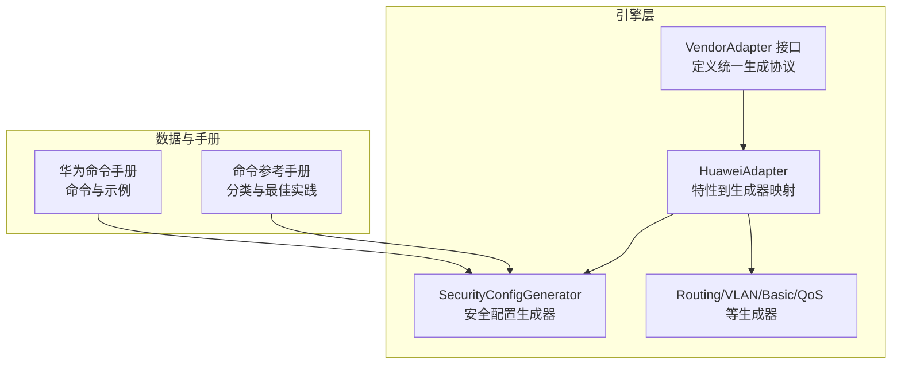
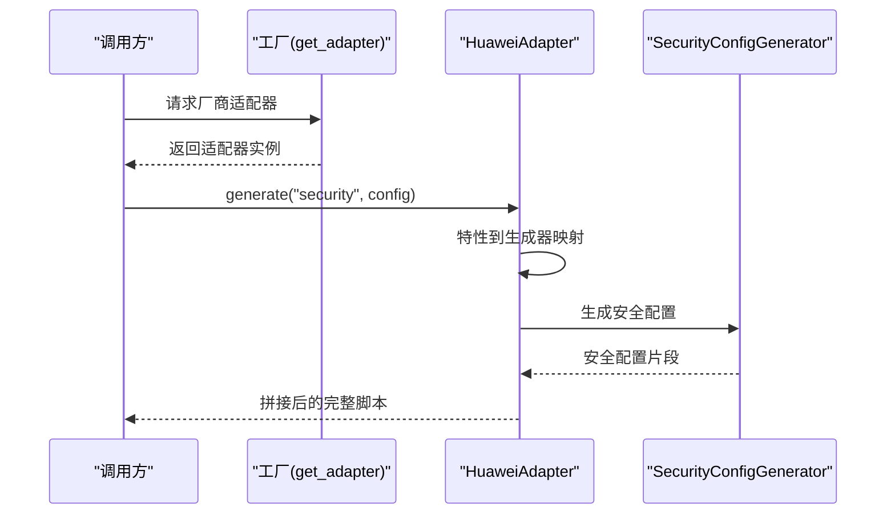
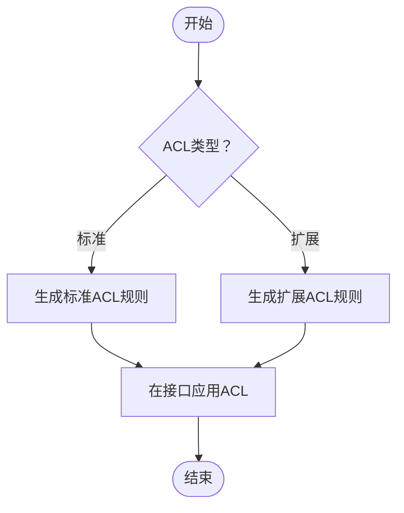
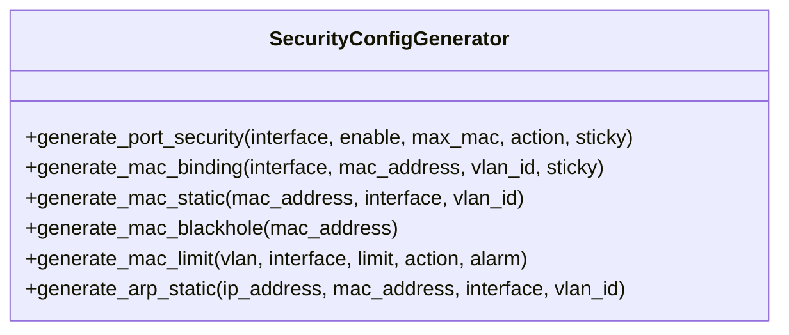
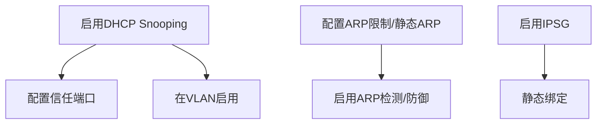
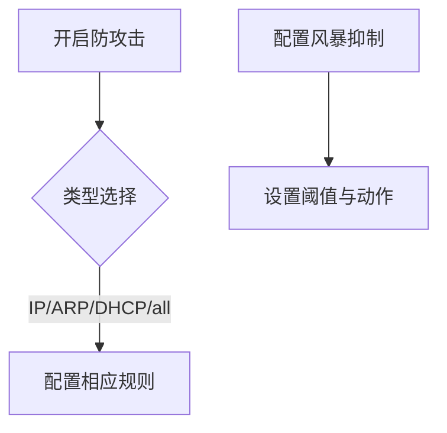
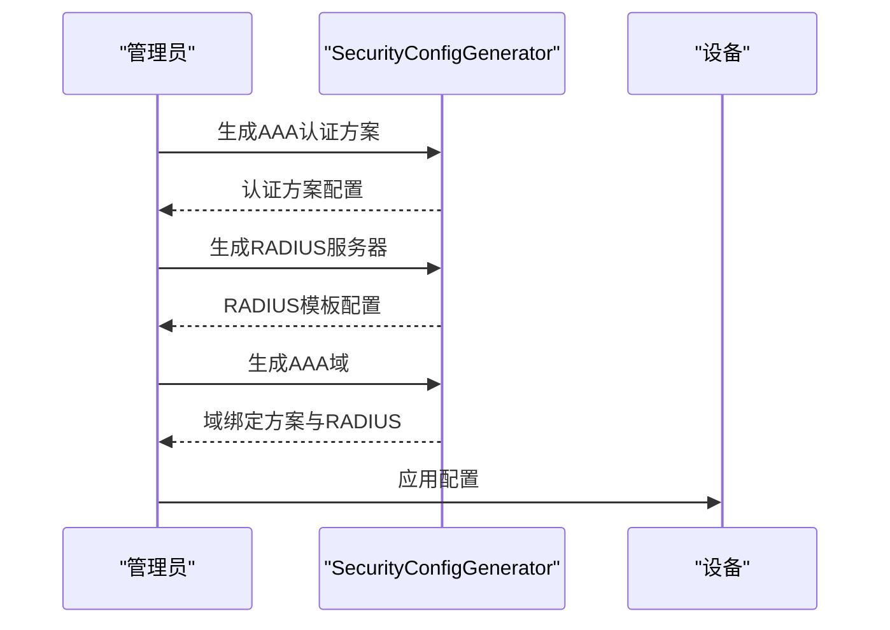
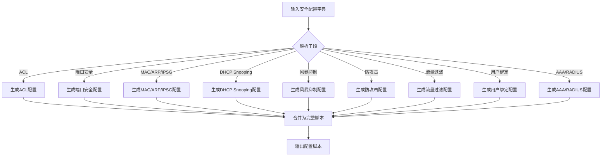
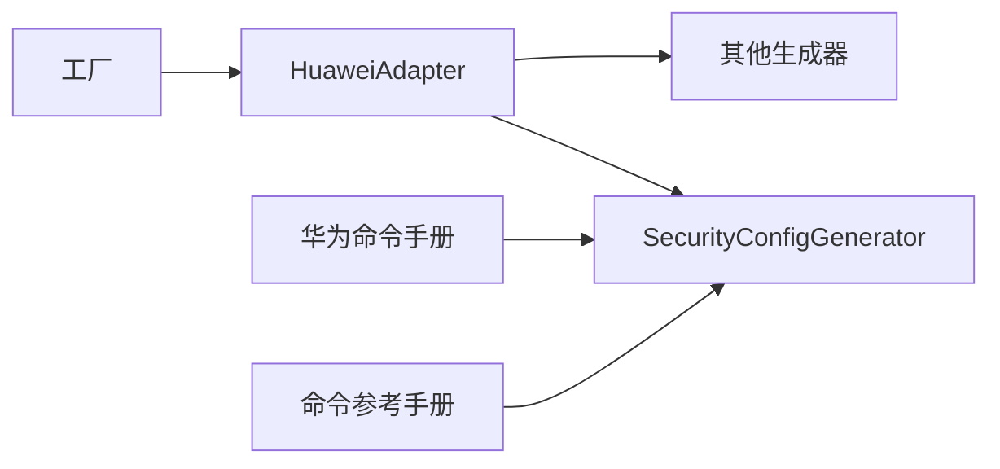

# 安全配置

<cite>
**本文引用的文件**
- [security.py](file://api/app/engine/vendors/huawei/security.py)
- [huawei.py](file://api/app/data/manual/huawei.py)
- [base.py](file://api/app/engine/base.py)
- [factory.py](file://api/app/engine/factory.py)
- [huawei.py](file://api/app/engine/adapters/huawei.py)
- [cases.py](file://api/app/data/cases.py)
- [basic.py](file://api/app/engine/vendors/huawei/basic.py)
- [vlan.py](file://api/app/engine/vendors/huawei/vlan.py)
</cite>

## 目录
1. [简介](#简介)
2. [项目结构](#项目结构)
3. [核心组件](#核心组件)
4. [架构总览](#架构总览)
5. [详细组件分析](#详细组件分析)
6. [依赖分析](#依赖分析)
7. [性能考虑](#性能考虑)
8. [故障排查指南](#故障排查指南)
9. [结论](#结论)
10. [附录](#附录)

## 简介
本文件面向网络工程师，系统化说明华为设备安全配置生成器的功能与实现，覆盖访问控制列表（ACL）、防火墙策略、入侵防御、VPN配置、认证授权、加密配置等关键能力。文档基于仓库中的代码实现进行解读，提供参数说明、数据流、典型使用场景与最佳实践，帮助快速掌握如何在真实网络环境中正确生成与落地安全配置。

## 项目结构
- 引擎层采用“厂商适配器 + 特性生成器”的分层设计：
  - 适配器负责将高层特性请求映射到具体生成器；
  - 生成器按功能域拆分，如基础、VLAN、安全等；
  - 工厂负责厂商注册与实例化；
  - 手册与参考数据提供命令与最佳实践支撑。

图表来源
- [base.py:11-27](file://api/app/engine/base.py#L11-L27)
- [factory.py:18-32](file://api/app/engine/factory.py#L18-L32)
- [huawei.py:20-108](file://api/app/engine/adapters/huawei.py#L20-L108)
- [security.py:8-578](file://api/app/engine/vendors/huawei/security.py#L8-L578)
- [huawei.py:7-342](file://api/app/data/manual/huawei.py#L7-L342)
- [cases.py:7-324](file://api/app/data/cases.py#L7-L324)

章节来源
- [base.py:11-27](file://api/app/engine/base.py#L11-L27)
- [factory.py:18-32](file://api/app/engine/factory.py#L18-L32)
- [huawei.py:20-108](file://api/app/engine/adapters/huawei.py#L20-L108)

## 核心组件
- 安全配置生成器（SecurityConfigGenerator）
  - 提供ACL（标准/扩展）、端口安全、MAC地址管理、DHCP Snooping、ARP防护、IPSG、风暴抑制、防攻击、流量过滤、用户静态绑定等方法；
  - 支持从完整配置字典生成全量安全配置脚本。
- 华为适配器（HuaweiAdapter）
  - 将特性码映射到具体生成器，目前安全特性预留占位，后续可接入安全生成器。
- 命令手册与参考
  - 华为命令手册提供ACL、端口安全、DHCP Snooping、ARP安全、IPSG、流量监管等命令与示例；
  - 命令参考手册提供安全类命令的分类与最佳实践清单。

章节来源
- [security.py:8-578](file://api/app/engine/vendors/huawei/security.py#L8-L578)
- [huawei.py:20-108](file://api/app/engine/adapters/huawei.py#L20-L108)
- [huawei.py:169-223](file://api/app/data/manual/huawei.py#L169-L223)
- [cases.py:93-118](file://api/app/data/cases.py#L93-L118)

## 架构总览
安全配置生成器位于“厂商适配器 → 生成器”链路中，接收高层配置字典，按功能域拆解并生成对应命令片段，最终拼接为完整脚本。命令手册与参考为生成逻辑提供权威依据。

图表来源
- [factory.py:26-32](file://api/app/engine/factory.py#L26-L32)
- [huawei.py:101-116](file://api/app/engine/adapters/huawei.py#L101-L116)
- [security.py:389-578](file://api/app/engine/vendors/huawei/security.py#L389-L578)

章节来源
- [factory.py:26-32](file://api/app/engine/factory.py#L26-L32)
- [huawei.py:101-116](file://api/app/engine/adapters/huawei.py#L101-L116)
- [security.py:389-578](file://api/app/engine/vendors/huawei/security.py#L389-L578)

## 详细组件分析

### ACL与流量过滤
- 标准ACL与扩展ACL
  - 支持创建ACL编号、描述、规则条目（动作、源/目的、通配符、协议、端口等），并生成规则字符串；
  - 支持在接口应用ACL进行入/出方向过滤。
- 参数要点
  - ACL类型：标准（2000-2999）/扩展（3000-3999）；
  - 规则动作：permit/deny；
  - 协议：ip/tcp/udp等；
  - 端口匹配：destination-port eq/range；
  - 方向：inbound/outbound。
- 使用场景
  - 访问控制、流量策略、带宽限制、DDoS缓解等。

图表来源
- [security.py:12-78](file://api/app/engine/vendors/huawei/security.py#L12-L78)
- [security.py:357-365](file://api/app/engine/vendors/huawei/security.py#L357-L365)

章节来源
- [security.py:12-78](file://api/app/engine/vendors/huawei/security.py#L12-L78)
- [security.py:357-365](file://api/app/engine/vendors/huawei/security.py#L357-L365)
- [huawei.py:170-183](file://api/app/data/manual/huawei.py#L170-L183)

### 端口安全与MAC地址管理
- 端口安全
  - 启用端口安全、设置最大MAC数、违规动作（protect/restrict/shutdown）、粘性学习、老化时间等；
  - 支持在接口上应用端口安全策略。
- MAC地址管理
  - 静态MAC绑定、黑洞MAC、学习限制（VLAN/接口维度）、静态ARP绑定等。
- 使用场景
  - 防止非法接入、MAC泛洪、ARP欺骗等。

图表来源
- [security.py:80-147](file://api/app/engine/vendors/huawei/security.py#L80-L147)
- [security.py:268-298](file://api/app/engine/vendors/huawei/security.py#L268-L298)

章节来源
- [security.py:80-147](file://api/app/engine/vendors/huawei/security.py#L80-L147)
- [security.py:268-298](file://api/app/engine/vendors/huawei/security.py#L268-L298)
- [huawei.py:185-194](file://api/app/data/manual/huawei.py#L185-L194)

### DHCP Snooping、ARP防护与IPSG
- DHCP Snooping
  - 全局启用、VLAN维度启用、信任端口配置、绑定表查看等。
- ARP防护
  - ARP表项限制、静态ARP绑定、ARP检测与防御、查看ARP表等。
- IPSG
  - 启用IP源防护、静态绑定、查看绑定表等。
- 使用场景
  - 防止DHCP欺骗、ARP欺骗、IP冒用等。

图表来源
- [security.py:232-266](file://api/app/engine/vendors/huawei/security.py#L232-L266)
- [security.py:300-316](file://api/app/engine/vendors/huawei/security.py#L300-L316)

章节来源
- [security.py:232-266](file://api/app/engine/vendors/huawei/security.py#L232-L266)
- [security.py:300-316](file://api/app/engine/vendors/huawei/security.py#L300-L316)
- [huawei.py:195-214](file://api/app/data/manual/huawei.py#L195-L214)

### 防攻击与风暴抑制
- 防攻击
  - 支持开启IP源地址不匹配、ARP/DHCP等特定类型的防攻击。
- 风暴抑制
  - 在接口上配置广播/组播/单播报文抑制阈值与动作。
- 使用场景
  - 抵御DDoS、广播风暴、异常流量等。

图表来源
- [security.py:340-354](file://api/app/engine/vendors/huawei/security.py#L340-L354)
- [security.py:318-337](file://api/app/engine/vendors/huawei/security.py#L318-L337)

章节来源
- [security.py:340-354](file://api/app/engine/vendors/huawei/security.py#L340-L354)
- [security.py:318-337](file://api/app/engine/vendors/huawei/security.py#L318-L337)

### AAA认证、RADIUS与用户管理
- AAA认证方案与域
  - 支持创建认证方案、配置认证方式（如本地/域/外部RADIUS）、配置域并绑定认证方案与RADIUS模板。
- RADIUS服务器
  - 支持配置共享密钥、认证/计费端口、重传次数、超时等。
- 用户与服务类型
  - 支持创建本地用户、设置密码、权限级别、服务类型（SSH/Telnet/终端等）。
- 使用场景
  - 集中认证、审计与合规、远程运维安全。

图表来源
- [security.py:184-230](file://api/app/engine/vendors/huawei/security.py#L184-L230)
- [basic.py:84-99](file://api/app/engine/vendors/huawei/basic.py#L84-L99)

章节来源
- [security.py:184-230](file://api/app/engine/vendors/huawei/security.py#L184-L230)
- [basic.py:84-99](file://api/app/engine/vendors/huawei/basic.py#L84-L99)
- [huawei.py:22-32](file://api/app/data/manual/huawei.py#L22-L32)

### 802.1X与有线接入安全
- 全局与接口级配置
  - 全局启用802.1X、认证方式、重认证周期、定时器等；
  - 接口启用、端口认证方式（MAC/端口）、最大用户数、静默期等。
- 使用场景
  - 办公室无线/有线准入控制、防止未授权接入。

章节来源
- [security.py:150-182](file://api/app/engine/vendors/huawei/security.py#L150-L182)
- [huawei.py:169-183](file://api/app/data/manual/huawei.py#L169-L183)

### 加密与SSH/Telnet安全
- SSH配置
  - 生成RSA密钥对、启用SSH服务、设置版本、端口、超时、最大认证次数、重协商间隔、用户认证与服务类型、VTY认证模式等。
- Telnet配置
  - 启用Telnet服务并配置VTY认证模式（建议生产环境禁用）。
- 使用场景
  - 远程运维安全、密钥轮换与策略加固。

章节来源
- [basic.py:24-46](file://api/app/engine/vendors/huawei/basic.py#L24-L46)
- [basic.py:48-56](file://api/app/engine/vendors/huawei/basic.py#L48-L56)
- [huawei.py:34-50](file://api/app/data/manual/huawei.py#L34-L50)

### 完整安全配置生成流程
- 输入：安全配置字典（包含ACL、端口安全、MAC/ARP/IPSG、DHCP Snooping、风暴抑制、防攻击、流量过滤、用户绑定、AAA/RADIUS等子段）。
- 输出：带注释分段的完整配置脚本，按功能域分节，便于审计与维护。

图表来源
- [security.py:389-578](file://api/app/engine/vendors/huawei/security.py#L389-L578)

章节来源
- [security.py:389-578](file://api/app/engine/vendors/huawei/security.py#L389-L578)

## 依赖分析
- 适配器与生成器耦合
  - HuaweiAdapter当前对“security”特性预留占位，未直接调用SecurityConfigGenerator，后续可按需接入；
  - 其他特性（basic/vlan/routing/interface/qos）已有生成器与适配器映射。
- 外部依赖
  - 命令手册与参考为生成逻辑提供权威依据，避免生成错误命令；
  - 工厂负责厂商注册与实例化，保证扩展性。

图表来源
- [factory.py:18-32](file://api/app/engine/factory.py#L18-L32)
- [huawei.py:20-108](file://api/app/engine/adapters/huawei.py#L20-L108)
- [security.py:8-578](file://api/app/engine/vendors/huawei/security.py#L8-L578)
- [huawei.py:7-342](file://api/app/data/manual/huawei.py#L7-L342)
- [cases.py:7-324](file://api/app/data/cases.py#L7-L324)

章节来源
- [factory.py:18-32](file://api/app/engine/factory.py#L18-L32)
- [huawei.py:20-108](file://api/app/engine/adapters/huawei.py#L20-L108)
- [security.py:8-578](file://api/app/engine/vendors/huawei/security.py#L8-L578)
- [huawei.py:7-342](file://api/app/data/manual/huawei.py#L7-L342)
- [cases.py:7-324](file://api/app/data/cases.py#L7-L324)

## 性能考虑
- 生成器方法均为纯函数式静态方法，无状态、可复用，适合大规模并发生成；
- 批量VLAN与ACL生成采用区间压缩与列表拼接，减少冗余命令；
- 建议在调用侧对配置字典进行预校验，避免无效参数导致重复生成与下发失败。

## 故障排查指南
- 常见问题
  - ACL规则顺序与匹配：扩展ACL支持端口匹配与时间段，需确保规则顺序合理；
  - 端口安全违规：违规动作可能导致端口shutdown，需检查违规原因与恢复流程；
  - DHCP Snooping与IPSG冲突：需确保静态绑定一致，避免合法流量被阻断；
  - SSH/Telnet配置：生产环境建议仅启用SSH，禁用明文Telnet。
- 排查步骤
  - 查看ACL命中计数与匹配结果；
  - 检查端口安全状态与违规日志；
  - 核对DHCP Snooping绑定表与ARP表；
  - 验证SSH密钥生成与VTY认证模式。

章节来源
- [huawei.py:170-183](file://api/app/data/manual/huawei.py#L170-L183)
- [huawei.py:185-194](file://api/app/data/manual/huawei.py#L185-L194)
- [huawei.py:195-214](file://api/app/data/manual/huawei.py#L195-L214)

## 结论
该安全配置生成器以模块化方式覆盖ACL、端口安全、DHCP Snooping、ARP/IPSG、风暴抑制、防攻击、AAA/RADIUS、802.1X与加密等关键安全能力，结合命令手册与参考，确保生成的配置符合华为设备规范。建议在网络规划阶段明确安全域与策略边界，结合ACL与端口安全实现最小权限与可追溯的访问控制，并通过日志与审计持续优化。

## 附录
- 实际使用建议
  - 分阶段实施：先部署ACL与端口安全，再逐步引入IPSG与RADIUS；
  - 最小化暴露面：关闭未使用端口与服务，仅开放必要管理通道；
  - 定期轮换密钥与密码，启用SSH重协商与超时控制；
  - 建立变更流程与回滚预案，确保配置变更可审计、可追溯。