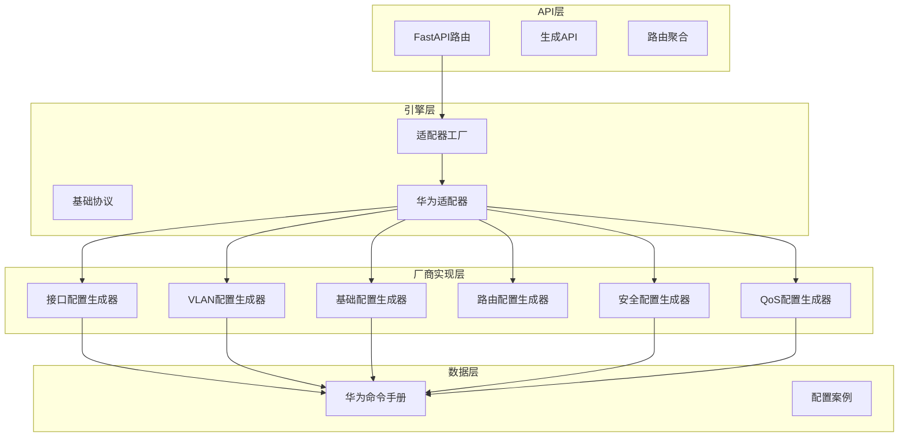
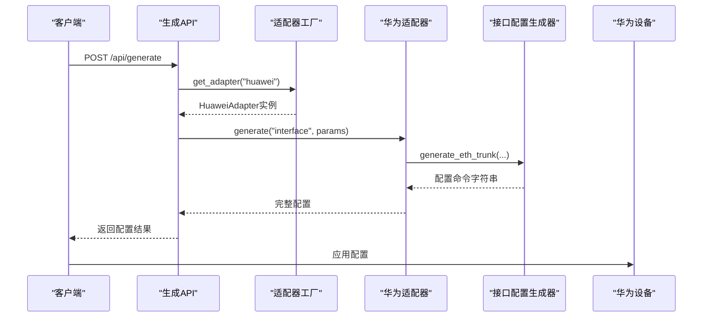
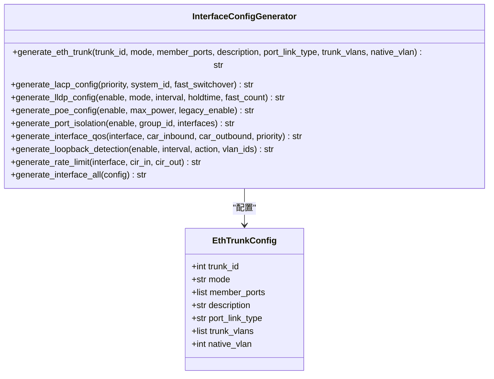
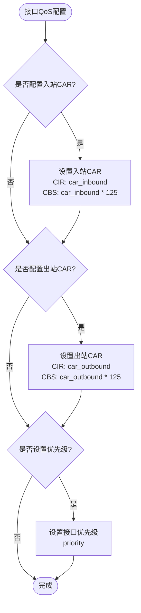
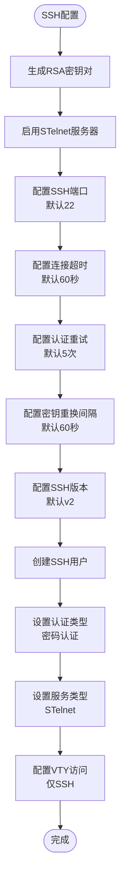
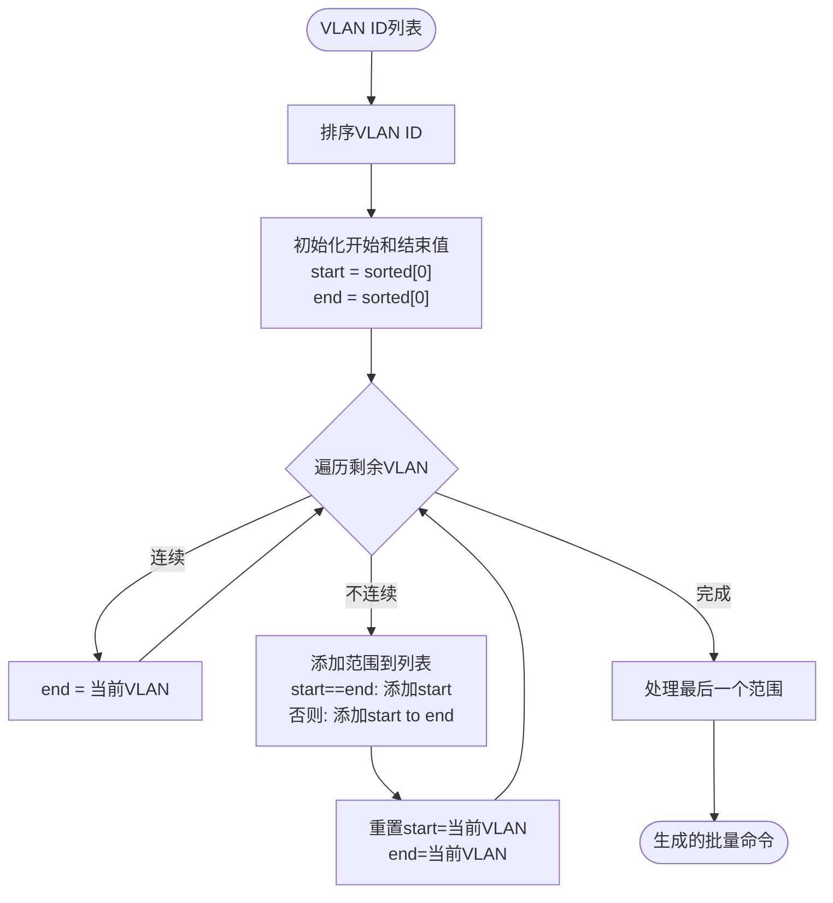
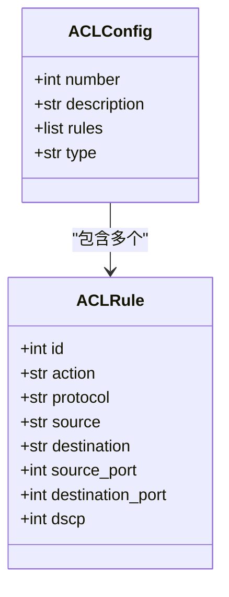
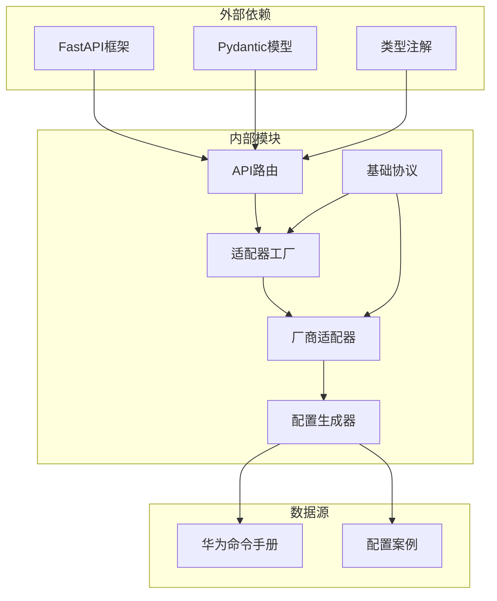
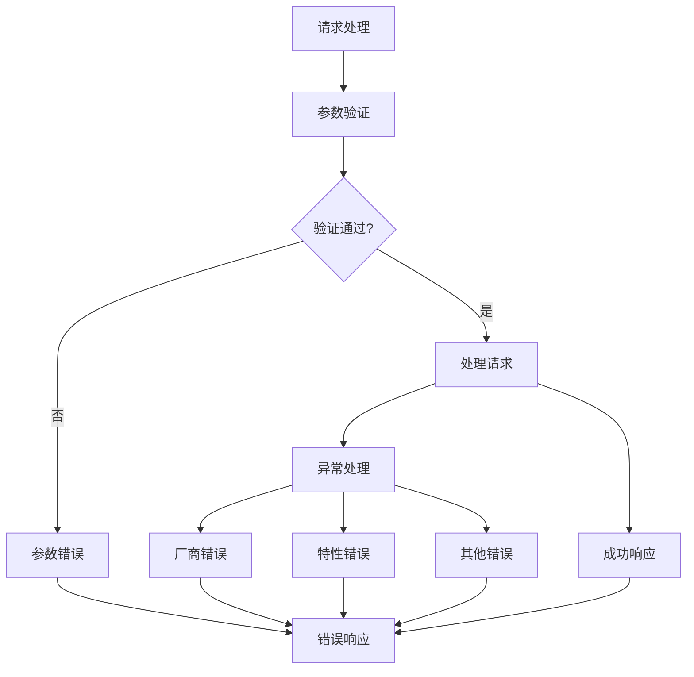

# 接口配置

<cite>
**本文档引用的文件**
- [interface.py](file://api/app/engine/vendors/huawei/interface.py)
- [huawei.py](file://api/app/data/manual/huawei.py)
- [base.py](file://api/app/engine/base.py)
- [factory.py](file://api/app/engine/factory.py)
- [huawei.py](file://api/app/engine/adapters/huawei.py)
- [generate.py](file://api/app/api/generate.py)
- [router.py](file://api/app/api/router.py)
- [basic.py](file://api/app/engine/vendors/huawei/basic.py)
- [routing.py](file://api/app/engine/vendors/huawei/routing.py)
- [vlan.py](file://api/app/engine/vendors/huawei/vlan.py)
- [qos.py](file://api/app/engine/vendors/huawei/qos.py)
- [security.py](file://api/app/engine/vendors/huawei/security.py)
- [sample-huawei-vlan.json](file://api/tests/sample-huawei-vlan.json)
</cite>

## 目录
1. [简介](#简介)
2. [项目结构](#项目结构)
3. [核心组件](#核心组件)
4. [架构概览](#架构概览)
5. [详细组件分析](#详细组件分析)
6. [依赖关系分析](#依赖关系分析)
7. [性能考虑](#性能考虑)
8. [故障排除指南](#故障排除指南)
9. [结论](#结论)
10. [附录](#附录)

## 简介

华为设备接口配置生成器是一个专门设计用于自动生成华为网络设备接口配置命令的工具。该系统提供了完整的接口配置解决方案，包括物理接口、逻辑接口、子接口配置、接口状态管理、接口属性设置等功能。系统支持多种高级功能，如接口模式切换、速率配置、双工模式设置、接口描述配置、接口保护机制等。

该工具旨在帮助网络工程师快速、准确地生成华为设备的接口配置，减少手工配置错误，提高网络部署效率。系统采用模块化设计，支持灵活的配置组合和扩展。

## 项目结构

项目采用分层架构设计，主要分为以下几个层次：



**图表来源**
- [factory.py:17-23](file://api/app/engine/factory.py#L17-L23)
- [huawei.py:20-23](file://api/app/engine/adapters/huawei.py#L20-L23)

**章节来源**
- [factory.py:1-45](file://api/app/engine/factory.py#L1-L45)
- [base.py:11-27](file://api/app/engine/base.py#L11-L27)

## 核心组件

### 接口配置生成器

接口配置生成器是华为设备接口配置的核心组件，提供了完整的接口配置功能。该生成器支持以下主要功能：

- **Eth-Trunk链路聚合配置**：支持LACP静态、动态和手动模式
- **LLDP配置**：支持全局和接口级别的LLDP配置
- **PoE配置**：支持全局和接口级别的PoE配置
- **端口隔离配置**：支持端口间的隔离管理
- **接口QoS配置**：支持CAR和优先级配置
- **环路检测配置**：支持环路检测和动作配置
- **速率限制配置**：支持入站和出站速率限制

### 基础配置生成器

基础配置生成器负责设备的基础管理配置，包括：
- 主机名配置
- 密码和用户管理
- SSH/Telnet配置
- Banner配置
- NTP配置
- SNMP配置
- 日志配置
- 管理接口配置
- DHCP配置

### VLAN配置生成器

VLAN配置生成器提供完整的VLAN管理功能：
- 批量VLAN创建
- VLAN接口配置
- 接口VLAN模式配置
- Voice VLAN配置
- STP配置

### 路由配置生成器

路由配置生成器支持多种路由协议：
- 静态路由配置
- OSPF配置
- BGP配置
- RIP配置

### 安全配置生成器

安全配置生成器提供全面的安全功能：
- ACL配置
- 端口安全配置
- 802.1X配置
- DHCP Snooping配置
- ARP防护配置
- 防攻击配置

### QoS配置生成器

QoS配置生成器支持复杂的流量管理：
- 流分类配置
- 流行为配置
- 流策略配置
- 队列调度配置
- 带宽策略配置

**章节来源**
- [interface.py:8-308](file://api/app/engine/vendors/huawei/interface.py#L8-L308)
- [basic.py:8-359](file://api/app/engine/vendors/huawei/basic.py#L8-L359)
- [vlan.py:8-175](file://api/app/engine/vendors/huawei/vlan.py#L8-L175)
- [routing.py:8-213](file://api/app/engine/vendors/huawei/routing.py#L8-L213)
- [security.py:8-578](file://api/app/engine/vendors/huawei/security.py#L8-L578)
- [qos.py:8-290](file://api/app/engine/vendors/huawei/qos.py#L8-L290)

## 架构概览

系统采用适配器模式设计，支持多厂商设备的统一接口：



**图表来源**
- [generate.py:53-64](file://api/app/api/generate.py#L53-L64)
- [factory.py:26-32](file://api/app/engine/factory.py#L26-L32)
- [huawei.py:110-116](file://api/app/engine/adapters/huawei.py#L110-L116)

系统架构具有以下特点：

1. **统一接口**：通过适配器模式提供统一的API接口
2. **模块化设计**：每个功能模块独立封装，便于维护和扩展
3. **配置组合**：支持多模块配置的组合生成
4. **错误处理**：完善的异常处理和错误提示机制

**章节来源**
- [generate.py:1-77](file://api/app/api/generate.py#L1-L77)
- [factory.py:1-45](file://api/app/engine/factory.py#L1-L45)
- [huawei.py:1-129](file://api/app/engine/adapters/huawei.py#L1-L129)

## 详细组件分析

### 接口配置生成器详解

接口配置生成器是系统的核心组件，提供了丰富的接口配置功能：

#### Eth-Trunk链路聚合配置

Eth-Trunk配置支持多种聚合模式和参数：



**图表来源**
- [interface.py:11-43](file://api/app/engine/vendors/huawei/interface.py#L11-L43)

#### 接口LLDP配置

LLDP配置支持全局和接口级别的配置：

| 参数 | 类型 | 描述 | 默认值 |
|------|------|------|--------|
| enable | bool | 是否启用LLDP | True |
| mode | str | LLDP模式（txrx/tx/recv/both） | "both" |
| interval | int | 发送间隔（秒） | 30 |
| holdtime | int | 保持时间（秒） | 120 |
| fast_count | int | 快速发送次数 | 4 |

#### 接口PoE配置

PoE配置支持全局和接口级别的管理：

| 参数 | 类型 | 描述 | 默认值 |
|------|------|------|--------|
| enable | bool | 是否启用PoE | True |
| max_power | int | 最大功率（mW） | 74000 |
| legacy_enable | bool | 是否启用传统PoE | False |
| mode | str | PoE模式（auto/static/dynamic） | "auto" |
| priority | str | 设备优先级（high/medium/low） | "low" |
| max_power | int | 接口最大功率（mW） | 15400 |

#### 接口QoS配置

QoS配置支持CAR和优先级设置：



**图表来源**
- [interface.py:160-179](file://api/app/engine/vendors/huawei/interface.py#L160-L179)

**章节来源**
- [interface.py:1-308](file://api/app/engine/vendors/huawei/interface.py#L1-L308)

### 基础配置生成器详解

基础配置生成器提供了设备管理的核心功能：

#### SSH配置流程



**图表来源**
- [basic.py:24-46](file://api/app/engine/vendors/huawei/basic.py#L24-L46)

#### 用户管理配置

用户管理支持多种认证方式和服务类型：

| 认证方式 | 描述 | 适用场景 |
|----------|------|----------|
| password | 明文密码认证 | 本地用户管理 |
| cipher | 密文密码认证 | 安全性要求高的环境 |
| aaa | AAA认证 | 集中认证管理 |
| none | 无认证 | 特殊管理场景 |

**章节来源**
- [basic.py:1-359](file://api/app/engine/vendors/huawei/basic.py#L1-L359)

### VLAN配置生成器详解

VLAN配置生成器支持完整的VLAN管理功能：

#### VLAN批量创建算法



**图表来源**
- [vlan.py:12-38](file://api/app/engine/vendors/huawei/vlan.py#L12-L38)

#### 接口VLAN模式配置

| 模式 | 描述 | 使用场景 |
|------|------|----------|
| access | 访问模式 | 连接终端设备 |
| trunk | 中继模式 | 连接其他交换机 |
| hybrid | 混合模式 | 复杂VLAN场景 |
| dot1q-tunnel | QinQ隧道 | 服务提供商网络 |

**章节来源**
- [vlan.py:1-175](file://api/app/engine/vendors/huawei/vlan.py#L1-L175)

### 安全配置生成器详解

安全配置生成器提供了全面的安全防护功能：

#### ACL配置生成

ACL配置支持多种规则类型：



**图表来源**
- [security.py:12-78](file://api/app/engine/vendors/huawei/security.py#L12-L78)

#### 端口安全配置

端口安全配置支持多种保护机制：

| 保护类型 | 动作 | 描述 |
|----------|------|------|
| protect | 丢弃 | 丢弃违规流量 |
| restrict | 告警 | 记录违规但允许通信 |
| shutdown | 关闭 | 关闭违规端口 |

**章节来源**
- [security.py:1-578](file://api/app/engine/vendors/huawei/security.py#L1-L578)

## 依赖关系分析

系统采用松耦合的设计，各组件之间的依赖关系清晰：



**图表来源**
- [base.py:8-27](file://api/app/engine/base.py#L8-L27)
- [factory.py:11-14](file://api/app/engine/factory.py#L11-L14)

### 组件耦合度分析

系统在设计上实现了良好的内聚性和低耦合性：

1. **适配器模式**：通过VendorAdapter协议实现厂商无关性
2. **工厂模式**：通过工厂类管理适配器实例
3. **生成器模式**：每个功能模块独立封装
4. **依赖注入**：通过构造函数注入依赖

### 循环依赖检查

经过分析，系统不存在循环依赖问题：
- API层不依赖引擎层
- 引擎层不依赖API层
- 各生成器模块相互独立
- 适配器层提供统一接口

**章节来源**
- [base.py:1-36](file://api/app/engine/base.py#L1-L36)
- [factory.py:1-45](file://api/app/engine/factory.py#L1-L45)
- [huawei.py:1-129](file://api/app/engine/adapters/huawei.py#L1-L129)

## 性能考虑

系统在设计时充分考虑了性能优化：

### 内存使用优化

1. **字符串拼接优化**：使用列表收集后一次性拼接，避免频繁字符串操作
2. **配置缓存**：适配器实例采用单例模式，避免重复创建
3. **参数验证**：使用Pydantic模型进行参数验证，减少运行时错误

### 执行效率优化

1. **延迟加载**：部分功能模块按需加载
2. **批量操作**：支持VLAN批量创建等批量操作
3. **配置合并**：支持多模块配置的高效合并

### 扩展性考虑

1. **插件架构**：新厂商可通过简单适配器集成
2. **配置模板**：支持配置模板的灵活组合
3. **API扩展**：RESTful API设计便于功能扩展

## 故障排除指南

### 常见问题及解决方案

#### 配置生成失败

**问题**：生成配置时出现异常
**原因**：参数验证失败或厂商不支持
**解决方案**：
1. 检查输入参数格式
2. 确认厂商代码正确
3. 查看详细的错误信息

#### 接口配置冲突

**问题**：接口配置与其他配置冲突
**原因**：VLAN配置与接口模式不匹配
**解决方案**：
1. 检查接口的VLAN模式配置
2. 确认VLAN ID的有效性
3. 验证接口状态

#### 链路聚合配置问题

**问题**：Eth-Trunk配置不生效
**原因**：成员接口配置错误或聚合模式不匹配
**解决方案**：
1. 检查成员接口的聚合配置
2. 验证聚合模式设置
3. 确认LACP参数配置

### 错误处理机制

系统提供了完善的错误处理机制：



**图表来源**
- [generate.py:54-76](file://api/app/api/generate.py#L54-L76)

**章节来源**
- [generate.py:1-77](file://api/app/api/generate.py#L1-L77)

## 结论

华为设备接口配置生成器是一个功能完整、设计合理的网络配置自动化工具。系统通过模块化设计实现了高度的可维护性和扩展性，通过适配器模式支持多厂商设备的统一配置。

该系统的主要优势包括：

1. **功能完整性**：覆盖了华为设备的主要配置需求
2. **易用性**：提供简洁的API接口和配置模板
3. **可靠性**：完善的错误处理和验证机制
4. **扩展性**：模块化设计便于功能扩展和维护

对于网络工程师而言，该工具可以显著提高配置效率，减少手工配置错误，特别是在大规模网络部署和维护场景中具有重要价值。

## 附录

### 配置示例

#### 基础接口配置示例

以下是一个典型的以太网接口配置示例：

```json
{
  "vendor": "huawei",
  "feature": "interface",
  "params": {
    "eth_trunks": [
      {
        "trunk_id": 1,
        "mode": "lacp-static",
        "member_ports": ["GigabitEthernet0/0/1", "GigabitEthernet0/0/2"],
        "description": "To_Core_Switch",
        "port_link_type": "trunk",
        "trunk_vlans": [10, 20, 30],
        "native_vlan": 100
      }
    ],
    "lldp": {
      "enable": true,
      "mode": "both",
      "interval": 30,
      "holdtime": 120,
      "fast_count": 4,
      "interfaces": [
        {
          "interface": "GigabitEthernet0/0/1",
          "enable": true,
          "admin_status": "txrx"
        }
      ]
    },
    "poe": {
      "enable": true,
      "max_power": 74000,
      "legacy_enable": false,
      "interfaces": [
        {
          "interface": "GigabitEthernet0/0/24",
          "enable": true,
          "mode": "auto",
          "priority": "low",
          "max_power": 15400
        }
      ]
    }
  }
}
```

#### 三层接口配置示例

```json
{
  "vendor": "huawei",
  "feature": "interface",
  "params": {
    "interfaces": [
      {
        "interface": "GigabitEthernet0/0/1",
        "description": "To_Server_Room",
        "ip_address": "192.168.1.1",
        "mask": "255.255.255.0",
        "shutdown": false
      }
    ],
    "rate_limits": [
      {
        "interface": "GigabitEthernet0/0/1",
        "cir_in": 10000,
        "cir_out": 10000
      }
    ]
  }
}
```

### API使用说明

#### 单特性配置生成

```bash
curl -X POST "http://localhost:8000/api/generate" \
  -H "Content-Type: application/json" \
  -d '{
    "vendor": "huawei",
    "feature": "interface",
    "params": {
      "eth_trunks": [
        {
          "trunk_id": 1,
          "mode": "lacp-static",
          "member_ports": ["GigabitEthernet0/0/1", "GigabitEthernet0/0/2"]
        }
      ]
    }
  }'
```

#### 完整配置生成

```bash
curl -X POST "http://localhost:8000/api/generate/full" \
  -H "Content-Type: application/json" \
  -d '{
    "vendor": "huawei",
    "config": {
      "description": "接入交换机基础配置",
      "interface": {
        "eth_trunks": [...],
        "lldp": {...},
        "poe": {...}
      },
      "basic": {...},
      "vlan": {...}
    }
  }'
```

### 支持的特性列表

系统当前支持以下特性：

- **basic**：基础配置（主机名、用户、SSH、SNMP等）
- **vlan**：VLAN配置（VLAN创建、接口VLAN模式、STP等）
- **routing**：路由配置（静态路由、OSPF、BGP等）
- **security**：安全配置（ACL、端口安全、802.1X等）
- **interface**：接口配置（Eth-Trunk、LLDP、PoE等）
- **qos**：QoS配置（流分类、流行为、队列调度等）

**章节来源**
- [sample-huawei-vlan.json:1-15](file://api/tests/sample-huawei-vlan.json#L1-L15)
- [generate.py:21-46](file://api/app/api/generate.py#L21-L46)