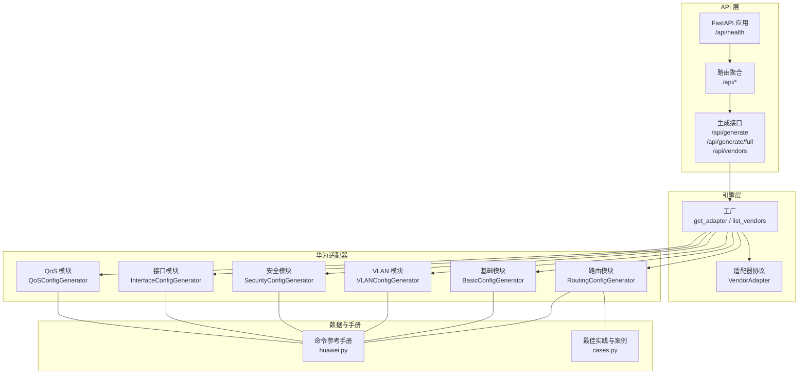
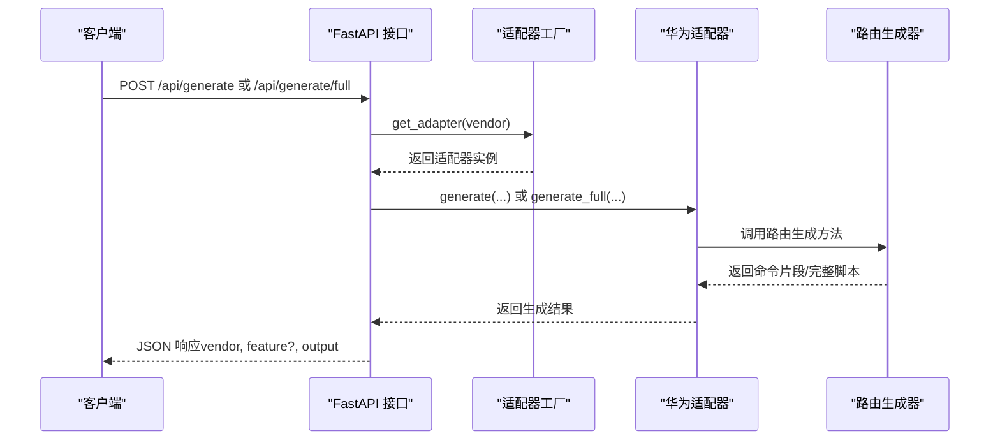
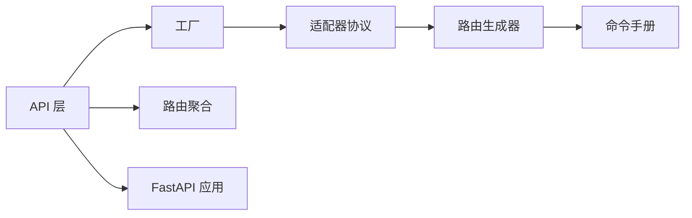

# 路由配置

<cite>
**本文引用的文件**
- [routing.py](file://api/app/engine/vendors/huawei/routing.py)
- [huawei.py](file://api/app/data/manual/huawei.py)
- [generate.py](file://api/app/api/generate.py)
- [router.py](file://api/app/api/router.py)
- [base.py](file://api/app/engine/base.py)
- [factory.py](file://api/app/engine/factory.py)
- [cases.py](file://api/app/data/cases.py)
- [main.py](file://api/app/main.py)
</cite>

## 目录
1. [简介](#简介)
2. [项目结构](#项目结构)
3. [核心组件](#核心组件)
4. [架构总览](#架构总览)
5. [详细组件分析](#详细组件分析)
6. [依赖分析](#依赖分析)
7. [性能考虑](#性能考虑)
8. [故障排查指南](#故障排查指南)
9. [结论](#结论)
10. [附录](#附录)

## 简介
本文件面向网络工程师，系统化说明华为设备路由配置生成器的功能与实现，覆盖静态路由、OSPF、BGP、RIP 等动态路由协议，以及路由策略、路由过滤、路由聚合、路由表管理、路由优先级与度量值、路由反射器等高级能力。文档提供参数说明、典型配置步骤、使用场景与最佳实践，帮助快速生成可直接下发到设备的命令脚本。

## 项目结构
该路由配置生成器位于多厂商适配器框架之下，采用“适配器 + 工厂 + API”的分层设计：
- API 层：提供统一的生成接口（单特性与完整配置），负责参数校验与错误处理。
- 引擎层：定义厂商适配器协议与工厂，按厂商代码选择具体适配器。
- 华为适配器：在 huawei 子包中实现各功能模块（基础、VLAN、路由、安全、接口、QoS 等）。
- 数据与手册：提供命令参考、最佳实践与案例，辅助生成与验证。

图表来源
- [main.py:1-29](file://api/app/main.py#L1-L29)
- [router.py:1-11](file://api/app/api/router.py#L1-L11)
- [generate.py:1-77](file://api/app/api/generate.py#L1-L77)
- [factory.py:1-39](file://api/app/engine/factory.py#L1-L39)
- [base.py:1-36](file://api/app/engine/base.py#L1-L36)
- [routing.py:1-213](file://api/app/engine/vendors/huawei/routing.py#L1-L213)
- [huawei.py:1-703](file://api/app/data/manual/huawei.py#L1-L703)
- [cases.py:1-377](file://api/app/data/cases.py#L1-L377)

章节来源
- [main.py:1-29](file://api/app/main.py#L1-L29)
- [router.py:1-11](file://api/app/api/router.py#L1-L11)
- [generate.py:1-77](file://api/app/api/generate.py#L1-L77)
- [factory.py:1-39](file://api/app/engine/factory.py#L1-L39)
- [base.py:1-36](file://api/app/engine/base.py#L1-L36)

## 核心组件
- 路由配置生成器（RoutingConfigGenerator）
  - 提供静态路由、默认路由、OSPF、BGP、RIP 的命令生成方法。
  - 支持生成完整路由配置脚本（整合静态、默认、OSPF、BGP、RIP）。
- 命令参考与最佳实践（huawei.py、cases.py）
  - 提供华为设备命令参考、示例与最佳实践，便于对照生成与验证。
- API 与适配器框架
  - 统一的 VendorAdapter 协议与工厂机制，便于扩展新厂商。
  - FastAPI 提供生成接口与厂商清单查询。

章节来源
- [routing.py:8-213](file://api/app/engine/vendors/huawei/routing.py#L8-L213)
- [huawei.py:117-168](file://api/app/data/manual/huawei.py#L117-L168)
- [cases.py:73-92](file://api/app/data/cases.py#L73-L92)
- [generate.py:1-77](file://api/app/api/generate.py#L1-L77)
- [base.py:11-36](file://api/app/engine/base.py#L11-L36)
- [factory.py:14-27](file://api/app/engine/factory.py#L14-L27)

## 架构总览
路由配置生成器在整体架构中的定位如下：

图表来源
- [generate.py:53-76](file://api/app/api/generate.py#L53-L76)
- [factory.py:20-27](file://api/app/engine/factory.py#L20-L27)
- [routing.py:150-213](file://api/app/engine/vendors/huawei/routing.py#L150-L213)

## 详细组件分析

### 静态路由与默认路由
- 功能要点
  - 支持目的网络、掩码、下一跳或出接口、优先级等参数。
  - 支持生成默认路由（0.0.0.0/0）。
- 关键方法
  - generate_static_route(dest_network, mask, next_hop=None, interface=None, preference=None)
  - generate_default_route(next_hop=None, interface=None)
- 使用场景
  - 出口下一跳直连或非直连场景。
  - 默认路由作为缺省出口。
- 参数说明
  - dest_network/mask：目的网络与掩码。
  - next_hop/interface：二选一，指定下一跳或出接口。
  - preference：静态路由优先级（数值越小优先级越高）。

章节来源
- [routing.py:12-35](file://api/app/engine/vendors/huawei/routing.py#L12-L35)
- [huawei.py:118-127](file://api/app/data/manual/huawei.py#L118-L127)

### OSPF 配置
- 功能要点
  - 支持进程号、Router-ID、区域、默认开销、网络宣告、接口启用等。
  - 支持接口级参数：cost、DR 优先级、Hello/Dead 计时器。
- 关键方法
  - generate_ospf_config(process_id=1, router_id=None, area_id="0", networks=None, interfaces=None, cost=None)
  - generate_ospf_interface(interface, cost=None, priority=None, hello_time=10, dead_time=40, area=None)
- 多区域与 NSSA/Stub 区域
  - 通过 area 子命令与 nssa/stub 子句实现。
- 认证与被动接口
  - 支持区域认证与接口认证；支持 silent-interface。
- 使用场景
  - 内部网关协议，支持分层设计与区域划分。
- 参数说明
  - process_id：OSPF 进程号。
  - router_id：Router-ID（推荐使用 LoopBack 地址）。
  - area_id：区域标识。
  - networks：network 语句的网络与通配符。
  - interfaces：接口启用 OSPF。
  - cost：默认开销。
  - hello/ dead：Hello/Dead 计时器（秒）。

章节来源
- [routing.py:38-88](file://api/app/engine/vendors/huawei/routing.py#L38-L88)
- [huawei.py:129-143](file://api/app/data/manual/huawei.py#L129-L143)

### BGP 配置
- 功能要点
  - 支持进程号、Router-ID、对等体（IBGP/EBGP）、网络宣告、导入直连/静态/其他协议路由。
  - 支持 IPv4 地址族与 import-route。
- 关键方法
  - generate_bgp_config(as_number, router_id=None, peer_groups=None, networks=None, import_routes=None)
- 使用场景
  - 跨自治系统互联、路由策略控制、路由反射器部署。
- 参数说明
  - as_number：自治系统号。
  - router_id：Router-ID。
  - peers：对等体列表（IP 与 AS）。
  - networks：network 语句宣告的聚合/明细网络。
  - import_routes：从其他协议导入的路由（如 import-route ospf process X）。

章节来源
- [routing.py:91-127](file://api/app/engine/vendors/huawei/routing.py#L91-L127)
- [huawei.py:145-157](file://api/app/data/manual/huawei.py#L145-L157)

### RIP 配置
- 功能要点
  - 支持进程号、版本（1/2）、网络宣告、导入直连/静态路由。
- 关键方法
  - generate_rip_config(version=2, networks=None, import_routes=None)
- 使用场景
  - 小型网络或与旧设备互通。
- 参数说明
  - version：RIP 版本。
  - networks：network 语句宣告网络。
  - import_routes：import-route 语句导入路由。

章节来源
- [routing.py:130-147](file://api/app/engine/vendors/huawei/routing.py#L130-L147)
- [huawei.py:159-166](file://api/app/data/manual/huawei.py#L159-L166)

### 路由策略与过滤
- 路由策略（华为侧常用）
  - 建议结合 ACL 与 import/export 策略实现路由过滤与策略控制。
  - 可在 BGP/OSPF/RIP 上应用策略进行路由引入与导出控制。
- 路由过滤（ACL）
  - 通过 ACL 控制路由更新或接口流量，实现细粒度过滤。
- 路由聚合
  - BGP：network 语句或聚合命令实现。
  - OSPF：area 边界处进行汇总。
- 路由反射器（BGP）
  - 在 IBGP 网络中通过反射器减少全互连，提升可扩展性。
- 实现提示
  - 本仓库未提供专用“路由策略”生成器，建议结合安全模块（ACL）与路由模块（BGP/OSPF/RIP）组合使用。

章节来源
- [huawei.py:145-157](file://api/app/data/manual/huawei.py#L145-L157)
- [huawei.py:129-143](file://api/app/data/manual/huawei.py#L129-L143)
- [huawei.py:159-166](file://api/app/data/manual/huawei.py#L159-L166)

### 路由表管理与优先级
- 静态路由优先级
  - 通过 preference 参数设置静态路由优先级。
- BGP 优先级
  - 支持 external/internal/local 优先级设置。
- OSPF 优先级
  - 支持全局 preference 设置。
- 度量值
  - BGP：MED、Local Preference、AS-Path 优选。
  - OSPF：接口 cost、区域类型、路由类型（区域内/区域间/外部1/外部2）。
- 查看与调试
  - 提供路由表查看与追踪命令，便于排障。

章节来源
- [huawei.py:118-127](file://api/app/data/manual/huawei.py#L118-L127)
- [huawei.py:134-135](file://api/app/data/manual/huawei.py#L134-L135)
- [huawei.py:145-154](file://api/app/data/manual/huawei.py#L145-L154)

### 生成完整路由配置
- 方法
  - generate_route_all(config)：根据传入配置字典，依次生成静态、默认、OSPF、BGP、RIP 的完整脚本。
- 配置字典关键键位
  - static_routes：静态路由条目数组。
  - default_route：默认路由（next_hop 或 interface）。
  - ospf：OSPF 配置（process_id、router_id、area_id、networks、interfaces、cost）。
  - ospf_interfaces：接口级 OSPF 参数（cost、priority、hello、dead）。
  - bgp：BGP 配置（as_number、router_id、peers、networks、import_routes）。
  - rip：RIP 配置（version、networks、import_routes）。

章节来源
- [routing.py:150-213](file://api/app/engine/vendors/huawei/routing.py#L150-L213)

### API 使用与集成
- 接口
  - GET /api/vendors：列出已支持厂商与特性。
  - POST /api/generate：生成单特性命令片段。
  - POST /api/generate/full：生成完整配置脚本。
- 请求体
  - GenerateRequest：vendor、feature、params。
  - GenerateFullRequest：vendor、config。
- 错误处理
  - 厂商不支持、特性不支持、内部异常均返回相应 HTTP 错误。

章节来源
- [generate.py:21-77](file://api/app/api/generate.py#L21-L77)
- [router.py:1-11](file://api/app/api/router.py#L1-L11)
- [main.py:1-29](file://api/app/main.py#L1-L29)

## 依赖分析
- 组件耦合
  - API 层依赖工厂与适配器协议，路由生成器独立于 API，便于单元测试与复用。
  - 华为适配器仅依赖其内部生成器类，保持低耦合。
- 外部依赖
  - FastAPI、Pydantic（API 层）。
  - 无第三方网络库依赖，纯字符串拼接生成命令。
- 循环依赖
  - 未见循环依赖，模块职责清晰。

图表来源
- [generate.py:1-77](file://api/app/api/generate.py#L1-L77)
- [factory.py:1-39](file://api/app/engine/factory.py#L1-L39)
- [base.py:1-36](file://api/app/engine/base.py#L1-L36)
- [routing.py:1-213](file://api/app/engine/vendors/huawei/routing.py#L1-L213)
- [huawei.py:1-703](file://api/app/data/manual/huawei.py#L1-L703)
- [router.py:1-11](file://api/app/api/router.py#L1-L11)
- [main.py:1-29](file://api/app/main.py#L1-L29)

## 性能考虑
- 生成逻辑为字符串拼接，时间复杂度与配置规模线性相关。
- 批量 VLAN/接口配置采用范围表达式，减少命令行长度。
- 建议在前端或调用方对大规模配置进行分批生成与下发，避免单次命令过长导致设备处理压力。

## 故障排查指南
- 常见问题
  - 厂商或特性不支持：检查 /api/vendors 返回的可用厂商与特性码。
  - 参数缺失：确保必填字段（如 BGP 的 peers、networks）完整。
  - 路由冲突：检查静态/动态路由优先级与度量值，避免冲突。
  - OSPF 区域/认证不一致：核对 area、认证方式与接口配置一致性。
  - BGP 邻居不建立：检查 Router-ID、AS 号、对等体方向与 import-route。
- 排障命令
  - 查看路由表、邻居、接口状态与日志，结合命令手册进行比对。

章节来源
- [generate.py:58-63](file://api/app/api/generate.py#L58-L63)
- [huawei.py:118-168](file://api/app/data/manual/huawei.py#L118-L168)

## 结论
该路由配置生成器以简洁的 API 与模块化的生成器类，覆盖华为设备静态路由、OSPF、BGP、RIP 的主要配置需求，并提供完整路由配置的一键生成能力。配合命令手册与最佳实践，可高效生成高质量、可验证的网络配置脚本，满足工程落地与运维自动化需求。

## 附录

### 实际配置示例与使用场景
- 多区域 OSPF
  - 在不同区域宣告网络，设置区域类型（如 Stub/NSSA），配置 DR 优先级与接口 cost。
- BGP 邻居建立
  - 配置 EBGP/IBGP 对等体，设置 Router-ID，导入直连/静态路由，必要时启用 import-route。
- 路由导入导出策略
  - 在 BGP/OSPF/RIP 上结合 ACL 与 import/export 策略，实现细粒度路由控制。
- 路由聚合
  - 在边界路由器进行路由聚合，减少路由表规模，提升转发效率。

章节来源
- [huawei.py:129-166](file://api/app/data/manual/huawei.py#L129-L166)
- [cases.py:327-377](file://api/app/data/cases.py#L327-L377)