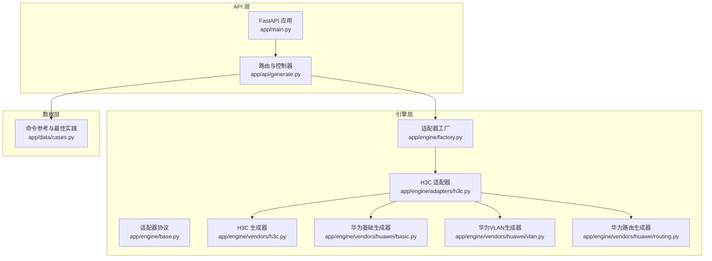
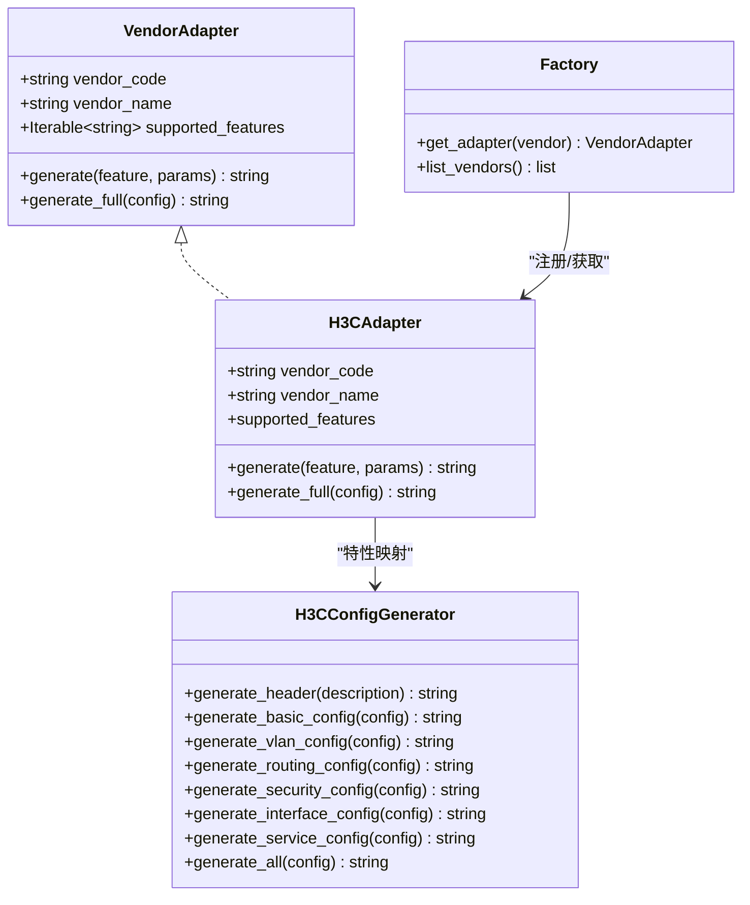
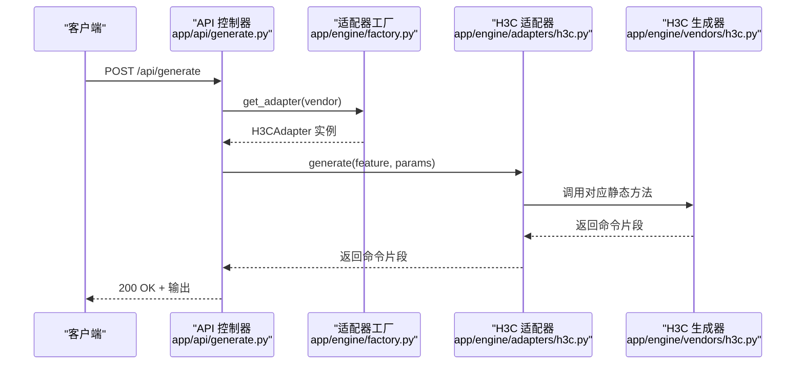
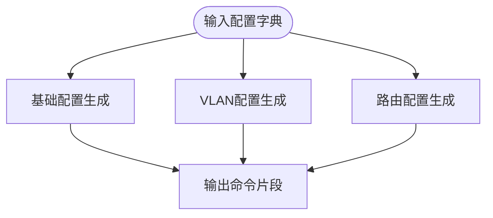
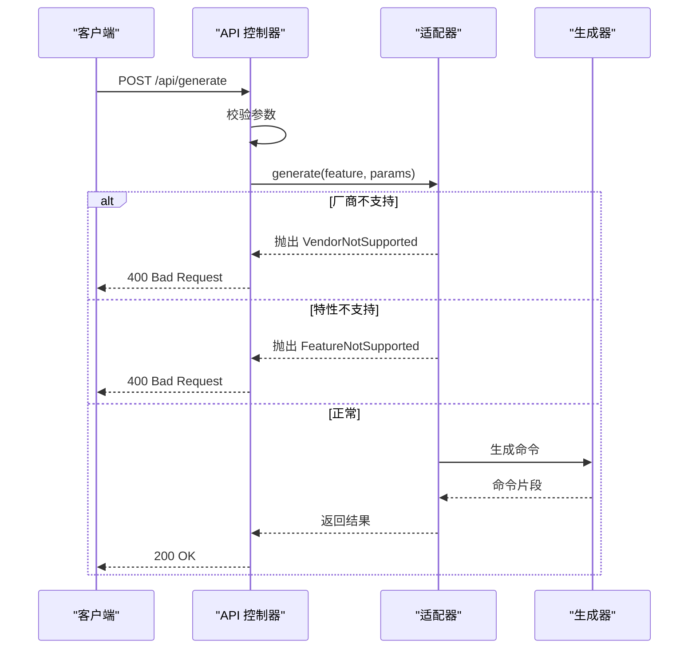
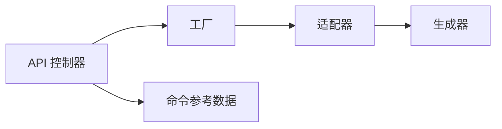

# 厂商配置生成器

<cite>
**本文引用的文件**
- [api/README.md](file://api/README.md)
- [api/app/main.py](file://api/app/main.py)
- [api/app/api/generate.py](file://api/app/api/generate.py)
- [api/app/engine/base.py](file://api/app/engine/base.py)
- [api/app/engine/factory.py](file://api/app/engine/factory.py)
- [api/app/engine/adapters/h3c.py](file://api/app/engine/adapters/h3c.py)
- [api/app/engine/vendors/h3c.py](file://api/app/engine/vendors/h3c.py)
- [api/app/engine/vendors/huawei/basic.py](file://api/app/engine/vendors/huawei/basic.py)
- [api/app/engine/vendors/huawei/vlan.py](file://api/app/engine/vendors/huawei/vlan.py)
- [api/app/engine/vendors/huawei/routing.py](file://api/app/engine/vendors/huawei/routing.py)
- [api/app/data/cases.py](file://api/app/data/cases.py)
</cite>

## 目录
1. [简介](#简介)
2. [项目结构](#项目结构)
3. [核心组件](#核心组件)
4. [架构总览](#架构总览)
5. [详细组件分析](#详细组件分析)
6. [依赖分析](#依赖分析)
7. [性能考虑](#性能考虑)
8. [故障排查指南](#故障排查指南)
9. [结论](#结论)
10. [附录](#附录)

## 简介
本项目为“厂商配置生成器”，提供多厂商网络设备命令生成能力，覆盖基础配置、VLAN、路由、安全、接口、服务等特性。系统采用统一适配器协议与工厂模式，支持按特性或完整配置生成命令脚本，便于网络工程师快速生成标准化配置。

## 项目结构
- 后端服务基于 FastAPI，提供 REST API。
- 引擎层包含适配器与厂商生成器，适配器负责特性码到生成器方法的映射，生成器负责将配置字典转换为设备命令。
- 数据层包含命令参考手册与最佳实践，用于前端展示与校验参考。

**图表来源**
- [api/app/main.py:1-29](file://api/app/main.py#L1-L29)
- [api/app/api/generate.py:1-77](file://api/app/api/generate.py#L1-L77)
- [api/app/engine/base.py:1-36](file://api/app/engine/base.py#L1-L36)
- [api/app/engine/factory.py:1-39](file://api/app/engine/factory.py#L1-L39)
- [api/app/engine/adapters/h3c.py:1-42](file://api/app/engine/adapters/h3c.py#L1-L42)
- [api/app/engine/vendors/h3c.py:1-594](file://api/app/engine/vendors/h3c.py#L1-L594)
- [api/app/engine/vendors/huawei/basic.py:1-359](file://api/app/engine/vendors/huawei/basic.py#L1-L359)
- [api/app/engine/vendors/huawei/vlan.py:1-175](file://api/app/engine/vendors/huawei/vlan.py#L1-L175)
- [api/app/engine/vendors/huawei/routing.py:1-213](file://api/app/engine/vendors/huawei/routing.py#L1-L213)
- [api/app/data/cases.py:1-377](file://api/app/data/cases.py#L1-L377)

**章节来源**
- [api/README.md:1-47](file://api/README.md#L1-L47)
- [api/app/main.py:1-29](file://api/app/main.py#L1-L29)
- [api/app/api/generate.py:1-77](file://api/app/api/generate.py#L1-L77)
- [api/app/engine/base.py:1-36](file://api/app/engine/base.py#L1-L36)
- [api/app/engine/factory.py:1-39](file://api/app/engine/factory.py#L1-L39)
- [api/app/engine/adapters/h3c.py:1-42](file://api/app/engine/adapters/h3c.py#L1-L42)
- [api/app/engine/vendors/h3c.py:1-594](file://api/app/engine/vendors/h3c.py#L1-L594)
- [api/app/engine/vendors/huawei/basic.py:1-359](file://api/app/engine/vendors/huawei/basic.py#L1-L359)
- [api/app/engine/vendors/huawei/vlan.py:1-175](file://api/app/engine/vendors/huawei/vlan.py#L1-L175)
- [api/app/engine/vendors/huawei/routing.py:1-213](file://api/app/engine/vendors/huawei/routing.py#L1-L213)
- [api/app/data/cases.py:1-377](file://api/app/data/cases.py#L1-L377)

## 核心组件
- 适配器协议：定义厂商适配器必须实现的接口，包括厂商代码、名称、支持特性集合以及单特性生成与完整配置生成方法。
- 适配器工厂：根据厂商代码返回对应适配器实例，未注册厂商抛出异常。
- H3C 适配器：将特性码映射到 H3CConfigGenerator 的静态方法，支持基础、VLAN、路由、安全、接口、服务等特性。
- H3C 生成器：实现完整的配置生成逻辑，包括头部注释、基础配置、VLAN、路由、安全、接口、服务等模块化生成方法。
- 华为生成器（复用自 NetOps-toolkit）：提供基础配置、VLAN、路由等生成器，作为 H3C 适配器的补充能力。
- API 控制器：提供 /api/generate、/api/generate/full、/api/vendors 等接口，负责参数校验、异常处理与响应封装。

**章节来源**
- [api/app/engine/base.py:1-36](file://api/app/engine/base.py#L1-L36)
- [api/app/engine/factory.py:1-39](file://api/app/engine/factory.py#L1-L39)
- [api/app/engine/adapters/h3c.py:1-42](file://api/app/engine/adapters/h3c.py#L1-L42)
- [api/app/engine/vendors/h3c.py:1-594](file://api/app/engine/vendors/h3c.py#L1-L594)
- [api/app/engine/vendors/huawei/basic.py:1-359](file://api/app/engine/vendors/huawei/basic.py#L1-L359)
- [api/app/engine/vendors/huawei/vlan.py:1-175](file://api/app/engine/vendors/huawei/vlan.py#L1-L175)
- [api/app/engine/vendors/huawei/routing.py:1-213](file://api/app/engine/vendors/huawei/routing.py#L1-L213)
- [api/app/api/generate.py:1-77](file://api/app/api/generate.py#L1-L77)

## 架构总览
系统采用“协议 + 工厂 + 适配器 + 生成器”的分层架构：
- 协议层：统一 VendorAdapter 接口，保证不同厂商适配器的一致性。
- 工厂层：集中管理适配器注册与获取，支持扩展新厂商。
- 适配器层：将特性码映射到具体生成器方法，屏蔽厂商差异。
- 生成器层：实现各厂商的命令生成逻辑，支持模块化与组合式生成。
- API 层：对外暴露 REST 接口，负责请求解析、异常处理与响应。

**图表来源**
- [api/app/engine/base.py:11-36](file://api/app/engine/base.py#L11-L36)
- [api/app/engine/factory.py:20-39](file://api/app/engine/factory.py#L20-L39)
- [api/app/engine/adapters/h3c.py:14-42](file://api/app/engine/adapters/h3c.py#L14-L42)
- [api/app/engine/vendors/h3c.py:11-594](file://api/app/engine/vendors/h3c.py#L11-L594)

## 详细组件分析

### H3C 适配器与生成器
- 适配器职责
  - 维护特性码到生成器方法的映射表。
  - 提供 generate 与 generate_full 方法，分别生成单特性命令片段与完整配置脚本。
- 生成器职责
  - 生成头部注释与各模块配置。
  - 支持基础配置（主机名、密码、管理接口、SSH/Telnet、用户）、VLAN（批量VLAN、Access/Trunk/Hybrid、VLANIF、STP）、路由（静态、默认、OSPF、BGP）、安全（ACL、端口安全、MAC绑定、ARP防护）、接口（Eth-Trunk、LLDP、速率限制）、服务（NTP、SNMP、日志）。
- 参数与命令格式
  - 基础配置：主机名、密码（明文/密文）、管理接口（接口、IP、掩码、网关）、SSH/Telnet、用户（用户名、密码、权限级别、服务类型）。
  - VLAN：VLAN 列表、接口 VLAN 配置（Access/Trunk/Hybrid）、VLANIF（IP/Mask/描述）、STP（模式、优先级、启用）。
  - 路由：静态路由（目的、掩码、下一跳/接口、优先级）、默认路由、OSPF（进程号、Router-ID、区域、网络）、BGP（AS、Router-ID、邻居、网络宣告）。
  - 安全：ACL（编号、类型、规则）、端口安全（最大MAC数、违规动作）、MAC绑定、ARP防护（静态条目）。
  - 接口：Eth-Trunk（聚合组、模式、成员、允许VLAN）、LLDP、速率限制（CIR/CBS）。
  - 服务：NTP（服务器、时区、优选）、SNMP（版本、团体、陷阱）、日志（主机、级别）。
- 使用场景
  - 自动化部署：通过 generate_full 生成完整脚本，减少手工配置错误。
  - 运维变更：通过 generate 生成特定特性命令片段，快速叠加到现有配置。
  - 标准化：统一参数结构与命令格式，提升配置一致性。

**图表来源**
- [api/app/api/generate.py:53-64](file://api/app/api/generate.py#L53-L64)
- [api/app/engine/factory.py:20-26](file://api/app/engine/factory.py#L20-L26)
- [api/app/engine/adapters/h3c.py:32-38](file://api/app/engine/adapters/h3c.py#L32-L38)
- [api/app/engine/vendors/h3c.py:26-125](file://api/app/engine/vendors/h3c.py#L26-L125)

**章节来源**
- [api/app/engine/adapters/h3c.py:1-42](file://api/app/engine/adapters/h3c.py#L1-L42)
- [api/app/engine/vendors/h3c.py:1-594](file://api/app/engine/vendors/h3c.py#L1-L594)

### 华为生成器（复用自 NetOps-toolkit）
- 基础配置生成器：支持主机名、密码、SSH/Telnet、Console、Banner、AAA 用户、NTP、SNMP、日志、管理接口、DHCP、DNS 等。
- VLAN 生成器：支持批量 VLAN、单个 VLAN、接口 VLAN（Access/Trunk/Hybrid/Voice）、VLANIF、Voice VLAN、STP。
- 路由生成器：支持静态路由、默认路由、OSPF（进程、Router-ID、区域、网络/接口、缺省开销）、BGP（AS、Router-ID、对等体组、网络宣告、导入路由）、RIP。
- 作用：作为 H3C 适配器的补充能力，提供更丰富的华为特性生成逻辑。

**图表来源**
- [api/app/engine/vendors/huawei/basic.py:250-359](file://api/app/engine/vendors/huawei/basic.py#L250-L359)
- [api/app/engine/vendors/huawei/vlan.py:117-175](file://api/app/engine/vendors/huawei/vlan.py#L117-L175)
- [api/app/engine/vendors/huawei/routing.py:150-213](file://api/app/engine/vendors/huawei/routing.py#L150-L213)

**章节来源**
- [api/app/engine/vendors/huawei/basic.py:1-359](file://api/app/engine/vendors/huawei/basic.py#L1-L359)
- [api/app/engine/vendors/huawei/vlan.py:1-175](file://api/app/engine/vendors/huawei/vlan.py#L1-L175)
- [api/app/engine/vendors/huawei/routing.py:1-213](file://api/app/engine/vendors/huawei/routing.py#L1-L213)

### API 控制器与错误处理
- 接口说明
  - GET /api/vendors：返回已支持厂商列表（含特性码）。
  - POST /api/generate：按厂商 + 特性 + 参数生成单特性命令片段。
  - POST /api/generate/full：按厂商 + 完整配置生成完整脚本。
- 错误处理
  - 未支持厂商：抛出 VendorNotSupported，HTTP 400。
  - 未支持特性：抛出 FeatureNotSupported，HTTP 400。
  - 其他异常：捕获并返回 HTTP 500。
- 参数模型
  - GenerateRequest：vendor、feature、params。
  - GenerateFullRequest：vendor、config。
  - GenerateResponse：vendor、feature（可空）、output。

**图表来源**
- [api/app/api/generate.py:53-77](file://api/app/api/generate.py#L53-L77)
- [api/app/engine/base.py:30-36](file://api/app/engine/base.py#L30-L36)

**章节来源**
- [api/app/api/generate.py:1-77](file://api/app/api/generate.py#L1-L77)
- [api/app/engine/base.py:1-36](file://api/app/engine/base.py#L1-L36)

## 依赖分析
- 组件耦合
  - API 控制器依赖工厂与适配器协议，解耦厂商实现。
  - H3C 适配器依赖 H3CConfigGenerator 与华为生成器（作为补充）。
  - 工厂集中管理适配器注册，便于扩展新厂商。
- 外部依赖
  - FastAPI：提供 Web 服务与路由。
  - Pydantic：提供请求参数模型与校验。
- 循环依赖
  - 未发现循环依赖，模块职责清晰。

**图表来源**
- [api/app/api/generate.py:15-16](file://api/app/api/generate.py#L15-L16)
- [api/app/engine/factory.py:11-12](file://api/app/engine/factory.py#L11-L12)
- [api/app/engine/adapters/h3c.py:11](file://api/app/engine/adapters/h3c.py#L11)
- [api/app/data/cases.py:7-324](file://api/app/data/cases.py#L7-L324)

**章节来源**
- [api/app/api/generate.py:1-77](file://api/app/api/generate.py#L1-L77)
- [api/app/engine/factory.py:1-39](file://api/app/engine/factory.py#L1-L39)
- [api/app/data/cases.py:1-377](file://api/app/data/cases.py#L1-L377)

## 性能考虑
- 生成器内部使用字符串拼接与列表收集，时间复杂度主要取决于配置项数量，整体为 O(N)。
- 批量 VLAN 生成采用区间压缩算法，减少命令长度与执行时间。
- 建议
  - 对大规模配置，优先使用 generate_full 一次性生成，避免多次往返。
  - 合理拆分配置字典，减少单次生成的参数体量。
  - 在前端缓存厂商与特性列表，降低重复查询成本。

## 故障排查指南
- 常见错误
  - 厂商不支持：确认 vendor 是否在已注册列表中。
  - 特性不支持：确认 feature 是否在 supported_features 中。
  - 参数缺失：检查 params 或 config 的字段是否齐全。
- 排查步骤
  - 使用 GET /api/vendors 获取厂商与特性列表。
  - 使用最小化配置进行单特性测试，逐步增加复杂度。
  - 查看 API 返回的错误详情，定位具体异常类型。
- 参考资源
  - 命令参考手册与最佳实践可用于核对命令格式与安全基线。

**章节来源**
- [api/app/api/generate.py:48-77](file://api/app/api/generate.py#L48-L77)
- [api/app/data/cases.py:327-377](file://api/app/data/cases.py#L327-L377)

## 结论
本项目通过统一协议与工厂模式，实现了多厂商配置生成的标准化与可扩展性。H3C 适配器与生成器覆盖基础、VLAN、路由、安全、接口、服务等关键特性，结合华为生成器的能力，满足主流网络设备的配置需求。配合命令参考与最佳实践，有助于提升配置质量与运维效率。

## 附录

### 命令参考与最佳实践
- 命令参考手册涵盖华为、H3C、锐捷、迈普的常用命令与示例，便于对照与校验。
- 最佳实践提供安全基线、网络设计与运维管理建议，指导标准化配置。

**章节来源**
- [api/app/data/cases.py:7-377](file://api/app/data/cases.py#L7-L377)