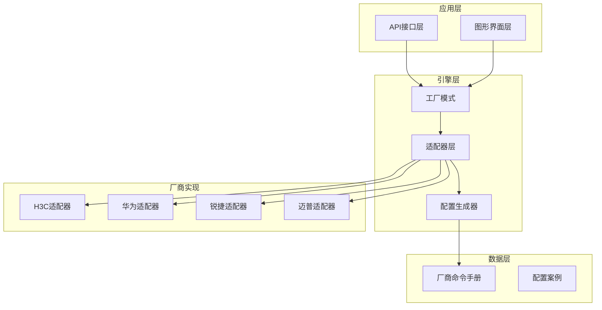
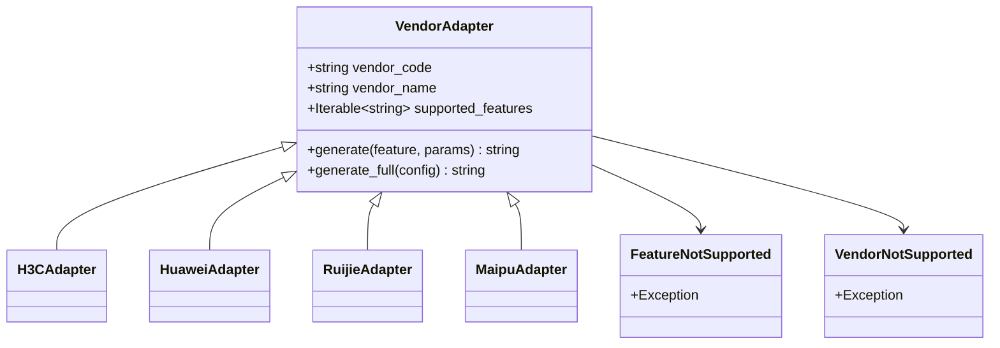
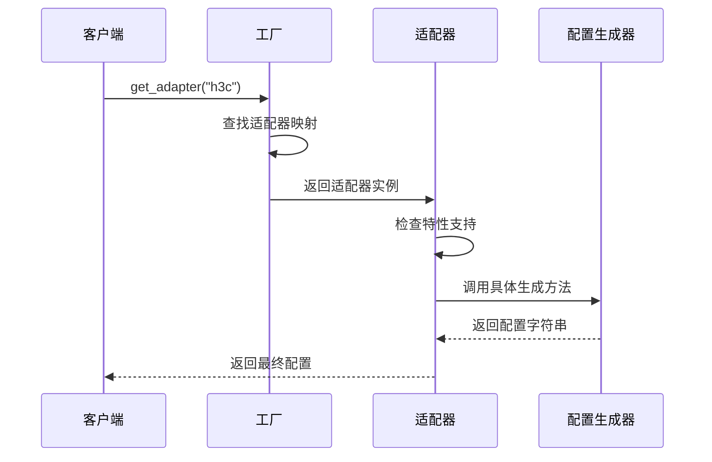
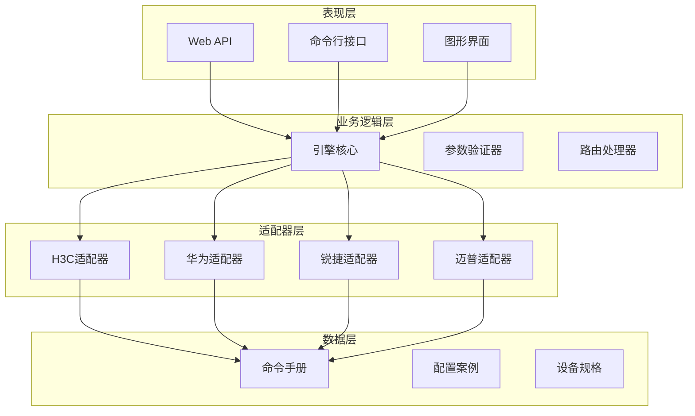
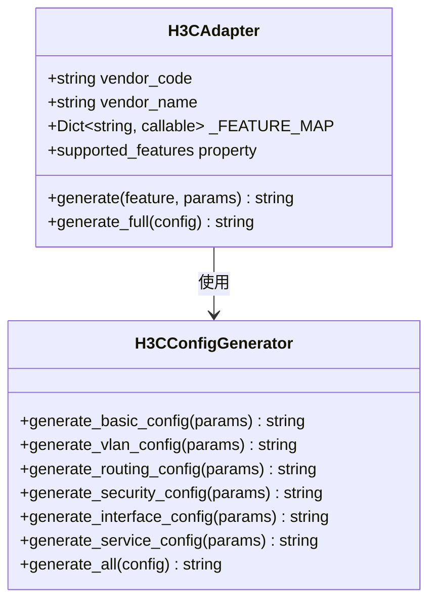
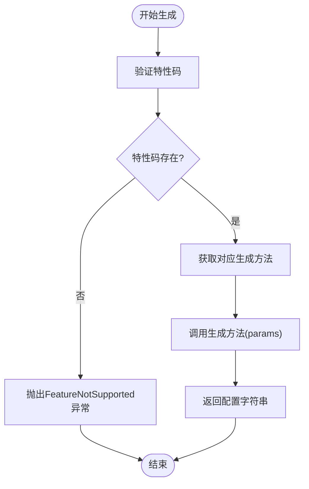
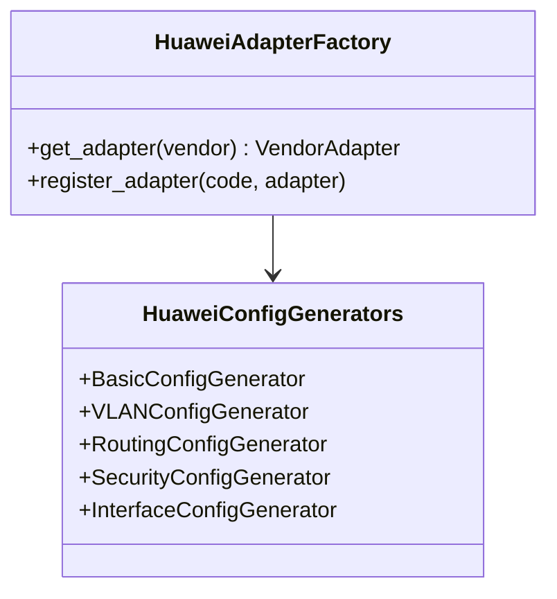
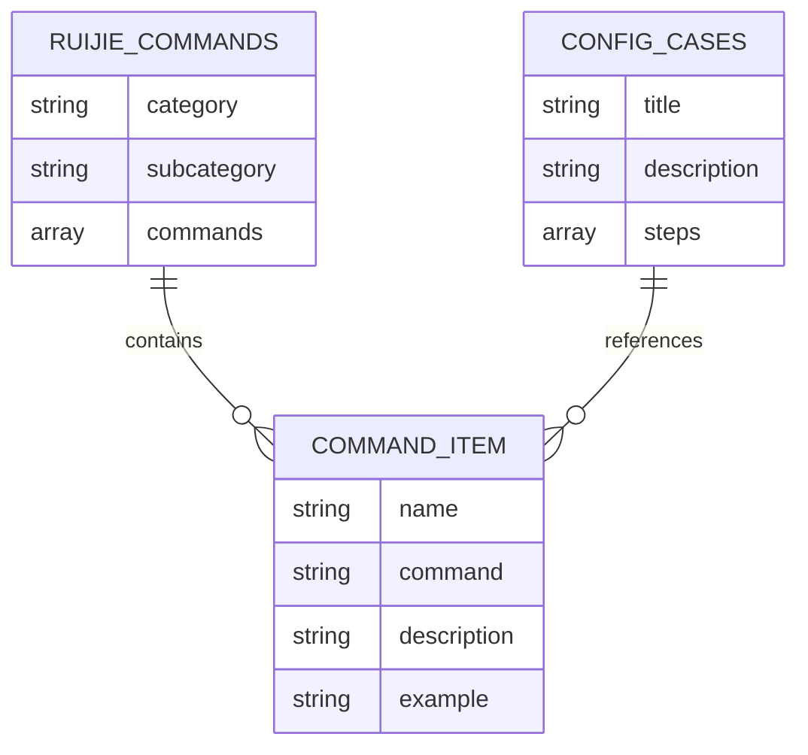
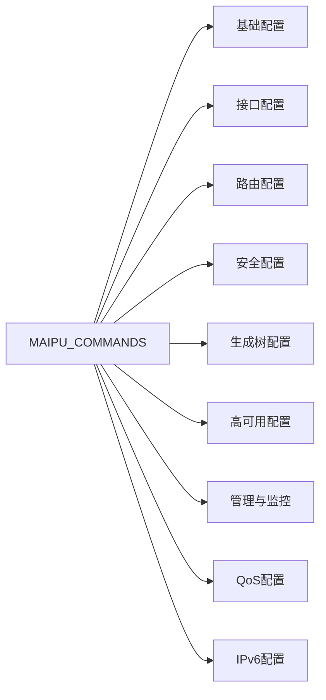
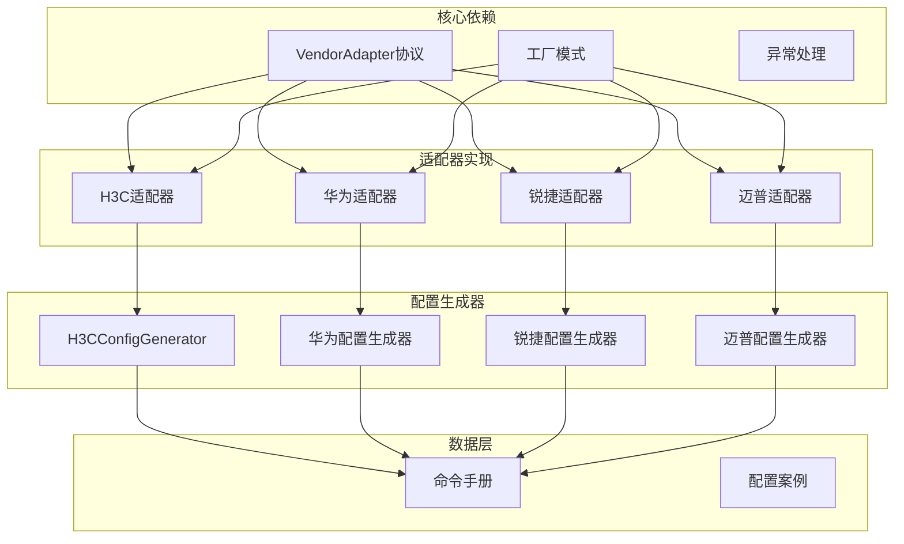

# 厂商适配器实现

<cite>
**本文档引用的文件**
- [h3c.py](file://api/app/engine/adapters/h3c.py)
- [base.py](file://api/app/engine/base.py)
- [factory.py](file://api/app/engine/factory.py)
- [h3c.py](file://api/app/data/manual/h3c.py)
- [huawei.py](file://api/app/data/manual/huawei.py)
- [ruijie.py](file://api/app/engine/vendors/ruijie.py)
- [maipu.py](file://api/app/data/manual/maipu.py)
- [huawei_basic.py](file://api/app/engine/vendors/huawei/basic.py)
</cite>

## 目录
1. [简介](#简介)
2. [项目结构](#项目结构)
3. [核心组件](#核心组件)
4. [架构概览](#架构概览)
5. [详细组件分析](#详细组件分析)
6. [依赖关系分析](#依赖关系分析)
7. [性能考虑](#性能考虑)
8. [故障排除指南](#故障排除指南)
9. [结论](#结论)

## 简介

本文档深入分析了网络设备厂商适配器的实现架构，重点阐述了H3C适配器的完整实现以及华为、锐捷、迈普适配器的扩展方法。该系统采用统一的适配器模式，通过工厂模式管理不同厂商的适配器实例，实现了厂商无关的配置生成能力。

系统的核心设计理念是将厂商特定的命令生成逻辑与通用的适配器框架分离，使得新增厂商适配器变得简单而标准化。每个厂商适配器都遵循统一的接口规范，确保了系统的可扩展性和维护性。

## 项目结构

项目采用分层架构设计，主要分为以下几个层次：



**图表来源**
- [factory.py:1-39](file://api/app/engine/factory.py#L1-L39)
- [h3c.py:1-42](file://api/app/engine/adapters/h3c.py#L1-L42)

**章节来源**
- [factory.py:1-39](file://api/app/engine/factory.py#L1-L39)
- [base.py:1-36](file://api/app/engine/base.py#L1-L36)

## 核心组件

### 适配器协议定义

系统定义了统一的厂商适配器协议，确保所有厂商适配器都遵循相同的标准接口：



**图表来源**
- [base.py:11-36](file://api/app/engine/base.py#L11-L36)

### 工厂模式实现

工厂模式负责管理所有厂商适配器的生命周期和实例化：



**图表来源**
- [factory.py:20-26](file://api/app/engine/factory.py#L20-L26)
- [h3c.py:32-38](file://api/app/engine/adapters/h3c.py#L32-L38)

**章节来源**
- [base.py:11-36](file://api/app/engine/base.py#L11-L36)
- [factory.py:14-26](file://api/app/engine/factory.py#L14-L26)

## 架构概览

系统采用分层架构，每层都有明确的职责分工：



**图表来源**
- [factory.py:15-17](file://api/app/engine/factory.py#L15-L17)
- [h3c.py:14-26](file://api/app/engine/adapters/h3c.py#L14-L26)

## 详细组件分析

### H3C适配器实现

H3C适配器是系统中最完整的实现，展示了适配器模式的最佳实践：

#### 核心实现分析



**图表来源**
- [h3c.py:14-42](file://api/app/engine/adapters/h3c.py#L14-L42)

#### 特性映射机制

H3C适配器通过特性码到方法的映射实现了高度的模块化：

| 特性码 | 对应方法 | 功能描述 |
|--------|----------|----------|
| basic | generate_basic_config | 基础配置生成 |
| vlan | generate_vlan_config | VLAN配置生成 |
| routing | generate_routing_config | 路由配置生成 |
| security | generate_security_config | 安全配置生成 |
| interface | generate_interface_config | 接口配置生成 |
| service | generate_service_config | 服务配置生成 |

#### 参数处理流程



**图表来源**
- [h3c.py:32-38](file://api/app/engine/adapters/h3c.py#L32-L38)

**章节来源**
- [h3c.py:14-42](file://api/app/engine/adapters/h3c.py#L14-L42)

### 华为适配器扩展

华为适配器展示了如何扩展新的厂商适配器：

#### 配置生成器架构

华为采用了更复杂的配置生成器架构，将不同类型的配置分离到专门的生成器类中：



**图表来源**
- [huawei_basic.py:8-359](file://api/app/engine/vendors/huawei/basic.py#L8-L359)

#### 扩展方法

新增华为适配器的关键步骤：

1. **创建配置生成器**：实现华为特有的配置生成逻辑
2. **实现适配器类**：继承VendorAdapter协议
3. **注册到工厂**：在工厂中注册新的适配器
4. **测试验证**：确保配置生成的正确性

**章节来源**
- [huawei_basic.py:1-359](file://api/app/engine/vendors/huawei/basic.py#L1-L359)

### 锐捷适配器实现

锐捷适配器提供了完整的命令手册和配置案例：

#### 命令手册结构

锐捷的命令手册采用了层次化的数据结构：



**图表来源**
- [ruijie.py:16-342](file://api/app/engine/vendors/ruijie.py#L16-L342)

#### 配置案例管理

锐捷提供了丰富的配置案例，涵盖了常见的网络场景：

| 场景类型 | 配置案例数量 | 复杂度等级 |
|----------|-------------|------------|
| 基础配置 | 5个 | 简单 |
| VLAN配置 | 3个 | 中等 |
| 路由配置 | 4个 | 中等 |
| 安全配置 | 6个 | 高复杂度 |
| 高可用配置 | 4个 | 高复杂度 |

**章节来源**
- [ruijie.py:16-342](file://api/app/engine/vendors/ruijie.py#L16-L342)

### 迈普适配器实现

迈普适配器展示了另一种配置生成方式：

#### 命令手册格式

迈普采用了更加简洁的命令手册格式：



**图表来源**
- [maipu.py:16-328](file://api/app/data/manual/maipu.py#L16-L328)

**章节来源**
- [maipu.py:16-328](file://api/app/data/manual/maipu.py#L16-L328)

## 依赖关系分析

系统中的依赖关系相对清晰，主要围绕适配器模式展开：



**图表来源**
- [factory.py:11-17](file://api/app/engine/factory.py#L11-L17)
- [h3c.py:10-11](file://api/app/engine/adapters/h3c.py#L10-L11)

**章节来源**
- [factory.py:11-17](file://api/app/engine/factory.py#L11-L17)
- [h3c.py:10-11](file://api/app/engine/adapters/h3c.py#L10-L11)

## 性能考虑

### 内存优化策略

系统采用了单例模式来管理适配器实例，避免重复创建带来的内存开销：

```python
# 工厂中的单例字典
_ADAPTERS: Dict[str, VendorAdapter] = {
    H3CAdapter.vendor_code: H3CAdapter(),  # 单例实例
}
```

### 并发处理

由于适配器都是无状态对象，可以安全地在多线程环境中共享使用：

```python
# 适配器的无状态特性
class H3CAdapter:
    # 所有属性都是类级别的常量
    vendor_code = "h3c"
    vendor_name = "华三 H3C"
    # 实例方法都是纯函数式操作
```

### 缓存机制

对于频繁使用的配置生成结果，可以考虑实现缓存机制来提升性能。

## 故障排除指南

### 常见问题及解决方案

#### 1. 厂商不支持错误

**错误信息**：`VendorNotSupported: 暂不支持厂商 'xxx'`

**解决方法**：
- 检查厂商代码是否正确
- 确认适配器已在工厂中注册
- 验证厂商代码的大小写

#### 2. 特性不支持错误

**错误信息**：`FeatureNotSupported: H3C 暂不支持特性 'xxx'`

**解决方法**：
- 检查特性码是否正确
- 确认特性是否在支持列表中
- 验证参数格式是否正确

#### 3. 配置生成异常

**排查步骤**：
1. 验证输入参数的完整性
2. 检查命令手册中的命令格式
3. 确认配置生成器的逻辑正确性

**章节来源**
- [base.py:30-36](file://api/app/engine/base.py#L30-L36)
- [factory.py:22-25](file://api/app/engine/factory.py#L22-L25)

## 结论

该厂商适配器实现展现了良好的软件工程实践，通过统一的适配器模式和工厂模式，成功地将厂商特定的实现细节与通用的业务逻辑分离。H3C适配器作为完整的实现案例，展示了从特性映射到参数处理的完整流程。

系统的主要优势包括：

1. **高度可扩展性**：新增厂商适配器只需实现少量接口
2. **统一的编程模型**：所有厂商适配器遵循相同的协议
3. **清晰的职责分离**：适配器层与配置生成器层职责明确
4. **完善的错误处理**：提供了详细的异常信息和处理机制

对于未来的扩展，建议重点关注：

1. **配置生成器的模块化**：进一步细化配置生成器的功能划分
2. **测试覆盖率**：增加针对不同厂商适配器的单元测试
3. **性能监控**：添加适配器性能指标的收集和分析
4. **配置验证**：实现生成配置的语法和语义验证

通过这些改进，系统将能够更好地支持更多的网络设备厂商，为用户提供更加稳定和高效的配置生成功能。