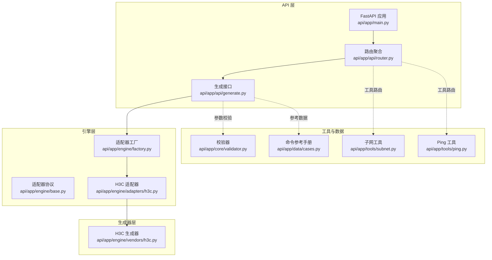
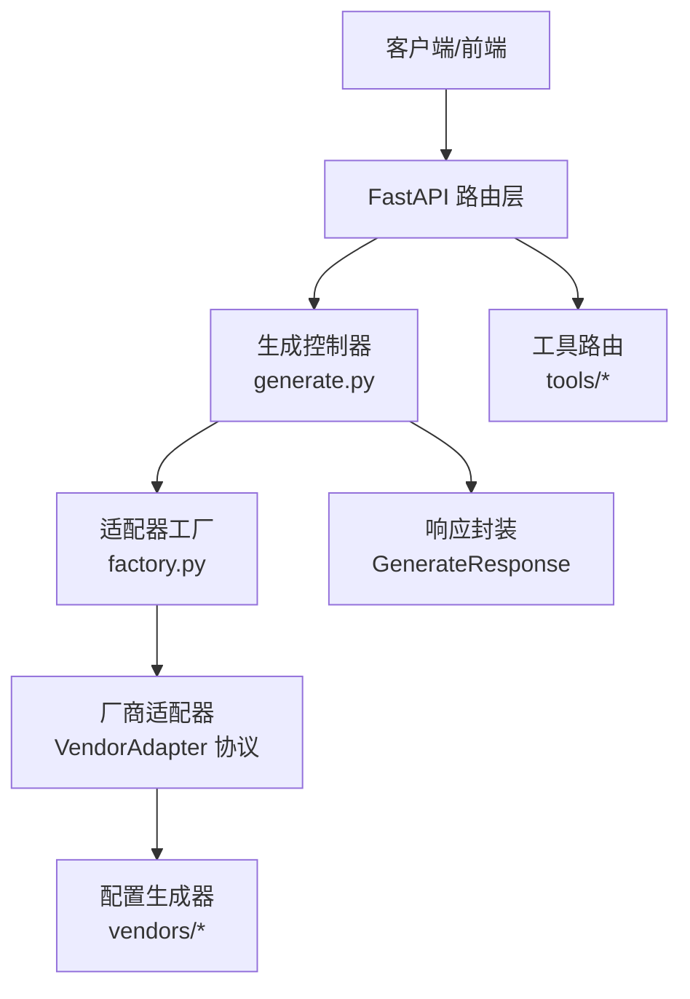
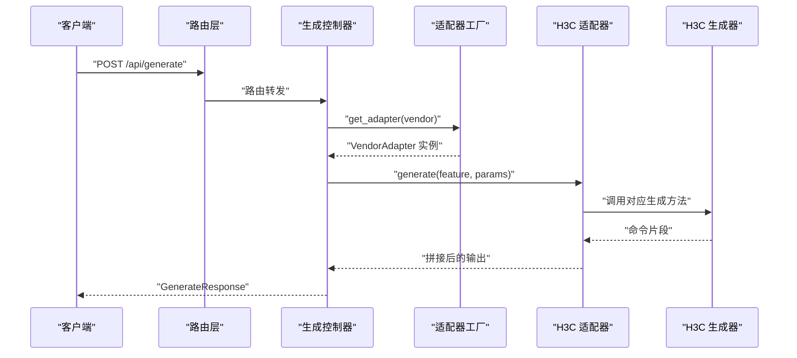
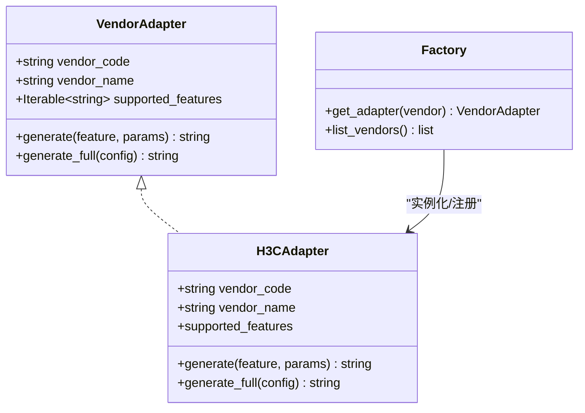
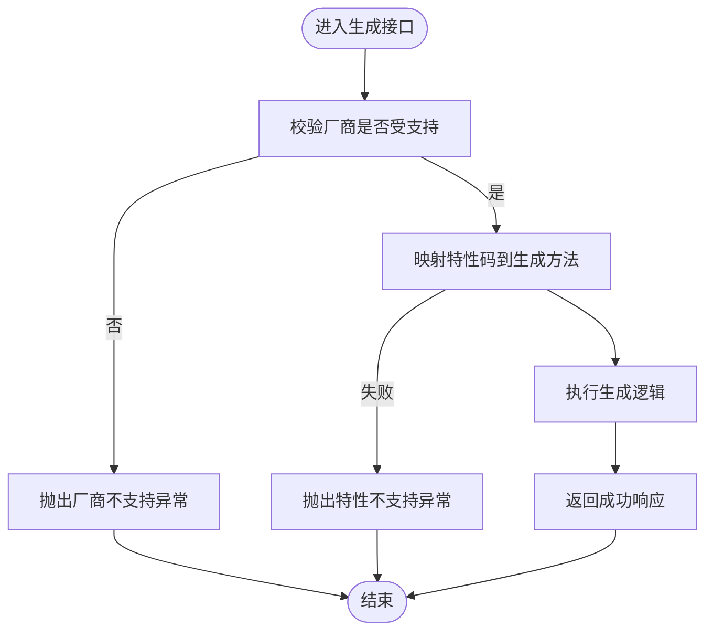
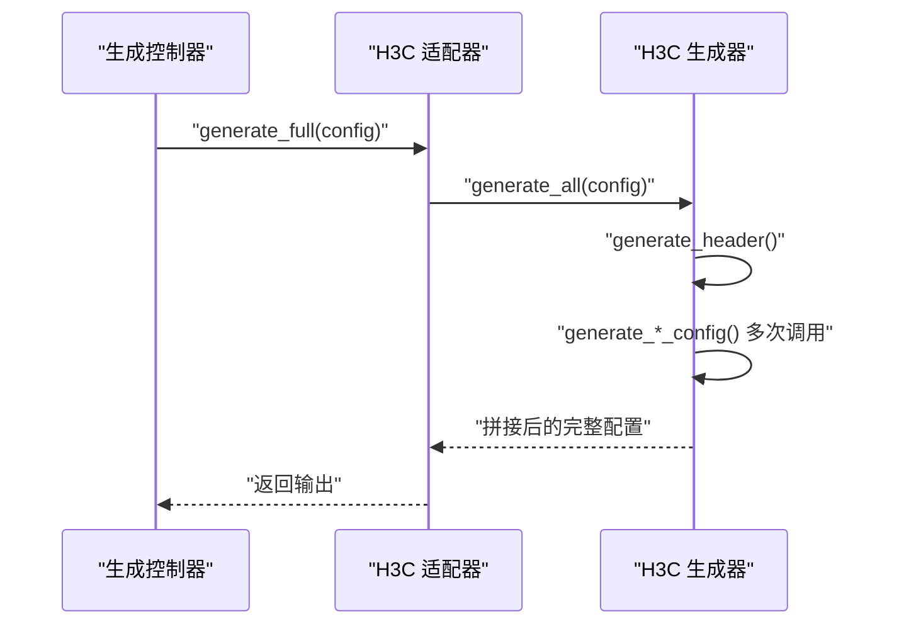
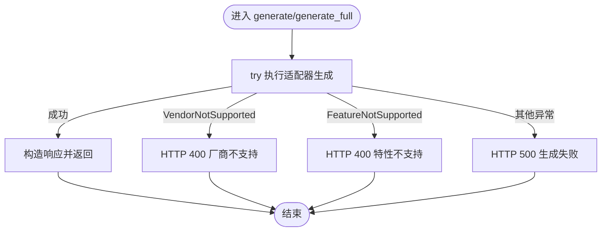
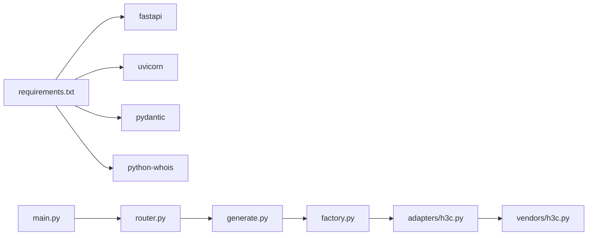

# 命令生成工作流程

<cite>
**本文引用的文件**
- [api/app/main.py](file://api/app/main.py)
- [api/app/api/router.py](file://api/app/api/router.py)
- [api/app/api/generate.py](file://api/app/api/generate.py)
- [api/app/engine/base.py](file://api/app/engine/base.py)
- [api/app/engine/factory.py](file://api/app/engine/factory.py)
- [api/app/engine/adapters/h3c.py](file://api/app/engine/adapters/h3c.py)
- [api/app/engine/vendors/h3c.py](file://api/app/engine/vendors/h3c.py)
- [api/app/core/validator.py](file://api/app/core/validator.py)
- [api/app/data/cases.py](file://api/app/data/cases.py)
- [api/app/tools/subnet.py](file://api/app/tools/subnet.py)
- [api/app/tools/ping.py](file://api/app/tools/ping.py)
- [api/README.md](file://api/README.md)
- [api/requirements.txt](file://api/requirements.txt)
</cite>

## 目录
1. [简介](#简介)
2. [项目结构](#项目结构)
3. [核心组件](#核心组件)
4. [架构总览](#架构总览)
5. [详细组件分析](#详细组件分析)
6. [依赖分析](#依赖分析)
7. [性能考虑](#性能考虑)
8. [故障排查指南](#故障排查指南)
9. [结论](#结论)
10. [附录](#附录)

## 简介
本文件面向“命令生成工作流程”的技术文档，系统化阐述从请求接收到命令输出的完整链路，覆盖请求解析、适配器选择、参数验证、命令生成与结果返回等环节。文档同时解释并发处理、缓存策略与性能优化建议，并提供流程图与时序图帮助理解与优化。

## 项目结构
后端采用 FastAPI 架构，按职责分层组织：
- 路由层：定义 API 路由与聚合
- 控制器层：处理请求模型、异常与响应封装
- 引擎层：适配器工厂与厂商适配器协议
- 生成器层：各厂商的配置生成器（来自 NetOps-toolkit）
- 工具层：网络工具（子网、Ping 等）
- 数据层：命令参考手册与最佳实践

图表来源
- [api/app/main.py:1-29](file://api/app/main.py#L1-L29)
- [api/app/api/router.py:1-10](file://api/app/api/router.py#L1-L10)
- [api/app/api/generate.py:1-77](file://api/app/api/generate.py#L1-L77)
- [api/app/engine/base.py:1-36](file://api/app/engine/base.py#L1-L36)
- [api/app/engine/factory.py:1-39](file://api/app/engine/factory.py#L1-L39)
- [api/app/engine/adapters/h3c.py:1-42](file://api/app/engine/adapters/h3c.py#L1-L42)
- [api/app/engine/vendors/h3c.py:1-594](file://api/app/engine/vendors/h3c.py#L1-L594)
- [api/app/core/validator.py:1-208](file://api/app/core/validator.py#L1-L208)
- [api/app/data/cases.py:1-377](file://api/app/data/cases.py#L1-L377)
- [api/app/tools/subnet.py:1-280](file://api/app/tools/subnet.py#L1-L280)
- [api/app/tools/ping.py:1-241](file://api/app/tools/ping.py#L1-L241)

章节来源
- [api/README.md:1-47](file://api/README.md#L1-L47)
- [api/requirements.txt:1-5](file://api/requirements.txt#L1-L5)

## 核心组件
- FastAPI 应用与中间件：提供 CORS 支持与健康检查端点
- 路由聚合：统一挂载生成与工具子路由
- 生成接口：定义请求/响应模型，封装异常与返回
- 适配器协议：统一厂商适配器接口，便于扩展
- 适配器工厂：集中注册与获取适配器实例
- H3C 适配器：将特性码映射到具体生成方法
- H3C 生成器：实现各类配置段的命令生成逻辑
- 校验器：提供网络与配置参数的基础校验能力
- 命令参考手册：提供厂商特性命令参考与最佳实践
- 网络工具：子网计算、Ping 扫描等辅助能力

章节来源
- [api/app/main.py:1-29](file://api/app/main.py#L1-L29)
- [api/app/api/router.py:1-10](file://api/app/api/router.py#L1-L10)
- [api/app/api/generate.py:1-77](file://api/app/api/generate.py#L1-L77)
- [api/app/engine/base.py:1-36](file://api/app/engine/base.py#L1-L36)
- [api/app/engine/factory.py:1-39](file://api/app/engine/factory.py#L1-L39)
- [api/app/engine/adapters/h3c.py:1-42](file://api/app/engine/adapters/h3c.py#L1-L42)
- [api/app/engine/vendors/h3c.py:1-594](file://api/app/engine/vendors/h3c.py#L1-L594)
- [api/app/core/validator.py:1-208](file://api/app/core/validator.py#L1-L208)
- [api/app/data/cases.py:1-377](file://api/app/data/cases.py#L1-L377)
- [api/app/tools/subnet.py:1-280](file://api/app/tools/subnet.py#L1-L280)
- [api/app/tools/ping.py:1-241](file://api/app/tools/ping.py#L1-L241)

## 架构总览
整体采用“路由层-控制器层-引擎层-生成器层”的分层架构，通过适配器工厂实现厂商扩展点，生成器层复用自 NetOps-toolkit，确保一致性与可维护性。

图表来源
- [api/app/api/generate.py:53-76](file://api/app/api/generate.py#L53-L76)
- [api/app/engine/factory.py:20-26](file://api/app/engine/factory.py#L20-L26)
- [api/app/engine/base.py:19-27](file://api/app/engine/base.py#L19-L27)

## 详细组件分析

### 请求解析与路由
- 路由聚合：将生成与工具路由统一挂载至 /api 前缀
- 生成接口：
  - GET /api/vendors：返回已注册厂商列表（含特性码）
  - POST /api/generate：生成单特性命令片段
  - POST /api/generate/full：生成完整配置脚本
- 请求模型：
  - GenerateRequest：vendor、feature、params
  - GenerateFullRequest：vendor、config
  - GenerateResponse：vendor、feature（可选）、output

图表来源
- [api/app/api/router.py:8-9](file://api/app/api/router.py#L8-L9)
- [api/app/api/generate.py:53-64](file://api/app/api/generate.py#L53-L64)
- [api/app/engine/factory.py:20-26](file://api/app/engine/factory.py#L20-L26)
- [api/app/engine/adapters/h3c.py:32-38](file://api/app/engine/adapters/h3c.py#L32-L38)
- [api/app/engine/vendors/h3c.py:26-125](file://api/app/engine/vendors/h3c.py#L26-L125)

章节来源
- [api/app/api/router.py:1-10](file://api/app/api/router.py#L1-L10)
- [api/app/api/generate.py:21-76](file://api/app/api/generate.py#L21-L76)

### 适配器选择与工厂
- 工厂职责：
  - 维护适配器注册表（当前注册 H3C）
  - 提供 get_adapter(vendor) 获取适配器实例
  - 提供 list_vendors() 返回厂商元数据（代码、名称、特性）
- 协议约束：
  - 所有适配器需实现 vendor_code、vendor_name、supported_features
  - 提供 generate(feature, params) 与 generate_full(config)

图表来源
- [api/app/engine/base.py:11-27](file://api/app/engine/base.py#L11-L27)
- [api/app/engine/factory.py:14-38](file://api/app/engine/factory.py#L14-L38)
- [api/app/engine/adapters/h3c.py:14-42](file://api/app/engine/adapters/h3c.py#L14-L42)

章节来源
- [api/app/engine/base.py:1-36](file://api/app/engine/base.py#L1-L36)
- [api/app/engine/factory.py:1-39](file://api/app/engine/factory.py#L1-L39)

### 参数验证与前置处理
- 当前生成接口未直接调用校验器，但可扩展在控制器中引入校验器进行参数合法性检查
- 校验器能力覆盖 IP、掩码、VLAN、接口、MAC、主机名、密码、端口、AS 号、通配掩码等
- 建议在 generate 与 generate_full 入口增加参数校验，提升健壮性

图表来源
- [api/app/api/generate.py:54-64](file://api/app/api/generate.py#L54-L64)
- [api/app/engine/factory.py:20-26](file://api/app/engine/factory.py#L20-L26)
- [api/app/engine/adapters/h3c.py:32-38](file://api/app/engine/adapters/h3c.py#L32-L38)

章节来源
- [api/app/core/validator.py:1-208](file://api/app/core/validator.py#L1-L208)
- [api/app/api/generate.py:53-76](file://api/app/api/generate.py#L53-L76)

### 命令生成与数据流
- H3C 生成器提供六大配置段的生成方法：基础、VLAN、路由、安全、接口、服务
- generate_full 将 header、各段落与尾部拼接为完整配置脚本
- 生成过程以“配置字典”为输入，逐段构建命令字符串

图表来源
- [api/app/engine/adapters/h3c.py:40-42](file://api/app/engine/adapters/h3c.py#L40-L42)
- [api/app/engine/vendors/h3c.py:551-593](file://api/app/engine/vendors/h3c.py#L551-L593)

章节来源
- [api/app/engine/vendors/h3c.py:11-594](file://api/app/engine/vendors/h3c.py#L11-L594)

### 错误处理与异常传播
- 生成接口捕获 VendorNotSupported、FeatureNotSupported 与通用异常
- 对厂商不支持与特性不支持返回 400，其他异常返回 500
- 响应体包含 vendor、feature（可选）与 output

图表来源
- [api/app/api/generate.py:54-76](file://api/app/api/generate.py#L54-L76)

章节来源
- [api/app/api/generate.py:53-76](file://api/app/api/generate.py#L53-L76)

### 并发处理与性能优化
- 生成器内部为纯函数式拼接，无状态，天然适合并发
- 工具层示例（Ping）展示了线程池并发执行，可借鉴到批量生成场景
- 性能优化建议：
  - 使用线程池并发生成多个特性段（注意生成器无状态，安全复用）
  - 对大配置进行分段生成并延迟拼接，减少内存峰值
  - 缓存厂商特性映射与常用配置模板（需评估失效策略）

章节来源
- [api/app/tools/ping.py:174-198](file://api/app/tools/ping.py#L174-L198)
- [api/app/engine/factory.py:14-17](file://api/app/engine/factory.py#L14-L17)

### 缓存策略
- 适配器注册表为单例字典，适配器为无状态对象，可安全复用
- 建议在控制器层对“厂商+特性+参数”的组合结果进行短期缓存（如 LRU），避免重复计算
- 缓存键建议包含 vendor、feature、params 的哈希值，注意敏感参数不参与缓存键

章节来源
- [api/app/engine/factory.py:14-17](file://api/app/engine/factory.py#L14-L17)

### 命令参考与最佳实践
- 命令参考手册提供华为/华三/锐捷/迈普的命令片段与示例
- 最佳实践涵盖安全基线、网络设计与运维管理
- 可用于生成前的参数提示与生成后的合规性检查

章节来源
- [api/app/data/cases.py:7-377](file://api/app/data/cases.py#L7-L377)

## 依赖分析
- 运行时依赖：FastAPI、Uvicorn、Pydantic、python-whois
- 代码依赖：路由层依赖控制器；控制器依赖工厂与适配器；适配器依赖生成器

图表来源
- [api/requirements.txt:1-5](file://api/requirements.txt#L1-L5)
- [api/app/main.py:2-22](file://api/app/main.py#L2-L22)
- [api/app/api/router.py:4-9](file://api/app/api/router.py#L4-L9)
- [api/app/api/generate.py:15-16](file://api/app/api/generate.py#L15-L16)
- [api/app/engine/factory.py:11-12](file://api/app/engine/factory.py#L11-L12)
- [api/app/engine/adapters/h3c.py:10-11](file://api/app/engine/adapters/h3c.py#L10-L11)

章节来源
- [api/requirements.txt:1-5](file://api/requirements.txt#L1-L5)

## 性能考虑
- 无状态适配器与生成器：可安全复用，降低对象创建开销
- 线程池并发：对批量生成场景可显著提升吞吐
- 内存优化：分段生成与延迟拼接，避免一次性构建超大字符串
- 缓存：对热点输入输出进行缓存，减少重复计算
- I/O 优化：工具层（如 Ping）已示范异步 I/O 与超时控制，生成流程可借鉴

## 故障排查指南
- 常见错误与定位
  - 厂商不支持：检查 /api/vendors 是否包含目标厂商，确认工厂注册
  - 特性不支持：检查适配器 supported_features 与特性码拼写
  - 参数异常：在控制器中集成校验器，定位具体字段与规则
  - 生成异常：捕获通用异常，记录 vendor、feature、params 与堆栈
- 调试技巧
  - 启用 FastAPI 文档页 /docs 查看接口签名与示例
  - 使用健康检查 /api/health 确认服务可用
  - 对批量生成场景，先小规模验证再扩大并发度
  - 对缓存问题，临时禁用缓存对比性能差异

章节来源
- [api/app/api/generate.py:58-63](file://api/app/api/generate.py#L58-L63)
- [api/app/api/generate.py:72-75](file://api/app/api/generate.py#L72-L75)
- [api/app/main.py:25-28](file://api/app/main.py#L25-L28)

## 结论
该系统通过清晰的分层与协议化适配器，实现了多厂商命令生成的可扩展架构。结合参数校验、并发与缓存策略，可在保证正确性的同时提升性能与可维护性。建议在控制器层增强参数校验与缓存机制，并持续扩展适配器以覆盖更多厂商。

## 附录
- 快速启动与访问
  - 同步 NetOps-toolkit 代码
  - 安装依赖
  - 启动开发服务器
  - 访问健康检查、子网计算与接口文档

章节来源
- [api/README.md:7-24](file://api/README.md#L7-L24)