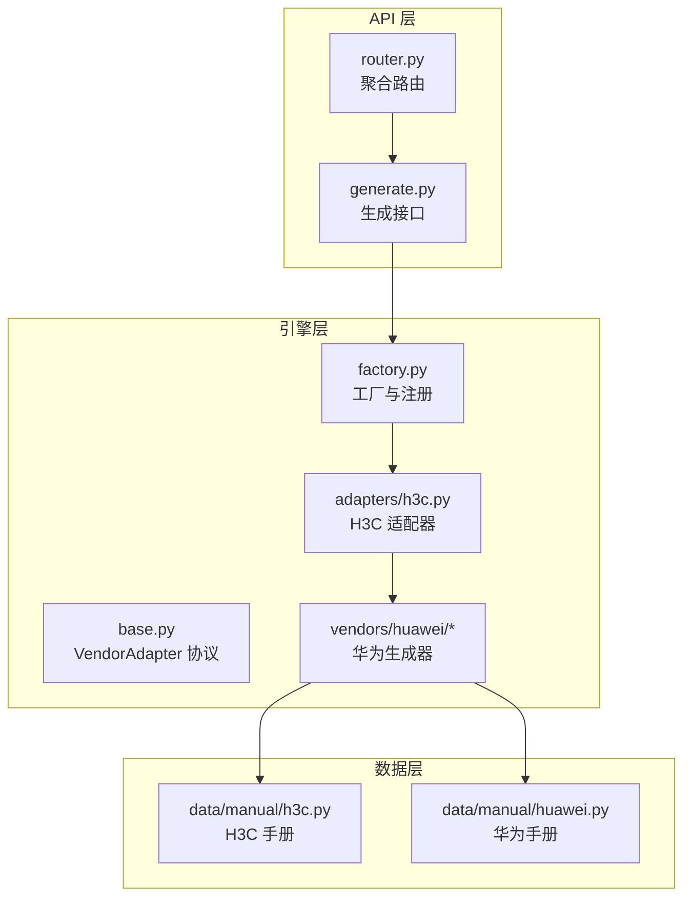
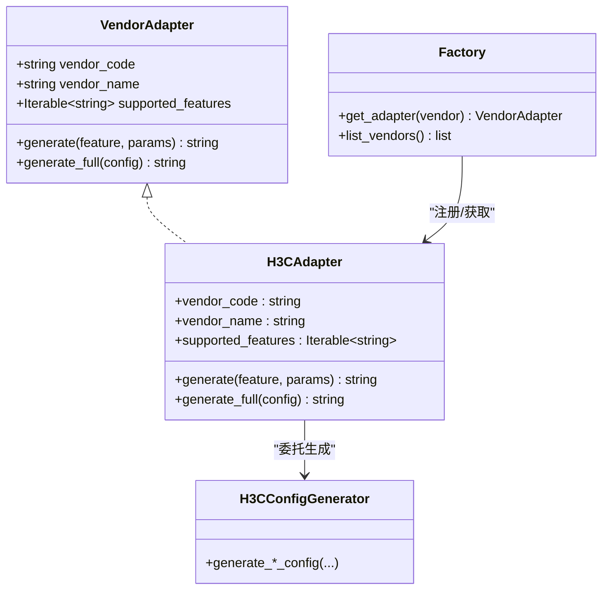
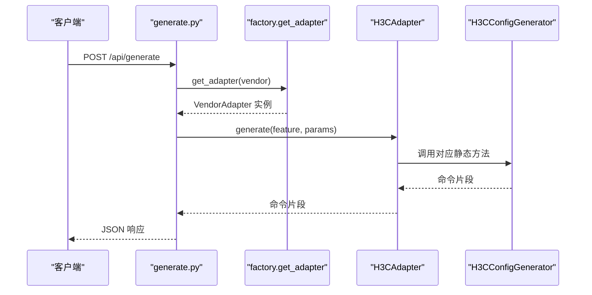
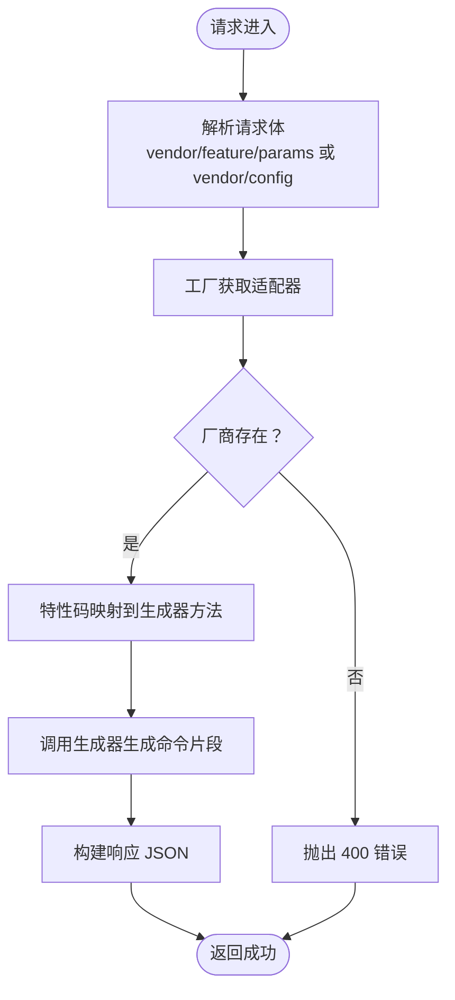
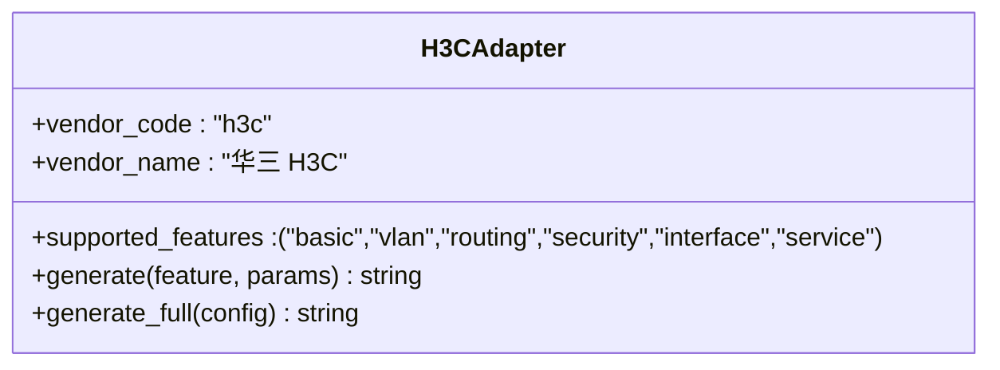
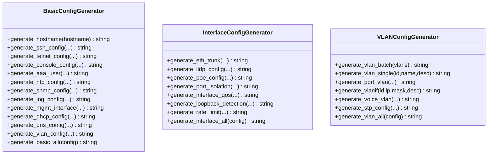
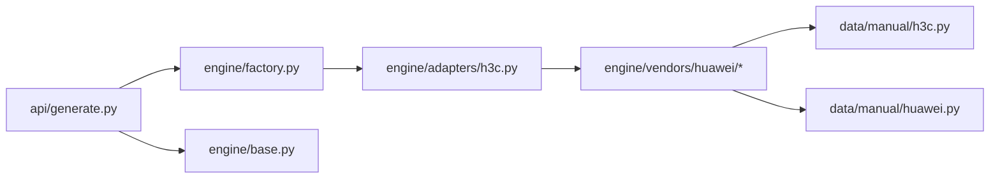

# 命令生成引擎

<cite>
**本文档引用的文件**
- [api/app/engine/base.py](file://api/app/engine/base.py)
- [api/app/engine/factory.py](file://api/app/engine/factory.py)
- [api/app/engine/adapters/h3c.py](file://api/app/engine/adapters/h3c.py)
- [api/app/engine/vendors/huawei/basic.py](file://api/app/engine/vendors/huawei/basic.py)
- [api/app/engine/vendors/huawei/interface.py](file://api/app/engine/vendors/huawei/interface.py)
- [api/app/engine/vendors/huawei/vlan.py](file://api/app/engine/vendors/huawei/vlan.py)
- [api/app/data/manual/h3c.py](file://api/app/data/manual/h3c.py)
- [api/app/data/manual/huawei.py](file://api/app/data/manual/huawei.py)
- [api/app/api/generate.py](file://api/app/api/generate.py)
- [api/app/api/router.py](file://api/app/api/router.py)
- [api/app/main.py](file://api/app/main.py)
</cite>

## 目录
1. [简介](#简介)
2. [项目结构](#项目结构)
3. [核心组件](#核心组件)
4. [架构总览](#架构总览)
5. [详细组件分析](#详细组件分析)
6. [依赖关系分析](#依赖关系分析)
7. [性能考虑](#性能考虑)
8. [故障排除指南](#故障排除指南)
9. [结论](#结论)
10. [附录](#附录)

## 简介
本项目是一个多厂商网络设备配置命令生成引擎，采用适配器模式与工厂模式相结合的设计，实现了对不同厂商（如 H3C、华为等）的统一抽象与扩展。通过 VendorAdapter 协议定义统一接口，工厂负责实例化与注册厂商适配器，适配器内部再委托给对应厂商的配置生成器完成具体命令拼装。引擎同时提供 REST API，支持按特性生成命令片段与按完整配置生成脚本。

## 项目结构
- 引擎层
  - 抽象与协议：engine/base.py
  - 工厂与注册：engine/factory.py
  - 适配器：engine/adapters/h3c.py
  - 厂商实现：engine/vendors/huawei/*
- 数据与手册：app/data/manual/{h3c,huawei}.py
- API 层：app/api/{generate,router}.py
- 应用入口：app/main.py

**图表来源**
- [api/app/api/router.py:1-10](file://api/app/api/router.py#L1-L10)
- [api/app/api/generate.py:1-77](file://api/app/api/generate.py#L1-L77)
- [api/app/engine/factory.py:1-39](file://api/app/engine/factory.py#L1-L39)
- [api/app/engine/base.py:1-36](file://api/app/engine/base.py#L1-L36)
- [api/app/engine/adapters/h3c.py:1-42](file://api/app/engine/adapters/h3c.py#L1-L42)
- [api/app/engine/vendors/huawei/basic.py:1-359](file://api/app/engine/vendors/huawei/basic.py#L1-L359)
- [api/app/engine/vendors/huawei/interface.py:1-308](file://api/app/engine/vendors/huawei/interface.py#L1-L308)
- [api/app/engine/vendors/huawei/vlan.py:1-175](file://api/app/engine/vendors/huawei/vlan.py#L1-L175)
- [api/app/data/manual/h3c.py:1-710](file://api/app/data/manual/h3c.py#L1-L710)
- [api/app/data/manual/huawei.py:1-703](file://api/app/data/manual/huawei.py#L1-L703)

**章节来源**
- [api/app/engine/base.py:1-36](file://api/app/engine/base.py#L1-L36)
- [api/app/engine/factory.py:1-39](file://api/app/engine/factory.py#L1-L39)
- [api/app/engine/adapters/h3c.py:1-42](file://api/app/engine/adapters/h3c.py#L1-L42)
- [api/app/engine/vendors/huawei/basic.py:1-359](file://api/app/engine/vendors/huawei/basic.py#L1-L359)
- [api/app/engine/vendors/huawei/interface.py:1-308](file://api/app/engine/vendors/huawei/interface.py#L1-L308)
- [api/app/engine/vendors/huawei/vlan.py:1-175](file://api/app/engine/vendors/huawei/vlan.py#L1-L175)
- [api/app/data/manual/h3c.py:1-710](file://api/app/data/manual/h3c.py#L1-L710)
- [api/app/data/manual/huawei.py:1-703](file://api/app/data/manual/huawei.py#L1-L703)
- [api/app/api/generate.py:1-77](file://api/app/api/generate.py#L1-L77)
- [api/app/api/router.py:1-10](file://api/app/api/router.py#L1-L10)
- [api/app/main.py:1-29](file://api/app/main.py#L1-L29)

## 核心组件
- VendorAdapter 协议：定义厂商适配器必须具备的字段与方法，确保工厂与调用方的契约稳定。
- 工厂与注册：集中维护厂商适配器实例，提供获取与列举能力。
- 适配器：将特性码映射到具体生成器方法，屏蔽厂商差异。
- 厂商生成器：按厂商规范生成命令片段或完整配置。
- API 层：对外暴露生成接口与厂商列表查询。

**章节来源**
- [api/app/engine/base.py:11-36](file://api/app/engine/base.py#L11-L36)
- [api/app/engine/factory.py:14-39](file://api/app/engine/factory.py#L14-L39)
- [api/app/engine/adapters/h3c.py:14-42](file://api/app/engine/adapters/h3c.py#L14-L42)
- [api/app/api/generate.py:48-77](file://api/app/api/generate.py#L48-L77)

## 架构总览
引擎采用“协议 + 工厂 + 适配器 + 生成器”的分层设计：
- 协议层：VendorAdapter 规范厂商能力边界。
- 工厂层：统一实例化与注册，提供查询与列举。
- 适配器层：将特性码映射到生成器方法，实现多厂商统一调用。
- 生成器层：按厂商实现具体命令拼装，保持无状态与可复用。
- API 层：REST 接口封装，异常转换为 HTTP 错误。

**图表来源**
- [api/app/engine/base.py:11-27](file://api/app/engine/base.py#L11-L27)
- [api/app/engine/factory.py:14-26](file://api/app/engine/factory.py#L14-L26)
- [api/app/engine/adapters/h3c.py:14-42](file://api/app/engine/adapters/h3c.py#L14-L42)

## 详细组件分析

### 适配器模式与工厂模式
- 适配器模式：通过 VendorAdapter 协议抽象厂商能力，H3CAdapter 将特性码映射到 H3CConfigGenerator 的静态方法，实现多厂商统一调用。
- 工厂模式：_ADAPTERS 字典集中注册适配器实例，get_adapter 返回单例实例，list_vendors 提供前端下拉选项。

**图表来源**
- [api/app/api/generate.py:53-64](file://api/app/api/generate.py#L53-L64)
- [api/app/engine/factory.py:20-26](file://api/app/engine/factory.py#L20-L26)
- [api/app/engine/adapters/h3c.py:32-38](file://api/app/engine/adapters/h3c.py#L32-L38)

**章节来源**
- [api/app/engine/base.py:11-27](file://api/app/engine/base.py#L11-L27)
- [api/app/engine/factory.py:14-39](file://api/app/engine/factory.py#L14-L39)
- [api/app/engine/adapters/h3c.py:14-42](file://api/app/engine/adapters/h3c.py#L14-L42)
- [api/app/api/generate.py:53-77](file://api/app/api/generate.py#L53-L77)

### 命令生成流程（从请求到输出）
- 请求解析：API 使用 Pydantic 模型校验 vendor、feature、params 或 config。
- 厂商解析：工厂根据 vendor 获取适配器实例。
- 特性映射：适配器将 feature 映射到具体生成器方法。
- 参数传递：将 params 传入生成器，生成命令片段。
- 完整脚本：generate_full 直接调用适配器的 generate_full，生成完整配置。
- 异常处理：捕获 VendorNotSupported、FeatureNotSupported 并转换为 HTTP 400，其他异常返回 500。

**图表来源**
- [api/app/api/generate.py:53-77](file://api/app/api/generate.py#L53-L77)
- [api/app/engine/factory.py:20-26](file://api/app/engine/factory.py#L20-L26)
- [api/app/engine/adapters/h3c.py:32-42](file://api/app/engine/adapters/h3c.py#L32-L42)

**章节来源**
- [api/app/api/generate.py:21-77](file://api/app/api/generate.py#L21-L77)

### 厂商适配器实现与扩展
- H3C 适配器：将特性码 basic/vlan/routing/security/interface/service 映射到 H3CConfigGenerator 对应静态方法，并提供 generate_full 统一入口。
- 扩展新厂商：在 engine/adapters/ 新建适配器文件，实现 VendorAdapter 协议，然后在工厂 _ADAPTERS 中注册即可。

**图表来源**
- [api/app/engine/adapters/h3c.py:14-42](file://api/app/engine/adapters/h3c.py#L14-L42)

**章节来源**
- [api/app/engine/adapters/h3c.py:14-42](file://api/app/engine/adapters/h3c.py#L14-L42)
- [api/app/engine/factory.py:14-17](file://api/app/engine/factory.py#L14-L17)

### 厂商生成器（以华为为例）
- 基础配置生成器：提供 hostname、密码、SSH/Telnet、Console、Banner、AAA 用户、NTP、SNMP、日志、管理接口、DHCP、DNS 等生成方法。
- 接口配置生成器：Eth-Trunk、LACP、LLDP、PoE、端口隔离、环路检测、速率限制等。
- VLAN 配置生成器：批量 VLAN、单 VLAN、接口 VLAN、VLANIF、Voice VLAN、STP 等。
- 生成器均采用静态方法，便于适配器直接调用；同时提供 generate_*_all 方法整合生成完整配置。

**图表来源**
- [api/app/engine/vendors/huawei/basic.py:8-359](file://api/app/engine/vendors/huawei/basic.py#L8-L359)
- [api/app/engine/vendors/huawei/interface.py:8-308](file://api/app/engine/vendors/huawei/interface.py#L8-L308)
- [api/app/engine/vendors/huawei/vlan.py:8-175](file://api/app/engine/vendors/huawei/vlan.py#L8-L175)

**章节来源**
- [api/app/engine/vendors/huawei/basic.py:8-359](file://api/app/engine/vendors/huawei/basic.py#L8-L359)
- [api/app/engine/vendors/huawei/interface.py:8-308](file://api/app/engine/vendors/huawei/interface.py#L8-L308)
- [api/app/engine/vendors/huawei/vlan.py:8-175](file://api/app/engine/vendors/huawei/vlan.py#L8-L175)

### 数据手册与命令参考
- H3C/Huawei 手册：提供命令模板、示例与案例，适配器与生成器在实现时可参考手册中的命令格式与参数。
- 手册文件可用于验证生成命令的正确性与完整性。

**章节来源**
- [api/app/data/manual/h3c.py:1-710](file://api/app/data/manual/h3c.py#L1-L710)
- [api/app/data/manual/huawei.py:1-703](file://api/app/data/manual/huawei.py#L1-L703)

## 依赖关系分析
- API 层依赖引擎层：generate.py 依赖 factory 与 base。
- 工厂依赖适配器：factory 注册并返回适配器实例。
- 适配器依赖生成器：H3CAdapter 委托 H3CConfigGenerator。
- 生成器依赖手册：生成器实现参考手册命令格式。

**图表来源**
- [api/app/api/generate.py:15-16](file://api/app/api/generate.py#L15-L16)
- [api/app/engine/factory.py:11-17](file://api/app/engine/factory.py#L11-L17)
- [api/app/engine/adapters/h3c.py:10-11](file://api/app/engine/adapters/h3c.py#L10-L11)
- [api/app/engine/vendors/huawei/basic.py:1-359](file://api/app/engine/vendors/huawei/basic.py#L1-L359)
- [api/app/engine/vendors/huawei/interface.py:1-308](file://api/app/engine/vendors/huawei/interface.py#L1-L308)
- [api/app/engine/vendors/huawei/vlan.py:1-175](file://api/app/engine/vendors/huawei/vlan.py#L1-L175)
- [api/app/data/manual/h3c.py:1-710](file://api/app/data/manual/h3c.py#L1-L710)
- [api/app/data/manual/huawei.py:1-703](file://api/app/data/manual/huawei.py#L1-L703)

**章节来源**
- [api/app/api/generate.py:15-16](file://api/app/api/generate.py#L15-L16)
- [api/app/engine/factory.py:11-17](file://api/app/engine/factory.py#L11-L17)
- [api/app/engine/adapters/h3c.py:10-11](file://api/app/engine/adapters/h3c.py#L10-L11)

## 性能考虑
- 适配器实例复用：工厂使用单例字典保存适配器实例，避免重复创建，提升并发性能。
- 生成器静态方法：减少上下文开销，便于直接调用。
- 参数校验与异常处理：API 层提前校验输入并快速失败，减少无效调用成本。
- 建议
  - 对于大规模批量生成，可在上层缓存常用配置模板，减少重复计算。
  - 生成器内部可增加简单的缓存（如 VLAN 批量范围计算结果），但需注意线程安全与内存占用。

[本节为通用指导，无需特定文件来源]

## 故障排除指南
- 厂商不支持：当 vendor 未注册时，抛出 VendorNotSupported，API 层转换为 400。
- 特性不支持：当 feature 不在适配器支持列表时，抛出 FeatureNotSupported，API 层转换为 400。
- 其他异常：捕获未知异常并返回 500，包含错误详情。

**章节来源**
- [api/app/engine/base.py:30-36](file://api/app/engine/base.py#L30-L36)
- [api/app/api/generate.py:58-63](file://api/app/api/generate.py#L58-L63)

## 结论
该命令生成引擎通过适配器与工厂模式实现了多厂商的统一抽象与扩展，配合静态生成器与手册数据，能够高效地生成标准化命令。API 层提供简洁的接口与完善的错误处理，适合集成到更大的运维工具链中。未来扩展新厂商仅需实现适配器并在工厂注册，即可无缝接入现有流程。

[本节为总结，无需特定文件来源]

## 附录

### 如何添加新的厂商支持
- 步骤
  1) 在 engine/adapters/ 下创建新适配器文件，实现 VendorAdapter 协议。
  2) 在 engine/factory.py 的 _ADAPTERS 中注册新适配器实例。
  3) 在 API 层无需改动即可通过 /api/vendors 获取新厂商信息。
- 示例参考
  - H3C 适配器实现与注册：[api/app/engine/adapters/h3c.py:14-42](file://api/app/engine/adapters/h3c.py#L14-L42)，[api/app/engine/factory.py:14-17](file://api/app/engine/factory.py#L14-L17)

**章节来源**
- [api/app/engine/adapters/h3c.py:14-42](file://api/app/engine/adapters/h3c.py#L14-L42)
- [api/app/engine/factory.py:14-17](file://api/app/engine/factory.py#L14-L17)