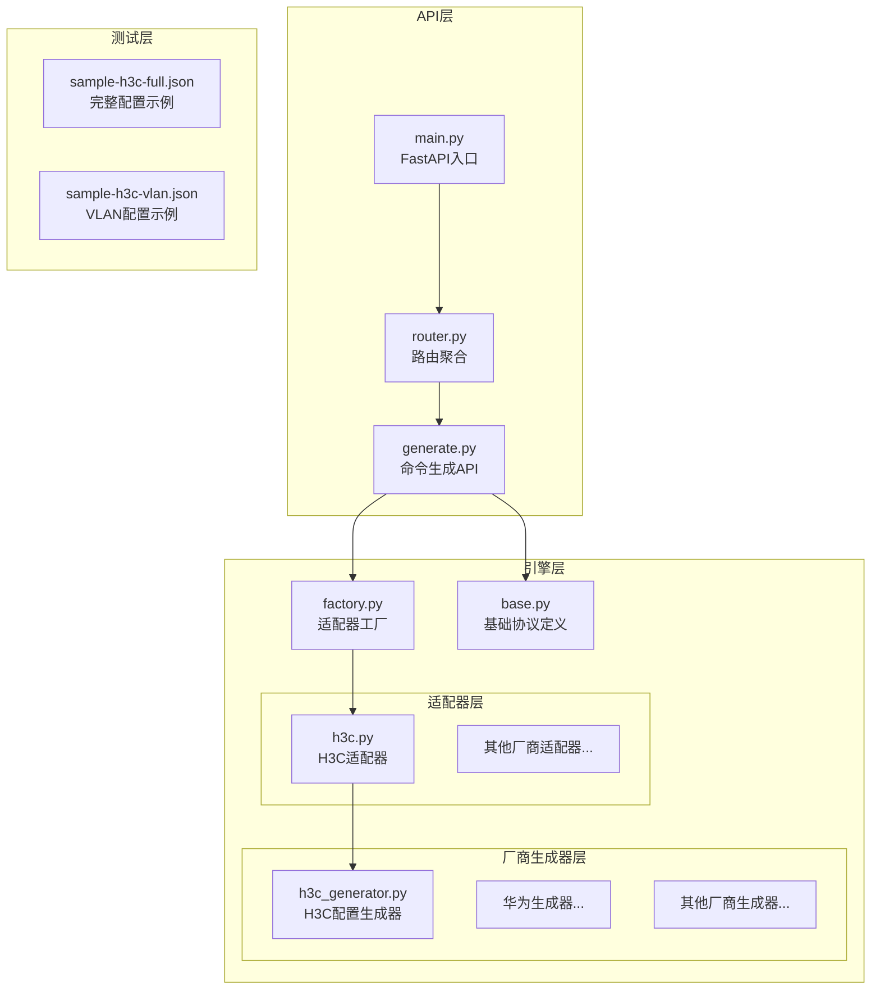
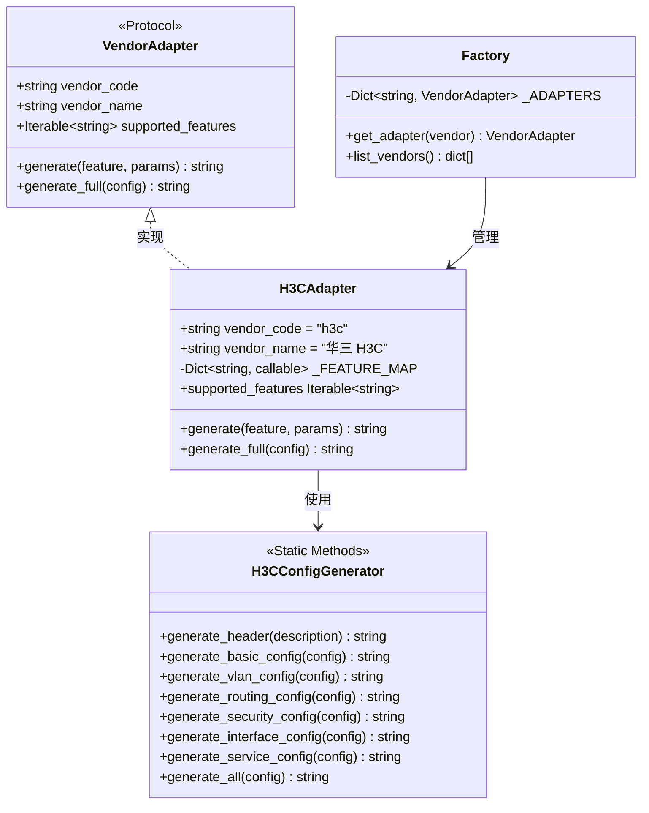
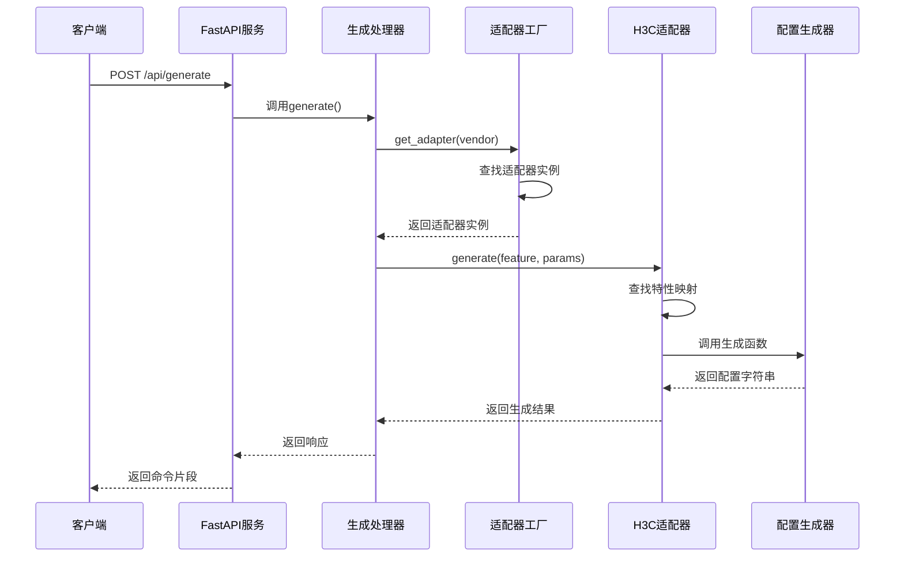
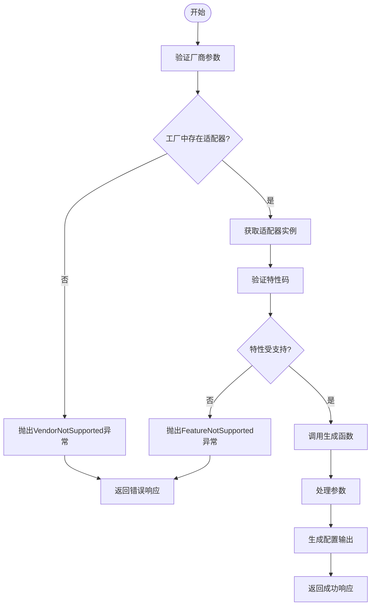
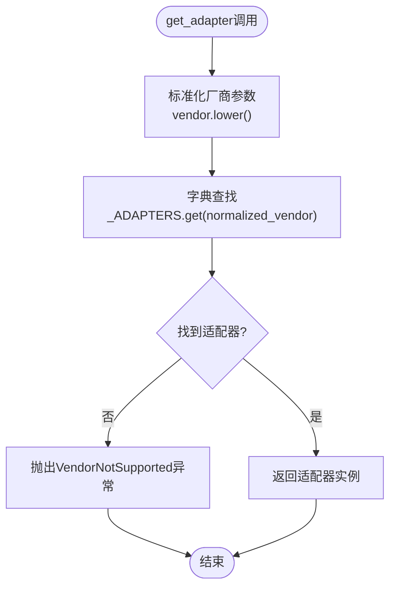
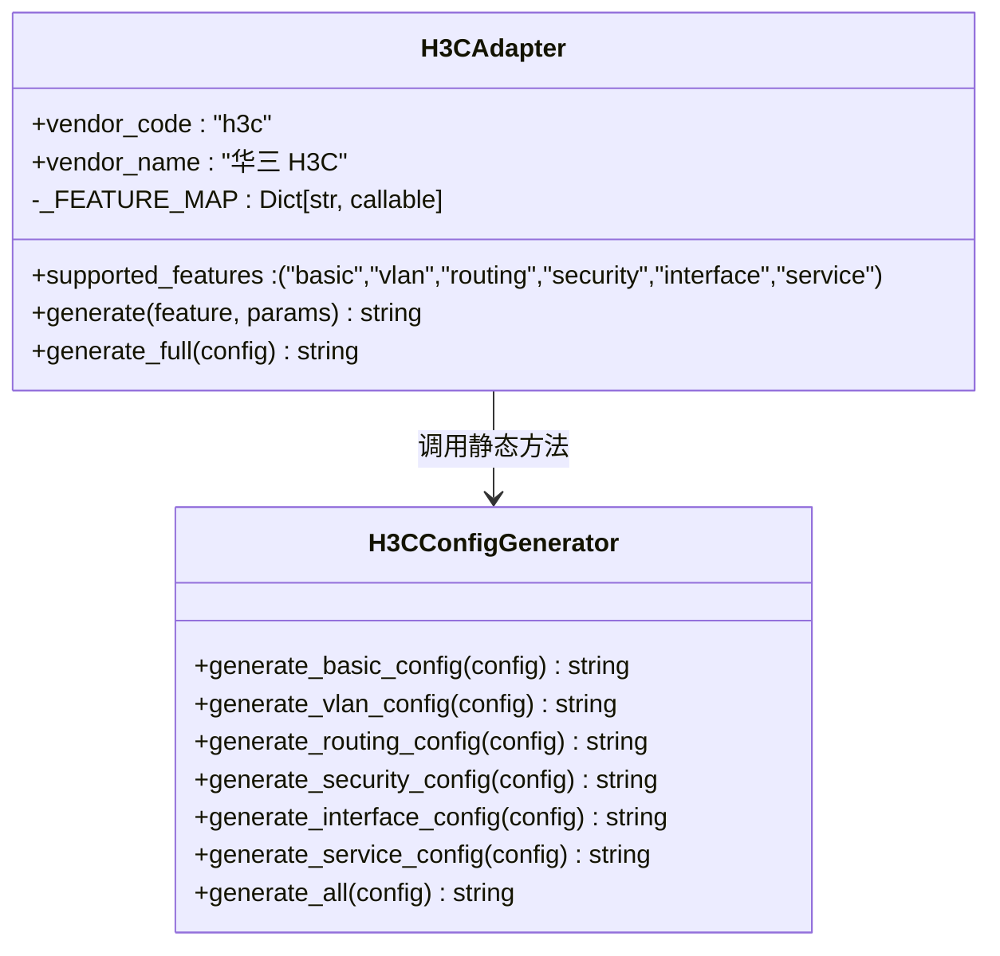
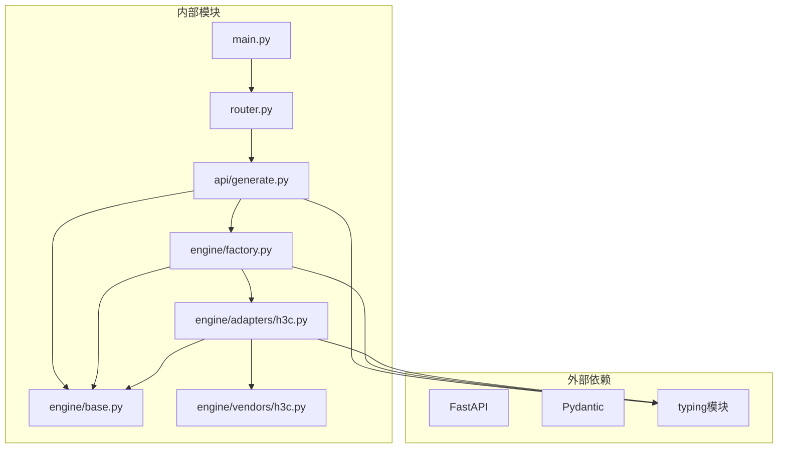
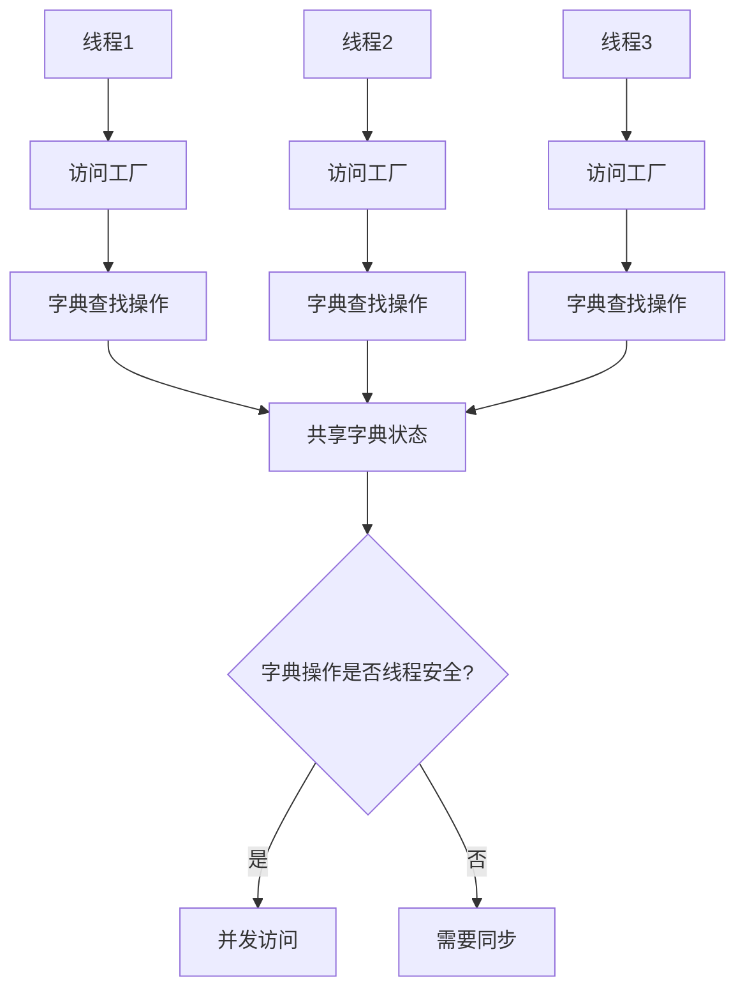

# 工厂模式实现

<cite>
**本文档引用的文件**
- [factory.py](file://api/app/engine/factory.py)
- [base.py](file://api/app/engine/base.py)
- [h3c.py](file://api/app/engine/adapters/h3c.py)
- [h3c_generator.py](file://api/app/engine/vendors/h3c.py)
- [generate.py](file://api/app/api/generate.py)
- [router.py](file://api/app/api/router.py)
- [main.py](file://api/app/main.py)
- [sample-h3c-full.json](file://api/tests/sample-h3c-full.json)
- [sample-h3c-vlan.json](file://api/tests/sample-h3c-vlan.json)
</cite>

## 目录
1. [简介](#简介)
2. [项目结构](#项目结构)
3. [核心组件](#核心组件)
4. [架构概览](#架构概览)
5. [详细组件分析](#详细组件分析)
6. [依赖关系分析](#依赖关系分析)
7. [性能考虑](#性能考虑)
8. [故障排除指南](#故障排除指南)
9. [结论](#结论)

## 简介

本文档深入分析了NetCmdGen项目中工厂模式的实现，重点解释适配器工厂的设计架构和实例管理机制。该系统采用工厂模式来管理不同厂商的网络设备配置生成器，实现了高度的可扩展性和维护性。

工厂模式在此项目中的应用体现在三个主要层面：
- **适配器注册**：通过集中式字典管理所有厂商适配器
- **缓存策略**：使用单例模式确保适配器实例的复用
- **生命周期管理**：通过模块级初始化控制适配器的创建和销毁

## 项目结构

项目采用分层架构设计，核心目录结构如下：



**图表来源**
- [main.py:1-29](file://api/app/main.py#L1-L29)
- [router.py:1-10](file://api/app/api/router.py#L1-L10)
- [factory.py:1-39](file://api/app/engine/factory.py#L1-L39)

**章节来源**
- [main.py:1-29](file://api/app/main.py#L1-L29)
- [router.py:1-10](file://api/app/api/router.py#L1-L10)
- [factory.py:1-39](file://api/app/engine/factory.py#L1-L39)

## 核心组件

### 工厂类结构



**图表来源**
- [base.py:11-35](file://api/app/engine/base.py#L11-L35)
- [h3c.py:14-42](file://api/app/engine/adapters/h3c.py#L14-L42)
- [h3c_generator.py:11-594](file://api/app/engine/vendors/h3c.py#L11-L594)
- [factory.py:14-38](file://api/app/engine/factory.py#L14-L38)

### 关键数据结构

工厂的核心数据结构是一个模块级字典，用于存储所有已注册的适配器实例：

| 数据结构 | 类型 | 描述 | 性能特征 |
|---------|------|------|----------|
| `_ADAPTERS` | `Dict[str, VendorAdapter]` | 厂商代码到适配器实例的映射 | O(1) 查找，常量时间 |
| `supported_features` | `Iterable[str]` | 特性码集合 | 动态访问，O(n) 枚举 |
| `_FEATURE_MAP` | `Dict[str, callable]` | 特性码到生成函数的映射 | O(1) 查找 |

**章节来源**
- [factory.py:14-17](file://api/app/engine/factory.py#L14-L17)
- [h3c.py:19-26](file://api/app/engine/adapters/h3c.py#L19-L26)
- [base.py:15-17](file://api/app/engine/base.py#L15-L17)

## 架构概览

### 系统架构图



**图表来源**
- [generate.py:53-64](file://api/app/api/generate.py#L53-L64)
- [factory.py:20-26](file://api/app/engine/factory.py#L20-L26)
- [h3c.py:32-38](file://api/app/engine/adapters/h3c.py#L32-L38)

### 命令生成流程



**图表来源**
- [generate.py:55-63](file://api/app/api/generate.py#L55-L63)
- [factory.py:21-25](file://api/app/engine/factory.py#L21-L25)
- [h3c.py:33-37](file://api/app/engine/adapters/h3c.py#L33-L37)

## 详细组件分析

### 工厂实现分析

#### get_adapter()方法详解

get_adapter()方法是工厂模式的核心，负责适配器的查找和返回：



**图表来源**
- [factory.py:20-26](file://api/app/engine/factory.py#L20-L26)

#### 适配器注册机制

工厂通过模块级字典进行适配器注册，当前注册机制具有以下特点：

| 注册方式 | 实现细节 | 优点 | 缺点 |
|---------|----------|------|------|
| 静态注册 | 在模块导入时创建实例 | 简单直接，性能好 | 运行时无法动态添加 |
| 单例模式 | 每个厂商只创建一个实例 | 内存效率高 | 无法区分多个实例需求 |
| 类型安全 | 使用Protocol确保接口一致性 | 编译时检查 | 运行时类型检查 |

**章节来源**
- [factory.py:14-17](file://api/app/engine/factory.py#L14-L17)
- [factory.py:20-26](file://api/app/engine/factory.py#L20-L26)

### H3C适配器实现

#### 特性映射机制

H3C适配器使用特性码到生成函数的映射表，实现了灵活的特性管理：



**图表来源**
- [h3c.py:14-42](file://api/app/engine/adapters/h3c.py#L14-L42)
- [h3c_generator.py:26-594](file://api/app/engine/vendors/h3c.py#L26-L594)

#### 错误处理机制

适配器实现了完善的错误处理机制：

| 错误类型 | 触发条件 | 异常类型 | 处理策略 |
|---------|----------|----------|----------|
| 未知厂商 | 请求不存在的厂商代码 | `VendorNotSupported` | 返回HTTP 400错误 |
| 不支持的特性 | 特性码不在映射表中 | `FeatureNotSupported` | 返回HTTP 400错误 |
| 参数错误 | 生成函数参数不正确 | 通用异常 | 返回HTTP 500错误 |

**章节来源**
- [h3c.py:33-37](file://api/app/engine/adapters/h3c.py#L33-L37)
- [generate.py:58-63](file://api/app/api/generate.py#L58-L63)

### API集成分析

#### FastAPI路由集成

API层通过FastAPI框架提供了RESTful接口，与工厂模式无缝集成：

```mermaid
graph LR
subgraph "API路由"
GEN_ROUTE[generate.py<br/>生成路由]
VENDOR_ROUTE[generate.py<br/>厂商列表路由]
end
subgraph "业务逻辑"
GEN_HANDLER[generate()<br/>单特性生成]
FULL_HANDLER[generate_full()<br/>完整配置生成]
LIST_HANDLER[list_vendors()<br/>厂商列表]
end
subgraph "工厂层"
FACTORY[factory.py<br/>适配器工厂]
GET_ADAPTER[get_adapter()<br/>适配器获取]
end
GEN_ROUTE --> GEN_HANDLER
VENDOR_ROUTE --> LIST_HANDLER
GEN_HANDLER --> FACTORY
LIST_HANDLER --> FACTORY
FACTORY --> GET_ADAPTER
```

**图表来源**
- [generate.py:18-77](file://api/app/api/generate.py#L18-L77)
- [router.py:4-9](file://api/app/api/router.py#L4-L9)

**章节来源**
- [generate.py:18-77](file://api/app/api/generate.py#L18-L77)
- [router.py:4-9](file://api/app/api/router.py#L4-L9)

## 依赖关系分析

### 模块依赖图



**图表来源**
- [main.py:2-5](file://api/app/main.py#L2-L5)
- [generate.py:15-16](file://api/app/api/generate.py#L15-L16)
- [factory.py:11-12](file://api/app/engine/factory.py#L11-L12)

### 循环依赖检测

系统设计避免了循环依赖：
- API层仅依赖引擎层，不反向依赖
- 引擎层保持纯逻辑，无HTTP依赖
- 适配器层通过协议接口解耦

**章节来源**
- [main.py:1-29](file://api/app/main.py#L1-L29)
- [factory.py:1-39](file://api/app/engine/factory.py#L1-L39)

## 性能考虑

### 缓存策略分析

工厂采用了高效的缓存策略：

| 缓存层级 | 实现方式 | 性能收益 | 复杂度 |
|---------|----------|----------|--------|
| 模块级缓存 | 单例字典存储 | 避免重复实例化 | O(1)访问 |
| 字符串缓存 | 厂商代码小写化 | 减少字符串比较 | O(1)标准化 |
| 方法缓存 | 特性映射表 | 快速函数查找 | O(1)映射 |

### 线程安全性

当前实现的线程安全特性：



**图表来源**
- [factory.py:14-17](file://api/app/engine/factory.py#L14-L17)

### 性能优化建议

基于当前实现，建议的优化方向：

1. **延迟初始化**：按需创建适配器实例而非预创建
2. **连接池**：为生成器添加连接池管理
3. **缓存失效**：实现LRU缓存策略
4. **异步处理**：支持异步配置生成

## 故障排除指南

### 常见问题诊断

#### 厂商未注册错误

**症状**：`VendorNotSupported`异常
**原因**：请求的厂商代码不在工厂注册表中
**解决方案**：
1. 检查厂商代码拼写
2. 确认适配器已在工厂中注册
3. 验证模块导入路径

#### 特性不支持错误

**症状**：`FeatureNotSupported`异常  
**原因**：特性码不在适配器的支持列表中
**解决方案**：
1. 检查特性码是否正确
2. 验证适配器的`supported_features`属性
3. 确认特性映射表完整性

#### 参数格式错误

**症状**：生成函数抛出异常
**原因**：传入的参数格式不符合预期
**解决方案**：
1. 检查JSON参数结构
2. 验证必需字段的存在性
3. 确认数据类型正确性

### 调试技巧

#### API测试方法

使用提供的测试样例进行功能验证：

```bash
# 测试完整配置生成
curl -X POST "http://localhost:8000/api/generate/full" \
  -H "Content-Type: application/json" \
  -d @api/tests/sample-h3c-full.json

# 测试VLAN特性生成
curl -X POST "http://localhost:8000/api/generate" \
  -H "Content-Type: application/json" \
  -d @api/tests/sample-h3c-vlan.json
```

#### 日志记录建议

在生产环境中建议添加：
- 请求参数的日志记录
- 适配器选择的审计日志
- 错误处理的详细日志

**章节来源**
- [generate.py:58-76](file://api/app/api/generate.py#L58-L76)
- [sample-h3c-full.json:1-26](file://api/tests/sample-h3c-full.json#L1-L26)
- [sample-h3c-vlan.json:1-19](file://api/tests/sample-h3c-vlan.json#L1-L19)

## 结论

NetCmdGen项目的工厂模式实现展现了良好的软件工程实践：

### 设计优势

1. **高度可扩展性**：通过简单的注册机制支持新厂商
2. **运行时性能**：单例模式避免了重复实例化开销
3. **类型安全**：使用Protocol确保接口一致性
4. **清晰的职责分离**：各层职责明确，便于维护

### 架构特点

- **简单而有效**：针对特定场景的最优解决方案
- **易于理解**：代码结构直观，学习成本低
- **维护友好**：模块化设计便于功能扩展

### 改进建议

1. **动态注册**：支持运行时动态添加新厂商
2. **配置驱动**：通过配置文件管理适配器注册
3. **监控指标**：添加适配器使用统计和性能监控
4. **单元测试**：完善测试覆盖率，特别是边界条件

该工厂模式实现为网络设备配置生成系统提供了一个稳健、高效且易于扩展的基础架构，为后续的功能扩展和维护奠定了良好基础。