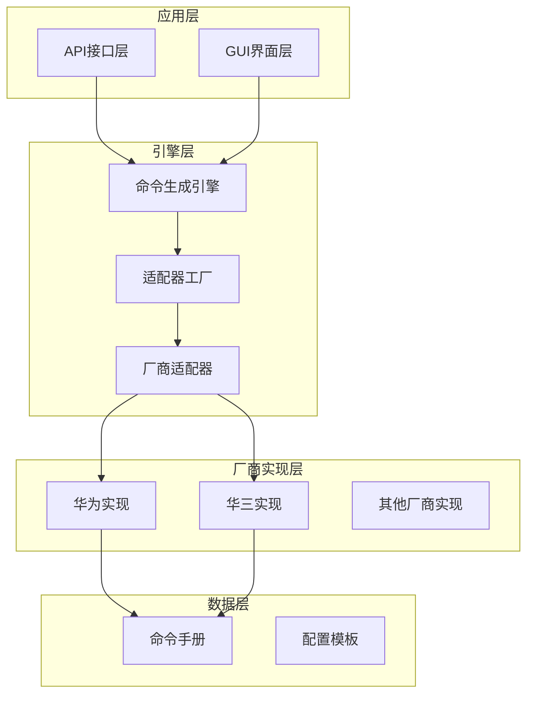
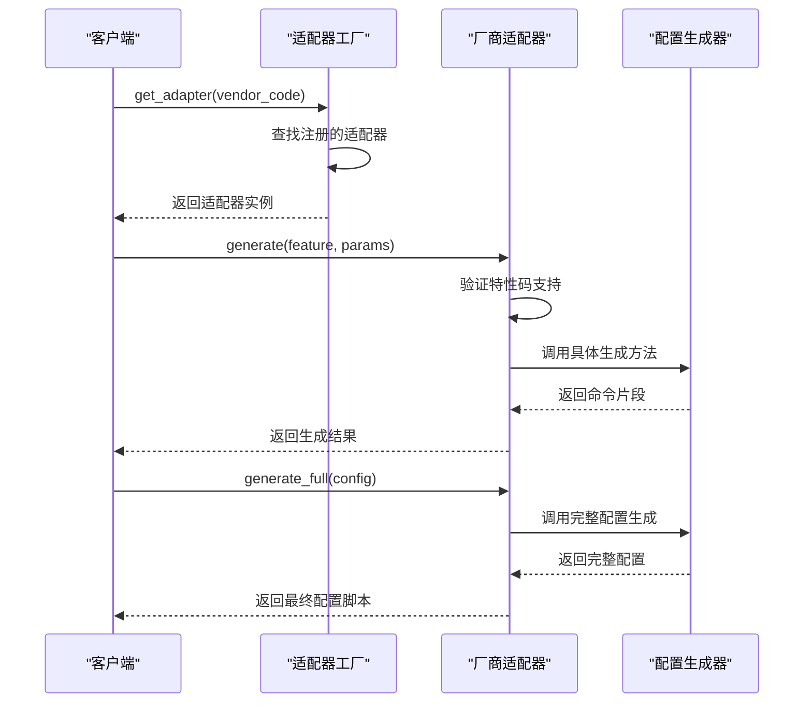
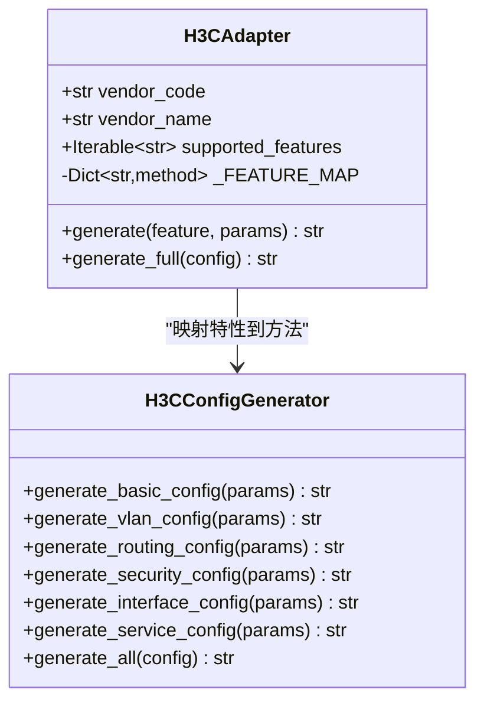
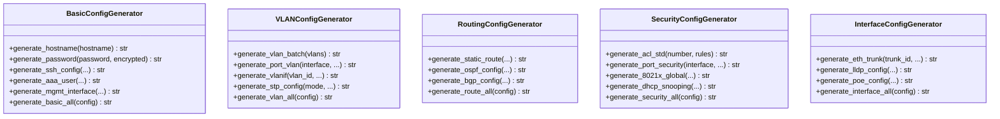
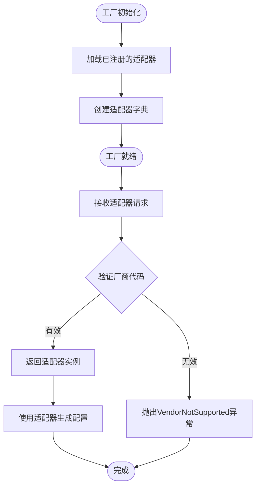
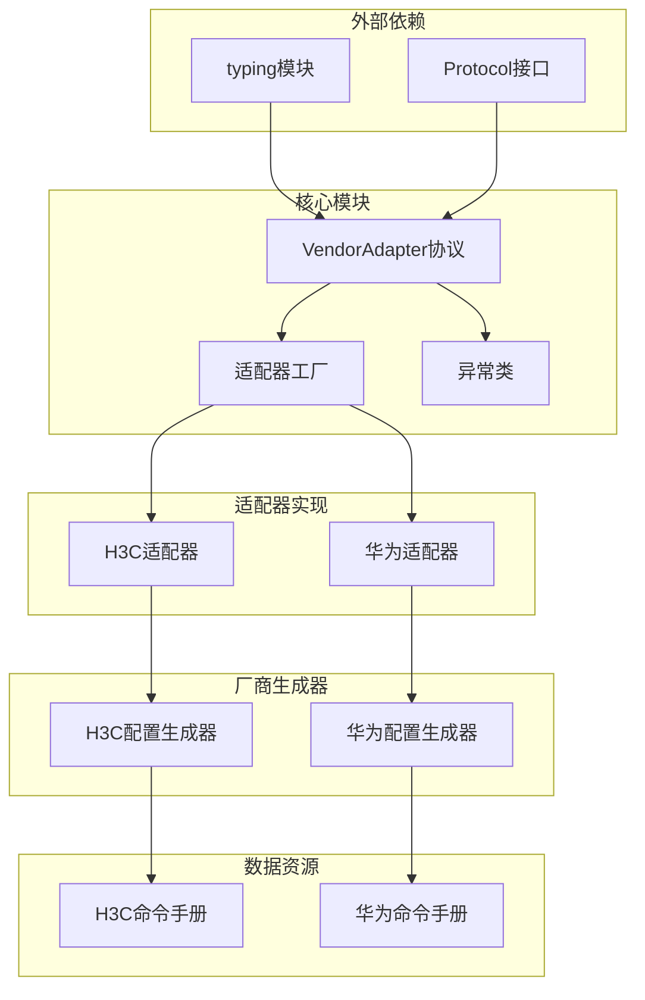

# 适配器模式设计

<cite>
**本文档引用的文件**
- [base.py](file://api/app/engine/base.py)
- [factory.py](file://api/app/engine/factory.py)
- [h3c.py](file://api/app/engine/adapters/h3c.py)
- [huawei_basic.py](file://api/app/engine/vendors/huawei/basic.py)
- [huawei_vlan.py](file://api/app/engine/vendors/huawei/vlan.py)
- [huawei_routing.py](file://api/app/engine/vendors/huawei/routing.py)
- [huawei_security.py](file://api/app/engine/vendors/huawei/security.py)
- [huawei_interface.py](file://api/app/engine/vendors/huawei/interface.py)
- [h3c_manual.py](file://api/app/data/manual/h3c.py)
- [huawei_manual.py](file://api/app/data/manual/huawei.py)
</cite>

## 目录
1. [引言](#引言)
2. [项目结构](#项目结构)
3. [核心组件](#核心组件)
4. [架构概览](#架构概览)
5. [详细组件分析](#详细组件分析)
6. [依赖分析](#依赖分析)
7. [性能考虑](#性能考虑)
8. [故障排除指南](#故障排除指南)
9. [结论](#结论)

## 引言

本文档深入分析了NetCmdGen项目中的适配器模式设计实现，重点解释VendorAdapter协议的设计理念和接口规范。该系统采用统一的适配器模式来支持不同厂商的网络设备配置生成，包括华为、华三等主流厂商。

适配器模式的核心思想是通过一个统一的接口来封装不同厂商的特定实现，使得上层应用可以以一致的方式调用不同厂商的功能。这种设计模式特别适用于网络设备配置生成领域，因为不同厂商的CLI语法差异很大，但业务需求相对统一。

## 项目结构

项目采用分层架构设计，主要分为以下几个层次：

**图表来源**
- [base.py:1-36](file://api/app/engine/base.py#L1-L36)
- [factory.py:1-39](file://api/app/engine/factory.py#L1-L39)

**章节来源**
- [base.py:1-36](file://api/app/engine/base.py#L1-L36)
- [factory.py:1-39](file://api/app/engine/factory.py#L1-L39)

## 核心组件

### VendorAdapter协议设计

VendorAdapter协议是整个适配器模式的核心，定义了统一的接口规范：

#### 协议属性规范

| 属性名称 | 类型 | 必填 | 约束条件 | 描述 |
|---------|------|------|----------|------|
| vendor_code | str | 是 | 唯一标识符，小写字母 | 厂商代码标识符，如"h3c"、"huawei" |
| vendor_name | str | 是 | 中文展示名称 | 厂商中文名称，用于用户界面显示 |
| supported_features | Iterable[str] | 是 | 不重复的特性码集合 | 该厂商支持的所有特性码列表 |

#### 协议方法规范

**generate()方法**
- **参数**: 
  - `feature: str`: 特性码，必须在supported_features范围内
  - `params: Dict[str, Any]`: 特定于该特性的参数字典
- **返回值**: `str` - 生成的命令片段
- **异常**: 当特性码不受支持时抛出FeatureNotSupported异常

**generate_full()方法**
- **参数**: `config: Dict[str, Any]` - 完整配置对象
- **返回值**: `str` - 生成的完整配置脚本
- **异常**: 无特定异常，内部异常向上抛出

#### 异常类设计

系统定义了两个专门的异常类：

**FeatureNotSupported异常**
- **用途**: 当请求的特性码不在厂商支持列表中时抛出
- **场景**: 特性码拼写错误、特性码不存在、厂商不支持该特性
- **错误信息**: 包含具体的特性码和可用选项列表

**VendorNotSupported异常**
- **用途**: 当请求的厂商不在注册列表中时抛出
- **场景**: 厂商代码错误、新厂商未注册、厂商代码大小写问题
- **错误信息**: 包含所有已注册厂商的列表

**章节来源**
- [base.py:11-36](file://api/app/engine/base.py#L11-L36)

## 架构概览

系统采用工厂模式配合适配器模式，实现了高度可扩展的厂商支持架构：

**图表来源**
- [factory.py:20-26](file://api/app/engine/factory.py#L20-L26)
- [h3c.py:32-42](file://api/app/engine/adapters/h3c.py#L32-L42)

**章节来源**
- [factory.py:1-39](file://api/app/engine/factory.py#L1-L39)
- [h3c.py:1-42](file://api/app/engine/adapters/h3c.py#L1-L42)

## 详细组件分析

### H3C适配器实现

H3C适配器展示了适配器模式的最佳实践：

#### 特性映射机制

**图表来源**
- [h3c.py:14-31](file://api/app/engine/adapters/h3c.py#L14-L31)

#### 实现特点

1. **特性码映射**: 使用字典将特性码映射到具体的生成方法
2. **动态验证**: 运行时验证特性码是否受支持
3. **统一接口**: 对外暴露统一的generate和generate_full方法

**章节来源**
- [h3c.py:14-42](file://api/app/engine/adapters/h3c.py#L14-L42)

### 华为厂商配置生成器

华为厂商提供了完整的配置生成器实现，展示了如何将复杂的配置逻辑封装在独立的类中：

#### 配置生成器架构

**图表来源**
- [huawei_basic.py:8-359](file://api/app/engine/vendors/huawei/basic.py#L8-L359)
- [huawei_vlan.py:8-175](file://api/app/engine/vendors/huawei/vlan.py#L8-L175)
- [huawei_routing.py:8-213](file://api/app/engine/vendors/huawei/routing.py#L8-L213)
- [huawei_security.py:8-578](file://api/app/engine/vendors/huawei/security.py#L8-L578)
- [huawei_interface.py:8-308](file://api/app/engine/vendors/huawei/interface.py#L8-L308)

#### 配置生成策略

每个配置生成器都实现了以下策略：

1. **参数验证**: 对输入参数进行验证和清理
2. **命令构建**: 将参数转换为具体的CLI命令
3. **格式化输出**: 统一的命令格式化和换行处理
4. **批量处理**: 支持批量操作优化性能

**章节来源**
- [huawei_basic.py:1-359](file://api/app/engine/vendors/huawei/basic.py#L1-L359)
- [huawei_vlan.py:1-175](file://api/app/engine/vendors/huawei/vlan.py#L1-L175)
- [huawei_routing.py:1-213](file://api/app/engine/vendors/huawei/routing.py#L1-L213)
- [huawei_security.py:1-578](file://api/app/engine/vendors/huawei/security.py#L1-L578)
- [huawei_interface.py:1-308](file://api/app/engine/vendors/huawei/interface.py#L1-L308)

### 适配器工厂设计

适配器工厂实现了单例模式和延迟加载机制：

**图表来源**
- [factory.py:14-26](file://api/app/engine/factory.py#L14-L26)

**章节来源**
- [factory.py:1-39](file://api/app/engine/factory.py#L1-L39)

## 依赖分析

系统采用了清晰的依赖层次结构：

**图表来源**
- [base.py:6-11](file://api/app/engine/base.py#L6-L11)
- [factory.py:9-12](file://api/app/engine/factory.py#L9-L12)

**章节来源**
- [base.py:1-36](file://api/app/engine/base.py#L1-L36)
- [factory.py:1-39](file://api/app/engine/factory.py#L1-L39)

## 性能考虑

### 内存优化策略

1. **适配器实例复用**: 工厂使用单例字典存储适配器实例，避免重复创建
2. **无状态设计**: 适配器类设计为无状态，确保线程安全和内存效率
3. **延迟加载**: 仅在需要时才创建适配器实例

### 执行效率优化

1. **特性码预验证**: 在适配器初始化时建立特性码映射表
2. **批量处理**: 支持批量配置生成减少调用次数
3. **字符串拼接优化**: 使用join方法减少字符串拼接开销

## 故障排除指南

### 常见问题及解决方案

**问题1: VendorNotSupported异常**
- **症状**: 请求厂商代码时抛出异常
- **原因**: 厂商代码未注册或拼写错误
- **解决**: 检查厂商代码是否正确，确认已在工厂中注册

**问题2: FeatureNotSupported异常**
- **症状**: 调用generate方法时抛出异常
- **原因**: 特性码不在supported_features列表中
- **解决**: 检查特性码拼写，确认该特性是否受厂商支持

**问题3: 配置生成错误**
- **症状**: 生成的配置不符合预期
- **原因**: 参数格式不正确或缺少必要参数
- **解决**: 检查参数格式，参考命令手册验证语法

### 调试建议

1. **启用日志记录**: 记录适配器选择和配置生成过程
2. **参数验证**: 在调用前验证所有输入参数
3. **单元测试**: 为每个适配器实现编写单元测试

**章节来源**
- [base.py:30-36](file://api/app/engine/base.py#L30-L36)
- [factory.py:20-26](file://api/app/engine/factory.py#L20-L26)

## 结论

NetCmdGen项目的适配器模式设计展现了良好的软件工程实践：

1. **协议驱动**: 通过VendorAdapter协议实现了厂商无关的接口设计
2. **扩展性强**: 新增厂商只需实现适配器接口并注册到工厂
3. **代码复用**: 配置生成器类实现了功能模块化和代码复用
4. **异常处理**: 完善的异常体系提供了清晰的错误反馈
5. **性能优化**: 工厂模式和单例设计确保了高效的资源利用

该设计模式为网络设备配置生成提供了一个可扩展、可维护的解决方案，能够轻松支持更多厂商的集成。通过标准化的接口和清晰的职责分离，系统在保持灵活性的同时确保了稳定性和可靠性。