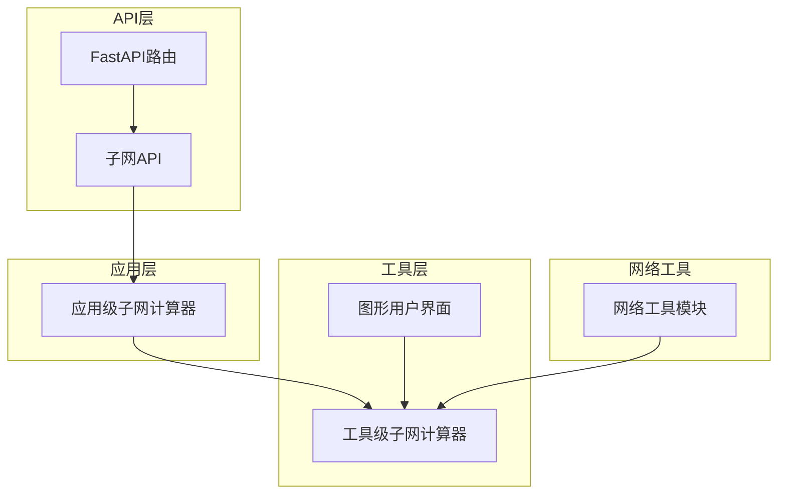
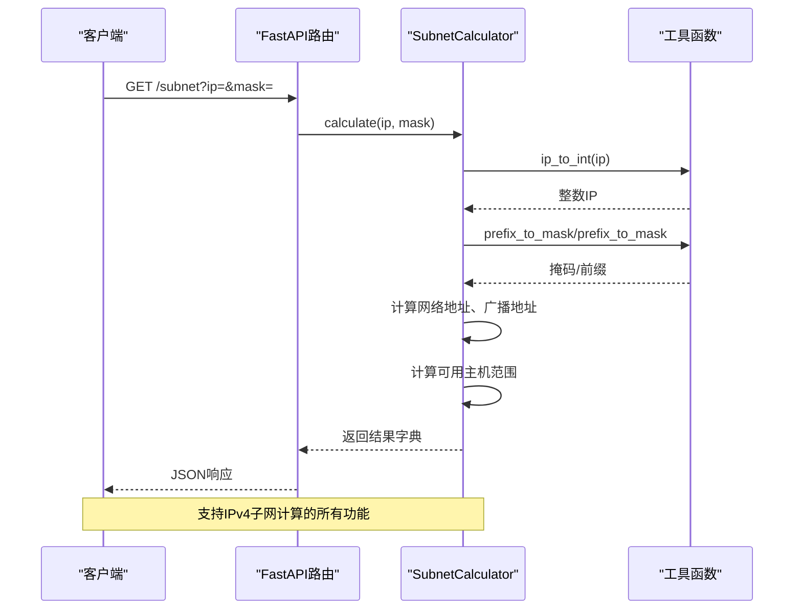
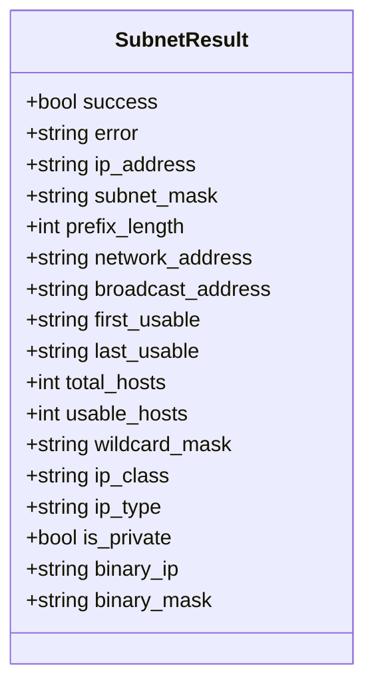
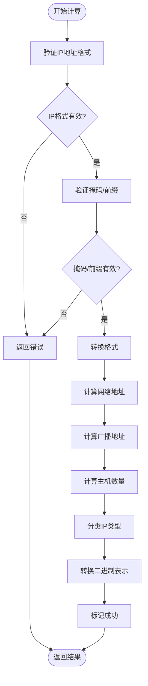
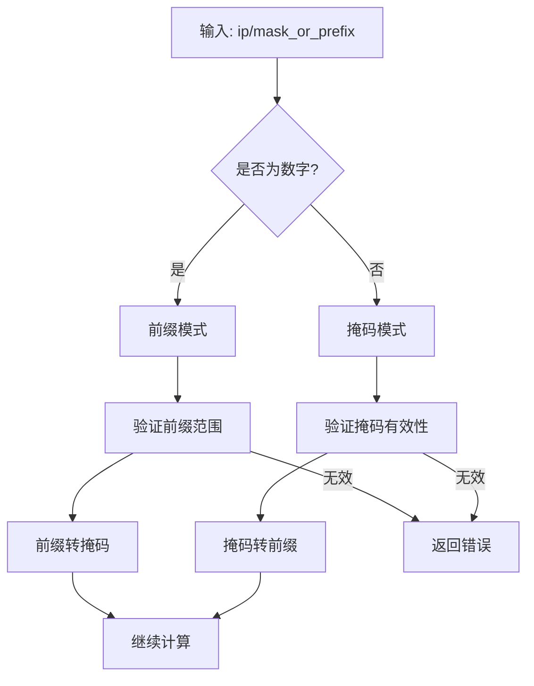
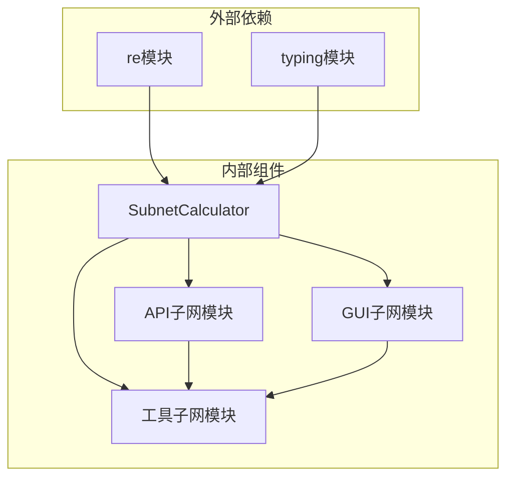

# 子网计算器API

<cite>
**本文档引用的文件**
- [subnet.py](file://api/app/tools/subnet.py)
- [tools_subnet.py](file://api/app/api/tools_subnet.py)
- [subnet_tool.py](file://opensource/NetOps-toolkit/gui/tools/subnet_tool.py)
- [subnet_calculator.py](file://opensource/NetOps-toolkit/utils/network_tools/subnet_calculator.py)
- [README.md](file://opensource/NetOps-toolkit/README.md)
</cite>

## 目录
1. [简介](#简介)
2. [项目结构](#项目结构)
3. [核心组件](#核心组件)
4. [架构概览](#架构概览)
5. [详细组件分析](#详细组件分析)
6. [依赖分析](#依赖分析)
7. [性能考虑](#性能考虑)
8. [故障排除指南](#故障排除指南)
9. [结论](#结论)
10. [附录](#附录)

## 简介
本文档为SubnetCalculator类提供详细的API参考文档。该类实现了IPv4子网计算的核心功能，包括：
- 子网信息计算（网络地址、广播地址、可用IP范围）
- CIDR格式处理（前缀长度与子网掩码互转）
- IP地址验证与格式转换
- 子网划分算法与VLSM支持
- 子网规划最佳实践指导

该实现采用纯Python实现，不依赖外部IPv6库，专注于IPv4子网计算，并提供了Web API接口和桌面GUI两种使用方式。

## 项目结构
该项目采用模块化设计，主要包含以下层次：

**图表来源**
- [tools_subnet.py:1-50](file://api/app/api/tools_subnet.py#L1-L50)
- [subnet.py:1-280](file://api/app/tools/subnet.py#L1-L280)
- [subnet_tool.py:1-320](file://opensource/NetOps-toolkit/gui/tools/subnet_tool.py#L1-L320)

**章节来源**
- [README.md:107-153](file://opensource/NetOps-toolkit/README.md#L107-L153)

## 核心组件
SubnetCalculator类是整个子网计算功能的核心，提供以下静态方法：

### 主要方法概览
- `calculate(ip: str, mask_or_prefix: str) -> Dict[str, any]`: 主要的子网计算方法
- `split_subnet(network: str, prefix: int, new_prefix: int) -> List[Dict]`: 子网划分方法
- `ip_range_to_cidr(start_ip: str, end_ip: str) -> List[Dict]`: IP范围转CIDR方法
- `get_all_masks() -> List[Dict]`: 获取所有有效子网掩码
- `ip_to_int(ip: str) -> int`: IP地址转整数
- `int_to_ip(num: int) -> str`: 整数转IP地址
- `mask_to_prefix(mask: str) -> int`: 子网掩码转前缀长度
- `prefix_to_mask(prefix: int) -> str`: 前缀长度转子网掩码

**章节来源**
- [subnet.py:11-280](file://api/app/tools/subnet.py#L11-L280)

## 架构概览
系统采用分层架构设计，确保功能分离和代码复用：

**图表来源**
- [tools_subnet.py:9-22](file://api/app/api/tools_subnet.py#L9-L22)
- [subnet.py:51-166](file://api/app/tools/subnet.py#L51-L166)

## 详细组件分析

### SubnetCalculator类详解

#### calculate_subnet()方法
这是最核心的方法，负责执行完整的子网计算流程：

**方法签名**: `calculate(ip: str, mask_or_prefix: str) -> Dict[str, any]`

**参数说明**:
- `ip`: IP地址字符串，支持标准IPv4格式
- `mask_or_prefix`: 可以是子网掩码（如"255.255.255.0"）或前缀长度（如"24"）

**返回值结构**:

**图表来源**
- [subnet.py:62-80](file://api/app/tools/subnet.py#L62-L80)

**处理流程**:

**图表来源**
- [subnet.py:82-166](file://api/app/tools/subnet.py#L82-L166)

**章节来源**
- [subnet.py:51-166](file://api/app/tools/subnet.py#L51-L166)

#### IP地址验证机制
系统实现了严格的IP地址验证：

**验证规则**:
1. 格式验证：使用正则表达式`^(\d{1,3})\.(\d{1,3})\.(\d{1,3})\.(\d{1,3})$`
2. 数值范围：每个八位组必须在0-255范围内
3. 前缀长度：必须在0-32范围内
4. 掩码有效性：使用预定义的有效掩码映射表

**章节来源**
- [subnet.py:82-103](file://api/app/tools/subnet.py#L82-L103)

#### CIDR格式处理
系统支持两种输入格式的自动识别和转换：

**格式识别逻辑**:

**图表来源**
- [subnet.py:92-103](file://api/app/tools/subnet.py#L92-L103)

**章节来源**
- [subnet.py:25-48](file://api/app/tools/subnet.py#L25-L48)

#### 子网划分算法
支持VLSM（可变长子网掩码）的子网划分功能：

**算法特点**:
- 支持任意前缀长度的子网划分
- 自动计算子网边界和广播地址
- 提供每个子网的可用主机范围
- 支持等长子网的批量生成

**实现细节**:
- 使用位运算进行网络地址计算
- 支持前缀长度递增的子网生成
- 自动处理边界条件和无效输入

**章节来源**
- [subnet.py:169-210](file://api/app/tools/subnet.py#L169-L210)

#### VLSM支持功能
VLSM（可变长子网掩码）是现代网络设计的重要概念：

**VLSM优势**:
- 优化IP地址空间利用率
- 支持不同规模的子网需求
- 减少路由表大小
- 提高网络管理灵活性

**实现策略**:
- 基于前缀长度的灵活划分
- 支持非等长子网的混合使用
- 自动计算最优的子网分配方案

**章节来源**
- [subnet.py:169-210](file://api/app/tools/subnet.py#L169-L210)

### 数据结构说明

#### 计算结果数据结构
计算结果采用统一的字典结构，便于API调用和前端展示：

**核心字段**:
- `success`: 计算是否成功的布尔标志
- `error`: 错误信息字符串（失败时）
- `ip_address`: 输入的原始IP地址
- `subnet_mask`: 计算得到的子网掩码
- `prefix_length`: 对应的前缀长度
- `network_address`: 网络地址
- `broadcast_address`: 广播地址
- `first_usable`: 第一个可用IP
- `last_usable`: 最后一个可用IP
- `total_hosts`: 总主机数
- `usable_hosts`: 可用主机数
- `wildcard_mask`: 通配符掩码
- `ip_class`: IP类别（A/B/C/D/E）
- `ip_type`: IP类型（私有/公有/环回等）
- `is_private`: 是否为私有地址
- `binary_ip`: 二进制IP表示
- `binary_mask`: 二进制掩码表示

**章节来源**
- [subnet.py:62-80](file://api/app/tools/subnet.py#L62-L80)

#### 子网划分结果结构
子网划分返回的子网信息包含：

**子网字段**:
- `subnet`: 子网网络地址
- `prefix`: 子网前缀长度
- `mask`: 子网掩码
- `first_host`: 首个主机地址
- `last_host`: 最后一个主机地址
- `broadcast`: 广播地址
- `hosts`: 可用主机数量

**章节来源**
- [subnet.py:200-208](file://api/app/tools/subnet.py#L200-L208)

### API接口文档

#### Web API接口
系统提供了RESTful API接口，支持HTTP请求调用：

**子网信息计算接口**:
- **URL**: `/subnet`
- **方法**: GET
- **参数**:
  - `ip`: IP地址（必填）
  - `mask`: 子网掩码或前缀长度（必填）
- **响应**: 计算结果字典

**子网划分接口**:
- **URL**: `/subnet/split`
- **方法**: GET
- **参数**:
  - `network`: 原网络地址（必填）
  - `prefix`: 原前缀长度（必填）
  - `new_prefix`: 新前缀长度（必填）
- **响应**: 子网列表

**IP范围转CIDR接口**:
- **URL**: `/subnet/range-to-cidr`
- **方法**: GET
- **参数**:
  - `start`: 起始IP（必填）
  - `end`: 结束IP（必填）
- **响应**: CIDR块列表

**章节来源**
- [tools_subnet.py:9-49](file://api/app/api/tools_subnet.py#L9-L49)

### GUI集成
系统还提供了图形用户界面集成：

**GUI特性**:
- 实时计算结果显示
- 表格形式的子网划分展示
- IP范围转CIDR的可视化转换
- 掩码速查表功能
- 错误状态提示

**章节来源**
- [subnet_tool.py:202-320](file://opensource/NetOps-toolkit/gui/tools/subnet_tool.py#L202-L320)

## 依赖分析

### 组件依赖关系

**图表来源**
- [subnet.py:7-8](file://api/app/tools/subnet.py#L7-L8)
- [tools_subnet.py:1-4](file://api/app/api/tools_subnet.py#L1-L4)

### 错误处理机制
系统实现了完善的错误处理机制：

**错误类型**:
- IP地址格式错误
- IP地址数值超范围
- 前缀长度超出范围
- 无效的子网掩码
- 子网划分参数无效

**错误传播**:
- 方法内部直接返回错误信息
- API层转换为HTTP异常
- GUI层显示友好的错误提示

**章节来源**
- [subnet.py:84-103](file://api/app/tools/subnet.py#L84-L103)
- [tools_subnet.py:20-22](file://api/app/api/tools_subnet.py#L20-L22)

## 性能考虑

### 时间复杂度分析
- **单次计算**: O(1) - 基本的位运算和字符串处理
- **子网划分**: O(2^(new_prefix - prefix)) - 指数级增长
- **掩码转换**: O(1) - 查表法实现
- **IP范围转CIDR**: O(n) - n为覆盖的CIDR块数量

### 空间复杂度
- **单次计算**: O(1) - 固定大小的结果字典
- **子网划分**: O(2^(new_prefix - prefix)) - 子网列表存储
- **掩码速查**: O(33) - 预定义的掩码映射表

### 优化建议
1. 对于大规模子网划分，考虑分批处理
2. 缓存常用的掩码转换结果
3. 使用位运算优化IP地址处理
4. 实现输入参数的预验证

## 故障排除指南

### 常见问题及解决方案

**IP地址格式错误**
- 检查IP地址是否为标准的IPv4格式
- 确认每个八位组数值在0-255范围内
- 避免多余的空格和特殊字符

**前缀长度无效**
- 前缀长度必须在0-32范围内
- 确认输入的是数字而非字符串
- 检查是否有前导零

**子网掩码无效**
- 使用标准的子网掩码格式
- 确认掩码是连续的1和0
- 避免使用不常见的掩码格式

**子网划分失败**
- 确认原网络地址是有效的网络地址
- 检查新前缀长度必须大于原前缀
- 验证网络地址与掩码的匹配性

**章节来源**
- [subnet.py:82-103](file://api/app/tools/subnet.py#L82-L103)
- [subnet.py:181-189](file://api/app/tools/subnet.py#L181-L189)

### 调试技巧
1. 使用简单的测试用例验证基本功能
2. 逐步检查中间计算结果
3. 利用二进制表示验证位运算正确性
4. 对边界情况进行专门测试

## 结论
SubnetCalculator类提供了完整的IPv4子网计算解决方案，具有以下特点：

**技术优势**:
- 纯Python实现，无需外部依赖
- 支持多种输入格式的自动识别
- 提供完整的子网信息计算
- 实现VLSM支持和子网划分功能

**使用场景**:
- 网络规划和设计
- 网络故障排查
- 网络设备配置
- 教育和培训用途

**扩展建议**:
- 考虑添加IPv6支持
- 实现更复杂的网络规划算法
- 添加批量处理功能
- 提供更丰富的可视化选项

## 附录

### 子网规划最佳实践

**网络设计原则**:
1. **合理规划前缀长度**：根据实际主机数量选择合适的前缀长度
2. **预留扩展空间**：为未来增长预留至少25%的地址空间
3. **VLSM应用**：对不同规模的子网使用不同的前缀长度
4. **地址分配策略**：优先分配给需要大量主机的部门

**常见应用场景**:
- **点对点链路**：使用/30或/31前缀
- **小型工作组**：使用/27或/28前缀
- **中型部门**：使用/25或/26前缀
- **大型网络**：使用/24或更短前缀

### 相关资源
- 子网计算器工具：支持实时计算和结果展示
- 掩码速查表：提供所有有效子网掩码的快速参考
- 子网划分工具：支持VLSM的子网规划
- IP范围转换：将连续的IP范围转换为最小的CIDR块集合

**章节来源**
- [subnet_tool.py:175-194](file://opensource/NetOps-toolkit/gui/tools/subnet_tool.py#L175-L194)