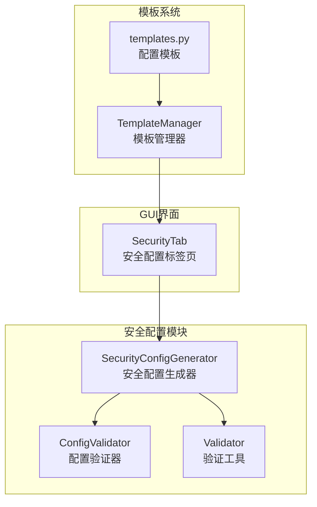
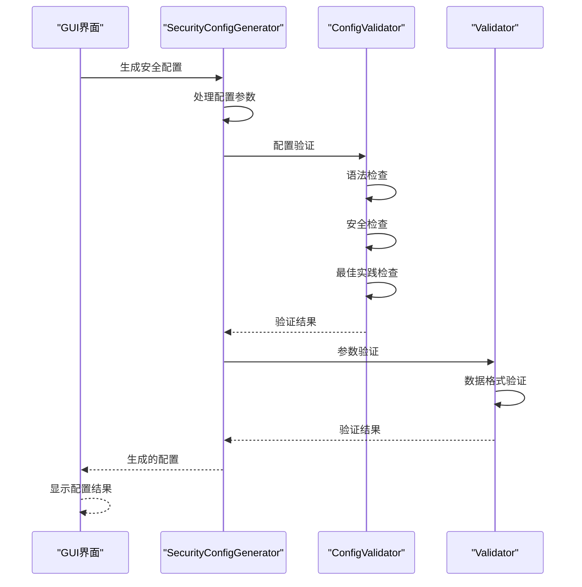
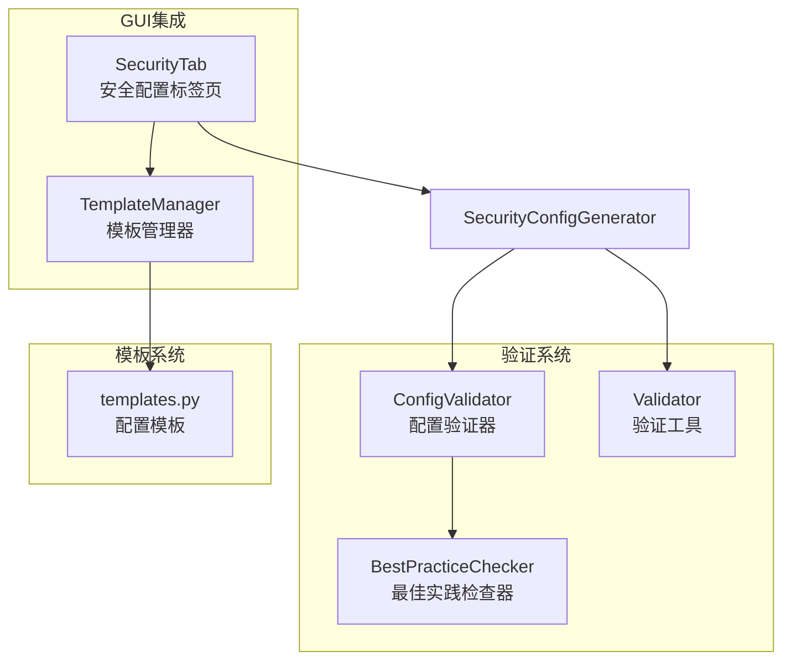
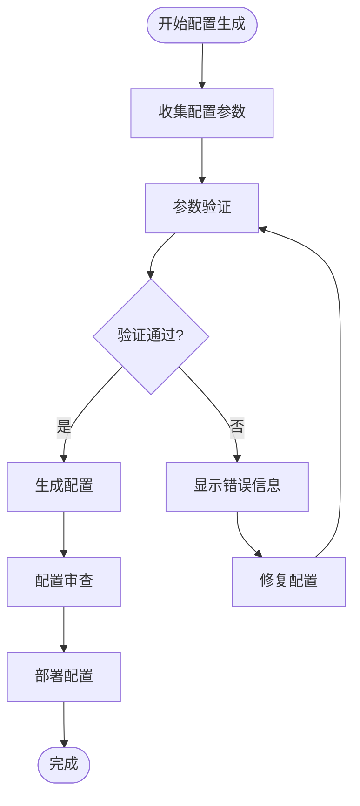

# 安全配置API

<cite>
**本文档引用的文件**
- [security_config.py](file://opensource/NetOps-toolkit/modules/security_config.py)
- [config_validator.py](file://opensource/NetOps-toolkit/utils/config_validator.py)
- [validator.py](file://opensource/NetOps-toolkit/utils/validator.py)
- [security_tab.py](file://opensource/NetOps-toolkit/gui/tabs/security_tab.py)
- [templates.py](file://opensource/NetOps-toolkit/utils/templates.py)
- [template_manager.py](file://opensource/NetOps-toolkit/utils/template_manager.py)
- [README.md](file://opensource/NetOps-toolkit/README.md)
</cite>

## 目录
1. [简介](#简介)
2. [项目结构](#项目结构)
3. [核心组件](#核心组件)
4. [架构概览](#架构概览)
5. [详细组件分析](#详细组件分析)
6. [依赖分析](#依赖分析)
7. [性能考虑](#性能考虑)
8. [故障排除指南](#故障排除指南)
9. [结论](#结论)
10. [附录](#附录)

## 简介

NetOps Toolkit 是一个功能强大的多品牌交换机配置生成工具，支持华为、H3C、锐捷、迈普四大品牌。本文档专注于安全配置生成器的安全配置API参考，详细记录了SecurityConfigGenerator类的所有方法，包括ACL、端口安全、访问控制等安全配置的生成方法。

该工具集提供了完整的安全配置模板结构和生成规则，支持多种安全机制的配置生成，包括标准ACL、扩展ACL、端口安全、MAC地址绑定、ARP防护、DHCP Snooping、风暴抑制等。

## 项目结构

NetOps Toolkit 采用模块化设计，安全配置功能主要集中在以下文件中：



**图表来源**
- [security_config.py:1-578](file://opensource/NetOps-toolkit/modules/security_config.py#L1-L578)
- [config_validator.py:1-295](file://opensource/NetOps-toolkit/utils/config_validator.py#L1-L295)
- [validator.py:1-208](file://opensource/NetOps-toolkit/utils/validator.py#L1-L208)
- [security_tab.py:1-454](file://opensource/NetOps-toolkit/gui/tabs/security_tab.py#L1-L454)

**章节来源**
- [README.md:107-153](file://opensource/NetOps-toolkit/README.md#L107-L153)

## 核心组件

### SecurityConfigGenerator 类

SecurityConfigGenerator 是安全配置生成的核心类，提供了丰富的静态方法来生成各种安全配置。该类采用静态方法设计，无需实例化即可直接调用。

主要功能模块：
- ACL配置生成（标准ACL和扩展ACL）
- 端口安全配置
- MAC地址管理配置
- AAA认证配置
- DHCP Snooping配置
- ARP防护配置
- 风暴抑制配置
- 防攻击配置
- 流量过滤配置

**章节来源**
- [security_config.py:8-578](file://opensource/NetOps-toolkit/modules/security_config.py#L8-L578)

## 架构概览



**图表来源**
- [security_tab.py:307-383](file://opensource/NetOps-toolkit/gui/tabs/security_tab.py#L307-L383)
- [security_config.py:389-578](file://opensource/NetOps-toolkit/modules/security_config.py#L389-L578)

## 详细组件分析

### ACL配置生成

#### generate_acl_std 方法
用于生成标准ACL配置，支持基本的源地址匹配。

**方法签名**
```python
generate_acl_std(number: int, rules: list, description: str = None) -> str
```

**参数说明**
- `number`: ACL编号，范围2000-2999
- `rules`: ACL规则列表，每条规则包含：
  - `action`: 动作（permit/deny），默认permit
  - `source`: 源地址，可选
  - `source_wildcard`: 源反掩码，默认0.0.0.0
  - `id`: 规则ID
- `description`: ACL描述信息，可选

**返回值**
- 返回完整的ACL配置字符串

**使用示例**
```python
# 生成标准ACL配置
acl_config = SecurityConfigGenerator.generate_acl_std(
    number=2001,
    description="管理访问控制",
    rules=[
        {
            "id": 5,
            "action": "permit",
            "source": "192.168.1.0",
            "source_wildcard": "0.0.0.255"
        }
    ]
)
```

#### generate_acl_ext 方法
用于生成扩展ACL配置，支持更复杂的协议和端口匹配。

**方法签名**
```python
generate_acl_ext(number: int, rules: list, description: str = None) -> str
```

**参数说明**
- `number`: ACL编号，范围3000-3999
- `rules`: ACL规则列表，每条规则包含：
  - `action`: 动作（permit/deny），默认permit
  - `protocol`: 协议类型（ip/tcp/udp/icmp），默认ip
  - `source`: 源地址，默认any
  - `source_wildcard`: 源反掩码，可选
  - `destination`: 目标地址，默认any
  - `destination_wildcard`: 目标反掩码，可选
  - `dest_port`: 目标端口，仅TCP/UDP协议有效
  - `id`: 规则ID

**返回值**
- 返回完整的扩展ACL配置字符串

**使用示例**
```python
# 生成扩展ACL配置
ext_acl_config = SecurityConfigGenerator.generate_acl_ext(
    number=3001,
    description="HTTP访问控制",
    rules=[
        {
            "id": 10,
            "action": "permit",
            "protocol": "tcp",
            "source": "10.0.0.0",
            "source_wildcard": "0.255.255.255",
            "destination": "192.168.1.100",
            "dest_port": 80
        }
    ]
)
```

**章节来源**
- [security_config.py:11-78](file://opensource/NetOps-toolkit/modules/security_config.py#L11-L78)

### 端口安全配置

#### generate_port_security 方法
用于生成端口安全配置，限制接口上的MAC地址数量。

**方法签名**
```python
generate_port_security(interface: str, enable: bool = True, 
                     max_mac: int = 1, action: str = "protect", 
                     sticky: bool = False) -> str
```

**参数说明**
- `interface`: 接口名称
- `enable`: 是否启用端口安全，默认True
- `max_mac`: 最大MAC地址数量，默认1
- `action`: 违规动作（protect/restrict/shutdown），默认protect
- `sticky`: 是否启用MAC粘连，默认False

**返回值**
- 返回端口安全配置字符串

**使用示例**
```python
# 生成端口安全配置
port_sec_config = SecurityConfigGenerator.generate_port_security(
    interface="GigabitEthernet0/0/1",
    enable=True,
    max_mac=2,
    action="restrict",
    sticky=True
)
```

#### generate_mac_binding 方法
用于生成MAC地址绑定配置，将特定MAC地址绑定到指定接口。

**方法签名**
```python
generate_mac_binding(interface: str, mac_address: str, 
                   vlan_id: int, sticky: bool = True) -> str
```

**参数说明**
- `interface`: 接口名称
- `mac_address`: MAC地址
- `vlan_id`: VLAN ID
- `sticky`: 是否启用粘连，默认True

**返回值**
- 返回MAC地址绑定配置字符串

**使用示例**
```python
# 生成MAC地址绑定配置
mac_bind_config = SecurityConfigGenerator.generate_mac_binding(
    interface="GigabitEthernet0/0/2",
    mac_address="0001-0002-0003",
    vlan_id=10,
    sticky=True
)
```

**章节来源**
- [security_config.py:80-117](file://opensource/NetOps-toolkit/modules/security_config.py#L80-L117)

### MAC地址管理

#### generate_mac_static 方法
用于生成静态MAC地址表配置。

**方法签名**
```python
generate_mac_static(mac_address: str, interface: str, vlan_id: int) -> str
```

**参数说明**
- `mac_address`: MAC地址
- `interface`: 接口名称
- `vlan_id`: VLAN ID

**返回值**
- 返回静态MAC地址配置字符串

#### generate_mac_blackhole 方法
用于生成黑洞MAC地址配置，丢弃匹配的MAC地址流量。

**方法签名**
```python
generate_mac_blackhole(mac_address: str) -> str
```

**参数说明**
- `mac_address`: MAC地址

**返回值**
- 返回黑洞MAC地址配置字符串

#### generate_mac_limit 方法
用于生成MAC地址学习限制配置。

**方法签名**
```python
generate_mac_limit(vlan: int = None, interface: str = None, 
                 limit: int = 100, action: str = "discard", 
                 alarm: bool = True) -> str
```

**参数说明**
- `vlan`: VLAN ID，可选
- `interface`: 接口名称，可选
- `limit`: 学习限制数量，默认100
- `action`: 动作（discard/block），默认discard
- `alarm`: 是否启用告警，默认True

**返回值**
- 返回MAC地址学习限制配置字符串

**章节来源**
- [security_config.py:119-147](file://opensource/NetOps-toolkit/modules/security_config.py#L119-L147)

### 802.1X认证配置

#### generate_8021x_global 方法
用于生成全局802.1X配置。

**方法签名**
```python
generate_8021x_global(enable: bool = True, method: str = "chap", 
                     reauth_period: int = 3600, 
                     timer_tx_period: int = 30) -> str
```

**参数说明**
- `enable`: 是否启用802.1X，默认True
- `method`: 认证方法（chap/pap），默认chap
- `reauth_period`: 重新认证周期，默认3600秒
- `timer_tx_period`: 认证请求发送间隔，默认30秒

**返回值**
- 返回全局802.1X配置字符串

#### generate_8021x_interface 方法
用于生成接口级802.1X配置。

**方法签名**
```python
generate_8021x_interface(interface: str, enable: bool = True, 
                       port_method: str = "mac", max_users: int = 256, 
                       quiet_period: int = 60) -> str
```

**参数说明**
- `interface`: 接口名称
- `enable`: 是否启用802.1X，默认True
- `port_method`: 端口认证方法（mac/normal），默认mac
- `max_users`: 最大用户数，默认256
- `quiet_period`: 安静期，默认60秒

**返回值**
- 返回接口级802.1X配置字符串

**章节来源**
- [security_config.py:149-182](file://opensource/NetOps-toolkit/modules/security_config.py#L149-L182)

### RADIUS服务器配置

#### generate_radius_server 方法
用于生成RADIUS服务器配置。

**方法签名**
```python
generate_radius_server(server_name: str, ip_address: str, 
                     shared_key: str, auth_port: int = 1812, 
                     acct_port: int = 1813, retransmit: int = 3, 
                     timeout: int = 5) -> str
```

**参数说明**
- `server_name`: 服务器名称
- `ip_address`: 服务器IP地址
- `shared_key`: 共享密钥
- `auth_port`: 认证端口，默认1812
- `acct_port`: 计费端口，默认1813
- `retransmit`: 重传次数，默认3
- `timeout`: 超时时间，默认5秒

**返回值**
- 返回RADIUS服务器配置字符串

**章节来源**
- [security_config.py:184-201](file://opensource/NetOps-toolkit/modules/security_config.py#L184-L201)

### AAA认证配置

#### generate_aaa_authentication 方法
用于生成AAA认证方案配置。

**方法签名**
```python
generate_aaa_authentication(scheme_name: str, 
                          auth_methods: list = None) -> str
```

**参数说明**
- `scheme_name`: 认证方案名称
- `auth_methods`: 认证方法列表，如['local', 'radius']

**返回值**
- 返回AAA认证方案配置字符串

#### generate_aaa_domain 方法
用于生成AAA域配置。

**方法签名**
```python
generate_aaa_domain(domain_name: str, auth_scheme: str, 
                  radius_server: str = None) -> str
```

**参数说明**
- `domain_name`: 域名称
- `auth_scheme`: 认证方案名称
- `radius_server`: RADIUS服务器名称，可选

**返回值**
- 返回AAA域配置字符串

**章节来源**
- [security_config.py:203-230](file://opensource/NetOps-toolkit/modules/security_config.py#L203-L230)

### DHCP Snooping配置

#### generate_dhcp_snooping 方法
用于生成DHCP Snooping配置。

**方法签名**
```python
generate_dhcp_snooping(enable: bool = True, 
                     trusted_ports: list = None, 
                     vlan: int = None) -> str
```

**参数说明**
- `enable`: 是否启用DHCP Snooping，默认True
- `trusted_ports`: 信任端口列表，可选
- `vlan`: VLAN ID，可选

**返回值**
- 返回DHCP Snooping配置字符串

**章节来源**
- [security_config.py:232-249](file://opensource/NetOps-toolkit/modules/security_config.py#L232-L249)

### ARP防护配置

#### generate_arp_inspection 方法
用于生成ARP防护配置。

**方法签名**
```python
generate_arp_inspection(vlans: list = None, 
                      trusted_ports: list = None) -> str
```

**参数说明**
- `vlans`: VLAN ID列表，可选
- `trusted_ports`: 信任端口列表，可选

**返回值**
- 返回ARP防护配置字符串

#### generate_arp_static 方法
用于生成静态ARP表配置。

**方法签名**
```python
generate_arp_static(ip_address: str, mac_address: str, 
                  interface: str = None, vlan_id: int = None) -> str
```

**参数说明**
- `ip_address`: IP地址
- `mac_address`: MAC地址
- `interface`: 接口名称，可选
- `vlan_id`: VLAN ID，可选

**返回值**
- 返回静态ARP表配置字符串

#### generate_arp_limit 方法
用于生成ARP学习限制配置。

**方法签名**
```python
generate_arp_limit(interface: str = None, vlan: int = None, 
                 limit: int = 100) -> str
```

**参数说明**
- `interface`: 接口名称，可选
- `vlan`: VLAN ID，可选
- `limit`: 学习限制数量，默认100

**返回值**
- 返回ARP学习限制配置字符串

**章节来源**
- [security_config.py:251-298](file://opensource/NetOps-toolkit/modules/security_config.py#L251-L298)

### IP源防护配置

#### generate_ipsg_config 方法
用于生成IP源防护配置。

**方法签名**
```python
generate_ipsg_config(enable: bool = True, vlans: list = None, 
                    trusted_ports: list = None) -> str
```

**参数说明**
- `enable`: 是否启用IP源防护，默认True
- `vlans`: VLAN ID列表，可选
- `trusted_ports`: 信任端口列表，可选

**返回值**
- 返回IP源防护配置字符串

**章节来源**
- [security_config.py:300-316](file://opensource/NetOps-toolkit/modules/security_config.py#L300-L316)

### 风暴抑制配置

#### generate_storm_control 方法
用于生成风暴抑制配置。

**方法签名**
```python
generate_storm_control(interface: str, broadcast: int = None, 
                     multicast: int = None, unicast: int = None, 
                     action: str = "block") -> str
```

**参数说明**
- `interface`: 接口名称
- `broadcast`: 广播风暴抑制阈值，可选
- `multicast`: 组播风暴抑制阈值，可选
- `unicast`: 单播风暴抑制阈值，可选
- `action`: 动作（block/shutdown），默认block

**返回值**
- 返回风暴抑制配置字符串

**章节来源**
- [security_config.py:318-337](file://opensource/NetOps-toolkit/modules/security_config.py#L318-L337)

### 防攻击配置

#### generate_anti_attack 方法
用于生成防攻击配置。

**方法签名**
```python
generate_anti_attack(enable: bool = True, type: str = "all") -> str
```

**参数说明**
- `enable`: 是否启用防攻击，默认True
- `type`: 攻击类型（all/ip/arp/dhcp），默认all

**返回值**
- 返回防攻击配置字符串

**章节来源**
- [security_config.py:339-354](file://opensource/NetOps-toolkit/modules/security_config.py#L339-L354)

### 流量过滤配置

#### generate_traffic_filter 方法
用于生成流量过滤配置。

**方法签名**
```python
generate_traffic_filter(interface: str, acl_number: int, 
                       direction: str = "inbound") -> str
```

**参数说明**
- `interface`: 接口名称
- `acl_number`: ACL编号
- `direction`: 方向（inbound/outbound），默认inbound

**返回值**
- 返回流量过滤配置字符串

**章节来源**
- [security_config.py:356-365](file://opensource/NetOps-toolkit/modules/security_config.py#L356-L365)

### 用户静态绑定配置

#### generate_user_bind 方法
用于生成用户静态绑定配置。

**方法签名**
```python
generate_user_bind(interface: str, ip_address: str = None, 
                  mac_address: str = None, vlan_id: int = None) -> str
```

**参数说明**
- `interface`: 接口名称
- `ip_address`: IP地址，可选
- `mac_address`: MAC地址，可选
- `vlan_id`: VLAN ID，可选

**返回值**
- 返回用户静态绑定配置字符串

**章节来源**
- [security_config.py:367-386](file://opensource/NetOps-toolkit/modules/security_config.py#L367-L386)

### 完整安全配置生成

#### generate_security_all 方法
用于生成完整的安全配置，整合所有安全配置类型。

**方法签名**
```python
generate_security_all(config: dict) -> str
```

**参数说明**
- `config`: 包含所有安全配置的字典，支持以下键：
  - `acls`: ACL配置列表
  - `port_security`: 端口安全配置列表
  - `mac_bindings`: MAC地址绑定配置列表
  - `static_macs`: 静态MAC地址配置列表
  - `blackhole_macs`: 黑洞MAC地址配置列表
  - `mac_limits`: MAC地址学习限制配置列表
  - `dot1x`: 802.1X配置
  - `radius`: RADIUS服务器配置列表
  - `aaa_schemes`: AAA认证方案配置列表
  - `aaa_domains`: AAA域配置列表
  - `traffic_filters`: 流量过滤配置列表
  - `user_bindings`: 用户静态绑定配置列表
  - `dhcp_snooping`: DHCP Snooping配置
  - `arp_inspection`: ARP防护配置
  - `static_arps`: 静态ARP配置列表
  - `storm_controls`: 风暴抑制配置列表
  - `anti_attack`: 防攻击配置
  - `ipsg`: IP源防护配置

**返回值**
- 返回完整的安全配置字符串

**章节来源**
- [security_config.py:389-578](file://opensource/NetOps-toolkit/modules/security_config.py#L389-L578)

## 依赖分析



**图表来源**
- [config_validator.py:22-295](file://opensource/NetOps-toolkit/utils/config_validator.py#L22-L295)
- [validator.py:11-208](file://opensource/NetOps-toolkit/utils/validator.py#L11-L208)
- [security_tab.py:15-454](file://opensource/NetOps-toolkit/gui/tabs/security_tab.py#L15-L454)
- [template_manager.py:59-396](file://opensource/NetOps-toolkit/utils/template_manager.py#L59-L396)

### 参数验证规则

系统提供了多层次的参数验证机制：

#### 配置验证器 (ConfigValidator)
- **语法检查**: 检查IP地址格式、VLAN ID范围等
- **安全检查**: 检查密码强度、协议安全性等
- **最佳实践检查**: 提供配置建议和改进建议

#### 验证工具 (Validator)
- **IP地址验证**: 格式检查和范围验证
- **子网掩码验证**: 有效性和连续性检查
- **VLAN ID验证**: 范围检查（1-4094）
- **接口名称验证**: 格式规范检查
- **MAC地址验证**: 多种格式支持
- **密码强度验证**: 复杂度要求检查
- **端口号验证**: 范围检查（1-65535）

**章节来源**
- [config_validator.py:22-295](file://opensource/NetOps-toolkit/utils/config_validator.py#L22-L295)
- [validator.py:11-208](file://opensource/NetOps-toolkit/utils/validator.py#L11-L208)

### 错误处理机制

系统采用统一的错误处理机制：

1. **验证结果类**: ValidationResult 提供标准化的验证结果
2. **层次化检查**: 语法→安全→最佳实践的三层检查体系
3. **详细反馈**: 提供具体的错误信息和改进建议
4. **评分系统**: 计算安全评分，帮助评估配置质量

**章节来源**
- [config_validator.py:12-52](file://opensource/NetOps-toolkit/utils/config_validator.py#L12-L52)

## 性能考虑

### 配置生成性能
- 所有方法均为静态方法，避免对象创建开销
- 使用字符串拼接生成配置，内存效率高
- 配置生成复杂度为O(n)，n为规则数量

### 验证性能
- 正则表达式验证在大数据量时可能成为瓶颈
- 建议对大量配置进行批量验证时使用异步处理
- 验证结果缓存机制可减少重复验证开销

### GUI响应性
- 安全配置生成在后台线程执行，避免界面阻塞
- 大型配置生成时提供进度反馈
- 支持配置导出和导入，提高用户体验

## 故障排除指南

### 常见问题及解决方案

#### ACL配置问题
- **问题**: ACL规则过于宽松
- **解决方案**: 使用更精确的源/目标地址和端口配置
- **预防**: 启用ACL规则检查功能

#### 端口安全配置问题
- **问题**: MAC地址学习过多导致性能下降
- **解决方案**: 调整max_mac参数，启用MAC粘连
- **预防**: 定期监控MAC地址学习状态

#### 802.1X认证问题
- **问题**: 认证失败或超时
- **解决方案**: 检查RADIUS服务器配置和网络连通性
- **预防**: 配置适当的重传次数和超时时间

#### DHCP Snooping问题
- **问题**: DHCP请求被阻止
- **解决方案**: 将管理端口标记为信任端口
- **预防**: 正确配置信任端口列表

**章节来源**
- [config_validator.py:92-134](file://opensource/NetOps-toolkit/utils/config_validator.py#L92-L134)

### 配置验证最佳实践

1. **定期验证**: 建议在配置部署前进行完整验证
2. **分阶段部署**: 先在测试环境验证，再部署到生产环境
3. **备份配置**: 配置变更前备份现有配置
4. **监控告警**: 启用相关告警机制，及时发现异常

## 结论

NetOps Toolkit 的安全配置API提供了全面的安全配置生成功能，涵盖了现代网络环境中常见的安全需求。通过模块化的架构设计和完善的验证机制，该工具能够帮助网络管理员高效、准确地生成各种安全配置。

主要优势：
- **功能全面**: 支持多种安全机制的配置生成
- **验证完善**: 多层次的配置验证和最佳实践检查
- **易于使用**: 直观的API设计和丰富的使用示例
- **扩展性强**: 模块化设计便于功能扩展和维护

建议在网络部署中结合实际需求选择合适的配置策略，并定期进行配置审查和更新。

## 附录

### 安全配置模板结构

系统提供了多种预设的安全配置模板，包括：
- 接入交换机标准配置
- 核心交换机配置
- PoE交换机配置
- 数据中心接入交换机
- 园区汇聚交换机

这些模板包含了典型场景下的安全配置示例，可作为实际部署的参考基础。

**章节来源**
- [templates.py:7-302](file://opensource/NetOps-toolkit/utils/templates.py#L7-L302)
- [template_manager.py:62-208](file://opensource/NetOps-toolkit/utils/template_manager.py#L62-L208)

### 配置生成流程

