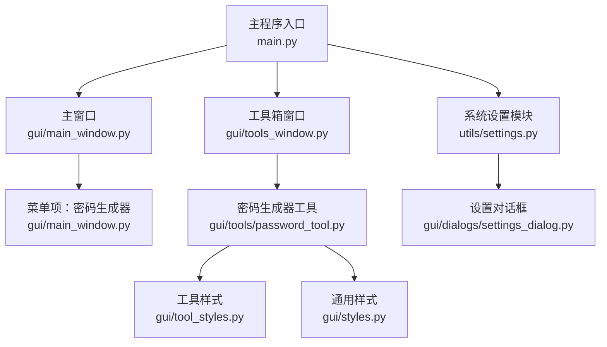
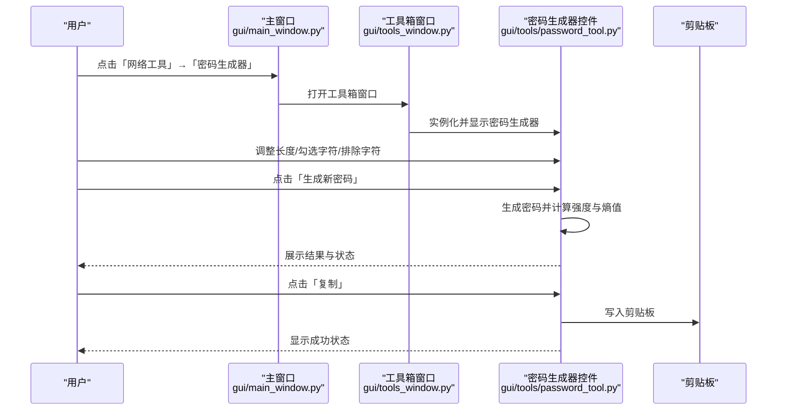
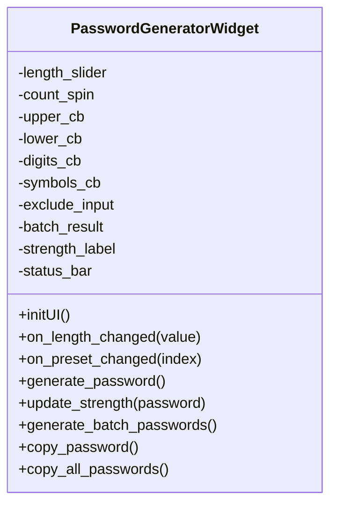
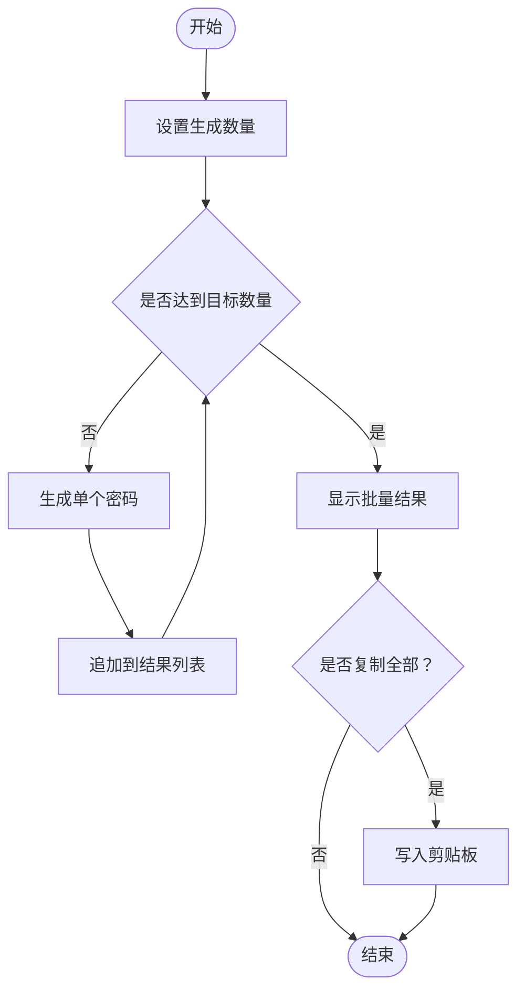
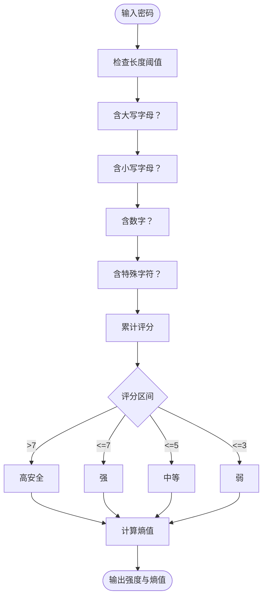
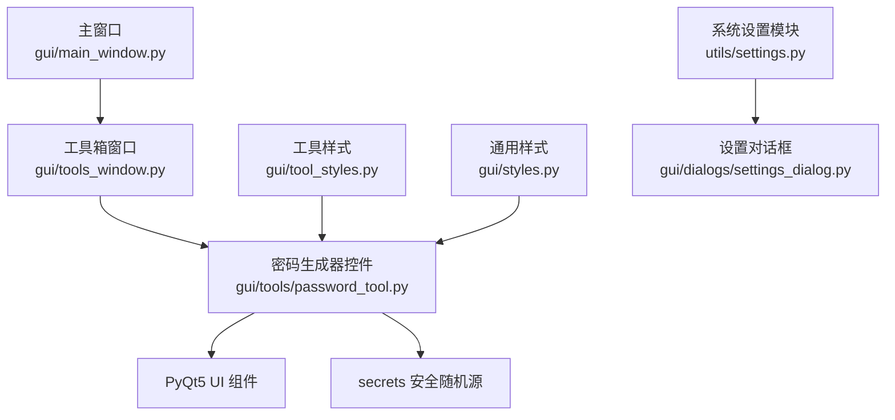

# 密码生成器工具

<cite>
**本文引用的文件**
- [密码工具实现](file://opensource/NetOps-toolkit/gui/tools/password_tool.py)
- [主程序入口](file://opensource/NetOps-toolkit/main.py)
- [主窗口与菜单集成](file://opensource/NetOps-toolkit/gui/main_window.py)
- [网络工具箱窗口](file://opensource/NetOps-toolkit/gui/tools_window.py)
- [系统设置模块](file://opensource/NetOps-toolkit/utils/settings.py)
- [工具样式定义](file://opensource/NetOps-toolkit/gui/tool_styles.py)
- [通用样式定义](file://opensource/NetOps-toolkit/gui/styles.py)
- [设置对话框](file://opensource/NetOps-toolkit/gui/dialogs/settings_dialog.py)
</cite>

## 目录
1. [简介](#简介)
2. [项目结构](#项目结构)
3. [核心组件](#核心组件)
4. [架构总览](#架构总览)
5. [详细组件分析](#详细组件分析)
6. [依赖关系分析](#依赖关系分析)
7. [性能考量](#性能考量)
8. [故障排查指南](#故障排查指南)
9. [结论](#结论)
10. [附录](#附录)

## 简介
本指南面向“密码生成器工具”的使用者与维护者，系统阐述其安全密码生成功能、强度评估机制、字符集与长度配置、特殊字符规则、批量生成能力以及在不同场景下的应用策略。同时提供安全策略配置建议、随机性算法说明、密码存储与管理最佳实践，帮助用户在账户安全、系统管理与临时访问等场景中高效、安全地生成与使用密码。

## 项目结构
密码生成器作为网络工具箱的一个独立工具集成于 GUI 系统中，通过主程序入口启动，挂载于主窗口菜单与工具箱窗口中，采用 PyQt5 构建图形界面，并以统一样式系统进行渲染。

**图表来源**
- [主程序入口:25-43](file://opensource/NetOps-toolkit/main.py#L25-L43)
- [主窗口与菜单集成:371-435](file://opensource/NetOps-toolkit/gui/main_window.py#L371-L435)
- [网络工具箱窗口:28-77](file://opensource/NetOps-toolkit/gui/tools_window.py#L28-L77)
- [密码工具实现:28-198](file://opensource/NetOps-toolkit/gui/tools/password_tool.py#L28-L198)
- [系统设置模块:27-85](file://opensource/NetOps-toolkit/utils/settings.py#L27-L85)
- [工具样式定义:461-490](file://opensource/NetOps-toolkit/gui/tool_styles.py#L461-L490)
- [通用样式定义:8-486](file://opensource/NetOps-toolkit/gui/styles.py#L8-L486)
- [设置对话框:21-198](file://opensource/NetOps-toolkit/gui/dialogs/settings_dialog.py#L21-L198)

**章节来源**
- [主程序入口:25-43](file://opensource/NetOps-toolkit/main.py#L25-L43)
- [主窗口与菜单集成:371-435](file://opensource/NetOps-toolkit/gui/main_window.py#L371-L435)
- [网络工具箱窗口:28-77](file://opensource/NetOps-toolkit/gui/tools_window.py#L28-L77)
- [密码工具实现:28-198](file://opensource/NetOps-toolkit/gui/tools/password_tool.py#L28-L198)
- [系统设置模块:27-85](file://opensource/NetOps-toolkit/utils/settings.py#L27-L85)
- [工具样式定义:461-490](file://opensource/NetOps-toolkit/gui/tool_styles.py#L461-L490)
- [通用样式定义:8-486](file://opensource/NetOps-toolkit/gui/styles.py#L8-L486)
- [设置对话框:21-198](file://opensource/NetOps-toolkit/gui/dialogs/settings_dialog.py#L21-L198)

## 核心组件
- 密码生成器控件：提供滑动条长度调节、字符类型勾选、排除字符输入、批量生成与复制功能，并内置强度评估与熵值提示。
- 主窗口菜单集成：在“网络工具”菜单下提供“密码生成器”入口，支持从主窗口直接打开。
- 工具箱窗口集成：在“网络工具箱”窗口中以标签页形式展示密码生成器工具。
- 样式系统：统一的工具样式与通用样式，确保界面一致性与可读性。
- 设置模块与对话框：提供系统设置（如主题、语言、默认设备等）的读取与持久化，便于全局配置。

**章节来源**
- [密码工具实现:28-198](file://opensource/NetOps-toolkit/gui/tools/password_tool.py#L28-L198)
- [主窗口与菜单集成:403-405](file://opensource/NetOps-toolkit/gui/main_window.py#L403-L405)
- [网络工具箱窗口:68-68](file://opensource/NetOps-toolkit/gui/tools_window.py#L68-L68)
- [工具样式定义:461-490](file://opensource/NetOps-toolkit/gui/tool_styles.py#L461-L490)
- [通用样式定义:8-486](file://opensource/NetOps-toolkit/gui/styles.py#L8-L486)
- [系统设置模块:27-85](file://opensource/NetOps-toolkit/utils/settings.py#L27-L85)
- [设置对话框:21-198](file://opensource/NetOps-toolkit/gui/dialogs/settings_dialog.py#L21-L198)

## 架构总览
密码生成器工具的调用链路如下：用户通过主窗口或工具箱窗口触发，系统实例化密码生成器控件并渲染界面；用户交互后，控件根据配置生成密码并通过剪贴板复制；强度评估与熵值实时更新；系统设置模块负责持久化配置。

**图表来源**
- [主窗口与菜单集成:403-405](file://opensource/NetOps-toolkit/gui/main_window.py#L403-L405)
- [网络工具箱窗口:68-68](file://opensource/NetOps-toolkit/gui/tools_window.py#L68-L68)
- [密码工具实现:57-67](file://opensource/NetOps-toolkit/gui/tools/password_tool.py#L57-L67)
- [密码工具实现:220-250](file://opensource/NetOps-toolkit/gui/tools/password_tool.py#L220-L250)
- [密码工具实现:300-312](file://opensource/NetOps-toolkit/gui/tools/password_tool.py#L300-L312)

**章节来源**
- [主窗口与菜单集成:403-405](file://opensource/NetOps-toolkit/gui/main_window.py#L403-L405)
- [网络工具箱窗口:68-68](file://opensource/NetOps-toolkit/gui/tools_window.py#L68-L68)
- [密码工具实现:57-67](file://opensource/NetOps-toolkit/gui/tools/password_tool.py#L57-L67)
- [密码工具实现:220-250](file://opensource/NetOps-toolkit/gui/tools/password_tool.py#L220-L250)
- [密码工具实现:300-312](file://opensource/NetOps-toolkit/gui/tools/password_tool.py#L300-L312)

## 详细组件分析

### 密码生成器控件（PasswordGeneratorWidget）
- 功能概览
  - 单次密码生成：滑动条控制长度（范围 8-64），字符类型勾选（大写、小写、数字、特殊字符），排除字符输入，点击生成后显示结果并评估强度与熵值。
  - 批量密码生成：设置生成数量，批量生成并汇总显示，支持一键复制全部。
  - 复制功能：单个密码与批量密码均可复制至剪贴板。
- 强度评估与熵值
  - 强度评分基于长度阈值与字符类型覆盖率，分为弱、中等、强、高安全四档，并以颜色标识。
  - 熵值按字符集多样性和长度计算，用于直观反映密码的随机性与抗破解能力。
- 安全要点
  - 使用安全随机源生成密码，避免伪随机。
  - 支持排除易混淆字符，提升可读性与可用性。
  - 提供预设方案，满足不同安全等级需求。

**图表来源**
- [密码工具实现:28-198](file://opensource/NetOps-toolkit/gui/tools/password_tool.py#L28-L198)
- [密码工具实现:220-250](file://opensource/NetOps-toolkit/gui/tools/password_tool.py#L220-L250)
- [密码工具实现:251-286](file://opensource/NetOps-toolkit/gui/tools/password_tool.py#L251-L286)
- [密码工具实现:287-313](file://opensource/NetOps-toolkit/gui/tools/password_tool.py#L287-L313)

**章节来源**
- [密码工具实现:28-198](file://opensource/NetOps-toolkit/gui/tools/password_tool.py#L28-L198)
- [密码工具实现:220-250](file://opensource/NetOps-toolkit/gui/tools/password_tool.py#L220-L250)
- [密码工具实现:251-286](file://opensource/NetOps-toolkit/gui/tools/password_tool.py#L251-L286)
- [密码工具实现:287-313](file://opensource/NetOps-toolkit/gui/tools/password_tool.py#L287-L313)

### 预设方案与字符集配置
- 预设方案
  - 自定义：允许用户自由组合长度与字符类型。
  - 简单密码：8 位纯数字，适合低安全要求场景。
  - 普通密码：12 位字母数字，适合一般账户登录。
  - 强密码：16 位混合字符，推荐日常高强度账户。
  - 高安全：24 位全字符，适合系统管理员与核心资产。
  - WIFI 密钥：32 位全字符，适合无线网络密钥。
- 字符集
  - 大写字母、小写字母、数字、特殊字符集合可单独勾选。
  - 特殊字符默认包含常见符号，用户可根据需要调整。
  - 排除字符支持输入易混淆字符（如 0O1lI），提升可读性与减少误读风险。

**章节来源**
- [密码工具实现:114-125](file://opensource/NetOps-toolkit/gui/tools/password_tool.py#L114-L125)
- [密码工具实现:203-219](file://opensource/NetOps-toolkit/gui/tools/password_tool.py#L203-L219)
- [密码工具实现:223-236](file://opensource/NetOps-toolkit/gui/tools/password_tool.py#L223-L236)

### 批量生成与复制流程
- 批量生成
  - 用户设置生成数量，工具循环调用单次生成逻辑，汇总输出至文本区域。
  - 支持一键复制全部密码，便于集中导出或分发。
- 复制行为
  - 单个密码复制：将当前显示的密码写入剪贴板。
  - 全部密码复制：将批量结果整体复制到剪贴板。

**图表来源**
- [密码工具实现:287-313](file://opensource/NetOps-toolkit/gui/tools/password_tool.py#L287-L313)

**章节来源**
- [密码工具实现:287-313](file://opensource/NetOps-toolkit/gui/tools/password_tool.py#L287-L313)

### 强度评估与熵值计算
- 强度评分维度
  - 长度阈值：≥8、≥12、≥16 分别计分。
  - 字符类型覆盖率：大小写字母、数字、特殊字符均计分。
  - 特殊字符额外加分，鼓励使用多样化字符集。
- 强度等级
  - 弱：低长度与低多样性。
  - 中等：适中长度与基本多样性。
  - 强：较高长度与较全字符集。
  - 高安全：高长度与全字符集。
- 熵值
  - 基于字符集多样性和长度估算，数值越高表示随机性越强、越难被暴力破解。

**图表来源**
- [密码工具实现:251-286](file://opensource/NetOps-toolkit/gui/tools/password_tool.py#L251-L286)

**章节来源**
- [密码工具实现:251-286](file://opensource/NetOps-toolkit/gui/tools/password_tool.py#L251-L286)

### 随机性算法与安全策略
- 随机源
  - 工具使用安全随机源生成密码，确保不可预测性与均匀分布。
- 安全策略建议
  - 避免使用字典词、生日、连续序列等易猜测内容。
  - 优先启用特殊字符与足够长度，降低暴力破解成功率。
  - 对于敏感系统，建议采用高安全预设或自定义全字符集。
  - 定期轮换密码，避免长期不变。

**章节来源**
- [密码工具实现:243-244](file://opensource/NetOps-toolkit/gui/tools/password_tool.py#L243-L244)

### 密码存储与管理最佳实践
- 存储建议
  - 使用受信任的密码管理器保存生成的密码，避免明文存储于本地文件或剪贴板过久。
  - 对于系统级密码，建议加密存储并限制访问权限。
- 管理建议
  - 为不同账户与用途设置不同强度与字符集策略。
  - 批量生成后立即复制并导入到目标系统，缩短暴露窗口。
  - 定期审计与清理不再使用的密码。

**章节来源**
- [密码工具实现:287-313](file://opensource/NetOps-toolkit/gui/tools/password_tool.py#L287-L313)

### 应用场景下的生成策略
- 账户安全设置
  - 日常账户：普通密码或强密码预设，兼顾易用性与安全性。
  - 管理员账户：高安全预设，启用全字符集并适当增加长度。
- 系统管理密码
  - 设备管理口令：高安全预设，配合排除易混淆字符，提升可读性。
  - 服务账号：强密码或高安全预设，定期轮换。
- 临时密码生成
  - 一次性访问：使用强密码或高安全预设，生成后立即使用并清理痕迹。
  - 批量派发：使用批量生成功能，复制后集中导入目标系统。

**章节来源**
- [密码工具实现:114-125](file://opensource/NetOps-toolkit/gui/tools/password_tool.py#L114-L125)
- [密码工具实现:203-219](file://opensource/NetOps-toolkit/gui/tools/password_tool.py#L203-L219)

## 依赖关系分析
- 组件耦合
  - 密码生成器控件依赖 PyQt5 的 UI 控件与样式系统，内部逻辑自包含，耦合度低。
  - 主窗口与工具箱窗口通过动作与对话框机制集成工具，解耦良好。
- 外部依赖
  - Python 标准库：random、string、secrets。
  - 第三方库：PyQt5。
- 可能的循环依赖
  - 当前结构未发现循环依赖，模块职责清晰。

**图表来源**
- [密码工具实现:7-25](file://opensource/NetOps-toolkit/gui/tools/password_tool.py#L7-L25)
- [主窗口与菜单集成:500-547](file://opensource/NetOps-toolkit/gui/main_window.py#L500-L547)
- [网络工具箱窗口:68-68](file://opensource/NetOps-toolkit/gui/tools_window.py#L68-L68)
- [工具样式定义:461-490](file://opensource/NetOps-toolkit/gui/tool_styles.py#L461-L490)
- [通用样式定义:8-486](file://opensource/NetOps-toolkit/gui/styles.py#L8-L486)
- [系统设置模块:27-85](file://opensource/NetOps-toolkit/utils/settings.py#L27-L85)
- [设置对话框:21-198](file://opensource/NetOps-toolkit/gui/dialogs/settings_dialog.py#L21-L198)

**章节来源**
- [密码工具实现:7-25](file://opensource/NetOps-toolkit/gui/tools/password_tool.py#L7-L25)
- [主窗口与菜单集成:500-547](file://opensource/NetOps-toolkit/gui/main_window.py#L500-L547)
- [网络工具箱窗口:68-68](file://opensource/NetOps-toolkit/gui/tools_window.py#L68-L68)
- [工具样式定义:461-490](file://opensource/NetOps-toolkit/gui/tool_styles.py#L461-L490)
- [通用样式定义:8-486](file://opensource/NetOps-toolkit/gui/styles.py#L8-L486)
- [系统设置模块:27-85](file://opensource/NetOps-toolkit/utils/settings.py#L27-L85)
- [设置对话框:21-198](file://opensource/NetOps-toolkit/gui/dialogs/settings_dialog.py#L21-L198)

## 性能考量
- 生成效率
  - 单次与批量生成均为 O(n) 时间复杂度，其中 n 为密码长度；批量生成次数较少，性能影响可忽略。
- 内存占用
  - 批量生成会将多个字符串暂存于内存，建议合理设置生成数量上限，避免过大批次导致内存压力。
- UI 响应
  - 在大量生成时，界面可能短暂阻塞，建议在批量生成完成后统一刷新显示。

[本节为通用性能讨论，不直接分析具体文件]

## 故障排查指南
- 无法生成密码
  - 检查是否勾选了至少一种字符类型；若未勾选，控件会提示无效并阻止生成。
- 强度显示异常
  - 确认密码长度与字符类型是否满足强度评分条件；必要时调整字符集或长度。
- 复制失败
  - 确保系统剪贴板可用；在部分受限环境中，复制操作可能被安全策略拦截。
- 设置不生效
  - 系统设置模块负责持久化配置，若修改后未生效，检查设置文件是否存在且可写。

**章节来源**
- [密码工具实现:237-241](file://opensource/NetOps-toolkit/gui/tools/password_tool.py#L237-L241)
- [密码工具实现:251-286](file://opensource/NetOps-toolkit/gui/tools/password_tool.py#L251-L286)
- [密码工具实现:300-312](file://opensource/NetOps-toolkit/gui/tools/password_tool.py#L300-L312)
- [系统设置模块:40-54](file://opensource/NetOps-toolkit/utils/settings.py#L40-L54)

## 结论
密码生成器工具通过直观的 UI、灵活的字符集与长度配置、完善的强度评估与熵值提示，以及便捷的批量生成与复制能力，为不同场景下的密码生成提供了高效、安全的解决方案。结合安全策略与最佳实践，用户可在账户安全、系统管理与临时访问等场景中可靠地生成与管理密码。

[本节为总结性内容，不直接分析具体文件]

## 附录
- 快速上手
  - 从主窗口“网络工具”菜单打开“密码生成器”，或直接打开“网络工具箱”窗口。
  - 使用滑动条设置长度，勾选所需字符类型，必要时在“排除字符”中输入易混淆字符。
  - 点击“生成新密码”查看结果与强度提示，点击“复制”将密码写入剪贴板。
  - 需要批量生成时，设置数量并点击“批量生成”，随后可复制全部密码。
- 安全建议
  - 优先使用高安全预设或自定义全字符集。
  - 定期轮换密码，避免长期重复使用。
  - 将生成的密码妥善存储于受信任的密码管理器中。

[本节为通用指导，不直接分析具体文件]