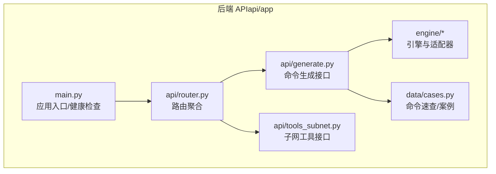
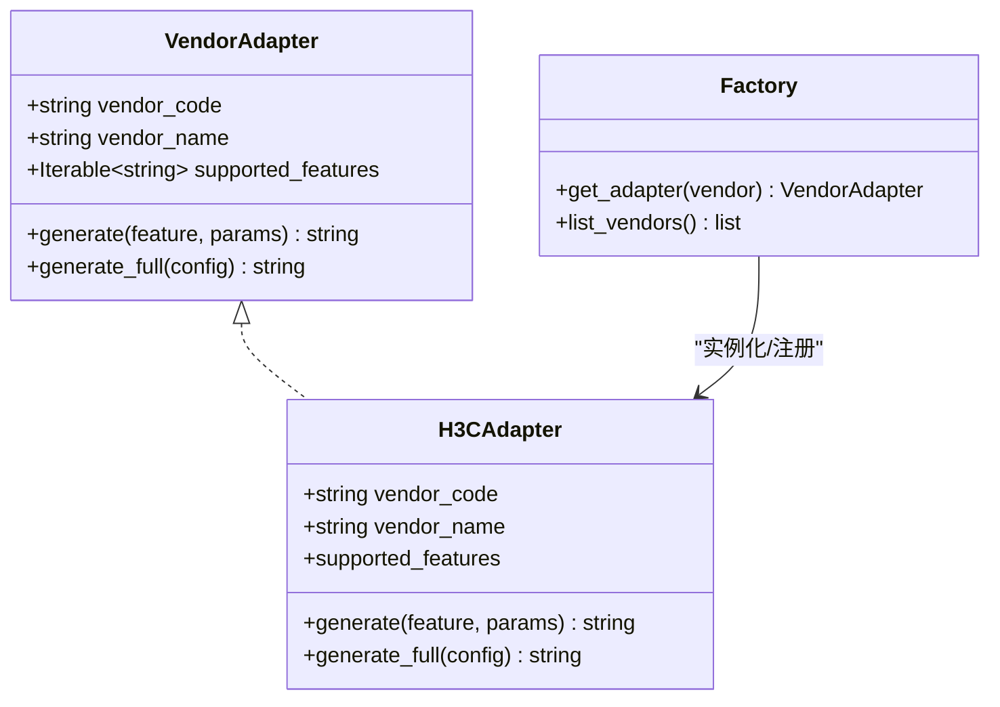
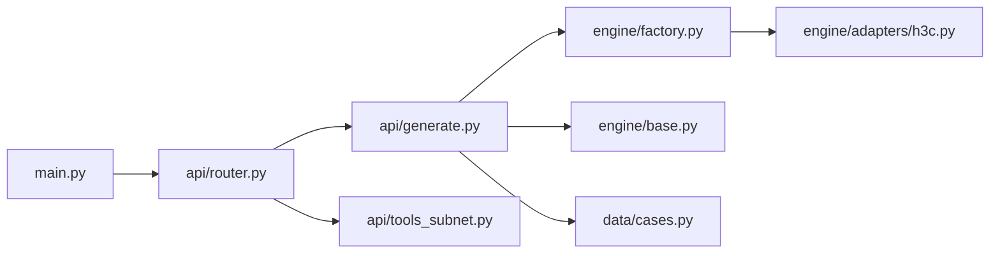

# 快速开始

<cite>
**本文引用的文件**
- [api/README.md](file://api/README.md)
- [api/requirements.txt](file://api/requirements.txt)
- [api/app/main.py](file://api/app/main.py)
- [api/app/api/router.py](file://api/app/api/router.py)
- [api/app/api/generate.py](file://api/app/api/generate.py)
- [api/app/api/tools_subnet.py](file://api/app/api/tools_subnet.py)
- [api/app/engine/base.py](file://api/app/engine/base.py)
- [api/app/engine/factory.py](file://api/app/engine/factory.py)
- [api/app/engine/adapters/h3c.py](file://api/app/engine/adapters/h3c.py)
- [api/app/data/cases.py](file://api/app/data/cases.py)
- [scripts/sync-from-netops.ps1](file://scripts/sync-from-netops.ps1)
- [scripts/clone-opensource.ps1](file://scripts/clone-opensource.ps1)
- [docs/NetOps-toolkit复用方案.md](file://docs/NetOps-toolkit复用方案.md)
- [opensource/NetOps-toolkit/README.md](file://opensource/NetOps-toolkit/README.md)
</cite>

## 目录
1. [简介](#简介)
2. [项目结构](#项目结构)
3. [核心组件](#核心组件)
4. [架构总览](#架构总览)
5. [详细组件分析](#详细组件分析)
6. [依赖分析](#依赖分析)
7. [性能考虑](#性能考虑)
8. [故障排查指南](#故障排查指南)
9. [结论](#结论)
10. [附录](#附录)

## 简介
本指南面向首次接触 NetCmdGen 的开发者，帮助你在最短时间内完成环境准备、依赖安装、代码同步与开发服务器启动，并体验核心功能（健康检查、子网计算工具、命令生成接口）。文档同时解释项目目录结构与关键文件职责，提供常见问题的解决方案与环境验证方法。

## 项目结构
NetCmdGen 采用前后端分离思路：后端为基于 FastAPI 的 API 服务，前端为 Vue 3 + X6 工作台（前端工程位于 web/，本快速开始聚焦后端 API）。后端核心目录与职责如下：
- api/app：FastAPI 应用入口与业务模块
  - main.py：应用入口与健康检查端点
  - api/router.py：路由聚合
  - api/generate.py：命令生成相关接口
  - api/tools_subnet.py：子网计算工具接口
  - engine/：命令生成引擎与适配器
  - data/cases.py：命令速查与最佳实践数据
  - tools/：网络工具（子网、Ping、Traceroute、端口扫描、DNS）
  - core/：通用工具（参数校验等）
- scripts/：同步与克隆脚本
- docs/：复用方案与分析文档
- opensource/NetOps-toolkit：复用的开源内核（MIT 协议）

**图表来源**
- [api/app/main.py:1-29](file://api/app/main.py#L1-L29)
- [api/app/api/router.py:1-10](file://api/app/api/router.py#L1-L10)
- [api/app/api/generate.py:1-77](file://api/app/api/generate.py#L1-L77)
- [api/app/api/tools_subnet.py:1-50](file://api/app/api/tools_subnet.py#L1-L50)
- [api/app/data/cases.py:1-377](file://api/app/data/cases.py#L1-L377)

**章节来源**
- [api/README.md:25-40](file://api/README.md#L25-L40)

## 核心组件
- 应用入口与健康检查：在应用启动后可通过健康检查端点确认服务可用。
- 路由聚合：将“命令生成”和“网络工具”两类接口统一挂载到 /api 前缀下。
- 命令生成引擎：通过适配器工厂为不同厂商提供统一接口，当前已内置 H3C 适配器。
- 数据与工具：内置命令速查数据与网络工具（子网计算等），可直接对外提供 API。

**章节来源**
- [api/app/main.py:1-29](file://api/app/main.py#L1-L29)
- [api/app/api/router.py:1-10](file://api/app/api/router.py#L1-L10)
- [api/app/engine/factory.py:1-39](file://api/app/engine/factory.py#L1-L39)
- [api/app/data/cases.py:1-377](file://api/app/data/cases.py#L1-L377)

## 架构总览
后端采用“适配器 + 工厂”的扩展架构，将不同厂商的配置生成器统一为“厂商代码 + 特性码 + 参数”的调用方式，从而实现多厂商命令生成的统一入口。

**图表来源**
- [api/app/engine/base.py:11-27](file://api/app/engine/base.py#L11-L27)
- [api/app/engine/adapters/h3c.py:14-42](file://api/app/engine/adapters/h3c.py#L14-L42)
- [api/app/engine/factory.py:20-39](file://api/app/engine/factory.py#L20-L39)

## 详细组件分析

### 安装与环境准备
- 环境要求
  - Python 3.8+（建议使用虚拟环境隔离依赖）
  - Windows/Linux/macOS（网络工具在容器中运行需额外安装系统工具）
- 前置依赖
  - Git（用于克隆与同步）
  - PowerShell（执行同步与克隆脚本）
- 可选：PyInstaller（桌面端打包，非 API 后端必需）

**章节来源**
- [opensource/NetOps-toolkit/README.md:193-197](file://opensource/NetOps-toolkit/README.md#L193-L197)

### 依赖安装流程
- 同步 NetOps-toolkit 可复用代码到 api/app
  - 执行脚本：powershell scripts/sync-from-netops.ps1
  - 该脚本会将 NetOps-toolkit 中的网络工具、校验器、命令手册与配置案例等文件按约定复制到 api/app 对应目录，并创建必要的空 __init__.py 包标记
- 安装后端依赖
  - 在 api/ 目录下执行 pip install -r requirements.txt
  - 依赖包括：FastAPI、Uvicorn、Pydantic、python-whois 等

**章节来源**
- [api/README.md:9-18](file://api/README.md#L9-L18)
- [scripts/sync-from-netops.ps1:1-121](file://scripts/sync-from-netops.ps1#L1-L121)
- [api/requirements.txt:1-5](file://api/requirements.txt#L1-L5)

### 开发服务器启动
- 启动命令
  - uvicorn app.main:app --reload --port 8000
- 访问地址
  - 健康检查：http://127.0.0.1:8000/api/health
  - 子网计算：http://127.0.0.1:8000/api/tools/subnet?ip=192.168.1.10&mask=255.255.255.0
  - 接口文档：http://127.0.0.1:8000/docs

**章节来源**
- [api/README.md:16-24](file://api/README.md#L16-L24)
- [api/app/main.py:25-28](file://api/app/main.py#L25-L28)

### 首次运行与核心功能体验
- 健康检查
  - 请求：GET /api/health
  - 预期响应：包含服务状态与名称的 JSON 对象
- 子网计算工具
  - 请求：GET /api/tools/subnet?ip=192.168.1.10&mask=255.255.255.0
  - 预期响应：包含网络地址、广播地址、可用主机范围等字段的 JSON 对象
- 命令生成接口（示例：H3C VLAN）
  - 请求：POST /api/generate
  - 请求体：{
      "vendor": "h3c",
      "feature": "vlan",
      "params": { /* H3C VLAN 参数字典 */ }
    }
  - 预期响应：包含厂商、特性码与生成的命令片段
- 列出已支持厂商
  - 请求：GET /api/vendors
  - 预期响应：包含厂商代码、名称与支持的特性码列表

**章节来源**
- [api/app/api/tools_subnet.py:9-22](file://api/app/api/tools_subnet.py#L9-L22)
- [api/app/api/generate.py:53-76](file://api/app/api/generate.py#L53-L76)
- [api/app/engine/factory.py:29-39](file://api/app/engine/factory.py#L29-L39)

### 目录结构与关键文件说明
- api/app/main.py：FastAPI 应用入口，注册 CORS 中间件与 /api 前缀路由，提供健康检查端点
- api/app/api/router.py：聚合路由，挂载“工具”与“生成”两个子路由
- api/app/api/generate.py：命令生成接口，支持按特性生成命令片段与生成完整配置脚本
- api/app/api/tools_subnet.py：子网计算工具接口，提供基础计算、子网划分与 IP 范围转 CIDR
- api/app/engine/base.py：厂商适配器协议定义，约束统一接口
- api/app/engine/factory.py：适配器工厂，负责厂商注册与获取
- api/app/engine/adapters/h3c.py：H3C 适配器，将特性码映射到 H3CConfigGenerator 的静态方法
- api/app/data/cases.py：命令速查与最佳实践数据（华为/H3C/锐捷/迈普）
- scripts/sync-from-netops.ps1：将 NetOps-toolkit 的可复用代码同步到 api/app 的脚本
- docs/NetOps-toolkit复用方案.md：复用清单与接口归一化改造方案
- opensource/NetOps-toolkit/README.md：NetOps-toolkit 的功能与目录结构说明

**章节来源**
- [api/app/main.py:1-29](file://api/app/main.py#L1-L29)
- [api/app/api/router.py:1-10](file://api/app/api/router.py#L1-L10)
- [api/app/api/generate.py:1-77](file://api/app/api/generate.py#L1-L77)
- [api/app/api/tools_subnet.py:1-50](file://api/app/api/tools_subnet.py#L1-L50)
- [api/app/engine/base.py:11-27](file://api/app/engine/base.py#L11-L27)
- [api/app/engine/factory.py:1-39](file://api/app/engine/factory.py#L1-L39)
- [api/app/engine/adapters/h3c.py:1-42](file://api/app/engine/adapters/h3c.py#L1-L42)
- [api/app/data/cases.py:1-377](file://api/app/data/cases.py#L1-L377)
- [scripts/sync-from-netops.ps1:1-121](file://scripts/sync-from-netops.ps1#L1-L121)
- [docs/NetOps-toolkit复用方案.md:43-81](file://docs/NetOps-toolkit复用方案.md#L43-L81)
- [opensource/NetOps-toolkit/README.md:107-153](file://opensource/NetOps-toolkit/README.md#L107-L153)

## 依赖分析
- 外部依赖
  - FastAPI：提供 ASGI 应用与 OpenAPI 文档
  - Uvicorn：ASGI 服务器，支持热重载
  - Pydantic：数据模型与校验
  - python-whois：Whois 查询能力
- 内部依赖关系
  - main.py 引入 router，router 引入 generate 与 tools_subnet
  - generate 依赖 engine 工厂与适配器
  - tools_subnet 依赖 tools 子模块（此处为子网计算）
  - engine 依赖 vendors 与 adapters

**图表来源**
- [api/app/main.py:1-29](file://api/app/main.py#L1-L29)
- [api/app/api/router.py:1-10](file://api/app/api/router.py#L1-L10)
- [api/app/api/generate.py:1-77](file://api/app/api/generate.py#L1-L77)
- [api/app/api/tools_subnet.py:1-50](file://api/app/api/tools_subnet.py#L1-L50)
- [api/app/engine/factory.py:1-39](file://api/app/engine/factory.py#L1-L39)
- [api/app/engine/adapters/h3c.py:1-42](file://api/app/engine/adapters/h3c.py#L1-L42)
- [api/app/engine/base.py:1-36](file://api/app/engine/base.py#L1-L36)
- [api/app/data/cases.py:1-377](file://api/app/data/cases.py#L1-L377)

**章节来源**
- [api/requirements.txt:1-5](file://api/requirements.txt#L1-L5)

## 性能考虑
- 热重载与开发效率：开发阶段启用 reload，便于快速迭代
- 并发与生成稳定性：源项目 Generator 类为静态方法，无全局状态；但部分输出依赖时间戳，测试时需进行 mock
- 网络工具安全：端口扫描等工具在 Web 化后需加白名单、限频与鉴权，避免被滥用

**章节来源**
- [docs/NetOps-toolkit复用方案.md:222-223](file://docs/NetOps-toolkit复用方案.md#L222-L223)

## 故障排查指南
- 同步脚本找不到源目录
  - 现象：执行 scripts/sync-from-netops.ps1 报错提示源目录不存在
  - 处理：确认 opensource/NetOps-toolkit 已存在；若缺失，可先执行 scripts/clone-opensource.ps1 克隆后再同步
- 依赖安装失败
  - 现象：pip install -r requirements.txt 报错
  - 处理：检查网络与代理；确保 Python 3.8+；必要时使用虚拟环境
- 服务器启动失败
  - 现象：uvicorn 启动报错或端口占用
  - 处理：更换端口或释放占用端口；确认 app.main:app 模块路径正确
- 健康检查不可用
  - 现象：访问 /api/health 返回 404 或 500
  - 处理：检查 main.py 是否正确挂载 /api 前缀；确认路由聚合是否生效
- 子网工具返回错误
  - 现象：/api/tools/subnet 返回 400
  - 处理：检查 IP 与掩码格式；确认掩码为点分十进制或前缀长度之一
- 命令生成返回 400/500
  - 现象：/api/generate 或 /api/generate/full 返回错误
  - 处理：确认厂商代码与特性码正确；检查参数结构与类型；查看后端日志定位异常

**章节来源**
- [scripts/sync-from-netops.ps1:29-31](file://scripts/sync-from-netops.ps1#L29-L31)
- [api/README.md:16-24](file://api/README.md#L16-L24)
- [api/app/api/tools_subnet.py:18-22](file://api/app/api/tools_subnet.py#L18-L22)
- [api/app/api/generate.py:54-76](file://api/app/api/generate.py#L54-L76)

## 结论
通过本快速入门指南，你已经完成了环境准备、依赖安装、代码同步与开发服务器启动，并体验了健康检查、子网计算与命令生成等核心功能。建议在本地进一步探索命令速查与更多网络工具接口，为后续前端集成做好准备。

## 附录

### 常用命令与预期行为
- 同步可复用代码
  - 命令：powershell scripts/sync-from-netops.ps1
  - 说明：将 NetOps-toolkit 的网络工具、校验器、命令手册与案例复制到 api/app
- 安装依赖
  - 命令：pip install -r api/requirements.txt
  - 说明：安装 FastAPI、Uvicorn、Pydantic、python-whois
- 启动开发服务器
  - 命令：uvicorn app.main:app --reload --port 8000
  - 说明：监听 8000 端口，支持热重载
- 健康检查
  - 请求：GET /api/health
  - 期望：返回包含服务状态的 JSON
- 子网计算
  - 请求：GET /api/tools/subnet?ip=192.168.1.10&mask=255.255.255.0
  - 期望：返回网络地址、广播地址、可用主机范围等
- 命令生成（H3C VLAN）
  - 请求：POST /api/generate
  - 期望：返回厂商、特性码与生成的命令片段
- 列出厂商
  - 请求：GET /api/vendors
  - 期望：返回厂商列表与支持的特性码

**章节来源**
- [api/README.md:9-24](file://api/README.md#L9-L24)
- [api/app/api/tools_subnet.py:9-22](file://api/app/api/tools_subnet.py#L9-L22)
- [api/app/api/generate.py:53-76](file://api/app/api/generate.py#L53-L76)
- [api/app/engine/factory.py:29-39](file://api/app/engine/factory.py#L29-L39)