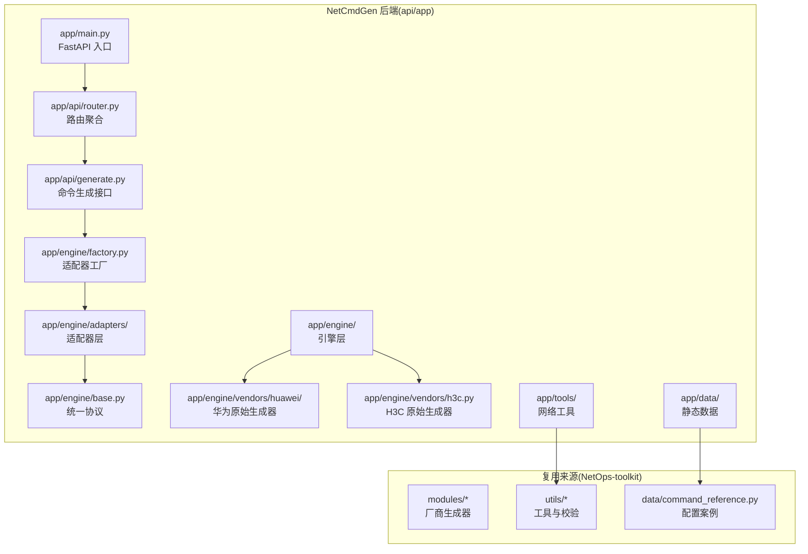
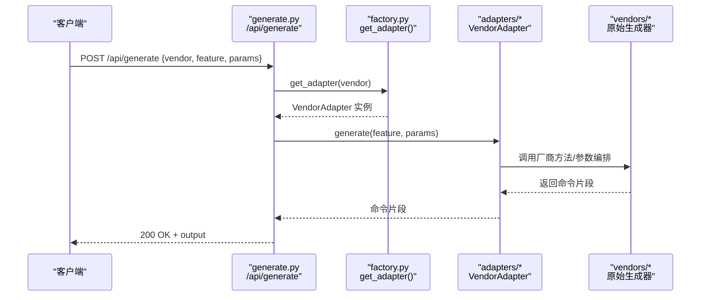
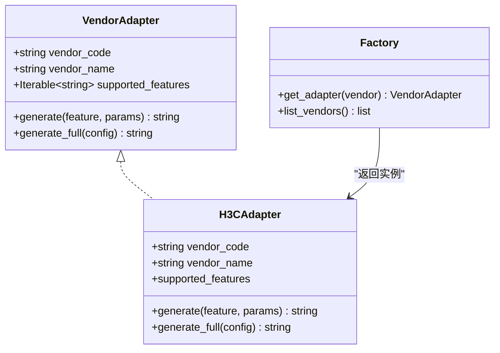
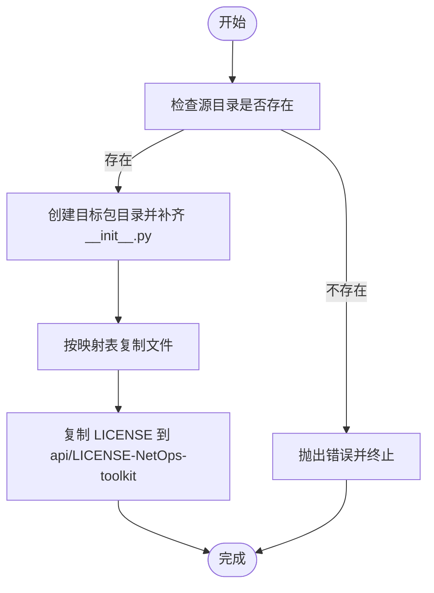
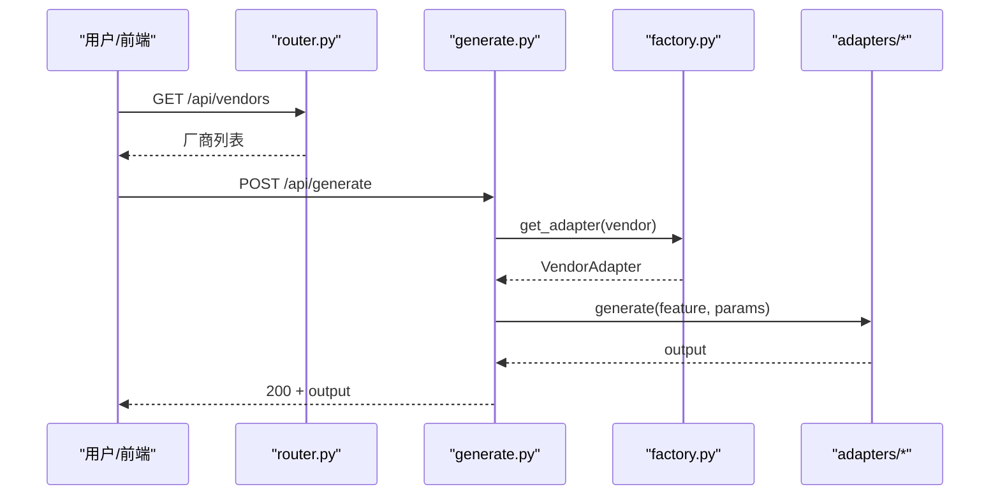
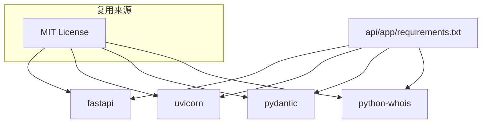

# 代码复用策略

<cite>
**本文引用的文件**   
- [NetOps-toolkit复用方案.md](file://docs/NetOps-toolkit复用方案.md)
- [开源项目复用分析.md](file://docs/开源项目复用分析.md)
- [api/README.md](file://api/README.md)
- [opensource/NetOps-toolkit/README.md](file://opensource/NetOps-toolkit/README.md)
- [scripts/sync-from-netops.ps1](file://scripts/sync-from-netops.ps1)
- [api/app/engine/base.py](file://api/app/engine/base.py)
- [api/app/engine/adapters/h3c.py](file://api/app/engine/adapters/h3c.py)
- [api/app/engine/factory.py](file://api/app/engine/factory.py)
- [api/app/main.py](file://api/app/main.py)
- [api/app/api/router.py](file://api/app/api/router.py)
- [api/app/api/generate.py](file://api/app/api/generate.py)
- [api/app/tools/subnet.py](file://api/app/tools/subnet.py)
- [api/app/data/manual/huawei.py](file://api/app/data/manual/huawei.py)
- [api/app/requirements.txt](file://api/app/requirements.txt)
</cite>

## 目录
1. [简介](#简介)
2. [项目结构](#项目结构)
3. [核心组件](#核心组件)
4. [架构总览](#架构总览)
5. [详细组件分析](#详细组件分析)
6. [依赖分析](#依赖分析)
7. [性能考量](#性能考量)
8. [故障排查指南](#故障排查指南)
9. [结论](#结论)
10. [附录](#附录)

## 简介
本指南面向将 NetOps-toolkit 的核心能力复用到 NetCmdGen 后端的工程实践，系统阐述可直接复用的文件清单、需要改造的模块、接口归一化与适配器层设计、文件同步脚本的使用与维护策略、MIT 许可证合规要点、工作量与风险评估以及质量保障措施，并给出从源码分析到落地复用的完整操作流程。

## 项目结构
NetCmdGen 后端采用 FastAPI，围绕“命令生成引擎 + 网络工具 + 命令速查”三大能力域组织代码。核心复用来源为 opensource/NetOps-toolkit，其模块化良好，便于按需迁移与适配。

**图表来源**
- [api/app/main.py:1-29](file://api/app/main.py#L1-L29)
- [api/app/api/router.py:1-10](file://api/app/api/router.py#L1-L10)
- [api/app/api/generate.py:1-77](file://api/app/api/generate.py#L1-L77)
- [api/app/engine/base.py:1-36](file://api/app/engine/base.py#L1-L36)
- [api/app/engine/adapters/h3c.py:1-42](file://api/app/engine/adapters/h3c.py#L1-L42)
- [api/app/engine/factory.py:1-39](file://api/app/engine/factory.py#L1-L39)
- [api/app/engine/vendors/h3c.py:1-200](file://api/app/engine/vendors/h3c.py#L1-L200)
- [api/app/engine/vendors/huawei/basic.py:1-200](file://api/app/engine/vendors/huawei/basic.py#L1-L200)
- [api/app/tools/subnet.py:1-280](file://api/app/tools/subnet.py#L1-L280)
- [api/app/data/manual/huawei.py:1-200](file://api/app/data/manual/huawei.py#L1-L200)

**章节来源**
- [api/README.md:1-47](file://api/README.md#L1-L47)
- [docs/NetOps-toolkit复用方案.md:43-81](file://docs/NetOps-toolkit复用方案.md#L43-L81)

## 核心组件
- 引擎统一协议：定义 VendorAdapter 协议，约束厂商适配器的接口风格与能力边界，确保“一个 API、多厂商通用”的可扩展性。
- 适配器层：针对不同厂商的输入/输出风格差异，提供 Adapter 将其统一到协议接口；H3C 已具备统一 dict 接口，适配成本最低；华为等厂商需进行参数编排。
- 适配器工厂：集中注册与获取适配器实例，支持按厂商代码动态选择。
- 网络工具与命令速查：直接复用 NetOps-toolkit 的纯函数工具与命令手册数据，零改造接入 FastAPI。
- 文件同步脚本：自动化将上游可复用文件批量复制到目标路径，保留 MIT 许可证文件。

**章节来源**
- [api/app/engine/base.py:11-36](file://api/app/engine/base.py#L11-L36)
- [api/app/engine/adapters/h3c.py:14-42](file://api/app/engine/adapters/h3c.py#L14-L42)
- [api/app/engine/factory.py:14-39](file://api/app/engine/factory.py#L14-L39)
- [docs/NetOps-toolkit复用方案.md:43-81](file://docs/NetOps-toolkit复用方案.md#L43-L81)
- [scripts/sync-from-netops.ps1:61-121](file://scripts/sync-from-netops.ps1#L61-L121)

## 架构总览
下图展示了从 API 请求到厂商生成器的调用链路，以及适配器层如何实现接口归一化。

**图表来源**
- [api/app/api/generate.py:53-64](file://api/app/api/generate.py#L53-L64)
- [api/app/engine/factory.py:20-26](file://api/app/engine/factory.py#L20-L26)
- [api/app/engine/adapters/h3c.py:32-38](file://api/app/engine/adapters/h3c.py#L32-L38)

## 详细组件分析

### 接口归一化与适配器层设计
- 统一协议：VendorAdapter 协议规定 vendor_code、vendor_name、supported_features 以及 generate()/generate_full() 方法，确保调用方无需感知厂商差异。
- H3C 适配器：由于源码已提供统一 dict 接口，适配器仅做特性码到方法的映射，实现最简化。
- 华为适配器：需要将细粒度参数编排为 dict 后调用对应生成器方法，或复用已有 generate_*_all 方法。
- 工厂注册：新增厂商只需实现适配器并注册到工厂字典，即可被统一调度。

**图表来源**
- [api/app/engine/base.py:11-36](file://api/app/engine/base.py#L11-L36)
- [api/app/engine/adapters/h3c.py:14-42](file://api/app/engine/adapters/h3c.py#L14-L42)
- [api/app/engine/factory.py:14-39](file://api/app/engine/factory.py#L14-L39)

**章节来源**
- [docs/NetOps-toolkit复用方案.md:84-180](file://docs/NetOps-toolkit复用方案.md#L84-L180)
- [api/app/engine/base.py:11-36](file://api/app/engine/base.py#L11-L36)
- [api/app/engine/adapters/h3c.py:14-42](file://api/app/engine/adapters/h3c.py#L14-L42)
- [api/app/engine/factory.py:14-39](file://api/app/engine/factory.py#L14-L39)

### 可直接复用的文件清单与迁移策略
- 网络工具：子网计算、Ping、Traceroute、端口扫描、DNS/Whois 等纯函数模块，直接复制到 api/app/tools 并接入 FastAPI。
- 参数校验器：validator.py 的统一校验函数签名，直接迁移至 core/validator.py。
- 命令手册与案例：将华为/H3C/锐捷/迈普的手册数据与配置案例复制到 api/app/data/manual 与 api/app/data/cases。
- 厂商生成器：将 modules/* 原始生成器迁移至 api/app/engine/vendors/*，保持源码零修改，通过适配器层统一接口。

**章节来源**
- [docs/NetOps-toolkit复用方案.md:43-81](file://docs/NetOps-toolkit复用方案.md#L43-L81)
- [scripts/sync-from-netops.ps1:61-121](file://scripts/sync-from-netops.ps1#L61-L121)

### 文件同步脚本使用与维护
- 作用：将 opensource/NetOps-toolkit 的可复用文件批量复制到 api/app，并创建必要的空 __init__.py 包目录。
- 使用：在仓库根目录执行脚本，自动完成目录准备、文件复制与许可证拷贝。
- 维护：上游更新后重新运行脚本，确保下游版本与上游一致；如需定制，可在脚本基础上增加差异处理或白名单。

**图表来源**
- [scripts/sync-from-netops.ps1:19-121](file://scripts/sync-from-netops.ps1#L19-L121)

**章节来源**
- [scripts/sync-from-netops.ps1:1-121](file://scripts/sync-from-netops.ps1#L1-121)
- [api/README.md:9-18](file://api/README.md#L9-L18)

### 命令生成 API 与路由
- 路由聚合：api/api/router.py 将 tools 与 generate 路由整合到 /api 前缀下。
- 生成接口：generate.py 定义请求模型与响应模型，提供 /api/generate 与 /api/generate/full 两个端点，并通过工厂获取适配器执行生成。
- 健康检查：app/main.py 提供 /api/health 用于服务可用性探测。

**图表来源**
- [api/app/api/router.py:4-10](file://api/app/api/router.py#L4-L10)
- [api/app/api/generate.py:48-77](file://api/app/api/generate.py#L48-L77)
- [api/app/engine/factory.py:20-39](file://api/app/engine/factory.py#L20-L39)

**章节来源**
- [api/app/api/router.py:1-10](file://api/app/api/router.py#L1-L10)
- [api/app/api/generate.py:1-77](file://api/app/api/generate.py#L1-L77)
- [api/app/main.py:25-29](file://api/app/main.py#L25-L29)

### 网络工具与命令速查
- 子网计算：api/app/tools/subnet.py 提供 IP/掩码互转、CIDR 计算、子网划分等纯函数，可直接作为 FastAPI 路由使用。
- 命令速查：api/app/data/manual/*.py 为命令手册数据字典，可直接导入供前端检索与展示。

**章节来源**
- [api/app/tools/subnet.py:1-280](file://api/app/tools/subnet.py#L1-L280)
- [api/app/data/manual/huawei.py:1-200](file://api/app/data/manual/huawei.py#L1-L200)

## 依赖分析
- 后端依赖：FastAPI、Uvicorn、Pydantic、python-whois（用于 DNS/Whois 工具）。
- 复用来源：NetOps-toolkit 为 MIT 协议，可商用，需保留 LICENSE 文件并在项目中致谢。

**图表来源**
- [api/app/requirements.txt:1-5](file://api/app/requirements.txt#L1-L5)
- [opensource/NetOps-toolkit/README.md:233-236](file://opensource/NetOps-toolkit/README.md#L233-L236)

**章节来源**
- [api/app/requirements.txt:1-5](file://api/app/requirements.txt#L1-L5)
- [opensource/NetOps-toolkit/README.md:233-236](file://opensource/NetOps-toolkit/README.md#L233-L236)

## 性能考量
- 适配器层为无状态对象，可复用；工厂采用单例字典缓存实例，降低对象创建开销。
- 网络工具多为纯函数与少量系统调用，性能瓶颈通常不在工具本身，而在于外部系统（如 ping/traceroute 的系统支持）。
- 建议在容器环境中安装所需系统工具（如 iputils-ping、traceroute），确保 Web 化后工具可用。

[本节为通用指导，不直接分析具体文件]

## 故障排查指南
- 适配器未注册：调用 /api/generate 时若返回“厂商不支持”，检查工厂注册表是否包含该厂商。
- 特性码不支持：若返回“特性不支持”，检查适配器的 supported_features 与特性码是否一致。
- 端口扫描安全风险：在 Web 化后需限制目标白名单、限频与鉴权，避免被滥用。
- Docker 环境：确保容器内安装了 ping/traceroute 等系统工具。

**章节来源**
- [api/app/engine/factory.py:20-26](file://api/app/engine/factory.py#L20-L26)
- [api/app/engine/base.py:30-36](file://api/app/engine/base.py#L30-L36)
- [docs/NetOps-toolkit复用方案.md:217-223](file://docs/NetOps-toolkit复用方案.md#L217-L223)

## 结论
通过接口归一化与适配器层，NetOps-toolkit 的核心能力可低成本复用到 NetCmdGen 后端。H3C 适配成本最低，华为等厂商需进行参数编排；网络工具与命令手册可零改造接入。配合文件同步脚本与 MIT 许可证合规要求，可在较短时间内完成 MVP 并持续迭代。

[本节为总结性内容，不直接分析具体文件]

## 附录

### 复用工作量评估与里程碑
- M1 基础设施：0.5 周（FastAPI 脚手架、依赖安装）
- M2 命令引擎 MVP（H3C + 华为 + 锐捷 + 迈普）：约 1 周（适配器编排）
- M3 拓扑画图：约 1 周（X6/drawio 现成方案）
- M4 命令引擎扩展（剩余厂商 + 模板化）：约 3 周（自研为主）
- M5-M7：按需推进

**章节来源**
- [docs/NetOps-toolkit复用方案.md:195-207](file://docs/NetOps-toolkit复用方案.md#L195-L207)

### MIT 许可证合规要求与法律注意事项
- 必须在项目根目录保留 LICENSE-NetOps-toolkit 文件，并在 README 致谢区注明来源。
- 不得直接引用源项目的截图或 UI 资源。
- 命令准确性风险：源项目自身存在命令差异风险，需通过真机/模拟器回归测试验证。

**章节来源**
- [docs/NetOps-toolkit复用方案.md:210-227](file://docs/NetOps-toolkit复用方案.md#L210-L227)

### 从源码分析到实际复用的操作流程
- 第 1 步（0.5 天）：初始化 FastAPI 项目脚手架，添加依赖与配置。
- 第 2 步（1 天）：运行同步脚本，批量复制零修改文件。
- 第 3 步（0.5 天）：跑通 /api/tools/subnet，验证项目可用。
- 第 4 步（1 天）：迁移 H3C 生成器 + 写 H3CAdapter + /api/generate 接口。
- 第 5 步（2-3 天）：补全华为/锐捷/迈普适配器，端到端验证 4 厂商基础配置。
- 第 6 步（0.5 天）：暴露命令手册搜索接口。
- 第 7 步：前端 Vue 3 + X6 工作台开始。

**章节来源**
- [docs/NetOps-toolkit复用方案.md:230-239](file://docs/NetOps-toolkit复用方案.md#L230-L239)