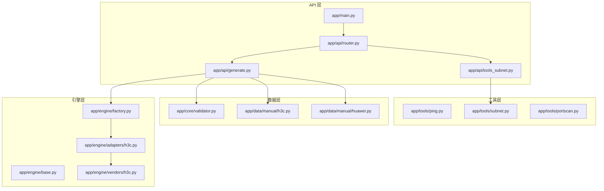
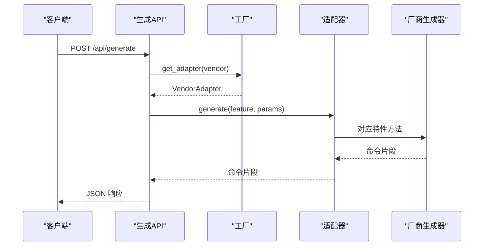
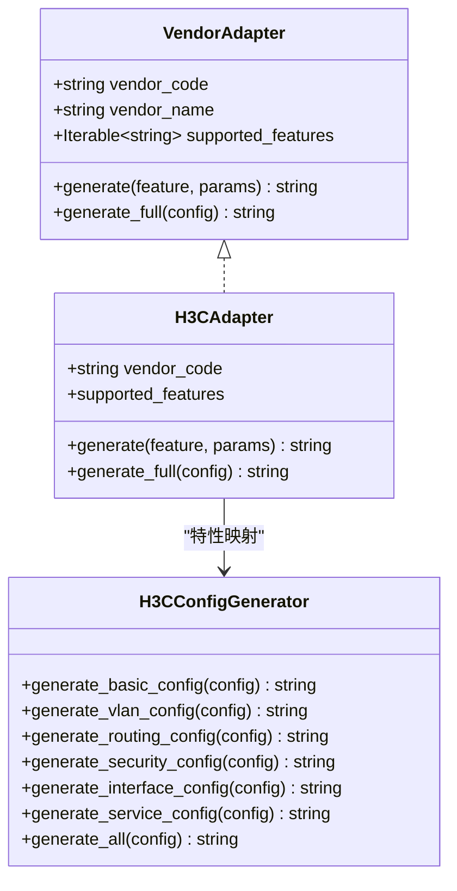
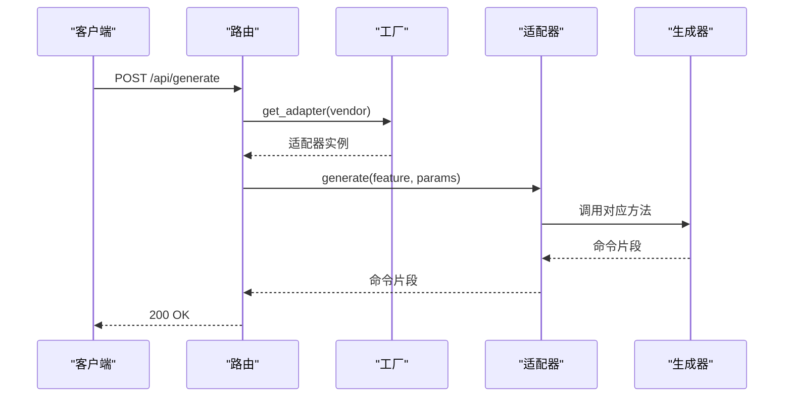
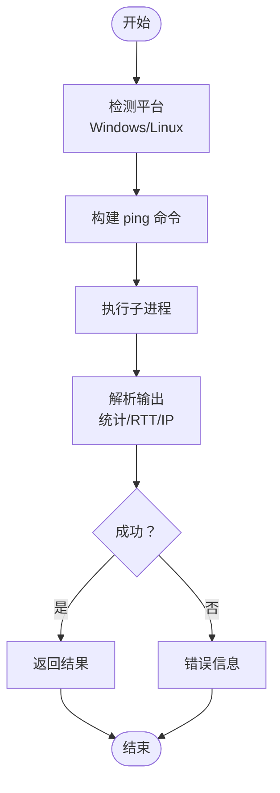
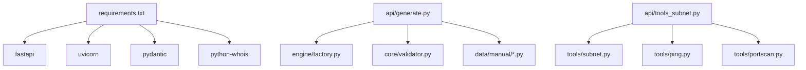

# 扩展开发指南

<cite>
**本文档引用的文件**   
- [api/app/engine/base.py](file://api/app/engine/base.py)
- [api/app/engine/factory.py](file://api/app/engine/factory.py)
- [api/app/engine/adapters/h3c.py](file://api/app/engine/adapters/h3c.py)
- [api/app/engine/vendors/h3c.py](file://api/app/engine/vendors/h3c.py)
- [api/app/api/generate.py](file://api/app/api/generate.py)
- [api/app/api/router.py](file://api/app/api/router.py)
- [api/app/main.py](file://api/app/main.py)
- [api/app/tools/ping.py](file://api/app/tools/ping.py)
- [api/app/tools/subnet.py](file://api/app/tools/subnet.py)
- [api/app/tools/portscan.py](file://api/app/tools/portscan.py)
- [api/app/api/tools_subnet.py](file://api/app/api/tools_subnet.py)
- [api/app/core/validator.py](file://api/app/core/validator.py)
- [api/app/data/manual/h3c.py](file://api/app/data/manual/h3c.py)
- [api/app/data/manual/huawei.py](file://api/app/data/manual/huawei.py)
- [docs/NetOps-toolkit复用方案.md](file://docs/NetOps-toolkit复用方案.md)
- [api/tests/sample-h3c-full.json](file://api/tests/sample-h3c-full.json)
- [api/requirements.txt](file://api/requirements.txt)
</cite>

## 目录
1. [简介](#简介)
2. [项目结构](#项目结构)
3. [核心组件](#核心组件)
4. [架构总览](#架构总览)
5. [详细组件分析](#详细组件分析)
6. [依赖分析](#依赖分析)
7. [性能考虑](#性能考虑)
8. [故障排除指南](#故障排除指南)
9. [结论](#结论)
10. [附录](#附录)

## 简介
本指南面向第三方开发者，提供为 NetCmdGen 扩展开发的完整路径：新增厂商适配器、扩展网络工具、自定义配置生成器，并复用 NetOps-toolkit 模块。文档涵盖适配器协议实现要求、工厂模式扩展方法、插件开发最佳实践、开发流程、代码规范与测试要求，以及向后兼容性与同步策略。

## 项目结构
NetCmdGen 后端采用 FastAPI 架构，核心模块包括：
- 引擎层：厂商适配器协议、工厂、具体厂商生成器
- API 层：命令生成与网络工具的 HTTP 接口
- 工具层：Ping、子网计算、端口扫描等网络工具
- 数据层：厂商命令手册与配置案例
- 复用层：NetOps-toolkit 的 Generator、工具与手册

**图表来源**
- [api/app/main.py:1-29](file://api/app/main.py#L1-L29)
- [api/app/api/router.py:1-10](file://api/app/api/router.py#L1-L10)
- [api/app/api/generate.py:1-77](file://api/app/api/generate.py#L1-L77)
- [api/app/engine/base.py:1-36](file://api/app/engine/base.py#L1-L36)
- [api/app/engine/factory.py:1-39](file://api/app/engine/factory.py#L1-L39)
- [api/app/engine/adapters/h3c.py:1-42](file://api/app/engine/adapters/h3c.py#L1-L42)
- [api/app/engine/vendors/h3c.py:1-594](file://api/app/engine/vendors/h3c.py#L1-L594)
- [api/app/tools/ping.py:1-241](file://api/app/tools/ping.py#L1-L241)
- [api/app/tools/subnet.py:1-280](file://api/app/tools/subnet.py#L1-L280)
- [api/app/tools/portscan.py:1-315](file://api/app/tools/portscan.py#L1-L315)
- [api/app/data/manual/h3c.py:1-710](file://api/app/data/manual/h3c.py#L1-L710)
- [api/app/data/manual/huawei.py:1-200](file://api/app/data/manual/huawei.py#L1-L200)
- [api/app/core/validator.py](file://api/app/core/validator.py)

**章节来源**
- [api/app/main.py:1-29](file://api/app/main.py#L1-L29)
- [api/app/api/router.py:1-10](file://api/app/api/router.py#L1-L10)
- [api/app/api/generate.py:1-77](file://api/app/api/generate.py#L1-L77)

## 核心组件
- 厂商适配器协议：定义统一接口，确保工厂模式可扩展
- 工厂：集中注册与获取适配器，支持动态扩展
- 适配器实现：将厂商生成器封装为统一接口
- 生成器：厂商具体配置生成逻辑
- API：对外提供命令生成与网络工具接口
- 工具：Ping、子网计算、端口扫描等网络工具
- 数据与校验：厂商命令手册与参数校验

**章节来源**
- [api/app/engine/base.py:1-36](file://api/app/engine/base.py#L1-L36)
- [api/app/engine/factory.py:1-39](file://api/app/engine/factory.py#L1-L39)
- [api/app/engine/adapters/h3c.py:1-42](file://api/app/engine/adapters/h3c.py#L1-L42)
- [api/app/engine/vendors/h3c.py:1-594](file://api/app/engine/vendors/h3c.py#L1-L594)
- [api/app/api/generate.py:1-77](file://api/app/api/generate.py#L1-L77)
- [api/app/tools/ping.py:1-241](file://api/app/tools/ping.py#L1-L241)
- [api/app/tools/subnet.py:1-280](file://api/app/tools/subnet.py#L1-L280)
- [api/app/tools/portscan.py:1-315](file://api/app/tools/portscan.py#L1-L315)
- [api/app/core/validator.py](file://api/app/core/validator.py)

## 架构总览
系统采用“协议 + 工厂 + 适配器 + 生成器”的分层架构，API 层通过工厂获取适配器，适配器调用厂商生成器生成命令；工具层提供网络工具能力；数据层提供命令手册与校验工具。

**图表来源**
- [api/app/api/generate.py:53-64](file://api/app/api/generate.py#L53-L64)
- [api/app/engine/factory.py:20-26](file://api/app/engine/factory.py#L20-L26)
- [api/app/engine/adapters/h3c.py:32-38](file://api/app/engine/adapters/h3c.py#L32-L38)
- [api/app/engine/vendors/h3c.py:26-125](file://api/app/engine/vendors/h3c.py#L26-L125)

## 详细组件分析

### 厂商适配器协议与工厂扩展
- 协议要求：实现 vendor_code、vendor_name、supported_features 与 generate/generate_full 方法
- 工厂扩展：在工厂注册字典中新增适配器实例，支持动态扩展
- 适配器示例：H3C 适配器将特性码映射到生成器静态方法

**图表来源**
- [api/app/engine/base.py:12-27](file://api/app/engine/base.py#L12-L27)
- [api/app/engine/adapters/h3c.py:14-42](file://api/app/engine/adapters/h3c.py#L14-L42)
- [api/app/engine/vendors/h3c.py:11-594](file://api/app/engine/vendors/h3c.py#L11-L594)

**章节来源**
- [api/app/engine/base.py:11-27](file://api/app/engine/base.py#L11-L27)
- [api/app/engine/factory.py:14-38](file://api/app/engine/factory.py#L14-L38)
- [api/app/engine/adapters/h3c.py:14-42](file://api/app/engine/adapters/h3c.py#L14-L42)

### 命令生成 API 流程
- 单特性生成：POST /api/generate，参数包含 vendor、feature、params
- 完整配置生成：POST /api/generate/full，参数包含 vendor、config
- 错误处理：厂商不支持与特性不支持返回 400，其他异常返回 500

**图表来源**
- [api/app/api/generate.py:53-64](file://api/app/api/generate.py#L53-L64)
- [api/app/engine/factory.py:20-26](file://api/app/engine/factory.py#L20-L26)
- [api/app/engine/adapters/h3c.py:32-38](file://api/app/engine/adapters/h3c.py#L32-L38)

**章节来源**
- [api/app/api/generate.py:21-77](file://api/app/api/generate.py#L21-L77)

### 网络工具扩展
- Ping 工具：支持 Windows/Linux，解析统计与 RTT，批量与扫描
- 子网计算：IP/掩码互转、前缀长度、网络/广播/可用范围、CIDR 转换
- 端口扫描：常用端口、端口范围、全端口扫描，Banner 抓取与进度回调

**图表来源**
- [api/app/tools/ping.py:18-171](file://api/app/tools/ping.py#L18-L171)

**章节来源**
- [api/app/tools/ping.py:15-241](file://api/app/tools/ping.py#L15-L241)
- [api/app/tools/subnet.py:11-280](file://api/app/tools/subnet.py#L11-L280)
- [api/app/tools/portscan.py:14-315](file://api/app/tools/portscan.py#L14-L315)

### 厂商命令手册与配置案例
- 命令手册：以嵌套字典形式提供，包含命令、描述与示例
- 配置案例：提供典型场景的配置步骤，便于生成器与 API 使用

**章节来源**
- [api/app/data/manual/h3c.py:7-710](file://api/app/data/manual/h3c.py#L7-L710)
- [api/app/data/manual/huawei.py:7-200](file://api/app/data/manual/huawei.py#L7-L200)

### NetOps-toolkit 复用与同步策略
- 可直接复用：网络工具、校验器、命令手册、配置案例
- 需适配：厂商生成器接口风格不统一，需通过适配器层统一
- 同步策略：通过脚本批量同步，保持上游升级可追溯

**章节来源**
- [docs/NetOps-toolkit复用方案.md:43-81](file://docs/NetOps-toolkit复用方案.md#L43-L81)
- [docs/NetOps-toolkit复用方案.md:230-239](file://docs/NetOps-toolkit复用方案.md#L230-L239)

## 依赖分析
- API 依赖：FastAPI、Pydantic
- 工具依赖：标准库 subprocess、socket、concurrent.futures
- 生成器依赖：厂商生成器类（静态方法）
- 复用依赖：NetOps-toolkit 的纯函数与数据模块

**图表来源**
- [api/requirements.txt:1-5](file://api/requirements.txt#L1-L5)
- [api/app/api/generate.py:15-16](file://api/app/api/generate.py#L15-L16)
- [api/app/api/tools_subnet.py:4](file://api/app/api/tools_subnet.py#L4)

**章节来源**
- [api/requirements.txt:1-5](file://api/requirements.txt#L1-L5)

## 性能考虑
- 并发控制：工具层使用线程池限制并发，避免资源耗尽
- I/O 优化：子网计算与端口扫描避免外部依赖，减少阻塞
- 生成器幂等：生成器为静态方法，无状态，适合并发复用
- 超时与重试：网络工具设置合理超时，避免长时间等待

[本节为通用指导，无需特定文件来源]

## 故障排除指南
- 厂商不支持：检查工厂注册与 vendor_code 是否正确
- 特性不支持：确认适配器 supported_features 与特性码一致
- 网络工具异常：检查平台命令可用性与权限，必要时安装系统工具
- 参数校验失败：使用 core/validator 提供的校验函数进行预检

**章节来源**
- [api/app/engine/factory.py:20-26](file://api/app/engine/factory.py#L20-L26)
- [api/app/engine/base.py:30-36](file://api/app/engine/base.py#L30-L36)
- [api/app/tools/ping.py:164-170](file://api/app/tools/ping.py#L164-L170)

## 结论
通过协议 + 工厂 + 适配器 + 生成器的架构，NetCmdGen 提供了清晰的扩展路径。新增厂商适配器只需实现协议并注册到工厂；网络工具与配置生成器可按需扩展；复用 NetOps-toolkit 可显著缩短开发周期。遵循本文档的开发流程、代码规范与测试要求，可确保扩展的稳定性与向后兼容性。

[本节为总结，无需特定文件来源]

## 附录

### 开发流程与最佳实践
- 新增厂商适配器
  - 实现适配器协议，定义 vendor_code、vendor_name、supported_features
  - 在工厂注册适配器实例
  - 编写特性到生成器方法的映射
- 扩展网络工具
  - 保持纯函数与标准库依赖
  - 提供并发控制与超时机制
  - 通过 API 路由暴露工具能力
- 自定义配置生成器
  - 保持生成器为静态方法，无状态
  - 统一输入输出格式，便于适配器封装
- 复用 NetOps-toolkit
  - 直接复制工具与数据模块
  - 对接口风格不统一的生成器编写适配器
  - 使用脚本同步上游变更

**章节来源**
- [docs/NetOps-toolkit复用方案.md:84-180](file://docs/NetOps-toolkit复用方案.md#L84-L180)

### 代码规范
- 类型注解：使用 typing 模块声明参数与返回类型
- 异常处理：明确区分厂商不支持、特性不支持与内部错误
- 文档字符串：为公共接口提供清晰的说明与示例
- 并发安全：适配器为无状态对象，工厂使用单例字典

**章节来源**
- [api/app/engine/base.py:8-27](file://api/app/engine/base.py#L8-L27)
- [api/app/engine/factory.py:14-17](file://api/app/engine/factory.py#L14-L17)

### 测试要求
- 单元测试：针对适配器与生成器的关键路径进行测试
- 集成测试：通过 API 路由验证生成流程与错误处理
- 端到端测试：使用样例配置验证完整生成流程
- 并发测试：验证工具层在高并发下的稳定性

**章节来源**
- [api/tests/sample-h3c-full.json:1-26](file://api/tests/sample-h3c-full.json#L1-L26)