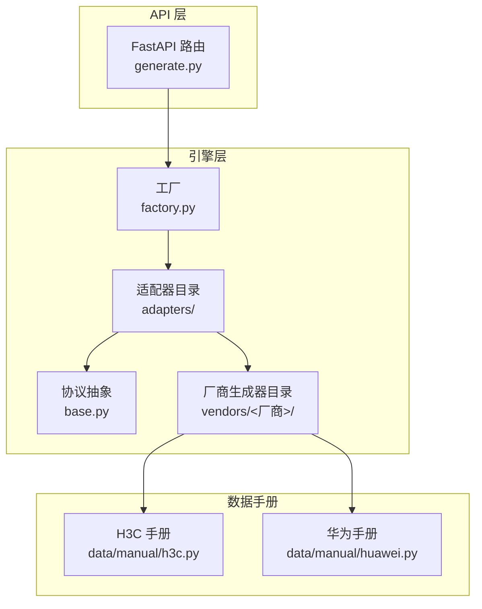
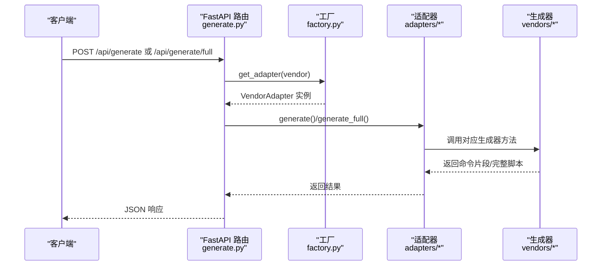
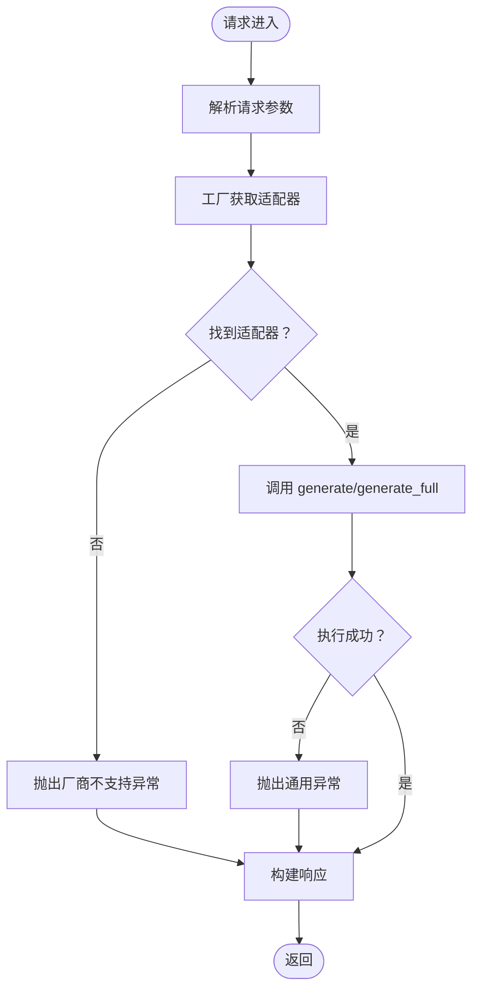
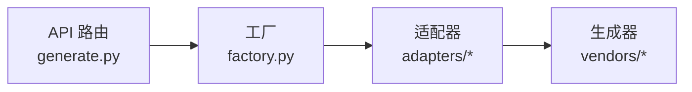

# 新增厂商适配器

<cite>
**本文引用的文件**
- [base.py](file://api/app/engine/base.py)
- [factory.py](file://api/app/engine/factory.py)
- [h3c.py](file://api/app/engine/adapters/h3c.py)
- [h3c.py](file://api/app/data/manual/h3c.py)
- [huawei.py](file://api/app/data/manual/huawei.py)
- [basic.py](file://api/app/engine/vendors/huawei/basic.py)
- [interface.py](file://api/app/engine/vendors/huawei/interface.py)
- [routing.py](file://api/app/engine/vendors/huawei/routing.py)
- [vlan.py](file://api/app/engine/vendors/huawei/vlan.py)
- [generate.py](file://api/app/api/generate.py)
</cite>

## 目录
1. [简介](#简介)
2. [项目结构](#项目结构)
3. [核心组件](#核心组件)
4. [架构总览](#架构总览)
5. [详细组件分析](#详细组件分析)
6. [依赖分析](#依赖分析)
7. [性能考虑](#性能考虑)
8. [故障排查指南](#故障排查指南)
9. [结论](#结论)
10. [附录](#附录)

## 简介
本文面向新增厂商适配器的开发者，提供从协议实现、适配器设计模式、特征映射表、参数处理机制，到工厂扩展与注册的完整开发指南。文档以现有 H3C 与华为适配器为对照样例，解释 VendorAdapter 协议的实现要求，并给出从源码复用到适配器落地的全流程实践。

## 项目结构
本项目采用“协议抽象 + 适配器 + 工厂 + 生成器”的分层架构：
- 协议层：定义 VendorAdapter 协议与异常类型，确保所有厂商适配器具备统一接口。
- 适配器层：每个厂商一个适配器类，负责特性码到具体生成器的映射与参数转发。
- 工厂层：集中注册与管理适配器实例，提供按 vendor_code 获取适配器的能力。
- 生成器层：按功能域拆分（基础、接口、VLAN、路由、安全等），每个域一个生成器类，负责将参数转为命令文本。
- API 层：对外暴露 /api/generate 与 /api/generate/full 两个端点，内部通过工厂获取适配器并调用。

图表来源
- [generate.py:1-77](file://api/app/api/generate.py#L1-L77)
- [factory.py:1-39](file://api/app/engine/factory.py#L1-L39)
- [base.py:1-36](file://api/app/engine/base.py#L1-L36)
- [h3c.py:1-42](file://api/app/engine/adapters/h3c.py#L1-L42)
- [h3c.py:1-710](file://api/app/data/manual/h3c.py#L1-L710)
- [huawei.py:1-703](file://api/app/data/manual/huawei.py#L1-L703)

章节来源
- [generate.py:1-77](file://api/app/api/generate.py#L1-L77)
- [factory.py:1-39](file://api/app/engine/factory.py#L1-L39)
- [base.py:1-36](file://api/app/engine/base.py#L1-L36)

## 核心组件
- VendorAdapter 协议：定义 vendor_code、vendor_name、supported_features 以及 generate/generate_full 两个方法，保证所有适配器对外一致。
- 适配器实例：无状态对象，工厂以单例字典缓存，避免重复创建。
- 生成器模块：按功能域拆分，每个域提供 generate_* 与 generate_*_all 方法，前者生成片段，后者生成完整配置。
- API 入口：/api/generate 与 /api/generate/full，分别调用适配器的 generate 与 generate_full。

章节来源
- [base.py:11-36](file://api/app/engine/base.py#L11-L36)
- [factory.py:14-39](file://api/app/engine/factory.py#L14-L39)
- [generate.py:21-77](file://api/app/api/generate.py#L21-L77)

## 架构总览
下图展示了从 API 请求到命令生成的关键调用链，以及适配器与生成器之间的协作关系。

图表来源
- [generate.py:53-77](file://api/app/api/generate.py#L53-L77)
- [factory.py:20-26](file://api/app/engine/factory.py#L20-L26)
- [h3c.py:32-42](file://api/app/engine/adapters/h3c.py#L32-L42)
- [basic.py:250-359](file://api/app/engine/vendors/huawei/basic.py#L250-L359)

## 详细组件分析

### 适配器协议与实现要求
- 协议字段
  - vendor_code：厂商标识字符串，用于工厂按代码获取适配器。
  - vendor_name：厂商中文展示名。
  - supported_features：特性码集合，决定 generate 的 feature 参数取值范围。
- 协议方法
  - generate(feature, params)：根据特性码与参数生成单个特性的命令片段。
  - generate_full(config)：根据完整配置字典生成全量脚本。
- 异常
  - FeatureNotSupported：当特性码不在 supported_features 时抛出。
  - VendorNotSupported：当 vendor_code 未注册时抛出。

章节来源
- [base.py:11-36](file://api/app/engine/base.py#L11-L36)

### H3C 适配器实现要点
- 适配器类：H3CAdapter，vendor_code="h3c"，vendor_name="华三 H3C"。
- 特性映射表：_FEATURE_MAP 将特性码映射到 H3CConfigGenerator 的静态方法。
- generate：查表失败抛 FeatureNotSupported；成功则调用对应生成器方法。
- generate_full：直接委托给 H3CConfigGenerator.generate_all。

章节来源
- [h3c.py:14-42](file://api/app/engine/adapters/h3c.py#L14-L42)

### 华为适配器实现要点
- 适配器类：需新建 HuaweiAdapter（示例性说明，实际文件名以仓库为准）。
- 特性映射表：将特性码映射到 vendors/huawei/* 生成器的静态方法。
- generate：查表失败抛 FeatureNotSupported；成功则调用对应生成器方法。
- generate_full：直接委托给 vendors/huawei/* 的 generate_*_all。

章节来源
- [basic.py:250-359](file://api/app/engine/vendors/huawei/basic.py#L250-L359)
- [interface.py:219-308](file://api/app/engine/vendors/huawei/interface.py#L219-L308)
- [routing.py:150-213](file://api/app/engine/vendors/huawei/routing.py#L150-L213)
- [vlan.py:117-175](file://api/app/engine/vendors/huawei/vlan.py#L117-L175)

### 生成器模块设计模式
- 每个功能域一个生成器类，提供：
  - generate_*：生成单个配置片段。
  - generate_*_all：整合该域的多个子配置，形成完整脚本。
- 参数处理：生成器方法接收与配置字典一致的参数键，内部进行参数校验与命令拼接。
- 复用策略：H3C 适配器直接复用 H3CConfigGenerator 的 generate_*_all；华为适配器复用 vendors/huawei/* 的 generate_*_all。

章节来源
- [basic.py:8-359](file://api/app/engine/vendors/huawei/basic.py#L8-L359)
- [interface.py:8-308](file://api/app/engine/vendors/huawei/interface.py#L8-L308)
- [routing.py:8-213](file://api/app/engine/vendors/huawei/routing.py#L8-L213)
- [vlan.py:8-175](file://api/app/engine/vendors/huawei/vlan.py#L8-L175)

### 工厂模式与扩展方法
- 工厂职责：集中注册适配器实例，提供 get_adapter 与 list_vendors。
- 注册方式：在工厂的 _ADAPTERS 字典中新增条目，键为 vendor_code，值为适配器实例。
- 扩展步骤（以新增厂商为例）：
  1) 在 app/engine/adapters/ 下新增适配器文件，并实现 VendorAdapter 协议。
  2) 在工厂文件中注册该适配器实例。
  3) 对外暴露 /api/generate 与 /api/generate/full，即可通过 vendor_code 调用。

章节来源
- [factory.py:14-39](file://api/app/engine/factory.py#L14-L39)
- [generate.py:48-77](file://api/app/api/generate.py#L48-L77)

### 特征映射表与参数处理机制
- 特征映射表：将特性码（如 basic/vlan/routing 等）映射到具体生成器方法，便于适配器统一调度。
- 参数处理：适配器 generate 接收 params 字典，直接传递给生成器方法；生成器内部负责参数校验与命令拼接。
- 完整配置：generate_full 接收顶层包含 description/basic/vlan/routing/security/interface/service 等键的配置字典，生成完整脚本。

章节来源
- [h3c.py:18-30](file://api/app/engine/adapters/h3c.py#L18-L30)
- [generate.py:21-40](file://api/app/api/generate.py#L21-L40)

### H3C 与华为适配器对比
- H3C 适配器
  - 适配器文件：adapters/h3c.py
  - 生成器来源：H3CConfigGenerator（来自 data/manual/h3c.py 的命令手册）
  - 适配器职责：仅做特性码到方法的映射，无需二次封装
- 华为适配器
  - 适配器文件：需新增 adapters/huawei.py
  - 生成器来源：vendors/huawei/*（basic.py/interface.py/routing.py/vlan.py）
  - 适配器职责：特性码到 vendors/huawei/* 生成器方法的映射

章节来源
- [h3c.py:1-42](file://api/app/engine/adapters/h3c.py#L1-L42)
- [h3c.py:1-710](file://api/app/data/manual/h3c.py#L1-L710)
- [huawei.py:1-703](file://api/app/data/manual/huawei.py#L1-L703)
- [basic.py:1-359](file://api/app/engine/vendors/huawei/basic.py#L1-L359)
- [interface.py:1-308](file://api/app/engine/vendors/huawei/interface.py#L1-L308)
- [routing.py:1-213](file://api/app/engine/vendors/huawei/routing.py#L1-L213)
- [vlan.py:1-175](file://api/app/engine/vendors/huawei/vlan.py#L1-L175)

### API 工作流与错误处理
- /api/generate
  - 输入：vendor、feature、params
  - 流程：get_adapter → adapter.generate → 返回 output
  - 错误：VendorNotSupported、FeatureNotSupported、其他异常转换为 400/500
- /api/generate/full
  - 输入：vendor、config
  - 流程：get_adapter → adapter.generate_full → 返回 output
  - 错误：VendorNotSupported、其他异常转换为 400/500

图表来源
- [generate.py:53-77](file://api/app/api/generate.py#L53-L77)
- [factory.py:20-26](file://api/app/engine/factory.py#L20-L26)
- [base.py:30-36](file://api/app/engine/base.py#L30-L36)

章节来源
- [generate.py:1-77](file://api/app/api/generate.py#L1-L77)
- [factory.py:1-39](file://api/app/engine/factory.py#L1-L39)
- [base.py:1-36](file://api/app/engine/base.py#L1-L36)

## 依赖分析
- 适配器依赖工厂：通过工厂按 vendor_code 获取适配器实例。
- 适配器依赖生成器：generate 与 generate_full 分别调用生成器方法。
- API 依赖适配器：API 路由层仅依赖适配器协议，不关心具体厂商实现。
- 工厂依赖适配器：工厂字典中存放适配器实例，实现注册与发现。

图表来源
- [generate.py:1-77](file://api/app/api/generate.py#L1-L77)
- [factory.py:1-39](file://api/app/engine/factory.py#L1-L39)
- [h3c.py:1-42](file://api/app/engine/adapters/h3c.py#L1-L42)

章节来源
- [generate.py:1-77](file://api/app/api/generate.py#L1-L77)
- [factory.py:1-39](file://api/app/engine/factory.py#L1-L39)

## 性能考虑
- 适配器实例为无状态对象，工厂采用单例字典缓存，避免重复创建，提升并发性能。
- 生成器方法内部进行字符串拼接，建议在参数较多时减少中间变量，保持 O(n) 拼接复杂度。
- API 层尽量避免在请求处理中进行重型计算，将复杂逻辑下沉至生成器模块。

## 故障排查指南
- 常见错误
  - 厂商不支持：检查 vendor_code 是否已在工厂注册。
  - 特性不支持：检查特性码是否在适配器的 supported_features 中。
  - 生成异常：检查生成器参数是否符合预期，必要时增加参数校验。
- 排查步骤
  - 使用 /api/vendors 确认厂商与特性码是否正确。
  - 使用 /api/generate 逐特性验证生成结果。
  - 查看工厂注册表，确认适配器实例是否正确加载。

章节来源
- [generate.py:48-77](file://api/app/api/generate.py#L48-L77)
- [factory.py:29-39](file://api/app/engine/factory.py#L29-L39)
- [base.py:30-36](file://api/app/engine/base.py#L30-L36)

## 结论
通过 VendorAdapter 协议与工厂模式，项目实现了对多厂商的统一抽象与扩展。新增厂商适配器的核心在于：实现协议接口、建立特性映射表、注册到工厂，并在 API 层即可无缝调用。H3C 与华为适配器展示了两种不同的复用策略：前者直接复用已有生成器，后者通过 vendors/huawei/* 生成器模块实现功能域拆分与参数封装。按照本文提供的流程与规范，开发者可以高效完成新厂商适配器的开发与集成。

## 附录

### 新增厂商适配器开发清单
- 实现适配器类
  - 定义 vendor_code、vendor_name、supported_features。
  - 实现 generate(feature, params) 与 generate_full(config)。
- 建立特性映射表
  - 将特性码映射到生成器方法，确保 generate 内部查表成功。
- 编写生成器模块（如需）
  - 按功能域拆分生成器类，提供 generate_* 与 generate_*_all。
- 注册适配器
  - 在工厂 _ADAPTERS 中新增注册条目。
- 编写测试
  - 覆盖 /api/generate 与 /api/generate/full 的典型场景。
- 提交与验证
  - 通过 /api/vendors 确认厂商与特性码可见。
  - 通过 /api/generate 验证各特性生成结果。

章节来源
- [base.py:11-36](file://api/app/engine/base.py#L11-L36)
- [factory.py:14-39](file://api/app/engine/factory.py#L14-L39)
- [generate.py:48-77](file://api/app/api/generate.py#L48-L77)