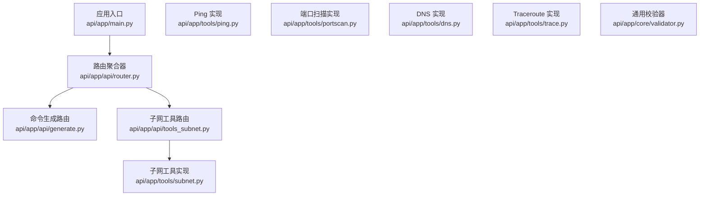
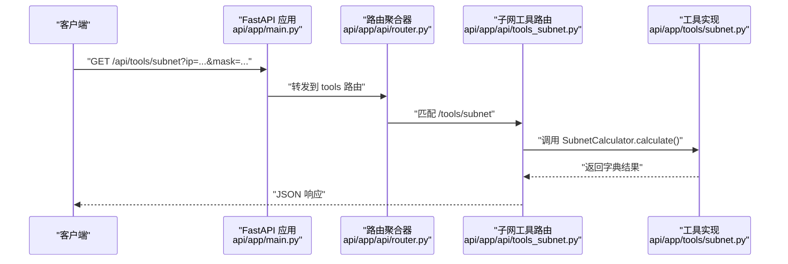
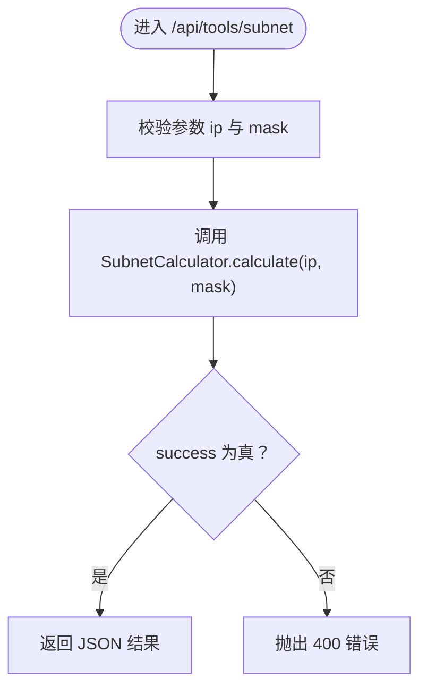
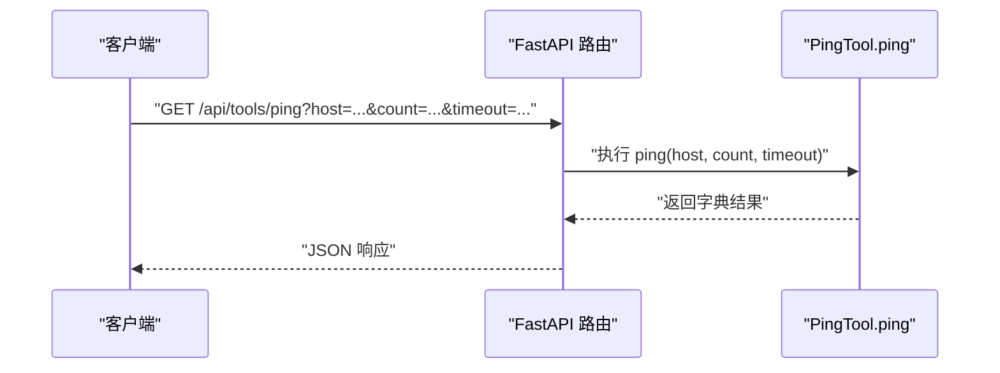
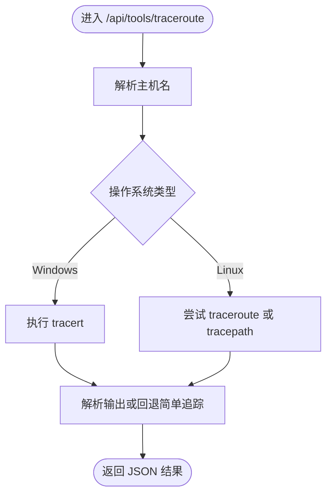
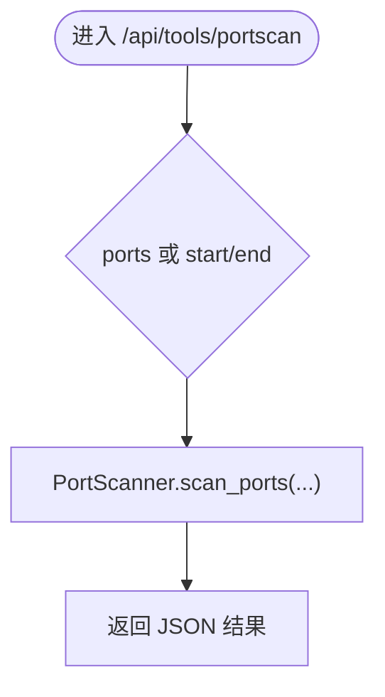
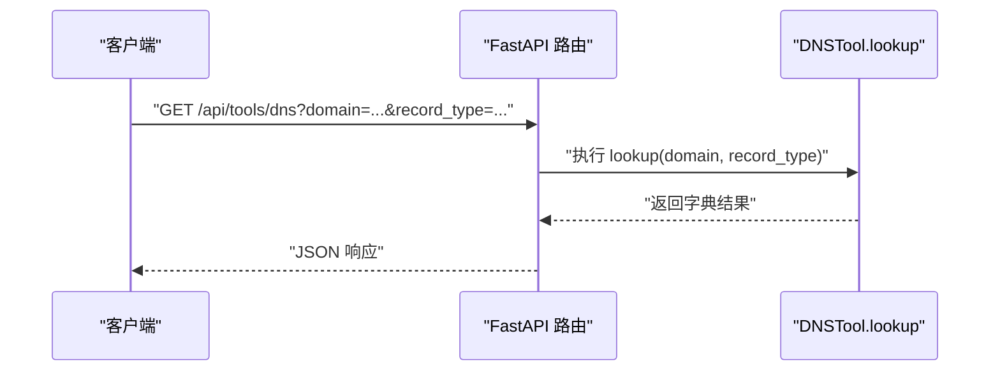
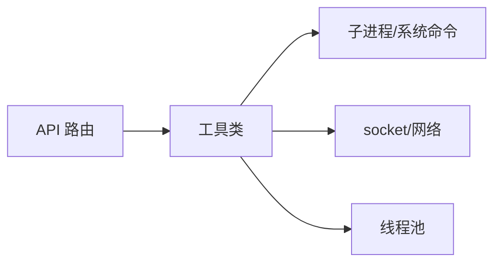
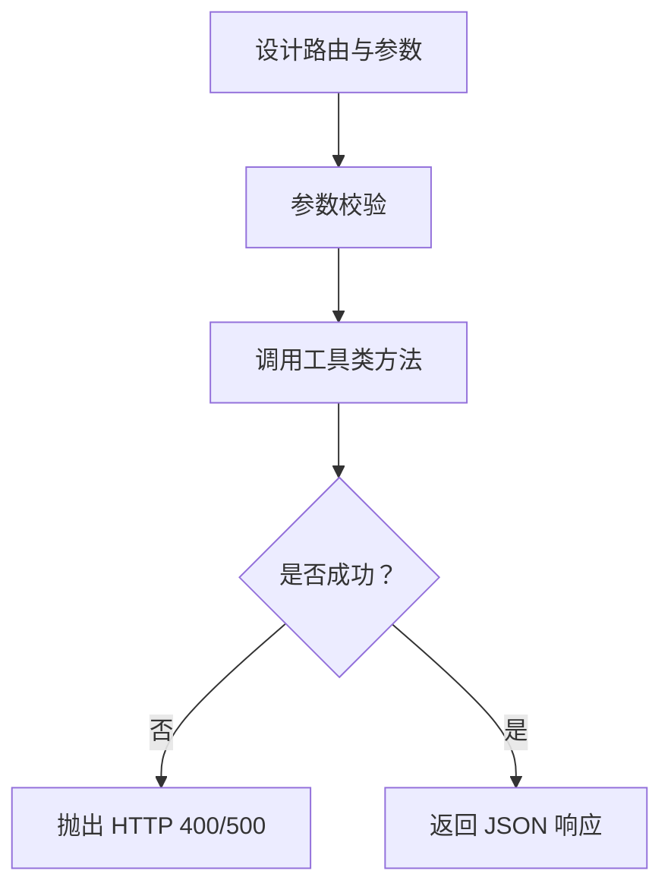

# 网络工具扩展

<cite>
**本文引用的文件**
- [api/app/main.py](file://api/app/main.py)
- [api/app/api/router.py](file://api/app/api/router.py)
- [api/app/api/generate.py](file://api/app/api/generate.py)
- [api/app/api/tools_subnet.py](file://api/app/api/tools_subnet.py)
- [api/app/tools/subnet.py](file://api/app/tools/subnet.py)
- [api/app/tools/ping.py](file://api/app/tools/ping.py)
- [api/app/tools/portscan.py](file://api/app/tools/portscan.py)
- [api/app/tools/dns.py](file://api/app/tools/dns.py)
- [api/app/tools/trace.py](file://api/app/tools/trace.py)
- [api/app/core/validator.py](file://api/app/core/validator.py)
- [opensource/NetOps-toolkit/utils/network_tools/subnet_calculator.py](file://opensource/NetOps-toolkit/utils/network_tools/subnet_calculator.py)
- [opensource/NetOps-toolkit/utils/network_tools/ping_tool.py](file://opensource/NetOps-toolkit/utils/network_tools/ping_tool.py)
- [opensource/NetOps-toolkit/utils/network_tools/port_scanner.py](file://opensource/NetOps-toolkit/utils/network_tools/port_scanner.py)
- [opensource/NetOps-toolkit/utils/network_tools/dns_tool.py](file://opensource/NetOps-toolkit/utils/network_tools/dns_tool.py)
- [opensource/NetOps-toolkit/utils/network_tools/trace_route.py](file://opensource/NetOps-toolkit/utils/network_tools/trace_route.py)
</cite>

## 目录
1. [简介](#简介)
2. [项目结构](#项目结构)
3. [核心组件](#核心组件)
4. [架构总览](#架构总览)
5. [详细组件分析](#详细组件分析)
6. [依赖分析](#依赖分析)
7. [性能考量](#性能考量)
8. [故障排查指南](#故障排查指南)
9. [结论](#结论)
10. [附录](#附录)

## 简介
本指南面向希望基于 NetOps-toolkit 的网络工具模块，扩展并发布为 FastAPI 网络工具 API 的开发者。文档覆盖以下内容：
- 如何从纯函数/工具类迁移到 FastAPI 路由接口
- 工具函数的接口规范、参数校验与返回值格式
- 子网计算、Ping、Traceroute、端口扫描、DNS 查询等工具的实现要点与安全注意事项
- 错误处理策略与性能优化建议
- 从开源 NetOps-toolkit 复用的工具类到 API 的完整转换流程

## 项目结构
后端采用 FastAPI 应用，API 路由通过聚合器统一挂载；网络工具位于独立模块中，便于复用与扩展。

图示来源
- [api/app/main.py:1-29](file://api/app/main.py#L1-L29)
- [api/app/api/router.py:1-10](file://api/app/api/router.py#L1-L10)
- [api/app/api/generate.py:1-77](file://api/app/api/generate.py#L1-L77)
- [api/app/api/tools_subnet.py:1-50](file://api/app/api/tools_subnet.py#L1-L50)
- [api/app/tools/subnet.py:1-280](file://api/app/tools/subnet.py#L1-L280)
- [api/app/tools/ping.py:1-241](file://api/app/tools/ping.py#L1-L241)
- [api/app/tools/portscan.py:1-315](file://api/app/tools/portscan.py#L1-L315)
- [api/app/tools/dns.py:1-502](file://api/app/tools/dns.py#L1-L502)
- [api/app/tools/trace.py:1-299](file://api/app/tools/trace.py#L1-L299)
- [api/app/core/validator.py:1-208](file://api/app/core/validator.py#L1-L208)

章节来源
- [api/app/main.py:1-29](file://api/app/main.py#L1-L29)
- [api/app/api/router.py:1-10](file://api/app/api/router.py#L1-L10)

## 核心组件
- FastAPI 应用与路由
  - 应用入口负责注册 CORS 中间件与路由前缀
  - 路由聚合器统一 include 各子路由
- 网络工具模块
  - 子网计算、Ping、Traceroute、端口扫描、DNS 查询均以纯静态方法工具类形式提供
  - 工具类返回统一的字典结构，便于封装为 API 响应
- 通用校验器
  - 提供 IP、掩码、端口、VLAN 等基础参数校验，可复用到 API 层

章节来源
- [api/app/main.py:1-29](file://api/app/main.py#L1-L29)
- [api/app/api/router.py:1-10](file://api/app/api/router.py#L1-L10)
- [api/app/core/validator.py:1-208](file://api/app/core/validator.py#L1-L208)

## 架构总览
下面的序列图展示了从客户端请求到工具执行再到响应返回的整体流程。

图示来源
- [api/app/main.py:1-29](file://api/app/main.py#L1-L29)
- [api/app/api/router.py:1-10](file://api/app/api/router.py#L1-L10)
- [api/app/api/tools_subnet.py:1-50](file://api/app/api/tools_subnet.py#L1-L50)
- [api/app/tools/subnet.py:1-280](file://api/app/tools/subnet.py#L1-L280)

## 详细组件分析

### 子网计算工具
- 功能概述
  - 支持 IP + 掩码或前缀长度输入，输出网络地址、广播地址、可用主机范围、掩码、前缀长度、IP 类型与二进制表示等
  - 支持子网划分与 IP 范围转 CIDR
- 接口规范
  - 路由：GET /api/tools/subnet
  - 查询参数
    - ip: 字符串，形如 192.168.1.10
    - mask: 字符串，形如 255.255.255.0 或 24
  - 返回值：包含 success、error、ip_address、subnet_mask、prefix_length、network_address、broadcast_address、first_usable、last_usable、total_hosts、usable_hosts、wildcard_mask、ip_class、ip_type、is_private、binary_ip、binary_mask 等键的字典
- 安全与边界
  - 输入参数会进行格式与范围校验，非法输入将返回错误
- 性能与并发
  - 该工具为纯计算，无外部系统调用，性能优异
- 从工具类到 API 的转换要点
  - 将工具类方法封装为 FastAPI 路由处理器
  - 对异常进行捕获并映射为 HTTP 异常
  - 统一返回字典结构

图示来源
- [api/app/api/tools_subnet.py:9-22](file://api/app/api/tools_subnet.py#L9-L22)
- [api/app/tools/subnet.py:51-166](file://api/app/tools/subnet.py#L51-L166)

章节来源
- [api/app/api/tools_subnet.py:1-50](file://api/app/api/tools_subnet.py#L1-L50)
- [api/app/tools/subnet.py:1-280](file://api/app/tools/subnet.py#L1-L280)

### Ping 工具
- 功能概述
  - 单主机 Ping、批量 Ping、网段 Ping 扫描
  - 跨平台兼容 Windows/Linux，解析不同系统的输出
- 接口规范
  - 路由：GET /api/tools/ping（可扩展为 POST 以支持批量）
  - 查询参数
    - host: 目标主机（IP 或域名）
    - count: 次数，默认 4
    - timeout: 超时秒数，默认 2
  - 返回值：包含 success、host、packets_sent、packets_received、packets_lost、loss_rate、min_time、max_time、avg_time、ip_address、error、raw_output 等键的字典
- 安全与边界
  - 超时控制与进程通信超时处理
  - 主机名解析失败与命令不可用场景的错误提示
- 并发与性能
  - 批量与扫描使用线程池并发，注意 max_workers 的设置
- 从工具类到 API 的转换要点
  - 将工具类方法包装为路由处理器
  - 对超时、命令缺失、解析失败等情况进行异常捕获与 HTTP 映射

图示来源
- [api/app/tools/ping.py:18-171](file://api/app/tools/ping.py#L18-L171)

章节来源
- [api/app/tools/ping.py:1-241](file://api/app/tools/ping.py#L1-L241)

### Traceroute 工具
- 功能概述
  - 跨平台路由跟踪，解析 tracert/traceroute/tracepath 输出
  - 回退到基于 ping TTL 的简单追踪
- 接口规范
  - 路由：GET /api/tools/traceroute
  - 查询参数
    - host: 目标主机
    - max_hops: 最大跳数，默认 30
    - timeout: 超时秒数，默认 2
  - 返回值：包含 success、host、ip_address、hops（列表）、total_hops、reached_destination、error、raw_output 等键的字典
- 安全与边界
  - 主机名解析失败直接返回错误
  - 命令不存在或超时返回空输出时，回退到简单追踪
- 并发与性能
  - 可对多个主机并行追踪，注意 max_workers 控制

图示来源
- [api/app/tools/trace.py:17-77](file://api/app/tools/trace.py#L17-L77)
- [api/app/tools/trace.py:125-187](file://api/app/tools/trace.py#L125-L187)

章节来源
- [api/app/tools/trace.py:1-299](file://api/app/tools/trace.py#L1-L299)

### 端口扫描工具
- 功能概述
  - 单端口测试、常用端口扫描、端口范围扫描、全端口扫描
  - 可选 Banner 抓取与进度回调
- 接口规范
  - 路由：GET /api/tools/portscan（可扩展为 POST 以支持批量）
  - 查询参数
    - host: 目标主机
    - ports: 端口列表（可选，与 start/end 互斥）
    - start/end: 端口范围（可选，与 ports 互斥）
    - timeout: 超时秒数，默认 1.0
    - max_workers: 并发数，默认 100
  - 返回值：包含 success、host、start_time、end_time、total_ports、open_ports、closed_ports、filtered_ports、ports（开放端口列表）等键的字典
- 安全与边界
  - 端口扫描属于高风险操作，需严格限制并发与范围
  - 建议增加速率限制、白名单与审计日志
  - 对超时、拒绝连接、不可达等进行状态区分
- 并发与性能
  - 使用线程池并发扫描，合理设置 max_workers
  - 全端口扫描（1-65535）可能触发防火墙告警，应谨慎使用

图示来源
- [api/app/tools/portscan.py:121-196](file://api/app/tools/portscan.py#L121-L196)

章节来源
- [api/app/tools/portscan.py:1-315](file://api/app/tools/portscan.py#L1-L315)

### DNS 查询工具
- 功能概述
  - A/AAAA/MX/NS/TXT/CNAME/SOA/PTR 等记录查询
  - 反向 DNS 查询（IP->域名）
  - Whois 查询（简化版）
  - 本地网络信息与 IP 转换工具
- 接口规范
  - 路由：GET /api/tools/dns（可扩展为 POST 以支持批量）
  - 查询参数
    - domain: 域名
    - record_type: 记录类型，默认 A
  - 返回值：包含 success、domain、record_type、records、error、query_time 等键的字典
- 安全与边界
  - DNS 查询可能被 DNS 服务器限流或阻断
  - 反向查询与 Whois 查询存在超时与编码问题，需健壮处理
- 并发与性能
  - 可对多个域名并行查询，注意 DNS 解析器负载

图示来源
- [api/app/tools/dns.py:18-113](file://api/app/tools/dns.py#L18-L113)

章节来源
- [api/app/tools/dns.py:1-502](file://api/app/tools/dns.py#L1-L502)

## 依赖分析
- 组件内聚与耦合
  - 工具类均为纯静态方法，内聚性高、耦合低
  - API 层仅依赖工具类与 FastAPI，无业务层复杂依赖
- 外部依赖
  - 子进程调用（ping/tracert/traceroute/nslookup）
  - socket 与 urllib
  - 线程池并发
- 潜在循环依赖
  - 当前结构无循环依赖

图示来源
- [api/app/tools/ping.py:1-241](file://api/app/tools/ping.py#L1-L241)
- [api/app/tools/trace.py:1-299](file://api/app/tools/trace.py#L1-L299)
- [api/app/tools/dns.py:1-502](file://api/app/tools/dns.py#L1-L502)
- [api/app/tools/portscan.py:1-315](file://api/app/tools/portscan.py#L1-L315)

章节来源
- [api/app/tools/ping.py:1-241](file://api/app/tools/ping.py#L1-L241)
- [api/app/tools/trace.py:1-299](file://api/app/tools/trace.py#L1-L299)
- [api/app/tools/dns.py:1-502](file://api/app/tools/dns.py#L1-L502)
- [api/app/tools/portscan.py:1-315](file://api/app/tools/portscan.py#L1-L315)

## 性能考量
- 并发控制
  - 端口扫描与 Traceroute 的并发可通过 max_workers 参数控制，避免对目标系统造成过大压力
- 超时与资源回收
  - 子进程通信设置超时，socket 设置超时，确保资源及时释放
- 缓存与预热
  - 对频繁查询的 DNS 记录可引入缓存层（建议在上游网关或服务层实现）
- I/O 与 CPU 分配
  - 计算密集型（子网计算）与 I/O 密集型（Ping/Traceroute/DNS/端口扫描）混合部署时，建议分离线程池或容器资源

## 故障排查指南
- 常见错误与定位
  - 主机名解析失败：确认 DNS 配置与网络可达性
  - 子进程命令缺失：确认系统是否安装 tracert/traceroute/nslookup
  - 端口扫描被阻断：检查防火墙、速率限制与目标系统策略
  - 超时：适当增大 timeout 或减少并发
- 错误处理策略
  - 工具类内部捕获异常并返回 error 字段
  - API 层将失败场景映射为 HTTP 400/500
- 日志与监控
  - 建议在路由层记录请求参数与耗时，便于问题定位

章节来源
- [api/app/tools/ping.py:164-170](file://api/app/tools/ping.py#L164-L170)
- [api/app/tools/trace.py:74-76](file://api/app/tools/trace.py#L74-L76)
- [api/app/tools/dns.py:110-112](file://api/app/tools/dns.py#L110-L112)
- [api/app/tools/portscan.py:191-193](file://api/app/tools/portscan.py#L191-L193)

## 结论
通过将 NetOps-toolkit 的纯函数式网络工具迁移为 FastAPI 接口，可以快速构建稳定、可扩展的网络工具 API。遵循统一的参数校验、错误处理与返回值规范，结合合理的并发与超时控制，可在保证安全性的同时获得良好的性能表现。

## 附录

### 从工具类到 API 的转换流程（模板）
- 步骤 1：确定路由与参数
  - 设计 URL 与查询参数（或请求体），参考现有路由定义
- 步骤 2：参数校验
  - 在路由层或工具层进行参数校验，必要时复用通用校验器
- 步骤 3：调用工具类
  - 调用工具类静态方法，获取统一字典结果
- 步骤 4：错误映射
  - 将工具类返回的 error 映射为 HTTP 异常（如 400）
- 步骤 5：响应封装
  - 直接返回字典作为 JSON 响应，或定义 Pydantic 模型增强类型安全

图示来源
- [api/app/api/tools_subnet.py:9-22](file://api/app/api/tools_subnet.py#L9-L22)
- [api/app/core/validator.py:14-31](file://api/app/core/validator.py#L14-L31)

### 参考实现对比（开源 NetOps-toolkit）
- 子网计算
  - 仓库实现与 API 实现完全一致，可直接复用
- Ping/Traceroute/DNS/端口扫描
  - 仓库实现与 API 实现方法签名一致，仅需调整调用方式与异常处理

章节来源
- [opensource/NetOps-toolkit/utils/network_tools/subnet_calculator.py:1-280](file://opensource/NetOps-toolkit/utils/network_tools/subnet_calculator.py#L1-L280)
- [opensource/NetOps-toolkit/utils/network_tools/ping_tool.py:1-241](file://opensource/NetOps-toolkit/utils/network_tools/ping_tool.py#L1-L241)
- [opensource/NetOps-toolkit/utils/network_tools/trace_route.py:1-299](file://opensource/NetOps-toolkit/utils/network_tools/trace_route.py#L1-L299)
- [opensource/NetOps-toolkit/utils/network_tools/dns_tool.py:1-502](file://opensource/NetOps-toolkit/utils/network_tools/dns_tool.py#L1-L502)
- [opensource/NetOps-toolkit/utils/network_tools/port_scanner.py:1-315](file://opensource/NetOps-toolkit/utils/network_tools/port_scanner.py#L1-L315)