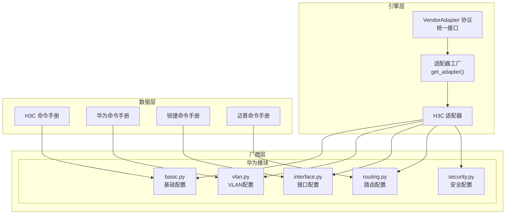
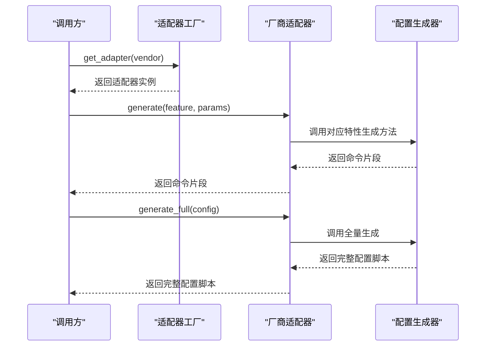
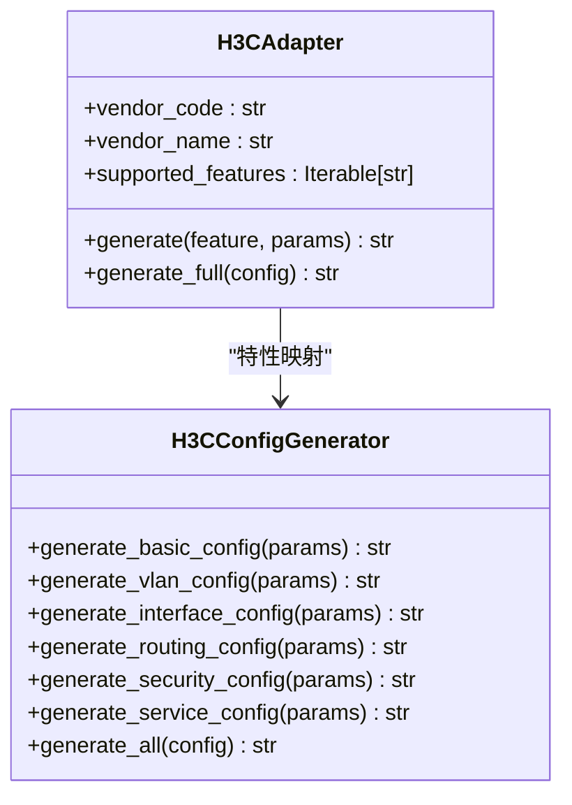
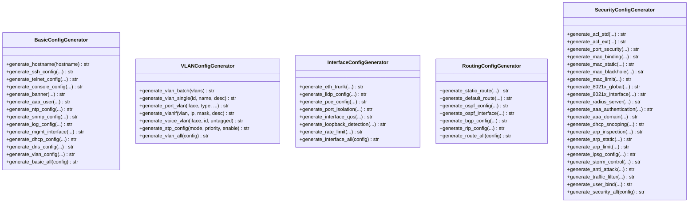
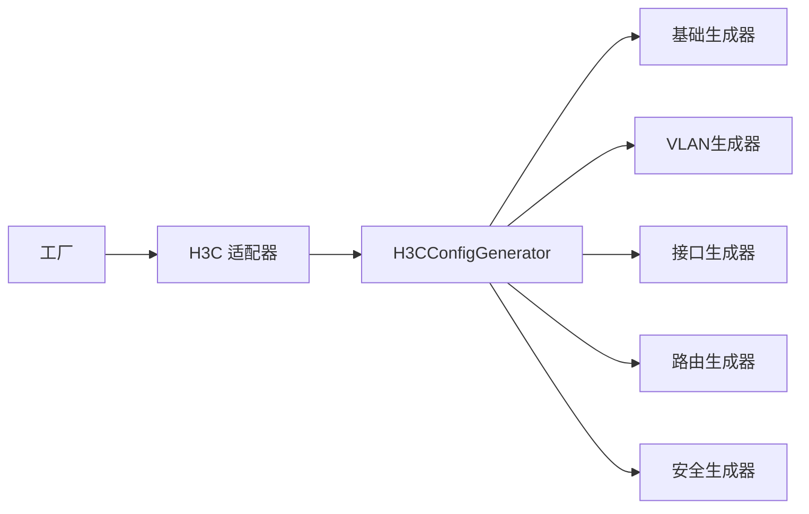

# 配置生成器定制

<cite>
**本文档引用的文件**
- [api/app/engine/base.py](file://api/app/engine/base.py)
- [api/app/engine/factory.py](file://api/app/engine/factory.py)
- [api/app/engine/adapters/h3c.py](file://api/app/engine/adapters/h3c.py)
- [api/app/engine/vendors/huawei/basic.py](file://api/app/engine/vendors/huawei/basic.py)
- [api/app/engine/vendors/huawei/vlan.py](file://api/app/engine/vendors/huawei/vlan.py)
- [api/app/engine/vendors/huawei/interface.py](file://api/app/engine/vendors/huawei/interface.py)
- [api/app/engine/vendors/huawei/routing.py](file://api/app/engine/vendors/huawei/routing.py)
- [api/app/engine/vendors/huawei/security.py](file://api/app/engine/vendors/huawei/security.py)
- [api/app/data/manual/h3c.py](file://api/app/data/manual/h3c.py)
- [api/app/data/manual/huawei.py](file://api/app/data/manual/huawei.py)
- [api/app/data/manual/ruijie.py](file://api/app/data/manual/ruijie.py)
- [api/app/data/manual/maipu.py](file://api/app/data/manual/maipu.py)
</cite>

## 目录
1. [简介](#简介)
2. [项目结构](#项目结构)
3. [核心组件](#核心组件)
4. [架构总览](#架构总览)
5. [详细组件分析](#详细组件分析)
6. [依赖关系分析](#依赖关系分析)
7. [性能考虑](#性能考虑)
8. [故障排除指南](#故障排除指南)
9. [结论](#结论)
10. [附录](#附录)

## 简介
本指南面向需要基于现有厂商配置生成器开发自定义配置生成逻辑的开发者。文档覆盖以下重点：
- 如何基于统一的适配器接口开发新厂商适配器
- 不同厂商配置生成器的接口差异与适配策略
- H3C、华为、锐捷、迈普等厂商配置生成器的实现分析与扩展方法
- 配置参数处理机制、命令片段生成规则与完整配置脚本组装流程
- 参数验证、错误处理与配置优化的最佳实践
- 从源码复用到功能定制的完整开发路径

## 项目结构
该项目采用“适配器 + 厂商生成器”的分层架构：
- 引擎层：定义统一的厂商适配器协议与工厂，负责厂商选择与特性映射
- 厂商层：按厂商拆分的配置生成器模块，提供特性级与全量配置生成能力
- 数据层：厂商命令手册与示例配置，用于参考与校验

**图表来源**
- [api/app/engine/base.py:11-36](file://api/app/engine/base.py#L11-L36)
- [api/app/engine/factory.py:15-26](file://api/app/engine/factory.py#L15-L26)
- [api/app/engine/adapters/h3c.py:14-31](file://api/app/engine/adapters/h3c.py#L14-L31)
- [api/app/engine/vendors/huawei/basic.py:8-359](file://api/app/engine/vendors/huawei/basic.py#L8-L359)
- [api/app/engine/vendors/huawei/vlan.py:8-175](file://api/app/engine/vendors/huawei/vlan.py#L8-L175)
- [api/app/engine/vendors/huawei/interface.py:8-308](file://api/app/engine/vendors/huawei/interface.py#L8-L308)
- [api/app/engine/vendors/huawei/routing.py:8-213](file://api/app/engine/vendors/huawei/routing.py#L8-L213)
- [api/app/engine/vendors/huawei/security.py:8-578](file://api/app/engine/vendors/huawei/security.py#L8-L578)

**章节来源**
- [api/app/engine/base.py:1-36](file://api/app/engine/base.py#L1-L36)
- [api/app/engine/factory.py:1-39](file://api/app/engine/factory.py#L1-L39)
- [api/app/engine/adapters/h3c.py:1-42](file://api/app/engine/adapters/h3c.py#L1-L42)

## 核心组件
- 统一适配器协议：定义厂商代码、名称、支持特性集合与两个核心方法（单特性生成与全量生成）
- 适配器工厂：集中注册与检索适配器，提供可用厂商清单
- 厂商生成器：按特性拆分的生成器类，提供参数化命令片段生成与全量组装
- 命令手册与示例：为生成器提供命令模板与最佳实践参考

关键职责与交互：
- 适配器协议确保不同厂商生成器对外暴露一致的接口，便于上层统一调用
- 工厂负责厂商选择与异常处理（未注册厂商抛出异常）
- 生成器内部封装参数校验、命令拼接与格式化，保证生成结果的正确性与一致性

**章节来源**
- [api/app/engine/base.py:11-36](file://api/app/engine/base.py#L11-L36)
- [api/app/engine/factory.py:20-39](file://api/app/engine/factory.py#L20-L39)

## 架构总览
统一适配器协议与工厂模式使得新增厂商仅需：
1) 实现适配器类并声明支持特性
2) 在工厂中注册
3) 提供对应特性的生成器实现

**图表来源**
- [api/app/engine/factory.py:20-26](file://api/app/engine/factory.py#L20-L26)
- [api/app/engine/adapters/h3c.py:32-42](file://api/app/engine/adapters/h3c.py#L32-L42)

## 详细组件分析

### H3C 适配器与生成器
- 适配器将特性码映射到 H3CConfigGenerator 的静态方法，支持基础、VLAN、路由、安全、接口、服务等特性
- 全量生成直接委托给 H3CConfigGenerator.generate_all

**图表来源**
- [api/app/engine/adapters/h3c.py:14-42](file://api/app/engine/adapters/h3c.py#L14-L42)

**章节来源**
- [api/app/engine/adapters/h3c.py:1-42](file://api/app/engine/adapters/h3c.py#L1-L42)

### 华为生成器模块族
华为生成器按特性拆分，每个模块提供：
- 单特性生成方法：接收参数并返回命令片段
- 全量组装方法：遍历配置字典，按需调用单特性生成方法

**图表来源**
- [api/app/engine/vendors/huawei/basic.py:8-359](file://api/app/engine/vendors/huawei/basic.py#L8-L359)
- [api/app/engine/vendors/huawei/vlan.py:8-175](file://api/app/engine/vendors/huawei/vlan.py#L8-L175)
- [api/app/engine/vendors/huawei/interface.py:8-308](file://api/app/engine/vendors/huawei/interface.py#L8-L308)
- [api/app/engine/vendors/huawei/routing.py:8-213](file://api/app/engine/vendors/huawei/routing.py#L8-L213)
- [api/app/engine/vendors/huawei/security.py:8-578](file://api/app/engine/vendors/huawei/security.py#L8-L578)

**章节来源**
- [api/app/engine/vendors/huawei/basic.py:1-359](file://api/app/engine/vendors/huawei/basic.py#L1-L359)
- [api/app/engine/vendors/huawei/vlan.py:1-175](file://api/app/engine/vendors/huawei/vlan.py#L1-L175)
- [api/app/engine/vendors/huawei/interface.py:1-308](file://api/app/engine/vendors/huawei/interface.py#L1-L308)
- [api/app/engine/vendors/huawei/routing.py:1-213](file://api/app/engine/vendors/huawei/routing.py#L1-L213)
- [api/app/engine/vendors/huawei/security.py:1-578](file://api/app/engine/vendors/huawei/security.py#L1-L578)

### 命令手册与示例参考
- H3C/Huawei/Ruijie/Maipu 提供完整的命令手册与典型场景配置步骤，便于生成器参数映射与生成结果校验
- 建议在实现新特性时对照手册，确保命令语法与参数顺序正确

**章节来源**
- [api/app/data/manual/h3c.py:1-710](file://api/app/data/manual/h3c.py#L1-L710)
- [api/app/data/manual/huawei.py:1-703](file://api/app/data/manual/huawei.py#L1-L703)
- [api/app/data/manual/ruijie.py:1-800](file://api/app/data/manual/ruijie.py#L1-L800)
- [api/app/data/manual/maipu.py:1-634](file://api/app/data/manual/maipu.py#L1-L634)

## 依赖关系分析
- 适配器依赖具体厂商生成器的静态方法
- 生成器模块之间保持低耦合，通过统一的参数字典与返回字符串进行交互
- 工厂集中管理适配器注册，避免跨模块硬编码

**图表来源**
- [api/app/engine/factory.py:15-17](file://api/app/engine/factory.py#L15-L17)
- [api/app/engine/adapters/h3c.py:19-26](file://api/app/engine/adapters/h3c.py#L19-L26)

**章节来源**
- [api/app/engine/factory.py:1-39](file://api/app/engine/factory.py#L1-L39)
- [api/app/engine/adapters/h3c.py:1-42](file://api/app/engine/adapters/h3c.py#L1-L42)

## 性能考虑
- 批量VLAN生成：优先使用批量命令减少配置行数与提交次数
- 命令拼接：尽量使用字符串拼接或列表收集后一次性join，减少中间对象创建
- 参数预处理：在进入生成器前完成参数归一化与边界检查，避免重复计算
- 复用策略：对于相同配置片段（如SSH/Telnet/VLANIF），可缓存生成结果以提升批量场景性能

## 故障排除指南
常见问题与处理建议：
- 未注册厂商：工厂在找不到适配器时抛出“厂商不支持”异常，需检查厂商代码大小写与注册表
- 特性不支持：适配器在特性映射缺失时抛出“特性不支持”异常，需确认特性码与映射表一致
- 参数缺失：生成器应进行参数校验并在缺失时给出明确提示或采用默认值
- 命令冲突：同一接口多次生成可能产生冲突，应在上层进行去重或合并策略

**章节来源**
- [api/app/engine/base.py:30-36](file://api/app/engine/base.py#L30-L36)
- [api/app/engine/factory.py:20-26](file://api/app/engine/factory.py#L20-L26)

## 结论
通过统一的适配器协议与模块化的生成器设计，项目实现了对多厂商配置生成的可扩展支持。开发者可以基于现有实现快速定制新厂商适配器与特性生成器，结合命令手册与示例配置，确保生成结果的准确性与一致性。

## 附录

### 新增厂商适配器开发步骤
- 实现适配器类：定义 vendor_code、vendor_name、supported_features，实现 generate/generate_full
- 在工厂注册：将适配器实例加入注册表
- 编写特性生成器：按特性拆分生成器类，提供单特性与全量生成方法
- 参数校验与错误处理：在生成器内进行参数校验与异常抛出
- 单元测试与集成测试：编写测试用例覆盖典型场景与边界条件

### 参数处理与命令生成规则
- 参数来源：来自上层传入的配置字典，字段命名与类型需与生成器约定一致
- 参数校验：检查必填字段、取值范围与格式合法性
- 命令生成：根据厂商命令手册生成命令片段，注意命令层级与缩进
- 组装流程：按特性顺序拼接命令片段，必要时插入注释与分隔符

### 配置优化最佳实践
- 使用批量命令：如批量VLAN创建，减少配置行数
- 合理的默认值：为可选参数提供合理的默认值，降低调用复杂度
- 可维护性：将常用命令模板抽取为常量，便于统一维护
- 文档与示例：为每个特性提供示例配置，便于用户理解与核对