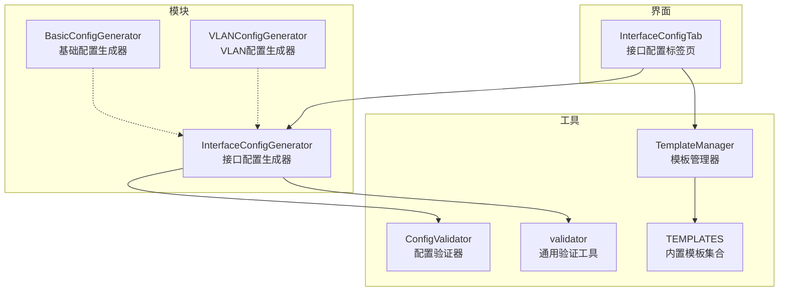
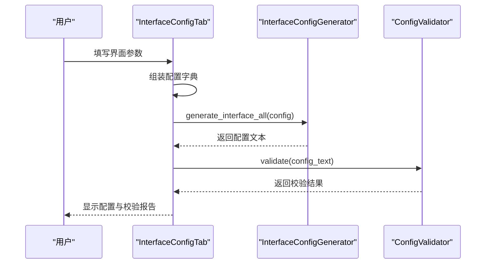
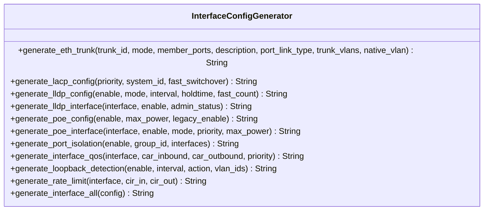
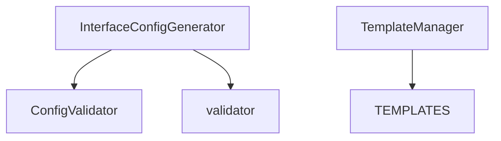

# 接口配置API

<cite>
**本文引用的文件**
- [interface_config.py](file://opensource/NetOps-toolkit/modules/interface_config.py)
- [config_validator.py](file://opensource/NetOps-toolkit/utils/config_validator.py)
- [validator.py](file://opensource/NetOps-toolkit/utils/validator.py)
- [template_manager.py](file://opensource/NetOps-toolkit/utils/template_manager.py)
- [templates.py](file://opensource/NetOps-toolkit/utils/templates.py)
- [interface_tab.py](file://opensource/NetOps-toolkit/gui/tabs/interface_tab.py)
</cite>

## 目录
1. [简介](#简介)
2. [项目结构](#项目结构)
3. [核心组件](#核心组件)
4. [架构总览](#架构总览)
5. [详细组件分析](#详细组件分析)
6. [依赖分析](#依赖分析)
7. [性能考虑](#性能考虑)
8. [故障排查指南](#故障排查指南)
9. [结论](#结论)
10. [附录](#附录)

## 简介
本文件为接口配置生成器的API参考文档，聚焦于 InterfaceConfigGenerator 类及其配套的参数校验与模板体系。内容涵盖：
- 接口配置、聚合接口（Eth-Trunk）、LLDP、PoE、端口隔离、环路检测、速率限制、QoS 等功能的生成方法
- 每个方法的参数说明、返回值类型与典型调用场景
- 参数验证规则与错误处理机制
- 完整的接口配置模板结构与生成规则

## 项目结构
接口配置相关的核心代码位于 modules 与 utils 子目录中，并通过 GUI 的接口配置标签页进行交互式组装与生成。

**图表来源**
- [interface_config.py:1-308](file://opensource/NetOps-toolkit/modules/interface_config.py#L1-L308)
- [config_validator.py:1-295](file://opensource/NetOps-toolkit/utils/config_validator.py#L1-L295)
- [validator.py:1-208](file://opensource/NetOps-toolkit/utils/validator.py#L1-L208)
- [template_manager.py:1-396](file://opensource/NetOps-toolkit/utils/template_manager.py#L1-L396)
- [templates.py:1-323](file://opensource/NetOps-toolkit/utils/templates.py#L1-L323)
- [interface_tab.py:1-473](file://opensource/NetOps-toolkit/gui/tabs/interface_tab.py#L1-L473)

**章节来源**
- [interface_config.py:1-308](file://opensource/NetOps-toolkit/modules/interface_config.py#L1-L308)
- [interface_tab.py:1-473](file://opensource/NetOps-toolkit/gui/tabs/interface_tab.py#L1-L473)

## 核心组件
- InterfaceConfigGenerator：静态方法集合，负责生成各类接口相关配置文本
- ConfigValidator（工具）：对生成的配置进行语法、安全与最佳实践检查
- validator（工具）：提供 IP、VLAN、接口名、密码等通用参数校验
- TemplateManager 与 TEMPLATES：提供内置模板与模板管理能力，支撑接口配置模板化

**章节来源**
- [interface_config.py:8-308](file://opensource/NetOps-toolkit/modules/interface_config.py#L8-L308)
- [config_validator.py:22-295](file://opensource/NetOps-toolkit/utils/config_validator.py#L22-L295)
- [validator.py:11-208](file://opensource/NetOps-toolkit/utils/validator.py#L11-L208)
- [template_manager.py:59-396](file://opensource/NetOps-toolkit/utils/template_manager.py#L59-L396)
- [templates.py:7-323](file://opensource/NetOps-toolkit/utils/templates.py#L7-L323)

## 架构总览
InterfaceConfigGenerator 作为“生成器”，其方法按功能域划分，支持两类输入：
- 细粒度参数：如 generate_eth_trunk、generate_lldp_interface、generate_poe_interface 等
- 统一配置字典：如 generate_interface_all，接收包含多个功能域的配置对象

GUI 层通过 InterfaceConfigTab 收集用户输入，组装成配置字典后调用 generate_interface_all 生成最终配置文本。

**图表来源**
- [interface_tab.py:356-391](file://opensource/NetOps-toolkit/gui/tabs/interface_tab.py#L356-L391)
- [interface_config.py:219-308](file://opensource/NetOps-toolkit/modules/interface_config.py#L219-L308)
- [config_validator.py:36-52](file://opensource/NetOps-toolkit/utils/config_validator.py#L36-L52)

## 详细组件分析

### InterfaceConfigGenerator 类
该类提供静态方法，用于生成不同类型的接口配置文本。方法按功能域组织，支持细粒度参数与统一配置字典两种调用方式。

**图表来源**
- [interface_config.py:8-308](file://opensource/NetOps-toolkit/modules/interface_config.py#L8-L308)

#### 方法清单与参数说明

- generate_eth_trunk
  - 功能：生成 Eth-Trunk 聚合配置，支持设置聚合模式、成员端口、描述、链路类型（trunk/access）、允许 VLAN 列表与 Native VLAN
  - 参数
    - trunk_id: int，聚合组编号
    - mode: str，默认 "lacp-static"，可选 "lacp-static"、"lacp-dynamic"、"manual"
    - member_ports: list[str]，成员端口列表
    - description: str，可选，接口描述
    - port_link_type: str，默认 "trunk"，可选 "trunk"、"access"
    - trunk_vlans: list[int]，可选，trunk 模式下允许的 VLAN 列表
    - native_vlan: int，可选，access 模式下的 Native VLAN
  - 返回：str，配置文本
  - 使用示例：参见 [interface_config.py:18-43](file://opensource/NetOps-toolkit/modules/interface_config.py#L18-L43)

- generate_lacp_config
  - 功能：生成 LACP 全局配置（优先级、系统 ID、快速切换）
  - 参数
    - priority: int，默认 32768
    - system_id: str，可选，系统 ID
    - fast_switchover: bool，默认 True
  - 返回：str，配置文本
  - 使用示例：参见 [interface_config.py:48-59](file://opensource/NetOps-toolkit/modules/interface_config.py#L48-L59)

- generate_lldp_config
  - 功能：生成 LLDP 全局配置（启用/禁用、模式、消息发送频率、发送间隔、存活时间）
  - 参数
    - enable: bool，默认 True
    - mode: str，默认 "both"，可选 "both"、"tx"、"rx"
    - interval: int，默认 30
    - holdtime: int，默认 120
    - fast_count: int，默认 4
  - 返回：str，配置文本
  - 使用示例：参见 [interface_config.py:66-81](file://opensource/NetOps-toolkit/modules/interface_config.py#L66-L81)

- generate_lldp_interface
  - 功能：生成指定接口的 LLDP 配置（启用/禁用、管理员状态）
  - 参数
    - interface: str，接口名称
    - enable: bool，默认 True
    - admin_status: str，默认 "txrx"，可选 "tx"、"rx"、"txrx"
  - 返回：str，配置文本
  - 使用示例：参见 [interface_config.py:86-98](file://opensource/NetOps-toolkit/modules/interface_config.py#L86-L98)

- generate_poe_config
  - 功能：生成 PoE 全局配置（启用/禁用、最大功率、兼容模式）
  - 参数
    - enable: bool，默认 True
    - max_power: int，默认 74000
    - legacy_enable: bool，默认 False
  - 返回：str，配置文本
  - 使用示例：参见 [interface_config.py:103-117](file://opensource/NetOps-toolkit/modules/interface_config.py#L103-L117)

- generate_poe_interface
  - 功能：生成指定接口的 PoE 配置（启用/禁用、供电模式、优先级、最大功率）
  - 参数
    - interface: str，接口名称
    - enable: bool，默认 True
    - mode: str，默认 "auto"，可选 "auto"、"force"
    - priority: str，默认 "low"，可选 "critical"、"high"、"low"
    - max_power: int，默认 15400
  - 返回：str，配置文本
  - 使用示例：参见 [interface_config.py:124-138](file://opensource/NetOps-toolkit/modules/interface_config.py#L124-L138)

- generate_port_isolation
  - 功能：生成端口隔离配置（启用、隔离组、受影响接口列表）
  - 参数
    - enable: bool，默认 True
    - group_id: int，默认 1
    - interfaces: list[str]，受影响接口列表
  - 返回：str，配置文本；当 enable 为 False 或 interfaces 为空时返回空串
  - 使用示例：参见 [interface_config.py:143-158](file://opensource/NetOps-toolkit/modules/interface_config.py#L143-L158)

- generate_interface_qos
  - 功能：生成接口 QoS 配置（入/出方向 CAR、优先级）
  - 参数
    - interface: str，接口名称
    - car_inbound: int，可选，入向 CIR（kbit/s）
    - car_outbound: int，可选，出向 CIR（kbit/s）
    - priority: int，可选，优先级（0-6）
  - 返回：str，配置文本
  - 使用示例：参见 [interface_config.py:164-179](file://opensource/NetOps-toolkit/modules/interface_config.py#L164-L179)

- generate_loopback_detection
  - 功能：生成环路检测配置（启用、检测间隔、动作、限定 VLAN）
  - 参数
    - enable: bool，默认 True
    - interval: int，默认 5
    - action: str，默认 "block"，可选 "block"、"shutdown"、"trap"
    - vlan_ids: list[int]，可选，参与检测的 VLAN 列表
  - 返回：str，配置文本；当 enable 为 False 时返回空串
  - 使用示例：参见 [interface_config.py:185-199](file://opensource/NetOps-toolkit/modules/interface_config.py#L185-L199)

- generate_rate_limit
  - 功能：生成接口速率限制配置（入/出方向 CIR）
  - 参数
    - interface: str，接口名称
    - cir_in: int，可选，入向 CIR（kbit/s）
    - cir_out: int，可选，出向 CIR（kbit/s）
  - 返回：str，配置文本
  - 使用示例：参见 [interface_config.py:204-216](file://opensource/NetOps-toolkit/modules/interface_config.py#L204-L216)

- generate_interface_all
  - 功能：根据统一配置字典生成完整接口配置文本，自动组织注释分段
  - 参数
    - config: dict，包含以下可选键：
      - eth_trunks: list[dict]，每项包含 trunk_id、mode、member_ports、description、port_link_type、trunk_vlans、native_vlan
      - lacp: dict，包含 priority、system_id、fast_switchover
      - lldp: dict，包含 enable、mode、interval、holdtime、fast_count，以及可选的 interfaces 列表（每项含 interface、enable、admin_status）
      - poe: dict，包含 enable、max_power、legacy_enable，以及可选的 interfaces 列表（每项含 interface、enable、mode、priority、max_power）
      - port_isolation: dict，包含 enable、group_id、interfaces
      - loopback_detection: dict，包含 enable、interval、action、vlan_ids
      - rate_limits: list[dict]，每项含 interface、cir_in、cir_out
  - 返回：str，完整配置文本
  - 使用示例：参见 [interface_config.py:219-308](file://opensource/NetOps-toolkit/modules/interface_config.py#L219-L308)

**章节来源**
- [interface_config.py:11-308](file://opensource/NetOps-toolkit/modules/interface_config.py#L11-L308)

### 参数验证与错误处理

- 通用参数校验（validator.py）
  - 提供 IP 地址、子网掩码、VLAN ID/名称、接口名称、MAC 地址、主机名、密码强度、端口号、AS 号、通配掩码等校验方法
  - 返回值为 (bool, str)，便于在调用前进行参数合法性检查
  - 示例：接口名称校验、VLAN ID 校验、密码强度校验

- 配置文本验证（config_validator.py）
  - 对生成的配置文本进行逐行解析，检查语法、安全与最佳实践
  - 语法检查：主机名长度、IP 地址格式、VLAN ID 范围
  - 安全检查：明文密码、弱密码、启用 Telnet、SSH 版本过低、ACL 过于宽松
  - 最佳实践检查：接口描述缺失、使用 VLAN 1、STP 缺省等
  - 返回：(bool, List[ValidationResult])，并可汇总统计

- 错误处理机制
  - 生成器内部未显式抛出异常，返回空串或空行作为“无配置”信号
  - 建议在调用前使用 validator.py 对输入参数进行严格校验
  - 使用 config_validator.py 对生成的配置文本进行二次校验

**章节来源**
- [validator.py:14-208](file://opensource/NetOps-toolkit/utils/validator.py#L14-L208)
- [config_validator.py:36-295](file://opensource/NetOps-toolkit/utils/config_validator.py#L36-L295)

### 接口配置模板结构与生成规则

- 内置模板（templates.py）
  - 包含“接入交换机标准配置”、“核心交换机配置”、“PoE交换机配置”、“数据中心接入交换机”、“园区汇聚交换机”等模板
  - 模板 config 中的 interface 子域可直接映射到 InterfaceConfigGenerator 的生成方法
  - 示例：PoE 模板包含 poe.enable、poe.max_power 等字段

- 模板管理（template_manager.py）
  - Template 类：封装模板元数据（名称、设备类型、描述、配置、时间戳、标签、作者、是否内置）
  - TemplateManager：提供内置模板加载、自定义模板持久化、增删改查、导入导出、搜索等功能
  - 支持多厂商内置模板（华为/H3C/锐捷/迈普）

- 生成规则
  - generate_interface_all 会按顺序输出各功能域注释分段，并调用对应生成方法
  - 对于可选字段，采用 get() 提供默认值，确保配置健壮性
  - 注释分隔符“#”用于逻辑分段，便于人工审阅与自动化解析

**章节来源**
- [templates.py:7-323](file://opensource/NetOps-toolkit/utils/templates.py#L7-L323)
- [template_manager.py:59-396](file://opensource/NetOps-toolkit/utils/template_manager.py#L59-L396)

## 依赖分析

- 耦合关系
  - InterfaceConfigGenerator 仅依赖 Python 内置能力与调用方传入的配置字典
  - 与 ConfigValidator、validator 的耦合为“使用关系”，不改变生成器的纯函数特性
  - TemplateManager 与 TEMPLATES 为外部资源，不影响生成器的独立性

- 潜在循环依赖
  - 未发现循环依赖

- 外部依赖与集成点
  - GUI 层通过 InterfaceConfigTab 调用生成器与模板管理器
  - 生成器与验证器共同构成“生成-校验”闭环

**图表来源**
- [interface_config.py:8-308](file://opensource/NetOps-toolkit/modules/interface_config.py#L8-L308)
- [config_validator.py:22-295](file://opensource/NetOps-toolkit/utils/config_validator.py#L22-L295)
- [validator.py:11-208](file://opensource/NetOps-toolkit/utils/validator.py#L11-L208)
- [template_manager.py:59-396](file://opensource/NetOps-toolkit/utils/template_manager.py#L59-L396)
- [templates.py:7-323](file://opensource/NetOps-toolkit/utils/templates.py#L7-L323)

**章节来源**
- [interface_config.py:8-308](file://opensource/NetOps-toolkit/modules/interface_config.py#L8-L308)
- [config_validator.py:22-295](file://opensource/NetOps-toolkit/utils/config_validator.py#L22-L295)
- [validator.py:11-208](file://opensource/NetOps-toolkit/utils/validator.py#L11-L208)
- [template_manager.py:59-396](file://opensource/NetOps-toolkit/utils/template_manager.py#L59-L396)
- [templates.py:7-323](file://opensource/NetOps-toolkit/utils/templates.py#L7-L323)

## 性能考虑
- 生成器内部使用列表累积配置行，最后一次性 join，时间复杂度 O(N)，N 为配置行数
- 字符串拼接与格式化开销较小，整体性能优异
- 对于大规模批量生成，建议：
  - 在调用前完成参数校验（validator.py），减少无效生成
  - 对生成结果进行增量校验（config_validator.py），避免重复全量扫描

## 故障排查指南
- 常见问题
  - 生成结果为空：检查 enable 与必填参数是否满足条件（如 port_isolation、loopback_detection）
  - VLAN ID 越界：使用 validator.validate_vlan_id 校验
  - 接口名称不合法：使用 validator.validate_interface_name 校验
  - 密码强度不足：使用 validator.validate_password 校验
  - 配置文本存在语法/安全风险：使用 ConfigValidator.validate 校验

- 建议流程
  1) 使用 validator 对输入参数逐一校验
  2) 调用 InterfaceConfigGenerator 生成配置
  3) 使用 ConfigValidator.validate 对生成文本进行二次校验
  4) 根据 ValidationResult 列表定位问题并修正

**章节来源**
- [validator.py:14-208](file://opensource/NetOps-toolkit/utils/validator.py#L14-L208)
- [config_validator.py:36-295](file://opensource/NetOps-toolkit/utils/config_validator.py#L36-L295)

## 结论
InterfaceConfigGenerator 提供了覆盖主流接口特性的生成能力，配合 validator 与 ConfigValidator 形成“参数校验—配置生成—文本校验”的完整闭环。结合 TemplateManager 与内置模板，可实现从模板到配置的高效转换，适用于多厂商网络设备的接口配置自动化。

## 附录

### 使用示例（基于方法路径）
- 生成 Eth-Trunk：参见 [interface_config.py:18-43](file://opensource/NetOps-toolkit/modules/interface_config.py#L18-L43)
- 生成 LACP 全局配置：参见 [interface_config.py:48-59](file://opensource/NetOps-toolkit/modules/interface_config.py#L48-L59)
- 生成 LLDP 全局配置：参见 [interface_config.py:66-81](file://opensource/NetOps-toolkit/modules/interface_config.py#L66-L81)
- 生成接口 LLDP 配置：参见 [interface_config.py:86-98](file://opensource/NetOps-toolkit/modules/interface_config.py#L86-L98)
- 生成 PoE 全局配置：参见 [interface_config.py:103-117](file://opensource/NetOps-toolkit/modules/interface_config.py#L103-L117)
- 生成接口 PoE 配置：参见 [interface_config.py:124-138](file://opensource/NetOps-toolkit/modules/interface_config.py#L124-L138)
- 生成端口隔离配置：参见 [interface_config.py:143-158](file://opensource/NetOps-toolkit/modules/interface_config.py#L143-L158)
- 生成接口 QoS 配置：参见 [interface_config.py:164-179](file://opensource/NetOps-toolkit/modules/interface_config.py#L164-L179)
- 生成环路检测配置：参见 [interface_config.py:185-199](file://opensource/NetOps-toolkit/modules/interface_config.py#L185-L199)
- 生成接口速率限制配置：参见 [interface_config.py:204-216](file://opensource/NetOps-toolkit/modules/interface_config.py#L204-L216)
- 生成完整接口配置：参见 [interface_config.py:219-308](file://opensource/NetOps-toolkit/modules/interface_config.py#L219-L308)