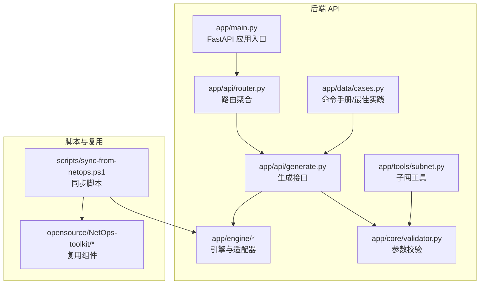
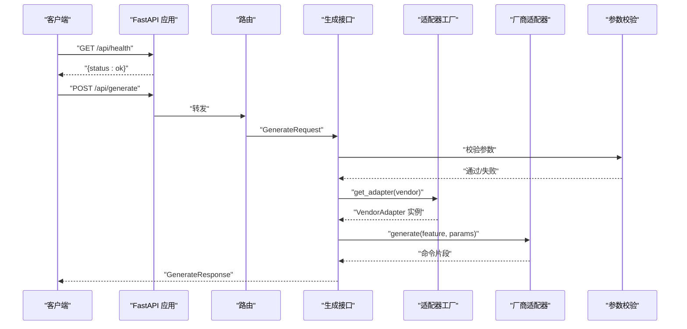
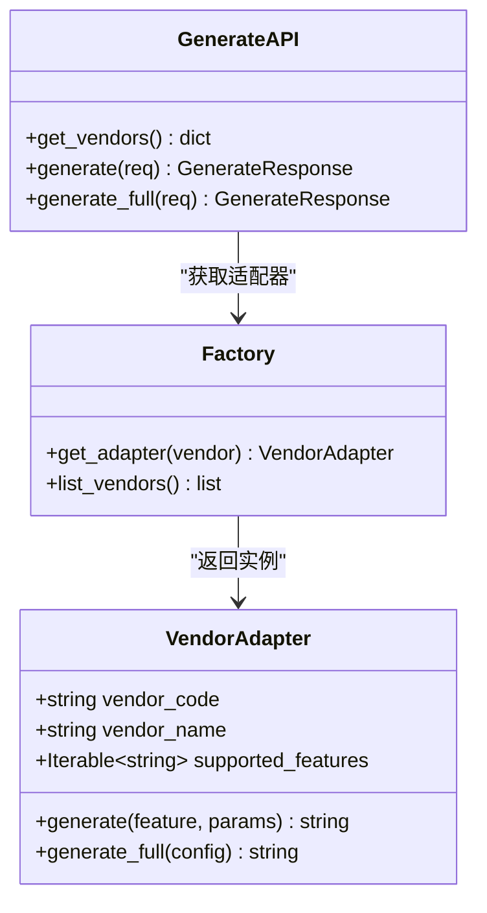
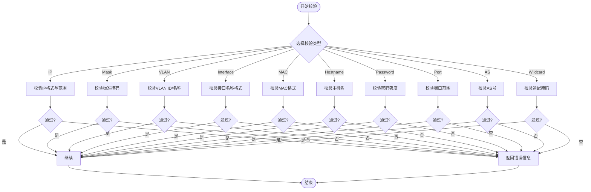
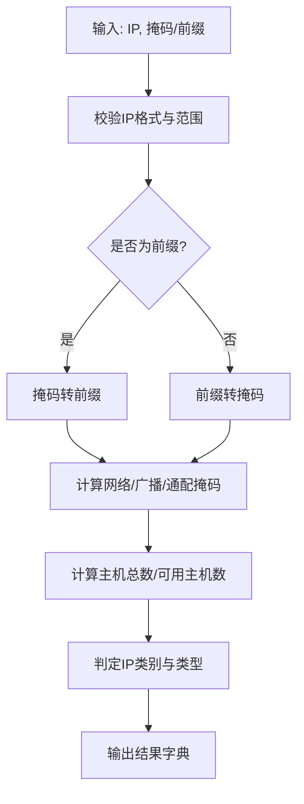
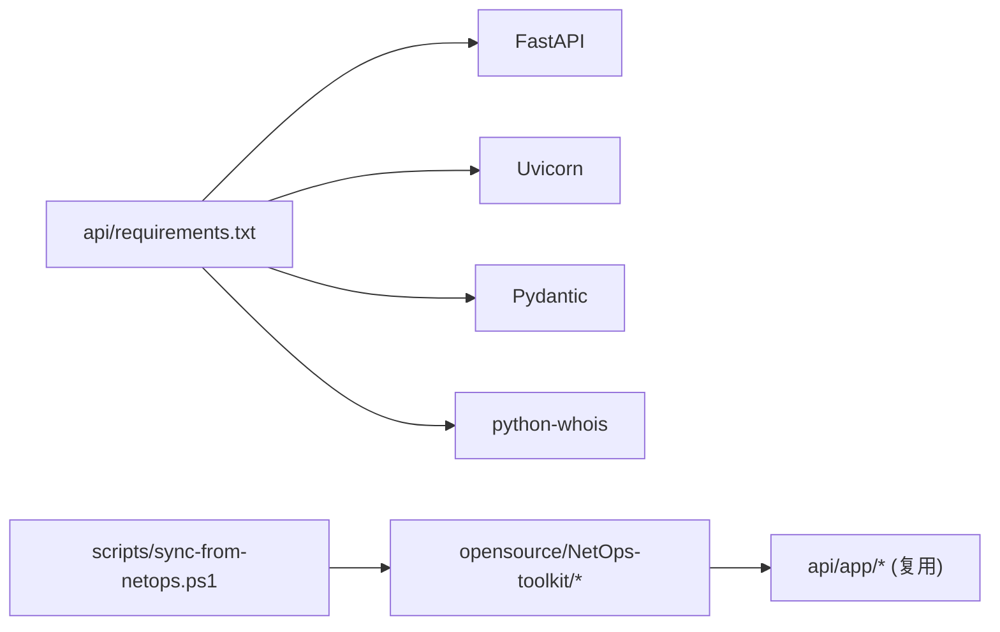

# 故障排除

<cite>
**本文引用的文件**
- [api/README.md](file://api/README.md)
- [api/requirements.txt](file://api/requirements.txt)
- [api/app/main.py](file://api/app/main.py)
- [api/app/api/router.py](file://api/app/api/router.py)
- [api/app/api/generate.py](file://api/app/api/generate.py)
- [api/app/engine/base.py](file://api/app/engine/base.py)
- [api/app/engine/factory.py](file://api/app/engine/factory.py)
- [api/app/core/validator.py](file://api/app/core/validator.py)
- [api/app/tools/subnet.py](file://api/app/tools/subnet.py)
- [api/app/data/cases.py](file://api/app/data/cases.py)
- [scripts/sync-from-netops.ps1](file://scripts/sync-from-netops.ps1)
- [opensource/NetOps-toolkit/README.md](file://opensource/NetOps-toolkit/README.md)
- [opensource/NetOps-toolkit/main.py](file://opensource/NetOps-toolkit/main.py)
</cite>

## 目录
1. [简介](#简介)
2. [项目结构](#项目结构)
3. [核心组件](#核心组件)
4. [架构总览](#架构总览)
5. [详细组件分析](#详细组件分析)
6. [依赖分析](#依赖分析)
7. [性能考虑](#性能考虑)
8. [故障排除指南](#故障排除指南)
9. [结论](#结论)
10. [附录](#附录)

## 简介
本指南面向NetCmdGen项目的使用者与开发者，聚焦于安装、运行时错误、性能与集成问题的系统化排查。内容涵盖：
- 安装与环境准备
- 启动与健康检查
- 常见运行时错误与HTTP错误码
- 日志与诊断方法
- 性能优化与资源使用
- 集成与第三方依赖问题
- 社区支持与问题反馈流程

## 项目结构
NetCmdGen采用前后端分离思路：后端为FastAPI服务，前端可独立部署；后端通过脚本从开源组件复用核心能力。

图表来源
- [api/app/main.py:1-29](file://api/app/main.py#L1-L29)
- [api/app/api/router.py:1-10](file://api/app/api/router.py#L1-L10)
- [api/app/api/generate.py:1-77](file://api/app/api/generate.py#L1-L77)
- [api/app/engine/factory.py:1-39](file://api/app/engine/factory.py#L1-L39)
- [api/app/core/validator.py:1-208](file://api/app/core/validator.py#L1-L208)
- [api/app/tools/subnet.py:1-280](file://api/app/tools/subnet.py#L1-L280)
- [api/app/data/cases.py:1-377](file://api/app/data/cases.py#L1-L377)
- [scripts/sync-from-netops.ps1:1-121](file://scripts/sync-from-netops.ps1#L1-L121)
- [opensource/NetOps-toolkit/README.md:1-236](file://opensource/NetOps-toolkit/README.md#L1-L236)

章节来源
- [api/README.md:1-47](file://api/README.md#L1-L47)
- [api/app/main.py:1-29](file://api/app/main.py#L1-L29)
- [api/app/api/router.py:1-10](file://api/app/api/router.py#L1-L10)
- [scripts/sync-from-netops.ps1:1-121](file://scripts/sync-from-netops.ps1#L1-L121)

## 核心组件
- 应用入口与中间件：FastAPI实例、CORS中间件、健康检查端点
- 路由聚合：生成接口与工具接口的统一挂载
- 命令生成引擎：适配器协议、工厂注册与异常类型
- 参数校验：IP、掩码、VLAN、接口、MAC、主机名、密码、端口、AS号、通配掩码等
- 网络工具：子网计算、CIDR转换、子网划分、IP范围转CIDR
- 数据与手册：厂商命令参考、最佳实践、快捷键

章节来源
- [api/app/main.py:1-29](file://api/app/main.py#L1-L29)
- [api/app/api/router.py:1-10](file://api/app/api/router.py#L1-L10)
- [api/app/engine/base.py:1-36](file://api/app/engine/base.py#L1-L36)
- [api/app/engine/factory.py:1-39](file://api/app/engine/factory.py#L1-L39)
- [api/app/core/validator.py:1-208](file://api/app/core/validator.py#L1-L208)
- [api/app/tools/subnet.py:1-280](file://api/app/tools/subnet.py#L1-L280)
- [api/app/data/cases.py:1-377](file://api/app/data/cases.py#L1-L377)

## 架构总览
后端服务通过FastAPI提供REST接口，内部通过适配器工厂按厂商分发到对应生成器，参数由校验器保障输入质量，工具模块提供网络计算能力，数据模块提供命令手册与最佳实践。

图表来源
- [api/app/main.py:25-29](file://api/app/main.py#L25-L29)
- [api/app/api/router.py:8-9](file://api/app/api/router.py#L8-L9)
- [api/app/api/generate.py:53-76](file://api/app/api/generate.py#L53-L76)
- [api/app/engine/factory.py:20-26](file://api/app/engine/factory.py#L20-L26)
- [api/app/core/validator.py:11-208](file://api/app/core/validator.py#L11-L208)

## 详细组件分析

### 生成接口与适配器工厂
- 生成接口支持两类请求：单特性片段生成与完整配置生成，并对厂商与特性进行校验与异常映射为HTTP错误码。
- 适配器工厂负责厂商注册与实例化，未注册厂商会抛出“厂商不支持”异常。
- 引擎抽象定义了厂商适配器协议，确保统一调用入口。

图表来源
- [api/app/engine/base.py:11-36](file://api/app/engine/base.py#L11-L36)
- [api/app/engine/factory.py:20-39](file://api/app/engine/factory.py#L20-L39)
- [api/app/api/generate.py:48-76](file://api/app/api/generate.py#L48-L76)

章节来源
- [api/app/api/generate.py:1-77](file://api/app/api/generate.py#L1-L77)
- [api/app/engine/base.py:1-36](file://api/app/engine/base.py#L1-L36)
- [api/app/engine/factory.py:1-39](file://api/app/engine/factory.py#L1-L39)

### 参数校验器
- 覆盖IP地址、子网掩码、VLAN ID/名称、接口名称、MAC地址、主机名、密码强度、端口、AS号、通配掩码等。
- 提供统一的校验方法与错误消息封装，便于在生成流程中前置拦截非法输入。

图表来源
- [api/app/core/validator.py:11-208](file://api/app/core/validator.py#L11-L208)

章节来源
- [api/app/core/validator.py:1-208](file://api/app/core/validator.py#L1-L208)

### 子网计算工具
- 支持IP与掩码/前缀互转、网络/广播/可用主机数、二进制表示、IP分类与类型判断、子网划分、CIDR合并。
- 对输入进行严格校验，非法输入返回错误信息而非抛异常，便于前端友好提示。

图表来源
- [api/app/tools/subnet.py:51-166](file://api/app/tools/subnet.py#L51-L166)

章节来源
- [api/app/tools/subnet.py:1-280](file://api/app/tools/subnet.py#L1-L280)

### 命令手册与最佳实践
- 提供多厂商命令参考、最佳实践清单与常用快捷键，辅助生成与排错。
- 生成接口可结合手册与校验器，提升生成质量与一致性。

章节来源
- [api/app/data/cases.py:1-377](file://api/app/data/cases.py#L1-L377)

## 依赖分析
- 后端依赖：FastAPI、Uvicorn、Pydantic、python-whois
- 复用来源：NetOps-toolkit（MIT）
- 同步脚本：将上游组件复制到后端目录，保持零修改拷贝

图表来源
- [api/requirements.txt:1-5](file://api/requirements.txt#L1-L5)
- [scripts/sync-from-netops.ps1:62-117](file://scripts/sync-from-netops.ps1#L62-L117)
- [opensource/NetOps-toolkit/README.md:107-153](file://opensource/NetOps-toolkit/README.md#L107-L153)

章节来源
- [api/requirements.txt:1-5](file://api/requirements.txt#L1-L5)
- [scripts/sync-from-netops.ps1:1-121](file://scripts/sync-from-netops.ps1#L1-L121)
- [opensource/NetOps-toolkit/README.md:1-236](file://opensource/NetOps-toolkit/README.md#L1-L236)

## 性能考虑
- 生成接口为纯逻辑计算，复杂度主要取决于参数规模与适配器实现；建议：
  - 控制单次生成的参数体量，避免超大配置一次性提交
  - 对高频调用进行缓存（如厂商/特性码列表），减少重复初始化
  - 将网络工具调用（如子网计算）放在后端异步任务队列中，避免阻塞请求
- 子网计算为纯CPU操作，建议：
  - 对频繁的CIDR转换与子网划分使用内存缓存
  - 合理拆分请求，避免一次性计算过多CIDR块
- CORS与中间件开销极低，无需额外优化

## 故障排除指南

### 一、安装与环境问题
- 症状：pip安装依赖报错或uvicorn不可用
  - 排查要点：
    - Python版本与依赖版本是否满足要求
    - pip源是否可用，必要时切换为国内镜像
    - uvicorn是否正确安装且可执行
  - 解决步骤：
    - 重新安装依赖：[api/README.md:13-14](file://api/README.md#L13-L14)
    - 确认依赖版本：[api/requirements.txt:1-5](file://api/requirements.txt#L1-L5)
- 症状：同步脚本执行失败
  - 排查要点：
    - 脚本路径与工作目录是否正确
    - 源目录是否存在
  - 解决步骤：
    - 从仓库根目录执行脚本：[scripts/sync-from-netops.ps1:10](file://scripts/sync-from-netops.ps1#L10)
    - 确保源目录存在：[scripts/sync-from-netops.ps1:29-31](file://scripts/sync-from-netops.ps1#L29-L31)

章节来源
- [api/README.md:13-18](file://api/README.md#L13-L18)
- [api/requirements.txt:1-5](file://api/requirements.txt#L1-L5)
- [scripts/sync-from-netops.ps1:10](file://scripts/sync-from-netops.ps1#L10)
- [scripts/sync-from-netops.ps1:29-31](file://scripts/sync-from-netops.ps1#L29-L31)

### 二、启动与健康检查
- 症状：访问健康检查返回非200
  - 排查要点：
    - 服务是否成功启动
    - 端口占用情况
  - 解决步骤：
    - 启动服务：[api/README.md:16-17](file://api/README.md#L16-L17)
    - 访问健康检查：[api/README.md:20-23](file://api/README.md#L20-L23)
    - 查看应用入口与CORS配置：[api/app/main.py:1-29](file://api/app/main.py#L1-L29)

章节来源
- [api/README.md:16-23](file://api/README.md#L16-L23)
- [api/app/main.py:1-29](file://api/app/main.py#L1-L29)

### 三、运行时错误与HTTP错误码
- 400 错误（请求错误）
  - 场景：厂商不被支持、特性码不被支持、参数校验失败
  - 定位方法：
    - 检查厂商与特性码是否在支持列表中：[api/app/api/generate.py:48-50](file://api/app/api/generate.py#L48-L50)
    - 检查适配器工厂注册：[api/app/engine/factory.py:15-26](file://api/app/engine/factory.py#L15-L26)
    - 检查参数校验器返回：[api/app/core/validator.py:11-208](file://api/app/core/validator.py#L11-L208)
- 500 错误（服务器内部错误）
  - 场景：生成过程异常
  - 定位方法：
    - 捕获异常并返回500：[api/app/api/generate.py:62-63](file://api/app/api/generate.py#L62-L63)
    - 检查适配器实现与输入参数
- 建议：
  - 在生成接口捕获异常并记录上下文（厂商、特性、参数摘要）
  - 对400错误返回明确的错误信息，便于前端提示

章节来源
- [api/app/api/generate.py:48-76](file://api/app/api/generate.py#L48-L76)
- [api/app/engine/factory.py:15-26](file://api/app/engine/factory.py#L15-L26)
- [api/app/core/validator.py:11-208](file://api/app/core/validator.py#L11-L208)

### 四、参数校验失败
- 常见问题：
  - IP地址格式或取值越界
  - 子网掩码非连续或不在有效集合
  - VLAN ID不在1-4094范围
  - 接口名称不符合厂商规范
  - MAC地址格式不匹配
  - 主机名长度或字符不合法
  - 密码长度或强度不足
  - 端口/AS号范围不合法
  - 通配掩码格式不正确
- 排查步骤：
  - 使用校验器逐一验证字段
  - 对返回的错误信息进行前端提示
- 参考实现位置：
  - [api/app/core/validator.py:11-208](file://api/app/core/validator.py#L11-L208)

章节来源
- [api/app/core/validator.py:11-208](file://api/app/core/validator.py#L11-L208)

### 五、子网工具异常
- 症状：子网计算返回错误信息
  - 排查要点：
    - 输入IP格式与范围
    - 掩码/前缀合法性
    - 子网划分/合并的边界条件
  - 解决步骤：
    - 使用子网工具进行验证：[api/app/tools/subnet.py:51-166](file://api/app/tools/subnet.py#L51-L166)
    - 对异常输入给出明确提示，避免直接抛出异常

章节来源
- [api/app/tools/subnet.py:51-166](file://api/app/tools/subnet.py#L51-L166)

### 六、集成与第三方依赖问题
- 症状：导入复用模块时报错
  - 排查要点：
    - 同步脚本是否正确执行
    - 目标目录结构是否完整（包含空的__init__.py）
  - 解决步骤：
    - 执行同步脚本：[scripts/sync-from-netops.ps1:62-117](file://scripts/sync-from-netops.ps1#L62-L117)
    - 确认目标目录存在且包含__init__.py
- 症状：复用组件版本更新后行为变化
  - 排查要点：
    - 比较上游README与当前复用文件差异
    - 如需更新，重新执行同步脚本
  - 参考：
    - [opensource/NetOps-toolkit/README.md:107-153](file://opensource/NetOps-toolkit/README.md#L107-L153)

章节来源
- [scripts/sync-from-netops.ps1:37-59](file://scripts/sync-from-netops.ps1#L37-L59)
- [scripts/sync-from-netops.ps1:62-117](file://scripts/sync-from-netops.ps1#L62-L117)
- [opensource/NetOps-toolkit/README.md:107-153](file://opensource/NetOps-toolkit/README.md#L107-L153)

### 七、日志分析与诊断
- 健康检查：确认服务存活
  - 访问：[api/README.md:20-23](file://api/README.md#L20-L23)
- 请求级诊断：
  - 记录请求体摘要（厂商、特性、参数关键字段）
  - 对400/500错误记录异常栈与上下文
- 工具级诊断：
  - 子网工具返回的错误信息可直接用于前端提示
- 建议：
  - 使用统一的日志格式，包含时间戳、请求ID、路径、状态码、耗时
  - 对敏感参数（如密码）做脱敏处理

章节来源
- [api/README.md:20-23](file://api/README.md#L20-L23)
- [api/app/api/generate.py:53-76](file://api/app/api/generate.py#L53-L76)
- [api/app/tools/subnet.py:51-166](file://api/app/tools/subnet.py#L51-L166)

### 八、性能与资源优化
- 生成接口：
  - 控制参数规模，避免超大配置一次性提交
  - 缓存厂商/特性码列表与常用配置片段
- 子网工具：
  - 对频繁计算的结果进行内存缓存
  - 合理拆分请求，避免一次性计算大量CIDR
- 依赖与并发：
  - 使用Uvicorn的多进程/多线程模式（生产环境）
  - 关注python-whois的网络超时与重试策略

章节来源
- [api/requirements.txt:1-5](file://api/requirements.txt#L1-L5)

### 九、社区支持与问题反馈
- 项目复用来源与许可证：
  - 参考开源组件说明与许可证：[opensource/NetOps-toolkit/README.md:1-236](file://opensource/NetOps-toolkit/README.md#L1-L236)
- 问题反馈建议：
  - 提供环境信息（Python版本、依赖版本、操作系统）
  - 提供最小可复现请求与期望/实际响应
  - 附带相关日志与错误码
- 代码入口与运行方式：
  - 后端入口与运行方式：[api/README.md:7-18](file://api/README.md#L7-L18)
  - GUI主程序入口（如需本地运行GUI）：[opensource/NetOps-toolkit/main.py:25-43](file://opensource/NetOps-toolkit/main.py#L25-L43)

章节来源
- [opensource/NetOps-toolkit/README.md:1-236](file://opensource/NetOps-toolkit/README.md#L1-L236)
- [api/README.md:7-18](file://api/README.md#L7-L18)
- [opensource/NetOps-toolkit/main.py:25-43](file://opensource/NetOps-toolkit/main.py#L25-L43)

## 结论
通过本指南，您可以在安装、启动、参数校验、生成流程、工具使用与集成等方面快速定位与解决问题。建议在生产环境中完善日志与监控，结合缓存与异步任务提升性能，并遵循社区反馈流程持续改进。

## 附录

### A. 常用端点与用途
- 健康检查：GET /api/health
- 列出厂商：GET /api/vendors
- 生成命令片段：POST /api/generate
- 生成完整配置：POST /api/generate/full
- 子网工具：GET /api/tools/subnet（示例端点由路由聚合引入）

章节来源
- [api/README.md:20-23](file://api/README.md#L20-L23)
- [api/app/api/router.py:8-9](file://api/app/api/router.py#L8-L9)