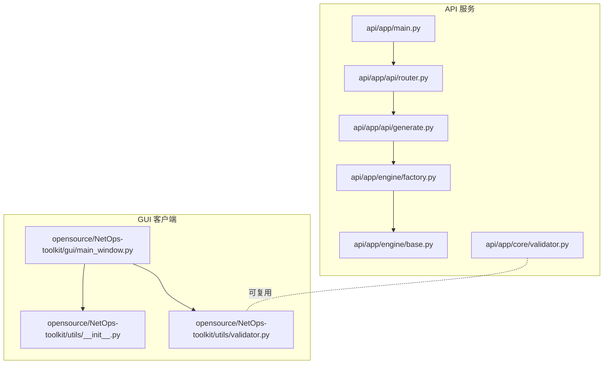
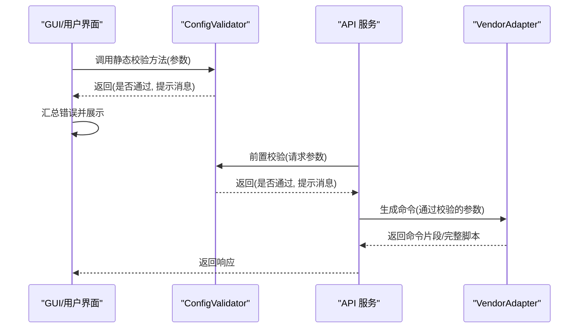
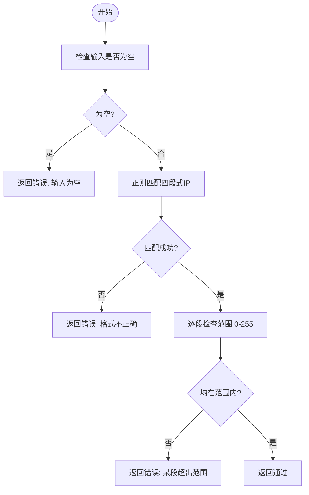
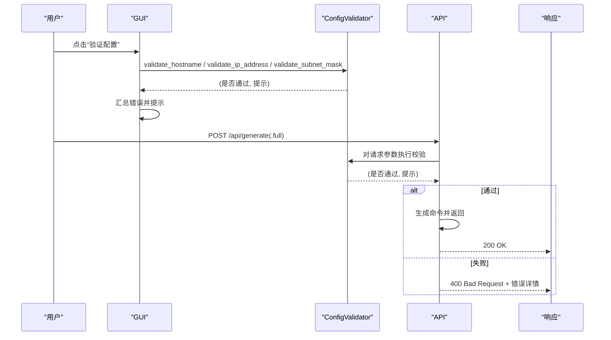
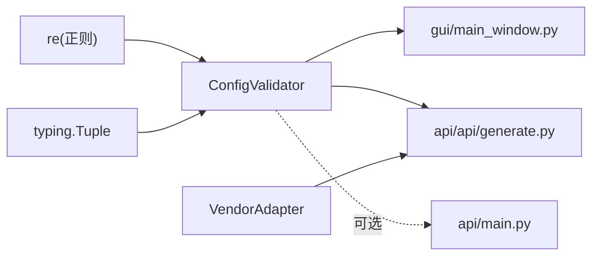

# 参数验证器

<cite>
**本文引用的文件**
- [api/app/core/validator.py](file://api/app/core/validator.py)
- [opensource/NetOps-toolkit/utils/validator.py](file://opensource/NetOps-toolkit/utils/validator.py)
- [opensource/NetOps-toolkit/gui/main_window.py](file://opensource/NetOps-toolkit/gui/main_window.py)
- [opensource/NetOps-toolkit/utils/__init__.py](file://opensource/NetOps-toolkit/utils/__init__.py)
- [api/app/api/generate.py](file://api/app/api/generate.py)
- [api/app/api/router.py](file://api/app/api/router.py)
- [api/app/main.py](file://api/app/main.py)
- [api/app/engine/base.py](file://api/app/engine/base.py)
- [api/app/engine/factory.py](file://api/app/engine/factory.py)
- [api/app/engine/vendors/huawei/basic.py](file://api/app/engine/vendors/huawei/basic.py)
- [api/app/engine/vendors/huawei/vlan.py](file://api/app/engine/vendors/huawei/vlan.py)
- [api/app/data/cases.py](file://api/app/data/cases.py)
</cite>

## 目录
1. [简介](#简介)
2. [项目结构](#项目结构)
3. [核心组件](#核心组件)
4. [架构总览](#架构总览)
5. [详细组件分析](#详细组件分析)
6. [依赖分析](#依赖分析)
7. [性能考虑](#性能考虑)
8. [故障排查指南](#故障排查指南)
9. [结论](#结论)
10. [附录](#附录)

## 简介
本文件面向“参数验证器”的技术文档，系统阐述验证规则体系、验证流程与错误处理机制，覆盖IP地址、VLAN ID、端口范围、路由前缀（通配反掩码）、接口名称、MAC地址、主机名、密码强度、AS号等关键参数类型。文档同时介绍验证器的扩展机制、自定义验证规则与插件化架构建议，并说明错误分类、错误消息国际化与用户体验优化策略，最后给出性能优化、缓存与批量验证的实践建议及API设计思路与最佳实践。

## 项目结构
验证器在本仓库中存在两套实现：
- API侧核心验证器：位于 api/app/core/validator.py
- GUI侧复用验证器：位于 opensource/NetOps-toolkit/utils/validator.py

两者功能高度一致，均提供统一的静态方法进行参数校验，并返回布尔值与提示消息。GUI侧还提供了 validate_and_show_errors 辅助函数用于快速拼装错误消息。

此外，验证器在以下位置被使用：
- GUI界面中对主机名、管理IP、子网掩码等进行即时校验
- API路由中通过适配器生成命令时，参数通常来自外部输入，可在调用前进行前置校验（建议）

图表来源
- [api/app/main.py:1-29](file://api/app/main.py#L1-L29)
- [api/app/api/router.py:1-10](file://api/app/api/router.py#L1-L10)
- [api/app/api/generate.py:1-77](file://api/app/api/generate.py#L1-L77)
- [api/app/engine/base.py:1-36](file://api/app/engine/base.py#L1-L36)
- [api/app/engine/factory.py:1-39](file://api/app/engine/factory.py#L1-L39)
- [api/app/core/validator.py:1-208](file://api/app/core/validator.py#L1-L208)
- [opensource/NetOps-toolkit/gui/main_window.py:639-668](file://opensource/NetOps-toolkit/gui/main_window.py#L639-L668)
- [opensource/NetOps-toolkit/utils/__init__.py:1-18](file://opensource/NetOps-toolkit/utils/__init__.py#L1-L18)
- [opensource/NetOps-toolkit/utils/validator.py:1-208](file://opensource/NetOps-toolkit/utils/validator.py#L1-L208)

章节来源
- [api/app/main.py:1-29](file://api/app/main.py#L1-L29)
- [api/app/api/router.py:1-10](file://api/app/api/router.py#L1-L10)
- [api/app/api/generate.py:1-77](file://api/app/api/generate.py#L1-L77)
- [api/app/engine/base.py:1-36](file://api/app/engine/base.py#L1-L36)
- [api/app/engine/factory.py:1-39](file://api/app/engine/factory.py#L1-L39)
- [api/app/core/validator.py:1-208](file://api/app/core/validator.py#L1-L208)
- [opensource/NetOps-toolkit/gui/main_window.py:639-668](file://opensource/NetOps-toolkit/gui/main_window.py#L639-L668)
- [opensource/NetOps-toolkit/utils/__init__.py:1-18](file://opensource/NetOps-toolkit/utils/__init__.py#L1-L18)
- [opensource/NetOps-toolkit/utils/validator.py:1-208](file://opensource/NetOps-toolkit/utils/validator.py#L1-L208)

## 核心组件
- 统一验证器类：提供静态方法对各类参数进行格式与取值范围校验，返回二元组（是否通过，提示消息）
- 辅助函数：validate_and_show_errors 将校验结果转为用户可读的错误字符串
- 使用方：
  - GUI：在点击“验证配置”按钮时，对主机名、管理IP、子网掩码等字段逐一调用验证器
  - API：在生成命令前，可对请求体中的参数进行前置校验（建议）

章节来源
- [api/app/core/validator.py:11-208](file://api/app/core/validator.py#L11-L208)
- [opensource/NetOps-toolkit/utils/validator.py:11-208](file://opensource/NetOps-toolkit/utils/validator.py#L11-L208)
- [opensource/NetOps-toolkit/gui/main_window.py:639-668](file://opensource/NetOps-toolkit/gui/main_window.py#L639-L668)
- [opensource/NetOps-toolkit/utils/__init__.py:7-8](file://opensource/NetOps-toolkit/utils/__init__.py#L7-L8)

## 架构总览
验证器采用“纯函数式+静态方法”的设计，无状态、可复用、易测试。GUI与API两端均可直接调用，形成“输入参数 → 静态校验 → 错误收集/提示”的标准流程。

图表来源
- [api/app/core/validator.py:14-31](file://api/app/core/validator.py#L14-L31)
- [api/app/api/generate.py:53-76](file://api/app/api/generate.py#L53-L76)
- [api/app/engine/base.py:19-27](file://api/app/engine/base.py#L19-L27)

## 详细组件分析

### IP 地址与子网掩码
- IP 地址：非空检查、四段式正则匹配、每段数值范围 0-255
- 子网掩码：非空检查、预定义合法掩码集合校验（连续1后跟连续0）

图表来源
- [api/app/core/validator.py:15-31](file://api/app/core/validator.py#L15-L31)
- [api/app/core/validator.py:34-56](file://api/app/core/validator.py#L34-L56)

章节来源
- [api/app/core/validator.py:15-56](file://api/app/core/validator.py#L15-L56)
- [opensource/NetOps-toolkit/utils/validator.py:15-56](file://opensource/NetOps-toolkit/utils/validator.py#L15-L56)

### VLAN ID 与名称
- VLAN ID：整数类型检查、范围 1-4094
- VLAN 名称：可选；若提供则长度不超过32，仅允许字母、数字、下划线、连字符

章节来源
- [api/app/core/validator.py:59-81](file://api/app/core/validator.py#L59-L81)
- [opensource/NetOps-toolkit/utils/validator.py:59-81](file://opensource/NetOps-toolkit/utils/validator.py#L59-L81)

### 接口名称
- 支持多种厂商接口命名风格（如 GE/XGE/Ethernet/Eth-Trunk/Vlanif/LoopBack 等），大小写不敏感

章节来源
- [api/app/core/validator.py:84-104](file://api/app/core/validator.py#L84-L104)
- [opensource/NetOps-toolkit/utils/validator.py:84-104](file://opensource/NetOps-toolkit/utils/validator.py#L84-L104)

### MAC 地址
- 支持三种常见格式：冒号分隔、短横线分隔、点分组十六进制

章节来源
- [api/app/core/validator.py:107-122](file://api/app/core/validator.py#L107-L122)
- [opensource/NetOps-toolkit/utils/validator.py:107-122](file://opensource/NetOps-toolkit/utils/validator.py#L107-L122)

### 主机名
- 非空、长度不超过64、首字符字母、其余字符允许字母/数字/连字符

章节来源
- [api/app/core/validator.py:125-136](file://api/app/core/validator.py#L125-L136)
- [opensource/NetOps-toolkit/utils/validator.py:125-136](file://opensource/NetOps-toolkit/utils/validator.py#L125-L136)

### 密码强度
- 非空、长度 8-128
- 至少包含小写字母、大写字母、数字、特殊字符中的3种

章节来源
- [api/app/core/validator.py:139-160](file://api/app/core/validator.py#L139-L160)
- [opensource/NetOps-toolkit/utils/validator.py:139-160](file://opensource/NetOps-toolkit/utils/validator.py#L139-L160)

### 端口号与 AS 号
- 端口号：整数、范围 1-65535
- AS 号：整数、范围 1-4294967295

章节来源
- [api/app/core/validator.py:163-182](file://api/app/core/validator.py#L163-L182)
- [opensource/NetOps-toolkit/utils/validator.py:163-182](file://opensource/NetOps-toolkit/utils/validator.py#L163-L182)

### 通配反掩码（路由前缀）
- 非空检查
- 先按IP地址规则校验格式
- 再检查各段递减顺序（连续0/1的合法性）

章节来源
- [api/app/core/validator.py:185-199](file://api/app/core/validator.py#L185-L199)
- [opensource/NetOps-toolkit/utils/validator.py:185-199](file://opensource/NetOps-toolkit/utils/validator.py#L185-L199)

### 验证流程与错误处理
- GUI端：点击“验证配置”，对主机名、管理IP、子网掩码等字段逐一调用验证器，汇总错误并弹窗提示
- API端：建议在 generate/generate/full 之前对请求参数执行校验，出现非法参数时返回 400 并携带具体错误信息

图表来源
- [opensource/NetOps-toolkit/gui/main_window.py:639-668](file://opensource/NetOps-toolkit/gui/main_window.py#L639-L668)
- [api/app/api/generate.py:53-76](file://api/app/api/generate.py#L53-L76)
- [api/app/core/validator.py:14-31](file://api/app/core/validator.py#L14-L31)

章节来源
- [opensource/NetOps-toolkit/gui/main_window.py:639-668](file://opensource/NetOps-toolkit/gui/main_window.py#L639-L668)
- [api/app/api/generate.py:53-76](file://api/app/api/generate.py#L53-L76)

### 扩展机制与插件化架构
- 当前验证器为静态方法集合，易于扩展新规则：新增静态方法并在调用处集中使用
- 插件化建议：
  - 定义统一的验证协议（类似 VendorAdapter），不同厂商或场景可注册独立验证器实例
  - 通过工厂/注册表管理验证器，实现按需加载与替换
  - 将验证器与生成器解耦，生成器只消费已通过验证的数据

章节来源
- [api/app/engine/base.py:11-36](file://api/app/engine/base.py#L11-L36)
- [api/app/engine/factory.py:14-39](file://api/app/engine/factory.py#L14-L39)

### 自定义验证规则
- 新增规则：在现有类中添加新的静态方法，保持返回值约定一致
- 组合验证：对复合参数（如接口+VLAN）可封装组合校验逻辑
- 国际化：将错误消息集中管理，按语言环境返回对应文案

章节来源
- [api/app/core/validator.py:11-208](file://api/app/core/validator.py#L11-L208)
- [opensource/NetOps-toolkit/utils/validator.py:11-208](file://opensource/NetOps-toolkit/utils/validator.py#L11-L208)

### 错误分类与消息组织
- 分类建议：
  - 必填项缺失
  - 格式不正确（正则/枚举）
  - 数值越界（范围）
  - 业务约束（如反掩码连续性）
- 消息组织：validate_and_show_errors 提供统一的错误字符串拼接，便于前端展示

章节来源
- [api/app/core/validator.py:202-208](file://api/app/core/validator.py#L202-L208)
- [opensource/NetOps-toolkit/utils/validator.py:202-208](file://opensource/NetOps-toolkit/utils/validator.py#L202-L208)

### 用户体验优化
- 即时反馈：GUI端在输入框失焦或点击“验证配置”时进行校验
- 清晰提示：将每个字段的错误单独列出，避免长串错误导致阅读困难
- 成功提示：全部通过时给出明确的成功提示

章节来源
- [opensource/NetOps-toolkit/gui/main_window.py:639-668](file://opensource/NetOps-toolkit/gui/main_window.py#L639-L668)

## 依赖分析
- 验证器依赖：正则表达式库、typing 的 Tuple 约束
- 使用依赖：
  - GUI：直接导入 ConfigValidator 并在事件回调中调用
  - API：可直接在路由层调用验证器，或在适配器内部调用
- 适配器依赖：VendorAdapter 协议定义了 generate/generate_full 的签名，验证器与之解耦

图表来源
- [api/app/core/validator.py:7-8](file://api/app/core/validator.py#L7-L8)
- [opensource/NetOps-toolkit/utils/validator.py:7-8](file://opensource/NetOps-toolkit/utils/validator.py#L7-L8)
- [opensource/NetOps-toolkit/gui/main_window.py:22](file://opensource/NetOps-toolkit/gui/main_window.py#L22)
- [api/app/api/generate.py:12-16](file://api/app/api/generate.py#L12-L16)
- [api/app/engine/base.py:11-27](file://api/app/engine/base.py#L11-L27)

章节来源
- [api/app/core/validator.py:7-8](file://api/app/core/validator.py#L7-L8)
- [opensource/NetOps-toolkit/utils/validator.py:7-8](file://opensource/NetOps-toolkit/utils/validator.py#L7-L8)
- [opensource/NetOps-toolkit/gui/main_window.py:22](file://opensource/NetOps-toolkit/gui/main_window.py#L22)
- [api/app/api/generate.py:12-16](file://api/app/api/generate.py#L12-L16)
- [api/app/engine/base.py:11-27](file://api/app/engine/base.py#L11-L27)

## 性能考虑
- 正则匹配：IP/VLAN/接口等规则均为轻量正则，性能开销极低
- 缓存建议：
  - 对于重复出现的固定掩码/接口前缀，可预先编译正则并缓存 Pattern
  - 对于频繁调用的组合校验，可缓存中间结果
- 批量验证：
  - GUI端可将多个字段一次性提交给验证器，减少多次往返
  - API端可在单次请求中对多个参数并行校验（注意线程安全与幂等性）

[本节为通用性能建议，无需特定文件来源]

## 故障排查指南
- 常见问题
  - IP/掩码格式错误：检查是否包含非数字或超出范围
  - 接口名称不匹配：确认命名风格是否符合支持的正则集合
  - VLAN 名称超长或包含非法字符：限制长度并仅使用允许字符
  - 反掩码不连续：确保从高位到低位为连续的0/1
- 定位方法
  - 在 GUI 中逐项验证，定位首个失败项
  - 在 API 中打印请求参数与错误消息，核对字段映射
- 修复建议
  - 修正格式或范围
  - 使用示例格式（验证器注释中提供示例）

章节来源
- [api/app/core/validator.py:15-199](file://api/app/core/validator.py#L15-L199)
- [opensource/NetOps-toolkit/utils/validator.py:15-199](file://opensource/NetOps-toolkit/utils/validator.py#L15-L199)

## 结论
该验证器以简洁稳定的静态方法为核心，覆盖网络设备配置的关键参数类型，具备良好的可读性与可扩展性。结合 GUI 的即时反馈与 API 的前置校验，能够显著提升用户体验与系统健壮性。建议在未来引入协议化与工厂化机制，进一步增强插件化能力与国际化支持。

## 附录

### API 设计思路与最佳实践
- 设计原则
  - 明确的输入输出契约：统一返回(是否通过, 提示消息)
  - 可组合的校验单元：将复杂参数拆分为原子规则
  - 可配置的阈值：如长度上限、范围边界可通过配置调整
- 最佳实践
  - 在 API 层对请求参数进行前置校验，失败即返回 400
  - 在 GUI 层提供即时校验与汇总提示
  - 将错误消息集中管理，支持多语言
  - 对热点规则进行正则预编译与结果缓存

章节来源
- [api/app/api/generate.py:53-76](file://api/app/api/generate.py#L53-L76)
- [api/app/engine/base.py:19-27](file://api/app/engine/base.py#L19-L27)
- [api/app/engine/factory.py:20-39](file://api/app/engine/factory.py#L20-L39)