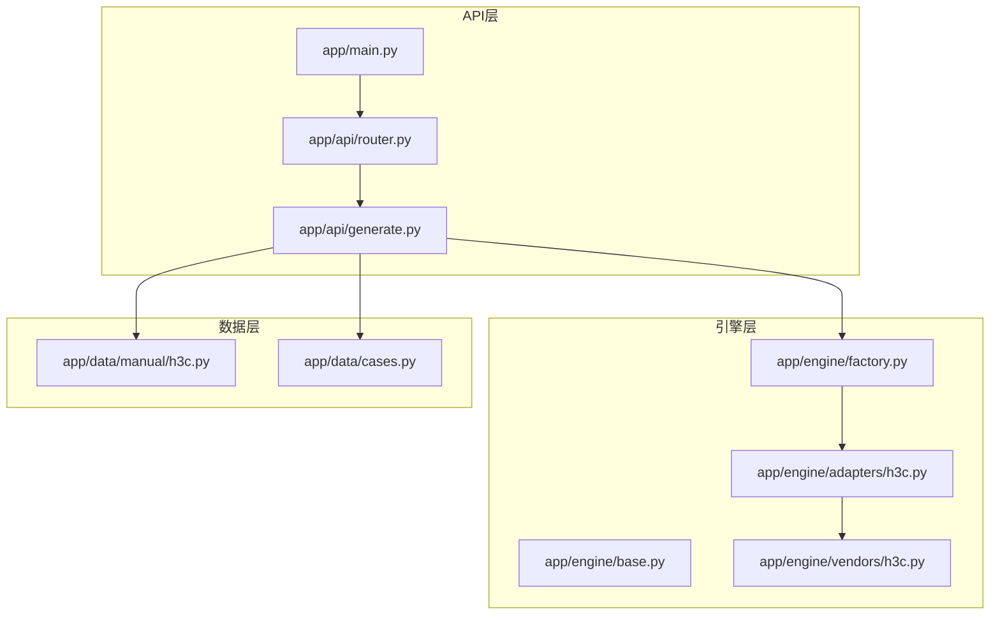
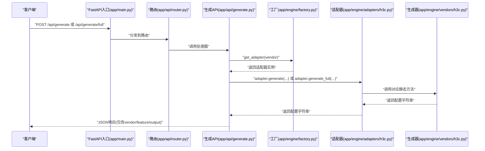
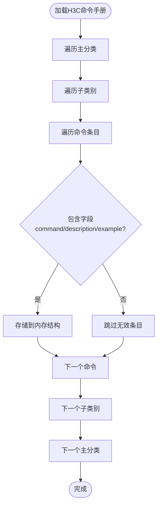
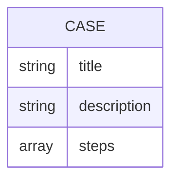
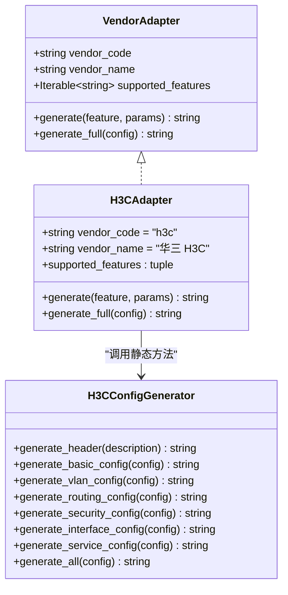
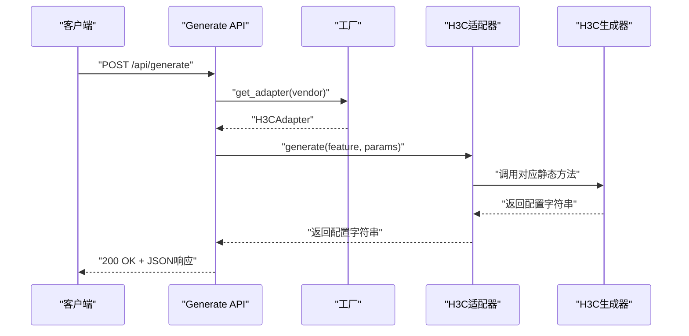
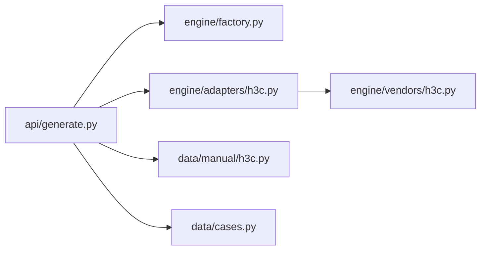

# H3C命令速查

<cite>
**本文引用的文件**
- [api/app/data/manual/h3c.py](file://api/app/data/manual/h3c.py)
- [api/app/data/cases.py](file://api/app/data/cases.py)
- [api/app/engine/base.py](file://api/app/engine/base.py)
- [api/app/engine/factory.py](file://api/app/engine/factory.py)
- [api/app/engine/adapters/h3c.py](file://api/app/engine/adapters/h3c.py)
- [api/app/engine/vendors/h3c.py](file://api/app/engine/vendors/h3c.py)
- [api/app/api/generate.py](file://api/app/api/generate.py)
- [api/app/api/router.py](file://api/app/api/router.py)
- [api/app/main.py](file://api/app/main.py)
- [api/tests/sample-h3c-full.json](file://api/tests/sample-h3c-full.json)
- [api/tests/sample-h3c-vlan.json](file://api/tests/sample-h3c-vlan.json)
- [api/README.md](file://api/README.md)
</cite>

## 目录
1. [简介](#简介)
2. [项目结构](#项目结构)
3. [核心组件](#核心组件)
4. [架构总览](#架构总览)
5. [详细组件分析](#详细组件分析)
6. [依赖分析](#依赖分析)
7. [性能考虑](#性能考虑)
8. [故障排查指南](#故障排查指南)
9. [结论](#结论)
10. [附录](#附录)

## 简介
本文件为“H3C命令速查库”的技术文档，面向网络工程师与自动化开发人员，系统化阐述H3C交换机命令手册的数据结构、分类体系与API设计，并提供命令查询与生成的实现思路。文档覆盖以下主题：
- H3C命令手册的九个主要分类：基础配置、接口配置、路由配置、安全配置、生成树配置、高可用配置、管理与监控、QoS配置、IPv6配置
- 每个分类下的子类别与具体命令，以及命令数据结构（command、description、example）
- 配置案例（title、description、steps）的组织方式
- 命令查询API的设计与实现（按分类检索、模糊搜索、快速定位）

## 项目结构
后端采用FastAPI框架，核心模块围绕“命令速查数据 + 命令生成引擎 + API路由”展开：
- 数据层：命令手册与配置案例
- 引擎层：厂商适配器与各厂商配置生成器
- 路由层：统一的API入口与响应模型
- 测试样例：演示POST请求体结构与字段含义

**图表来源**
- [api/app/main.py:1-29](file://api/app/main.py#L1-L29)
- [api/app/api/router.py:1-10](file://api/app/api/router.py#L1-L10)
- [api/app/api/generate.py:1-77](file://api/app/api/generate.py#L1-L77)
- [api/app/engine/base.py:1-36](file://api/app/engine/base.py#L1-L36)
- [api/app/engine/factory.py:1-39](file://api/app/engine/factory.py#L1-L39)
- [api/app/engine/adapters/h3c.py:1-42](file://api/app/engine/adapters/h3c.py#L1-L42)
- [api/app/engine/vendors/h3c.py:1-594](file://api/app/engine/vendors/h3c.py#L1-L594)
- [api/app/data/manual/h3c.py:1-710](file://api/app/data/manual/h3c.py#L1-L710)
- [api/app/data/cases.py:1-377](file://api/app/data/cases.py#L1-L377)

**章节来源**
- [api/README.md:1-47](file://api/README.md#L1-L47)
- [api/app/main.py:1-29](file://api/app/main.py#L1-L29)
- [api/app/api/router.py:1-10](file://api/app/api/router.py#L1-L10)
- [api/app/api/generate.py:1-77](file://api/app/api/generate.py#L1-L77)

## 核心组件
- 命令手册与案例数据
  - H3C命令手册：以嵌套字典形式组织，分为九个主分类，每个子分类包含若干命令条目，每条命令含command、description、example
  - 配置案例：以数组形式组织，每个案例含title、description、steps
- 命令生成引擎
  - 统一适配器协议：VendorAdapter定义vendor_code、vendor_name、supported_features与generate/generate_full接口
  - H3C适配器：将特性码映射到H3CConfigGenerator的静态方法
  - H3C配置生成器：按特性（基础、VLAN、路由、安全、接口、服务）生成配置片段或完整脚本
- API层
  - 提供两类接口：生成单特性命令片段、生成完整配置脚本；并提供厂商列表查询
  - 使用Pydantic模型校验请求参数，捕获厂商/特性不支持与内部错误

**章节来源**
- [api/app/data/manual/h3c.py:1-710](file://api/app/data/manual/h3c.py#L1-L710)
- [api/app/data/cases.py:1-377](file://api/app/data/cases.py#L1-L377)
- [api/app/engine/base.py:1-36](file://api/app/engine/base.py#L1-L36)
- [api/app/engine/adapters/h3c.py:1-42](file://api/app/engine/adapters/h3c.py#L1-L42)
- [api/app/engine/vendors/h3c.py:1-594](file://api/app/engine/vendors/h3c.py#L1-L594)
- [api/app/api/generate.py:1-77](file://api/app/api/generate.py#L1-L77)

## 架构总览
下图展示了从HTTP请求到命令生成与返回的整体流程。

**图表来源**
- [api/app/main.py:1-29](file://api/app/main.py#L1-L29)
- [api/app/api/router.py:1-10](file://api/app/api/router.py#L1-L10)
- [api/app/api/generate.py:1-77](file://api/app/api/generate.py#L1-L77)
- [api/app/engine/factory.py:1-39](file://api/app/engine/factory.py#L1-L39)
- [api/app/engine/adapters/h3c.py:1-42](file://api/app/engine/adapters/h3c.py#L1-L42)
- [api/app/engine/vendors/h3c.py:1-594](file://api/app/engine/vendors/h3c.py#L1-L594)

## 详细组件分析

### 命令手册数据结构（H3C）
- 结构层级
  - 一级键：九个主分类（基础配置、接口配置、路由配置、安全配置、生成树配置、高可用配置、管理与监控、QoS配置、IPv6配置）
  - 二级键：各主分类下的子类别（如“系统管理”、“以太网接口”、“静态路由”等）
  - 三级键：具体命令条目，包含command、description、example
- 示例路径
  - [基础配置/系统管理/进入系统视图:9-11](file://api/app/data/manual/h3c.py#L9-L11)
  - [接口配置/以太网接口/接口描述:72-74](file://api/app/data/manual/h3c.py#L72-L74)
  - [路由配置/静态路由/配置静态路由:122-124](file://api/app/data/manual/h3c.py#L122-L124)
  - [安全配置/ACL配置/创建高级ACL:172-176](file://api/app/data/manual/h3c.py#L172-L176)
  - [生成树配置/STP基础/启用STP:212-214](file://api/app/data/manual/h3c.py#L212-L214)
  - [高可用配置/VRRP配置/配置VRRP组:239-241](file://api/app/data/manual/h3c.py#L239-L241)
  - [管理与监控/日志配置/启用信息中心:271-273](file://api/app/data/manual/h3c.py#L271-L273)
  - [QoS配置/优先级映射/配置信任DSCP:304-306](file://api/app/data/manual/h3c.py#L304-L306)
  - [IPv6配置/基础配置/启用IPv6:319-321](file://api/app/data/manual/h3c.py#L319-L321)

**图表来源**
- [api/app/data/manual/h3c.py:7-333](file://api/app/data/manual/h3c.py#L7-L333)

**章节来源**
- [api/app/data/manual/h3c.py:1-710](file://api/app/data/manual/h3c.py#L1-L710)

### 配置案例数据结构（H3C）
- 结构层级
  - 数组元素：每个配置案例为一个字典，包含title、description、steps
  - steps为有序步骤列表，便于生成可执行的配置脚本
- 示例路径
  - [接入交换机基础配置:335-407](file://api/app/data/manual/h3c.py#L335-L407)
  - [核心交换机配置:408-489](file://api/app/data/manual/h3c.py#L408-L489)
  - [链路聚合配置:491-518](file://api/app/data/manual/h3c.py#L491-L518)
  - [MSTP多生成树配置:520-554](file://api/app/data/manual/h3c.py#L520-L554)
  - [IRF堆叠配置:556-593](file://api/app/data/manual/h3c.py#L556-L593)
  - [DHCP服务器配置:595-631](file://api/app/data/manual/h3c.py#L595-L631)
  - [QoS流量限速配置:633-659](file://api/app/data/manual/h3c.py#L633-L659)
  - [端口镜像配置:661-679](file://api/app/data/manual/h3c.py#L661-L679)
  - [BFD与Track联动VRRP:681-709](file://api/app/data/manual/h3c.py#L681-L709)

**图表来源**
- [api/app/data/manual/h3c.py:335-709](file://api/app/data/manual/h3c.py#L335-L709)

**章节来源**
- [api/app/data/manual/h3c.py:335-709](file://api/app/data/manual/h3c.py#L335-L709)

### 命令生成引擎与适配器
- 统一协议
  - VendorAdapter定义vendor_code、vendor_name、supported_features与generate/generate_full接口
  - FeatureNotSupported与VendorNotSupported用于错误处理
- H3C适配器
  - 将特性码映射到H3CConfigGenerator的静态方法：basic、vlan、routing、security、interface、service
- H3C配置生成器
  - 提供generate_header、generate_basic_config、generate_vlan_config、generate_routing_config、generate_security_config、generate_interface_config、generate_service_config、generate_all等方法
  - generate_all按顺序拼接各部分配置并追加return

**图表来源**
- [api/app/engine/base.py:11-36](file://api/app/engine/base.py#L11-L36)
- [api/app/engine/adapters/h3c.py:14-42](file://api/app/engine/adapters/h3c.py#L14-L42)
- [api/app/engine/vendors/h3c.py:11-594](file://api/app/engine/vendors/h3c.py#L11-L594)

**章节来源**
- [api/app/engine/base.py:1-36](file://api/app/engine/base.py#L1-L36)
- [api/app/engine/adapters/h3c.py:1-42](file://api/app/engine/adapters/h3c.py#L1-L42)
- [api/app/engine/vendors/h3c.py:1-594](file://api/app/engine/vendors/h3c.py#L1-L594)

### API设计与实现
- 路由聚合
  - /api 路由聚合工具与生成两个子路由
- 生成接口
  - POST /api/generate：根据vendor + feature + params生成单特性命令片段
  - POST /api/generate/full：根据vendor + config生成完整配置脚本
  - GET /api/vendors：列出已支持厂商及其特性码
- 请求与响应模型
  - GenerateRequest：vendor、feature、params
  - GenerateFullRequest：vendor、config
  - GenerateResponse：vendor、feature（可空）、output
- 错误处理
  - 捕获VendorNotSupported、FeatureNotSupported与未知异常，返回HTTP 400或500

**图表来源**
- [api/app/api/generate.py:1-77](file://api/app/api/generate.py#L1-L77)
- [api/app/engine/factory.py:1-39](file://api/app/engine/factory.py#L1-L39)
- [api/app/engine/adapters/h3c.py:1-42](file://api/app/engine/adapters/h3c.py#L1-L42)
- [api/app/engine/vendors/h3c.py:1-594](file://api/app/engine/vendors/h3c.py#L1-L594)

**章节来源**
- [api/app/api/generate.py:1-77](file://api/app/api/generate.py#L1-L77)
- [api/app/api/router.py:1-10](file://api/app/api/router.py#L1-L10)
- [api/app/main.py:1-29](file://api/app/main.py#L1-L29)

### 命令查询API的实现细节
- 按分类检索
  - 通过GET /api/vendors获取已支持厂商与特性码，前端据此构建分类导航
- 模糊搜索与快速定位
  - 当前实现未内置全文搜索逻辑；可在API层增加对manual数据的二次索引（如command、description、example的关键词索引），并在路由中提供/search接口
- 快速生成配置
  - 使用POST /api/generate或POST /api/generate/full，结合测试样例中的JSON结构，可快速生成配置脚本

**章节来源**
- [api/app/api/generate.py:48-77](file://api/app/api/generate.py#L48-L77)
- [api/tests/sample-h3c-full.json:1-26](file://api/tests/sample-h3c-full.json#L1-L26)
- [api/tests/sample-h3c-vlan.json:1-19](file://api/tests/sample-h3c-vlan.json#L1-L19)

## 依赖分析
- 模块耦合
  - API层仅依赖工厂与适配器接口，解耦具体厂商实现
  - 适配器依赖生成器的静态方法，保持单一职责
- 外部依赖
  - FastAPI用于API路由与请求响应
  - Pydantic用于请求体校验
- 循环依赖
  - 未发现循环导入；各模块职责清晰

**图表来源**
- [api/app/api/generate.py:1-77](file://api/app/api/generate.py#L1-L77)
- [api/app/engine/factory.py:1-39](file://api/app/engine/factory.py#L1-L39)
- [api/app/engine/adapters/h3c.py:1-42](file://api/app/engine/adapters/h3c.py#L1-L42)
- [api/app/engine/vendors/h3c.py:1-594](file://api/app/engine/vendors/h3c.py#L1-L594)
- [api/app/data/manual/h3c.py:1-710](file://api/app/data/manual/h3c.py#L1-L710)
- [api/app/data/cases.py:1-377](file://api/app/data/cases.py#L1-L377)

**章节来源**
- [api/app/api/generate.py:1-77](file://api/app/api/generate.py#L1-L77)
- [api/app/engine/factory.py:1-39](file://api/app/engine/factory.py#L1-L39)
- [api/app/engine/adapters/h3c.py:1-42](file://api/app/engine/adapters/h3c.py#L1-L42)
- [api/app/engine/vendors/h3c.py:1-594](file://api/app/engine/vendors/h3c.py#L1-L594)

## 性能考虑
- 数据加载
  - 命令手册与案例为静态数据，建议在应用启动时一次性加载至内存，避免重复IO
- API响应
  - 生成器返回字符串，建议在适配器层进行必要的格式化与换行处理，减少前端渲染负担
- 并发
  - FastAPI基于异步，适合高并发场景；若扩展全文搜索，需注意索引构建与查询的性能

## 故障排查指南
- 常见错误
  - 厂商不支持：检查vendor是否在工厂注册列表中
  - 特性不支持：检查特性码是否在适配器映射表中
  - 参数缺失：确认请求体字段（vendor/feature/params或vendor/config）是否正确
- 排查步骤
  - 使用GET /api/vendors确认可用厂商与特性
  - 使用POST /api/generate或POST /api/generate/full验证请求体结构
  - 查看HTTP状态码与错误详情，定位问题来源

**章节来源**
- [api/app/api/generate.py:53-77](file://api/app/api/generate.py#L53-L77)

## 结论
本项目以清晰的数据结构与统一的适配器协议，实现了H3C命令速查与配置生成能力。通过API层的标准化接口，前端可便捷地进行分类浏览、模糊搜索与快速生成。未来可在现有基础上扩展全文检索与更丰富的配置模板，进一步提升用户体验与工程效率。

## 附录
- 启动与访问
  - 访问健康检查：/api/health
  - 接口文档：/docs
  - 子网计算示例：/api/tools/subnet?ip=192.168.1.10&mask=255.255.255.0
- 测试样例
  - 完整配置示例：/api/tests/sample-h3c-full.json
  - VLAN特性示例：/api/tests/sample-h3c-vlan.json

**章节来源**
- [api/README.md:1-47](file://api/README.md#L1-L47)
- [api/tests/sample-h3c-full.json:1-26](file://api/tests/sample-h3c-full.json#L1-L26)
- [api/tests/sample-h3c-vlan.json:1-19](file://api/tests/sample-h3c-vlan.json#L1-L19)