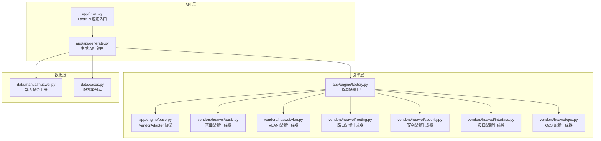
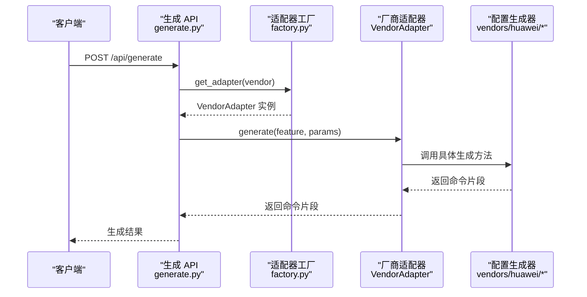
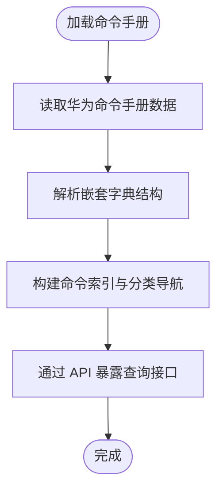
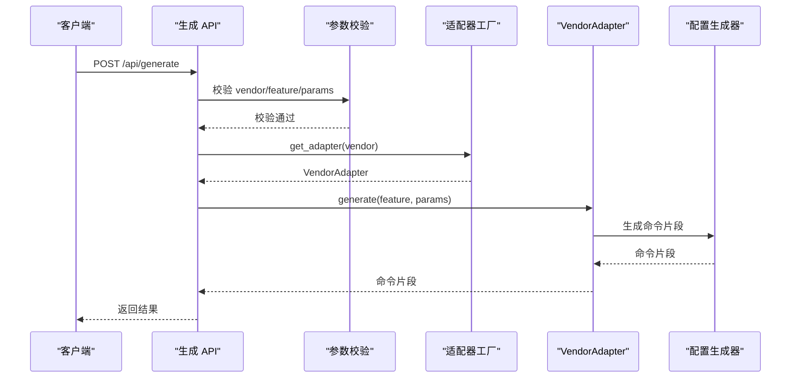
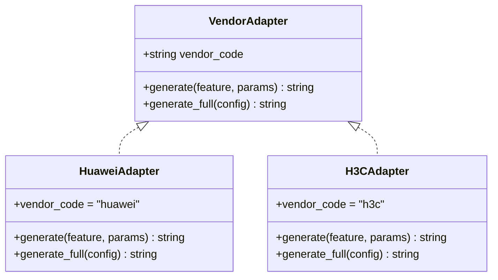
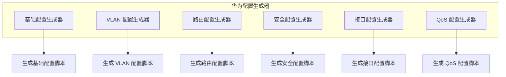
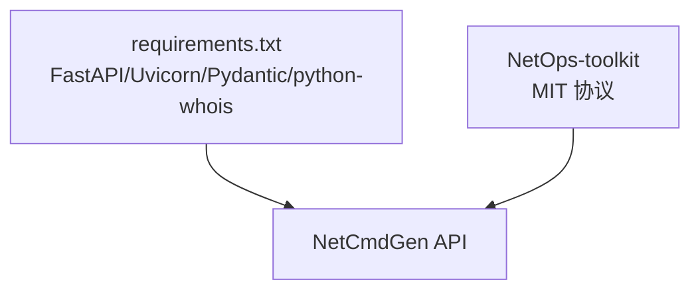

# 华为命令速查

<cite>
**本文档引用的文件**
- [api/app/main.py](file://api/app/main.py)
- [api/app/api/generate.py](file://api/app/api/generate.py)
- [api/app/engine/base.py](file://api/app/engine/base.py)
- [api/app/engine/factory.py](file://api/app/engine/factory.py)
- [api/app/engine/vendors/huawei/basic.py](file://api/app/engine/vendors/huawei/basic.py)
- [api/app/engine/vendors/huawei/vlan.py](file://api/app/engine/vendors/huawei/vlan.py)
- [api/app/engine/vendors/huawei/routing.py](file://api/app/engine/vendors/huawei/routing.py)
- [api/app/engine/vendors/huawei/security.py](file://api/app/engine/vendors/huawei/security.py)
- [api/app/engine/vendors/huawei/interface.py](file://api/app/engine/vendors/huawei/interface.py)
- [api/app/engine/vendors/huawei/qos.py](file://api/app/engine/vendors/huawei/qos.py)
- [api/app/data/manual/huawei.py](file://api/app/data/manual/huawei.py)
- [api/app/data/cases.py](file://api/app/data/cases.py)
- [api/README.md](file://api/README.md)
- [docs/NetOps-toolkit复用方案.md](file://docs/NetOps-toolkit复用方案.md)
- [opensource/NetOps-toolkit/README.md](file://opensource/NetOps-toolkit/README.md)
</cite>

## 目录
1. [简介](#简介)
2. [项目结构](#项目结构)
3. [核心组件](#核心组件)
4. [架构总览](#架构总览)
5. [详细组件分析](#详细组件分析)
6. [依赖关系分析](#依赖关系分析)
7. [性能考虑](#性能考虑)
8. [故障排除指南](#故障排除指南)
9. [结论](#结论)
10. [附录](#附录)

## 简介
本项目为华为命令速查库，基于 NetOps-toolkit 的命令生成内核与命令手册数据，构建了面向华为网络设备的命令速查与配置生成能力。项目采用 FastAPI 提供 REST API，支持：
- 华为命令手册的完整结构化数据（基础配置、接口配置、路由配置、安全配置、QoS配置等）
- 命令查询与配置生成 API
- 基于厂商适配器的统一接口设计，便于扩展至其他厂商

## 项目结构
后端采用模块化分层设计：
- API 层：FastAPI 路由与请求响应模型
- 引擎层：厂商适配器与配置生成器
- 数据层：命令手册与配置案例数据
- 工具层：网络工具（子网计算、Ping、Traceroute、端口扫描、DNS/Whois）

**图表来源**
- [api/app/main.py:1-29](file://api/app/main.py#L1-L29)
- [api/app/api/generate.py:1-77](file://api/app/api/generate.py#L1-L77)
- [api/app/engine/base.py:1-36](file://api/app/engine/base.py#L1-L36)
- [api/app/engine/factory.py:1-39](file://api/app/engine/factory.py#L1-L39)
- [api/app/engine/vendors/huawei/basic.py:1-359](file://api/app/engine/vendors/huawei/basic.py#L1-L359)
- [api/app/engine/vendors/huawei/vlan.py:1-175](file://api/app/engine/vendors/huawei/vlan.py#L1-L175)
- [api/app/engine/vendors/huawei/routing.py:1-213](file://api/app/engine/vendors/huawei/routing.py#L1-L213)
- [api/app/engine/vendors/huawei/security.py:1-578](file://api/app/engine/vendors/huawei/security.py#L1-L578)
- [api/app/engine/vendors/huawei/interface.py:1-308](file://api/app/engine/vendors/huawei/interface.py#L1-L308)
- [api/app/engine/vendors/huawei/qos.py:1-290](file://api/app/engine/vendors/huawei/qos.py#L1-L290)
- [api/app/data/manual/huawei.py:1-703](file://api/app/data/manual/huawei.py#L1-L703)
- [api/app/data/cases.py:1-377](file://api/app/data/cases.py#L1-L377)

**章节来源**
- [api/README.md:1-47](file://api/README.md#L1-L47)
- [docs/NetOps-toolkit复用方案.md:1-263](file://docs/NetOps-toolkit复用方案.md#L1-L263)
- [opensource/NetOps-toolkit/README.md:1-236](file://opensource/NetOps-toolkit/README.md#L1-L236)

## 核心组件
- FastAPI 应用入口与健康检查
- 生成 API：支持单特性命令片段生成与完整配置脚本生成
- 厂商适配器工厂：统一厂商接口，支持扩展新厂商
- 华为配置生成器：基础配置、VLAN、路由、安全、接口、QoS 等六大类
- 命令手册与案例库：华为命令手册与最佳实践案例

**章节来源**
- [api/app/main.py:1-29](file://api/app/main.py#L1-L29)
- [api/app/api/generate.py:1-77](file://api/app/api/generate.py#L1-L77)
- [api/app/engine/base.py:1-36](file://api/app/engine/base.py#L1-L36)
- [api/app/engine/factory.py:1-39](file://api/app/engine/factory.py#L1-L39)
- [api/app/data/manual/huawei.py:1-703](file://api/app/data/manual/huawei.py#L1-L703)
- [api/app/data/cases.py:1-377](file://api/app/data/cases.py#L1-L377)

## 架构总览
系统采用“适配器 + 工厂”的统一接口设计，将不同厂商的配置生成器抽象为统一的 VendorAdapter 协议，通过工厂按厂商代码获取适配器，实现对华为等厂商的命令生成与配置脚本生成。

**图表来源**
- [api/app/api/generate.py:53-76](file://api/app/api/generate.py#L53-L76)
- [api/app/engine/factory.py:20-26](file://api/app/engine/factory.py#L20-L26)
- [api/app/engine/base.py:19-27](file://api/app/engine/base.py#L19-L27)

**章节来源**
- [api/app/api/generate.py:1-77](file://api/app/api/generate.py#L1-L77)
- [api/app/engine/factory.py:1-39](file://api/app/engine/factory.py#L1-L39)
- [api/app/engine/base.py:1-36](file://api/app/engine/base.py#L1-L36)

## 详细组件分析

### 命令手册与数据结构
- 华为命令手册采用嵌套字典结构，按“分类-子分类-命令项”组织，每条命令包含命令语句、描述与示例
- 配置案例库提供典型场景的步骤化配置脚本，便于直接复用与二次编辑

**图表来源**
- [api/app/data/manual/huawei.py:7-342](file://api/app/data/manual/huawei.py#L7-L342)
- [api/app/data/cases.py:7-324](file://api/app/data/cases.py#L7-L324)

**章节来源**
- [api/app/data/manual/huawei.py:1-703](file://api/app/data/manual/huawei.py#L1-L703)
- [api/app/data/cases.py:1-377](file://api/app/data/cases.py#L1-L377)

### 生成 API 设计与实现
- 单特性生成：POST /api/generate，输入厂商代码、特性码与参数，返回命令片段
- 完整脚本生成：POST /api/generate/full，输入厂商代码与完整配置字典，返回完整配置脚本
- 厂商列表：GET /api/vendors，返回支持的厂商及其特性码

**图表来源**
- [api/app/api/generate.py:21-76](file://api/app/api/generate.py#L21-L76)

**章节来源**
- [api/app/api/generate.py:1-77](file://api/app/api/generate.py#L1-L77)

### 厂商适配器与工厂
- VendorAdapter 协议定义了统一的 generate 与 generate_full 方法
- 工厂通过 vendor_code 获取适配器实例，支持错误处理与特性码校验
- 当前已支持厂商：华为（H3C 亦可复用，锐捷/迈普按相同模式扩展）

**图表来源**
- [api/app/engine/base.py:11-36](file://api/app/engine/base.py#L11-L36)
- [api/app/engine/factory.py:14-38](file://api/app/engine/factory.py#L14-L38)

**章节来源**
- [api/app/engine/base.py:1-36](file://api/app/engine/base.py#L1-L36)
- [api/app/engine/factory.py:1-39](file://api/app/engine/factory.py#L1-L39)

### 华为配置生成器（六大类）
- 基础配置：主机名、密码、SSH/Telnet、Console、Banner、NTP、SNMP、日志、管理接口、DHCP、DNS 等
- VLAN 配置：批量创建、Access/Trunk/Hybrid、VLANIF、Voice VLAN、STP
- 路由配置：静态路由、默认路由、OSPF、BGP、RIP
- 安全配置：ACL、端口安全、802.1X、RADIUS、DHCP Snooping、ARP 防护、IPSG、风暴抑制、防攻击、流量过滤、用户绑定
- 接口配置：Eth-Trunk、LACP、LLDP、PoE、端口隔离、环路检测、速率限制
- QoS 配置：流分类/行为/策略、队列调度、端口队列、带宽策略、ACL 用于 QoS

**图表来源**
- [api/app/engine/vendors/huawei/basic.py:8-359](file://api/app/engine/vendors/huawei/basic.py#L8-L359)
- [api/app/engine/vendors/huawei/vlan.py:8-175](file://api/app/engine/vendors/huawei/vlan.py#L8-L175)
- [api/app/engine/vendors/huawei/routing.py:8-213](file://api/app/engine/vendors/huawei/routing.py#L8-L213)
- [api/app/engine/vendors/huawei/security.py:8-578](file://api/app/engine/vendors/huawei/security.py#L8-L578)
- [api/app/engine/vendors/huawei/interface.py:8-308](file://api/app/engine/vendors/huawei/interface.py#L8-L308)
- [api/app/engine/vendors/huawei/qos.py:8-290](file://api/app/engine/vendors/huawei/qos.py#L8-L290)

**章节来源**
- [api/app/engine/vendors/huawei/basic.py:1-359](file://api/app/engine/vendors/huawei/basic.py#L1-L359)
- [api/app/engine/vendors/huawei/vlan.py:1-175](file://api/app/engine/vendors/huawei/vlan.py#L1-L175)
- [api/app/engine/vendors/huawei/routing.py:1-213](file://api/app/engine/vendors/huawei/routing.py#L1-L213)
- [api/app/engine/vendors/huawei/security.py:1-578](file://api/app/engine/vendors/huawei/security.py#L1-L578)
- [api/app/engine/vendors/huawei/interface.py:1-308](file://api/app/engine/vendors/huawei/interface.py#L1-L308)
- [api/app/engine/vendors/huawei/qos.py:1-290](file://api/app/engine/vendors/huawei/qos.py#L1-L290)

## 依赖关系分析
- 项目依赖 FastAPI、Uvicorn、Pydantic、python-whois 等
- 命令生成内核与工具来自 NetOps-toolkit，采用 MIT 协议
- 通过工厂模式解耦厂商适配器，便于扩展新厂商

**图表来源**
- [api/README.md:13-18](file://api/README.md#L13-L18)
- [docs/NetOps-toolkit复用方案.md:210-216](file://docs/NetOps-toolkit复用方案.md#L210-L216)

**章节来源**
- [api/README.md:1-47](file://api/README.md#L1-L47)
- [docs/NetOps-toolkit复用方案.md:1-263](file://docs/NetOps-toolkit复用方案.md#L1-L263)

## 性能考虑
- 适配器为无状态对象，采用单例字典复用，降低内存占用
- 配置生成器均为静态方法，避免全局状态干扰
- 网络工具在 Web 化后需增加限频与鉴权，防止滥用
- 建议对命令手册与案例库进行缓存，减少重复加载

## 故障排除指南
- 厂商不支持：检查 vendor 是否在工厂注册，或抛出 VendorNotSupported
- 特性码不支持：检查 feature 是否在适配器支持范围内，或抛出 FeatureNotSupported
- 生成失败：捕获异常并返回 500，包含错误详情
- 健康检查：访问 /api/health 确认服务正常

**章节来源**
- [api/app/api/generate.py:58-64](file://api/app/api/generate.py#L58-L64)
- [api/app/api/generate.py:72-76](file://api/app/api/generate.py#L72-L76)
- [api/app/main.py:25-29](file://api/app/main.py#L25-L29)

## 结论
本项目成功复用了 NetOps-toolkit 的命令生成内核与命令手册数据，通过适配器与工厂模式实现了对华为等厂商的统一接口，提供了命令速查与配置生成能力。未来可在此基础上扩展更多厂商，并完善命令查询 API 与配置案例库。

## 附录
- 项目启动与接口文档见 [api/README.md](file://api/README.md)
- 复用方案与技术栈修订见 [docs/NetOps-toolkit复用方案.md](file://docs/NetOps-toolkit复用方案.md)
- NetOps-toolkit 功能特性与支持厂商见 [opensource/NetOps-toolkit/README.md](file://opensource/NetOps-toolkit/README.md)