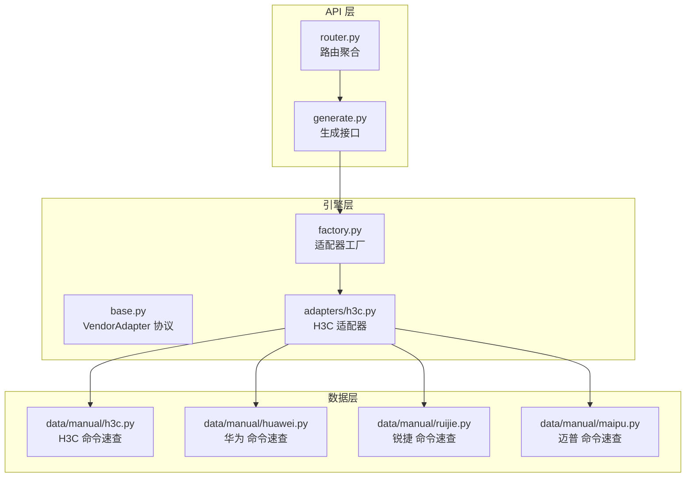
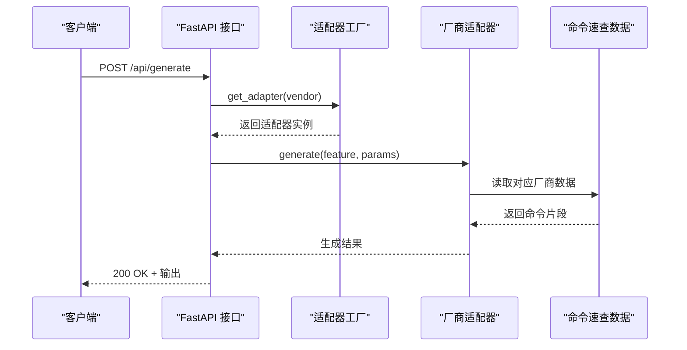
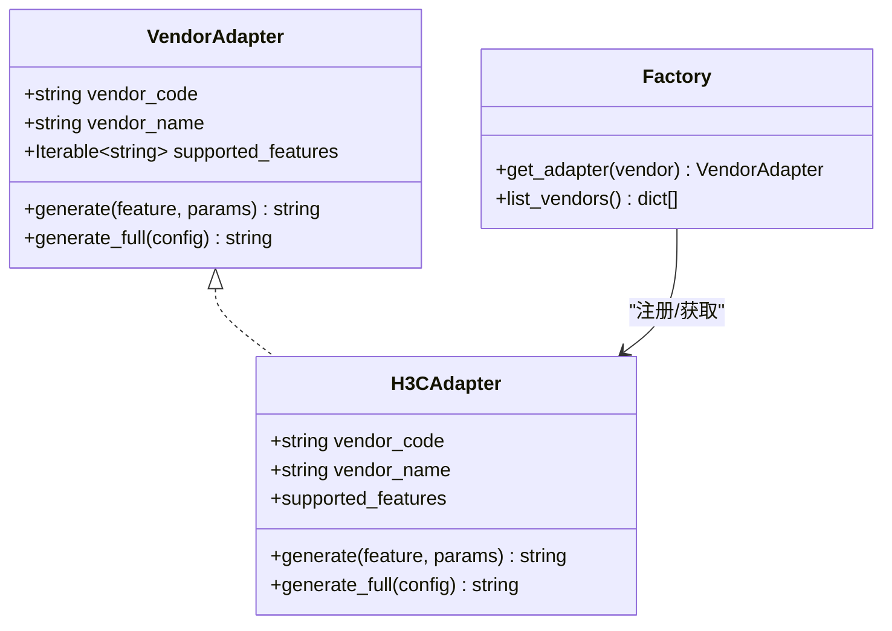
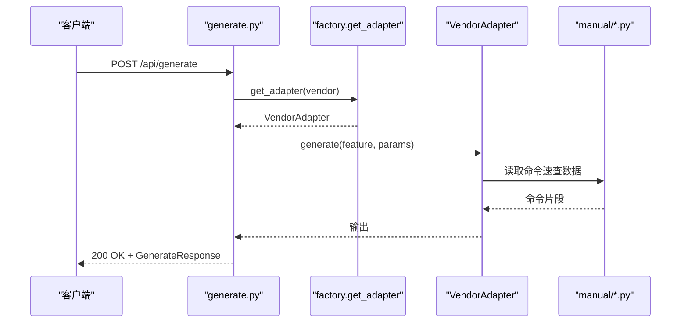
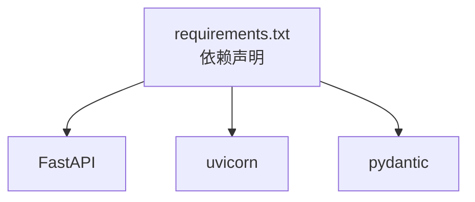

# 命令速查库

<cite>
**本文档引用的文件**
- [api/app/engine/base.py](file://api/app/engine/base.py)
- [api/app/engine/factory.py](file://api/app/engine/factory.py)
- [api/app/engine/adapters/h3c.py](file://api/app/engine/adapters/h3c.py)
- [api/app/data/manual/h3c.py](file://api/app/data/manual/h3c.py)
- [api/app/data/manual/huawei.py](file://api/app/data/manual/huawei.py)
- [api/app/data/manual/ruijie.py](file://api/app/data/manual/ruijie.py)
- [api/app/data/manual/maipu.py](file://api/app/data/manual/maipu.py)
- [api/app/api/generate.py](file://api/app/api/generate.py)
- [api/app/api/router.py](file://api/app/api/router.py)
- [api/README.md](file://api/README.md)
- [api/requirements.txt](file://api/requirements.txt)
</cite>

## 目录
1. [简介](#简介)
2. [项目结构](#项目结构)
3. [核心组件](#核心组件)
4. [架构总览](#架构总览)
5. [详细组件分析](#详细组件分析)
6. [依赖关系分析](#依赖关系分析)
7. [性能考虑](#性能考虑)
8. [故障排除指南](#故障排除指南)
9. [结论](#结论)
10. [附录](#附录)

## 简介
本项目为“命令速查库”，提供对主流网络设备厂商（H3C、华为、锐捷、迈普）命令速查数据的统一组织、分类与查询能力，并通过统一的适配器接口与API对外提供命令生成服务。系统采用“厂商数据 + 适配器 + 引擎”的分层设计，既保证了不同厂商命令数据的独立维护，又实现了统一的调用入口与扩展机制。

## 项目结构
- API 层：基于 FastAPI 提供 REST 接口，负责请求校验、错误处理与响应封装。
- 引擎层：统一的厂商适配器协议与工厂，屏蔽厂商差异，提供统一的生成接口。
- 数据层：各厂商命令速查数据与案例库，按“分类-子类-条目”结构组织。
- 复用层：命令生成内核与网络工具来自 NetOps-toolkit，通过同步脚本集成。

图表来源
- [api/app/api/generate.py:1-77](file://api/app/api/generate.py#L1-L77)
- [api/app/api/router.py:1-10](file://api/app/api/router.py#L1-L10)
- [api/app/engine/base.py:1-36](file://api/app/engine/base.py#L1-L36)
- [api/app/engine/factory.py:1-39](file://api/app/engine/factory.py#L1-L39)
- [api/app/engine/adapters/h3c.py:1-42](file://api/app/engine/adapters/h3c.py#L1-L42)
- [api/app/data/manual/h3c.py:1-710](file://api/app/data/manual/h3c.py#L1-L710)
- [api/app/data/manual/huawei.py:1-703](file://api/app/data/manual/huawei.py#L1-L703)
- [api/app/data/manual/ruijie.py:1-2045](file://api/app/data/manual/ruijie.py#L1-L2045)
- [api/app/data/manual/maipu.py:1-634](file://api/app/data/manual/maipu.py#L1-L634)

章节来源
- [api/README.md:1-47](file://api/README.md#L1-L47)
- [api/requirements.txt:1-5](file://api/requirements.txt#L1-L5)

## 核心组件
- 统一适配器协议：定义厂商代码、名称、支持特性集合以及生成接口，确保不同厂商实现的一致性。
- 适配器工厂：集中注册与获取适配器，支持按厂商代码查找，便于扩展新厂商。
- 适配器实现：以 H3C 为例，将特性码映射到具体生成函数，支持单特性生成与完整配置生成。
- 命令速查数据：以嵌套字典/列表形式组织，包含命令、描述、示例等字段，覆盖基础配置、接口配置、路由配置、安全配置、生成树、高可用、管理与监控、QoS、IPv6等主题。
- API 接口：提供厂商列表查询、单特性命令生成、完整配置生成等接口，返回标准化响应。

章节来源
- [api/app/engine/base.py:1-36](file://api/app/engine/base.py#L1-L36)
- [api/app/engine/factory.py:1-39](file://api/app/engine/factory.py#L1-L39)
- [api/app/engine/adapters/h3c.py:1-42](file://api/app/engine/adapters/h3c.py#L1-L42)
- [api/app/api/generate.py:1-77](file://api/app/api/generate.py#L1-L77)

## 架构总览
系统采用“API → 适配器 → 数据”的分层架构，API 层负责请求与响应，适配器层负责特性码到生成函数的映射，数据层提供厂商命令速查与案例库。工厂模式集中管理适配器注册，便于扩展新厂商。

图表来源
- [api/app/api/generate.py:53-64](file://api/app/api/generate.py#L53-L64)
- [api/app/engine/factory.py:20-26](file://api/app/engine/factory.py#L20-L26)
- [api/app/engine/adapters/h3c.py:32-38](file://api/app/engine/adapters/h3c.py#L32-L38)

## 详细组件分析

### 厂商适配器协议与工厂
- 协议定义：统一的 VendorAdapter 协议，要求实现 vendor_code、vendor_name、supported_features 以及 generate/generate_full 方法。
- 工厂注册：通过集中字典注册适配器实例，支持按厂商小写查找，未注册厂商抛出异常。
- 扩展机制：新增厂商仅需实现适配器并在工厂注册，无需改动 API 或其他适配器。

图表来源
- [api/app/engine/base.py:11-36](file://api/app/engine/base.py#L11-L36)
- [api/app/engine/factory.py:14-39](file://api/app/engine/factory.py#L14-L39)
- [api/app/engine/adapters/h3c.py:14-42](file://api/app/engine/adapters/h3c.py#L14-L42)

章节来源
- [api/app/engine/base.py:1-36](file://api/app/engine/base.py#L1-L36)
- [api/app/engine/factory.py:1-39](file://api/app/engine/factory.py#L1-L39)
- [api/app/engine/adapters/h3c.py:1-42](file://api/app/engine/adapters/h3c.py#L1-L42)

### 命令速查数据结构与字段定义
- H3C：以嵌套字典组织，顶层键为“分类-子类-条目”，每个条目包含 command、description、example 等字段。
- 华为：同样采用嵌套字典，条目包含 name、command、description、example 等字段。
- 锐捷/迈普：采用列表+字典结构，条目包含 name、command、description、example 等字段。
- 示例格式：命令片段与交互式示例，便于理解命令上下文与预期输出。

章节来源
- [api/app/data/manual/h3c.py:7-333](file://api/app/data/manual/h3c.py#L7-L333)
- [api/app/data/manual/huawei.py:7-342](file://api/app/data/manual/huawei.py#L7-L342)
- [api/app/data/manual/ruijie.py:16-2045](file://api/app/data/manual/ruijie.py#L16-L2045)
- [api/app/data/manual/maipu.py:16-634](file://api/app/data/manual/maipu.py#L16-L634)

### 命令分类体系与层级结构
- H3C 分类：基础配置、接口配置、路由配置、安全配置、生成树配置、高可用配置、管理与监控、QoS配置、IPv6配置等。
- 华为 分类：基础配置、接口配置、路由配置、安全配置、生成树配置、高可用配置、管理与监控、QoS配置、IPv6配置等。
- 锐捷/迈普 分类：基础配置、接口配置、路由配置、安全配置、生成树配置、高可用配置、管理与监控、QoS配置、IPv6配置等。
- 子类覆盖：系统管理、用户与权限、SSH/Telnet/Console、ACL、端口安全、DHCP Snooping、ARP/IPSG、VRRP/BFD、日志/SNMP/NTP、QoS、IPv6等。

章节来源
- [api/app/data/manual/h3c.py:8-332](file://api/app/data/manual/h3c.py#L8-L332)
- [api/app/data/manual/huawei.py:8-341](file://api/app/data/manual/huawei.py#L8-L341)
- [api/app/data/manual/ruijie.py:17-2045](file://api/app/data/manual/ruijie.py#L17-L2045)
- [api/app/data/manual/maipu.py:17-634](file://api/app/data/manual/maipu.py#L17-L634)

### 查询机制与快速检索算法
- 特性码映射：适配器内部将特性码映射到具体生成函数，实现快速定位。
- 数据检索：命令速查数据为结构化嵌套字典/列表，可通过键路径快速定位条目。
- 性能优化：工厂采用单例字典缓存适配器实例，避免重复创建；适配器为无状态对象，可安全复用。

章节来源
- [api/app/engine/adapters/h3c.py:18-26](file://api/app/engine/adapters/h3c.py#L18-L26)
- [api/app/engine/factory.py:14-17](file://api/app/engine/factory.py#L14-L17)

### 命令生成 API 设计与实现
- 接口定义：
  - GET /api/vendors：返回已支持厂商列表（代码、名称、特性码）。
  - POST /api/generate：根据 vendor + feature + params 生成单个特性命令片段。
  - POST /api/generate/full：根据 vendor + config 生成完整配置脚本。
- 请求/响应模型：使用 Pydantic 定义请求与响应结构，自动进行字段校验与序列化。
- 错误处理：对未支持厂商、未支持特性、内部异常分别返回 400/500 状态码与详细错误信息。

图表来源
- [api/app/api/generate.py:53-76](file://api/app/api/generate.py#L53-L76)
- [api/app/engine/factory.py:20-26](file://api/app/engine/factory.py#L20-L26)

章节来源
- [api/app/api/generate.py:1-77](file://api/app/api/generate.py#L1-L77)
- [api/app/api/router.py:1-10](file://api/app/api/router.py#L1-L10)

### 数据扩展机制与维护策略
- 新增厂商步骤：
  1) 在 app/engine/adapters/ 下新增适配器文件；
  2) 在 app/engine/factory.py 的注册字典中添加适配器实例；
  3) 在 app/data/manual/ 下新增厂商命令速查数据文件；
  4) 在适配器中建立特性码到生成函数的映射。
- 数据维护：
  - 命令速查数据采用模块级常量，便于版本化管理与单元测试；
  - 案例库提供典型场景的完整配置步骤，便于验证与教学。

章节来源
- [api/app/engine/factory.py:3-6](file://api/app/engine/factory.py#L3-L6)
- [api/app/engine/adapters/h3c.py:14-31](file://api/app/engine/adapters/h3c.py#L14-L31)

## 依赖关系分析
- 运行时依赖：FastAPI、uvicorn、pydantic 等，满足 API 服务与数据模型需求。
- 复用依赖：命令生成内核与网络工具来自 NetOps-toolkit，通过同步脚本集成。

图表来源
- [api/requirements.txt:1-5](file://api/requirements.txt#L1-L5)

章节来源
- [api/requirements.txt:1-5](file://api/requirements.txt#L1-L5)
- [api/README.md:1-47](file://api/README.md#L1-L47)

## 性能考虑
- 适配器复用：工厂使用单例字典缓存适配器实例，避免重复创建，提升并发性能。
- 无状态设计：适配器为无状态对象，可安全共享，减少内存占用。
- 数据访问：命令速查数据为内存中的嵌套结构，读取开销极低；若未来规模扩大，可考虑索引化或缓存策略。
- API 并发：基于 ASGI 的 uvicorn 服务器具备良好并发能力，适合高并发命令生成场景。

## 故障排除指南
- 厂商不支持：当 vendor 参数不在注册列表时，返回 400 与可选厂商列表提示。
- 特性不支持：当 feature 不在适配器支持列表时，返回 400 与支持特性列表提示。
- 生成异常：捕获未知异常并返回 500，包含“生成失败”与错误详情，便于定位问题。
- 建议排查：
  - 确认 vendor 与 feature 是否正确；
  - 检查 params 结构是否符合对应生成器期望；
  - 查看服务日志获取更详细的异常堆栈。

章节来源
- [api/app/api/generate.py:58-63](file://api/app/api/generate.py#L58-L63)
- [api/app/engine/base.py:30-36](file://api/app/engine/base.py#L30-L36)

## 结论
命令速查库通过统一的适配器协议与工厂机制，将多厂商命令速查数据整合为一致的调用入口，配合清晰的分类体系与快速检索策略，能够高效支撑命令生成与运维场景。其模块化与可扩展设计，使得新增厂商与维护命令数据变得简单可控，适合在企业级运维工具链中长期演进。

## 附录
- 快速开始：参考 README 中的启动步骤，安装依赖后启动开发服务器，访问 /docs 查看接口文档。
- 目录约定：明确 API、引擎、数据、工具等目录职责，便于协作与维护。

章节来源
- [api/README.md:7-24](file://api/README.md#L7-L24)