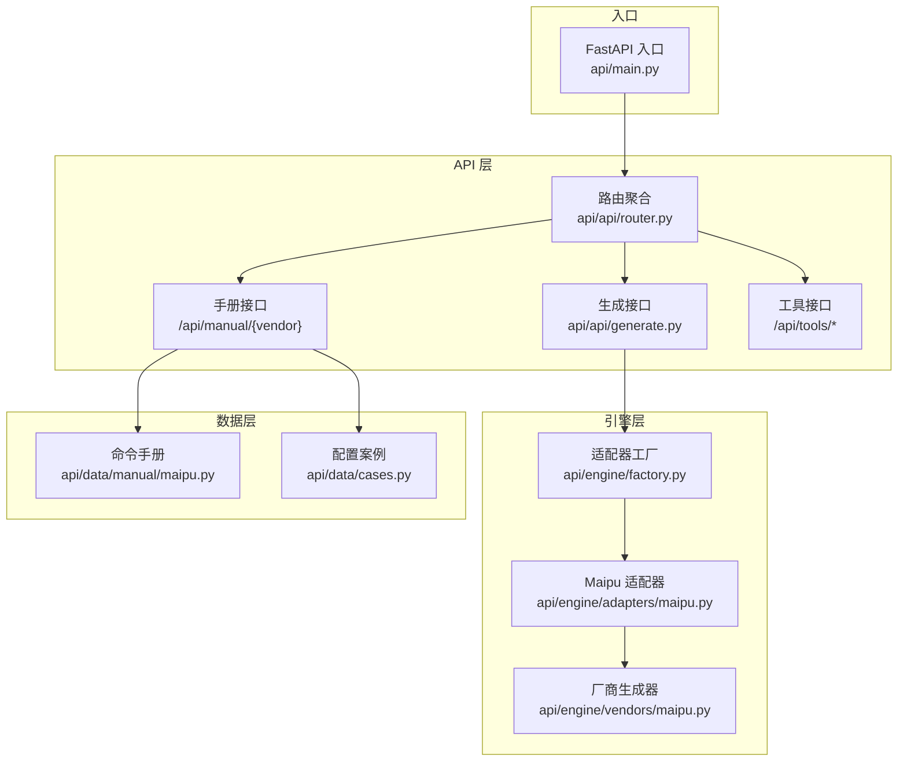
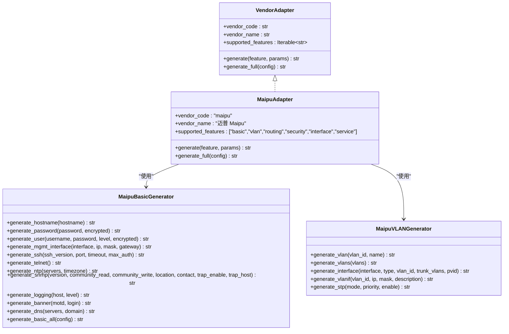
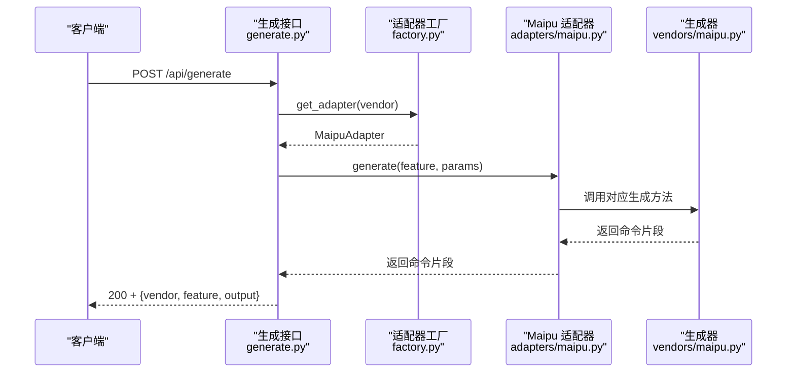
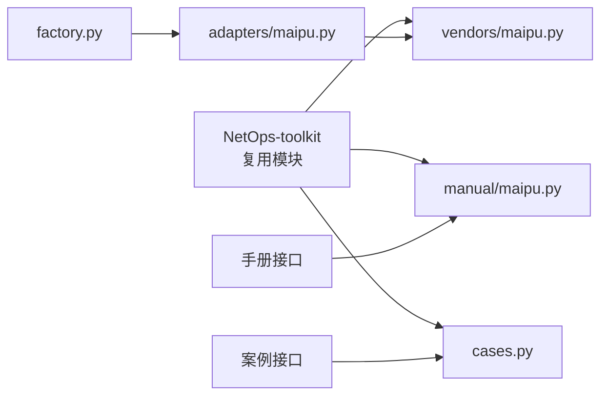

# 迈普命令速查

<cite>
**本文档引用的文件**
- [api/app/data/manual/maipu.py](file://api/app/data/manual/maipu.py)
- [api/app/engine/vendors/maipu.py](file://api/app/engine/vendors/maipu.py)
- [api/app/engine/adapters/maipu.py](file://api/app/engine/adapters/maipu.py)
- [api/app/api/generate.py](file://api/app/api/generate.py)
- [api/app/api/router.py](file://api/app/api/router.py)
- [api/app/main.py](file://api/app/main.py)
- [api/app/engine/factory.py](file://api/app/engine/factory.py)
- [api/app/data/cases.py](file://api/app/data/cases.py)
- [api/README.md](file://api/README.md)
- [docs/NetOps-toolkit复用方案.md](file://docs/NetOps-toolkit复用方案.md)
</cite>

## 目录
1. [简介](#简介)
2. [项目结构](#项目结构)
3. [核心组件](#核心组件)
4. [架构总览](#架构总览)
5. [详细组件分析](#详细组件分析)
6. [依赖分析](#依赖分析)
7. [性能考虑](#性能考虑)
8. [故障排查指南](#故障排查指南)
9. [结论](#结论)
10. [附录](#附录)

## 简介
本项目为“迈普命令速查库”，围绕迈普网络设备的命令手册与配置生成能力，提供：
- 命令速查：覆盖基础配置、接口配置、路由配置、安全配置、生成树、高可用、管理与监控、QoS、IPv6等完整分类
- 配置生成：基于适配器模式的统一 API，支持按特性生成命令片段或生成完整配置脚本
- 数据与案例：内置命令手册与最佳实践案例，便于快速检索与复用

迈普作为较新的国产网络设备厂商，其命令体系在保持类 Cisco 风格的同时，具有独特的设计理念与术语习惯，例如“VLAN 接口”“端口安全”“DHCP Snooping”“MSTP 多实例”“BFD 会话”等，这些在本项目中均有系统化整理与呈现。

## 项目结构
后端采用 FastAPI 架构，核心模块划分如下：
- 路由层：统一挂载工具、生成、手册等子路由
- API 层：对外暴露生成与查询接口
- 引擎层：厂商适配器与各厂商生成器
- 数据层：命令手册与配置案例
- 工具层：网络工具（子网计算、Ping、Traceroute、端口扫描、DNS）

图表来源
- [api/app/main.py:1-29](file://api/app/main.py#L1-L29)
- [api/app/api/router.py:1-11](file://api/app/api/router.py#L1-L11)
- [api/app/api/generate.py:1-77](file://api/app/api/generate.py#L1-L77)
- [api/app/engine/factory.py:1-45](file://api/app/engine/factory.py#L1-L45)
- [api/app/engine/adapters/maipu.py:1-90](file://api/app/engine/adapters/maipu.py#L1-L90)
- [api/app/engine/vendors/maipu.py:1-454](file://api/app/engine/vendors/maipu.py#L1-L454)
- [api/app/data/manual/maipu.py:1-634](file://api/app/data/manual/maipu.py#L1-L634)
- [api/app/data/cases.py:1-377](file://api/app/data/cases.py#L1-L377)

章节来源
- [api/README.md:1-47](file://api/README.md#L1-L47)
- [docs/NetOps-toolkit复用方案.md:1-263](file://docs/NetOps-toolkit复用方案.md#L1-L263)

## 核心组件
- 命令手册与案例
  - 命令手册：以嵌套字典形式组织，按“分类-子类-条目”的层级结构，每个条目包含命令、描述、示例等字段
  - 配置案例：提供典型场景的步骤化配置，便于直接复用
- 生成器与适配器
  - 厂商生成器：面向迈普的命令生成器，提供基础、VLAN、路由、安全、接口等领域的生成方法
  - 适配器：统一厂商接口，屏蔽不同厂商生成器的参数风格差异
- API 接口
  - 生成接口：支持按特性生成命令片段与生成完整配置脚本
  - 手册接口：提供按厂商查询命令速查的能力
  - 工具接口：提供子网计算、Ping、Traceroute、端口扫描、DNS 等网络工具

章节来源
- [api/app/data/manual/maipu.py:16-328](file://api/app/data/manual/maipu.py#L16-L328)
- [api/app/data/cases.py:288-324](file://api/app/data/cases.py#L288-L324)
- [api/app/engine/vendors/maipu.py:8-454](file://api/app/engine/vendors/maipu.py#L8-L454)
- [api/app/engine/adapters/maipu.py:15-90](file://api/app/engine/adapters/maipu.py#L15-L90)
- [api/app/api/generate.py:21-77](file://api/app/api/generate.py#L21-L77)

## 架构总览
整体架构遵循“适配器 + 工厂 + 统一接口”的设计，确保新增厂商时只需实现适配器与生成器，并在工厂中注册即可。

图表来源
- [api/app/engine/base.py:11-36](file://api/app/engine/base.py#L11-L36)
- [api/app/engine/adapters/maipu.py:15-90](file://api/app/engine/adapters/maipu.py#L15-L90)
- [api/app/engine/vendors/maipu.py:8-274](file://api/app/engine/vendors/maipu.py#L8-L274)

## 详细组件分析

### 命令手册与配置案例
- 命令手册结构
  - 分类维度：基础配置、接口配置、路由配置、安全配置、生成树、高可用、管理与监控、QoS、IPv6
  - 条目字段：名称、命令、描述、示例
  - 案例维度：提供典型场景的步骤化配置，覆盖接入交换机、核心交换机、链路聚合、MSTP、DHCP、QoS、端口镜像、BFD 与 VRRP 联动等
- 配置案例组织
  - 每个案例包含标题、描述与步骤数组，步骤数组为逐行命令文本，便于直接复制到设备
  - 案例覆盖从基础到高级的多种场景，便于运维人员快速落地

章节来源
- [api/app/data/manual/maipu.py:16-328](file://api/app/data/manual/maipu.py#L16-L328)
- [api/app/data/manual/maipu.py:330-634](file://api/app/data/manual/maipu.py#L330-L634)
- [api/app/data/cases.py:288-324](file://api/app/data/cases.py#L288-L324)

### 生成器与适配器
- MaipuBasicGenerator
  - 功能：生成基础配置命令片段，包括主机名、密码、用户、管理接口、SSH/Telnet、NTP、SNMP、日志、Banner、DNS 等
  - 设计：每个方法返回一段命令文本，最终通过 generate_basic_all 汇总输出
- MaipuVLANGenerator
  - 功能：生成 VLAN 相关命令，包括 VLAN 创建、批量 VLAN、接口模式（Access/Trunk/Hybrid）、VLAN 接口 IP、STP 配置等
  - 设计：接口参数清晰，支持灵活组合
- MaipuAdapter
  - 功能：统一厂商接口，将不同特性映射到对应生成器方法；支持 generate 与 generate_full
  - 设计：_GEN 映射表集中管理特性到方法的映射，便于扩展

章节来源
- [api/app/engine/vendors/maipu.py:8-274](file://api/app/engine/vendors/maipu.py#L8-L274)
- [api/app/engine/adapters/maipu.py:15-90](file://api/app/engine/adapters/maipu.py#L15-L90)

### API 设计与实现
- 路由聚合
  - 路由器聚合了工具、生成、手册三个子路由，便于统一管理
- 生成接口
  - /api/generate：按 vendor + feature + params 生成单个特性的命令片段
  - /api/generate/full：按 vendor + config 生成完整配置脚本
  - /api/vendors：列出已支持厂商及其特性码
- 错误处理
  - 对厂商不支持与特性不支持进行明确的错误提示
  - 对内部异常进行统一捕获并返回 500

图表来源
- [api/app/api/generate.py:53-76](file://api/app/api/generate.py#L53-L76)
- [api/app/engine/factory.py:26-32](file://api/app/engine/factory.py#L26-L32)
- [api/app/engine/adapters/maipu.py:75-81](file://api/app/engine/adapters/maipu.py#L75-L81)
- [api/app/engine/vendors/maipu.py:8-454](file://api/app/engine/vendors/maipu.py#L8-L454)

章节来源
- [api/app/api/router.py:1-11](file://api/app/api/router.py#L1-L11)
- [api/app/api/generate.py:21-77](file://api/app/api/generate.py#L21-L77)
- [api/app/engine/factory.py:26-44](file://api/app/engine/factory.py#L26-L44)

### 命令数据结构与配置案例组织
- 命令手册数据结构
  - 顶层为分类字典，键为分类名，值为该分类下的条目列表
  - 条目包含 name、command、description、example 等字段
- 配置案例数据结构
  - 每个案例包含 title、description、steps
  - steps 为字符串数组，逐行代表一条命令或注释

章节来源
- [api/app/data/manual/maipu.py:16-328](file://api/app/data/manual/maipu.py#L16-L328)
- [api/app/data/manual/maipu.py:330-634](file://api/app/data/manual/maipu.py#L330-L634)

### 命令查询 API 的设计思路
- 设计目标
  - 提供按厂商与分类的命令查询能力，支持关键词检索与分类筛选
  - 与现有手册数据结构保持一致，便于扩展其他厂商
- 接口设计
  - GET /api/manual/{vendor}：返回指定厂商的命令手册
  - GET /api/manual/{vendor}/{category}：返回指定厂商指定分类的命令
  - GET /api/manual/{vendor}/search?q={keyword}：按关键字搜索命令
- 数据来源
  - 使用 api/data/manual 下的厂商手册数据
  - 可结合 api/data/cases.py 中的最佳实践与案例进行补充

章节来源
- [api/app/data/manual/maipu.py:16-328](file://api/app/data/manual/maipu.py#L16-L328)
- [api/app/data/cases.py:327-377](file://api/app/data/cases.py#L327-L377)

## 依赖分析
- 复用关系
  - 本项目大量复用自 NetOps-toolkit，包括命令生成内核、网络工具、命令速查数据等
  - 复用策略：直接拷贝纯函数与数据文件，迁移生成器到 vendors 目录，新增适配器层
- 适配器工厂
  - 工厂集中管理适配器实例，支持按厂商代码获取适配器
  - 新增厂商时只需在工厂注册并实现适配器

图表来源
- [docs/NetOps-toolkit复用方案.md:43-81](file://docs/NetOps-toolkit复用方案.md#L43-L81)
- [api/app/engine/factory.py:17-23](file://api/app/engine/factory.py#L17-L23)
- [api/app/engine/adapters/maipu.py:11-14](file://api/app/engine/adapters/maipu.py#L11-L14)
- [api/app/data/manual/maipu.py:1-14](file://api/app/data/manual/maipu.py#L1-L14)
- [api/app/data/cases.py:1-6](file://api/app/data/cases.py#L1-L6)

章节来源
- [docs/NetOps-toolkit复用方案.md:1-263](file://docs/NetOps-toolkit复用方案.md#L1-L263)
- [api/app/engine/factory.py:17-23](file://api/app/engine/factory.py#L17-L23)

## 性能考虑
- 生成器为纯函数与静态方法，无全局状态，适合并发调用
- 适配器工厂采用单例字典，避免重复实例化
- 建议在生产环境启用 Gunicorn 或 uvicorn 多进程模式，提升吞吐
- 对于大规模命令查询，可在手册数据上增加索引或缓存机制

## 故障排查指南
- 常见错误
  - 厂商不支持：检查 vendor 是否在工厂注册
  - 特性不支持：检查特性码是否在适配器 supported_features 中
  - 生成失败：检查参数结构与生成器输入风格
- 排查步骤
  - 使用 /api/vendors 获取支持厂商列表
  - 使用 /api/health 检查服务健康状态
  - 查看生成接口返回的错误详情，定位具体特性或参数问题

章节来源
- [api/app/api/generate.py:58-63](file://api/app/api/generate.py#L58-L63)
- [api/app/main.py:25-28](file://api/app/main.py#L25-L28)

## 结论
本项目以“适配器 + 工厂 + 统一接口”的架构，实现了对迈普命令手册与配置生成的系统化管理。通过复用 NetOps-toolkit 的成熟模块，大幅降低了开发成本，并为后续扩展其他厂商提供了清晰的路径。命令手册与配置案例的结构化组织，使得运维人员能够快速检索与复用，满足日常运维与交付场景的需求。

## 附录
- 快速启动
  - 同步 NetOps-toolkit 可复用代码
  - 安装依赖
  - 启动开发服务器
- 访问路径
  - 健康检查：/api/health
  - 接口文档：/docs
  - 子网计算：/api/tools/subnet
  - 生成接口：/api/generate 与 /api/generate/full
  - 手册接口：/api/manual/{vendor}

章节来源
- [api/README.md:7-24](file://api/README.md#L7-L24)