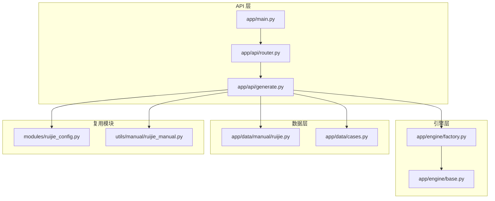
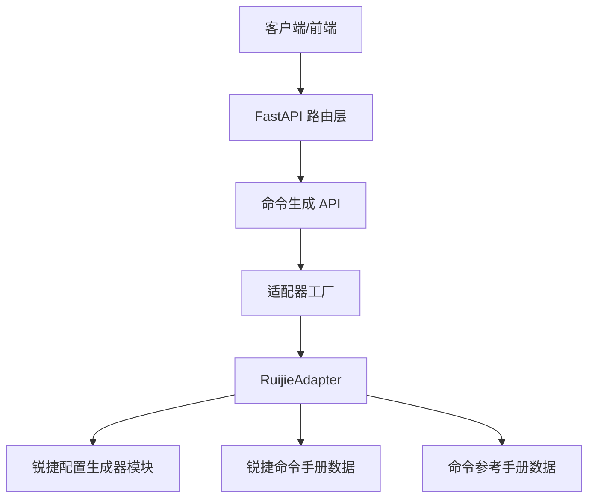
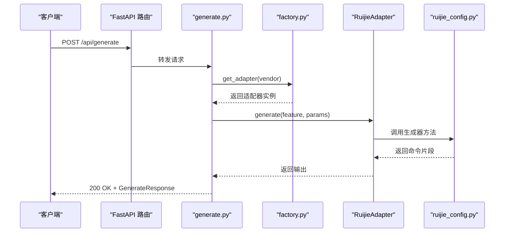
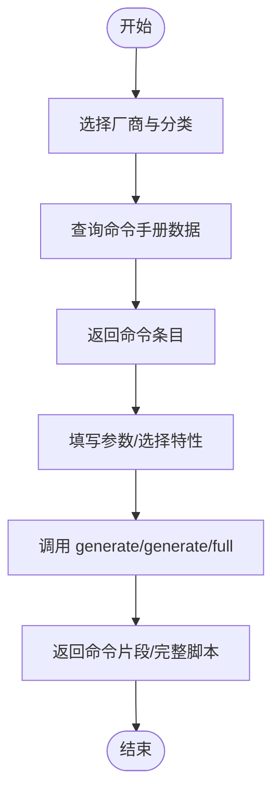
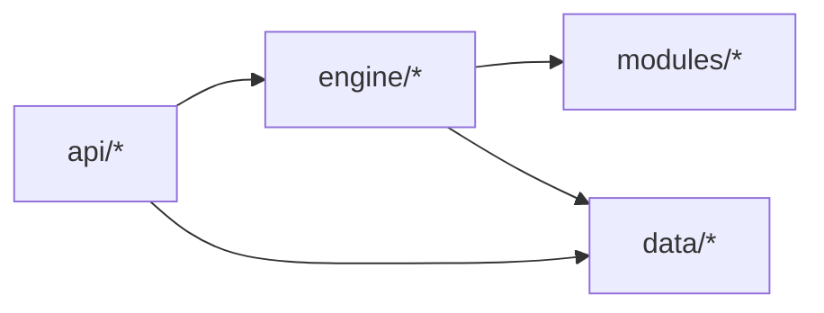

# 锐捷命令速查

<cite>
**本文引用的文件**
- [锐捷命令手册（数据）](file://api/app/data/manual/ruijie.py)
- [命令参考手册（数据）](file://api/app/data/cases.py)
- [FastAPI 应用入口](file://api/app/main.py)
- [API 路由聚合](file://api/app/api/router.py)
- [命令生成 API](file://api/app/api/generate.py)
- [引擎抽象与协议](file://api/app/engine/base.py)
- [适配器工厂](file://api/app/engine/factory.py)
- [锐捷配置生成器（模块）](file://opensource/NetOps-toolkit/modules/ruijie_config.py)
- [锐捷命令手册（模块）](file://opensource/NetOps-toolkit/utils/manual/ruijie_manual.py)
- [API 使用说明](file://api/README.md)
</cite>

## 目录
1. [简介](#简介)
2. [项目结构](#项目结构)
3. [核心组件](#核心组件)
4. [架构总览](#架构总览)
5. [详细组件分析](#详细组件分析)
6. [依赖分析](#依赖分析)
7. [性能考虑](#性能考虑)
8. [故障排查指南](#故障排查指南)
9. [结论](#结论)
10. [附录](#附录)

## 简介
本技术文档面向“锐捷命令速查库”，系统化梳理锐捷网络设备命令手册的数据结构、配置生成引擎、API 设计与实现，并对比华为、H3C 等厂商差异。文档旨在帮助网络工程师快速定位命令、理解配置模式、掌握 API 查询与生成能力，同时为二次开发与扩展提供清晰的架构指引。

## 项目结构
后端采用 FastAPI 提供 REST API，命令生成内核与命令速查数据来自 NetOps-toolkit 复用模块。关键目录与职责如下：
- api/app/main.py：FastAPI 应用入口，注册 CORS 与路由。
- api/app/api/router.py：聚合子路由（tools 与 generate）。
- api/app/api/generate.py：命令生成 API（单特性片段与完整配置脚本）。
- api/app/engine/base.py：适配器协议与异常类型定义。
- api/app/engine/factory.py：厂商适配器工厂，集中注册与获取适配器。
- api/app/data/manual/ruijie.py：锐捷命令手册数据（分类、命令、示例、说明）。
- api/app/data/cases.py：各厂商命令参考与最佳实践、快捷键等。
- opensource/NetOps-toolkit/modules/ruijie_config.py：锐捷配置生成器模块（基础、VLAN、路由、安全、接口等）。
- opensource/NetOps-toolkit/utils/manual/ruijie_manual.py：锐捷命令手册（模块侧）。
- api/README.md：项目说明与启动方式。

图表来源
- [FastAPI 应用入口:1-29](file://api/app/main.py#L1-L29)
- [API 路由聚合:1-10](file://api/app/api/router.py#L1-L10)
- [命令生成 API:1-77](file://api/app/api/generate.py#L1-L77)
- [引擎抽象与协议:1-36](file://api/app/engine/base.py#L1-L36)
- [适配器工厂:1-45](file://api/app/engine/factory.py#L1-L45)
- [锐捷命令手册（数据）:1-800](file://api/app/data/manual/ruijie.py#L1-L800)
- [命令参考手册（数据）:1-377](file://api/app/data/cases.py#L1-L377)
- [锐捷配置生成器（模块）:1-452](file://opensource/NetOps-toolkit/modules/ruijie_config.py#L1-L452)
- [锐捷命令手册（模块）:1-800](file://opensource/NetOps-toolkit/utils/manual/ruijie_manual.py#L1-L800)

章节来源
- [FastAPI 应用入口:1-29](file://api/app/main.py#L1-L29)
- [API 路由聚合:1-10](file://api/app/api/router.py#L1-L10)
- [API 使用说明:1-47](file://api/README.md#L1-L47)

## 核心组件
- 命令手册数据（锐捷）
  - 结构：按“基础配置/接口配置/路由配置/安全配置/无线配置/存储配置/服务器配置/数据库配置/中间件配置/安全配置/运维配置”等分类组织，每类包含若干命令条目，每个条目含名称、命令模板、描述与示例。
  - 特点：命令风格接近 Cisco，使用 show 查看信息；支持 SSH/Telnet/Console 登录配置、DNS 解析、用户与权限、系统时间与环境监控等。
- 命令参考手册（多厂商）
  - 结构：以 vendor -> 分类 -> 功能项 -> 命令模板/示例/分类标识组织，便于前端选择厂商与特性生成配置。
  - 包含：最佳实践清单、快捷键说明等。
- 配置生成器（模块）
  - 模块化：基础、VLAN、路由、安全、接口等生成器类，提供静态方法生成命令片段或完整配置。
  - 用途：被适配器调用，实现“根据参数生成命令”的能力。
- 引擎与适配器
  - 协议：VendorAdapter 协议定义厂商代码、名称、特性集合与 generate/generate_full 方法。
  - 工厂：集中注册华为/H3C/锐捷/迈普适配器，按 vendor 获取统一调用入口。
- API
  - 端点：/api/vendors、/api/generate、/api/generate/full。
  - 行为：校验厂商与特性，抛出相应异常；返回统一响应模型。

章节来源
- [锐捷命令手册（数据）:16-800](file://api/app/data/manual/ruijie.py#L16-L800)
- [命令参考手册（数据）:7-324](file://api/app/data/cases.py#L7-L324)
- [锐捷配置生成器（模块）:8-452](file://opensource/NetOps-toolkit/modules/ruijie_config.py#L8-L452)
- [引擎抽象与协议:11-36](file://api/app/engine/base.py#L11-L36)
- [适配器工厂:18-44](file://api/app/engine/factory.py#L18-L44)
- [命令生成 API:21-77](file://api/app/api/generate.py#L21-L77)

## 架构总览
整体采用“数据/模块 + 引擎 + API”的分层设计。API 层负责对外暴露查询与生成能力；引擎层通过适配器协议屏蔽厂商差异；数据层提供命令手册与参考案例；模块层提供可复用的配置生成逻辑。

图表来源
- [命令生成 API:53-76](file://api/app/api/generate.py#L53-L76)
- [适配器工厂:26-44](file://api/app/engine/factory.py#L26-L44)
- [锐捷配置生成器（模块）:8-452](file://opensource/NetOps-toolkit/modules/ruijie_config.py#L8-L452)
- [锐捷命令手册（数据）:16-800](file://api/app/data/manual/ruijie.py#L16-L800)
- [命令参考手册（数据）:7-324](file://api/app/data/cases.py#L7-L324)

## 详细组件分析

### 命令手册数据结构（锐捷）
- 分类维度
  - 基础配置：系统管理、用户管理、SSH/Telnet/Console、域名解析等。
  - 接口配置：以太网接口、VLAN 接口、接口 VLAN（Access/Trunk/Hybrid）、链路聚合。
  - 路由配置：静态路由、OSPF、BGP。
  - 安全配置：ACL、端口安全、日志与审计等。
  - 无线配置/存储配置/服务器配置/数据库配置/中间件配置/运维配置：按需扩展。
- 数据元素
  - 条目字段：name、command（命令模板/多行）、description、example。
  - 价值：支撑前端“按分类/关键字检索命令”，并提供示例与说明。
- 与华为/H3C 的差异要点
  - 主机名：锐捷使用 hostname，华为使用 sysname，H3C 使用 sysname（Comware V7）。
  - 管理接口：锐捷使用 interface vlan <id>，华为使用 interface Vlanif <id>，H3C 使用 interface Vlan-interface <id>。
  - 用户与权限：锐捷 username/privilege/password 或 username/secret；华为 local-user；H3C local-user class manage。
  - SSH：锐捷 ip ssh server enable/ip ssh version；华为 stelnet server enable/ssh user；H3C 与锐捷相近但语法略有差异。
  - ACL：锐捷 ip access-list extended；华为 acl number rule；H3C acl-number rule。
  - VLAN 接口：锐捷 interface vlan；华为 interface Vlanif；H3C interface Vlan-interface。

章节来源
- [锐捷命令手册（数据）:16-800](file://api/app/data/manual/ruijie.py#L16-L800)
- [命令参考手册（数据）:226-286](file://api/app/data/cases.py#L226-L286)

### 配置生成器模块（锐捷）
- 类与职责
  - RuijieBasicGenerator：主机名、密码、用户、管理接口、SSH/Telnet、NTP、SNMP、日志、Banner、DNS 等。
  - RuijieVLANGenerator：VLAN 创建、批量 VLAN、接口模式（Access/Trunk/Hybrid）、VLANIF IP、STP。
  - RuijieRoutingGenerator：静态路由、OSPF、BGP。
  - RuijieSecurityGenerator：ACL、端口安全、流量过滤。
  - RuijieInterfaceGenerator：Eth-Trunk、LLDP、环回检测、PoE、速率限制等。
- 参数与输出
  - 输入：配置字典（如 hostname、user、mgmt_interface、enable_ssh、vlans、routes、peers、networks 等）。
  - 输出：命令片段或完整配置脚本（含结束符）。
- 优势
  - 模块化强，易于扩展新特性。
  - 与 API 的 generate_full 流程天然契合。

章节来源
- [锐捷配置生成器（模块）:8-452](file://opensource/NetOps-toolkit/modules/ruijie_config.py#L8-L452)

### 引擎与适配器
- 协议约束
  - 必须实现 vendor_code、vendor_name、supported_features、generate、generate_full。
- 工厂注册
  - 已注册：HuaweiAdapter、H3CAdapter、RuijieAdapter、MaipuAdapter。
- 异常处理
  - VendorNotSupported：厂商未注册。
  - FeatureNotSupported：特性码不受支持。
- 与模块的关系
  - 适配器内部调用对应模块生成器，组装命令片段或完整配置。

章节来源
- [引擎抽象与协议:11-36](file://api/app/engine/base.py#L11-L36)
- [适配器工厂:18-44](file://api/app/engine/factory.py#L18-L44)

### API 设计与实现
- 端点与行为
  - GET /api/vendors：返回已注册厂商列表（含特性集合）。
  - POST /api/generate：根据 vendor + feature + params 生成单特性命令片段。
  - POST /api/generate/full：根据 vendor + config 生成完整配置脚本。
- 请求/响应模型
  - GenerateRequest：vendor、feature、params。
  - GenerateFullRequest：vendor、config。
  - GenerateResponse：vendor、feature（可空）、output。
- 错误处理
  - 对应异常转换为 HTTP 400/500 并返回错误信息。
- 健康检查
  - GET /api/health：返回服务状态。

图表来源
- [命令生成 API:53-76](file://api/app/api/generate.py#L53-L76)
- [适配器工厂:26-44](file://api/app/engine/factory.py#L26-L44)
- [锐捷配置生成器（模块）:119-202](file://opensource/NetOps-toolkit/modules/ruijie_config.py#L119-L202)

章节来源
- [命令生成 API:21-77](file://api/app/api/generate.py#L21-L77)
- [API 路由聚合:1-10](file://api/app/api/router.py#L1-L10)
- [FastAPI 应用入口:7-28](file://api/app/main.py#L7-L28)

### 命令查询与生成流程（概念）
- 查询命令
  - 前端选择厂商与分类，后端返回对应命令条目（名称、命令模板、示例、说明）。
- 生成配置
  - 前端提交配置参数，后端调用适配器生成命令片段或完整脚本，返回给前端。

（该图为概念流程，无需图表来源）

## 依赖分析
- 组件耦合
  - API 层依赖引擎工厂与适配器协议，保持对厂商实现的解耦。
  - 引擎层依赖适配器协议，适配器内部依赖模块生成器与数据手册。
  - 数据层与模块层相对独立，便于扩展与维护。
- 外部依赖
  - FastAPI、Pydantic（请求/响应模型与校验）。
  - 无循环依赖，模块间通过协议与工厂解耦。

图表来源
- [命令生成 API:15-16](file://api/app/api/generate.py#L15-L16)
- [适配器工厂:11-14](file://api/app/engine/factory.py#L11-L14)
- [锐捷配置生成器（模块）:1-452](file://opensource/NetOps-toolkit/modules/ruijie_config.py#L1-L452)

章节来源
- [引擎抽象与协议:11-27](file://api/app/engine/base.py#L11-L27)
- [适配器工厂:18-44](file://api/app/engine/factory.py#L18-L44)

## 性能考虑
- 适配器无状态：工厂采用单例字典缓存适配器实例，避免重复创建，降低内存与初始化开销。
- 数据访问：命令手册与参考数据为静态结构，读取成本低；建议在进程启动时加载，减少运行时 IO。
- API 扩展：新增厂商仅需实现适配器并注册，不影响现有逻辑；生成器模块可按需拆分，提升可维护性。

（本节为通用指导，无需章节来源）

## 故障排查指南
- 常见错误
  - 厂商不支持：检查 /api/vendors 返回值，确认 vendor 是否正确。
  - 特性码不支持：检查 vendor 的 supported_features，确认 feature 是否存在。
  - 生成失败：查看 /api/generate 或 /api/generate/full 的 500 错误详情。
- 建议步骤
  - 先调用 /api/vendors 确认厂商列表。
  - 再调用 /api/generate 传入正确的 vendor/feature/params。
  - 若生成完整配置，确保 config 结构符合预期（包含 description/basic/vlan/routing/security/interface/service 等顶层键）。
- 日志与监控
  - 建议在生产环境启用日志记录与错误上报，便于定位问题。

章节来源
- [命令生成 API:58-63](file://api/app/api/generate.py#L58-L63)
- [适配器工厂:28-31](file://api/app/engine/factory.py#L28-L31)

## 结论
本项目以“数据 + 引擎 + API”的架构实现了锐捷命令速查与配置生成能力，具备良好的扩展性与可维护性。通过模块化的生成器与统一的适配器协议，能够平滑对接不同厂商的命令风格与配置模式。建议在实际落地中结合前端界面完善命令检索与配置生成体验，并持续补充命令手册与最佳实践数据。

（本节为总结，无需章节来源）

## 附录

### 锐捷命令手册分类概览（摘录）
- 基础配置：系统管理、用户管理、SSH/Telnet/Console、域名解析。
- 接口配置：以太网接口、VLAN 接口、接口 VLAN（Access/Trunk/Hybrid）、链路聚合。
- 路由配置：静态路由、OSPF、BGP。
- 安全配置：ACL、端口安全、日志与审计等。
- 无线/存储/服务器/数据库/中间件/运维：按需扩展。

章节来源
- [锐捷命令手册（数据）:16-800](file://api/app/data/manual/ruijie.py#L16-L800)

### 多厂商命令风格对比（摘录）
- 主机名：锐捷 hostname；华为 sysname；H3C sysname。
- 管理接口：锐捷 interface vlan；华为 interface Vlanif；H3C interface Vlan-interface。
- 用户与权限：锐捷 username/privilege/password 或 secret；华为 local-user；H3C local-user class manage。
- SSH：锐捷 ip ssh server enable/ip ssh version；华为 stelnet server enable/ssh user；H3C 与锐捷相近。
- ACL：锐捷 ip access-list extended；华为 acl number rule；H3C acl-number rule。

章节来源
- [命令参考手册（数据）:226-286](file://api/app/data/cases.py#L226-L286)