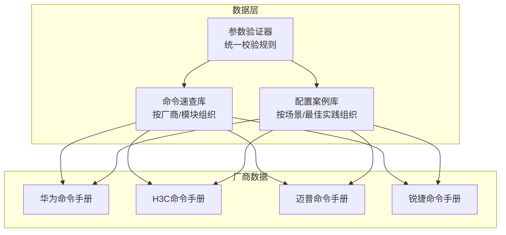
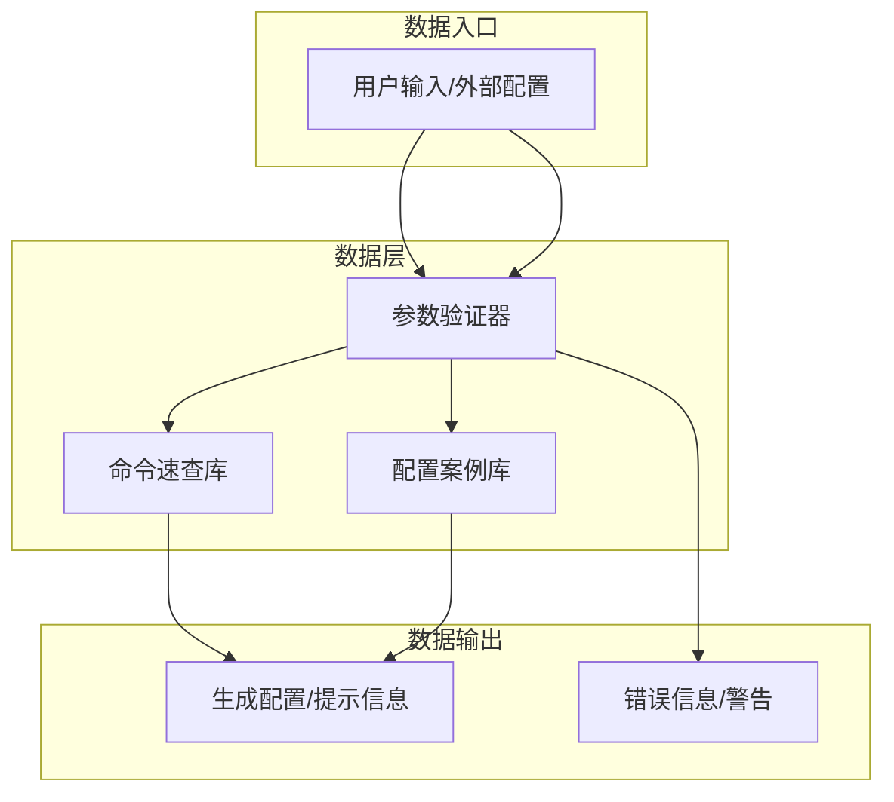
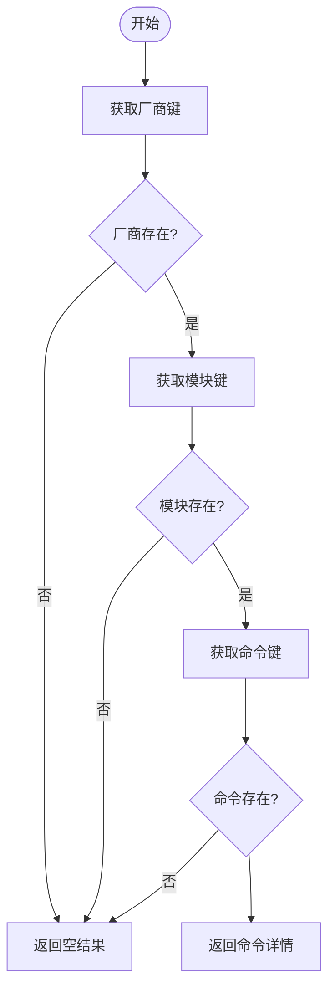
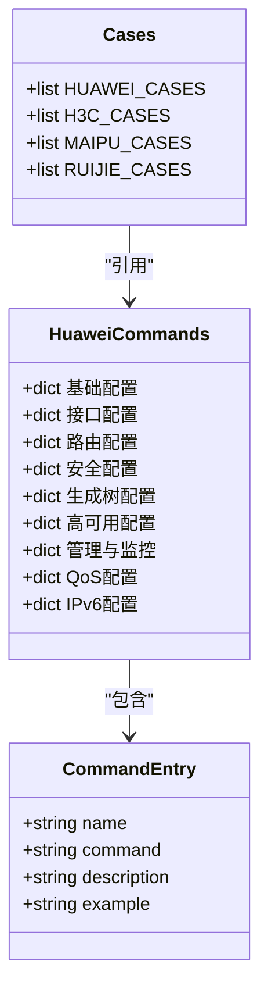
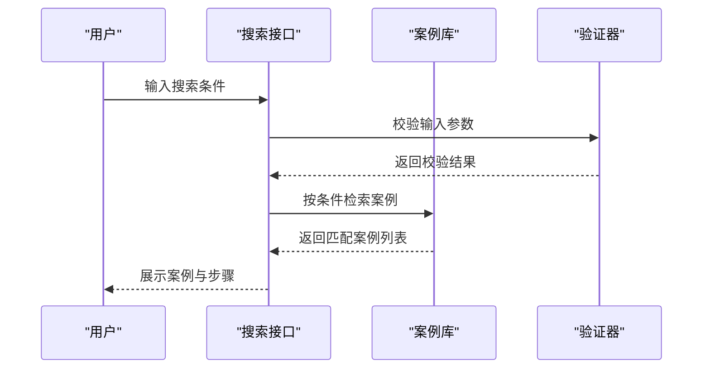
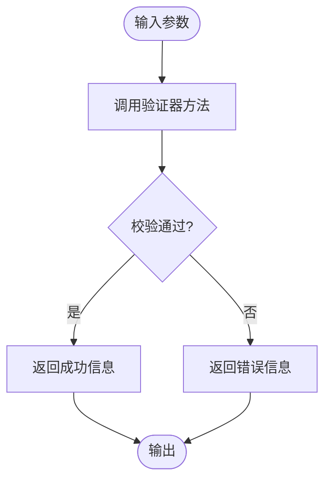
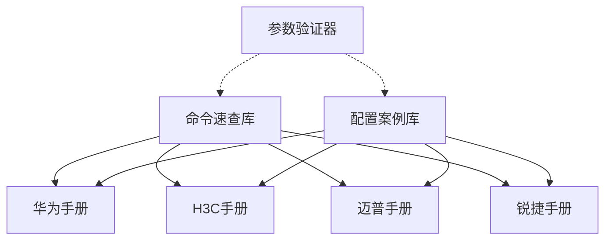

# 数据层设计

<cite>
**本文档引用的文件**
- [cases.py](file://api/app/data/cases.py)
- [huawei.py](file://api/app/data/manual/huawei.py)
- [h3c.py](file://api/app/data/manual/h3c.py)
- [maipu.py](file://api/app/data/manual/maipu.py)
- [ruijie.py](file://api/app/data/manual/ruijie.py)
- [validator.py](file://api/app/core/validator.py)
</cite>

## 目录
1. [简介](#简介)
2. [项目结构](#项目结构)
3. [核心组件](#核心组件)
4. [架构总览](#架构总览)
5. [详细组件分析](#详细组件分析)
6. [依赖关系分析](#依赖关系分析)
7. [性能考虑](#性能考虑)
8. [故障排除指南](#故障排除指南)
9. [结论](#结论)
10. [附录](#附录)

## 简介
本文件面向数据层设计，聚焦以下主题：
- 命令速查库：按厂商分层的命令手册数据结构与存储机制
- 配置案例库：分类体系、检索机制与最佳实践
- 参数验证器：验证规则、错误处理与扩展方法
- 数据更新流程、版本管理与缓存策略
- 数据扩展与自定义方法指导

## 项目结构
数据层主要由三类数据构成：
- 厂商命令速查库：按厂商与功能模块组织的命令手册
- 配置案例库：按场景编排的配置步骤与最佳实践
- 参数验证器：统一的输入校验与错误反馈

**图表来源**
- [cases.py:7-324](file://api/app/data/cases.py#L7-L324)
- [huawei.py:7-342](file://api/app/data/manual/huawei.py#L7-L342)
- [h3c.py:7-333](file://api/app/data/manual/h3c.py#L7-L333)
- [maipu.py:16-328](file://api/app/data/manual/maipu.py#L16-L328)
- [ruijie.py:16-1805](file://api/app/data/manual/ruijie.py#L16-L1805)

**章节来源**
- [cases.py:1-377](file://api/app/data/cases.py#L1-L377)
- [huawei.py:1-703](file://api/app/data/manual/huawei.py#L1-L703)
- [h3c.py:1-710](file://api/app/data/manual/h3c.py#L1-L710)
- [maipu.py:1-634](file://api/app/data/manual/maipu.py#L1-L634)
- [ruijie.py:1-2045](file://api/app/data/manual/ruijie.py#L1-L2045)

## 核心组件
- 命令速查库（COMMAND_REFERENCES）
  - 结构：厂商 → 功能模块 → 具体命令条目
  - 字段：command、description、example、category
  - 用途：快速检索厂商命令、生成配置模板
- 配置案例库（BEST_PRACTICES、SHORTCUTS）
  - BEST_PRACTICES：安全基线、网络设计、运维管理三大类
  - SHORTCUTS：通用快捷键与视图切换
- 厂商命令手册（HUAWEI_COMMANDS、H3C_COMMANDS、MAIPU_COMMANDS、RUIJIE_COMMANDS）
  - 结构：功能模块 → 子模块 → 命令条目（不同厂商采用不同结构）
  - 用途：详尽命令参考、命令示例与分组
- 配置案例（HUAWEI_CASES、H3C_CASES、MAIPU_CASES、RUIJIE_CASES）
  - 结构：标题、描述、步骤数组
  - 用途：端到端配置流程、最佳实践
- 参数验证器（ConfigValidator）
  - 能力：IP、子网掩码、VLAN、接口、MAC、主机名、密码、端口、AS号、通配掩码等
  - 用途：输入合法性校验、错误信息反馈

**章节来源**
- [cases.py:7-377](file://api/app/data/cases.py#L7-L377)
- [huawei.py:7-703](file://api/app/data/manual/huawei.py#L7-L703)
- [h3c.py:7-710](file://api/app/data/manual/h3c.py#L7-L710)
- [maipu.py:16-634](file://api/app/data/manual/maipu.py#L16-L634)
- [ruijie.py:16-2045](file://api/app/data/manual/ruijie.py#L16-L2045)
- [validator.py:11-208](file://api/app/core/validator.py#L11-L208)

## 架构总览
数据层采用“厂商分层 + 场景化案例 + 统一校验”的架构：
- 厂商命令速查库提供标准化的命令数据结构
- 配置案例库提供可执行的配置流程
- 参数验证器贯穿数据输入阶段，确保数据质量

**图表来源**
- [validator.py:11-208](file://api/app/core/validator.py#L11-L208)
- [cases.py:7-377](file://api/app/data/cases.py#L7-L377)
- [huawei.py:7-703](file://api/app/data/manual/huawei.py#L7-L703)

## 详细组件分析

### 命令速查库（COMMAND_REFERENCES）
- 数据结构
  - 顶层键：厂商标识（"huawei"、"h3c"、"ruijie"、"maipu"）
  - 二级键：功能模块（如"基础配置"、"VLAN配置"、"路由配置"等）
  - 三级键：具体命令条目，包含字段：command、description、example、category
- 索引策略
  - 通过嵌套字典键序列快速定位命令
  - category字段可用于按功能分类检索
- 查询优化
  - 使用has_key/contains减少重复查找
  - 对高频查询可构建倒排索引（厂商→模块→命令名）以加速检索
- 扩展方法
  - 新增厂商：在顶层新增键，按现有结构填充
  - 新增模块：在对应厂商下新增模块键
  - 新增命令：在模块下新增命令条目，补充字段

**图表来源**
- [cases.py:7-324](file://api/app/data/cases.py#L7-L324)

**章节来源**
- [cases.py:7-324](file://api/app/data/cases.py#L7-L324)

### 厂商命令手册（HUAWEI_COMMANDS/H3C_COMMANDS/MAIPU_COMMANDS/RUIJIE_COMMANDS）
- 数据结构差异
  - 华为/H3C：采用"功能模块→子模块→命令条目"的二维结构
  - 锐捷/迈普：采用"功能模块→命令条目列表"的一维结构
- 组织方式
  - 按功能域分层，便于按需检索
  - 每个条目包含name、command、description、example
- 查询优化
  - 可将二维结构扁平化为(模块, 子模块, 名称)→命令的映射
  - 支持模糊匹配与关键词检索

**图表来源**
- [huawei.py:7-342](file://api/app/data/manual/huawei.py#L7-L342)
- [h3c.py:7-333](file://api/app/data/manual/h3c.py#L7-L333)
- [maipu.py:16-328](file://api/app/data/manual/maipu.py#L16-L328)
- [ruijie.py:16-1805](file://api/app/data/manual/ruijie.py#L16-L1805)

**章节来源**
- [huawei.py:7-703](file://api/app/data/manual/huawei.py#L7-L703)
- [h3c.py:7-710](file://api/app/data/manual/h3c.py#L7-L710)
- [maipu.py:16-634](file://api/app/data/manual/maipu.py#L16-L634)
- [ruijie.py:16-2045](file://api/app/data/manual/ruijie.py#L16-L2045)

### 配置案例库（BEST_PRACTICES/SHORTCUTS + 各厂商CASES）
- 分类体系
  - BEST_PRACTICES：安全基线、网络设计、运维管理
  - SHORTCUTS：通用快捷键、视图切换
  - 各厂商CASES：按场景编排的完整配置步骤
- 检索机制
  - 按类别筛选（category字段）
  - 按关键词搜索（标题/描述/步骤）
  - 按厂商过滤
- 查询优化
  - 构建索引：(类别, 关键词)→案例集合
  - 步骤文本向量化支持语义检索

**图表来源**
- [cases.py:327-377](file://api/app/data/cases.py#L327-L377)
- [validator.py:11-208](file://api/app/core/validator.py#L11-L208)

**章节来源**
- [cases.py:327-377](file://api/app/data/cases.py#L327-L377)

### 参数验证器（ConfigValidator）
- 验证规则
  - IP地址、子网掩码、VLAN ID/名称、接口名称、MAC地址、主机名、密码强度、端口、AS号、通配掩码
- 错误处理
  - 统一返回(Tuple[bool, str])，便于前端展示
  - 提供validate_and_show_errors辅助函数
- 扩展方法
  - 新增规则：在ConfigValidator中添加新方法
  - 自定义错误消息：在调用处封装validate_and_show_errors

**图表来源**
- [validator.py:11-208](file://api/app/core/validator.py#L11-L208)

**章节来源**
- [validator.py:11-208](file://api/app/core/validator.py#L11-L208)

## 依赖关系分析
- 命令速查库与厂商命令手册相互独立，但共享相同的字段约定
- 配置案例库依赖厂商命令手册以生成步骤
- 参数验证器独立于其他模块，可被任意模块调用

**图表来源**
- [cases.py:7-324](file://api/app/data/cases.py#L7-L324)
- [huawei.py:7-342](file://api/app/data/manual/huawei.py#L7-L342)
- [h3c.py:7-333](file://api/app/data/manual/h3c.py#L7-L333)
- [maipu.py:16-328](file://api/app/data/manual/maipu.py#L16-L328)
- [ruijie.py:16-1805](file://api/app/data/manual/ruijie.py#L16-L1805)
- [validator.py:11-208](file://api/app/core/validator.py#L11-L208)

**章节来源**
- [cases.py:7-324](file://api/app/data/cases.py#L7-L324)
- [validator.py:11-208](file://api/app/core/validator.py#L11-L208)

## 性能考虑
- 数据结构选择
  - 嵌套字典适合精确键值查找；若需频繁遍历，可考虑列表+索引
- 查询优化
  - 为高频字段（如category、name）建立倒排索引
  - 对大字段（如example）可延迟加载
- 缓存策略
  - 对热点命令与案例设置内存缓存
  - 版本号控制缓存失效
- 并发访问
  - 读多写少场景下使用只读锁
  - 写操作采用原子替换或版本控制

## 故障排除指南
- 常见问题
  - 命令缺失：检查厂商键与模块键是否存在
  - 格式错误：使用参数验证器校验输入
  - 案例不适用：核对厂商与版本差异
- 排错流程
  - 确认输入参数通过验证器
  - 根据category过滤命令
  - 对比厂商手册示例
  - 查看错误信息并修正

**章节来源**
- [validator.py:11-208](file://api/app/core/validator.py#L11-L208)
- [cases.py:7-324](file://api/app/data/cases.py#L7-L324)

## 结论
数据层通过“厂商分层 + 场景化案例 + 统一校验”实现了命令速查、案例检索与参数校验的协同工作。建议在现有结构基础上引入索引与缓存机制，进一步提升查询性能与用户体验。

## 附录

### 数据更新流程与版本管理
- 更新流程
  - 新增/修改命令：在对应厂商手册中更新
  - 新增案例：在对应厂商CASES中追加
  - 规则变更：更新参数验证器
- 版本管理
  - 为每个厂商手册与案例库维护版本号
  - 通过版本号控制缓存与渲染逻辑

### 缓存策略
- 命令速查缓存：按厂商+模块维度缓存
- 案例缓存：按类别+关键词维度缓存
- 失效策略：版本号变化或定时刷新

### 数据扩展与自定义
- 新增厂商
  - 在命令速查库与案例库中添加新厂商键
  - 提供该厂商的手册与案例
- 新增模块/命令
  - 在既有结构中扩展
  - 补充字段与示例
- 自定义验证规则
  - 在ConfigValidator中新增方法
  - 使用validate_and_show_errors封装错误信息

**章节来源**
- [cases.py:7-377](file://api/app/data/cases.py#L7-L377)
- [validator.py:11-208](file://api/app/core/validator.py#L11-L208)