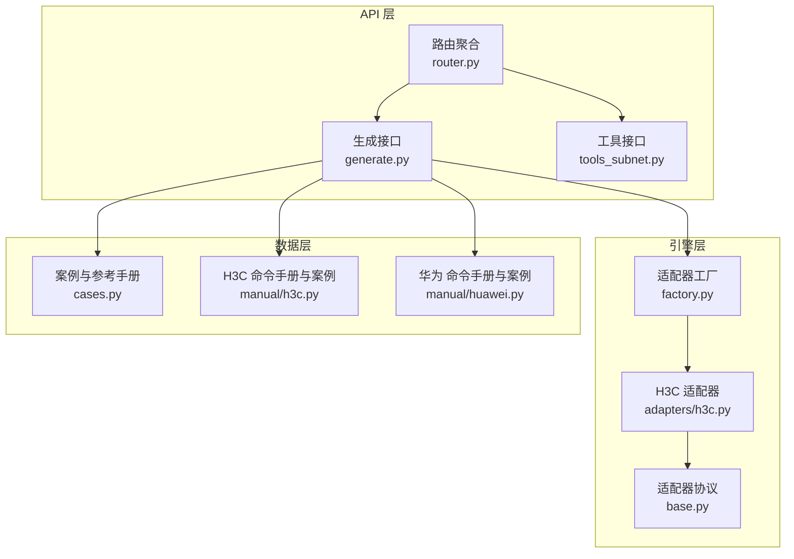
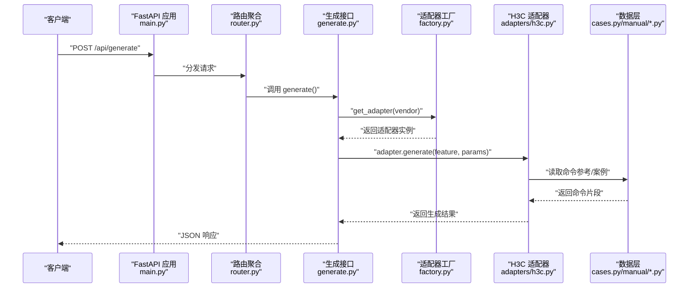
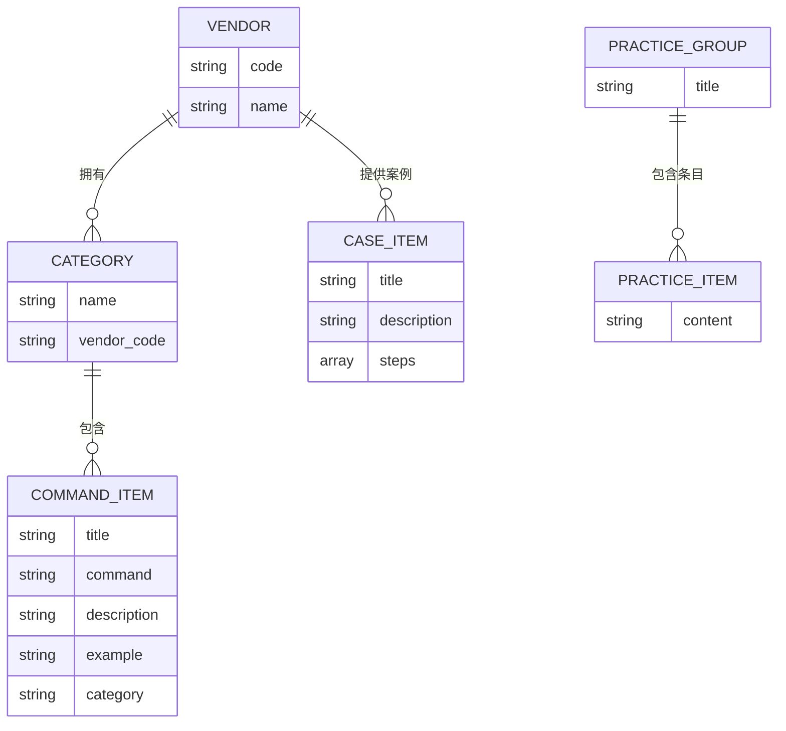
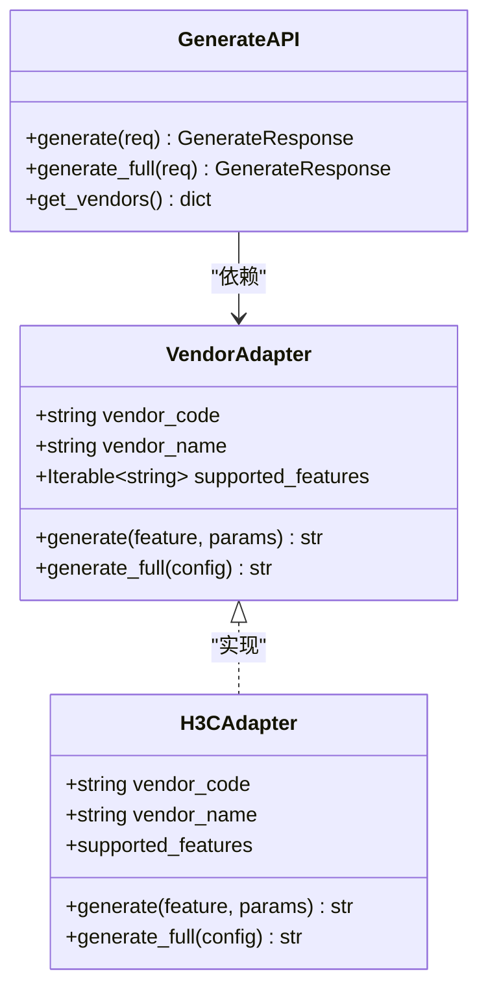
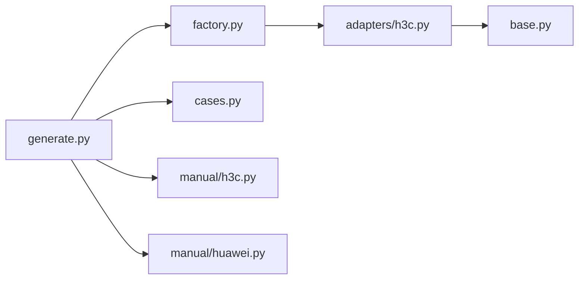

# 配置案例库

<cite>
**本文档引用的文件**
- [cases.py](file://api/app/data/cases.py)
- [h3c.py](file://api/app/data/manual/h3c.py)
- [huawei.py](file://api/app/data/manual/huawei.py)
- [factory.py](file://api/app/engine/factory.py)
- [base.py](file://api/app/engine/base.py)
- [h3c.py](file://api/app/engine/adapters/h3c.py)
- [generate.py](file://api/app/api/generate.py)
- [router.py](file://api/app/api/router.py)
- [main.py](file://api/app/main.py)
</cite>

## 目录
1. [简介](#简介)
2. [项目结构](#项目结构)
3. [核心组件](#核心组件)
4. [架构总览](#架构总览)
5. [详细组件分析](#详细组件分析)
6. [依赖分析](#依赖分析)
7. [性能考虑](#性能考虑)
8. [故障排除指南](#故障排除指南)
9. [结论](#结论)
10. [附录](#附录)

## 简介
本文件面向“配置案例库”的技术文档，围绕配置案例的数据结构、分类体系、组织方式、检索与推荐机制、生命周期与版本控制、质量评估、贡献与审核流程，以及案例API的设计思路与应用场景进行系统化说明。文档同时结合仓库中的命令参考手册与生成引擎，给出可落地的实现与扩展建议。

## 项目结构
配置案例库主要由以下模块构成：
- 数据层：厂商命令参考与案例集合（命令参考手册、最佳实践、快捷键）
- 引擎层：厂商适配器与生成器抽象，负责将配置参数映射为具体命令
- API 层：FastAPI 提供的 REST 接口，支持按特性生成命令片段与完整配置脚本
- 工具层：网络工具（如子网计算、端口扫描等），与案例库协同使用

**图表来源**
- [generate.py:1-77](file://api/app/api/generate.py#L1-L77)
- [router.py:1-10](file://api/app/api/router.py#L1-L10)
- [factory.py:1-39](file://api/app/engine/factory.py#L1-L39)
- [base.py:1-36](file://api/app/engine/base.py#L1-L36)
- [h3c.py:1-42](file://api/app/engine/adapters/h3c.py#L1-L42)
- [cases.py:1-377](file://api/app/data/cases.py#L1-L377)
- [h3c.py:1-710](file://api/app/data/manual/h3c.py#L1-L710)
- [huawei.py:1-703](file://api/app/data/manual/huawei.py#L1-L703)

**章节来源**
- [generate.py:1-77](file://api/app/api/generate.py#L1-L77)
- [router.py:1-10](file://api/app/api/router.py#L1-L10)
- [factory.py:1-39](file://api/app/engine/factory.py#L1-L39)
- [base.py:1-36](file://api/app/engine/base.py#L1-L36)
- [h3c.py:1-42](file://api/app/engine/adapters/h3c.py#L1-L42)
- [cases.py:1-377](file://api/app/data/cases.py#L1-L377)
- [h3c.py:1-710](file://api/app/data/manual/h3c.py#L1-L710)
- [huawei.py:1-703](file://api/app/data/manual/huawei.py#L1-L703)

## 核心组件
- 案例与参考手册
  - COMMAND_REFERENCES：按厂商与分类组织的命令参考手册，包含命令、示例、描述与分类字段
  - HUAWEI_CASES/H3C_CASES：厂商提供的完整配置案例，采用步骤序列化格式
  - BEST_PRACTICES：最佳实践清单
  - SHORTCUTS：通用快捷键与视图切换
- 引擎与适配器
  - VendorAdapter 协议：定义厂商适配器的统一接口（vendor_code、vendor_name、supported_features、generate、generate_full）
  - H3CAdapter：将特性码映射到 H3CConfigGenerator 的静态方法，提供 generate 与 generate_full
  - 工厂函数 get_adapter/list_vendors：按厂商代码获取适配器并列出支持厂商
- API 接口
  - /api/generate：按 vendor + feature + params 生成单个特性命令片段
  - /api/generate/full：按 vendor + config 生成完整配置脚本
  - /api/vendors：列出支持厂商及特性码

**章节来源**
- [cases.py:7-324](file://api/app/data/cases.py#L7-L324)
- [h3c.py:335-710](file://api/app/data/manual/h3c.py#L335-L710)
- [huawei.py:344-703](file://api/app/data/manual/huawei.py#L344-L703)
- [base.py:11-27](file://api/app/engine/base.py#L11-L27)
- [h3c.py:14-42](file://api/app/engine/adapters/h3c.py#L14-L42)
- [factory.py:20-38](file://api/app/engine/factory.py#L20-L38)
- [generate.py:21-76](file://api/app/api/generate.py#L21-L76)

## 架构总览
配置案例库的调用链路如下：客户端通过 API 请求 → 路由聚合 → 生成接口 → 适配器工厂 → 适配器 → 生成器 → 返回命令字符串。数据层提供命令参考与案例，API 层负责参数校验与错误处理。

**图表来源**
- [main.py:1-29](file://api/app/main.py#L1-L29)
- [router.py:1-10](file://api/app/api/router.py#L1-L10)
- [generate.py:53-76](file://api/app/api/generate.py#L53-L76)
- [factory.py:20-26](file://api/app/engine/factory.py#L20-L26)
- [h3c.py:32-38](file://api/app/engine/adapters/h3c.py#L32-L38)
- [cases.py:7-324](file://api/app/data/cases.py#L7-L324)
- [h3c.py:335-710](file://api/app/data/manual/h3c.py#L335-L710)
- [huawei.py:344-703](file://api/app/data/manual/huawei.py#L344-L703)

## 详细组件分析

### 数据结构与分类体系
- 厂商命令参考手册（COMMAND_REFERENCES）
  - 结构：厂商 → 分类 → 子项 → 字段（command/description/example/category）
  - 作用：提供命令模板、示例与分类，支撑案例生成与检索
- 厂商案例（HUAWEI_CASES/H3C_CASES）
  - 结构：每个案例包含 title/description/steps
  - 步骤序列化格式：以“# 步骤编号”开头的字符串数组，逐行表示命令或注释
- 最佳实践（BEST_PRACTICES）
  - 结构：title + items 列表，用于质量评估与推荐
- 快捷键（SHORTCUTS）
  - 结构：分组 → 键位到说明的映射，辅助用户操作

**图表来源**
- [cases.py:7-324](file://api/app/data/cases.py#L7-L324)
- [h3c.py:335-710](file://api/app/data/manual/h3c.py#L335-L710)
- [huawei.py:344-703](file://api/app/data/manual/huawei.py#L344-L703)

**章节来源**
- [cases.py:7-377](file://api/app/data/cases.py#L7-L377)
- [h3c.py:335-710](file://api/app/data/manual/h3c.py#L335-L710)
- [huawei.py:344-703](file://api/app/data/manual/huawei.py#L344-L703)

### 案例元数据设计
- 标题（title）：简洁描述案例目标
- 描述（description）：说明适用场景与预期效果
- 适用场景：通过分类字段（category）与特性码（feature）关联，便于检索与推荐
- 步骤序列化格式：以“# 步骤编号”为起始的有序字符串数组，支持注释与命令混合
- 模板化结构：案例可作为模板，通过参数化（例如 VLAN ID、网段、设备名）生成定制化配置

**章节来源**
- [cases.py:335-377](file://api/app/data/cases.py#L335-L377)
- [h3c.py:335-710](file://api/app/data/manual/h3c.py#L335-L710)
- [huawei.py:344-703](file://api/app/data/manual/huawei.py#L344-L703)

### 检索机制与关键词匹配
- 基于分类与特性码的检索
  - COMMAND_REFERENCES 中的 category 字段可用于快速筛选
  - API 层通过 feature 参数与适配器的 supported_features 进行匹配
- 关键词匹配算法建议
  - 对 title/description/command/example 进行分词与 TF-IDF 或 BM25 计算
  - 支持模糊匹配与正则表达式，提升召回率
  - 多关键字组合打分，按相关度排序
- 相关案例推荐策略
  - 基于案例的分类与关键词向量相似度
  - 基于最佳实践（BEST_PRACTICES）的标签共现
  - 历史使用与反馈（如评分/收藏）加权

**章节来源**
- [cases.py:7-324](file://api/app/data/cases.py#L7-L324)
- [generate.py:21-40](file://api/app/api/generate.py#L21-L40)

### 生命周期管理、版本控制与质量评估
- 生命周期管理
  - 创建：新增厂商命令与案例，完善分类与元数据
  - 审核：通过单元测试与集成测试验证命令正确性
  - 发布：随版本号发布，标注兼容的设备型号与软件版本
  - 维护：根据厂商固件更新调整命令，迁移过时命令
- 版本控制
  - 使用语义化版本（主.次.补丁），在 API 层体现版本号
  - 保持向后兼容，新增特性以新特性码或新字段形式扩展
- 质量评估标准
  - 命令正确性：覆盖常见网络场景与边界条件
  - 文档完整性：title/description/example 一致且清晰
  - 最佳实践一致性：符合 BEST_PRACTICES 中的安全与可维护性要求
  - 性能与稳定性：避免冗余命令与冲突配置

**章节来源**
- [base.py:11-27](file://api/app/engine/base.py#L11-L27)
- [generate.py:48-50](file://api/app/api/generate.py#L48-L50)

### 案例贡献流程、审核机制与维护策略
- 贡献流程
  - 新增厂商：在适配器工厂注册新适配器，并完善 supported_features
  - 新增命令与案例：在 manual/*.py 中补充 COMMAND_REFERENCES 与案例
  - 编写测试：针对关键命令与案例编写测试用例
- 审核机制
  - 代码审查：确保适配器实现遵循协议，错误处理完备
  - 自动化测试：覆盖命令生成、参数校验与错误分支
  - 手工验证：在模拟环境执行生成的命令片段，验证可达性与一致性
- 维护策略
  - 定期巡检：检查命令手册与案例是否与最新固件一致
  - 用户反馈：收集问题与改进建议，形成迭代计划

**章节来源**
- [factory.py:14-17](file://api/app/engine/factory.py#L14-L17)
- [h3c.py:18-26](file://api/app/engine/adapters/h3c.py#L18-L26)
- [generate.py:53-76](file://api/app/api/generate.py#L53-L76)

### 案例 API 设计思路与应用场景
- 设计思路
  - 统一接口：VendorAdapter 协议保证不同厂商的一致调用方式
  - 参数化生成：generate 与 generate_full 将配置参数映射为命令
  - 错误处理：明确 VendorNotSupported/FeatureNotSupported 与通用异常
  - 前后端协作：/api/vendors 提供厂商与特性码列表，驱动前端选择
- 实际应用场景
  - 快速生成 VLAN、路由、安全、接口等特性命令片段
  - 一键生成完整配置脚本，减少手工输入错误
  - 与网络工具（子网计算、连通性测试）结合，形成端到端自动化

**图表来源**
- [base.py:11-27](file://api/app/engine/base.py#L11-L27)
- [h3c.py:14-42](file://api/app/engine/adapters/h3c.py#L14-L42)
- [generate.py:21-76](file://api/app/api/generate.py#L21-L76)

**章节来源**
- [base.py:11-27](file://api/app/engine/base.py#L11-L27)
- [h3c.py:14-42](file://api/app/engine/adapters/h3c.py#L14-L42)
- [generate.py:21-76](file://api/app/api/generate.py#L21-L76)

## 依赖分析
- 组件耦合
  - API 层仅依赖适配器工厂与适配器协议，耦合度低，易于扩展新厂商
  - 适配器依赖生成器（此处为 H3CConfigGenerator），通过静态方法映射特性码
  - 数据层独立于引擎与 API，便于维护与版本化
- 外部依赖
  - FastAPI：提供路由与响应模型
  - Python typing：类型提示增强可维护性

**图表来源**
- [generate.py:15-16](file://api/app/api/generate.py#L15-L16)
- [factory.py:11-12](file://api/app/engine/factory.py#L11-L12)
- [h3c.py:10-11](file://api/app/engine/adapters/h3c.py#L10-L11)
- [base.py:8-9](file://api/app/engine/base.py#L8-L9)
- [cases.py:1-377](file://api/app/data/cases.py#L1-L377)
- [h3c.py:1-710](file://api/app/data/manual/h3c.py#L1-L710)
- [huawei.py:1-703](file://api/app/data/manual/huawei.py#L1-L703)

**章节来源**
- [generate.py:15-16](file://api/app/api/generate.py#L15-L16)
- [factory.py:11-12](file://api/app/engine/factory.py#L11-L12)
- [h3c.py:10-11](file://api/app/engine/adapters/h3c.py#L10-L11)
- [base.py:8-9](file://api/app/engine/base.py#L8-L9)

## 性能考虑
- 命令生成性能
  - 适配器为无状态对象，可复用，降低实例化开销
  - 生成逻辑尽量避免重复计算，参数化生成减少字符串拼接成本
- 检索与推荐性能
  - 建议对 COMMAND_REFERENCES 与案例构建倒排索引，加速关键词匹配
  - 使用缓存（如 Redis）缓存热门查询结果与生成脚本
- API 性能
  - 控制响应体大小，必要时分页返回案例列表
  - 启用 GZip 压缩与异步处理长耗时任务

## 故障排除指南
- 常见错误
  - 厂商不支持：检查 /api/vendors 返回的厂商列表，确认 vendor 是否正确
  - 特性码不支持：检查适配器的 supported_features，确认 feature 是否存在
  - 生成异常：捕获通用异常并返回 500，同时记录日志定位问题
- 排查步骤
  - 核对请求参数：vendor、feature、params/config
  - 检查适配器工厂是否成功获取适配器
  - 验证生成器内部逻辑与命令手册一致性
  - 使用最小化配置复现问题，逐步缩小范围

**章节来源**
- [generate.py:53-76](file://api/app/api/generate.py#L53-L76)
- [factory.py:20-26](file://api/app/engine/factory.py#L20-L26)

## 结论
配置案例库通过统一的适配器协议与参数化生成机制，实现了多厂商命令的标准化输出。结合命令参考手册、案例与最佳实践，能够高效支撑网络配置的自动化生成与管理。建议在现有基础上完善检索与推荐算法、引入版本控制与质量评估体系，并持续扩展厂商与特性覆盖，以满足更大规模的生产环境需求。

## 附录
- API 端点概览
  - GET /api/vendors：列出支持厂商与特性码
  - POST /api/generate：按特性生成命令片段
  - POST /api/generate/full：生成完整配置脚本
- 数据字段参考
  - COMMAND_REFERENCES：command/description/example/category
  - 案例：title/description/steps
  - 最佳实践：title/items