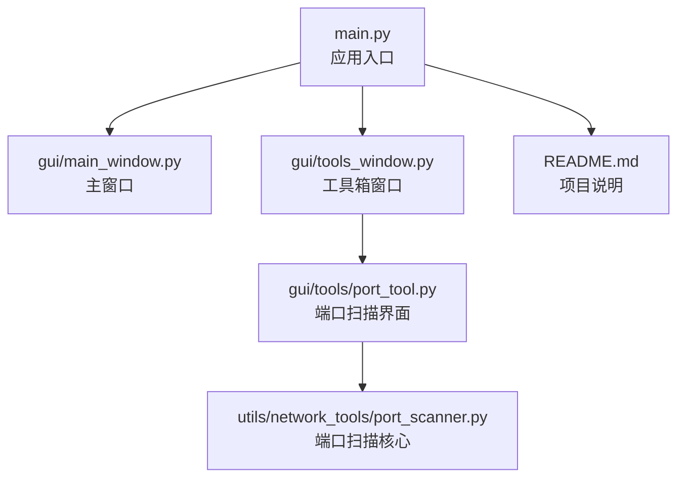
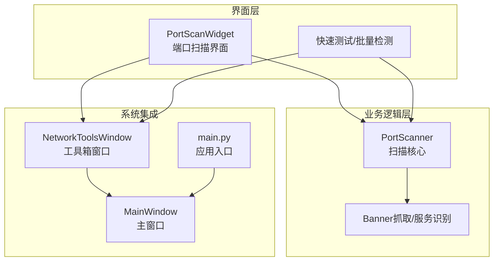
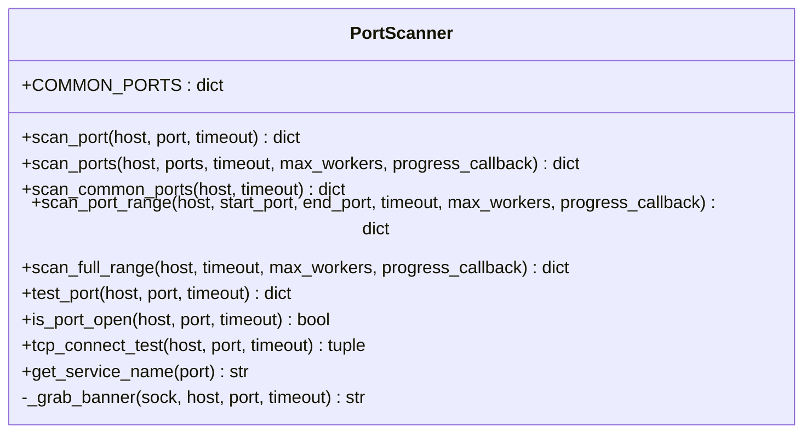
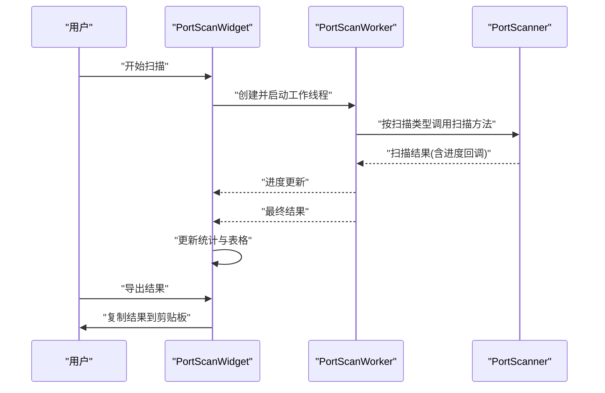
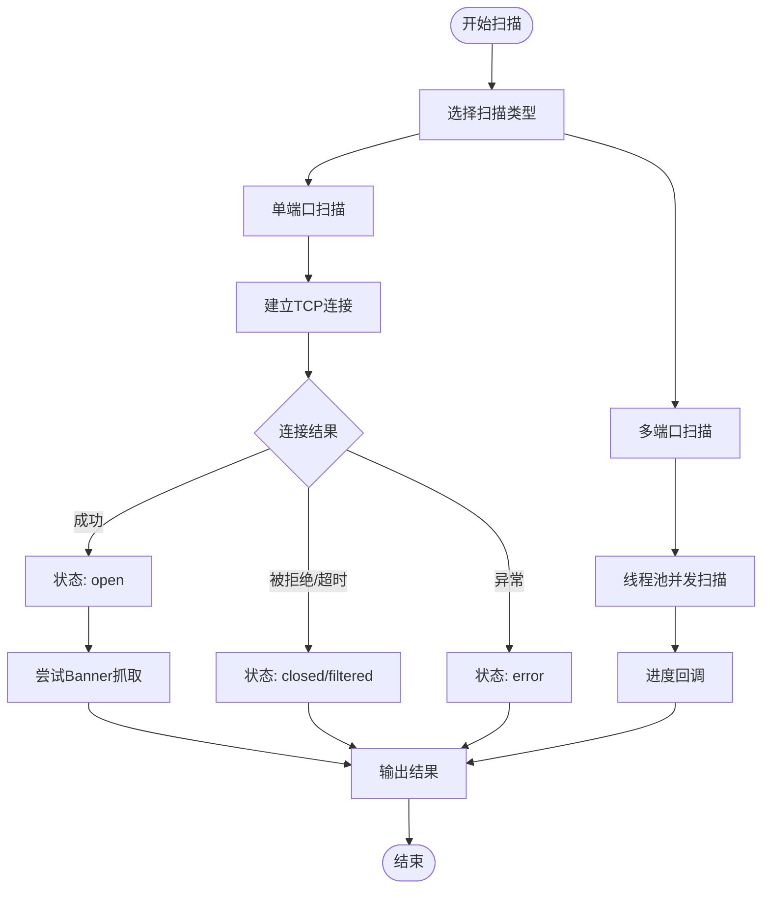
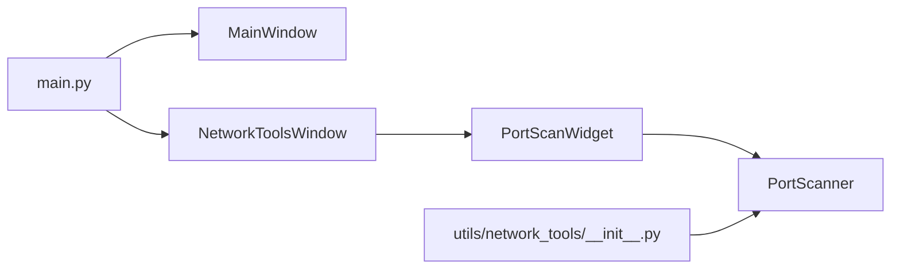

# 端口扫描工具

<cite>
**本文档引用的文件**
- [port_scanner.py](file://opensource/NetOps-toolkit/utils/network_tools/port_scanner.py)
- [port_tool.py](file://opensource/NetOps-toolkit/gui/tools/port_tool.py)
- [main.py](file://opensource/NetOps-toolkit/main.py)
- [README.md](file://opensource/NetOps-toolkit/README.md)
- [tools_window.py](file://opensource/NetOps-toolkit/gui/tools_window.py)
- [main_window.py](file://opensource/NetOps-toolkit/gui/main_window.py)
- [__init__.py](file://opensource/NetOps-toolkit/utils/network_tools/__init__.py)
</cite>

## 目录
1. [简介](#简介)
2. [项目结构](#项目结构)
3. [核心组件](#核心组件)
4. [架构总览](#架构总览)
5. [详细组件分析](#详细组件分析)
6. [依赖关系分析](#依赖关系分析)
7. [性能考量](#性能考量)
8. [故障排除指南](#故障排除指南)
9. [结论](#结论)
10. [附录](#附录)

## 简介
本文件为端口扫描工具的详细使用指南，面向需要进行网络端口扫描的用户与安全从业者。该工具基于 Python + PyQt5 实现，提供图形化界面，支持 TCP 端口扫描、常用端口扫描、快速扫描、指定范围扫描以及全端口扫描，并具备进度反馈、结果导出、快速端口测试与批量端口检测能力。工具同时提供 Banner 抓取与服务识别，辅助进行服务发现与安全评估。

## 项目结构
该项目采用模块化组织，核心网络工具位于 utils/network_tools，图形界面位于 gui，入口程序位于根目录。

图表来源
- [main.py:1-69](file://opensource/NetOps-toolkit/main.py#L1-L69)
- [tools_window.py:1-77](file://opensource/NetOps-toolkit/gui/tools_window.py#L1-L77)
- [port_tool.py:1-527](file://opensource/NetOps-toolkit/gui/tools/port_tool.py#L1-L527)
- [port_scanner.py:1-315](file://opensource/NetOps-toolkit/utils/network_tools/port_scanner.py#L1-L315)
- [README.md:1-236](file://opensource/NetOps-toolkit/README.md#L1-L236)

章节来源
- [main.py:1-69](file://opensource/NetOps-toolkit/main.py#L1-L69)
- [README.md:107-153](file://opensource/NetOps-toolkit/README.md#L107-L153)

## 核心组件
- 端口扫描核心类：PortScanner
  - 提供单端口扫描、多端口扫描、常用端口扫描、端口范围扫描、全端口扫描等能力
  - 支持 Banner 抓取与服务识别
  - 支持超时控制与并发控制
- 图形界面组件：PortScanWidget
  - 提供扫描类型选择（常用端口、快速扫描、指定范围、全端口）
  - 支持超时设置、进度条、结果表格展示
  - 支持快速端口测试与批量端口检测
  - 支持结果导出到剪贴板

章节来源
- [port_scanner.py:14-315](file://opensource/NetOps-toolkit/utils/network_tools/port_scanner.py#L14-L315)
- [port_tool.py:64-527](file://opensource/NetOps-toolkit/gui/tools/port_tool.py#L64-L527)

## 架构总览
端口扫描工具采用“界面层 + 业务逻辑层”的分层架构：
- 界面层：PyQt5 控件与窗口，负责用户交互与结果显示
- 业务逻辑层：PortScanner 类封装扫描算法、并发控制、状态判断与结果统计
- 工具箱集成：通过工具箱窗口统一承载端口扫描、Ping、路由跟踪等网络工具

图表来源
- [port_tool.py:64-527](file://opensource/NetOps-toolkit/gui/tools/port_tool.py#L64-L527)
- [port_scanner.py:14-315](file://opensource/NetOps-toolkit/utils/network_tools/port_scanner.py#L14-L315)
- [tools_window.py:28-77](file://opensource/NetOps-toolkit/gui/tools_window.py#L28-L77)
- [main_window.py:498-548](file://opensource/NetOps-toolkit/gui/main_window.py#L498-L548)
- [main.py:25-69](file://opensource/NetOps-toolkit/main.py#L25-L69)

## 详细组件分析

### 端口扫描核心类 PortScanner
- 常用端口集合：内置常见服务端口映射，用于识别服务类型
- 单端口扫描：返回端口状态、服务名、Banner（部分协议）
- 多端口扫描：基于线程池并发扫描，支持进度回调
- 扫描策略：
  - 常用端口：Top 100 常见端口
  - 快速扫描：1-1024 端口
  - 指定范围：用户自定义起止端口
  - 全端口：1-65535 端口
- 状态识别：open/closed/filtered/error
- Banner 抓取：针对特定端口发送简单请求以尝试获取服务标识
- TCP 连接测试：用于验证连通性与耗时

图表来源
- [port_scanner.py:14-315](file://opensource/NetOps-toolkit/utils/network_tools/port_scanner.py#L14-L315)

章节来源
- [port_scanner.py:17-41](file://opensource/NetOps-toolkit/utils/network_tools/port_scanner.py#L17-L41)
- [port_scanner.py:44-89](file://opensource/NetOps-toolkit/utils/network_tools/port_scanner.py#L44-L89)
- [port_scanner.py:121-196](file://opensource/NetOps-toolkit/utils/network_tools/port_scanner.py#L121-L196)
- [port_scanner.py:199-221](file://opensource/NetOps-toolkit/utils/network_tools/port_scanner.py#L199-L221)
- [port_scanner.py:224-260](file://opensource/NetOps-toolkit/utils/network_tools/port_scanner.py#L224-L260)
- [port_scanner.py:263-310](file://opensource/NetOps-toolkit/utils/network_tools/port_scanner.py#L263-L310)
- [port_scanner.py:312-315](file://opensource/NetOps-toolkit/utils/network_tools/port_scanner.py#L312-L315)

### 端口扫描界面 PortScanWidget
- 扫描类型选择：常用端口、快速扫描、指定范围、全端口
- 超时设置：控制单次连接超时
- 并发控制：通过线程池最大工作数控制扫描速度
- 进度反馈：实时更新扫描进度百分比与开放端口数量
- 结果展示：表格显示端口、状态、服务、Banner
- 快速测试：单端口连通性测试
- 批量检测：多端口状态检测
- 结果导出：复制扫描结果到剪贴板

图表来源
- [port_tool.py:28-62](file://opensource/NetOps-toolkit/gui/tools/port_tool.py#L28-L62)
- [port_tool.py:355-427](file://opensource/NetOps-toolkit/gui/tools/port_tool.py#L355-L427)
- [port_tool.py:509-527](file://opensource/NetOps-toolkit/gui/tools/port_tool.py#L509-L527)

章节来源
- [port_tool.py:64-340](file://opensource/NetOps-toolkit/gui/tools/port_tool.py#L64-L340)
- [port_tool.py:355-508](file://opensource/NetOps-toolkit/gui/tools/port_tool.py#L355-L508)

### 扫描流程与状态判定
- 端口状态：
  - open：连接成功
  - closed：连接被拒绝或超时
  - filtered：超时或被过滤
  - error：异常错误
- Banner 抓取：针对部分端口发送简单请求以尝试获取服务标识
- 服务识别：基于端口映射表识别常见服务

图表来源
- [port_scanner.py:44-89](file://opensource/NetOps-toolkit/utils/network_tools/port_scanner.py#L44-L89)
- [port_scanner.py:121-196](file://opensource/NetOps-toolkit/utils/network_tools/port_scanner.py#L121-L196)
- [port_scanner.py:92-118](file://opensource/NetOps-toolkit/utils/network_tools/port_scanner.py#L92-L118)

## 依赖关系分析
- 界面层依赖业务逻辑层：PortScanWidget 依赖 PortScanner 进行扫描
- 工具箱窗口依赖界面层：NetworkToolsWindow 将 PortScanWidget 作为标签页
- 应用入口依赖窗口层：main.py 启动主窗口或工具箱窗口
- 网络工具初始化：utils/network_tools/__init__.py 导出 PortScanner

图表来源
- [main.py:25-69](file://opensource/NetOps-toolkit/main.py#L25-L69)
- [tools_window.py:61-72](file://opensource/NetOps-toolkit/gui/tools_window.py#L61-L72)
- [port_tool.py:17-25](file://opensource/NetOps-toolkit/gui/tools/port_tool.py#L17-L25)
- [__init__.py:10-22](file://opensource/NetOps-toolkit/utils/network_tools/__init__.py#L10-L22)

章节来源
- [main.py:25-69](file://opensource/NetOps-toolkit/main.py#L25-L69)
- [tools_window.py:28-77](file://opensource/NetOps-toolkit/gui/tools_window.py#L28-L77)
- [__init__.py:10-22](file://opensource/NetOps-toolkit/utils/network_tools/__init__.py#L10-L22)

## 性能考量
- 并发控制：通过线程池最大工作数控制扫描并发度，避免过度占用系统资源
- 超时设置：合理设置超时时间，平衡扫描速度与准确性
- 扫描策略选择：
  - 常用端口：适合初步探测
  - 快速扫描：适合快速发现开放端口
  - 指定范围：适合精确探测特定端口
  - 全端口：适合全面审计，但耗时较长
- Banner 抓取：仅对部分端口执行，避免影响整体扫描性能

章节来源
- [port_tool.py:114-127](file://opensource/NetOps-toolkit/gui/tools/port_tool.py#L114-L127)
- [port_tool.py:51-58](file://opensource/NetOps-toolkit/gui/tools/port_tool.py#L51-L58)
- [port_scanner.py:121-196](file://opensource/NetOps-toolkit/utils/network_tools/port_scanner.py#L121-L196)

## 故障排除指南
- 扫描无响应或卡顿
  - 检查超时设置是否过小
  - 降低并发数或选择更保守的扫描策略
- 结果为空或很少
  - 检查目标主机可达性
  - 确认防火墙或 IDS/IPS 是否拦截
  - 尝试不同的扫描类型与超时设置
- Banner 抓取失败
  - 部分端口不支持 Banner 抓取
  - 调整超时时间或更换端口
- 导出结果失败
  - 确保有扫描结果
  - 检查剪贴板可用性

章节来源
- [port_scanner.py:75-87](file://opensource/NetOps-toolkit/utils/network_tools/port_scanner.py#L75-L87)
- [port_tool.py:509-527](file://opensource/NetOps-toolkit/gui/tools/port_tool.py#L509-L527)

## 结论
该端口扫描工具提供了从图形界面到核心扫描逻辑的完整实现，支持多种扫描策略与结果展示方式，适用于内网安全审计、服务发现与网络安全测试等场景。通过合理的超时与并发设置，可在保证准确性的前提下提升扫描效率；结合 Banner 抓取与服务识别，有助于进一步评估目标系统的安全状况。

## 附录

### 使用步骤与策略建议
- 常用端口扫描
  - 适用：初步探测常见服务
  - 设置：默认超时即可
- 快速扫描
  - 适用：快速发现开放端口
  - 设置：适当提高并发数
- 指定范围扫描
  - 适用：精确探测特定端口
  - 设置：根据目标服务范围设定起止端口
- 全端口扫描
  - 适用：全面审计
  - 设置：谨慎设置并发数与超时，避免对目标造成过大压力

章节来源
- [port_tool.py:114-127](file://opensource/NetOps-toolkit/gui/tools/port_tool.py#L114-L127)
- [port_tool.py:51-58](file://opensource/NetOps-toolkit/gui/tools/port_tool.py#L51-L58)

### 合规使用与注意事项
- 仅对自有资产或获得授权的系统进行扫描
- 遵守当地法律法规与公司政策
- 合理设置扫描强度，避免对目标系统造成干扰
- 结合其他工具（如 Ping、路由跟踪）进行综合评估
- 注意隐私保护与数据安全

章节来源
- [README.md:155-181](file://opensource/NetOps-toolkit/README.md#L155-L181)